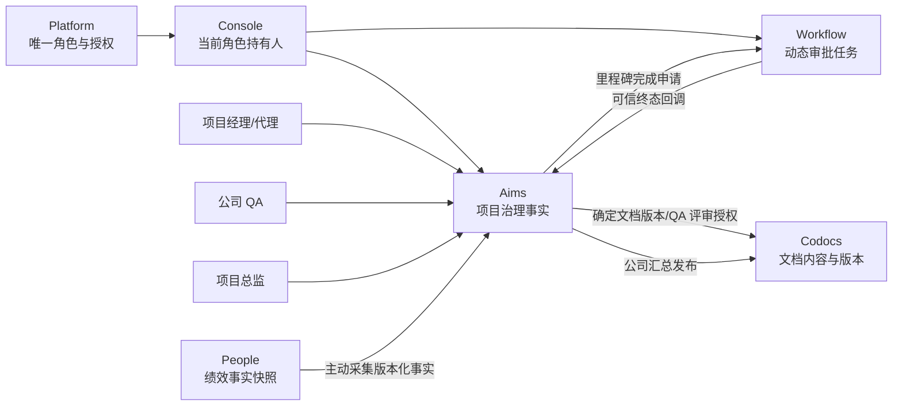
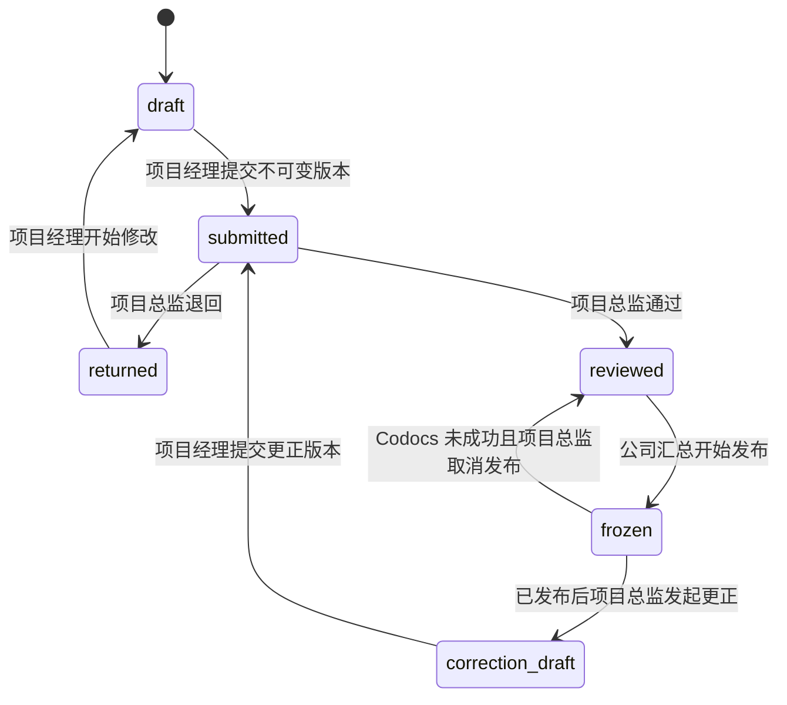
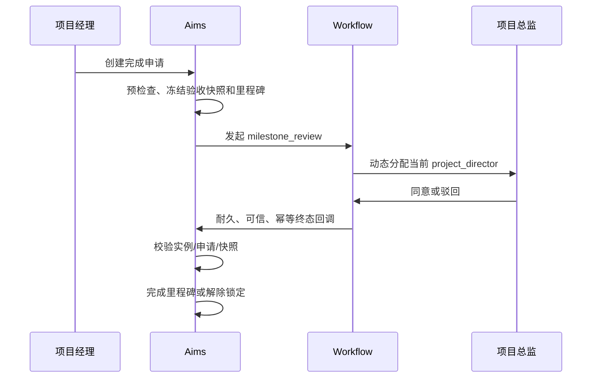

# Aims 项目治理首期可落地实施方案

> 版本：1.0
>
> 日期：2026-07-25
>
> 状态：核心开发已完成，待迁移、配置与两周期试点验收
>
> 决策依据：`memory/2026-07-25-aims-project-management-first-phase-review.md`
>
> 实施范围：Aims 项目周报、工时、项目文档与 QA、里程碑完成审批、公司周报汇总，以及必要的 Platform、Console、Workflow、Codocs、People 兼容改造

## 1. 实施结论

首期按四条闭环推进，不另建一套项目管理系统：

1. **责任闭环**：项目必须有项目经理；项目总监和 QA 为公司级唯一角色；代理项目经理有明确任期。
2. **周报与工时闭环**：项目经理提交不可变周报版本，项目总监独立审阅；成员工时由项目经理审核，履行项目经理职责人员的工时随公司汇总发布确认。
3. **文档与里程碑闭环**：必交文档继续使用 `deliverables`，QA 检查绑定 Codocs 确定版本；项目经理只能申请完成里程碑，Workflow 终态回调后才真正完成。
4. **公司汇总闭环**：每周形成一份公司项目周报汇总，Aims 保存结构化事实与 Markdown 快照，Codocs 保存只读发布版本和抄送权限。

不建议把首期理解为单一 Aims 页面开发。为了让责任链真实成立，必须同时完成：

- Platform 的唯一角色约束；
- Console 的当前角色持有人解析；
- Workflow 的可靠终态回调和动态审批人；
- Codocs 的确定文档版本读取、QA 评审授权和公司汇总发布接口；
- People 对“未评分事实”的兼容，移除默认 80 分。

### 1.1 截至 2026-07-25 的落地状态

- WP0–WP8 已完成代码、schema、增量迁移、跨模块 capability seed 和自动化测试实现。
- Aims 已具备项目经理必填/代理、周报义务与不可变版本、项目总监审阅、工时审核、QA 文档检查、里程碑 Workflow 完成审批、公司汇总发布/重试/取消/更正以及项目管理事实读取接口。
- Codocs 已具备确定版本 QA 读取和公司汇总只读文档版本/抄送共享；Workflow 已具备动态项目总监任务和耐久终态回调；People 已切换为 approved-only 工时和 `unscored` 事实。
- Altoc 不在本次重复改造：现有商机、合同、回款计划、催收责任人、开票申请和 Finance 核销回写闭环直接作为首期经营基线。
- 尚未完成的是生产迁移与 service grant 执行、唯一角色和周期参数配置、真实浏览器 UAT、故障演练及两个完整自然周试点；因此不得直接切换为全公司强制模式。

## 2. 交付目标与不做事项

### 2.1 首期交付目标

首期上线后，应能回答以下问题并提供原始证据：

- 本周哪些项目必须交周报，责任人是谁？
- 哪些项目已报、待审、退回、迟交或缺报？
- 每份已汇总周报由谁审阅，汇总引用的是哪个不可变版本？
- 成员工时由谁审核，项目经理职责人员的工时由哪个汇总版本确认？
- 必交文档绑定的是 Codocs 哪个版本，QA 检查了什么？
- 里程碑完成依据是什么，哪个 Workflow 实例、哪位项目总监批准？
- 公司汇总在 Codocs 的文档和版本是什么，实际抄送给了哪些人？
- 后续 People 采集的每条管理事实能否回到周报、工时、QA 或里程碑记录？

### 2.2 首期明确不做

- 不开发个人和部门周报；继续使用 Codocs。
- 不设置项目级项目总监或项目级 QA。
- 不设计代理项目总监或代理 QA。
- 不允许项目总监、QA 或系统管理员代填项目周报。
- 不把周报审阅、工时审核或 QA 检查接入 Workflow。
- 不提供周报批量通过。
- 不原地修改已发布周报、汇总或 QA 历史。
- 不自动计算绩效分数、排名或默认分。
- 不引入消息中间件、数据仓库或实时流计算。
- 不在首期改造 Altoc、Finance 的业务流程。

## 3. 当前代码基线与主要差距

| 领域 | 已有能力 | 必须改造的差距 |
| --- | --- | --- |
| 项目经理 | `aims_projects.leader_uid`；创建页已要求选择负责人 | 数据库仍允许空值；runtime 未形成统一强约束；无代理任期 |
| 项目周报 | `project_weekly_reports`、成员投入、工作项明细；已有项目页和汇总页 | 只有 `draft/submitted`；提交会覆盖旧内容；无审阅、版本、冻结、迟交和更正 |
| 周报汇总 | 已有动态汇总查询和 Excel 导出 | 查询当前值，不保存应报项目、纳入版本、Markdown 快照或发布状态 |
| 工时 | `time_entries` 和个人填报页 | 无提交、退回、审核、冻结及项目经理职责工时确认状态 |
| 交付物 | `deliverables` 已支持文档、代码、制品和任务 | 文档只绑定 UUID/Commit，未绑定 Codocs 确定版本和内容哈希；无 QA 历史 |
| 里程碑 | 已有 `milestone_review` 侧边栏审批入口 | 当前通过前端 `onApproved` 调浏览器接口完成里程碑；无可信、耐久、幂等回调 |
| 跨模块操作 | Aims 已有 `integration_operation`、attempt、receipt、定时 drain | 尚未支持公司汇总发布、QA 版本授权和通知操作族 |
| Workflow | 已有角色型审批人、回调字段和 `flow_callback_logs` 设计 | 审批人是发起时快照；Aims 未进入可信回调白名单；回调失败没有耐久 drain |
| Codocs | 有文档版本、分享、只读发布和 service-command 安全模式 | 版本缺内容哈希；无 Aims 汇总发布接口和确定版本 QA 读取契约 |
| People | 有贡献快照和 Aims 工时采集 | Aims 当前固定写入 `contribution_score=80`，且采集未限定已审核工时 |
| Schema 管理 | Aims 有正式 schema 和增量迁移 | 周报 runtime 仍在请求中执行 `ALTER/CREATE`，必须改为显式迁移 |

## 4. 总体架构



边界规则：

- 所有业务数据写入由对应模块自己的 tenant-runtime/data-runtime 完成。
- 跨模块写入走“调用方 BFF → 目标 Service API → 目标 tenant-runtime”。
- 跨模块使用 Console 短期 service JWT、精确 capability、tenant/deployment 绑定和稳定幂等键。
- Aims、Codocs、Workflow、People 之间不直接访问对方数据库。
- 完整 Markdown 正文只保存在 Aims 汇总版本和 Codocs OSS，不写入 `integration_operation.command_json`。

## 5. 角色、权限和责任解析

### 5.1 公司级唯一角色

新增或调整企业角色：

| 企业角色 | 数量约束 | 映射应用角色 | 业务权力 |
| --- | --- | --- | --- |
| `project_director` | 同一时点最多 1 名有效用户 | 现有 `aims:pmo`、`aims:project_approver`，新增 `aims:project_director`，现有 `workflow:approver` | 周报审阅/汇总发布、QA 豁免、里程碑审批 |
| `qa` | 同一时点最多 1 名有效用户 | 新增 `aims:qa`、`codocs:viewer` | 必交文档完整性和质量检查 |
| `system_admin` | 保持现有规则 | `aims:admin` 等 | 配置角色、周报周期和技术重试；无业务审阅、QA 或发布权 |

Platform 实现要求：

- `platform_system_roles` 和 `tenant_roles` 增加 `max_active_assignments`、`subject_type_constraint`。
- `project_director`、`qa` 设置为 `max_active_assignments=1`、`subject_type_constraint=user`。
- 新增原子“替换角色持有人”接口；同一事务锁定角色、撤销旧任命、写入新任命和审计。
- 通用角色授予接口也必须执行任期重叠检查，不能绕过唯一约束。
- 0 人或历史脏数据导致多人时，Aims 和 Workflow 敏感操作失败关闭，不自动选择一人。

Console 新增只读服务接口：

```http
GET /api/v1/console/service/authorization/role-holders?roleCodes=project_director,qa
```

要求：

- capability：`console:authorization-role-holders:read`；
- 只读取 normal-merged 当前授权，忽略角色模拟；
- 返回 `roleCode`、`revision`、有效持有人 UID 和展示名；
- 写操作每次读取新鲜结果；列表可缓存不超过 30 秒；
- 返回 0 人或多人时携带明确异常码，调用方不得回退到管理员或历史人员。

### 5.2 Aims 权限资源

以 `aims/app.manifest.json` 为权限技术事实源，新增：

```text
weekly_reports: view, submit, review, publish, export, configure
quality_reviews: view, review, waive, configure
```

应用角色：

| 应用角色 | 权限 |
| --- | --- |
| `aims:member` | `weekly_reports:view`、`timesheet:submit` |
| `aims:pm` | `weekly_reports:view/submit`、`timesheet:view/submit/approve` |
| `aims:project_director` | `weekly_reports:view/review/publish/export`、`quality_reviews:view/waive` |
| `aims:qa` | `quality_reviews:view/review/configure` |
| `aims:admin` | `weekly_reports:configure`、技术诊断和重试；不含 review/publish/quality review/waive |

服务端始终同时检查：

1. 精确 permission；
2. 当前角色持有人或项目关系；
3. 对象当前状态；
4. 代理任期、周报周期或冻结版本。

应删除周报链路中 `reports:edit/admin` 和 `current_user_is_project_admin` 对业务写操作的泛化放行。`reports` 资源继续用于一般报表，不再承载周报业务权限。

## 6. 数据模型

### 6.1 Platform、Workflow、Codocs、People 调整

| 模块 | 表/字段 | 用途和强制约束 |
| --- | --- | --- |
| Platform | `platform_system_roles.max_active_assignments`、`subject_type_constraint` | 系统角色模板的数量和主体类型约束 |
| Platform | `tenant_roles.max_active_assignments`、`subject_type_constraint` | 物化后的租户约束，不允许租户覆盖扩大 |
| Platform | `tenant_role_holder_revisions` | 每次有效持有人变化递增 revision，供 Console/Workflow 识别新鲜度 |
| Workflow | `flow_tasks.assignee_role_code`、`assignment_mode`、`assignee_revision`、`assignment_status` | `project_director` 使用 `dynamic` 模式；任务保留当前投影但不把投影当永久事实 |
| Workflow | `flow_task_assignment_events` | 追加记录旧 UID、新 UID、角色 revision、转移原因和时间 |
| Workflow | `flow_callback_logs` 补充唯一键、next attempt、lease/fencing | 终态回调耐久重试；同一实例同一终态只生成一条 |
| Codocs | `document_versions.content_sha256` | Aims 必交文档与汇总版本使用确定内容哈希；新版本必填，旧版本受控补算 |
| Codocs | `document_review_grants` | 仅对 Aims 某个交付物提交的确定文档版本授予 QA/项目总监只读评审访问，不扩大当前文档 ACL |
| People | `people_contribution_snapshots.contribution_score` 改为可空，增加 `score_status` | 首期事实为 `unscored`，页面显示“未评分”，不得把空值展示为 0 或 80 |

### 6.2 Aims 新增和改造表

| 表 | 关键字段 | 主要不变量 |
| --- | --- | --- |
| `weekly_reporting_settings` | timezone、deadline、summary target、reminder offsets、rollout mode、config version | 每租户一条；生产启用前必须完成配置 |
| `weekly_reporting_pilot_projects` | project_id、effective period range | `pilot` 模式只为选定 3–5 个项目生成义务 |
| `project_lifecycle_events` | project_id、from/to status、effective_at、actor、source | 所有项目状态变化追加记录，用于判断一周内是否曾处于 active |
| `project_manager_delegations` | project_id、delegate_uid、starts_at、ends_at、appointed_by、revoked_at | 代理必须是 active 项目成员；任期不得重叠；历史不可改写 |
| `weekly_reporting_periods` | period_key、week_start/end、deadline_at、config_version、status | 自然周唯一；保存当时配置快照 |
| `weekly_report_obligations` | period_id、project_id、responsible_uid_snapshot、responsibility_type、project_status_snapshot、due status | 每周期每项目唯一；截止后责任快照不可改写 |
| `project_weekly_reports` | obligation_id、status、current draft、current submitted/reviewed/frozen version | 作为逻辑主记录和当前投影；不再保存唯一历史事实 |
| `project_weekly_report_versions` | report_id、version_no、kind、manager content、fact snapshot、hash、RAG、submitted_by/at | 每次提交产生不可变版本；更正必须引用被更正版本和原因 |
| `project_weekly_report_reviews` | report_version_id、action、comment、reviewer、created_at | 追加式；`approve`、`return`、`approve_with_corrective_action` |
| `weekly_report_corrective_action_links` | review_id、work_item_id | 整改事项复用 `work_items.type=change_request`，必须指定里程碑、责任人和期限 |
| `time_entry_review_events` | time_entry_id、from/to status、actor、reason、report/summary version | 工时审核历史只追加，不覆盖审核人和原因 |
| `qa_checklist_versions` | checklist_code、version_no、items_json、published_by/at | QA 发布后不可变；提交时保存所用版本 |
| `deliverable_submissions` | deliverable_id、submission_no、document UUID/version/hash 或其他证据快照、submitted_by/at、review route | 每次提交不可变；退回后必须创建新提交 |
| `deliverable_quality_reviews` | submission_id、stage、action、checklist/result snapshot、reviewer、comment | 追加式；QA 自提交时先由 PM 完整性确认，再由项目总监质量审核 |
| `deliverable_waivers` | deliverable_id、reason、approved_by、effective/revoked_at | 仅当前项目总监可创建；里程碑快照引用确定 waiver ID |
| `company_weekly_summaries` | period_id、status、current revision、director draft fields、Codocs UUID | 每自然周一个逻辑汇总 |
| `company_weekly_summary_versions` | revision_no、correction_of、reason、structured snapshot/hash、Markdown/hash、publish status、Codocs version | 发布和更正版本不可变 |
| `company_weekly_summary_items` | summary_version_id、obligation_id、report_version_id、included/missing/late status | 保存每个项目实际纳入版本或缺报事实 |
| `company_weekly_summary_recipient_selections` | user/department selection、subject code/name | 保存项目总监确认的原始选择 |
| `company_weekly_summary_recipient_snapshots` | summary_version_id、resolved_uid、来源 selection、display/dept snapshot | 部门在发布时展开为 active 用户；Codocs 按精确 UID 只读共享 |
| `project_management_fact_snapshots` | fact code、period、subject/project、value、source refs、revision、correction_of | 汇总真正发布时生成；后续 People 只消费版本化事实 |

现有表调整：

- `aims_projects.leader_uid` 最终改为 `NOT NULL`。迁移前列出全部空值，由业务人工指定，不自动猜测。
- `time_entries` 增加 `review_status`、`review_route`、`row_version`、提交/审核/退回字段、`approved_summary_version_id`、可选 `corrects_entry_id`。
- `deliverables` 增加当前 `submission_id`、`quality_status` 投影；`status` 继续兼容现有页面，不作为 QA 历史。
- `approval_records` 增加 `request_no`、`request_version`、`snapshot_json`、`snapshot_sha256`、`idempotency_key`、锁定时间和 Workflow 实例唯一约束。
- `milestones` 增加 `completion_lock_request_id`；所有工作项、交付物和里程碑修改入口必须检查该锁。

删除规则：

- 已有周报提交版本、QA 历史、里程碑完成申请或公司汇总引用的项目禁止物理删除，只能归档。
- 不可变版本和审计记录不提供 DELETE API。
- 仅无任何不可变业务历史的 draft 项目可沿用物理删除。

## 7. 周期、责任快照和系统事实

### 7.1 周期生成

- 自然周固定为周一 00:00 至周日 23:59:59，时间按 `weekly_reporting_settings.timezone`。
- 提交截止日、截止时间、汇总目标时间和提醒偏移为公司级配置。
- 生产环境没有隐式截止时间；`rollout_mode` 从 `disabled` 切换前必须配置完整。
- `period_key` 使用 ISO `YYYY-Www`，并保存实际起止时间，避免只靠字符串推导历史。

### 7.2 应报项目

后台任务和项目状态变更钩子共同维护义务：

1. 周期开始时纳入所有 active 项目。
2. 周期内、提交截止前变为 active 的项目立即纳入。
3. 已纳入项目随后 paused/completed 仍保留义务。
4. 截止后才变为 active 的项目从下一周开始。
5. 截止时冻结正式项目经理、有效代理和责任类型。
6. 义务生成后不能因后续角色或项目状态变化被删除。

迁移前没有可靠生命周期历史，因此不回算旧周期；首个正式周期只能从迁移完成后的下一个自然周开始。

### 7.3 项目经理责任

运行时责任人算法：

```text
若指定时间点存在有效代理 → 代理项目经理
否则 → aims_projects.leader_uid
```

- 周报草稿写入和提交按操作时的当前责任人校验。
- 截止时把责任人写入 `weekly_report_obligations`。
- 工时的审核路线按 `entry_date` 当天的责任人判断；代理切换发生在一周中间时，可能有多名“履行项目经理职责人员”的工时随公司汇总确认。
- 代理到期后不改写已经提交、审阅或发布记录中的责任人快照。

### 7.4 周报自动事实快照

提交事务从 Aims 当前受信事实生成并冻结：

- 活动和逾期里程碑；
- 工作项目标/事项的完成、逾期、P0/P1 异常；
- 已审核工时、待审核工时和项目经理职责工时；
- 正式项目文档的确定版本变化；
- 必交交付物和 QA 状态；
- 未关闭、逾期整改事项。

每类事实保存源记录 ID、业务键、状态、更新时间和必要摘要；快照生成规范化 JSON 和 SHA-256。项目经理不能直接修改系统事实。

`rag-v1` 初始规则：

- **红色**：里程碑已逾期；存在逾期 P0/P1；存在逾期整改；必交文档 QA 退回且超过期限；项目经理声明重大风险。
- **黄色**：预警天数内将到期的里程碑仍缺必交成果；存在逾期 P2；QA 待检超过 SLA；项目经理声明中等风险。
- **绿色**：不命中红色或黄色。

红色优先于黄色。预警天数和 QA SLA 来自版本化配置。项目经理可以覆盖建议颜色，但必须填写理由；版本同时保存系统建议、人工选择和规则版本。

## 8. 状态机和事务边界

### 8.1 项目周报



约束：

- `approve_with_corrective_action` 与 `approve` 一样进入 `reviewed`，并在同一事务创建 `change_request` 工作项和关联记录。
- 截止后首次提交标记 `late=true`。
- 已发布汇总引用的版本永不解冻；更正从最新发布版本复制为新草稿。
- 项目总监不能修改项目经理填写内容，只能退回。
- 公司汇总发布成功后，当前 active 项目成员可以在 Aims 中读取本项目被纳入的最终周报版本；不能读取审阅/退回历史、公司汇总或其他项目周报，除非本人同时具备相应角色或被列入公司汇总抄送快照。

### 8.2 工时

```text
draft → submitted → approved
                   ↘ returned → draft
```

- 普通成员：当前项目经理/代理可批准或退回。
- 履行项目经理职责人员：提交后由周报版本锁定；周报退回时可解锁修改；Codocs 汇总发布成功后才转 `approved`。
- 已批准工时不可原地修改；错误通过 `corrects_entry_id` 新增冲销/更正记录。
- 周报系统事实只统计 `approved` 工时；待审核工时作为异常数量展示。

### 8.3 QA

```text
deliverable pending
  → submission preparing_review
  → awaiting_review
  → passed / returned / waived
returned → 新 deliverable_submission → awaiting_review
```

- 文档提交必须先由 Codocs 返回确定 `document_version_id + content_sha256`。
- QA 检查只能针对该确定版本。
- QA 自己是提交人时，route 固定为 `pm_completeness_then_director_quality`。
- QA 或项目总监不能修改 Codocs 正文。
- `waived` 必须保存项目总监、原因和确定 deliverable，不能作为全项目通用豁免。

### 8.4 里程碑完成



预检查必须全部通过：

- 所有 required deliverable 有 passed submission 或有效 waiver；
- 文档型 deliverable 有确定 Codocs 版本和内容哈希；
- 关键工作项已完成；
- 实际完成时间和延期原因完整；
- 没有其他 active 完成申请。

`approval_records.request_no` 作为 Workflow `biz_id` 的一部分：

```text
milestone-completion-request:{request_no}
```

拒绝后重新申请必须创建新 `approval_records`，不能复用旧 Workflow 实例。

### 8.5 公司汇总发布

发布事务顺序：

1. 生成汇总草稿时，可以最近一次已发布汇总的用户/部门选择作为抄送预填；预填不产生授权，项目总监必须在本次发布前重新确认。
2. 锁定公司汇总、全部义务、纳入周报版本和本次确认的收件人选择。
3. 校验每个纳入版本有独立通过记录；未提交项目写入 missing，迟交未纳入写入 late-unincluded。
4. 生成结构化快照和 Markdown，写入不可变 summary version。
5. 展开部门为发布时的 active 用户 UID，剔除已失效用户/部门并要求项目总监处理空选择，保存实际收件人快照。
6. 冻结纳入周报版本，创建 Aims→Codocs `integration_operation`，状态进入 `publishing`。
7. Codocs 幂等创建/修订只读文档，返回 target receipt。
8. Aims 在确认 receipt 的同一事务中标记 `published`、确认相关项目经理职责工时、生成绩效事实快照和通知 operation。
9. 通知失败只重试通知 operation，不回退 `published`。

Codocs 尚未成功时，项目总监可以：

- 重试相同 operation；
- 或提供原因取消发布。取消只允许目标 receipt 尚不存在时执行，并解除本次临时冻结。

## 9. API 与跨模块契约

### 9.1 Aims 浏览器/BFF API

建议采用业务命令端点，禁止对新复杂表开放通用 CRUD：

```text
GET/PUT  /api/v1/admin/weekly-reporting-settings
GET/POST /api/v1/projects/{projectId}/manager-delegations
POST     /api/v1/projects/{projectId}/manager-delegations/{id}:revoke

GET      /api/v1/projects/{projectId}/weekly-reports/{periodKey}
PUT      /api/v1/projects/{projectId}/weekly-reports/{periodKey}/draft
POST     /api/v1/projects/{projectId}/weekly-reports/{periodKey}:submit
POST     /api/v1/weekly-reports/{reportId}:review
POST     /api/v1/weekly-reports/{reportId}:open-correction
GET      /api/v1/weekly-reporting-periods/{periodKey}/director-workbench
POST     /api/v1/weekly-reporting-periods/{periodKey}:remind

POST     /api/v1/timesheet/weeks/{periodKey}:submit
GET      /api/v1/projects/{projectId}/time-entry-reviews?periodKey=
POST     /api/v1/projects/{projectId}/time-entry-reviews

POST     /api/v1/deliverables/{deliverableId}/submissions
GET      /api/v1/quality-reviews/queue
POST     /api/v1/deliverable-submissions/{submissionId}:confirm-completeness
POST     /api/v1/deliverable-submissions/{submissionId}:review-quality
POST     /api/v1/deliverables/{deliverableId}/waivers

POST     /api/v1/milestones/{milestoneId}/completion-requests

GET      /api/v1/company-weekly-summaries/{periodKey}
POST     /api/v1/company-weekly-summaries/{periodKey}:generate
PUT      /api/v1/company-weekly-summaries/{periodKey}/draft
POST     /api/v1/company-weekly-summaries/{periodKey}:publish
POST     /api/v1/company-weekly-summaries/{periodKey}:retry
POST     /api/v1/company-weekly-summaries/{periodKey}:cancel-publish
POST     /api/v1/company-weekly-summaries/{periodKey}:open-correction
GET      /api/v1/company-weekly-summaries/{periodKey}/versions
```

旧 `POST /api/v1/milestones/{id}/review-approve` 不再接受浏览器直接完成里程碑。切换后返回 `410 milestone_completion_requires_workflow`；真正完成只能由可信回调 runtime 命令执行。

### 9.2 Aims → Codocs：公司汇总

```http
POST /api/v1/service/company-weekly-summaries:publish
```

固定契约：

- operation code：`aims.company-weekly-summary.codocs-publish.v1`
- capability：`codocs:company-weekly-summary:publish`
- idempotency key：`aims:company-weekly-summary:{periodKey}:r{revision}:publish:v1`
- command schema：`aims.codocs.company-weekly-summary.publish.v1`

持久 command 只保存：

```json
{
  "summaryVersionId": 123,
  "periodKey": "2026-W31",
  "revisionNo": 2,
  "title": "2026-W31 公司项目周报汇总（更正 2）",
  "markdownSha256": "...",
  "recipientUids": ["u1", "u2"],
  "correctionOfRevision": 1
}
```

执行器临时从 Aims runtime 读取不可变 Markdown，验证 SHA-256 后放入请求；正文不写入 `integration_operation.command_json`。Codocs 再次验证正文哈希，原子创建/修订：

- `doc_type=company`；
- `readonly_flag=1`；
- `status=2`；
- `document_versions.content_sha256`；
- 对实际 recipient UID 的只读 share；
- `document_relations` 中 `source_app=aims`、`source_type=company_weekly_summary`、`source_id=periodKey`。

响应只返回：

```json
{
  "receiptId": "...",
  "documentUuid": "...",
  "documentVersionId": 45,
  "versionNum": 2,
  "contentSha256": "...",
  "url": "/documents/{uuid}"
}
```

汇总发布成功后的抄送通知沿用 Foundation notification contract：

- operation code：`aims.company-weekly-summary.notification-publish.v1`；
- audience/scope：`notifications` / `notifications:publish`；
- idempotency key：`aims:company-weekly-summary:{periodKey}:r{revision}:notify:v1`；
- 收件人只能来自本 summary version 的实际 recipient UID 快照；
- 通知只带标题、周期、revision、Codocs 只读 URL 和安全业务标识，不携带 Markdown 正文或内部 operation 信息。

### 9.3 Aims ↔ Codocs：QA 确定版本

新增两个精确服务契约：

```text
POST /api/v1/service/project-documents/{uuid}/versions/{versionId}:resolve
POST /api/v1/service/project-documents/{uuid}/versions/{versionId}/review-content
```

- resolve 要求原文档 actor 读取资格，返回版本号、hash、时间和标题。
- review-content 只允许存在 active `document_review_grants` 的确定 version。
- Aims 提交交付物时创建可靠 review-grant command：operation code 为 `aims.codocs.deliverable-review-grant.v1`，capability 为 `codocs:project-document:review-grant:create`，idempotency key 为 `aims:deliverable-submission:{submissionNo}:review-grant:v1`；grant 绑定 `submission_no + version_id + role code`。
- QA route 授予 `qa`；冲突 route 授予 `project_director`，PM 完整性确认仍由 Aims 项目关系授权。
- 评审授权不允许读取当前文档其他版本，也不赋予编辑权限。

### 9.4 Aims ↔ Workflow

继续使用现有动作：

```text
app_code=aims
resource_code=milestones
action_code=milestone_review
```

调整内容：

- action 描述改为“里程碑完成审批”；
- callback URL 固定为 `/api/v1/service/workflow/callback`；
- Workflow 可信 callback path 白名单增加 Aims；
- 路由节点为 `role=project_director, assignment_mode=dynamic`；
- 回调 payload 必含 `instance_no`、完整 biz key、status、completed_at、idempotencyKey、approval actor 集合；
- Aims 在读取 body 前校验 `aud=aims`、`scope=workflow:callback`、来源 workflow、tenant/deployment；
- callback 只能更新与 `request_no + workflow_instance_no` 已绑定的申请。

Workflow 可靠回调：

- 终态事务写 `flow_callback_logs(status=pending)`；
- scheduled drain 使用 lease/fencing 有界领取；
- 网络错误、429、5xx 退避重试；
- 401/403 和确定契约错误进入人工处理；
- Aims 同键同状态重放返回成功，不重复完成里程碑或通知。

动态审批人：

- Workflow 每分钟读取 Console 当前 `project_director` 和 revision；
- pending dynamic task 的 UID 不一致时，在一个事务内更新 task、追加 assignment event，并关闭旧/创建新 Console actionable；
- 审批写操作执行实时角色持有人校验，旧任人员即使持有旧链接也返回 403；
- 0 人/多人时把 task 标记 `assignment_status=unresolved`，关闭旧待办并告警系统管理员。

### 9.5 People → Aims：版本化事实

新增只读服务接口：

```http
GET /api/v1/service/project-management-facts?periodStart=&periodEnd=&projectCodes=&afterRevision=
```

capability：`aims:project-management-facts:read`。

首期只交付接口和事实快照，不启用正式计分。事实至少包括：

- 周报按时、迟交、缺报；
- 内容退回次数；
- 整改按时关闭；
- 工时按时提交和审核；
- 必交文档首次 QA 通过和复检次数；
- 里程碑按期完成、延期天数；
- 项目总监审阅和汇总时效。

同时修改现有 Aims contribution exporter：

- 只使用 `time_entries.review_status=approved`；
- 不再写 `contribution_score=80`；
- People 保存 `score_status=unscored`，UI 显示“未评分”。
- Aims 更正发布后生成更高 `revision` 并通过 `correction_of` 指回原事实；People 的 collecting/open 周期可按 revision 刷新，confirmed/closed 周期不得自动替换，必须由 HR 决定重开周期或记入下一周期调整。

## 10. 页面与工作台

### 10.1 项目经理

复用并重构现有项目周报页：

- 左侧：周期、状态和历史版本；
- 中间：系统事实和项目经理填写区；
- 右侧：提交检查、RAG 建议差异、退回意见；
- 周报退回时明确哪些工时一起解锁；
- 不把 1700 行页面继续堆叠，拆出 editor、evidence、review history、version diff 组件。

项目经理工作台：

- 本周应交周报；
- 待审核成员工时；
- 临近/逾期里程碑；
- 缺失交付物和 QA 退回；
- 未关闭整改事项。

### 10.2 项目总监

重构现有 `/weekly-reports`：

- 顶部统计：应报、已报、待审、退回、迟交、缺报；
- 左侧项目列表；
- 中间周报正文；
- 右侧事实证据和审阅动作；
- 单份通过/退回/通过并创建整改；
- 可批量提醒，不可批量通过；
- 公司汇总生成、编辑、Markdown 预览、抄送确认、发布、重试和更正；
- 单独展示尚未随汇总确认的项目经理职责工时。

### 10.3 QA

新增 `/quality-reviews`：

- 队列：待检、复检、逾期、冲突转交；
- 文档确定版本与检查清单并排；
- 展示上次退回问题和版本差异；
- 只能通过或退回；
- QA 自提交时显示“由项目总监质量审核”，QA 不出现审核按钮。

### 10.4 系统管理员

新增项目治理配置页：

- 当前项目总监、QA 和角色异常；
- 周报 timezone、截止时间、提醒和 rollout mode；
- 试点项目；
- Codocs 发布、Workflow 回调、通知和动态审批人异常；
- 只提供技术重试/配置，不提供周报审阅、QA 或里程碑批准按钮。

所有非平凡页面按 Nuxt UI v4 现有模式实现，并在 1440px、390px 真实浏览器验收。

## 11. 工作包、依赖和估算

估算单位为专注工程师日，不含等待业务人员使用系统的自然时间。

| 工作包 | 内容 | 依赖 | 估算 | 当前状态 | 完成定义 |
| --- | --- | --- | ---: | --- | --- |
| WP0 契约与迁移骨架 | API DTO、状态码、迁移前检查、feature/rollout 配置、测试骨架 | 无 | 2 | 已完成 | 契约文档评审通过，所有迁移可 dry-run |
| WP1 唯一角色与权限 | Platform cardinality、QA 角色、Console role-holder API、Aims 精确权限 | WP0 | 5 | 已完成 | 唯一约束、0/多人失败、管理员无业务权测试通过 |
| WP2 项目责任与周期 | leader 必填、生命周期事件、代理任期、周期和义务快照 | WP1 | 5 | 已完成 | 义务口径与代理边界测试通过 |
| WP3 周报/工时后端 | 周报版本、审阅、事实快照、工时状态和整改关联 | WP2 | 8 | 已完成 | 提交不可变、退回、审核路线、并发测试通过 |
| WP4 周报/工时前端 | 项目经理编辑页、总监审阅中心、工时审核页 | WP3 | 6 | 已完成开发，待 UAT | 四类角色 UAT 主路径可运行 |
| WP5 Codocs 版本与 QA | version hash、确定版本 resolve/content、review grant、Aims QA 模型 | WP1 | 7 | 已完成 | QA 只能读确定版本，退回复检和冲突 route 通过 |
| WP6 里程碑 Workflow | 完成申请快照/锁、动态审批任务、耐久回调、Aims 幂等终态 | WP1、WP5 | 7 | 已完成 | 浏览器不能直完结；角色变化和重复回调通过 |
| WP7 公司汇总与 Codocs | 汇总版本、收件人快照、Markdown、Codocs operation/receipt、通知 | WP3、WP5 | 9 | 已完成开发，待故障演练 | 发布/失败/重试/取消/更正均有自动化测试 |
| WP8 事实接口与 People 兼容 | 版本化事实 API、approved-only 工时、unscored | WP3、WP5、WP6、WP7 | 3 | 已完成 | 不再出现默认 80，来源可追溯 |
| WP9 可观测性与试点收口 | 技术异常台、指标、操作手册、全链路回归、试点修复 | 全部 | 6 | 待生产试点 | 发布阻断测试和试点退出标准全部通过 |

合计约 **58 个工程师日**。

容量判断：

- 3 名专职工程师 + 1 名兼职 QA/业务验收人：可按 30 个自然日推进。
- 2 名工程师：建议排 6–8 周。
- 1 名工程师：建议排 10–12 周，不能承诺 30 天同时完成开发和两个试点周期。

建议人员分工：

- 工程师 A：Aims 页面和 BFF；
- 工程师 B：data-runtime/Aims schema 与业务命令；
- 工程师 C：Platform、Console、Workflow、Codocs、People 契约；
- 业务验收：项目总监、QA、2–3 名项目经理；
- 技术验收：一名非实现者负责权限和跨模块故障演练。

## 12. 30 天推进日历

### 第 1–5 天：基础和可迁移性

- 完成 WP0、WP1 主体。
- 输出空项目经理、角色多人、无角色和旧周报数据检查报告。
- 建立所有新表、索引和状态约束，但功能默认 `disabled`。
- 停止新增请求时 DDL；保留只读 schema capability 检查。
- 系统管理员指定唯一项目总监和 QA。
- 项目总监确认 3–5 个试点项目；QA 发布试点检查清单 v1。

退出条件：

- 生产数据没有空项目经理；
- Console 能唯一解析两类角色；
- 管理员不能获得业务动作；
- migration 在副本环境通过。

### 第 6–10 天：周报和工时最小闭环

- 完成 WP2、WP3；
- WP4 交付项目经理填报和项目总监单份审阅；
- 开启 `pilot` 模式；
- 用一个合成周期演练提交、退回、重新提交和成员工时审核。

退出条件：

- 应报项目快照准确；
- 项目经理/代理边界正确；
- 提交版本不可变；
- 项目总监不能代填；
- 系统事实与源记录抽样一致。

### 第 11–17 天：第一次真实周期，开发 QA/里程碑

- 试点项目运行第一个完整周报周期；
- 并行完成 WP5、WP6；
- 项目总监使用新审阅中心；
- QA 对真实必交文档做首轮检查；
- 演练项目总监角色替换和 pending Workflow 任务转移。

退出条件：

- 第一周期所有状态均可解释；
- QA 结论绑定确定 Codocs 版本；
- 里程碑只能由可信回调完成；
- 回调断网后可重试恢复。

### 第 18–24 天：第二次真实周期和公司汇总

- 完成 WP7、WP8；
- 试点项目运行第二个完整周报周期；
- 发布公司汇总到 Codocs；
- 演练 Codocs 5xx、超时、ACK 丢失、通知失败；
- 演练迟交后由项目总监创建更正汇总。

退出条件：

- Codocs 不产生重复文档或重复版本；
- 通知失败不改变发布状态；
- 项目经理职责工时只在 Codocs receipt 成功后获批；
- 更正不覆盖历史。

### 第 25–30 天：收口和推广决策

- 完成 WP9；
- 修复两个周期发现的问题；
- 完成权限、状态机、跨模块、移动端和负载回归；
- 培训项目经理、项目总监、QA 和系统管理员；
- 根据退出标准决定切换 `rollout_mode=company` 或延长试点。

## 13. 数据迁移、发布和回滚

### 13.1 迁移文件建议

- Aims：`aims/docs/migration_v5.6_project_governance.sql`
- Codocs：`codocs/docs/migration_v1.5_project_governance_documents.sql`
- Workflow：`workflow/docs/migrations/011_dynamic_assignee_and_reliable_callback.sql`
- People：`people/docs/migrations/20260725_unscored_project_facts.sql`
- Platform：更新 `platform/docs/sql/HZY-Platform-SQL-DDL-Draft-v2.sql`，新增企业角色 seed v2.17
- Console：依次执行 v1.87（角色持有人）、v1.88（Codocs QA）、v1.89（Workflow 回调）、v1.90（公司汇总发布）、v1.91（People 读取管理事实）的 Seed 和 Verify

所有 schema 变更必须同步主 schema，不只提交增量文件。

### 13.2 Aims 周报迁移

1. 先添加新表和可空关联字段。
2. 现有 `draft` 保留为 draft projection。
3. 现有 `submitted` 每条导入一个 `version_no=1`、`kind=legacy_import` 的不可变版本。
4. 旧提交没有项目总监审阅，不自动标为 reviewed，不进入新汇总。
5. 历史 `project_weekly_report_entries` 和 `time_entries` 不自动变成 approved。
6. 首个新义务周期从迁移后下一个自然周开始。
7. 新路径稳定后，移除 `ensureProjectWeeklyReportSummarySchema` 的运行时 DDL，只保留版本检查。

### 13.3 `leader_uid NOT NULL`

采用 expand/repair/contract：

1. 先上线 runtime 创建/更新强校验；
2. 生成空 `leader_uid` 项目清单；
3. 由系统管理员/项目总监逐项指定；
4. 检查为 0 后执行 NOT NULL；
5. 不允许使用 `created_by`、第一个成员或系统管理员自动回填。

### 13.4 发布顺序

```text
Platform/Console 角色能力
→ schema migrations
→ data-runtime adapters
→ Workflow/Codocs service APIs
→ Aims BFF 与页面
→ People unscored 兼容
→ pilot flag
→ company rollout
```

跨模块 capability/grant 未部署前，目标 Service API 必须失败关闭，不能回退宽 scope。

### 13.5 回滚

- 功能切换只把 `rollout_mode` 调回 `disabled/pilot`，不删除新数据。
- 新旧读取可在一个发布窗口内双读，新写只走 v2 命令。
- 一旦汇总或 QA 历史发布，不允许回滚迁移去覆盖/删除历史，只能向前修复。
- Codocs 已收到命令而 Aims 未确认时，必须用原幂等键恢复，不能创建新 operation。
- Workflow 可信回调上线后，不得恢复浏览器 `onApproved` 业务完成路径。

## 14. 测试和发布阻断门槛

### 14.1 权限与责任

- 非项目经理不能创建、修改或提交周报。
- 项目总监、QA、系统管理员不能代填。
- 代理必须是 active 项目成员，重叠任期被拒绝。
- 系统管理员不能审阅、发布、QA 或批准里程碑。
- 角色模拟不能给普通用户带来真实业务写权限。
- `project_director` 或 `qa` 为 0 人/多人时敏感操作失败。
- 普通成员只读本项目已发布周报，不能读审阅历史或公司汇总。

### 14.2 状态与版本

- 每次提交产生新版本，旧版本 hash 不变。
- 退回后只有当前项目经理/代理可修改。
- 汇总发布后只能创建更正版本。
- 缺报和迟交不阻塞发布，但在 snapshot 中明确存在。
- 迟交不能自动改变已发布汇总。
- Codocs 未成功时可取消并解冻；成功后不可取消。
- 已批准工时不能原地编辑。

### 14.3 QA 与里程碑

- 文档型 deliverable 没有 Codocs version/hash 不能提交。
- QA 只能读提交的确定版本，不能编辑文档。
- QA 自提交触发 PM 完整性 + 项目总监质量 route。
- 未通过 QA 且无 waiver 的 required deliverable 不能通过预检查。
- 里程碑锁定期间，任务、交付物和里程碑修改均被拒绝。
- 浏览器直接调用旧通过接口不能完成里程碑。
- Workflow 重复/乱序/错实例回调不重复完成或通知。
- 更换项目总监后 pending task 转给新任，历史审批人不改写。

### 14.4 跨模块安全与可靠性

每个新 service API 至少覆盖：

- 正确调用；
- 缺 capability；
- 错 audience；
- 错 source app/client；
- 错 tenant/deployment；
- 过期/revoked token；
- 同幂等键同载荷重放；
- 同幂等键异载荷冲突；
- timeout/5xx/ACK 丢失恢复；
- 响应不泄露 token、OSS path、内部 URL 或完整命令。

### 14.5 验证命令

代码实施阶段按模块执行：

```bash
go test ./...                                      # data-runtime
pnpm --dir aims lint && pnpm --dir aims typecheck && pnpm --dir aims test
pnpm --dir codocs lint && pnpm --dir codocs typecheck && pnpm --dir codocs test
pnpm --dir workflow lint && pnpm --dir workflow typecheck && pnpm --dir workflow test
pnpm --dir platform lint && pnpm --dir platform typecheck && pnpm --dir platform test
pnpm --dir console lint && pnpm --dir console typecheck && pnpm --dir console test
pnpm --dir people lint && pnpm --dir people typecheck && pnpm --dir people test
```

最终再执行根级 active 模块回归，并使用真实浏览器检查 1440px、390px。

## 15. 可观测性和运营分工

### 15.1 业务指标

- `weekly_report_obligations_total`
- `weekly_reports_on_time/late/missing/returned`
- `time_entries_pending_manager/pending_summary`
- `qa_reviews_pending/returned/overdue`
- `milestone_completion_requests_pending/rejected`
- `company_summary_publish_duration`

### 15.2 技术指标

- `aims_integration_operation_backlog{operation_code}`
- `company_summary_publish_failures`
- `workflow_callback_pending_age`
- `workflow_dynamic_assignment_unresolved`
- `codocs_review_grant_failures`
- `notification_delivery_backlog`
- scheduled task 最近成功时间和连续失败次数

日志只记录稳定业务编号、版本、operation ID、状态码和安全错误摘要，不记录 Markdown 正文、文档正文、token、内部地址或完整 service command。

分工：

- 项目总监处理缺报、退回、整改、QA 和里程碑业务异常。
- 系统管理员处理角色缺失、Codocs/Workflow/通知失败和定时任务异常。
- QA 处理文档质量，不处理系统集成故障。

## 16. 试点选择和推广门槛

试点选择 3–5 个项目，至少覆盖：

- 一个交付型项目；
- 一个产品研发型项目；
- 一个有代理项目经理场景的项目；
- 一个有必交文档和里程碑审批的项目；
- 如有条件，一个存在迟交或整改风险的项目。

推广到全部 active 项目前必须全部满足：

- 应报项目和责任人抽样准确率 100%；
- 纳入汇总的周报 100% 有独立审阅记录；
- 已发布历史没有覆盖或物理删除；
- 工时没有自审或绕过；
- QA 结果 100% 绑定确定版本；
- 里程碑 100% 由可信 Workflow 终态完成；
- Codocs、Workflow、通知故障演练均能恢复且无重复业务效果；
- 所有发布阻断自动化测试通过；
- 四类业务角色完成书面 UAT；
- 两个完整自然周没有 P0 数据完整性或权限事故。

如未满足，只延长 `pilot`，不通过人工补 SQL 或关闭权限检查强行推广。

## 17. 预期改动位置

| 模块 | 主要现有文件/目录 | 实施动作 |
| --- | --- | --- |
| Aims manifest | `aims/app.manifest.json`、`aims/app/config/permissions.ts` | 新资源/角色；移除重复资源清单和周报 admin 泛化 |
| Aims BFF | `aims/server/middleware/tenant-runtime.ts` | 注入受信责任上下文，清除浏览器伪造字段 |
| Aims 周报 | `aims/app/pages/projects/[id]/weekly-reports.vue`、`aims/app/pages/weekly-reports.vue` | 重构为项目经理编辑和总监审阅/汇总工作台 |
| Aims 工时 | `aims/app/pages/timesheet.vue`、`data-runtime/internal/apps/aims/time_entries.go` | 提交、审核、退回、冻结和更正 |
| Aims runtime | `data-runtime/internal/apps/aims/project_weekly_reports.go`、`project_weekly_report_summary.go` | 版本、审阅、义务、汇总业务命令 |
| Aims schema | `aims/docs/aims_schema.sql`、`project_weekly_report_schema.go` | 显式迁移并删除请求时 DDL |
| Aims QA | `data-runtime/internal/apps/aims/deliverables.go`、新 `quality_reviews.go` | 确定提交、检查、豁免和冲突 route |
| Aims milestone | 里程碑详情页、`review-approve.post.ts`、`approval_records` runtime | 创建完成申请；退休浏览器直接完成 |
| Aims operations | `claimedAimsOperationExecutor.ts`、Go operation validator | 新增 Codocs 汇总、QA grant、通知 operation code |
| Platform | subject-role endpoints、system role materialization、enterprise role seed | 唯一角色和原子替换 |
| Console | `server/api/v1/console/service/authorization/**` | 当前角色持有人 service API 和 grant |
| Workflow | `data-runtime/internal/apps/workflow/instances.go`、`runtime.go`、BFF scheduled drain | dynamic assignee、可靠 callback、Aims callback 白名单 |
| Codocs | service auth policy、tenant-runtime adapter、document version schema | version hash、review grant、汇总发布 |
| People | contribution schema/runtime/UI | approved-only 来源、nullable unscored |
| 跨模块文档 | `docs/MODULE_CONTRACTS.md`、各模块 CLAUDE/schema/API 文档 | 同步 capability、幂等、边界和运行说明 |

## 18. 立即执行的下一步

在开始编码前，用半天完成一次实施启动会并锁定以下输入：

1. 确认 3 名工程师或接受相应延长工期。
2. 确认 3–5 个试点项目和每个项目当前项目经理。
3. 系统管理员指定唯一 `project_director` 和 `qa`。
4. 配置公司 timezone、周报截止、汇总目标和提醒时间。
5. QA 与项目总监发布试点检查清单 v1。
6. 运行迁移前检查，清零空项目经理和多人唯一角色问题。
7. 将 WP0–WP9 建为实施 Epic/任务，按依赖顺序认领。

第一个可合并的垂直切片应是：

```text
唯一项目总监/QA
→ 项目经理必填与代理
→ 一个试点周期义务快照
→ 项目经理提交不可变周报
→ 项目总监通过/退回
```

该切片通过后再接 QA、里程碑和公司汇总，避免多个模块同时完成大量代码后才发现责任模型或权限边界错误。
