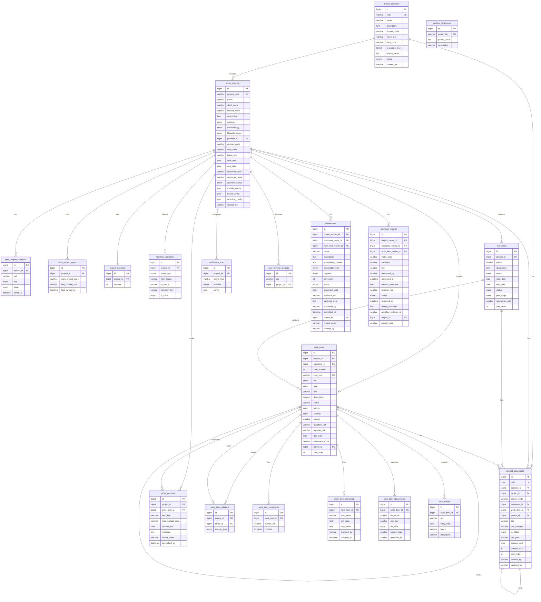

# hzy_aims 实体关系图

> 汇智云 Aims 项目管理模块 | 三层驱动架构: 里程碑(目标层) → 需求(价值层) → 任务(执行层)



## 表说明

| # | 表名 | 说明 | 核心关系 |
|---|------|------|---------|
| 1 | project_portfolios | 项目集(项目组合管理) | → aims_projects (1:N), → project_documents (1:N) |
| 2 | aims_projects | 项目主表 | 核心实体，所有表围绕它展开 |
| 3 | aims_project_members | 项目成员 | → aims_projects (N:1) |
| 4 | aims_project_repos | 项目-仓库关联(N:M) | → aims_projects (N:1), 关联 Account git_projects |
| 5 | project_counters | 工作项编号计数器 | → aims_projects (1:1) |
| 6 | workflow_transitions | 状态流转规则 | → aims_projects (N:1), NULL=系统默认 |
| 7 | milestones | 里程碑(目标层) | → aims_projects (N:1), → work_items (1:N), → project_documents (1:N) |
| 8 | work_items | 统一工作项(需求/任务/缺陷) | → milestones (N:1必填), 自引用 parent_id, tier: target/matter |
| 9 | work_item_relations | 工作项关联(阻塞/关联) | → work_items (N:1) x 2 |
| 10 | work_item_comments | 工作项评论 | → work_items (N:1) |
| 11 | work_item_changelog | 工作项变更日志 | → work_items (N:1) |
| 12 | work_item_attachments | 工作项附件(OSS) | → work_items (N:1) |
| 13 | ~~work_item_documents~~ | ~~工作项-Codocs文档关联~~ (已废弃, 合并到 project_documents) | ~~→ work_items (N:1)~~ |
| 14 | project_documents | 项目文档(统一管理各层级) | → project_portfolios/aims_projects/milestones/work_items (N:1), 自引用 parent_id |
| 15 | deliverables | 交付物/验收项 | 显式 owner 外键(project/milestone/work_item 三选一), → aims_projects (N:1 根项目) |
| 16 | approval_records | 统一审核记录 | 显式 owner 外键(project/milestone/work_item 三选一), → aims_projects (N:1 根项目) |
| 17 | time_entries | 工时记录 | → work_items (N:1) |
| 18 | gitlab_commits | GitLab提交关联 | → aims_projects (N:1), → work_items (N:1) |
| 19 | notification_rules | 通知规则 | → aims_projects (N:1) |
| 20 | user_favorite_projects | 用户收藏项目 | → aims_projects (N:1) |
| 21 | system_parameters | 系统参数 | 独立表 |

## 三层驱动架构

```
项目集 (project_portfolios)
  └── 项目 (aims_projects)
        ├── 里程碑 - 目标层 (milestones) ← PIVR: P/I/V/R
        │     ├── 工作项 (work_items) ← milestone_id 必填
        │     │     ├── 目标 (tier=target) - 价值层
        │     │     │     └── 事项 (tier=matter) - 执行层 ← parent_id 嵌套
        │     │     ├── 需求 (type=requirement) / 任务 (type=task) / 缺陷 (type=bug)
        │     │     └── 附件 (work_item_attachments) / 评论 / 变更日志 / 工时
        │     └── 交付物 (deliverables) ← 验收标准 + 审核闭环
        ├── 文档 (project_documents) ← 统一管理, 支持文件夹嵌套, 关联Codocs
        ├── 审核记录 (approval_records) ← 立项/里程碑完成/目标确认等
        ├── 成员 (aims_project_members)
        ├── 仓库关联 (aims_project_repos) → Account git_projects
        ├── 代码提交 (gitlab_commits)
        └── 通知规则 (notification_rules)
```
