# Codocs 文档协同系统 产品需求文档 (PRD)

**版本**：1.0.0
**作者**：周光营
**日期**：2026-01-18
**状态**：草稿

---

## 1. 产品概述

### 1.1 产品定位

Codocs 是 huizhi-yun 项目中的核心文档管理模块，致力于为企业提供统一的文档管理平台，并为全体员工提供高效的文档协同编辑服务。本模块依赖Account模块，通过Account模块的API接口（见Account-API.md）获取部门、用户、项目等信息，与GitLab进行交互，实现文档的同步、冲突解决、提交等功能。

### 1.2 核心价值

| 维度         | 价值描述                                             |
| ------------ | ---------------------------------------------------- |
| **统一管理** | 文档集中存储于阿里云 OSS，实现企业知识资产的统一归集 |
| **实时协同** | 基于 Milkdown 的多人在线协同编辑，解决团队协作痛点   |
| **AI 增强**  | AI 辅助编辑能力，提升全员文档编写效率                |
| **全员友好** | 兼顾技术人员和非技术人员的使用习惯                   |

### 1.3 目标用户

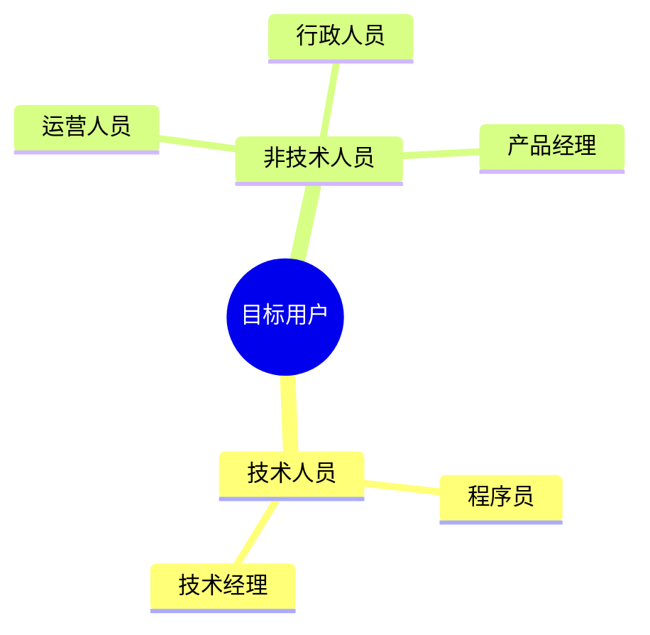

---

## 2. 文档分类体系

### 2.1 文档类型矩阵

| 类别         | 文档类型      | 访问范围  | 用途说明                   |
| ------------ | ------------- | --------- | -------------------------- |
| **工作文档** | 用户私有文档  | 个人      | 员工个人工作笔记、草稿等   |
| **工作文档** | 共享给我      | 个人      | 他人共享给当前用户的文档   |
| **工作文档** | 最近编辑/查看 | 个人      | 快速访问最近操作的文档     |
| **工作文档** | 个人收藏      | 个人      | 用户收藏的重要文档         |
| **工作文档** | 部门共享文档  | 部门内部  | 部门内部协作、共享资料     |
| **工作文档** | 部门规章      | 部门内部  | 部门内部的规章制度         |
| **工作文档** | 会议记录      | 部门内部  | 部门工作周报、日报等       |
| **工作文档** | 部门知识库    | 部门内部  | 部门内部沉淀的知识         |
| **工作文档** | 项目文档      | 项目组    | 项目相关技术文档、设计稿等 |
| **发布文档** | 公司发布文档  | 公司内部  | 公司通知、政策、规章制度等 |
| **发布文档** | 知识库文档    | 公司内部  | 公司知识沉淀、最佳实践等   |
| **发布文档** | 产品文档      | 公开/外部 | 面向客户的产品使用手册等   |
| **辅助功能** | 标签          | 个人/全员 | 文档的多维度分类索引       |
| **系统功能** | 回收站        | 个人      | 已删除文档的临时存储       |

### 2.2 文档存储架构

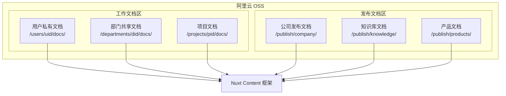

---

## 3. 功能需求

### 3.1 核心功能模块

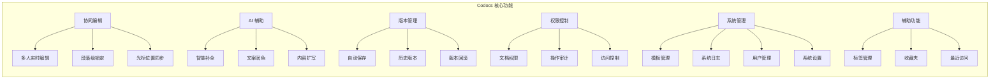

### 3.2 编辑器功能

#### 3.2.1 基础编辑能力

| 功能          | 描述                           | 优先级 |
| ------------- | ------------------------------ | ------ |
| Markdown 渲染 | 所见即所得的 Markdown 编辑体验 | P0     |
| 富文本格式    | 标题、粗体、斜体、列表、表格等 | P0     |
| 代码高亮      | 多语言代码块语法高亮           | P0     |
| 图片管理      | 图片上传、预览、自动存储至 OSS | P0     |
| Slash 命令    | 输入 `/` 快速呼出功能菜单      | P1     |
| 快捷键        | 常用编辑操作快捷键支持         | P1     |

#### 3.2.2 AI 辅助编辑

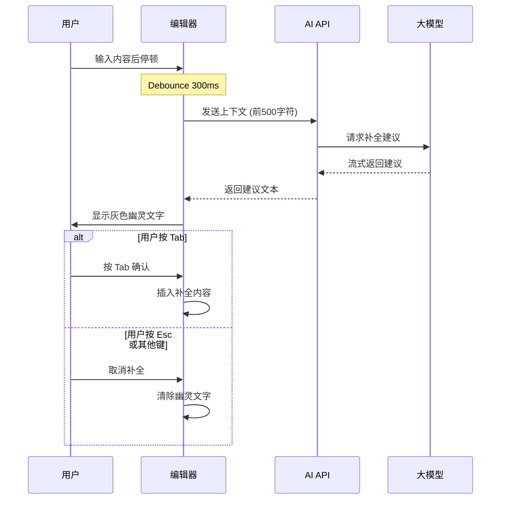

**AI 辅助功能清单**：

| 功能     | 描述                        | 使用场景           |
| -------- | --------------------------- | ------------------ |
| 智能补全 | Ghost Text 方式显示 AI 建议 | 技术文档、代码注释 |
| 文案润色 | 优化文字表达和措辞          | 通知、公文、邮件   |
| 内容扩写 | 基于要点扩展完整内容        | 运营文案、产品描述 |
| 翻译     | 中英文互译                  | 国际化文档         |
| 摘要生成 | 自动生成文档摘要            | 长文档概览         |

### 3.3 协同编辑功能

#### 3.3.1 实时同步

- **技术基础**：基于 Y.js CRDT 算法实现冲突自动合并
- **传输协议**：WebSocket 实时双向通信
- **服务端**：通过 Collab Runtime 提供协作

#### 3.3.2 段落级锁定

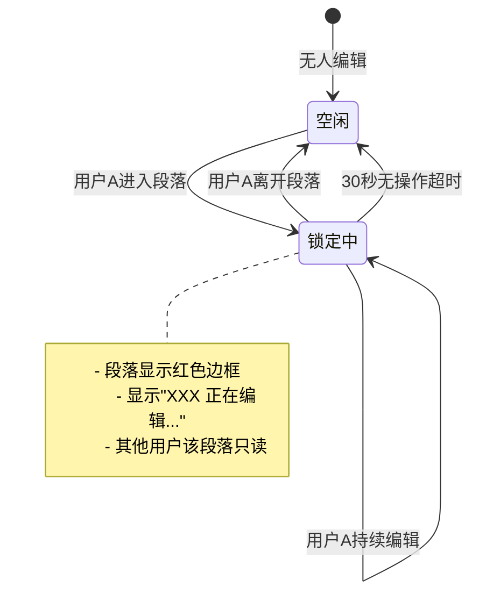

### 3.4 版本控制功能

| 功能     | 实现方式            | 说明                     |
| -------- | ------------------- | ------------------------ |
| 自动保存 | 防抖 5 秒后自动保存 | 无感知自动保存           |
| 版本存储 | OSS 版本控制        | 每次保存自动保留历史版本 |
| 历史查看 | 版本列表浏览        | 按时间倒序展示版本       |
| 版本对比 | Diff 视图           | 可视化对比任意两个版本   |
| 版本回滚 | 一键恢复            | 回滚到指定历史版本       |

### 3.5 权限控制功能

#### 3.5.1 权限模型

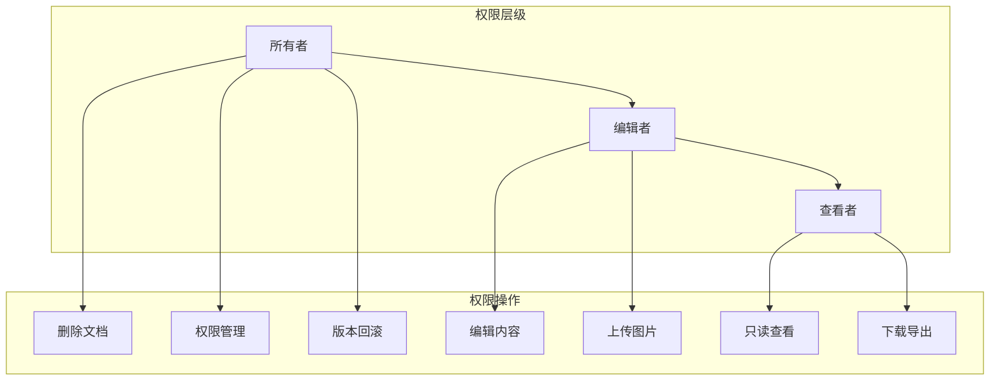

#### 3.5.2 权限规则

| 文档类型     | 默认权限       | 权限说明         |
| ------------ | -------------- | ---------------- |
| 用户私有文档 | 仅所有者       | 仅创建者可访问   |
| 部门共享文档 | 部门成员可查看 | 部门管理员可编辑 |
| 项目文档     | 项目成员可编辑 | 项目负责人可管理 |
| 公司发布文档 | 全员可查看     | 指定发布者可编辑 |
| 知识库文档   | 全员可查看     | 知识管理员可编辑 |
| 产品文档     | 公开可查看     | 产品团队可编辑   |

### 3.6 文档共享功能

#### 3.6.1 功能流程

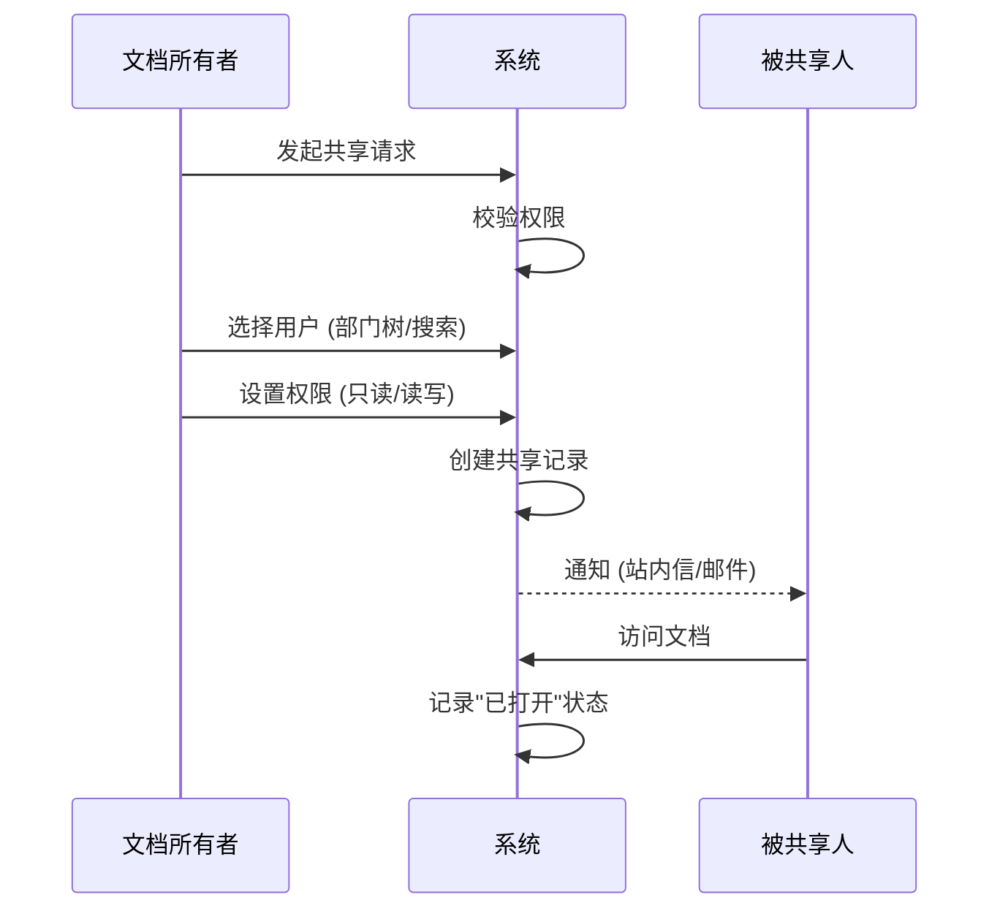

#### 3.6.2 详细需求

| 功能点       | 详细说明                                                                                                                                                         |
| ------------ | ---------------------------------------------------------------------------------------------------------------------------------------------------------------- |
| **发起共享** | 支持在文档详情页或列表页发起共享                                                                                                                                 |
| **用户选择** | 1. **搜索选择**：支持输入用户名/姓名搜索（支持 @uid） 2. **部门选择**：通过树形下拉菜单按部门选择用户 *注：用户数据源于 Account 服务，建议通过 Redis 缓存* |
| **权限设置** | 支持设置 **只读** 或 **读写** 权限                                                                                                                               |
| **状态追踪** | 记录被共享人是否已打开文档及打开时间                                                                                                                             |
| **列表展示** | 1. **我共享的**：在文档属性中显示已共享给谁 2. **共享给我**：在"共享给我"列表中展示他人共享的文档                                                             |

---

## 4. 系统管理功能

### 4.1 模板管理

| 功能     | 描述                               | 权限   |
| -------- | ---------------------------------- | ------ |
| 模板列表 | 查看所有可用的文档模板             | 管理员 |
| 创建模板 | 基于现有文档或从头创建新模板       | 管理员 |
| 编辑模板 | 修改模板内容和元信息               | 管理员 |
| 删除模板 | 删除不再使用的模板                 | 管理员 |
| 模板分类 | 按类型（会议纪要、项目计划等）分类 | 管理员 |

### 4.2 系统日志

| 日志类型 | 记录内容                         | 用途     |
| -------- | -------------------------------- | -------- |
| 操作日志 | 用户的文档创建、编辑、删除等操作 | 操作审计 |
| 访问日志 | 用户的登录、文档访问记录         | 安全审计 |
| 系统日志 | 协同服务、OSS 同步等系统运行状态 | 故障排查 |
| 异常日志 | 错误和异常记录                   | 问题定位 |

### 4.3 用户管理
利用Account服务获取用户信息，本模块不直接管理用户信息。

### 4.4 系统设置

| 设置项     | 描述                  | 默认值 |
| ---------- | --------------------- | ------ |
| 自动保存   | 文档自动保存间隔      | 5 秒   |
| 回收站保留 | 已删除文档保留天数    | 30 天  |
| AI 功能    | 启用/禁用 AI 辅助功能 | 启用   |
| 存储配额   | 用户/部门存储空间限制 | 无限制 |

### 4.5 回收站管理

| 功能       | 描述                     | 权限     |
| ---------- | ------------------------ | -------- |
| 查看已删除 | 查看自己删除的文档       | 所有用户 |
| 恢复文档   | 将已删除文档恢复到原位置 | 所有用户 |
| 彻底删除   | 永久删除文档，不可恢复   | 所有用户 |
| 清空回收站 | 一键清空所有已删除文档   | 所有用户 |

### 4.6 标签与收藏

| 功能     | 描述                                     | 权限     |
| -------- | ---------------------------------------- | -------- |
| 标签管理 | 创建、编辑、删除个人或公共标签           | 所有用户 |
| 标签过滤 | 按照标签筛选文档                         | 所有用户 |
| 文档收藏 | 将文档加入收藏夹，支持自定义分组（可选） | 所有用户 |
| 最近访问 | 自动记录最后编辑和查看的文档列表         | 系统自动 |

### 4.7 项目文档管理

#### 4.7.1 功能概述

项目文档管理功能为用户提供便捷的项目文档查看、同步和提交能力，实现项目文档与 GitLab 仓库的关联管理。

#### 4.7.2 界面布局

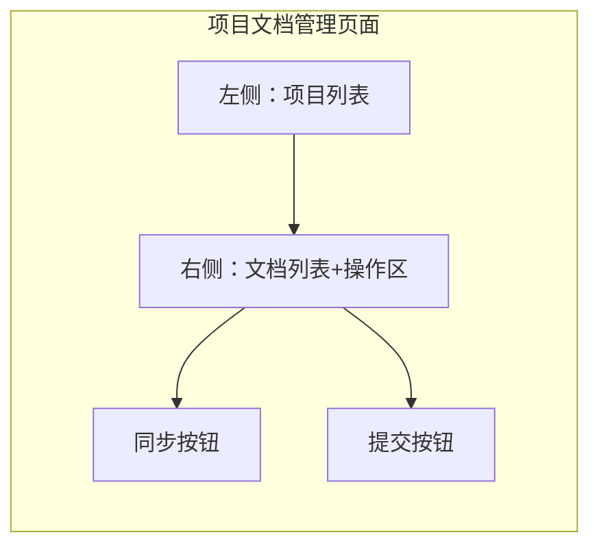

#### 4.7.3 功能流程

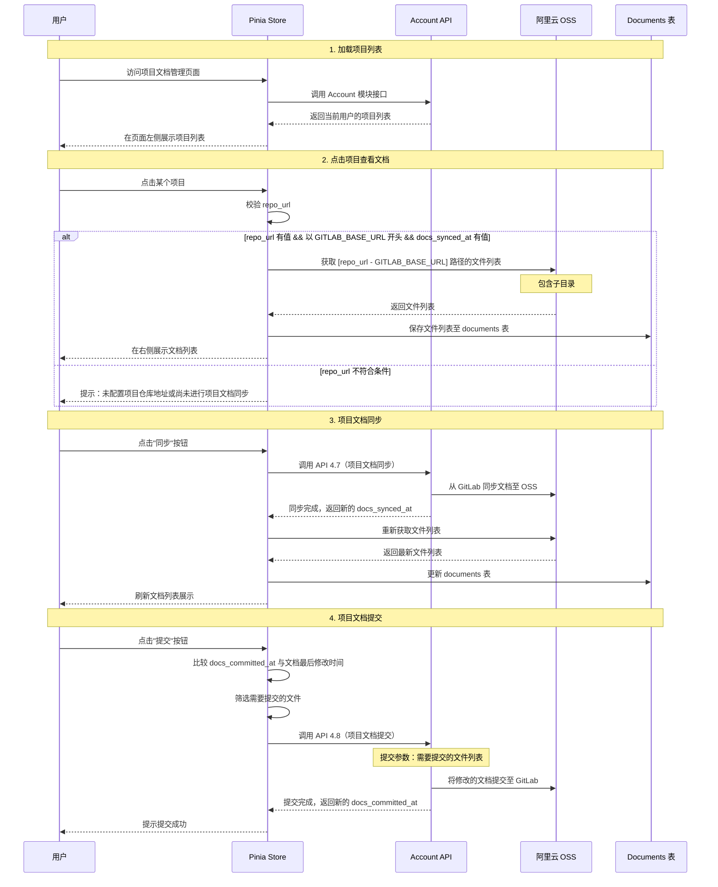

#### 4.7.4 详细需求

| 功能点             | 详细说明                                                                                                                                                                                        |
| ------------------ | ----------------------------------------------------------------------------------------------------------------------------------------------------------------------------------------------- |
| **项目列表展示**   | 1. 通过 Pinia 调用 Account 模块接口获取当前用户的项目列表 2. 在页面左侧以列表形式展示所有项目 3. 显示项目名称、同步状态等基本信息                                                         |
| **文档列表查看**   | 1. 点击项目时，先校验 `repo_url` 和 `docs_synced_at` 字段 2. 如果校验通过，从 OSS 获取 `repo_url - GITLAB_BASE_URL` 路径的文件列表（包含子目录） 3. 将文件列表保存至 `documents` 表并展示 |
| **条件校验**       | 项目需要同时满足以下条件才能查看文档： 1. `repo_url` 有值 2. `repo_url` 以 `GITLAB_BASE_URL` 开头 3. `docs_synced_at` 有值（已进行过同步）                                             |
| **未配置项目提示** | 如果项目不满足查看条件，展示提示信息： "未配置项目仓库地址或尚未进行项目文档同步"                                                                                                            |
| **文档同步功能**   | 1. 页面提供"同步"按钮 2. 点击后调用 API 4.7 接口进行项目文档同步 3. 同步完成后，更新 `docs_synced_at` 字段 4. 自动刷新并展示最新的文档列表                                             |
| **文档提交功能**   | 1. 页面提供"提交"按钮 2. 根据项目的 `docs_committed_at` 与文档最后修改时间比较 3. 筛选出需要提交的文件 4. 调用 API 4.8 接口提交文档 5. 提交成功后更新 `docs_committed_at` 字段      |
| **文件列表展示**   | 1. 支持树形结构展示文件和子目录 2. 显示文件名、修改时间、文件大小等信息 3. 标识哪些文件已修改需要提交                                                                                     |
| **数据存储**       | 文件列表信息保存至 `documents` 表，包括： - 文件路径 - 文件名 - 最后修改时间 - 文件大小 - 关联的项目 ID                                                                          |

#### 4.7.5 技术要点

| 技术点           | 说明                                                  |
| ---------------- | ----------------------------------------------------- |
| **状态管理**     | 使用 Pinia 管理项目列表、文档列表、同步状态等全局状态 |
| **Account 集成** | 调用 Account 模块接口获取用户的项目列表               |
| **OSS 文件操作** | 使用阿里云 OSS SDK 获取指定路径的文件列表（含子目录） |
| **数据库操作**   | 将文件列表保存至 `documents` 表，支持批量插入和更新   |
| **文件变更检测** | 通过比较 `docs_committed_at` 和文件修改时间判断变更   |
| **API 4.7 调用** | 项目文档同步接口，从 GitLab 同步文档至 OSS            |
| **API 4.8 调用** | 项目文档提交接口，将修改的文档提交至 GitLab           |
| **环境变量**     | `GITLAB_BASE_URL` 作为环境变量配置，用于 URL 匹配判断 |

#### 4.7.6 用户权限

| 操作         | 权限要求             |
| ------------ | -------------------- |
| 查看项目列表 | 项目成员             |
| 查看文档列表 | 项目成员             |
| 同步项目文档 | 项目管理员           |
| 提交项目文档 | 项目成员（编辑权限） |

---

## 5. 技术架构

### 5.1 系统架构图

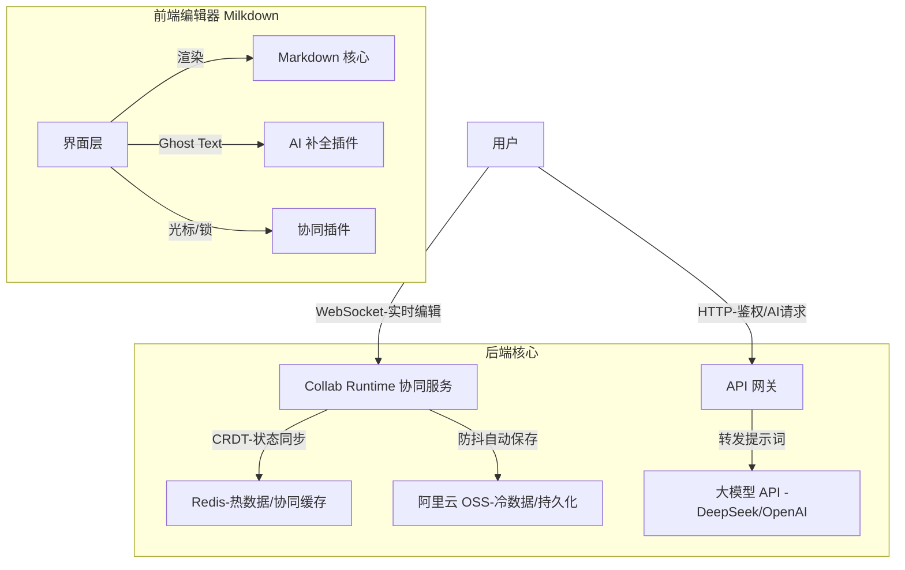

### 5.2 技术选型

| 层级           | 技术              | 说明                                |
| -------------- | ----------------- | ----------------------------------- |
| **前端编辑器** | Milkdown + Vue    | 基于 ProseMirror 的 Markdown 编辑器 |
| **协同引擎**   | Y.js              | CRDT 算法实现无冲突合并             |
| **协同服务**   | Collab Runtime    | 平台级 WebSocket 协作运行时，内部默认 provider 为 Hocuspocus |
| **缓存层**     | Redis             | 热数据存储和协同状态缓存            |
| **持久化**     | 阿里云 OSS        | 文档冷数据存储                      |
| **AI 服务**    | DeepSeek / OpenAI | 文档智能辅助                        |
| **内容框架**   | Nuxt Content      | 发布文档渲染                        |

### 5.3 数据流设计

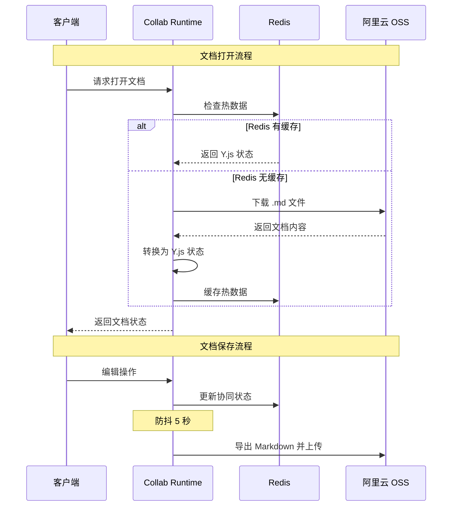

---

## 6. 用户体验设计

### 6.1 技术人员体验

| 特性             | 描述                                |
| ---------------- | ----------------------------------- |
| 纯 Markdown 存储 | 可使用 VS Code + OSS 插件本地编辑   |
| Slash 命令       | 输入 `/` 呼出功能菜单，符合极客习惯 |
| AI 代码补全      | 提高技术文档编写效率                |
| 快捷键支持       | 常用操作一键完成                    |

### 6.2 非技术人员体验

| 特性         | 描述                           |
| ------------ | ------------------------------ |
| 所见即所得   | 无需学习 Markdown 语法         |
| 浏览器即用   | 无需安装任何软件               |
| AI 润色扩写  | 帮助行政润色通知、运营扩写文案 |
| 协同锁定提示 | 避免内容互相覆盖的担忧         |

---

## 7. 项目实施计划

### 7.1 阶段规划

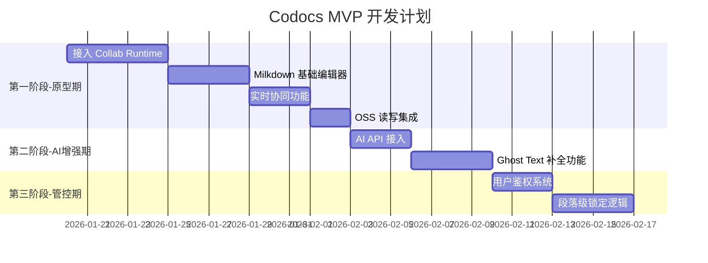

### 7.2 里程碑

| 阶段                    | 周期 | 交付物                           |
| ----------------------- | ---- | -------------------------------- |
| **第一阶段：原型期**    | 2 周 | 基础编辑器 + 实时协同 + OSS 存储 |
| **第二阶段：AI 增强期** | 1 周 | AI 智能补全功能                  |
| **第三阶段：管控期**    | 1 周 | 用户鉴权 + 段落锁定              |

---

## 8. 成本预估

### 8.1 软件成本

| 组件       | 授权 | 费用 |
| ---------- | ---- | ---- |
| Milkdown   | MIT  | 免费 |
| Y.js       | MIT  | 免费 |
| Hocuspocus | MIT  | 免费 |

### 8.2 基础设施成本

| 资源       | 配置     | 预估月费 |
| ---------- | -------- | -------- |
| ECS 服务器 | 2 核 4G  | ¥100-200 |
| 阿里云 OSS | 按量付费 | ¥1-5     |
| AI API     | 按 Token | ¥50-200  |

**预估总月费**：¥151-405

---

## 9. 风险与对策

| 风险                 | 影响         | 对策                       |
| -------------------- | ------------ | -------------------------- |
| Y.js 复杂度高        | 开发周期延长 | 前期充分调研，准备技术预研 |
| WebSocket 连接不稳定 | 用户体验差   | 实现重连机制和离线编辑     |
| AI 成本失控          | 预算超支     | 实现 Token 用量监控和限流  |
| OSS 数据安全         | 数据泄露     | 启用服务端加密和访问控制   |

---

## 10. 成功指标

| 指标            | 目标值  | 说明            |
| --------------- | ------- | --------------- |
| 编辑器加载时间  | < 2s    | 首屏加载完成    |
| 协同同步延迟    | < 100ms | 用户感知无延迟  |
| AI 补全响应时间 | < 500ms | 首个 Token 返回 |
| 系统可用性      | > 99.9% | 月度 SLA        |
| 用户满意度      | > 4.5/5 | NPS 调查评分    |

---

## 11. 附录

### 11.1 术语表

| 术语       | 解释                                                   |
| ---------- | ------------------------------------------------------ |
| CRDT       | Conflict-free Replicated Data Type，无冲突复制数据类型 |
| Ghost Text | 幽灵文字，AI 建议以灰色预览形式显示                    |
| Debounce   | 防抖，延迟执行以避免频繁触发                           |
| Y.js       | 用于构建协同应用的 CRDT 实现库                         |
| Collab Runtime | 平台级实时协作运行时，当前内部 provider 基于 Hocuspocus + Y.js |
| Milkdown   | 基于 ProseMirror 的 Markdown 编辑器框架                |

### 11.2 参考资料

- [Milkdown 官方文档](https://milkdown.dev/)
- [Y.js 文档](https://docs.yjs.dev/)
- [Hocuspocus 文档](https://hocuspocus.dev/)
- [阿里云 OSS 文档](https://help.aliyun.com/product/31815.html)
