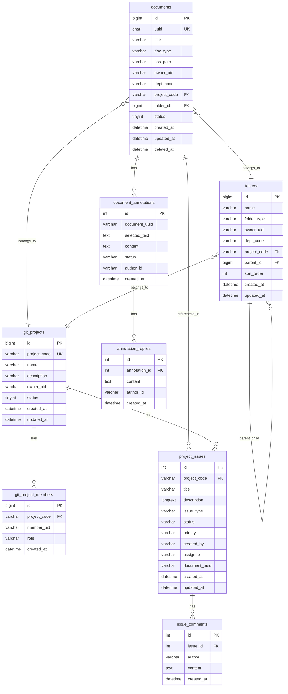

# Codocs 数据库设计文档

**版本**：1.1.0
**日期**：2026-03-07
**数据库**：MySQL 8.0

---

## 1. 设计原则

### 1.1 用户、部门与项目数据

> [!IMPORTANT]
> 用户、部门和项目信息主要通过调用 Account 模块 API 获取，本模块仅在本地冗余存储部分标识和关联关系。
> 标识符通常使用字符串格式（如 `uid`、`dept_code`、`project_code`）。

### 1.2 命名规范

- 表名：小写蛇形命名，复数形式（如 `documents`、`git_projects`）
- 字段名：小写蛇形命名（如 `created_at`、`owner_uid`）
- 索引名：`idx_{table}_{columns}`
- 外键：`fk_{table}_{ref_table}`

### 1.3 通用字段

每个业务表包含以下通用字段：

| 字段         | 类型                           | 说明     |
| ------------ | ------------------------------ | -------- |
| `id`         | BIGINT UNSIGNED AUTO_INCREMENT | 主键     |
| `created_at` | DATETIME                       | 创建时间 |
| `updated_at` | DATETIME                       | 更新时间 |

---

## 2. ER 图



---

## 3. 表结构详细设计

### 3.1 documents - 文档表

存储所有文档的元数据信息。

```sql
CREATE TABLE documents (
    id BIGINT UNSIGNED AUTO_INCREMENT PRIMARY KEY COMMENT '文档ID',
    uuid CHAR(36) NOT NULL COMMENT '文档UUID(用于外部访问)',
    title VARCHAR(255) NOT NULL COMMENT '文档标题',
    doc_type ENUM('private', 'shared', 'department', 'project', 'git-project', 'company', 'knowledge', 'product') NOT NULL COMMENT '文档类型',
    oss_path VARCHAR(500) NOT NULL COMMENT 'OSS存储路径',
    owner_uid VARCHAR(64) NOT NULL COMMENT '所有者用户名(Account)',
    dept_code VARCHAR(64) NULL COMMENT '所属部门ID(Account)',
    project_code VARCHAR(64) NULL COMMENT '所属项目ID',
    folder_id BIGINT UNSIGNED NULL COMMENT '所属文件夹ID',
    status TINYINT NOT NULL DEFAULT 1 COMMENT '状态: 1-正常 0-已删除 2-已发布',
    content_size INT UNSIGNED DEFAULT 0 COMMENT '内容大小(字节)',
    last_editor_uid VARCHAR(64) NULL COMMENT '最后编辑者用户名',
    created_at DATETIME NOT NULL DEFAULT CURRENT_TIMESTAMP COMMENT '创建时间',
    updated_at DATETIME NOT NULL DEFAULT CURRENT_TIMESTAMP ON UPDATE CURRENT_TIMESTAMP COMMENT '更新时间',
    deleted_at DATETIME NULL COMMENT '删除时间(软删除)',

    UNIQUE KEY uk_documents_uuid (uuid),
    INDEX idx_documents_owner (owner_uid),
    INDEX idx_documents_department (dept_code),
    INDEX idx_documents_project (project_code),
    INDEX idx_documents_folder (folder_id),
    INDEX idx_documents_type_status (doc_type, status)
) ENGINE=InnoDB DEFAULT CHARSET=utf8mb4 COLLATE=utf8mb4_unicode_ci COMMENT='文档表';
```

---

### 3.2 folders - 文件夹表

支持文档的层级目录结构。

```sql
CREATE TABLE folders (
    id BIGINT UNSIGNED AUTO_INCREMENT PRIMARY KEY COMMENT '文件夹ID',
    name VARCHAR(100) NOT NULL COMMENT '文件夹名称',
    folder_type ENUM('private', 'department', 'project', 'publish') NOT NULL COMMENT '文件夹类型',
    owner_uid VARCHAR(64) NULL COMMENT '所有者用户名(私有文件夹)',
    dept_code VARCHAR(64) NULL COMMENT '所属部门ID(部门文件夹)',
    project_code VARCHAR(64) NULL COMMENT '所属项目ID',
    parent_id BIGINT UNSIGNED NULL COMMENT '父文件夹ID',
    sort_order INT NOT NULL DEFAULT 0 COMMENT '排序序号',
    created_at DATETIME NOT NULL DEFAULT CURRENT_TIMESTAMP COMMENT '创建时间',
    updated_at DATETIME NOT NULL DEFAULT CURRENT_TIMESTAMP ON UPDATE CURRENT_TIMESTAMP COMMENT '更新时间',

    INDEX idx_folders_owner (owner_uid),
    INDEX idx_folders_department (dept_code),
    INDEX idx_folders_project (project_code),
    INDEX idx_folders_parent (parent_id),
    CONSTRAINT fk_folders_parent FOREIGN KEY (parent_id) REFERENCES folders(id) ON DELETE CASCADE
) ENGINE=InnoDB DEFAULT CHARSET=utf8mb4 COLLATE=utf8mb4_unicode_ci COMMENT='文件夹表';
```

---

### 3.3 git_projects - 项目表

管理项目信息，项目可包含多个文档。

```sql
CREATE TABLE git_projects (
    id BIGINT UNSIGNED AUTO_INCREMENT PRIMARY KEY COMMENT '自增ID',
    project_code VARCHAR(64) NOT NULL UNIQUE COMMENT '项目唯一标识符(字符串)',
    name VARCHAR(100) NOT NULL COMMENT '项目名称',
    description VARCHAR(500) NULL COMMENT '项目描述',
    owner_uid VARCHAR(64) NOT NULL COMMENT '项目负责人用户名(Account)',
    status TINYINT NOT NULL DEFAULT 1 COMMENT '状态: 1-进行中 2-已完成 0-',
    created_at DATETIME NOT NULL DEFAULT CURRENT_TIMESTAMP COMMENT '创建时间',
    updated_at DATETIME NOT NULL DEFAULT CURRENT_TIMESTAMP ON UPDATE CURRENT_TIMESTAMP COMMENT '更新时间',

    INDEX idx_projects_owner (owner_uid),
    INDEX idx_projects_status (status)
) ENGINE=InnoDB DEFAULT CHARSET=utf8mb4 COLLATE=utf8mb4_unicode_ci COMMENT='项目表';
```

---

### 3.4 git_project_members - 项目成员表

记录项目与成员的关联关系。

```sql
CREATE TABLE git_project_members (
    id BIGINT UNSIGNED AUTO_INCREMENT PRIMARY KEY COMMENT 'ID',
    project_code VARCHAR(64) NOT NULL COMMENT '项目ID',
    member_uid VARCHAR(64) NOT NULL COMMENT '成员用户名(Account)',
    role ENUM('owner', 'admin', 'editor', 'viewer') NOT NULL DEFAULT 'editor' COMMENT '角色',
    created_at DATETIME NOT NULL DEFAULT CURRENT_TIMESTAMP COMMENT '加入时间',

    UNIQUE KEY uk_project_member (project_code, member_uid),
    INDEX idx_pm_member (member_uid),
    CONSTRAINT fk_pm_project FOREIGN KEY (project_code) REFERENCES git_projects(project_code) ON DELETE CASCADE
) ENGINE=InnoDB DEFAULT CHARSET=utf8mb4 COLLATE=utf8mb4_unicode_ci COMMENT='项目成员表';
```

---

### 3.5 project_issues - 需求与Bug跟踪表

用于追踪项目相关的任务、需求和缺陷。

```sql
CREATE TABLE project_issues (
    id INT PRIMARY KEY AUTO_INCREMENT,
    project_code VARCHAR(64) NOT NULL COMMENT '项目ID',
    title VARCHAR(255) NOT NULL COMMENT '标题',
    description LONGTEXT COMMENT '详细描述（Markdown）',
    issue_type ENUM('bug', 'feature', 'improvement') NOT NULL DEFAULT 'bug',
    status ENUM('open', 'in_progress', 'resolved', 'closed', 'rejected') NOT NULL DEFAULT 'open',
    priority ENUM('low', 'medium', 'high', 'critical') NOT NULL DEFAULT 'medium',
    created_by VARCHAR(64) NOT NULL COMMENT '提交人UID',
    assignee VARCHAR(64) NULL COMMENT '负责人UID',
    document_uuid VARCHAR(36) NULL COMMENT '关联文档UUID',
    tags VARCHAR(500) NULL COMMENT '标签',
    created_at DATETIME DEFAULT CURRENT_TIMESTAMP,
    updated_at DATETIME DEFAULT CURRENT_TIMESTAMP ON UPDATE CURRENT_TIMESTAMP,
    resolved_at DATETIME NULL,
    closed_at DATETIME NULL,

    INDEX idx_project (project_code),
    INDEX idx_status (status),
    CONSTRAINT fk_issues_project FOREIGN KEY (project_code) REFERENCES git_projects(project_code) ON DELETE CASCADE
) ENGINE=InnoDB DEFAULT CHARSET=utf8mb4 COLLATE=utf8mb4_unicode_ci COMMENT='项目需求与Bug跟踪表';
```

---

### 3.6 document_annotations - 文档标注表

支持文档内容的行内标注（评论）。

```sql
CREATE TABLE document_annotations (
    id INT PRIMARY KEY AUTO_INCREMENT,
    document_uuid VARCHAR(36) NOT NULL,
    selected_text TEXT NOT NULL COMMENT '选中的文本',
    context_before VARCHAR(100) NULL,
    context_after VARCHAR(100) NULL,
    content TEXT NOT NULL COMMENT '标注内容',
    mentioned_users JSON NULL COMMENT '@提及的用户',
    status ENUM('active', 'resolved', 'deleted') DEFAULT 'active',
    author_id VARCHAR(64) NOT NULL,
    author_name VARCHAR(100) NULL,
    created_at DATETIME DEFAULT CURRENT_TIMESTAMP,
    updated_at DATETIME DEFAULT CURRENT_TIMESTAMP ON UPDATE CURRENT_TIMESTAMP,

    INDEX idx_document (document_uuid),
    INDEX idx_status (status)
) ENGINE=InnoDB DEFAULT CHARSET=utf8mb4 COLLATE=utf8mb4_unicode_ci COMMENT='文档标注表';
```

---

### 3.7 其他表 (模板、日志、设置等)

请参考 [codocs_schema.sql](codocs_schema.sql) 获取完整设计。

---

## 4. 初始化 SQL 脚本

完整的建表脚本：[codocs_schema.sql](codocs_schema.sql)

---

## 5. 数据字典总览

| 表名                 | 中文名          | 说明               |
| -------------------- | --------------- | ------------------ |
| documents            | 文档表          | 存储所有文档元数据 |
| folders              | 文件夹表        | 文档目录结构       |
| git_projects             | 项目表          | 项目信息           |
| git_project_members      | 项目成员表      | 项目与成员关联     |
| project_issues       | 需求与Bug跟踪表 | 项目任务与缺陷管理 |
| issue_comments       | Issue 评论表    | 任务讨论回复       |
| document_annotations | 文档标注表      | 行内评论与标注     |
| annotation_replies   | 标注回复表      | 标注的回复讨论     |
| document_permissions | 文档权限表      | 细粒度权限控制     |
| document_shares      | 文档共享记录表  | 点对点共享与状态   |
| document_versions    | 文档版本表      | 历史版本记录       |
| templates            | 模板表          | 文档模板管理       |
| operation_logs       | 操作日志表      | 操作审计日志       |
| system_settings      | 系统设置表      | 系统配置参数       |
