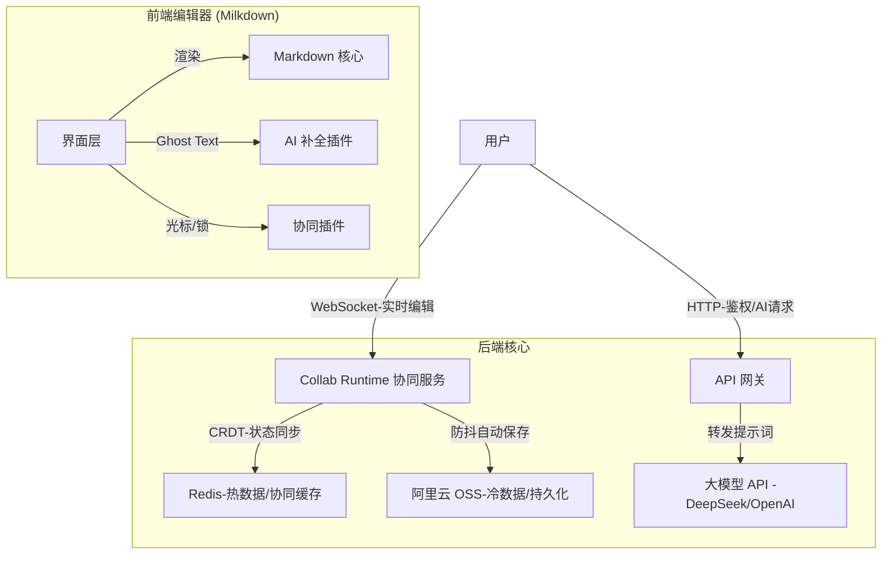

# 汇智云文档协同系统架构蓝图

**(基于 Milkdown)**

**作者**：周光营
**版本**：1.0.0
**日期**：2026-01-18

## 1. 系统逻辑架构

## 2. 核心模块详解

以下是针对五大核心需求的具体实现路径：

### 模块 A：编辑器前端 (Milkdown + Vue)

这是用户直接交互的界面，目标是“像 VS Code 一样智能，像 Typora 一样易用”。

**基础选型：**使用 Milkdown 配合 @milkdown/theme-nord (或自定义企业主题)。

**实现“可见即所得”：**Milkdown 天生自带。非技术人员看到的是渲染好的表格和粗体，点击即可展开源码编辑。

**实现 AI 自动补全 (仿 Copilot)：**

技术点：利用 ProseMirror 的 Decoration 机制。

交互逻辑：

监听用户停止输入（Debounce 300ms）。

获取光标前 500 个字符作为 Context，发送给后端 AI 接口。

后端流式返回建议文本。

前端将建议文本以“灰色幽灵文字（Ghost Text）”形式渲染在光标后。

监听 Tab 键：按下则将灰色文字“实心化”插入文档；监听 Esc 或其他键：取消渲染。

图片存储在 OSS 上，Milkdown 会自动处理。

优势：这种体验对所有员工都极其友好，不仅能写代码，也能辅助写周报、写公文。

### 模块 B：协同与锁定 (Collab Runtime + Y.js)

这是系统的“心脏”，负责处理多人冲突。

协同服务：通过平台级 Collab Runtime 提供 WebSocket 实时协作；当前内部 provider 使用 Hocuspocus 承接 Y.js 能力。

实时同步：前端集成 @milkdown/plugin-collaborative。多人输入的文字会通过 Y.js 算法自动合并，无需人工解决冲突。

段落级锁定 (针对您的特殊需求)：

虽然 Y.js 能解决冲突，但为了防止“两人同改一段话”造成的逻辑混乱，我们需要实现“软锁定”。

实现逻辑：

利用 Y.js 的 Awareness (感知) 协议，广播每个用户的光标位置。

当前端检测到用户 A 的光标位于“第三段落”时，向所有人广播 { user: 'A', lock: 'paragraph-3' }。

用户 B 的编辑器收到消息，通过 CSS 将“第三段落”标记为红色边框，并显示“Guangying 正在编辑...”，同时将该段落的 contentEditable 设为 false (只读)。

用户 A 离开段落或 30秒无操作，自动解锁。

### 模块 C：存储与持久化 (阿里云 OSS)

这是系统的“仓库”，确保数据安全归档。

持久化策略：不要让前端直接连 OSS（不安全）。

Collab Runtime 持久化钩子：利用内部 provider 的 onStoreDocument 钩子。

读取：用户打开文档 -> 服务器检查 Redis 是否有热数据 -> 如果没有，从 OSS 下载 .md 文件 -> 转换为 Y.js 状态 -> 发送给前端。

写入：服务器设置防抖（例如 5 秒）。当文档 5 秒内无新变化，服务器将内存中的 Y.js 状态导出为纯 Markdown 文本，异步上传覆盖 OSS 上的对应文件。

版本控制：阿里云 OSS 支持开启“版本控制”。每次覆盖上传都会保留历史版本，天然实现了“文档历史回滚”功能。

## 3. 为什么这个方案适合“全员”？

### 对程序员：

OSS 里的文件是纯 Markdown。程序员如果不想用网页版，依然可以用 VS Code + 阿里云 OSS 插件拉取到本地编辑，改完上传。

网页版编辑器支持 Slash 命令（输入 / 呼出菜单），符合极客习惯。

AI 补全能极大提高写技术文档的效率。

### 对非程序员（运营/行政）：

界面友好：没有复杂的 Git 命令行，打开网页就能写。

AI 辅助：AI 不仅能补全代码，配置好 Prompt 后，它能帮行政润色通知、帮运营扩写文案。

安全感：看到“XXX 正在编辑”的锁定提示，避免了互相覆盖内容的恐惧。

## 4. 实施路线图建议 (MVP 阶段)

如果您决定自行开发，建议分三步走：

### 第一阶段（原型期 - 2周）：

接入 Collab Runtime 协作服务。

实现 Milkdown 基础编辑器 + 实时协同（能看到别人的光标即可，先不做段落锁）。

打通 OSS 的读取和保存。

### 第二阶段（AI 增强期 - 1周）：

接入 AI API。

实现“Ghost Text”按 Tab 补全功能。

### 第三阶段（管控期 - 1周）：

实现用户鉴权。

实现“段落级锁定”逻辑。

## 5. 成本预估

这个方案是极其省钱的：

软件授权：Milkdown、Y.js，以及 Collab Runtime 内部 provider 使用的 Hocuspocus 均为开源免费 (MIT 协议)。

服务器：只需要一台普通的 ECS (2核 4G) 运行 Node.js 服务和 Redis 即可。

存储：阿里云 OSS 按量付费，文档占用的空间极小。

AI 成本：按 Token 付费（目前 DeepSeek 等模型价格极其低廉，作为文档补全成本可忽略不计）。

结论： 这个方案完美地缝合了 Web 的易用性（Milkdown）、IDE 的智能性（AI 补全）和 企业级的可控性（OSS + 权限控制）。它比直接用 VS Code 更容易推广到全公司，且开发难度在可控范围内。
