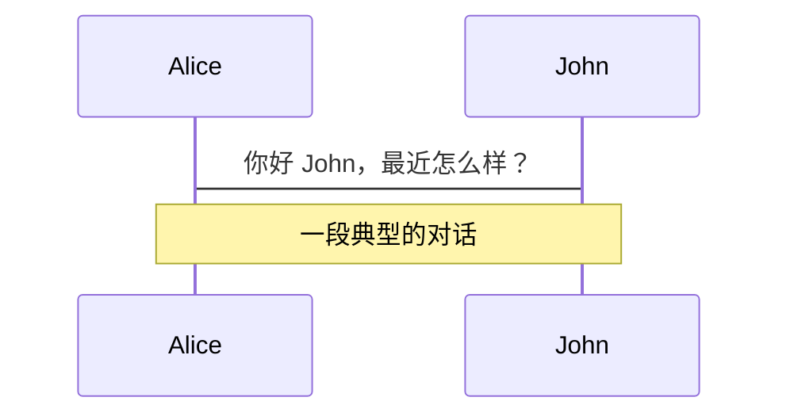
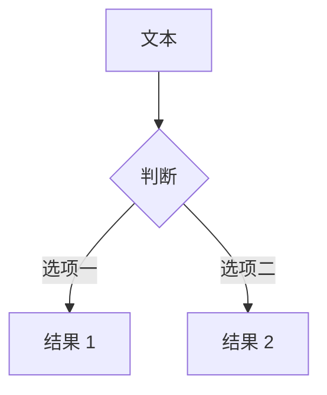
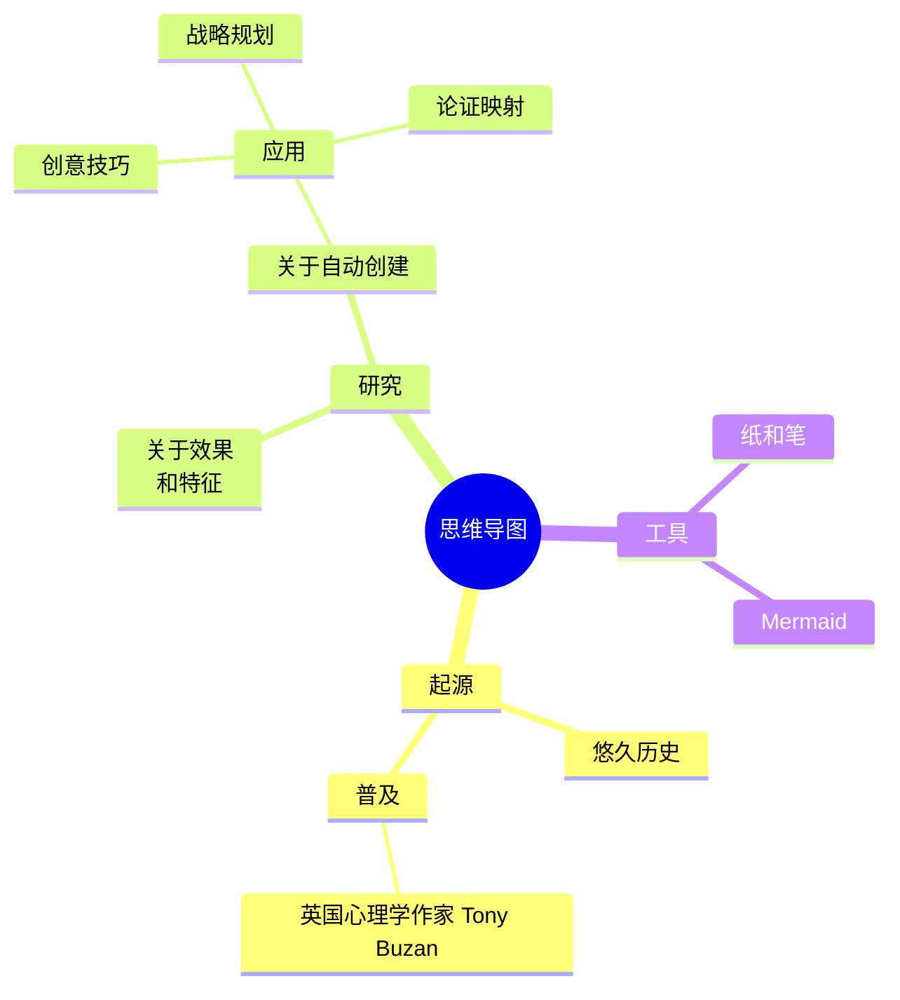
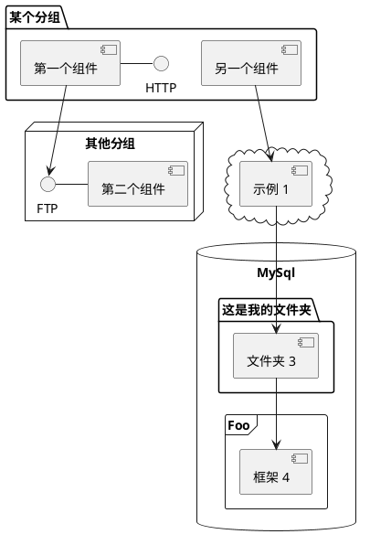

# 欢迎使用汇智云演示

专为开发者定制的在线演示平台

<div @click="$slidev.nav.next" class="mt-12 py-1" hover:bg="white op-10">
  按空格键或者方向键操控 <carbon:arrow-right />
</div>

<div class="abs-br m-6 text-xl">
  <a href="https://github.com/slidevjs/slidev" target="_blank" class="slidev-icon-btn">
    <carbon:logo-github />
  </a>
</div>

<!--
每张幻灯片最后的注释块会被当作演讲者备注。在演讲者模式下可查看和编辑。[查看文档](https://sli.dev/guide/syntax.html#notes)
-->

---
transition: fade-out
---

# 什么是 Slidev？

Slidev 是一个专为开发者设计的幻灯片制作和演示工具，具备以下特性：

- 📝 **基于文本** - 使用 Markdown 专注于内容，之后再调整样式
- 🎨 **支持主题** - 主题可以作为 npm 包共享和复用
- 🧑‍💻 **开发者友好** - 代码高亮、实时编码与自动补全
- 🤹 **可交互** - 嵌入 Vue 组件增强表达能力
- 🎥 **支持录制** - 内置录制和摄像头视图
- 📤 **可导出** - 导出为 PDF、PPTX、PNG，甚至可托管的 SPA
- 🛠 **高度可定制** - 网页上能实现的，Slidev 都能实现
<br>
<br>

了解更多 [为什么选择 Slidev？](https://sli.dev/guide/why)

<!--
你可以在 Markdown 中使用 `style` 标签来覆盖当前页面的样式。
了解更多：https://sli.dev/features/slide-scope-style
-->

<style>
h1 {
  background-color: #2B90B6;
  background-image: linear-gradient(45deg, #4EC5D4 10%, #146b8c 20%);
  background-size: 100%;
  -webkit-background-clip: text;
  -moz-background-clip: text;
  -webkit-text-fill-color: transparent;
  -moz-text-fill-color: transparent;
}
</style>

<!--
这是另一条注释。
-->

---
transition: slide-up
level: 2
---

# 导航

将鼠标悬停在左下角可以看到导航控制面板，[了解更多](https://sli.dev/guide/ui#navigation-bar)

## 键盘快捷键

|                                                     |                             |
| --------------------------------------------------- | --------------------------- |
| <kbd>右</kbd> / <kbd>空格</kbd>                      | 下一个动画或幻灯片           |
| <kbd>左</kbd> / <kbd>Shift</kbd><kbd>空格</kbd>      | 上一个动画或幻灯片           |
| <kbd>上</kbd>                                        | 上一张幻灯片                |
| <kbd>下</kbd>                                        | 下一张幻灯片                |

<!-- https://sli.dev/guide/animations.html#click-animation -->

<p v-after class="absolute bottom-23 left-45 opacity-30 transform -rotate-10">在这里！</p>

---
layout: two-cols
layoutClass: gap-16
---

# 目录

你可以使用 `Toc` 组件为幻灯片生成目录：

```html
<Toc minDepth="1" maxDepth="1" />
```

标题会自动从幻灯片内容中推断，你也可以在 frontmatter 中通过 `title` 和 `level` 来覆盖。

::right::

<Toc text-sm minDepth="1" maxDepth="2" />

---
layout: image-right
image: https://cover.sli.dev
---

# 代码

直接使用代码片段获得语法高亮，甚至还有类型悬停提示！

```ts {all|5|7|7-8|10|all} twoslash
// TwoSlash 可以在 Markdown 代码块中显示
// TypeScript 悬停信息和错误提示
// 更多信息：https://shiki.style/packages/twoslash

import { computed, ref } from 'vue'

const count = ref(0)
const doubled = computed(() => count.value * 2)

doubled.value = 2
```

<arrow v-click="[4, 5]" x1="350" y1="310" x2="195" y2="334" color="#953" width="2" arrowSize="1" />

[了解更多](https://sli.dev/features/line-highlighting)

<!-- 内联样式 -->
<style>
.footnotes-sep {
  @apply mt-5 opacity-10;
}
.footnotes {
  @apply text-sm opacity-75;
}
.footnote-backref {
  display: none;
}
</style>

<!--
备注也可以与点击动画同步

[click] 第一次点击后高亮显示

[click] 高亮显示 `count = ref(0)`

[click:3] 最后一次点击（跳过两次点击）
-->

---
level: 2
---

# Shiki Magic Move

基于 [shiki-magic-move](https://shiki-magic-move.netlify.app/)，Slidev 支持多个代码片段之间的过渡动画。

添加多个代码块并用 <code>````md magic-move</code>（四个反引号）包裹即可启用 Magic Move。例如：

````md magic-move {lines: true}
```ts {*|2|*}
// 第一步
const author = reactive({
  name: 'John Doe',
  books: [
    'Vue 2 - 进阶指南',
    'Vue 3 - 基础指南',
    'Vue 4 - 神秘篇'
  ]
})
```

```ts {*|1-2|3-4|3-4,8}
// 第二步
export default {
  data() {
    return {
      author: {
        name: 'John Doe',
        books: [
          'Vue 2 - 进阶指南',
          'Vue 3 - 基础指南',
          'Vue 4 - 神秘篇'
        ]
      }
    }
  }
}
```

```ts
// 第三步
export default {
  data: () => ({
    author: {
      name: 'John Doe',
      books: [
        'Vue 2 - 进阶指南',
        'Vue 3 - 基础指南',
        'Vue 4 - 神秘篇'
      ]
    }
  })
}
```

非代码块会被忽略。

```vue
<!-- 第四步 -->
<script setup>
const author = {
  name: 'John Doe',
  books: [
    'Vue 2 - 进阶指南',
    'Vue 3 - 基础指南',
    'Vue 4 - 神秘篇'
  ]
}
</script>
```
````

---

# 组件

<div grid="~ cols-2 gap-4">
<div>

你可以直接在幻灯片中使用 Vue 组件。

我们提供了一些内置组件如 `<Tweet/>` 和 `<Youtube/>`，可以直接使用。添加自定义组件也非常简单。

```html
<Counter :count="10" />
```

<!-- ./components/Counter.vue -->
<Counter :count="10" m="t-4" />

查看[使用指南](https://sli.dev/builtin/components.html)了解更多。

</div>
<div>

```html
<Tweet id="1390115482657726468" />
```

<Tweet id="1390115482657726468" scale="0.65" />

</div>
</div>

<!--
演讲者备注支持 **粗体**、*斜体* 和 ~~删除线~~ 文本。

同样支持 HTML 元素：
<div class="flex w-full">
  <span style="flex-grow: 1;">左侧内容</span>
  <span>右侧内容</span>
</div>
-->

---
class: px-20
---

# 主题

Slidev 提供强大的主题支持。主题可以提供样式、布局、组件，甚至工具配置。只需在 frontmatter 中修改 **一行代码** 即可切换主题：

<div grid="~ cols-2 gap-2" m="t-2">

```yaml
---
theme: default
---
```

```yaml
---
theme: seriph
---
```


</div>

了解[如何使用主题](https://sli.dev/guide/theme-addon#use-theme)，浏览[主题画廊](https://sli.dev/resources/theme-gallery)。

---

# 点击动画

为元素添加 `v-click` 即可实现点击动画。

<div v-click>

点击幻灯片后显示：

```html
<div v-click>点击幻灯片后显示此内容。</div>
```

</div>

<br>

<v-click>

<span v-mark.red="3"><code>v-mark</code> 指令</span>
还允许你添加
<span v-mark.circle.orange="4">内联标记</span>
，基于 [Rough Notation](https://roughnotation.com/) 实现：

```html
<span v-mark.underline.orange>内联标记</span>
```

</v-click>

<div mt-20 v-click>

[了解更多](https://sli.dev/guide/animations#click-animation)

</div>

---

# 动效

动效动画基于 [@vueuse/motion](https://motion.vueuse.org/)，通过 `v-motion` 指令触发。

```html
<div
  v-motion
  :initial="{ x: -80 }"
  :enter="{ x: 0 }"
  :click-3="{ x: 80 }"
  :leave="{ x: 1000 }"
>
  Slidev
</div>
```

<div class="w-60 relative">
  <div class="relative w-40 h-40">
    
    
    
  </div>

  <div
    class="text-5xl absolute top-14 left-40 text-[#2B90B6] -z-1"
    v-motion
    :initial="{ x: -80, opacity: 0}"
    :enter="{ x: 0, opacity: 1, transition: { delay: 2000, duration: 1000 } }">
    Slidev
  </div>
</div>

<!-- Vue script setup 可以直接在 Markdown 中使用，且只影响当前页面 -->
<script setup lang="ts">
const final = {
  x: 0,
  y: 0,
  rotate: 0,
  scale: 1,
  transition: {
    type: 'spring',
    damping: 10,
    stiffness: 20,
    mass: 2
  }
}
</script>

<div
  v-motion
  :initial="{ x:35, y: 30, opacity: 0}"
  :enter="{ y: 0, opacity: 1, transition: { delay: 3500 } }">

[了解更多](https://sli.dev/guide/animations.html#motion)

</div>

---

# LaTeX 公式

开箱即用的 LaTeX 支持，基于 [KaTeX](https://katex.org/) 实现。

<div h-3 />

行内公式 $\sqrt{3x-1}+(1+x)^2$

块级公式
$$ {1|3|all}
\begin{aligned}
\nabla \cdot \vec{E} &= \frac{\rho}{\varepsilon_0} \\
\nabla \cdot \vec{B} &= 0 \\
\nabla \times \vec{E} &= -\frac{\partial\vec{B}}{\partial t} \\
\nabla \times \vec{B} &= \mu_0\vec{J} + \mu_0\varepsilon_0\frac{\partial\vec{E}}{\partial t}
\end{aligned}
$$

[了解更多](https://sli.dev/features/latex)

---

# 图表

你可以直接在 Markdown 中用文本描述创建图表。

<div class="grid grid-cols-4 gap-5 pt-4 -mb-6">









</div>

了解更多：[Mermaid 图表](https://sli.dev/features/mermaid) 和 [PlantUML 图表](https://sli.dev/features/plantuml)

---
foo: bar
dragPos:
  square: 691,32,167,_,-16
---

# 可拖拽元素

双击可拖拽元素即可编辑位置。

<br>

###### 指令用法

```md

```

<br>

###### 组件用法

```md
<v-drag text-3xl>
  <div class="i-carbon:arrow-up" />
  使用 `v-drag` 组件创建可拖拽容器！
</v-drag>
```

<v-drag pos="663,206,261,_,-15">
  <div text-center text-3xl border border-main rounded>
    双击我！
  </div>
</v-drag>


###### 可拖拽箭头

```md
<v-drag-arrow two-way />
```

<v-drag-arrow pos="67,452,253,46" two-way op70 />

---
layout: center
class: text-center
---

# 了解更多

[官方文档](https://sli.dev) · [GitHub](https://github.com/slidevjs/slidev) · [案例展示](https://sli.dev/resources/showcases)

<PoweredBySlidev mt-10 />
