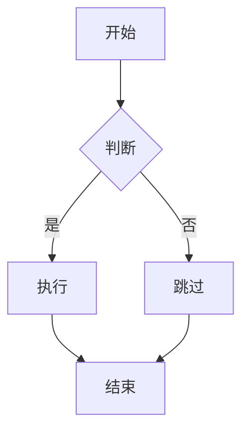
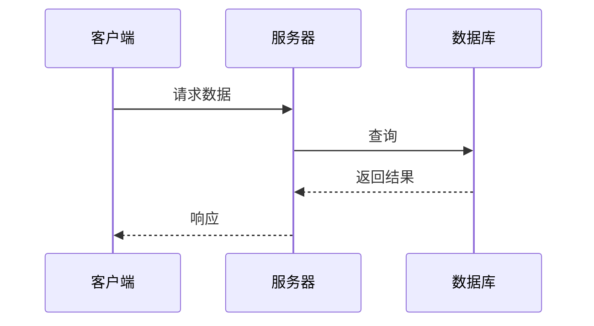
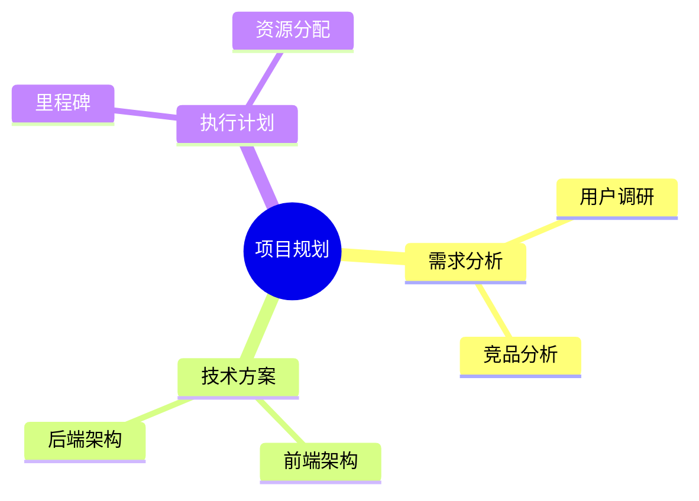

# 演示文稿语法指南

基于 Slidev 的 Markdown 幻灯片语法

---

## 幻灯片分隔

使用 `---` 分隔每张幻灯片，前后需要空行：

```md
# 第一页

第一页的内容

---

# 第二页

第二页的内容
```

---

## 单页配置（Frontmatter）

在每页开头用 `---` 包裹 YAML 配置：

```md
---
layout: center
background: /path/to/image.png
class: text-white
---

# 居中显示的标题
```

常用配置项：

| 配置 | 说明 | 示例值 |
|------|------|--------|
| `layout` | 页面布局 | `center`, `cover`, `two-cols`, `image-right` |
| `background` | 背景图片 | URL 或 `default`（随机图） |
| `class` | CSS 类名 | `text-center`, `text-white`, `px-20` |
| `clicks` | 预设点击次数 | `3` |
| `transition` | 本页切换动画 | `fade`, `slide-up` |

---
layout: two-cols
layoutClass: gap-16
---

## 常用布局

Slidev 提供多种内置布局：

- `default` — 默认布局
- `center` — 内容居中
- `cover` — 封面页
- `two-cols` — 两栏布局
- `image-right` — 右侧图片
- `image-left` — 左侧图片
- `image` — 全屏背景图
- `quote` — 引用布局
- `section` — 章节标题
- `fact` — 突出数据
- `full` — 全屏内容

::right::

### 两栏布局示例

本页使用了 `two-cols` 布局

在左栏内容之后使用：

```md
::right::
```

来分隔左右两栏的内容

---

## Markdown 基础语法

支持标准 Markdown：

- **粗体** `**粗体**`
- *斜体* `*斜体*`
- ~~删除线~~ `~~删除线~~`
- `行内代码` `` `行内代码` ``
- [链接](https://sli.dev) `[链接](url)`
-  ``

### 列表

```md
- 无序列表项
- 嵌套
  - 子项

1. 有序列表
2. 第二项
```

### 引用

> 这是一段引用文字
>
> — 引用来源

---

## 代码高亮

代码块支持语法高亮和行标记：

````md
```ts
console.log('Hello, World!')
```
````

### 指定高亮行

````md
```ts {2,3}
function add(a: number, b: number) {
  const sum = a + b    // 高亮
  return sum           // 高亮
}
```
````

```ts {2,3}
function add(a: number, b: number) {
  const sum = a + b
  return sum
}
```

### 分步高亮（点击切换）

````md
```ts {1|3|5}
const name = 'Slidev'       // 第1步高亮
//
const greeting = `Hello`    // 第2步高亮
//
console.log(greeting)       // 第3步高亮
```
````

---

## 表格

```md
| 姓名 | 部门 | 职位 |
|------|------|------|
| 张三 | 研发部 | 工程师 |
| 李四 | 产品部 | 经理 |
```

| 姓名 | 部门 | 职位 |
|------|------|------|
| 张三 | 研发部 | 工程师 |
| 李四 | 产品部 | 经理 |

---

## LaTeX 数学公式

行内公式：$E = mc^2$

块级公式：

$$
\begin{aligned}
\nabla \times \vec{E} &= -\frac{\partial\vec{B}}{\partial t} \\
\nabla \times \vec{B} &= \mu_0\vec{J} + \mu_0\varepsilon_0\frac{\partial\vec{E}}{\partial t}
\end{aligned}
$$

语法：

````md
行内：$E = mc^2$

块级：
$$
f(x) = \int_{-\infty}^{\infty} e^{-x^2} dx
$$
````

---

## Mermaid 图表

使用 Mermaid 语法绘制图表：

````md

````


---

## Mermaid 更多图表

### 时序图



### 思维导图



---

## 点击动画

使用 `v-click` 让元素逐步显示：

```html
<div v-click>第一次点击后显示</div>
<div v-click>第二次点击后显示</div>
<div v-click>第三次点击后显示</div>
```

<div v-click>

**第一步：** 规划方案

</div>

<div v-click>

**第二步：** 开始实施

</div>

<div v-click>

**第三步：** 验证成果

</div>

---

## 标记动画

使用 `v-mark` 为文字添加标注效果：

```html
<span v-mark.underline.red="1">下划线标注</span>
<span v-mark.circle.orange="2">圈注</span>
<span v-mark.highlight.yellow="3">高亮</span>
```

这段文字中有 <span v-mark.underline.red="1">重要内容</span> 需要注意，

还有一个 <span v-mark.circle.orange="2">关键概念</span> 需要理解，

以及 <span v-mark.highlight.yellow="3">核心结论</span> 需要记住。

---

## 动效

使用 `v-motion` 添加入场动画：

```html
<div
  v-motion
  :initial="{ x: -80, opacity: 0 }"
  :enter="{ x: 0, opacity: 1 }">
  从左侧滑入
</div>
```

<div
  v-motion
  :initial="{ x: -80, opacity: 0 }"
  :enter="{ x: 0, opacity: 1, transition: { delay: 300 } }">

### 这段文字从左侧滑入

</div>

<div
  v-motion
  :initial="{ y: 80, opacity: 0 }"
  :enter="{ y: 0, opacity: 1, transition: { delay: 600 } }">

支持的动画属性：`x`, `y`, `scale`, `rotate`, `opacity`

</div>

---

## 演讲者备注

在幻灯片末尾使用 HTML 注释添加备注，仅在演讲者模式下可见：

```md
# 幻灯片标题

内容...

<!--
这是演讲者备注
只在演讲者模式中显示
支持 **Markdown** 格式
-->
```

进入演讲者模式：点击左下角导航栏的演讲者图标

<!-- 这就是一条演讲者备注示例 -->

---

## 图片与背景

### 页面背景

```md
---
background: https://example.com/image.jpg
---
```

使用 `default` 获取随机封面：

```md
---
background: default
---
```

### 内容中的图片

```md

```

### 控制图片大小

```html

```

---

## UnoCSS 样式

Slidev 内置 UnoCSS，可以直接使用原子化 CSS 类：

```html
<div class="text-2xl font-bold text-blue-500 mb-4">
  蓝色粗体大号文字
</div>

<div class="grid grid-cols-2 gap-4">
  <div class="bg-gray-100 p-4 rounded">左栏</div>
  <div class="bg-gray-100 p-4 rounded">右栏</div>
</div>
```

<div class="grid grid-cols-3 gap-4 mt-4">
  <div class="bg-blue-50 p-3 rounded text-center text-sm">蓝色背景</div>
  <div class="bg-green-50 p-3 rounded text-center text-sm">绿色背景</div>
  <div class="bg-orange-50 p-3 rounded text-center text-sm">橙色背景</div>
</div>

---

## 页面级样式

使用 `<style>` 标签为当前页面添加自定义样式：

```html
<style>
h1 {
  color: #2B90B6;
  background-image: linear-gradient(45deg, #4EC5D4 10%, #146b8c 20%);
  background-clip: text;
  -webkit-text-fill-color: transparent;
}
</style>
```

<style>
h2 {
  color: #2B90B6;
}
</style>

## 本页标题使用了渐变色

---

## 快捷键

| 快捷键 | 功能 |
|--------|------|
| `→` / `空格` | 下一步动画或下一页 |
| `←` / `Shift+空格` | 上一步动画或上一页 |
| `↑` | 上一页 |
| `↓` | 下一页 |
| `o` | 幻灯片总览 |
| `d` | 切换暗色模式 |
| `f` | 全屏 |

---
layout: center
class: text-center
---

## 更多功能

完整语法文档请参考：[Slidev 官方文档](https://cn.sli.dev/guide/syntax)

<div class="mt-8 text-sm text-gray-400">

提示：鼠标移至左下角显示导航栏

</div>
