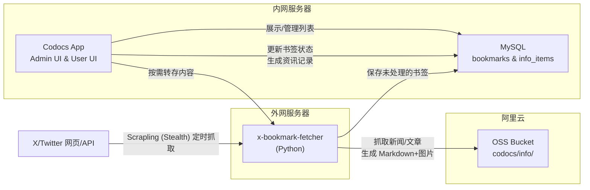

# 资讯中心功能设计方案

> 状态说明：本文是资讯中心早期设计记录。当前实现已将 `info_bookmarks` / `info_items` 的读写迁移到 tenant-runtime/data-runtime；Codocs Nuxt 和 `x-bookmark-fetcher` 不再直连 MySQL，旧文中的 MySQL 访问描述仅作为历史背景。

## 概述

为 codocs 实现「资讯中心」功能：从 X (Twitter) 书签中定时采集内容，转存为 Markdown 至 OSS，并在 Web 端提供阅读体验。由于 X API 需要外网访问，**采集服务独立部署**，与 codocs 主应用解耦。

## 架构设计



## 数据流

1. **增量采集** → x-bookmark-fetcher 定时运行，通过 Scrapling 拦截 X 的接口数据，将**新增**的书签基本信息（推文ID、内容片段、作者等）保存到 MySQL `bookmarks` 表中，状态为 `pending`。
2. **管理审核** → 管理员在 codocs Web 端 "书签管理" 页面查看落库的书签，手动勾选需要转存的书签，并可选择分类（资讯/文章）。
3. **按需抓取 & OSS存储** → 管理员确认转存后，codocs 触发 API（交给后端或 Fetcher 服务），针对选中的书签抓取详情页/外部文章链接：
   * 下载图片上传至 OSS `info/images/`
   * 将正文/推文转换为 Markdown 并上传至 OSS `info/articles/` 或 `info/news/`
4. **状态更新与发布** → 转存成功后，更新 MySQL 中该书签的状态为 `processed`。同时在 MySQL `info_items` 表中生成一条资讯记录，用于前台展示。
5. **用户阅读** → 普通用户访问前台资讯中心，直接从 MySQL `info_items` 表加载列表，点击详情时从拉取 OSS 对应的 Markdown 文档渲染。

---

## 一、独立采集服务 (x-bookmark-fetcher)

> [!IMPORTANT]
> 此服务需部署在**可访问 X 的外网服务器**上，使用 Scrapling (DynamicSession/StealthySession) 自动化抓取书签页面与接口，无需 X Developer 账号。

### 技术选型

| 项       | 选择             | 理由                                                                                                                        |
| -------- | ---------------- | --------------------------------------------------------------------------------------------------------------------------- |
| 语言     | Python 3.11+     | 生态成熟，抓取/解析方便                                                                                                     |
| 框架     | FastAPI          | 提供管理 API（手动触发同步、查看状态）                                                                                      |
| 定时任务 | APScheduler      | 进程内定时，无需外部 cron                                                                                                   |
| 核心抓取 | Scrapling        | 替代 Playwright+httpx。内置极致的绕过反爬机制（Stealth），智能元素追踪（适用于 X 经常变动的 DOM），统一管理静态与动态请求。 |
| 文章解析 | readability-lxml | 从 Scrapling 拿到的目标 HTML 中提取乾净正文                                                                                 |
| OSS      | oss2             | 阿里云官方 Python SDK                                                                                                       |

### 项目结构

```
x-bookmark-fetcher/
├── app/
│   ├── main.py              # FastAPI 入口 + 定时任务
│   ├── config.py             # 环境变量配置
│   ├── scraper.py            # Scrapling 书签抓取与 API 数据拦截
│   ├── content_processor.py  # 内容解析、分类、Markdown 转换
│   ├── oss_uploader.py       # OSS 上传（Markdown + 图片）
│   └── models.py             # 数据模型
├── requirements.txt
├── Dockerfile
└── .env.example
```

### 核心逻辑

#### 1. 定时书签抓取（Scrapling）

1. 首次运行：用 Scrapling (StealthySession) 打开 X 登录页，手动登录后保存 cookies/session 到本地文件
2. 后续运行：加载已保存的 session，直接访问书签页 `https://x.com/i/bookmarks`
3. 滚动页面加载更多书签，解析 DOM 提取推文内容、链接、图片
4. 比对已抓取的推文 ID，过滤出新增的书签
5. Session 过期时发出通知，需要重新登录
6. 通过 API 将新增书签发送给 codocs 后端保存入库 (MySQL)，或 Fetcher 直连 MySQL 写入数据。

#### 2. 书签转存流程 (内容分类与深度抓取)

当管理员在页管理面触发转存时：

| 条件                     | 建议分类 | 存储路径                              |
| ------------------------ | -------- | ------------------------------------- |
| 推文含外链且正文 > 500字 | article  | `codocs/info/articles/{date}_{id}.md` |
| 推文含外链但正文 ≤ 500字 | news     | `codocs/info/news/{date}_{id}.md`     |
| 纯文字/图片推文          | news     | `codocs/info/news/{date}_{id}.md`     |

#### Markdown 模板

每篇内容的 Markdown 文件头部包含 YAML frontmatter：

```yaml
---
id: "tweet_id"
title: "标题"
author: "@handle"
source_url: "https://x.com/..."
category: "article | news"
tags: ["AI", "LLM"]
fetched_at: "2026-02-26T10:00:00Z"
images: ["info/images/xxx.jpg"]
---
```


> [!TIP]
> 摒弃了基于 `index.json` 的索引方式，改用 MySQL 数据库存储元数据，以便支持后台管理界面的勾选、筛选、状态管理和列表的高效加载。

### 管理 API (Fetcher 端)

| 端点            | 方法 | 说明                                                                                            |
| --------------- | ---- | ----------------------------------------------------------------------------------------------- |
| `GET /status`   | GET  | 查看定时任务组件状态                                                                            |
| `POST /sync`    | POST | 手动触发一次增量书签同步任务                                                                    |
| `POST /process` | POST | 接收来自 codocs 管理后台的请求，针对指定的书签 ID 执行抓取文章、生成 Markdown 并上传 OSS 的任务 |

---

## 二、Codocs 端集成

### 数据库设计 (MySQL)

为了支持后台管理与分卷展示，需引入两张表：

**1. `info_bookmarks` (X 书签采集表)**
- `id` (推文 ID, PK)
- `author_handle` (作者 @)
- `content_snippet` (内容片段)
- `source_url` (原链接)
- `has_external_link` (布尔值：是否含外链)
- `status` (Enum: `pending` | `processed` | `ignored`)
- `created_at`

**2. `info_items` (资讯中心展示表)**
- `id` (自增 PK)
- `bookmark_id` (关联书签)
- `title` (展示标题)
- `category` (Enum: `news` | `article`)
- `summary` (摘要)
- `author` (原作者)
- `oss_path` (Markdown 的 OSS 相对路径)
- `published_at` (入库时间)

---

### 新增 API 路由 (Codocs Backend)

#### [NEW] `server/api/info/management.get.ts` & `.put.ts`
- 用于管理后台。分页查询 `info_bookmarks` 表中 `status = 'pending'` 的数据。
- 允许管理员提交包含选中的 ID 列表和目标分类的 Payload，然后后端调用 Fetcher 服务的 `/process` 接口执行转存。
- 成功后将状态更新为 `processed` 并在 `info_items` 表中生成记录。

#### [NEW] `server/api/info/list.get.ts`
- 从 `info_items` 查询数据（按发布时间分页倒序）
- 接收 `?category=article|news`
- 用于前台列表展示。

#### [NEW] `server/api/info/[id].get.ts`
- 根据内容表的 ID 从 `info_items` 查找对应条目的 `oss_path`
- 从 OSS 下载 Markdown 文件内容并返回
- 可配合服务端缓存（Nitro `$fetch` 缓存）优化加载速度。

---

### 新增前端页面

#### [NEW] 用户页面: `/info/news`, `/info/articles`, `/info/[id]`
- 列表页与详情页展示（同原稿，但数据来源从 json 转为后端 API 读取数据库和 OSS）。

#### [NEW] 管理后台: `app/pages/info/management.vue`
- 表格展示当前数据库中未处理（`pending`）的书签。
- 支持列：作者、片段、链接、是否有外链、时间。
- [多选] + [底部悬浮条] 提供操作：
  - 「转存为新闻 (News)」
  - 「转存为文章 (Article)」
  - 「忽略 (Ignore)」
- 转存过程需带 Loading 状态，转存完成的数据从当前过滤列表中消失。

### 新增前端页面

#### [NEW] `app/pages/info/news.vue` — 前沿资讯
- 列表页，展示 `category=news` 的内容
- 卡片式布局，显示标题、摘要、日期、来源
- 点击跳转至详情页

#### [NEW] `app/pages/info/articles.vue` — 推荐文章
- 列表页，展示 `category=article` 的内容
- 文章卡片含封面图（如有）

#### [NEW] `app/pages/info/[id].vue` — 详情页
- 复用 `MilkdownEditor` 组件，只读模式展示 Markdown 内容
- 显示来源链接、作者、日期等元信息
- 返回按钮回到列表

### 菜单路由

已在 [default.vue](file:///Users/gavin/Dev/huizhi-yun/codocs/app/layouts/default.vue) 中配置好路由：
- `/info/news` → 前沿资讯
- `/info/articles` → 推荐文章

---

## 三、实施计划

### 阶段 1：Codocs 数据库与后端层

1. 创建 MySQL 表：`info_bookmarks` 与 `info_items`
2. 实现前后端查询 API：`server/api/info/list.get.ts` 和 `server/api/info/[id].get.ts`
3. 伪造一些 MySQL 测试数据，在 `app/pages/info/news.vue` 和 `articles.vue` 调通展示功能。

### 阶段 2：书签管理后台与 Codocs-Fetcher 交互协议

1. 建立管理后台页面 `app/pages/info/management/index.vue`
2. 实现供管理页面用的后段接口 `server/api/info/management`
3. 规范 Codocs 和 x-bookmark-fetcher 直接在 "转存" 节点通信的接口格式。

### 阶段 3：独立 Fetcher 服务

1. 创建 `x-bookmark-fetcher` 项目，实现抓取入库逻辑。定时启动，将书签基本信息灌入 `info_bookmarks`。
2. 实现供 Codocs 调用的 `POST /process` 接口：接收指令，发起深度抓取、分类、图片处理、生成 Markdown、上传 OSS。

### 阶段 3：联调与优化

1. Fetcher 定时同步 → OSS 内容更新 → codocs 展示
2. 增加缓存策略（避免频繁读取 OSS）
3. 可选：增加手动录入资讯的管理功能

---

## 验证计划

### 阶段 1 验证（Web 端）

1. 手动创建测试 `index.json` 和几个 [.md](file:///Users/gavin/Dev/huizhi-yun/deployment_guide.md) 文件上传至 OSS `codocs/info/` 目录
2. 访问 `/info/news` 确认列表正确展示 news 类条目
3. 访问 `/info/articles` 确认列表正确展示 article 类条目
4. 点击条目确认详情页 `/info/[id]` 正确渲染 Markdown 内容
5. 未登录状态访问确认无法查看（需认证）

### 阶段 2 验证（Fetcher）

1. 在外网服务器启动 fetcher，验证 `GET /status` 返回正常
2. 调用 `POST /sync` 触发一次同步
3. 检查 OSS 是否生成了正确的目录结构和文件
4. 在 codocs Web 端确认新内容正确展示
