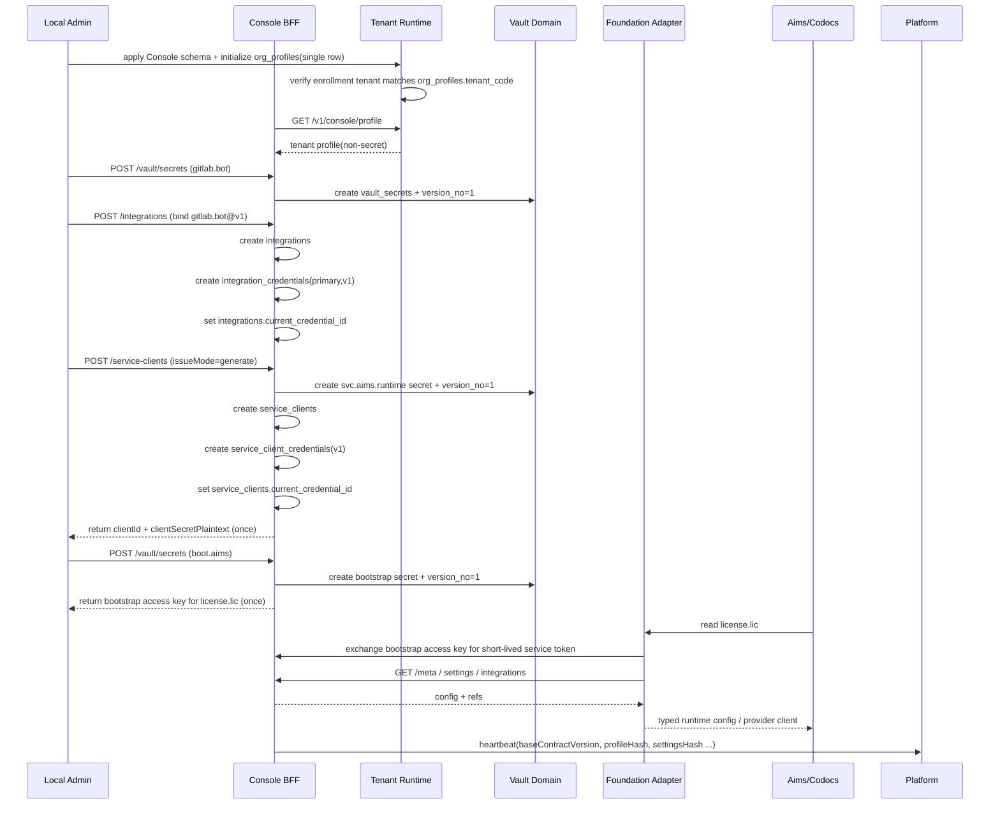
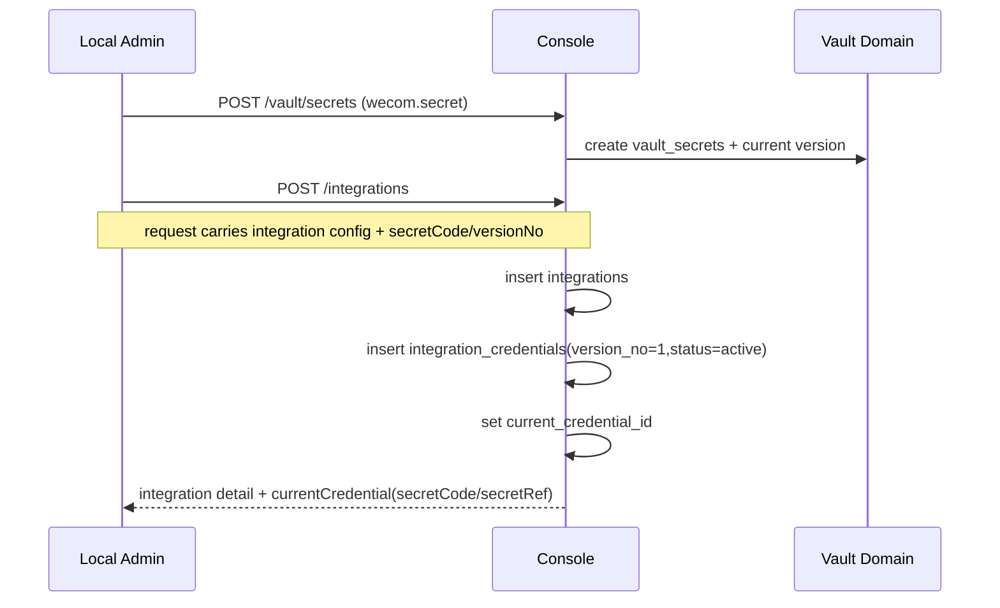
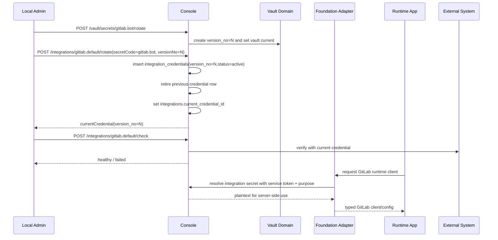
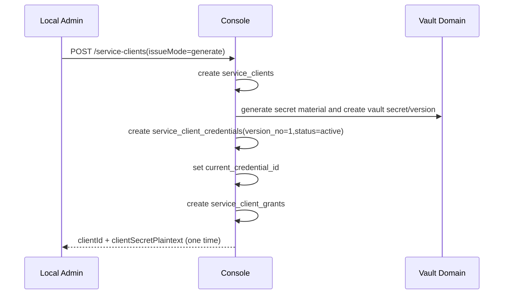
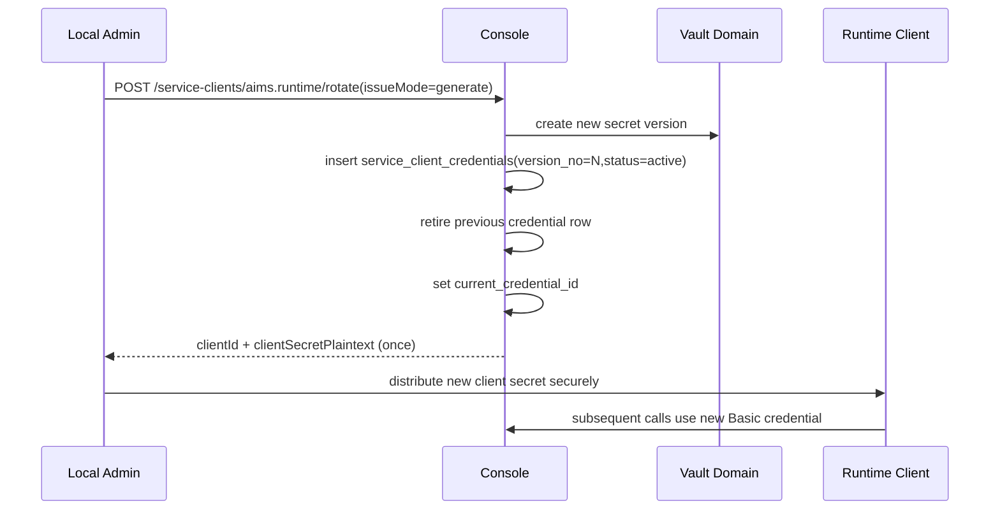
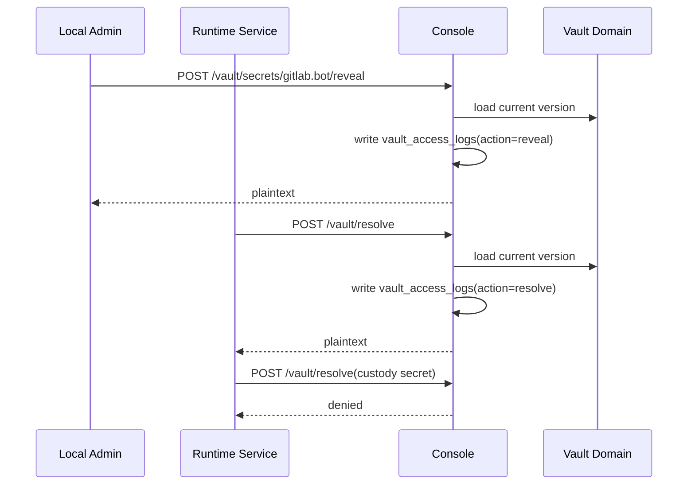

# Console 启动与轮换时序 v1

状态：历史/目标设计参考（legacy bootstrap 兼容边界已局部实现；不是新业务主路径或发布验收依据）
最后事实核对：2026-07-11

当前事实源：[`docs/Development-Execution-Checklist-2026-07.md`](../../docs/Development-Execution-Checklist-2026-07.md)、[`docs/MODULE_CONTRACTS.md`](../../docs/MODULE_CONTRACTS.md)、Console `CLAUDE.md` 与当前 OAuth/service-client 实现。新业务应用不再依赖 app 级 `license.lic` bootstrap；`/api/v1/console/bootstrap/token` 仅保留 legacy 兼容。2026-07-11 起该 endpoint 缺少 `accessKey` 时在读取 Vault、加载 service client 或签发 token 前失败关闭，不能只凭 license token 换取 service token。任何真实 key rotation、secret、migration、Cloudflare 部署或租户验收须另行授权。
日期：2026-04-30  
定位：目标设计，作为 `Console-Functional-Design-v1.md`、`Console-API-Contract-v1.md`、`console/docs/sql/Console-SQL-DDL-Draft-v1.sql` 与 `Console-Vault-Credential-Management-Plan.md` 的配套时序文档

> 2026-07-17 边界修订：`docs/ADR-017-Console-Tenant-Data-Plane-Separation.md`
> 已决定初始化、轮换、Token 签发和 Secret 操作的权威事务全部在客户侧
> tenant-runtime 执行。本文保留流程不变量作为迁移参考，但不再允许 Cloudflare、
> PM2 或 Self-hosted Console UI/BFF 直接访问 `hzy_console`。

---

## 0. 文档目标

本文档把 `console` 第一版最关键的启动、绑定、轮换、reveal / resolve 流程写成可执行时序：

- 单企业实例初始化
- 集成凭证轮换
- 服务凭证签发与轮换
- bootstrap access key 签发与启动接入
- custody 托管凭证的 reveal / resolve 边界

重点不是 UI，而是：

- 先后顺序
- 事务边界
- 哪一步返回明文
- 哪一步必须记审计

---

## 1. 全局约束

v1 默认遵守以下硬约束：

- 一个 `console` 实例只服务一个企业
- `org_profiles` 只能有一行
- vault 凭证按 `usage_type` 分为 `integration / service / bootstrap / custody`
- 同一 `integration` 同时只允许一个 active credential
- 同一 `service client` 同时只允许一个 active credential
- 所有外部集成、服务凭证与 bootstrap access key 都必须先落到本地 vault
- `custody` 托管凭证默认禁止程序化 `resolve`，只能经授权 `reveal`
- Nuxt 业务模块不得直接使用 `integration_credentials` 或 `/vault/resolve`，只能通过 Foundation adapter 按 `integrationCode` 消费集成能力
- reveal / resolve 都必须写 `vault_access_logs`

这意味着：

- v1 的轮换是“切换式”而不是“灰度并行式”
- 若需要旧新凭证并行宽限期，属于 `base.v2` 能力

---

## 2. 单实例初始化

目标：

- 完成 `org_profiles`
- 建立基础 secret
- 建立外部集成
- 为本地业务模块签发 service client
- 为本地业务模块签发 bootstrap access key 并写入 `license.lic`

初始化顺序建议：

1. 安装/迁移阶段由 Tenant Runtime 初始化 `org_profiles` 并校验 enrollment tenant；
   Console 启动过程不持有数据库凭证，也不从 Platform 拉取后直写资料
2. 再建 vault secret
3. 再建 integration / service client 绑定
4. 再生成应用级 bootstrap access key 并写入 `license.lic`
5. 最后再让业务应用通过 Foundation 接入

原因：

- 避免先创建绑定对象，再发现 profile 未初始化或 secret 不存在

---

## 3. 新增外部集成

目标：

- 把第三方接入配置收口到 `console`
- 禁止业务模块自己存第三方 key

写入不变量：

- 只有在 `secretCode` 已存在时才能创建 integration
- 创建成功后，必须同时存在一条 active 的 `integration_credentials`
- `integration_credentials` 只作为 Console 内部绑定模型；业务模块不能直接读取或解释该表，只能通过 Foundation 消费 `integrationCode`

---

## 4. 集成凭证轮换

v1 推荐拆成两步：

1. 先在 vault 创建新版本
2. 再切换 integration 绑定

事务边界建议：

- `integration_credentials` 插入、旧记录退役、`current_credential_id` 切换必须在单事务内完成
- 外部连通性检查不与数据库事务绑定为一个原子外部动作
- 业务模块不得缓存 `integration_credentials` 内部标识；轮换后通过 Foundation 的下一次 resolve / 缓存刷新自然切换

失败处理建议：

- 如果切换后检查失败，不做“自动回滚魔法”
- 管理员应再次执行一次 rotate，切回旧版本或切到修正后的新版本

原因：

- 外部系统健康检查不是可靠的数据库事务组成部分

---

## 5. 服务凭证签发

适用场景：

- `aims`、`codocs`、`workflow`
- `directory-runtime`
- 后续本地 AI / notify / git integration supporting service

### 5.0 Console 本地签发身份

`console.runtime` 是 Console 为避免 Cloudflare Worker self-fetch `/oauth/token` 而使用的本地签发身份。部署先应用 `console/docs/sql/Console-SQL-Seed-v1.37-console-runtime-identity.sql` 补齐 metadata 与 grants；SQL 不创建 secret 或 credential。首次本地签发时，Console 在请求上下文中执行幂等 bootstrap：

1. 强制 `client_code=console.runtime`、`app_code=console`、`status=active`。
2. 已有 active、未过期 current credential 时直接复用，不轮换。
3. 缺少 credential 时生成随机 secret，立即以 `db_encrypted` 写入 `svc.console.runtime.client_secret`；secret 不进入响应或日志。
4. 在事务与行锁内创建/复用 credential、设置 `current_credential_id`，并补齐 Console 当前需要的 scopes（包含 `notification-runtime:send` 及 Workflow/Aims/Assets/People/Finance/Altoc 的 `notification-details:authorize`）。People grant 使用 repeatable v1.38 seed/verify 补齐，Finance grant 使用 repeatable v1.39 seed/verify 补齐，Altoc grant 使用 repeatable v1.40 seed/verify 补齐。
5. 使用 `console/docs/sql/Console-SQL-Verify-v1.37-console-runtime-identity.sql` 验证 active client、非零 current credential、active Vault version 与完整 grants。

People → Assets 离职回收是独立调用方授权，不属于 `console.runtime` bootstrap。部署时使用 repeatable `console/docs/sql/Console-SQL-Seed-v1.41-people-assets-offboarding-recovery.sql` / verify，为现有 active People service client 增补精确 `assets:offboarding-recovery:sync`；脚本不创建 credential、不接触 Vault secret，目标 Assets 接口仍必须实时校验 service token 与签名 service-command context。

如果 `HZY_CONSOLE_VAULT_MASTER_KEY` 缺失、Vault current version 异常或数据库不可用，bootstrap 失败关闭并返回 503；不得退回 `credentialId=0` 或 SQL placeholder。

约束：

- `clientSecretPlaintext` 只在签发响应里出现一次
- 列表 / 详情接口只返回 `clientId / versionNo / secretCode / status`

---

## 6. 服务凭证轮换

v1 支持两种模式：

- `generate`
  由 `console` 生成新 secret，并同步写入 vault
- `bind_existing_secret`
  绑定已有的 vault secret/version

关键说明：

- v1 不支持旧新 `client_secret` 并行 active
- 所以轮换是“切换式 cutover”，不是“宽限式双写”

运维要求：

- 先拿到新 secret
- 再尽快更新调用方配置
- 如果调用方尚未完成切换，不要立即销毁旧版本的审计和版本记录，但数据库里它已不再 active

---

## 7. Secret Reveal 与 Resolve

两者必须区分：

- `reveal`
  给人看；高敏；理由必填；可审批
- `resolve`
  给程序用；不回浏览器；必须带调用目的
- `custody`
  仅托管保管；默认拒绝 resolve，只能经授权 reveal

约束：

- reveal / resolve 都必须能追溯到 actor、reason、purpose
- `resolve` 结果不应被普通前端缓存
- `custody` reveal 应记录审批单号或授权依据；若缺少授权，必须拒绝
- Nuxt 业务模块的 resolve 必须经 Foundation adapter 发起，不直接调用 Console vault API

---

## 8. 实现建议

建议优先保证以下三件事：

1. 任何“切 current”动作都在单事务内完成  
2. 所有明文返回都只有显式接口和显式时机  
3. 任何失败恢复都通过“再次 rotate 到目标版本”实现，而不是隐式改写历史  

这能让 v1 在不支持并行 active credential 的前提下，仍然保持行为简单、可审计、可运维。
