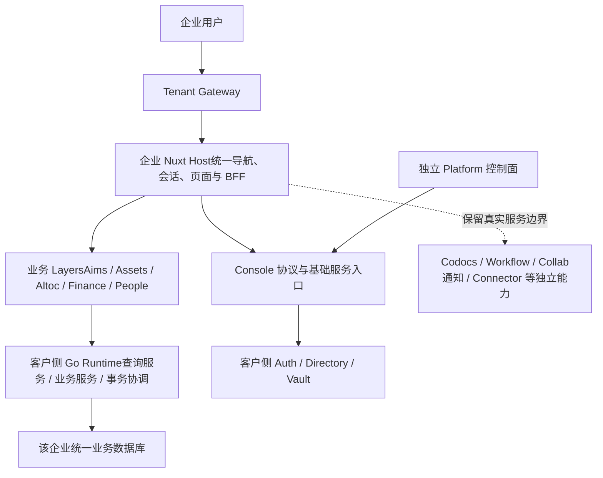

# ADR-018：统一企业应用、租户业务数据库与全量功能交付

状态：原架构方向已确认；本次配套修订稿待审阅纳入。原稿记载“尚未切换任何运行路径”；本次不据此推断最新线上进度，也不声明已完成合库、权益转换或发布。

原决策日期：2026-09-13。原稿仓库基线：`801b402e`。修订日期：2026-09-21。修订版本：1.2。

修订依据：用户提供的 ADR-017/018 与后续 Codocs 目标讨论；本次核对了当前 Host 文档页接线，但不是生产环境审计。保留原有业务整合、Nuxt Layers、租户业务单库与全量功能决策，补齐身份、查询、事务、任务、迁移和前端职责契约，并明确 Codocs 独立前端只作过渡。

实施台账：[统一企业应用实施计划与 TODO](./Unified-Enterprise-Implementation-Plan.md)。本文维护架构决策，进度和待办只在实施台账维护。企业侧业务导航、对象工作台及前端阶段门槛由 [ADR-019](./ADR-019-Enterprise-Business-Frontend-Integration.md) 细化；[前端技术路线](./Enterprise-Frontend-Integration-Technical-Roadmap.md) 提供实施建议，不另设事实进度表。

## 1. 决策背景

汇智云面向中小软件企业，产品规划、研发、销售、交付、资产和财务存在频繁协作。目前仓库已经是 monorepo，各 Nuxt 业务应用继承 `@hzy/foundation`，多个业务 adapter 也已由同一个 Go Data Runtime 承载，但前端、BFF、应用身份、发布及业务数据库仍按应用划分。

当前复杂性主要包括：跨 Worker 路由与部署上下文传播、重复会话初始化、服务令牌与 grant 配置、接口发布次序，以及目录投影和业务状态的可靠同步。近期产品线名称问题还涉及字典权威数据缺失、投影未更新和历史快照读取；仅合并前端无法解决这些问题。

用户已确认：

1. 逐步整合企业应用，以 Nuxt Layers 保留业务模块组织。
2. 整合同一企业的业务数据库，允许受控跨模块查询、内部业务服务协作及事务。
3. 不再区分基础版、专业版等商业版本，也不按应用销售功能包；企业统一获得全量功能。
4. 保留人员权限、数据范围、敏感动作控制和企业数据隔离。

## 2. 目标形态与边界

采用“统一企业应用 + 模块化业务服务 + 每租户统一业务数据库”。合并部署单元，不取消业务职责。

四类边界分别管理：用户体验可以按业务对象整合；领域事实仍由主责服务维护；租户/环境与 Auth/Vault 信任边界保留；物理进程和数据库可以在已验证范围内收敛。前端模块数量不决定数据库数量，前端业务导航也不要求后台按新菜单重新划分领域。

图示为职责划分，不表示所有框都是独立进程。Console 租户持久化及密钥继续遵守 ADR-017，由客户侧 Runtime 承载。

| 范围  | 决策  |
| --- | --- |
| Aims、Assets | 首个整合试点：产品主档、产品线、产品规划、版本及采用查询 |
| Altoc、Finance、People | 试点完成后按具体业务链路扩展，同一企业业务库为目标 |
| Foundation | 继续负责 UI、认证、授权、请求上下文、路由与客户端基础能力；不吸收所有业务逻辑 |
| Console | 提供认证协议及企业基础能力；可将管理页面注册进 Host，不再拥有第二套企业主 Shell 或权威会话 |
| Platform | 保持独立部署及控制数据库；统一企业订阅与发布治理 |
| Codocs、Workflow、Collab、通知及 Connector | 首轮保留现有运行边界；Codocs 长期保留文档领域职责，不以保留完整独立企业前端为目标。协作、文件处理等必要能力可独立运行；全量功能授权包含适用功能，不因独立部署另设购买门槛 |
| Account | 本计划不包含 legacy Account 改造或数据迁移 |
| 所有企业的数据 | 不合入一个可混用的业务库；默认每租户、每环境独立业务库与明确部署/连接绑定 |

全量功能表示产品使用资格；某能力所需外部服务未配置或组件尚未部署时，应显示真实的启用条件，不显示“请升级版本”，也不能虚报可用。

## 3. Nuxt Host 与业务 Layers

建议新增企业宿主目录，工作名为 `enterprise/`；最终路径、包名和技术 release tag 在 INT-001/INT-002 冻结。初期从现有目录提取可组合的业务 layer，并保留兼容启动入口，避免先做全仓目录搬迁。

### 3.1 组合规则

Codocs 的普通文档页面和自有编辑工作区以构建时组合进入 Host 为目标，共用唯一企业 Shell 和会话协调；编辑器可按路由/动作加载，不因组件较重而默认保留第二套完整前端。实时协作、文件转换和需要隔离不可信内容或第三方脚本的预览，按明确的服务或安全边界保留。旧独立页面和受控 iframe 仅是有消费者清零、功能等价与回退条件的迁移兼容路径；保留后台服务不要求永久保留旧应用外壳，也不授权提前停止旧部署。正文、附件、版本、审计和对象权限仍由文档领域正式服务端合同维护，Host 不取得数据库或长期存储秘密。

- Host 唯一负责 `app.vue`、企业级布局、登录入口、路由分发与宿主运行配置。
- 业务 layer 提供页面、模块组件和显式注册的 BFF；Foundation 继续提供共享基础设施。
- 第一阶段保留 `/aims/...`、`/assets/...` 等业务 URL，通过显式路由前缀挂载；Layer 不会自动赋予独立应用命名空间。面向用户的新业务 URL 与旧地址兼容映射按 ADR-019 分阶段引入，保留旧 URL 不等于永久按应用组织导航。
- 同名组件、composable、server utils、插件、中间件、静态资源和任务必须盘点；禁止依靠 layer 优先级意外覆盖。优先显式导入，业务公共名称加模块前缀。
- 相对路径、`~` 别名、CSS、自动导入和运行配置逐项适配；Host 不直接合并各应用完整 `nuxt.config.ts`。
- `useState`、`useAsyncData`、`useFetch` 和服务端缓存键必须包含适用的租户、环境、主体、业务模块、对象与查询维度；共享缓存还需权限版本或可靠失效机制。切换用户/租户时取消旧请求、清理不再适用的状态与 KeepAlive，拒绝旧请求迟到结果；不能仅靠全局模块变量保存上下文。
- 共享会话初始化和权限快照；组件按页面懒加载。全量功能不意味着首次访问下载全部业务 JavaScript。
- Host 统一登记前端 middleware、Nitro plugins 和 HTTP/BFF 路由，禁止业务 Layer 自动带入重复会话初始化或全局副作用。
- cron、outbox drain、同步及可靠业务任务的执行位置按 §4.6 登记：已迁入客户侧 Runtime 的任务不因合并 Host 而再启动；仍在独立服务的任务保留唯一主责。迁移开关只决定运行路径，不决定购买权益。

### 3.2 运行身份

区分物理宿主身份与逻辑业务模块。Host 不能通过覆盖一个全局 `appCode` 模拟不同应用，不能使用“全权限用户”解决服务认证。

同一受信进程内使用结构化调用上下文，包含经验证的 tenant、environment、deployment、subject、逻辑来源/目标、业务动作和 trace。内部函数调用不再为了同进程协作绕 HTTP、重新签 JWT；服务入口仍执行权限与数据范围规则。

“同一受信进程”分别指 Host 内或 Go Runtime 内，不表示 Nuxt/TypeScript 可直接调用另一个进程的 Go 服务。Host → Runtime 始终是实际传输与信任边界。上下文由入口校验后生成；浏览器 `appCode`、subject、部门和管理员标志不是可信授权事实。workload 证明调用方，用户委托证明用户操作，不能互相代替。

Host → Runtime、独立 Console/Workflow/Codocs、外部服务仍是真实信任边界，保留短期服务身份、签名用户委托、租户/部署绑定、scope、有效期和撤销校验。宿主身份与旧 `<app>.runtime` 的映射须由正式契约和验收覆盖，未完成之前继续使用现有精确身份，不通过放宽校验兼容。

## 4. 租户业务数据库与访问规则

### 4.1 存储组织

- 目标是同一租户、同一环境的核心业务数据使用统一数据库和受控连接管理；具体库名、字符集、排序规则、时区和表名映射由盘点决定。生产/测试和不同租户不得因合库混用。MySQL 的 Schema/Database 是同层概念；本目标是一个 Database 内的领域表组，而非“单库内再建多个 MySQL Schema”。[R3]
- 表和代码按业务域组织。表前缀/目录用来表达责任，不再代表必须经远程应用访问。
- Platform 控制数据库保持独立。Auth、Vault、Session、签名密钥遵守 ADR-017；第一轮保留客户侧 `hzy_console` 及安全域访问身份，不作为普通跨域 JOIN 对象。Directory 必要字段按明确契约引用，不连带开放认证/密钥表。
- Cloudflare、Nuxt BFF、浏览器均不获得业务数据库凭据，不新增 SQL-over-HTTP 接口。
- 合并物理库与消除重复主档是两项工作；不得以“表已搬完”作为数据整合完成标准。
- 统一迁移调度、版本检查、备份恢复和连接池预算可以先于搬表实施；同实例多库允许作为受控过渡，不为改库名而延误业务事实整合。
- 每张表保留主责域、迁移归属和访问规则。迁移编号按域识别并保留 checksum/执行记录；全局调度协调依赖，不简单拼接各模块 `001/002`。
- 连接池由经过验证的租户/环境/数据库访问身份定位，不能通过全局可变 DSN 或 `USE database` 切换共享上下文。独立安全账户不为省连接强行共池；同库也不自动等于单连接池或一个事务。
- 保持跨域稳定 `code` 与域内 `id` 的现有关系；明确唯一性范围，保留旧 ID 映射。合库不触发全量改为全局自增 ID，不新建 Console 中央业务关系表。
- 实际容量、权限、独立交付或法规约束要求分存时，按专项决策保留，不把“所有表必须搬入”当统一体验的前提。文件、对象存储、搜索和高容量采集不因本 ADR 强行迁入业务 MySQL。

### 4.2 允许的跨模块协作

| 操作  | 目标实现 | 约束  |
| --- | --- | --- |
| 当前名称、状态、关联信息读取 | Runtime 查询服务直接引用权威表，允许 JOIN 和批量查询 | 每个关联对象及敏感字段执行适用的数据范围和字段权限 |
| 跨域报表与聚合 | Runtime 专用查询服务 | 分页、排序、统计在授权范围内完成，不能通过总数或聚合泄漏不可见数据 |
| 修改单域对象 | 调用负责该对象的领域服务 | 生命周期、唯一性、修订、审计由同一服务维护 |
| 必须原子提交的跨域操作 | Runtime 用例服务调用各领域服务，共享一个事务句柄 | 决定提交结果的状态/并发/额度校验在事务内读取或复核；所有参与写入共用该事务，不各自独立提交 |
| 通知、文件、外部系统、异步长任务 | 提交后可靠投递 | 保留 outbox、幂等、重试及必要的人工处理入口 |

读取权限不因已能读取来源对象而自动扩大到目标对象。例如有项目权限不自动获得员工成本明细；无权读取的关联数据按合同省略/拒绝，不泄漏其名称、存在性或总数。

跨模块查询集中在领域查询/用例服务中，允许直接使用其他业务域的权威表和约定查询视图；用明确依赖及 schema 契约测试管理耦合，不再为每个查询强建远程 API。业务写入集中到所属服务，避免多个调用方各写一套状态规则。

物理合库不是原子事务的充分或必要条件。过渡期若相关表位于同一 MySQL 实例、支持事务的存储引擎且使用同一连接，可评估跨 schema 事务；不同实例、不同连接或包含外部调用时，不能宣称一个本地事务能够全部回滚。事务内不等待网络调用，不执行长时间导出。

### 4.3 主档、投影与快照

| 数据  | 权威责任 | 处理方向 |
| --- | --- | --- |
| 产品、产品线及当前分类名称 | Assets 产品目录领域 | 保留一套主档；Aims 经 Runtime 直接引用当前事实 |
| 产品管理空间、模块、功能、需求、版本 | Aims 产品规划领域 | 保留职责与关系，不与产品主档混成一个表 |
| 产品纳入统一空间的关系 | Aims 产品规划领域 | 保留 `product_component_sources` 等约束及历史关联 |
| 客户、商机、合同、经营回款计划 | Altoc | 后续统一主档和稳定关联，不覆盖 Finance 入账事实 |
| 发票、到账、核销、财务记录 | Finance | 保留账务规则、已确认事实和审计，不由其他模块直接改写 |
| 用户/部门/目录身份；任职/成本事实 | Console Directory；People | 明确两类职责，优先统一标识，不能机械合并不同语义的表 |
| 签署内容、历史成本、版本发布事实 | 各业务领域 | 保留有业务语义的不可变或版本化快照 |
| 仅用于展示当前名称的重复副本 | 查询实现 | 优先移除；确有搜索/性能需要时改为可重建读模型 |

产品试点须逐个分析 `product_catalog_projection`、`product_line_workspaces`、`product_component_sources` 的用途。投影可能同时承担接入水位、授权过滤或历史来源证据，不能为去掉“同步目录”按钮直接删除这些语义。

完成试点后，产品主档改名应在后续正常查询中体现；不再需要用户手工同步当前名称。接入决定、历史快照和已发布内容按原有历史语义保留。保留的读模型须定义更新水位、自动更新、失败重试、重建和新鲜度指标。

### 4.4 跨域查询与授权契约

允许受控 JOIN 是本 ADR 的主动选择，不恢复“每个查询必须绕远程应用 API”的限制。查询必须集中于有名称、有用途、有主责的查询/用例服务；禁止让 Host 传 SQL、任意表名或无限制动态关联条件。

首轮为产品查询补齐以下契约，并沿用到后续业务链路：

| 契约  | 必须定义 |
| --- | --- |
| 数据依赖 | 依赖的权威表/稳定视图、字段语义、拥有者、schema 兼容窗口与变更测试 |
| 对象范围 | 产品、空间、项目、部门等可见范围的生成方式；列表、详情、计数、导出复用同一授权语义 |
| 字段披露 | 哪些字段可见、脱敏或不可返回；不会因查询已关联主对象就暴露目标对象 |
| 部分可用 | 无权、未配置、暂不可用与确实为空的返回规则；对不可见对象不泄露名称和计数 |
| 汇总权限 | 汇总结果本身的授权及披露边界；不必自动要求底层所有明细权限，也不允许用小样本/钻取重建敏感明细 |
| 缓存  | tenant/environment/subject、有效权限版本或可证明失效、对象与查询参数；撤权和对象关系变更的失效规则 |

“可查看项目成本汇总”与“可查看每位员工工资”是不同能力。允许服务在授权的汇总规则下计算结果，不能通过使用全权限服务账户规避调用用户的结果披露边界。

已有权限 manifest、授权 evaluator 与数据范围规则继续作为事实源；可增加最小的可复用授权查询约束，不在 SQL、Host 和查询服务另建三套角色算法。

### 4.5 跨域事务编程契约

默认仍是域内事务；只有明确的同提交业务不变量才使用跨域原子事务，不把整条商业履约链装入长事务。

1. Runtime 用例服务开启/提交/回滚事务，参与领域服务接收同一事务上下文。领域服务不得暗自开启第二个事务或使用默认连接池完成参与写入。
2. 纯格式检查和非状态依赖预检查可在事务前执行；决定提交结果的状态、额度、唯一性、修订号及并发条件须在事务内读取或复核。
3. 业务写入、成功审计、幂等 Receipt 与 Outbox 按用例要求同事务提交。失败/拒绝尝试另按安全审计规则记录，不伪装成业务已提交。
4. 幂等键绑定租户、环境、动作及请求内容摘要；相同身份不同参数不能静默复用结果。提交结果不确定时，先查询稳定 Operation/Receipt，再恢复或重试。
5. 事务内不调用 HTTP、发邮件、上传对象、等待外部审批或执行长导出；这些副作用提交后可靠执行。需要同步校验外部事实时，明确其新鲜度及变化风险，不宣称本地事务能回滚外部系统。
6. 统一规定锁顺序、隔离级别、超时、乐观修订和可重试错误；重试受稳定操作身份约束，不自动重复不可逆动作。
7. 通过故障注入证明共享事务实际覆盖所有参与写入；不能仅凭函数签名出现 `tx` 就认定通过。

Go `sql.Tx` 与 `sql.DB` 的混用会使部分操作离开事务，这是需要在评审和测试中禁止的实现错误。[R4] 具体 helper 名称和接口按现有 runtime 代码确定，不为本 ADR 先造通用分布式事务框架。

### 4.6 后台任务与发布执行责任

| 能力  | 目标执行责任 | Host 的职责 |
| --- | --- | --- |
| UI middleware、页面插件、BFF | Enterprise Host | 统一注册、去重和限制作用域 |
| 已迁入 Runtime 的业务写入、Receipt/Outbox、同步与调度 | 客户侧 Runtime 的主责域/任务运行器 | 触发经授权的业务请求、展示任务状态，不复制执行器 |
| 尚未迁移的 Workflow/Codocs/通知/Connector 等 | 台账中明确的原独立服务 | 使用正式接口，不自动随 Layer 装载其 cron |
| Platform 发布治理与平台级任务 | Platform | 仅按控制面合同消费，不操作客户业务表 |

统一任务注册包含 tenant/environment、执行主体、任务版本、权限范围、幂等身份、并发/租约或执行代次与水位。旧实例、重复定时器、回调和重放由相同操作身份及消费约束控制；以“不重复业务效果”为目标，而非宣称 exactly-once 网络投递。

## 5. 全量功能交付与人员权限

### 5.1 简化产品使用资格

- 统一企业产品，不再按商业版本或业务应用划分功能购买资格。
- 保留企业开通、有效期、停用/恢复等整体使用状态，以及实际资源和运行配置。
- 应用目录演变为业务模块目录；模块开关用于配置、导航和上线迁移，不作为升级付费门槛。
- 不同商业版本取消，不等于取消软件版本、schema 版本、兼容矩阵、部署记录和技术发布 tag。
- 已有订阅、License、订单和签名记录保留历史；用受控转换生成统一权益，不直接改写历史凭证或账务。
- 生效时间及既有有效期等冲突处理在迁移映射表明确；不能通过默认延长服务期、补收费或重写合同来迁移。

**适用对象限制：**以上取消商业版型和应用购买门槛，只针对“汇智云平台自身的产品使用资格”。租户仍可通过业务模块管理其对外销售软件的基础版/企业版、套餐、模块、授权规格和价格。本决策不得误删这些租户业务能力。

### 5.2 保留业务授权

企业取得全部功能，不自动给每个人全部操作权限。岗位、角色合并、对象关系、部门/项目范围、敏感字段、审批/确认/发布权限和职责冲突继续生效。普通用户按既有合并权限规则使用业务功能，不为切换工作台强制切换互斥角色；管理员的权限模拟/查看模式与真实授权分开，不默认提升权限。

模块 manifest 继续作为资源、动作及角色的技术事实源，由构建生成统一目录；不在 Host、Platform、Console 分别手写一套清单。已有动作代码优先兼容，避免把本次整合变为全量角色迁移。

新目录需区分：未具备整体企业资格、当前人员无权访问、能力未部署/配置、系统暂不可用。不能将后面三类错误统一显示为“未购买模块”。所有列表、详情、写入、导出和聚合仍在服务端校验。

## 6. 迁移与回退原则

1. 按租户和业务链路切换，读路径、写路径、调度路径分别登记当前实现与 schema 版本；先测试，后逐租户推广。
2. 每个对象同一时刻只有一个权威写入方。影子读取仅做对比，禁止复制真实写请求以“验证”新路径。
3. 初始复制后可以做单向、有水位的增量追平；正式切换时暂停相关写入，排空或明确转移在途操作，完成最终核对再开放新写入。
4. 迁移保留业务键、内部 ID 映射、外键/逻辑引用、状态修订、快照、审计、幂等 receipt、outbox 与消费水位。老异步命令和外部链接中的 ID 也在映射范围内。
5. 并发写、重试、源已提交但未确认、重复定时任务均需测试。新旧命令适配器共享稳定操作身份，避免切换后重放产生第二次 mutation。
6. 旧路径保留兼容窗口；未迁移模块继续使用其正式服务契约。已迁移内部链路完成验收后才关闭对应同步任务和 grant。
7. 新库尚无新增写入时可回到旧只读校验后的入口；已有新写入后，优先用兼容旧 UI/BFF 访问新权威存储回退。必须恢复旧库时，应先暂停写入并反向迁移新增事实、核验一致后切换，不能直接覆盖迁移前备份。
8. 旧表、接口、部署和权限的删除属于最后清理阶段，依赖消费方归零与恢复演练证据；删除日期在实际验收后确定。
9. 验证不仅比较行数，还核对金额/状态汇总、产品空间接纳、项目与工时、成本快照、冻结状态、审批、客户资产与权限语义。存储调整与模型重构分成可独立验证的变更。
10. 前端 Host、物理合库、权限目录和 Auth 迁移分别记录开关与兼容矩阵，不捆成一次不可诊断切换；前端可以先使用现有正式 API 完成业务工作台。
11. MySQL DDL 与业务 DML 的事务边界分开。部分 DDL 会隐式提交，不能用一层业务事务宣称整个 schema 升级可回滚；采用兼容扩展、验证后收缩和经过演练的恢复路径。[R5]

## 7. 发布、性能与验证

Cloudflare 2026-09-04 公告明确：Worker 按未压缩大小计算，上限 64 MiB，取消原压缩包限制；官方仍列出 isolate 内存 128 MB、顶层初始化 1 秒。静态资源、浏览器加载量和 Worker 代码上传量分别测量，不用磁盘目录总大小代替 Wrangler 的 `Total Upload`。[公告](https://developers.cloudflare.com/changelog/post/2026-09-04-increased-worker-size-limit/)、[限制](https://developers.cloudflare.com/workers/platform/limits/)。本次复核日期：2026-09-15，实际部署前仍需复核；这些是平台公开上限，不是本项目的验收预算。

Layers 是配置和文件组合机制，存在覆盖优先级，不提供独立进程、租户隔离或数据库一致性。[Nuxt Layers](https://nuxt.com/docs/4.x/getting-started/layers)。

首轮性能基线涵盖：上传大小、启动时间、实际套餐 CPU 限额、并发内存、首次进入与跨模块导航的 P50/P95、请求次数、SQL 次数、慢查询和构建/typecheck 时间。先记录旧路径数据，再固定验收阈值；比较同一环境、账号、数据规模和缓存状态。留足容量余量，不以刚好能上传作为通过标准。

Host 统一发布扩大故障影响范围，须保留按租户/业务链路灰度、路由回退和兼容旧 URL。技术 release manifest 同时记录 Host、Runtime、schema、权限目录、导航/路由映射与模块源码版本，防止整包发布与数据版本脱节。

模块灰度指已具备兼容合同的路由/业务能力定向，不表示 Layers 支持某模块运行时独立换包。全局插件或顶层初始化错误可能使整个 Host 失败，须有整包回退，不能只依赖隐藏菜单。旧 HTML 使用的 hash 静态资源、路由映射及 API 版本在兼容窗口内保留，避免灰度后动态加载 404。

按相同环境、数据、账号和缓存状态分别验证 UI、BFF、Runtime。128 MB 是每 isolate 的公开限制，不是每个请求可独占的预算；特别测试并发 SSR、请求上下文隔离及大响应内存。具体性能阈值先测基线再冻结，不虚报已有测量结果。

## 8. 现有约定的适用范围

本 ADR 调整已迁移业务范围内“必须分应用部署、跨模块必须绕 BFF/HTTP、业务库必须按应用隔离、产品资格按应用划分”的目标约定；不推翻 ADR-016/017 的客户侧数据边界，也不解除现有部署的鉴权或数据库隔离。

后续实施按台账中的具体合同逐条迁移：

- 未迁移路径继续遵守现有 `MODULE_CONTRACTS.md`、模块 API 与精确 scope。
- 已迁移路径以同步更新的 Runtime/Host 合同及版本化路径登记为准，允许本文规定的内部查询、领域服务与事务；后台菜单改名不自动迁移数据主责或授权作用域。
- 不通过注释旧规则、全局放行 app/scope、让 Nuxt 直连数据库实现兼容。
- 当前新增的文档指引不代表任何数据库已经合并、权益已经转换或服务已经发布。

相关文件：[ADR-016](./ADR-016-Tenant-Runtime-Business-API-Architecture.md)、[ADR-017](./ADR-017-Console-Tenant-Data-Plane-Separation.md)、[模块契约](./MODULE_CONTRACTS.md)、[Runtime API](./Tenant-Runtime-API-Contract-v1.md)、[产品线现状](../aims/docs/Aims-Product-Line-Management.md)。

## 9. 暂不采用的方案与代价

| 方案  | 本轮判断 |
| --- | --- |
| 只合 Nuxt 项目，继续保留全部旧同步和内部 HTTP | 可以作为过渡，不作为整合完成状态 |
| 所有模块任意写其他模块表 | 会分散状态规则和审计，写入统一经负责领域的服务 |
| 所有租户共用一套可混用连接/全权限身份 | 不采用；保留租户绑定与服务端授权 |
| 一次搬迁全部模块、数据库和授权 | 不采用；用产品链试点，再扩大范围 |
| 为减少部署数同时迁移编辑器、协作、通知、Connector | 与首轮目标无直接关系，先保持独立运行边界 |

统一库会扩大 schema、备份和恢复的影响范围；直接关联查询会增加 schema 耦合。通过领域写入责任、稳定标识、契约测试、兼容迁移、索引及恢复演练管理这些代价。具体选表、容量、事务边界、历史权益映射与上线日期由实施盘点补齐，不在缺乏证据时预先假定。

## 10. 与 ADR-017/019 的实施衔接

ADR-017 负责认证、长期秘密、客户侧权威状态和支持访问；本 ADR 负责业务运行单元、数据组织、内部协作及汇智云自身全量功能资格；ADR-019 负责企业用户的信息架构、对象工作台、前端注册及路由兼容。

三者共同约束：不在 Host 保存租户业务事实、不恢复数据库直连、不新增无限权限身份、不以临时路径退化安全边界。可以并行推进，但同一租户上线不将 Auth 权威迁移、核心物理合库与全量前端替换强制捆绑。

Aims + Assets 产品链的完成定义是：当前主档自动一致、接纳关系与历史发布不变、权限不扩大、用户能在产品业务工作台完成既有任务。不以“页面进了一个 Host”或“表进了一个库”单独验收。

## 11. 关键验收清单

| 编号  | 验收要点 |
| --- | --- |
| INT-A01 | 同租户同环境绑定明确；跨租户、跨环境及 SSR 并发无数据/缓存串用 |
| INT-A02 | JOIN、分页、详情、导出和统计执行一致的对象/字段/汇总授权规则 |
| INT-A03 | 跨域事务故障注入无部分提交；丢响应重试无第二次 mutation |
| INT-A04 | 当前产品/产品线改名正常查询生效；接纳关系、历史快照与发布内容保留 |
| INT-A05 | schema、Pool、任务及发布归属明确；同库不被当成共享全权限账户 |
| INT-A06 | 旧入口/回调/定时器重放不产生重复效果；新库有增量后的回退演练通过 |
| INT-A07 | 汇智云全量资格转换不重写历史账务，不删除租户自身产品版型/价格能力 |
| INT-A08 | Host 构建、Cloudflare/PM2 路径和真实信任边界通过；无第二会话或 Auth DB fallback |
| INT-A09 | 模块灰度与整包回退均可用，旧 hash 资源和 API 合同在兼容窗口内有效 |

验收编号是测试契约，不是已完成 TODO；证据和进度只登记到原实施台账。

## 12. 参考与配套文档

- [ADR-019](./ADR-019-Enterprise-Business-Frontend-Integration.md)：企业侧按业务整合的前端决策。
- [前端技术路线](./Enterprise-Frontend-Integration-Technical-Roadmap.md)：Host/Layers/页面组合、迁移阶段及工程门槛建议。
- [修订说明](./ADR-017-019-Revision-Notes.md)：原决策保留范围和本次差异。
- [R3] MySQL 官方：[CREATE DATABASE / CREATE SCHEMA](https://dev.mysql.com/doc/refman/8.4/en/create-database.html)。
- [R4] Go 官方：[Executing transactions](https://go.dev/doc/database/execute-transactions)。
- [R5] MySQL 官方：[Statements That Cause an Implicit Commit](https://dev.mysql.com/doc/refman/8.4/en/implicit-commit.html)。

技术资料核对日期：2026-09-15；项目 Nuxt/Nitro/数据库具体版本与已迁移路径须在实际实施时盘点，不从文档示例版本反推生产现状。
