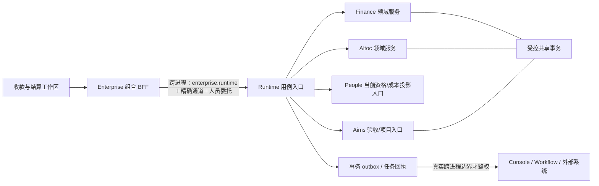

# APF 销售与财务日常办理简化方案

状态：**已批准**（2026-10-07）。用户已批准 §9.2 四个方向。当前实施 S1，不变更数据模型或三组异人职责；S0 改用本地合成数据记录任务步数，hzy0 切换由 Codex-sol 负责。

日期：2026-10-07。代码基线：`e7e9eb83d1ba23aeba1ef1d5bea9e92f903a3c4f`，来自 GitLab 集成分支。本次仅方案，不修改代码、数据、权限或部署。

## 1. 建议结论

把现有「应收工作台、到账、核销、历史接续、调整、分配批次」重组为一个**收款与结算工作区**。用户围绕客户和合同完成登记到账、分配到款项、申请/办理开票、跟进欠款；技术批次、迁移验封和幂等回执进入后台，不成为日常步骤。

建议取消**普通历史合同逐份点击激活**：一次批准接续政策与受审批次后，Runtime 自动为证据完整且无未决异常的合同接续净期初；异常才进入财务待办。已有净期初不重建，旧明细不再冲减期初。所谓「零操作」是销售和财务不重复逐合同确认，不是迁移无需确认、不验封或把异常猜成正常。

最小职责配置采用「销售经办＋两位可兼岗的财务人员」，不是三套必须切换的角色。两位财务按具体单据分别承担到账确认与核销；同一人可以在不同单据承担不同职责，但不能在同一单据完成互斥动作。保留当前 Runtime 的硬约束，不用系统账号代替第二人。

跨域计算与写入收敛至 **Runtime 进程内的 owning typed 领域服务**，复用 B5-B 已有共享事务。Enterprise 只组织页面与请求；Enterprise→Runtime 仍是信任边界。Runtime 内的纯业务协同不再绕 HTTP、签服务令牌或建立服务 grant；Console/Workflow/外部系统仍独立时保留其可靠投递与鉴权。

## 2. 现状证据及本轮观察限制

依据：[功能差距计划](APF-Feature-Gap-Plan.md)、[B5-A 合同](B5A-Receivables-Contract.md)、[B5-B 合同](../finance/docs/B5B-Receivables-Contract.md)、[D11](ADR-018a-Fold-Aims-Codocs-Into-Enterprise.md#9-整合后服务授权收敛d112026-10-01-定稿)、[模块合同](MODULE_CONTRACTS.md) 和当前源码。

另核对主检出受保护报告 `.git/report-apf-b5a.md`、`.git/report-apf-b5b.md`、`.git/report-finance-historical-continuation.md`。这些报告不随本方案复制到仓库。B5-B 后续修复已将单合同选择器改成分页列表→独立详情，并修正日期封存格式与 `primary` 映射问题；本方案不把这些已修复缺陷继续列作待修功能。

### 2.1 hzy0 证据口径

- 后续接续报告记录 hzy0 曾切到 `finance-continuation.31`，但这只是报告时点，不是本轮查询到的当前版本。报告记录受审期初存在、当时未执行历史激活；不能据此推断现在仍没有业务写入。
- 本轮 `cua.getState()` 返回原生浏览器通道启动失败，`iab` 返回不可用。因此**没有完成本轮 hzy0 实页走查或真实用户点击计数**，也未连接数据库补查。上线前必须补 §9 的现场任务验收。
- 查看了报告随附的两个合成截图：`b5a-visual/detail-1440.png` 与 `b5b-continuation-evidence/visual/continuation-detail-1440.png`。前者把指派、到期日、联系记录作为主要动作；后者在证据已核验时仍以「激活历史接续」为主按钮，并展示源表/来源编号。这些是既有交付材料，不是本轮 hzy0 实页截图，也不据此判断当前生产布局或无障碍合规。
- 当前组件源码仍有这些对应命令和页面，因此下文主要结论来自**业务流程与合同分析**。涉及视觉密度、点击次数和实际响应速度的判断均为待验证设计目标。

### 2.2 真正需要简化的部分

| 当前已交付行为 | 日常使用的负担 | 目标行为 | 保留的底层控制 |
| --- | --- | --- | --- |
| 销售在应收详情维护责任人/日期/跟进，到账与分配另走 Finance | 用户按模块寻找下一步，重复选客户/合同 | 同一工作区显示款项、到账、开票；携带上下文办理 | 各 owning 域仍独立判人员权限与对象范围 |
| 净期初证据已核验后，逐合同 activate | 重复批准同一迁移政策，正常对象也进队列 | 一次批准自动接续范围，正常合同自动可用 | 持久接续证据、T0、验封、幂等、异常隔离 |
| 分配批次、调整、历史明细各有独立入口 | 技术对象成为业务导航主线 | 主线展示「分配结果」「更正记录」，详情再看批次 | 分配组原子性、整组撤销与审计不变 |
| 「应收金额/已收金额」可能与到账、分配混读 | 不清楚钱是否到账、是否已归属 | 明确「应收未结 / 已确认到账 / 待分配 / 已开票」四种事实 | 不合并数据模型，不把开票当收款 |
| 已有严格动作和职责分离 | 以为必须切角色，或要多人接力每一步 | 根据当前会话合并权限呈现下一动作；冲突时转同一页面待办 | Runtime 继续拒绝自核销、自开票、自确认调整 |
| 统一 UI 后仍可能保留跨模块 HTTP 编排 | 网络往返、重复授权读取和恢复状态增加 | 同进程 typed 调用与共享事务；跨进程才使用协议 | D11 的租户、actor、范围、审计和外部边界 |

不能归咎于网络调用的部分也要分清：B5-B 已有 Finance→Altoc 同一 caller-Tx 的窄入口及统一余额计算；本方案是复用和扩展，不声称现在每次核销都走远程 HTTP。

## 3. 日常主线：一个工作区，按当前任务展开

### 3.1 信息结构

主导航保留一个「收款与结算」，默认视图按用户职责选择「待收款 / 到账待分配 / 待开票 / 待我复核」。它们是同一工作区的不同筛选，不复制四套页面。客户和合同详情的应收页签进入同一组件并预填范围。账户、正式票据、原始到账仍保留独立查账入口，旧链接重定向到对应对象，不强迫用户改变收藏。

桌面主区以客户→合同→款项显示未结事实，右侧为所选客户/合同的办理栏；登记到账、分配、开票、联系记录在办理栏内切换。用户操作后只刷新受影响行与摘要，不跳回全局列表重选。手机用同一上下文的全屏办理层，返回恢复筛选、滚动及草稿；「一屏」表示一个持续工作上下文，不把所有字段硬塞进 390px。

```text
1440 × 900｜收款与结算                         [登记到账] [更多]
            [待收款] [到账待分配] [待开票] [待我复核]
            [客户/合同搜索____] [到期范围] [币种 CNY] [更多筛选]
            应收未结 …｜已确认到账 …｜待分配 …｜已开票 …
 ┌──────────────────────────────────┬────────────────────────┐
 │ 客户/合同  款项/到期日  未结  下一步│ 示例客户甲 / 示例合同甲 │
 │ 客户甲                            │ 应收未结 100,000 CNY   │
 │   合同甲                          │ [到账] [分配] [开票] [跟进]│
 │   □ 首期款   10-15   60,000      │ 已选到账 100,000        │
 │   □ 验收款   未约定  40,000      │ 分到首期 60,000         │
 │                                  │ 分到验收 40,000         │
 │ [真实服务端分页]                  │ 余款 0                 │
 │                                  │ [确认分配] 或 [交复核]  │
 └──────────────────────────────────┴────────────────────────┘
            [收款记录] [发票记录] [更正与历史]（当前对象）

390 × 844｜收款与结算                   [登记到账]
           [任务视图 ▾] [筛选·2]
           [搜索客户/合同____________]
           示例合同甲  应收未结 100,000 CNY
           首期款 60,000   到期 10-15    [办理]
           验收款 40,000   到期未约定    [办理]
           [上一页] 1 [下一页]
  点「办理」→ 全屏上下文层
           ‹ 示例合同甲          [到账 分配 开票 跟进]
           金额/账户/日期 → 款项分配 → 操作结果
           底部固定 [当前允许的下一步]；保留草稿与返回位置
```

以上均为合成数值。金额分币种，四项指标分别命名，不能相加作为「总资产」。当前查询总计由服务端产生；缺权限的 Finance 指标隐藏，不显示 0。部分应收不具备到期日时显示「未约定」，不默认今天或合同结束日。

### 3.2 四条常用路径

| 场景 | 用户在同一上下文内完成 | 系统行为与边界 |
| --- | --- | --- |
| 收到客户付款 | 财务甲登记/确认到账，选客户/账户，预填建议分配；财务乙在「待我复核」确认分配 | 甲是 `confirmed_by`，乙核销；建议不是已生效核销，不以机器人替乙签字 |
| 先开票后收款 | 销售/经办从款项提交开票申请，财务收到批准后的待开票项并办理 | Workflow 仍异步；申请批准≠正式票。未到账不产生核销，不强制等收款才开票 |
| 先收款后开票 | 到账确认后分配，款项展示待开票；有权者提交/办理票据 | 复用同一计划引用；核销与开票各自状态，不反复询问客户/合同；B5-B 分配目标仍是结算计划，不伪称支持发票目标 |
| 追欠款/更正差额 | 销售记录承诺付款/下次联系；财务另发起折让/坏账/撤销 | 联系承诺不增加到账；调整录入者不能确认/撤销自己的调整；历史组撤销仍整组执行 |

**不要设计一个「全部完成」按钮把到账、开票、核销、调整连成不可解释的自动链。** 正常页只突出当前可执行的一项主动作。职责冲突时文案为「到账已由你确认，请交另一位财务分配」，显示可用待办，不弹空泛「权限不足」。没有第二位有权且可登录的人员时保留待办，不循环改派给自己或管理员。

### 3.3 默认值、少填字段与失败恢复

- 客户/合同/币种从当前上下文预填；账户只在唯一且仍有效、有权限时建议，提交重新校验；金额不默认填满后直接提交。跨客户付款、代付、未知法人不自动猜。
- 建议分配按最早到期、稳定次序生成，用户可调整；候选超额/币种/主体不符仍整体拒绝。预览与写入间版本变化返回差异，保留用户填写内容。
- 负责人默认为可验证的当前关系建议；保留主体、不可登录人员不能成为新指派。不能只为了发提醒而无痕批量给所有历史款项指定销售。
- 保存结果按独立事实显示：「到账已确认；分配待复核」「分配已完成；开票申请提交中」。跨 Workflow/通知没有分布式事务，绝不统一显示成功掩盖外部失败。
- GET 失败只说读取失败；POST 结果未知保留原意图键重试。初次加载、筛选空、真空、无权、依赖故障分开；局部历史证据读取失败不抹掉当前款项详情。

## 4. 历史合同默认自动接续：取消重复确认，不取消证据

### 4.1 三种方案比较

| 方案 | 日常负担 | 好处 | 风险/成本 | 结论 |
| --- | --- | --- | --- | --- |
| 维持逐合同手工激活 | 每份正常合同仍需打开、确认 | 逐对象显式决定，改动小 | 操作重复，没人点击就永远不能收款；「证据已核验」仍不可用 | 不推荐作为默认；保留为异常处理后的内部命令 |
| 无条件自动激活所有导入合同 | 表面零操作 | 上手快 | 无 T0/未知币种/缺期初也被放行，旧明细可能双计；失去审计依据 | 不采用 |
| **批次政策批准＋合格对象自动接续＋异常队列** | 正常合同零操作，异常才办理 | 保留净期初和持久证据，大幅减少重复动作 | 新增批次清单、后台任务、可恢复状态及例外界面 | **推荐** |

原受审期初确认可以作为依据复用。若原审批范围没有覆盖自动接续语义，批准一次明确的政策版本/合同集合/hash 即可，不再次要求逐合同重签。政策改变、生效范围扩大或证据变化时重新审查对应变化，不以「默认自动」扩大既有授权。

### 4.2 合格条件与处理分流

后台生成 `eligible / exception / already-ready / no-opening-needed` 清单，字段包括稳定来源身份、批次/hash、T0、期初金额/币种、关联对象及检查结果。金额计算沿用已有 `netOpeningOutstanding` 与 B5-B 事实，不建立第二份应收余额。

| 情形 | 默认处理 |
| --- | --- |
| 已验证主批次/受审期初、证据匹配、正期初、关联/币种完整、无未决影响金额异常 | 自动追加持久接续证明，之后进入普通应收列表；不再次 INSERT opening 行 |
| 原已激活且已有核销/调整 | 标记 already-ready，保留原证明与 actor；不覆盖、不重置已收或未结 |
| 已有 opening，但尚无 readiness | 核对受审原始基线、政策与当前业务引用后补证明；已有后续业务时用对账规则判定，不能拿已变的当前行冒充原 seal |
| 缓存与重算差异，尚未得到金额裁定 | 进入金额待确认队列，不静默选择一个值。既有已批准的差异裁定可复用，不重复入队 |
| 正常合同经可靠来源确认期初为零 | 不造零金额应收；记录「无需期初」证明，历史可查。不能用「未找到 opening 行」推断零 |
| 缺 T0、缺来源证明/主映射、币种/主体不明、负余额或证据真的变更 | 异常处理，相关写入保持失败关闭；不因一个异常阻塞整个批次 |
| 采购方向或全历史重建 | 不纳入本次自动销售净期初政策，单独方案 |

DATE/DATETIME 封存继续使用已修复的规范文本，不重新犯 parseTime 导致的假变更。首次接续验封与后续业务变化分离：确认后的证明引用不可变迁移基线；合法核销、到期日维护不应使原合同重新「失去激活」。遇到来源基线被修改则隔离该对象并提示审计，不能自动清除当前业务事实。

### 4.3 接续并不等于所有财务动作自动就绪

建议分清三项能力：`receivableReady`（净期初及后续收款）、`invoiceReady`（历史已开/未开基线与票据条件）、`historyReadable`（保全查询）。这些是由事实/证明派生的读投影，不是用户可任意修改的三个开关。

- 自动净期初只使受审的应收接续可用，**不默认开放历史合同再次按总额开票**。已开票历史、水位、主体/票种未知时，开票栏显示具体待补条件；收款可在自身条件满足时继续。
- T0 及之前旧收款/发票仍是历史查询，不再次冲减已净额化的期初；T0 之后到账/核销/调整才进入后续余额。边界使用 W1/B5-B 的业务日/时区与确定的包含规则，并在合同中固定，不由浏览器时间决定。
- 若 T0 到实际接续期间已在旧系统发生新交易，必须有增量截止水位与逐笔去重验证；当前新系统记录也要对账。只有期初而缺切换期间增量证据的对象不能自动判定完整。
- 已关闭合同仍可处理合法未结款，不自动变成销售新签合同；合同关闭不自动免债、不抹去期初。

### 4.4 零操作实施机制与异常页

采用 Runtime 内有租约/代次/幂等的有界后台任务，或受审迁移命令在 verify 后调用同一内部服务。**GET、打开列表、查看合同均不写 readiness**；不做首访懒激活，避免第一个普通用户无意承担接续批准。

```text
后台：政策版本＋已批准批次 → 只读检查/清单 → 合格对象逐项事务接续
                                      ├─ 已就绪：跳过并保留证明
                                      └─ 异常：业务待办 → 裁定/补证 → 重试同一对象

日常工作区：正常历史合同与新合同一起办理，仅在「来源」显示旧系统期初
财务设置 / 历史数据核对：
  已自动接续 N ｜无需期初 N ｜待核对 N ｜未纳入 N
  合同 | 问题（金额/币种/增量缺口/证据） | 建议处理 | [查看差异]
  详情：来源值 / 已批准值 / 当前事实 / 影响范围 → [提交裁定/交复核]
```

重试沿稳定的 batch/policy/contract 身份，业务证明与任务结果同事务；同范围重复运行无新增 opening/核销。分页进度可恢复，失败单项隔离，不开一个覆盖所有合同的长事务。生成 readiness 的系统 actor 与批准政策的人员分别审计，不能伪造 `activated_by` 为某位操作员。

## 5. 最小岗位与职责分离

这里的「合规」指保持本项目已批准的授权、审计和职责冲突控制；不是对所有行业法定岗位配置作统一结论。岗位可以合并，**同一对象的冲突动作不能合并**。无需为了简化 UI 新增「超级销售财务」角色或 admin 通配。

| 日常职责 | 最少必要动作 | 同一对象互斥 | 页面体验 |
| --- | --- | --- | --- |
| 销售/客户经办 | 范围内应收查看、跟进、开票申请；有显式授权才改责任/到期日 | 不能因负责客户获得银行账号、全量财务、开票或核销权 | 同一工作区仅显示与自己有关的款项/待办 |
| 财务甲/乙，按单据兼岗 | 显式到账确认、核销、开票、调整录入/复核等所需动作 | 到账确认人≠核销人；开票申请人≠开票人；调整录入人≠确认/撤销人 | 系统根据当前单据 actor 呈现可做动作，非切角色放行 |
| 财务负责人 | 接续政策/异常裁定及已有明确审批动作；可由甲/乙兼任 | 本人录入的金额调整不能自行复核 | 只收到真实例外和待复核事项 |
| 迁移后台任务 | 执行已批准政策范围内的接续 | 没有人员审批权，不可选择任意合同或修改批准金额 | 日常不可见，只在任务审计可追溯 |

推荐保留当前核销与到账确认分离。若用户希望同一人一键到账并核销，那是**职责政策变更**，不是 UI 优化或 D11 豁免；本方案不默认采用「金额低就免第二人」「管理员例外」或「事后补审」。两人分别完成的动作可以在同一工作区交接，无需每个财务动作都增加第三位经理。

现有推荐角色中 admin/manager 的调整录入/确认分工可继续保留；根据真实岗位给企业角色组合精确权限，普通会话使用合并授权，不模拟切角色绕互斥。新「建议分配」只是草稿时不消耗核销权；将它变为生效分配仍要求精确 confirm 与当前关系检查。一个人同时持有两个动作也不能突破冲突校验。

## 6. D11 进程内领域服务方案

### 6.1 物理边界与目标调用链



图中的 People/Aims 不是每次收款都必须查询。按具体业务需要读取窄投影；财务工作区不增加工资、职级、工时等敏感数据依赖。People→Directory 的同步仍跨边界异步，不能因为本图就并入核销事务。

**Enterprise 层**：一个工作区加载接口，组合调用同进程的逻辑模块 reader，或向 Runtime 一个固定用例请求最小投影；不经自己的公网 URL 回调。相同身份/策略版本的授权读取在单次请求内去重，保留各域不同范围和动作，不能先并所有权限再并所有范围。跨请求缓存仍按已有时效与撤销规则。

**Runtime 层**：建立窄 typed 接口，复用现有实现，不引入通用 SQL/跨域 CRUD 网关。建议接口示意：

- `Finance.SettlementWorkspace(ctx, auth, query)`：按合法对象集合批量取当前余额、到账、开票摘要；部分来源无权则投影裁剪，核心依赖故障明确返回，不伪造 0。
- `Finance.AllocateReceipt(ctx, tx, auth, command)`：复用 B5-B 原子分配，调用 `Altoc.ApplySettlementProjection(tx, ...)`；不发 Finance→Altoc HTTP。
- `Finance.ContinueApprovedOpening(ctx, tx, policy, proof)`：调用已有 openingproof/净期初规则，追加持久就绪证明；输入不能来自普通浏览器未审核 JSON。
- `Altoc.MarkBillable(ctx, tx, verifiedAcceptance)`：复用 Aims/Assets owning 入口验证来源状态与版本，不在 Finance 端把项目字段直接 UPDATE 成验收。
- `People/Directory.ValidateAssignableSubject(ctx, scope, uid)`：复用现有 owner guard 的职责，不创造第二份登录资格算法；外部 Directory 预读在事务外，写时重验来源版本与受信校验上下文。

方法名是设计示意，实施应先抽取现有 helper 并保持合同。避免将整个 `enterpriseapf` 换框架；从一条有价值的链开始。

### 6.2 每条链如何协同

| 链 | 当前资产 | 目标机制 | 不允许的简化 |
| --- | --- | --- | --- |
| Finance 核销/调整→Altoc 余额/摘要 | B5-B 已共享 caller-Tx，已有余额 helper | 直接复用/抽 typed 接口，补统一工作区投影；保持既有排序锁集合 | 重新造远程同步任务、两边各存一份可编辑余额 |
| Aims 验收→Altoc 可结算→Finance 待开票 | 已有义务/结算和来源完成链 | 已同库的状态变化通过 owning typed 服务与必要共享事务；跨 Workflow/通知只写 outbox | 验收完成即无授权自动开正式票；旧回调与新服务双写 |
| Altoc 业务开票申请→Finance | 既有申请、审批、正式票及回执 | 同进程命令直接调用 Finance 用例，冻结申请 actor；独立 Workflow 异步提交 | 以服务 actor 替申请人，绕开请求者≠开票人 |
| People 资格→新催收指派 | owner guard 与 Directory 状态 | 复用当前受信资格读取；已迁入同进程的 owning 读可直接调用，仍外部则保留边界 | 内部调用即跳过不可登录/保留 UID 校验，读取全量 HR 数据 |
| Runtime 接续/到期任务 | 已有调度/回执/代次机制 | 进程内注册任务、固定系统主体、租约/动作白名单，不签内部服务令牌 | 再加一条 Enterprise 定时器、自调用 Runtime HTTP、把用户 permit 当系统授权 |
| 通知、Workflow、OSS等 | 真实外部或独立进程 | outbox＋明确目标合同＋必要鉴权/回执；外部失败独立重试 | 在 DB 事务持锁时等待外部网络，或因部署同机删除鉴权 |

### 6.3 事务、许可与退役

B5-B 既定锁序保留：Registry 代次→客户/合同/结算计划稳定排序→接续证据/发票→到账→核销/分配组/调整→摘要/项目成本目标→回执与审计。采用「先发现目标、再按全局顺序锁定并复核」，不让一个领域服务自行开启嵌套事务、锁新对象或在持锁期查远程 Directory。

组合用例的人员许可必须逐来源绑定 actor/tenant/deployment、策略版本和对象范围。若新增组合 permit，Go/TS 规范化和金向量同批交付，Runtime 逐域 owning 校验；不能用 `enterprise:*`、统一 admin 或一个 Finance view 替所有 Altoc 权限。Enterprise→Runtime 仍使用现有域 U 通道，S/P 仅用于实际跨进程系统/目的复核；Runtime **内部调用不再增加 U/S/P 的第二跳**。

退役前按路径列出调用方、owner、在途 operation 和证据。影子阶段只做只读结果比对，写命令始终一个 owner。切换新内部服务后，旧 Service API 删除或返回 410；确认外部消费者、旧 grant 零签发与在途清理后再撤旧身份/grant，不靠前端 legacy 命中数推断无人调用。仍跨 Worker 的部署先保留协议，不能把自托管进程内结论直接套到未合并 Worker。

## 7. 对现有数据与权限的影响

| 对象 | 建议影响 | 保护与兼容 |
| --- | --- | --- |
| opening、核销、调整、分配组 | 不清洗、不重算覆盖；沿现有事实和余额计算 | 既有 active/readiness 不重置，组撤销规则与 FK 保护保留 |
| `finance_historical_readiness` | 复用；必要时加来源方式/政策版本/批准主体/自动执行主体引用 | 旧人工记录解释为 manual，不伪造新审批；新系统记录不能塞成人员 UID 冒充本人 |
| 接续批次政策/任务/异常 | 优先复用已存在的受审批次与任务账本；不足时增最小政策/对象结果表 | 不新增平行应收表；唯一 batch-policy-contract 键；异常去重与处理轨迹 |
| 分配建议/交接草稿 | 需要跨人交接时存最小建议及版本，或复用已有草稿承载 | 与生效核销明确分离，权限撤销后不可见；不保存账号明文 |
| 开票就绪与覆盖 | 在现有历史证据基础上提供分能力读投影，缺证据不默认可开 | 本轮只承诺净期初收款接续，不能把应收净额误作可开票额 |
| 人员权限 | 普通办理尽量复用现有动作；自动政策批准可能需新精确管理动作 | Manifest 唯一事实源，先做角色差异表再 seed/策略；不得自动授予历史 activate 给所有财务 |
| 旧页面/路由 | 主导航收敛，旧查账链接保留并定位到新工作区 | 权限仍逐路由检查；不是隐藏菜单就当作旧 API 退役 |

自动政策需要的系统执行权与人员批准权分开。安装器执行批准范围只追加就绪证据，不得因此拥有任意合同改金额、开票、到账或核销权限。异常裁定如果会改变未结额，仍走已交付调整及异人确认，不直接 PATCH opening。

## 8. 分阶段落地及回退

| 阶段 | 范围/文件方向 | 数据与权限影响 | 验收及批准点 |
| --- | --- | --- | --- |
| S0：事实与任务基线 | 以当前 B5-A/B 代码和本地合成数据建立普通收款/历史收款/开票/异常任务脚本；2026-10-07 用户批准替代不可用的 hzy0 实页基线 | 无变更 | 记录本地任务步骤、1440/390 截图与夹具请求；不推算生产耗时或生产网络改善 |
| S1：同一工作区 | 复用 `AltocReceivablesPage.vue`、`FinanceReceivablesPage.vue`、Finance ledger 组件和现有 BFF；合并上下文/任务入口，不先大改数据模型 | 不改变当前职责分离；只读组合需要最小字段投影 | 两角色同页交接；无需重新选客户/合同；1440/390及403/503/409；失败不误报保存状态 |
| S2：批次自动接续 | 抽 `finance_receivable_readiness.go`、`openingproof` 等已有规则；进程内任务和异常队列；一次政策批准替逐对象手工激活 | 可新增政策/来源字段，复用 readiness/opening；独立 schema plan 和只读候选清单 | 合格/异常/已就绪/零期初四类；重跑与并发不重复，T0 防双计；批准清单/hash 后才执行，异常不阻塞正常对象 |
| S3：D11 关键链收敛 | `enterpriseFinanceLedger.ts`、Altoc receivable BFF、Runtime Finance/Altoc/Aims owning 入口；先核销摘要和开票申请，再验收链；People 按需接资格读 | 不改余额语义；内部 HTTP/grant 减少，外部权限保留 | 相同输入输出/审计/反例一致；本地内部链无 token/HTTP；按实际测量报告往返/耗时，不预先承诺百分比 |
| S4：收口与试点 | 导航、错误文案、旧链接、推荐岗位授权说明；有限角色/对象试点，再扩范围 | 旧端点/owner/grant按证据退役；不批量重置用户授权 | 财务任务验收、差异处理、可回退开关及零双写；迁移写入不以代码发布代替批准 |

S1 可以先改善日常体验，S2 解决最明显的重复操作；S3 中 B5-B 已有的进程内事务直接复用，不等待全部域重构。S2 的自动任务从第一天就应是 Runtime 内部服务，不先造远程链再迁移。

回退以停止自动任务/恢复原 UI 和调用 owner 为主，不删除已产生业务引用的接续证明。已有接续/核销保留；新版本写入了旧版不理解的政策字段或结果状态时，必须提供兼容读取或前向修复，不能声称任意旧二进制都可直接回滚。未生成业务记录的安装子集才可按原受审 receipt 回滚；有记录时不 DROP。

## 9. 验收任务与待决策项

### 9.1 以任务衡量简化

| 任务 | 目标，不是本轮已测结果 |
| --- | --- |
| 正常历史合同开始收款 | 用户无需先进入历史接续页，无逐合同激活；证据合格后直接进入普通办理 |
| 已确认到账分配两笔款项 | 一个工作区完成选择、金额、确认与结果查看；不经过全局批次列表 |
| 同一人尝试确认到账后核销 | 同页明确交另一人复核，服务端反例仍403；不靠切角色/系统任务绕过 |
| 已开票未收款/先收后开 | 各状态可解释，无双计、无强制错误顺序、无自动发票 |
| 缺 T0/真实验封失败/切换增量缺失 | 仅问题对象进入队列，正常合同仍可用；读取失败不声称业务已写 |
| 两次运行自动接续/发布响应丢失 | 仅一份有效证明、同一 opening，无重复核销，原意图可恢复 |
| 角色/对象范围变化 | 缓存和草稿按当前范围失效；跨域摘要不泄漏无权客户、账户或金额 |
| 进程内链验证 | tracing 显示 owning typed 调用；内部无 HTTP/token；Enterprise→Runtime 与外部边界反例保持 |

实现时使用隔离 MySQL 和合成数据验证写入；hzy0 仅只读观察。真实浏览器按 1440×900、390×844 完成列表→办理→返回及跨人待办，记录模块切换数、重复输入数、用户主动提交数与任务完成时间；与 S0 比较，不用「一屏」掩盖审批仍未完成。hzy0 数据/进程操作必须另按既有窗口授权执行。

### 9.2 已批准的产品方向（2026-10-07）

1. 正常历史合同采用批次政策批准后的自动净期初接续，取消逐合同手工激活；异常才人工办理。
2. 「收款与结算」作为日常主入口；历史核对、分配批次降为详情/审计入口，不删除原事实。
3. 保持到账确认与核销异人、开票申请与开票异人、调整录入与确认/撤销异人；不默认低额豁免或管理员例外。
4. D11 按真实进程边界实施：内部 typed 调用与共享事务，外部仍鉴权/可靠投递；不把统一前端等同于可以取消所有权限检查。

用户已批准以上四个方向，并授权先实施 S1。S0 按最新指令改用本地合成数据记录现状任务步数；不将合成数据验收表述为 hzy0 实页或生产业务验收。S1 交付与对照见 [S1 验收记录](./APF-Settlement-Workspace-S1-Acceptance.md)。
