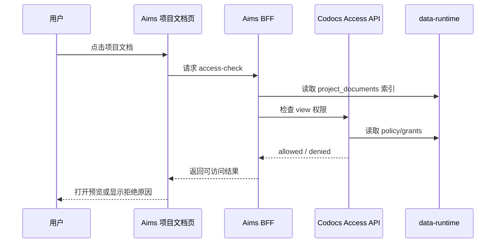

# Aims + Codocs 项目文档跨项目组访问控制设计

## 背景

Aims 项目文档已经支持两类内容：

- 规范文档：Markdown 文档，由 Codocs 创建、编辑、协作和持久化。
- 其他文档：Word、Excel、PowerPoint、PDF 等文件，由 Codocs 文件柜上传到 OSS，Aims 维护项目文档索引。

随着项目文档进入跨项目组复用、交付协作、项目集管理场景，仅依赖“项目成员可访问”的固定规则已经不够。需要根据文档生命周期阶段和密级控制是否允许非项目成员、其他项目组或企业内部用户访问。

## 目标

建立一套统一的项目文档访问策略，覆盖 Markdown 文档和文件柜文档。

目标能力：

- 按生命周期阶段控制文档访问：草稿、正式、归档。
- 按密级控制访问范围：L0 完全公开、L1 企业内部公开、L2 受限访问、L3 机密。
- 支持跨项目组只读访问。
- 支持项目经理配置授权项目组、部门、用户。
- 服务端强制鉴权，避免仅靠前端隐藏按钮。
- 为预览、下载、编辑和策略变更提供审计记录。

非目标：

- 第一阶段不做匿名公网分享。
- 第一阶段不做外部客户访问。
- 第一阶段不做 L3 下载审批、水印、下载追踪。
- 第一阶段不开放跨项目组编辑。
- 第一阶段不迁移历史 OSS 文件路径。

## 模块边界

| 模块 | 职责 |
| --- | --- |
| Aims | 项目、项目组、里程碑、项目成员关系；项目文档索引；项目经理配置入口 |
| Codocs | 文档内容、文件柜、OSS、访问策略、最终鉴权、审计 |
| data-runtime | Aims/Codocs 元数据读写合同 |
| Console/Foundation | 登录态、用户身份、服务间 token、企业用户上下文 |

约束：

- Aims 不直接绕过 Codocs 放行文档内容或文件下载。
- Codocs 是访问策略和最终鉴权的事实源。
- Aims 可以向 Codocs 提供项目上下文，但不作为最终裁决方。
- 跨模块服务端调用继续使用 Console 签发的 service token。

## 访问控制模型

### 生命周期阶段

| 阶段 | 值 | 含义 | 默认访问 |
| --- | --- | --- | --- |
| 草稿 | `draft` | 编写中，尚未确认 | 仅项目成员 |
| 正式 | `formal` | 已确认，可用于交付、评审、跨项目协作 | 按密级开放 |
| 归档 | `archived` | 结项材料或历史版本 | 只读，按密级开放 |

### 密级

| 密级 | 值 | 含义 | 访问原则 |
| --- | --- | --- | --- |
| L0 | `L0` | 完全公开 | 可开放给企业用户；后续可扩展匿名公开 |
| L1 | `L1` | 企业内部公开 | 企业登录用户可访问 |
| L2 | `L2` | 受限访问 | 项目成员 + 授权项目组/部门/用户 |
| L3 | `L3` | 机密 | 仅项目核心成员或显式白名单 |

### 权限动作

| 动作 | 值 | 说明 |
| --- | --- | --- |
| 查看 | `view` | 预览 Markdown 或文件 |
| 下载 | `download` | 下载文件柜原文件或导出文档 |
| 编辑 | `edit` | 编辑 Markdown 或替换文件 |

第一阶段默认规则：

- 跨项目组只开放 `view`，可选开放 `download`。
- 跨项目组不开放 `edit`。
- `archived` 一律只读。
- `draft` 默认不允许跨项目组访问。
- `L3` 默认不允许跨项目组访问，除非显式白名单授权。

## 默认访问矩阵

| 阶段 / 密级 | L0 | L1 | L2 | L3 |
| --- | --- | --- | --- | --- |
| `draft` 草稿 | 项目成员 | 项目成员 | 项目成员 | 核心成员/白名单 |
| `formal` 正式 | 企业用户可看 | 企业用户可看 | 授权范围可看 | 白名单可看 |
| `archived` 归档 | 企业用户只读 | 企业用户只读 | 授权范围只读 | 白名单只读 |

## 数据模型

访问策略建议存放在 Codocs 侧，作为最终事实源。

### `document_access_policies`

| 字段 | 类型 | 说明 |
| --- | --- | --- |
| `id` | BIGINT | 主键 |
| `document_ref_type` | ENUM | `codocs_document` / `cabinet_file` |
| `document_uuid` | CHAR(36) | Codocs 文档 UUID 或文件柜 UUID |
| `source_app` | VARCHAR(32) | 来源应用，例如 `aims` |
| `source_project_code` | VARCHAR(50) | 所属项目编码 |
| `lifecycle_stage` | ENUM | `draft` / `formal` / `archived` |
| `confidentiality_level` | ENUM | `L0` / `L1` / `L2` / `L3` |
| `default_permission` | ENUM | `none` / `view` / `download` |
| `allow_internal_access` | TINYINT | 是否允许企业内部用户访问 |
| `allow_cross_project` | TINYINT | 是否允许跨项目授权 |
| `readonly` | TINYINT | 是否只读 |
| `created_by` | VARCHAR(64) | 创建人 |
| `updated_by` | VARCHAR(64) | 更新人 |
| `created_at` | DATETIME | 创建时间 |
| `updated_at` | DATETIME | 更新时间 |

建议唯一键：

```sql
UNIQUE KEY uk_document_access_policy (document_ref_type, document_uuid)
```

### `document_access_grants`

| 字段 | 类型 | 说明 |
| --- | --- | --- |
| `id` | BIGINT | 主键 |
| `policy_id` | BIGINT | 关联访问策略 |
| `subject_type` | ENUM | `project` / `dept` / `user` / `role` |
| `subject_code` | VARCHAR(100) | 项目编码、部门编码、uid、角色编码 |
| `permission` | ENUM | `view` / `download` / `edit` |
| `expires_at` | DATETIME | 过期时间，第一阶段可为空 |
| `created_by` | VARCHAR(64) | 授权人 |
| `created_at` | DATETIME | 创建时间 |

建议索引：

```sql
KEY idx_policy_subject (policy_id, subject_type, subject_code)
KEY idx_subject (subject_type, subject_code)
```

### `document_access_audit_logs`

| 字段 | 类型 | 说明 |
| --- | --- | --- |
| `id` | BIGINT | 主键 |
| `document_ref_type` | ENUM | `codocs_document` / `cabinet_file` |
| `document_uuid` | CHAR(36) | 文档或文件 UUID |
| `actor_uid` | VARCHAR(64) | 访问用户 |
| `action` | ENUM | `view` / `download` / `edit` / `policy_update` |
| `decision` | ENUM | `allow` / `deny` |
| `reason` | VARCHAR(100) | 命中规则或拒绝原因 |
| `source_project_code` | VARCHAR(50) | 文档所属项目 |
| `actor_project_codes` | JSON | 用户所在项目编码快照 |
| `created_at` | DATETIME | 访问时间 |

### Aims 镜像字段

Aims `project_documents` 可增加展示用镜像字段，但不作为最终鉴权源。

| 字段 | 说明 |
| --- | --- |
| `access_lifecycle_stage` | 展示用生命周期 |
| `access_confidentiality_level` | 展示用密级 |
| `access_summary` | 展示用访问摘要，例如“授权 2 个项目组” |

## 默认策略

新建 Markdown 项目文档时：

```text
lifecycle_stage = draft
confidentiality_level = L2
default_permission = none
allow_internal_access = false
allow_cross_project = false
readonly = false
```

上传其他文件柜项目文档时：

```text
lifecycle_stage = draft
confidentiality_level = L2
default_permission = none
allow_internal_access = false
allow_cross_project = false
readonly = false
```

归档时：

```text
lifecycle_stage = archived
readonly = true
```

## 访问决策流程

### 查看/预览



### 下载

下载必须在服务端做 access-check：

1. 用户点击下载。
2. Aims BFF 调用 Codocs `access-check`，action 为 `download`。
3. 允许后才返回文件柜下载链接或代理下载。
4. Codocs 写入审计日志。

### 编辑

编辑必须检查 `edit`：

- 项目成员可按现有项目权限编辑草稿/正式文档。
- `archived` 一律拒绝编辑。
- 第一阶段跨项目组访问不授予 `edit`。

## API 设计

### Codocs API

#### 访问检查

`POST /api/v1/codocs/document-access/check`

请求：

```json
{
  "documentUuid": "0f4b...",
  "documentRefType": "codocs_document",
  "sourceApp": "aims",
  "sourceProjectCode": "PRJ001",
  "action": "view",
  "actorUid": "u001"
}
```

响应：

```json
{
  "code": 0,
  "data": {
    "allowed": true,
    "permission": "view",
    "readonly": true,
    "reason": "granted_by_project",
    "lifecycleStage": "formal",
    "confidentialityLevel": "L2"
  }
}
```

#### 查询策略

`GET /api/v1/codocs/document-access/policies/:documentUuid?documentRefType=codocs_document`

#### 更新策略

`PUT /api/v1/codocs/document-access/policies/:documentUuid`

请求：

```json
{
  "documentRefType": "codocs_document",
  "sourceApp": "aims",
  "sourceProjectCode": "PRJ001",
  "lifecycleStage": "formal",
  "confidentialityLevel": "L2",
  "allowCrossProject": true,
  "defaultPermission": "none",
  "grants": [
    {
      "subjectType": "project",
      "subjectCode": "PRJ002",
      "permission": "view"
    }
  ]
}
```

#### 审计日志

`GET /api/v1/codocs/document-access/audit-logs?documentUuid=0f4b...`

### Aims BFF API

#### 查询项目文档策略

`GET /api/v1/projects/:projectId/documents/:documentId/access-policy`

职责：

- 校验当前用户是否可查看该项目文档索引。
- 解析 `document_uuid` 和 `document_ref_type`。
- 转发 Codocs policy 查询。

#### 更新项目文档策略

`PUT /api/v1/projects/:projectId/documents/:documentId/access-policy`

职责：

- 校验当前用户是否为项目经理、项目负责人或具备文档管理权限。
- 校验授权项目组、部门、用户输入格式。
- 转发 Codocs policy 更新。
- 更新 Aims 展示镜像字段。

#### 访问检查

`POST /api/v1/projects/:projectId/documents/:documentId/access-check`

职责：

- 解析项目文档索引。
- 调用 Codocs access-check。
- 返回可访问结果和拒绝原因。

## 访问判断规则

Codocs access-check 按以下顺序判断：

1. 找不到文档策略：按默认策略创建或按安全默认拒绝。
2. 文档所属项目成员：
   - `draft/formal` 可按项目角色访问。
   - `archived` 只读。
3. `lifecycle_stage = draft`：
   - 非项目成员默认拒绝。
   - L3 仅白名单允许。
4. `confidentiality_level = L0/L1` 且 `allow_internal_access = true`：
   - 企业登录用户允许 `view`。
   - 是否允许 `download` 取决于 `default_permission`。
5. `confidentiality_level = L2`：
   - 命中 project/dept/user grant 才允许。
6. `confidentiality_level = L3`：
   - 仅 user/role 白名单允许。
   - 默认不允许 project/dept 粗粒度授权。
7. `readonly = true` 或 `lifecycle_stage = archived`：
   - 拒绝 `edit`。
8. 写入审计日志。

## UI 设计

项目文档列表展示：

- 生命周期 badge：草稿、正式、归档。
- 密级 badge：L0、L1、L2、L3。
- 访问摘要：仅项目成员、企业内部、已授权 N 个项目组、机密白名单。

文档行操作：

- 打开/预览。
- 下载。
- 访问控制。
- 删除索引。

访问控制弹窗字段：

- 生命周期：
  - 草稿
  - 正式
  - 归档
- 密级：
  - L0 完全公开
  - L1 企业内部公开
  - L2 受限访问
  - L3 机密
- 跨项目组访问：
  - 关闭
  - 开启
- 授权对象：
  - 项目组
  - 部门
  - 用户
- 授权权限：
  - 查看
  - 下载
- 访问摘要：
  - 仅项目成员
  - 企业内部可查看
  - 已授权 3 个项目组
  - 机密，仅 5 人可访问

拒绝访问提示：

- “你没有权限查看该文档。”
- “草稿文档仅项目成员可访问。”
- “该文档为 L3 机密，当前用户不在授权范围内。”
- “当前项目组未被授权访问该文档。”

## 第一阶段落地计划

第一阶段目标：实现登录用户范围内的跨项目组只读访问，覆盖 Markdown 文档和其他文件柜文档。

### 1. Schema 与 runtime 合同

- Codocs 新增 `document_access_policies`。
- Codocs 新增 `document_access_grants`。
- Codocs 新增 `document_access_audit_logs`。
- data-runtime 增加 Codocs 访问策略资源：
  - `document-access/policies`
  - `document-access/grants`
  - `document-access/audit-logs`
- 更新 Codocs schema 文档。

### 2. Codocs 访问策略服务

- 实现默认策略创建。
- 实现 policy 查询。
- 实现 policy 更新。
- 实现 grant 覆盖更新。
- 实现 access-check。
- 实现审计日志写入。

### 3. Aims 项目上下文桥接

- Aims BFF 根据 `project_documents.id` 解析：
  - `uuid`
  - `codocs_uuid`
  - `document_source`
  - `project_code`
  - `oss_path`
- Aims BFF 校验策略更新操作者是否为项目经理/负责人。
- Aims BFF 转发策略查询、更新和访问检查到 Codocs。
- Aims BFF 更新 `project_documents` 展示镜像字段。

### 4. 项目文档 UI

- 文档列表显示生命周期、密级、共享状态。
- 增加访问控制弹窗。
- 支持设置生命周期和密级。
- 支持授权项目组。
- 支持授权 `view` 和 `download`。
- 打开预览前调用 access-check。
- 下载前调用 access-check。

### 5. Markdown 文档接入

- 打开 CodocsEditor 前检查 `edit`。
- 跨项目组访问只进入只读预览。
- `archived` 强制只读。

### 6. 其他文件柜文档接入

- 文件预览前检查 `view`。
- 文件下载前检查 `download`。
- 文件柜 UUID 使用同一套 policy。

### 7. 审计与观测

- 记录允许访问。
- 记录拒绝访问。
- 记录下载行为。
- 记录策略更新。
- 第一阶段可先只提供后端日志查询，UI 展示最近访问记录后续补充。

### 8. 验证用例

| 场景 | 预期 |
| --- | --- |
| 项目成员访问草稿文档 | 允许 |
| 非项目成员访问草稿文档 | 拒绝 |
| L1 正式文档企业用户访问 | 允许只读 |
| L2 正式文档授权项目组访问 | 允许只读 |
| L2 未授权项目组访问 | 拒绝 |
| L3 文档非白名单访问 | 拒绝 |
| 归档文档编辑 | 拒绝 |
| 其他文件下载未授权 | 拒绝 |
| 策略更新后再次访问 | 按新策略生效 |

## 风险与注意事项

- 不能只在 Aims 前端隐藏按钮，预览和下载 API 必须服务端鉴权。
- Codocs 必须是最终鉴权源，否则跨项目访问规则会分裂。
- 文件柜下载接口需要接入 access-check，否则其他文档会绕过策略。
- L3 机密不应默认支持项目组或部门粗粒度授权。
- 历史文档需要补默认策略，否则上线后可能出现策略缺失。
- 第一阶段不应引入匿名公开链接，避免安全边界扩大过快。

## 后续阶段

第二阶段可扩展：

- 匿名公开链接。
- 外部客户访问。
- 授权有效期。
- L3 下载审批。
- 水印与下载追踪。
- 批量设置生命周期和密级。
- 最近访问记录 UI。
