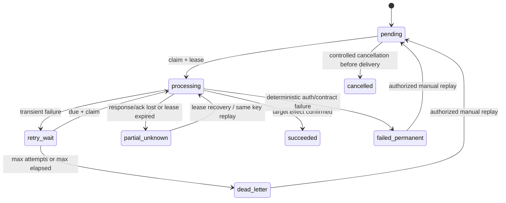

# 跨模块可靠操作模型 v1

状态：设计冻结，首批接入进行中  
最后核对：2026-07-10  
事实源：本文件、`MODULE_CONTRACTS.md`、各调用方 schema 与 data-runtime adapter

## 1. 适用范围

本模型用于“调用方本地事实已经提交，但目标应用调用可能失败、超时或响应丢失”的定向跨模块写操作。它解决持久记录、幂等投递、退避、诊断和受控重放，不把所有业务事件改造成消息总线。

首批覆盖：

- Altoc 服务工单 → Aims 工作项，以及 Aims → Altoc 处理结果回写；
- Altoc 运维知识 → Codocs 关系 → Assets 文档索引 → Altoc 最终绑定；
- 后续按同一模型接入 People → Console/Platform、Assets → Altoc、Finance → Altoc 等链路。

## 2. 事实归属

三个概念必须分开：

| 事实 | 所有者 | 用途 | 是否驱动重试 |
| --- | --- | --- | --- |
| 业务审计 | 发生领域变更的应用 | 记录谁在何时改变了业务对象及前后值 | 否 |
| `integration_operation` | 跨模块命令的调用方应用 | 记录调用方已承诺投递的定向命令、状态和恢复进度 | 是 |
| domain event outbox | 产生领域事件的聚合 | 发布可供一个或多个消费者订阅的领域事件 | 仅驱动事件发布，不直接冒充定向命令 |

`integration_operation` 持久化在调用方应用自己的数据库，由该应用的 data-runtime adapter 在本地业务事务中写入。Cloudflare Worker/BFF 只负责即时执行、定时 drain 和管理员入口，不把内存、KV、Queue 或 data-runtime 进程本身作为操作事实源。

目标应用保存独立的 `service_command_receipt`。调用方 operation 表示“需要交付的意图”，目标 receipt 表示“某个幂等命令已经产生的效果”，两者不是重复事实。

## 3. 原子性边界

真正可靠的首要条件是：

```text
调用方本地业务 mutation + integration_operation insert = 同一数据库事务
```

BFF 先提交本地 mutation、再调用另一个 endpoint 创建 operation 仍存在进程崩溃窗口，不算可靠投递。目标端同样要求：

```text
目标业务 mutation + service_command_receipt succeeded = 同一数据库事务
```

目标事务失败时 receipt 不得伪装成功。目标已提交但响应丢失时，调用方使用原幂等键重放，由 receipt 返回原目标业务键并消除不确定状态。

## 4. 调用方数据模型

每条 `integration_operation` 只代表一个目标应用的一条命令。多目标或多步骤链路使用相同 `correlation_key`，并通过 `sequence_no` 与 `depends_on_operation_key` 表达顺序；不得把可变的“当前目标”塞进一行。

核心字段：

- 身份：`operation_id`、`operation_key`、`correlation_key`；
- 租户边界：`tenant_code`、`deployment_code`；
- 路由身份：`source_app`、`target_app`、版本化 `operation_code`；
- 业务身份：`source_biz_type/source_biz_code`、可空的 `target_biz_type/target_biz_code`；
- 幂等与追踪：`idempotency_key`、`original_request_id`、`correlation_id`；
- 审计身份：`original_actor_uid`、`service_client_id`、最近人工重放人和原因；
- 冻结命令：`command_schema_version`、最小化 `command_json`、`command_sha256`；
- 队列状态：`status`、`attempt_count`、`max_attempts`、`next_attempt_at`、`last_attempt_at`；
- 并发控制：`locked_by`、`locked_until`、`fencing_token`、`version_no`；
- 安全诊断：`last_http_status`、`last_error_code`、`last_error_class`、脱敏 `last_error_summary`；
- 结果：目标稳定业务键、响应摘要 hash、成功/死信时间和创建更新时间。

`integration_operation_attempt` 的行身份是 append-only 尝试历史：claim 时插入唯一 `processing` 行，结束时只允许在同一 worker/fencing 条件下把该行一次性收口为结果状态，不得改写 operation/attempt identity。至少记录 operation、attempt no、触发方式、request ID、开始/结束时间、结果、HTTP 状态、错误码/类别、耗时和响应摘要 hash。不得保存完整响应、Authorization、Cookie、service token、runtime URL 或 secret。

唯一约束至少包含：

```text
(tenant_code, deployment_code, source_app, target_app, operation_code, idempotency_key)
```

并建立 due queue、source biz、request/correlation 索引。

## 5. 目标端 receipt

`service_command_receipt` 至少记录：

- tenant/deployment/source/target/operation/idempotency identity；
- `command_sha256`；
- `processing|succeeded|rejected`；
- 目标业务类型和稳定业务键；
- 首次/最近 request ID、响应码、响应摘要 hash 和时间戳。

规则：

- 同一 identity、相同 command hash 且已成功：返回原目标业务键；
- 同一 identity、不同 command hash：返回 `409 idempotency_payload_mismatch`；
- `processing` receipt 只允许受控的租约恢复，不得并发执行第二次业务 mutation；
- 目标业务自然唯一键继续保留，作为 receipt 之外的第二道约束。

## 6. 状态机



状态名以 schema 冻结值为准：`pending`、`processing`、`retry_wait`、`partial_unknown`、`succeeded`、`failed_permanent`、`dead_letter`、`cancelled`。

claim 必须使用事务行锁、lease 和 fencing token。旧 worker 即使在新 lease 建立后返回，也不能覆盖新 worker 的状态。

## 7. 错误分类与退避

| 结果 | 自动重试 | 目标状态 |
| --- | --- | --- |
| 网络断开、timeout、408、425、429、5xx | 是 | `retry_wait`；响应是否可能已提交时用 `partial_unknown` |
| 401 | 否 | `failed_permanent` / `authentication` |
| 403、错 audience/source/tenant/deployment/capability | 否 | `failed_permanent` / `authorization` |
| 400、404、422 等确定性契约错误 | 否 | `failed_permanent` / `contract` |
| 409 “同键同载荷已成功”且返回稳定目标键 | 不需要 | `succeeded` |
| 409 processing | 短延迟重试 | `retry_wait` |
| 409 payload/binding conflict | 否 | `failed_permanent` / `conflict` |

默认退避为 30 秒起步的指数退避，带可测试的 jitter，上限 30 分钟；有界采用 `Retry-After`，单次不得超过 1 小时。默认最多 8 次且总时长不超过 24 小时，达到任一阈值进入 `dead_letter`，并用稳定通知幂等键向 Console 发布一次失败通知。

401/403 不能自动重试，也不能被转换成泛化 502。管理员修复授权后可以显式重放，但必须保留原失败记录。

## 8. 执行与重放

dispatcher 根据受版本控制的代码映射 `operation_code -> target app/audience/capability/path template`。不得从 `command_json` 读取 URL、audience、scope 或 target app；即使 payload 中出现这些字段也必须拒绝或忽略，防止 SSRF 和权限放大。

每次 attempt 都使用短期 Console service token，数据库不保存 token。目标 BFF 在本地验证 JWT 后通过 Console introspection 确认 current credential、service client 与 token 携带的全部 grants 仍 active：明确 inactive 为 401 终态，introspection 网络/超时/5xx 为失败关闭的 503 瞬态。credential 轮换导致缓存 token 首次 401 时，调用方只淘汰缓存、强制刷新并重试一次；刷新后仍 401 才进入终态，禁止无限刷新。Console 本地签发同样读取真实 current credential 与 active grants，不设置绕过 introspection 的特殊凭据。目标 data-runtime bearer 还必须包含 `token_use=service`、tenant、deployment、app 三项完整 claim并与 enrollment 精确匹配；`client_id` 不能代替 app claim，兼容 claim 别名冲突时失败关闭。即时请求与 scheduled drain 复用同一 executor；调度只负责唤醒应用，不携带 operation command。后续若引入 Queue，它也只能携带无凭证 wake ticket，数据库 operation 仍是唯一队列事实。

共享多租户 Cloudflare Worker 不能使用一个全局 tenant-runtime URL 扫描所有租户。Platform 内部 `tenant-gateway/scheduler-page` 只返回 active tenant host、environment 和已启用的 Aims/Altoc app code，采用按时间轮换的稳定分片、窗口上限和不透明 cursor，不读取或返回 Runtime token。Tenant Gateway 每 5 分钟只处理一个 shard，在页数、租户数、并发和墙钟预算内重新按 host 调用现有 resolve 契约，再以固定私有路径唤醒对应应用。单租户或专属 Worker 仍可显式绑定 tenant-runtime endpoint、tenant、deployment。两种模式都不得把 runtime URL/token 放进 registry page、URL、body、operation command 或日志。

管理员重放只接受：

```json
{ "reason": "...", "expectedVersion": 3 }
```

不得接受或覆盖 tenant、deployment、source/target app、operation、业务键、幂等键、payload、capability 或 URL。查看与重放使用分离的显式权限，每次人工重放另写管理员审计。

当前 Aims、Altoc 已提供调用方本地的运维 API：`GET /api/v1/integration-operations` 使用 `updated_at + operation_id` 不透明游标和状态过滤，只返回不可变身份、hash、状态、次数、租约与脱敏错误；`GET /api/v1/integration-operations/{operationId}/attempts` 按 `attempt_no` 升序返回最多 100 条尝试的状态、稳定错误码、目标业务键和耗时，不返回 request/correlation、锁、fencing、command、response 或认证材料；`POST /api/v1/integration-operations/{operationId}/replay` 只接收 `expectedVersion + 1–500 字符 reason`。BFF 分别校验 `integration_operations:view` / `integration_operations:replay`，并要求命中无对象限制或显式 `tenant/global` 的同一 grant，data-runtime 再用认证注入的 tenant、deployment、source app 和 replay actor 执行范围化查询或更新。Repository 的 replay SQL 同时约束 operation ID、三项范围、版本和 `failed_permanent|dead_letter`，且不更新命令、幂等键或身份字段。

Aims `/integration-operations` 与 Altoc `/admin/integration-operations` 复用 Foundation 的脱敏列表、状态过滤、详情、attempt 时间线和受控重放组件；查看权限不会隐式获得重放权限。目标端统一 receipt executor 已用于 Aims→Altoc 与 Altoc→Codocs/Assets：目标 BFF 以短期 Runtime bearer 对 source/target tenant、deployment、app、operation、capability、schema、idempotency 和 command hash 做 60 秒 HMAC 绑定，目标业务写入与 succeeded receipt 同事务；同身份同 hash 直接返回原业务键，同身份异 hash 在业务 SQL 前拒绝。source 成功 checkpoint 必须验证并保存 `target_receipt_id`。

dead-letter 通知由 source runtime 只扫描当前可信 tenant/deployment/source app 下 `failure_notified_at IS NULL` 的安全投影。Aims/Altoc 以 `aud=notifications`、`notifications:publish` 调 Console 专用入口；Console 把 body 中 source app、tenant、deployment 与已验证 service token 精确绑定，用 `tenant|deployment|sourceApp|operationId` 的 SHA-256 派生站内通知幂等键，优先投递 active 原操作人，否则使用 `notification.integrationOperationRecipients`。只有 Console 返回 notification ID 后 source 才 CAS 写入 `failure_notification_id/failure_notified_at`；发布成功但 source ack 丢失时，重复发布返回同一通知并再次确认。候选、请求和通知均不包含 command、command hash、响应 hash、错误摘要、token、内部 URL 或任意调用方 metadata。

Aims、Altoc 已提供 `integration-operations:drain` Nitro task，并与即时请求复用同一个冻结命令 executor。专属绑定 task 单轮默认上限为 20 条/45 秒；共享 Gateway wake 使用 event-bound runtime context，单次最多 10 条/25 秒并保留 12 秒 claim/checkpoint 预算。私有 wake 固定为 `POST /api/internal/integration-operations/drain`，必须同时满足可信 Gateway token、`x-hzy-scheduler=tenant-gateway`、完整 tenant/deployment/app/environment/runtime endpoint、60 秒 issued-at 和覆盖全部字段的 HMAC；普通用户 HTTP 与 `/_nitro/tasks/**` 均为 404。跨应用调用在可信 managed event 下重新进入 tenant host，由 Gateway 解析目标 app deployment，不沿用来源 deployment，也不转发来源 Runtime token。service-token 与 Console-runtime cache key 均包含可信 tenant/deployment/environment/app，避免共享 Worker 跨租户复用。

## 9. 可信上下文与数据安全

- tenant/deployment/source/target/actor/service client 来自已验证 Gateway、用户会话或 service token 上下文，不信任浏览器 body；
- command payload 只保存 operation allowlist 中的稳定业务键和必要快照，不保存正文、人员敏感明文或认证材料；
- 原 actor 与 replay actor 分开保存；background worker 不伪造原用户会话；
- replay 读取冻结 command，不从可能已漂移的当前业务对象重建命令；需要重新计算时必须创建新 operation/version；
- 列表与详情默认不返回完整 command/response，只返回稳定键、阶段、脱敏错误和尝试时间线；
- 业务授权、集成操作查看、集成操作重放分别校验，前端隐藏不是安全边界。

## 10. 首批链路映射

Altoc 运维知识链使用一个 correlation root 和两个单目标跨应用 operation：

1. `altoc.ops-knowledge.codocs-link.v1`；
2. `altoc.ops-knowledge.assets-link.v1`，依赖步骤 1。

最终 Altoc `complete` 是调用方本地投影，不创建 `source_app=target_app=altoc` 的伪跨应用 operation。Assets 成功确认、operation succeeded 与工单 `linked` 投影必须在同一个 Altoc 事务中完成，以消除“Assets 已成功但本地 complete 丢失”的额外窗口。

operation root 与幂等键由服务端固定派生：

```text
altoc:ticket:<ticketCode>:ops-knowledge:<documentUuid>
```

浏览器 `Idempotency-Key` 只能作为 request trace，或必须与该 canonical key 完全一致，不能改变 operation identity。UUID reservation 与两条 operation insert 必须在 Altoc 同一事务；Codocs/Assets 的既有幂等约束作为执行端第二道保护。

Aims 单条工作项更新与批量状态更新均通过 data-runtime 事务内的 `aims.work-item.ticket-result.v1` caller-owned operation 完成；旧的“先通用 PUT、再 prepare”两事务入口已移除。批量仅在 `changes.status` 存在且选中工作项已关联 Altoc 服务工单时按每个工作项冻结单目标 operation；非服务工单和仅优先级、指派人或里程碑修改不创建 operation。工作项、changelog、首响/解决时间与全部 operation 必须同事务提交，任一 operation 插入或命令冻结失败会回滚整批；现有批量 API 仍返回本地 `updated` 计数，不在请求内 N 次外呼，既有 claim/drain/replay 负责异步投递。operation key 按工作项稳定键和 accepted/processing/resolved/closed 阶段派生，同阶段已有 operation 只复用冻结 command，不接受请求体重写 target、capability、路由或 payload。

## 11. 验收证据

每条接入链路至少证明：

- 本地 mutation 与 operation 原子提交/回滚；
- 同键同 payload 返回原 operation/目标键，同键异 payload 409；
- 目标成功但响应或 source ack 丢失后可用原 key 恢复；
- 两 worker 只能有一个有效 lease，旧 fencing token 不能回写；
- 401/403 永不自动 drain，timeout/429/5xx 按时退避并在阈值后只通知一次；
- 重启后从数据库恢复，不依赖进程内状态；
- replay 不能修改任何不可变身份或 command；
- operation、attempt、API 响应和通知中没有 token、Cookie、内部 URL 或敏感响应正文。
