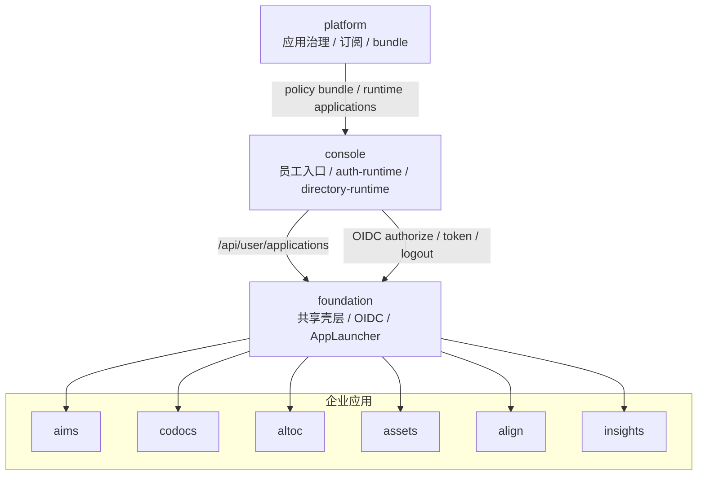

# Console 统一员工入口与应用展现整合方案

状态：Draft  
更新日期：2026-06-13  
范围：定义 SSO 落地后，如何以 `console` 作为企业员工统一入口，整合平台内各业务应用的展示、启动和基础工作台体验

## 1. 背景

汇智云已经形成以下基础能力：

- `console` 正在承接客户侧 `auth-runtime`，并对下游业务应用输出 Console OIDC。
- `platform` 负责应用注册、manifest、release、订阅、deployment、license 与 policy bundle 治理。
- `console` 已具备 `/api/user/applications` 形态，可基于本地已验签 policy bundle 与运行时应用目录，返回当前用户可见应用。
- `foundation` 已提供 `AppLauncher`、`useAuth`、Console OIDC adapter、共享布局与用户菜单等能力。

因此，SSO 之后可以在展现层继续收敛：以 `console` 作为企业员工统一入口，为企业员工提供一个进入整个平台功能的工作台。

## 2. 目标结论

统一员工入口应落在 `console`，而不是 `platform`。

原因：

- `platform` 是控制面，面向平台运营、租户管理员、应用治理与授权治理。
- `console` 是客户侧基础运行服务，承接本地身份会话、目录、企业配置、基础工作流能力，更贴近企业员工日常入口。
- 企业应用保持独立部署和独立业务边界，通过 SSO、共享导航、应用启动器和统一工作台形成一体化体验。

一句话：

**Console 做企业员工入口，Platform 做治理控制面，Foundation 做共享壳层和接入适配，各业务应用继续独立运行。**

## 3. 目标体验

企业员工访问 `console` 后，进入统一工作台：

1. 员工只登录一次。
2. 首页展示“我的应用”，只出现当前用户有权限访问的应用。
3. 点击应用后跳转到对应业务应用 `homeUrl`。
4. 若目标应用无本地会话，由 Foundation 发起 Console OIDC 登录；用户无感完成跳转。
5. 各业务应用内部使用统一的 Foundation 顶栏、用户菜单、AppLauncher 和登出链路。
6. 员工可从任意业务应用切回 Console 工作台或切换到其他应用。

统一入口不是把所有应用 iframe 到一个页面中，也不是把业务应用合并成单体。默认模式应是独立应用 + 统一身份 + 统一入口 + 统一导航。

## 4. 职责边界

| 组件 | 负责 | 不负责 |
|---|---|---|
| `platform` | 应用台账、manifest/release、订阅、license、policy bundle、租户授权治理 | 员工日常工作台、业务应用页面承载、客户侧用户 session |
| `console` | 企业员工入口、应用中心、当前用户可见应用过滤、轻量待办/通知/协同入口、Console OIDC、目录与基础运行时 | 平台级应用治理、业务应用主数据、深度组织协同业务对象、跨应用业务终态存储 |
| `foundation` | AppLauncher、统一登录/登出、共享布局、用户菜单、OIDC callback、业务应用接入适配 | 有状态 portal 数据存储、平台治理数据写入 |
| 企业应用 | 各自业务功能、页面级权限校验、业务数据事实源 | 自建平台级 IAM、复制应用台账、绕过 Console OIDC |

## 5. 目标架构



核心链路：

1. 平台管理员在 `platform` 注册应用、导入 manifest、发布 release。
2. 租户在 `platform` 订阅应用并完成 deployment / license / policy bundle 下发；deployment 中维护该租户的实际访问 URL。
3. `console` 启动或刷新时拉取并验签 policy bundle。
4. `console` 根据 bundle 中的 applications 投影物化 OIDC clients，并为当前用户计算可见应用。
5. 员工访问 `console` 工作台，前端调用 `/api/user/applications`。
6. 员工点击应用，进入应用 `homeUrl`。
7. 业务应用通过 Foundation 使用 Console OIDC 完成登录、刷新和登出。

## 6. 信息架构建议

### 6.1 Console 员工入口

建议路由：

- `/` 或 `/home`：企业工作台首页
- `/applications`：应用中心
- `/tasks`：我的待办，后续可对接 `console.workflow-runtime`
- `/notifications`：通知中心，后续扩展
- `/profile`：个人资料与安全设置
- `/directory`：企业目录，按权限展示管理能力

首页第一版建议包含：

- 我的应用
- 最近访问
- 常用 / 置顶应用
- 我的待办摘要
- 通知与公告摘要
- 轻量事项入口
- 个人资料入口
- 企业目录入口

### 6.2 业务应用内统一入口

各业务应用应继续接入 Foundation：

- 桌面端使用 Foundation `LayoutSidebar` 的应用层入口，推荐表现为左侧 AppRail 图标栏。
- 顶栏保留 AppLauncher 作为紧凑/移动端入口和完整应用列表。
- 用户菜单统一走 Console OIDC logout。
- 应用内部页面权限仍由本应用基于本地 bundle / Foundation 能力校验。
- 业务应用不直接读取 platform 数据库，也不复制应用台账。

### 6.3 Foundation 统一应用壳层

最终产品展示应通过 Foundation 提供统一壳层，让用户感知为一个平台内的不同功能区，而不是多个松散站点。

推荐壳层结构：

```text
┌──────────┬────────────────────┬──────────────────────────────┐
│ AppRail  │ 当前应用侧边栏      │ 当前应用页面内容              │
│ 应用图标 │ 当前应用菜单        │                              │
│          │                    │ 顶栏：标题 / 通知 / 用户菜单  │
└──────────┴────────────────────┴──────────────────────────────┘
```

职责划分：

- `AppRail`：全局应用层入口，只展示当前用户可访问应用，数据来自 `/api/user/applications`。
- 当前应用侧边栏：当前应用自己的业务菜单，由各应用通过 `LayoutSidebar` 的 `#menu` / `primaryLinks` 提供。
- `AppLauncher`：保留为顶栏九宫格入口，适合移动端、紧凑模式或展示完整应用列表。
- `UserMenu`：统一用户信息、主题切换与 Console OIDC 登出。

Foundation `LayoutSidebar` 建议扩展以下接口：

```ts
type AppNavigationMode = 'rail' | 'popover' | 'none'

interface LayoutSidebarProps {
  appNavigation?: AppNavigationMode
  primaryLinks?: Array<Record<string, unknown>>
  utilityLinks?: Array<Record<string, unknown>>
}
```

推荐默认行为：

- 桌面端：`appNavigation = 'rail'`，左侧展示 AppRail，点击应用使用同窗口跳转到 `homeUrl`。
- 移动端：自动退化为顶栏 AppLauncher 或抽屉内入口。
- 特殊嵌入场景：可设置 `appNavigation = 'none'`。

AppRail 的交互规则：

- 当前应用由 `runtimeConfig.public.appCode` 高亮。
- 仅展示 `/api/user/applications` 返回的授权应用。
- `console` 应固定展示在首位或由后端返回排序控制。
- 点击跨应用入口不新开标签页，默认同窗口跳转；目标应用如无本地 session，再由 Foundation 触发 Console OIDC。
- 图标只负责应用切换，不承载当前应用内部业务菜单；图标来自应用 manifest 的 `icon` 字段，推荐使用 `i-lucide-*` 等符号图标，不使用应用 logo。
- 当前应用侧边栏顶部的品牌位仍使用 `appLogo`，不要与应用入口 `icon` 混用。
- AppRail 图标下方展示短名称，默认去掉 `汇智云` 品牌前缀，例如 `汇智云控制台` 展示为 `控制台`。

### 6.4 统一消息中心方案

现状判断：

- Foundation `sendNotification()` 与客户侧 `notification-runtime` 已统一“外部通道投递”，当前一期主要是企业微信 textcard。
- `notification-runtime` 是通道适配服务，不保存消息、不管理已读状态，也不承担员工入口聚合职责。
- Console 已通过 `portal_notifications` / `portal_notification_recipients` 形成站内消息事实源，Foundation 通知抽屉读取同一组 Console API。
- Workflow runtime 已能产生通知副作用，是统一消息中心的首个接入点。

目标边界：

| 层级 | 负责 | 不负责 |
|---|---|---|
| `console.employee-portal` | 站内消息事实源、收件人状态、未读数、消息列表、已读/归档、公告摘要、服务端发布 API | 企业微信/钉钉/邮件等外部通道细节、业务模块内部通知规则 |
| `foundation` | `NotificationBell`、`NotificationsSlideover`、`useNotifications()`、业务应用服务端发布 helper、统一顶栏接入 | 持久化站内消息、直接读取 Console 数据库 |
| `notification-runtime` | 外部通道投递，例如企业微信 textcard；后续扩展钉钉、邮件、短信 provider | 站内消息中心、阅读状态、portal 聚合 |
| 业务应用 / Workflow | 产生结构化通知事件，提供业务对象链接、标题、摘要、来源应用与幂等键 | 自建跨应用消息中心、直连 Console 数据库、保存平台级收件箱状态 |

推荐数据模型：

| 表 | 核心字段 | 说明 |
|---|---|---|
| `portal_notifications` | `notification_id`, `source_app_code`, `event_type`, `category`, `severity`, `title`, `summary`, `body`, `action_url`, `biz_type`, `biz_id`, `idempotency_key`, `created_by`, `created_at`, `expires_at` | 一条消息内容事实；`idempotency_key` 用于业务重试去重 |
| `portal_notification_recipients` | `notification_id`, `uid`, `delivery_state`, `read_at`, `archived_at`, `pinned_at`, `created_at` | 每个收件人的阅读、归档、置顶状态 |
| `portal_notification_deliveries` | `notification_id`, `uid`, `channel`, `provider`, `status`, `attempt_count`, `last_error`, `sent_at` | 可选投递日志；记录外部通道发送结果，不影响站内消息可见性 |

Console 用户侧 API：

| 端点 | 用途 |
|---|---|
| `GET /api/v1/console/notifications?status=&category=&limit=&cursor=` | 当前登录用户消息列表 |
| `GET /api/v1/console/notifications/summary` | 当前用户未读数、按类别聚合数和最近消息 |
| `POST /api/v1/console/notifications/{notificationId}/read` | 标记单条消息已读 |
| `POST /api/v1/console/notifications/read-all` | 批量标记已读，支持按类别或来源应用过滤 |
| `POST /api/v1/console/notifications/{notificationId}/archive` | 归档当前用户的一条消息 |

Console 服务端发布 API：

| 端点 | 认证 | 用途 |
|---|---|---|
| `POST /api/v1/console/notifications/publish` | Console service token，`audience=notifications`，`scope=notifications:publish` | 业务应用或 Workflow 发布站内消息 |

发布请求建议保持结构化：

```json
{
  "sourceAppCode": "workflow",
  "eventType": "workflow.task.created",
  "category": "approval",
  "severity": "info",
  "title": "您有新的审批待办",
  "summary": "项目立项 - 部门负责人审批，请审批",
  "actionUrl": "https://example.com/workflow/tasks/123",
  "bizType": "workflow_task",
  "bizId": "123",
  "idempotencyKey": "workflow:task:123:created",
  "recipients": ["zhangsan", "lisi"],
  "channels": ["in_app", "wecom"]
}
```

处理规则：

- `in_app` 始终写入 Console 消息中心；外部通道失败不应导致站内消息丢失。
- `wecom` 等外部通道由 Console 或 Foundation helper 调用现有 `sendNotification()` / `notification-runtime`。
- `通知运行时` 页面上的企业微信测试发送属于 Console 管理侧诊断事件，发送结果会以当前操作者为收件人写入站内消息，并在 `portal_notification_deliveries` 记录 `wecom` 投递状态。
- `actionUrl` 应优先使用 Foundation URL helper 生成，避免统一域名、basePath 或未来部署形态变化后出现坏链。
- 服务端发布必须校验 `sourceAppCode` 与 service token 来源应用一致，或使用明确白名单；不得接受前端直接伪造来源应用。
- 消息中心只保存入口级消息与阅读状态；业务对象详情仍由来源应用保存和渲染。

Foundation 组件与接入：

- `useNotifications()`：封装 summary、列表、刷新、标记已读、全部已读、归档。
- `NotificationBell`：顶栏图标按钮，展示未读角标，点击打开通知抽屉。
- `NotificationsSlideover`：共享通知抽屉，支持未读/全部筛选、来源应用、时间、已读状态、跳转详情和空态。
- `LayoutSidebar` 默认在顶栏右侧把 `NotificationBell` 放在 `AppLauncher` 前面，再接 `UserMenu`；业务应用可通过 slot 覆盖但不应重复实现。
- Console 本地不再维护独立空壳 `NotificationsSlideover`，应复用 Foundation 共享组件；Console 首页通知公告摘要读取同一 summary API。

首个落地点：

1. Console 增加消息中心 schema 与 API。
2. Foundation 增加 `useNotifications()`、`NotificationBell`、共享 `NotificationsSlideover` 和服务端 `publishNotification()` helper。
3. `LayoutSidebar` 顶栏右侧按 `NotificationBell` → `AppLauncher` → `UserMenu` 排列。
4. Workflow 将 runtime effects 中的通知改为调用 `publishNotification()`；发布成功后按 `channels` 决定是否继续外部推送。
5. Console 工作台的通知摘要、通知抽屉和 `/notifications` 页面统一读取 Console 消息中心。

## 7. 应用展示数据契约

应用展示优先来源：

1. `console` 或业务应用本地已验签 policy bundle 的 `applications` 投影。
2. 需要实时刷新时，本地 `/api/user/applications` 可调用 `GET /api/platform/runtime/applications?tenantCode=...`。
3. Foundation 会在业务应用本地提供 `/api/user/applications`，用于 AppRail/AppLauncher；当前应用与 `console` 基础入口固定保留。

业务应用不要再自定义同名 `server/api/user/applications.get.ts` 覆盖 Foundation 实现。确需覆盖时，必须保持同一契约：从 policy bundle / Platform runtime applications 获取应用元数据，使用 manifest `icon`，并固定保留当前应用与 `console` 入口。

迁移记录：`workflow` 已移除本地 `server/api/user/applications.get.ts`，应用入口统一复用 Foundation；登录走 Console OIDC，用户/部门查询走 Console directory-runtime，权限走 Platform policy bundle / runtime authorizations。

应用卡片至少需要以下字段：

| 字段 | 用途 |
|---|---|
| `appCode` | 稳定应用标识 |
| `appName` | 展示名称 |
| `description` | 简要说明 |
| `icon` | 应用入口图标；来自 `app.manifest.json`，推荐使用符号图标名，不与品牌 logo 混用 |
| `homeUrl` | 员工进入应用的运行态地址；bundle 生成时优先取 deployment `runtimeEndpoint`，再回退应用默认 `homeUrl` |
| `callbackUrl` | OIDC callback；bundle 生成时优先取 deployment `callbackUrl`，再回退应用默认 `callbackUrl`，仍为空则按 `homeUrl + /api/auth/oidc-callback` 自动生成 |
| `logoutUrl` | 应用本地退出或回调地址 |
| `serviceRole` | 区分 `base_runtime` / `supporting_service` / `business_app` |
| `authMode` | 标识是否通过 Console OIDC |
| `sortOrder` | 应用展示顺序；由 Platform 应用管理维护，Console / Foundation 按升序展示 |
| `status` | 控制是否可展示或是否需要提示不可用 |

可见性规则：

- `console` / Foundation 本地入口只返回当前用户有应用级访问权的应用，并固定保留当前应用与 `console` 基础入口。
- 应用内部继续做资源级和页面级权限校验。
- 未订阅、未启用、bundle disabled、license 不满足或用户无授权的应用不进入“我的应用”。
- 对管理员可另行提供“可申请 / 未开通应用”视图，但不混入普通员工默认入口。

## 8. 与 Align 的关系

统一员工入口落到 `console` 后，`align` 不再承担全平台默认首页或门户层职责。

边界调整如下：

- `console` 吸收轻量办公协同入口能力，包括我的待办、通知中心、公告摘要、简单提醒、最近访问、常用入口、轻量事项入口。
- `console` 可以保存 portal 级轻量状态，例如置顶应用、最近访问、通知阅读状态、待办摘要缓存和简单事项索引。
- `console` 不保存复杂协同业务对象的完整生命周期，不承接人员借调、HR 轻流程、财务轻流程、协同 SLA 等深度业务域。
- `align` 调整为未来可选的深度组织协同应用，仅在轻量协同超出 Console 边界后启用或独立建设。

`align` 适合重新启用的条件：

- 轻量事项演进成跨部门协助单，需要完整状态机、责任矩阵、SLA 和统计分析。
- 人员借调需要建模借入/借出部门、周期、角色、成本归属和审批后履约。
- HR 或轻财务流程需要独立业务对象、台账、报表和外部系统集成。
- 客户希望购买或独立部署组织协同增强能力。

因此，当前阶段的推荐策略是：**Console 承接轻量协同与入口聚合，Align 保留为未来可选增强应用，不进入第一阶段必建范围。**

## 9. SSO 与跳转约束

默认跳转模型：

1. 用户在 Console 登录。
2. Console 工作台展示应用。
3. 用户点击应用 `homeUrl`。
4. 业务应用检测本地 token/session。
5. 若无有效 session，业务应用通过 Foundation 跳转 Console `/oauth/authorize`。
6. Console 完成授权后回调业务应用 `/api/auth/oidc-callback`。
7. 业务应用写入本地 `hzy_*` Cookie 并进入目标页面。

约束：

- 不依赖跨域共享 Cookie 作为唯一 SSO 机制。
- 不把 Console session token 直接暴露给业务应用前端长期保存。
- OIDC client secret、refresh token、用户 session 属于客户侧 Console 与业务应用本地运行时，不进入 Platform。
- 登出应优先走业务应用本地 `/api/auth/logout`，再跳 Console `/oauth/logout` 完成统一退出。

## 10. 分阶段落地

### 阶段一：统一入口 MVP

目标：员工登录 Console 后可以看到并进入自己有权限访问的应用。

任务：

- 增加或改造 Console 首页为企业工作台。
- 复用或增强 Foundation `AppLauncher`，沉淀可复用应用卡片组件。
- 在 Foundation 中定义 `AppRail` 与 `LayoutSidebar.appNavigation` 接口，形成统一应用壳层。
- 使用 `/api/user/applications` 作为我的应用数据源。
- 确保每个应用 manifest / platform application 补齐 `appName`、`description`、`icon`、`homeUrl`、`logoutUrl`、`serviceRole`、`authMode`；`callbackUrl` 仅在应用未使用默认 `/api/auth/oidc-callback` 路由时配置覆盖。
- 校验 Console OIDC clients 已能由 policy bundle applications 投影物化。
- 业务应用统一通过 Foundation OIDC 登录与登出。
- 明确 `align` 不再作为统一入口 MVP 依赖；轻量待办和通知入口先在 Console 内实现。

验收标准：

- 员工访问 Console，只登录一次。
- “我的应用”只展示授权应用。
- 点击 `aims/codocs/altoc` 等应用可无二次输入密码进入。
- 无权限用户无法看到应用，也无法绕过入口访问应用内部受控页面。
- Console 和业务应用均可完成统一登出。

### 阶段二：企业工作台增强

目标：从应用启动器升级为日常工作台。

任务：

- 增加置顶应用、最近访问、应用分类。
- 增加待办摘要，优先对接 `console.workflow-runtime`；过渡期可由 Foundation 代理旧 `workflow`。
- 实现统一消息中心 MVP，包括站内消息列表、未读数、通知摘要、已读状态和系统状态提示。
- 增加轻量事项入口，只保存入口级状态和关联索引。
- 增加应用不可用原因展示，例如未订阅、维护中、license 到期。
- 增加管理员视角的“可开通应用 / 推荐应用”入口。

### 阶段三：跨应用聚合

目标：提供真正的平台级工作入口，而不是单纯应用列表。

任务：

- 全局搜索入口，逐步接入文档、项目、客户、资产等索引。
- 跨应用通知中心。
- manifest 声明 portal widget，由 Console 按应用能力渲染工作台卡片。
- 跨应用上下文链接，例如客户 -> 合同 -> 项目 -> 文档 -> 资产。
- 统一审计最近访问与关键操作。
- 当轻量事项出现独立生命周期、SLA、借调或 HR/财务台账时，再评估启用 `align`。

### 阶段四：共享壳层收敛

目标：让所有应用在体验上像同一平台。

任务：

- 所有业务应用接入统一 Foundation 顶栏、AppLauncher、UserMenu。
- 统一页面标题、面包屑、通知入口、审批中心入口；`NotificationBell` 默认位于 `AppLauncher` 前面。
- 统一错误页、无权限页、登录跳转和登出行为。
- 对历史应用逐步替换本地重复实现。

## 11. 风险与处理

| 风险 | 处理 |
|---|---|
| `homeUrl` 不完整或错误导致跳转失败 | 在 Platform `/dashboard/applications` 的 deployment 配置中维护 `runtimeEndpoint`；bundle 生成时用 deployment URL 覆盖应用默认 URL |
| 用户看到应用但进入后无权限 | Console 做应用级可见性，业务应用继续做页面/资源级权限 |
| 业务应用各自登录逻辑不一致 | 统一通过 Foundation OIDC 接入，legacy auth 只作为迁移 fallback |
| 跨域 Cookie 不稳定 | SSO 以 OIDC redirect 为主，不以共享 Cookie 为主 |
| Console 变成业务聚合大杂烩 | Console 只做入口、目录、身份、待办摘要与轻量聚合，不承载业务主数据 |
| 轻量协同继续膨胀成复杂业务域 | 出现完整生命周期、SLA、借调、HR/财务台账时拆到 `align` |
| Platform 与 Console 入口混淆 | Platform 保持控制面；Console 保持员工工作台 |

## 12. 决策记录

| 决策 | 结论 |
|---|---|
| 员工统一入口放在哪里 | 放在 `console` |
| 是否 iframe 集成所有应用 | 默认不采用 |
| 应用是否合并成单体 | 不合并，保持独立应用 |
| 统一壳层如何实现 | Foundation `LayoutSidebar` 承载当前应用菜单，`AppRail` 承载应用层切换 |
| 轻量办公协同放在哪里 | 放在 `console.employee-portal` 边界内 |
| 统一消息中心放在哪里 | Console 保存站内消息与阅读状态；Foundation 提供 `NotificationBell`、通知抽屉与接入 helper；`notification-runtime` 只负责外部通道投递 |
| Align 是否继续作为统一入口 | 不继续；调整为未来可选深度组织协同应用 |
| SSO 标准协议 | Console 对下游应用输出 OIDC |
| 应用列表来源 | Console 本地已验签 policy bundle applications 投影，必要时实时调用 Platform runtime applications |
| 权限模型 | Console 过滤应用可见性，业务应用校验自身页面和资源权限 |

## 13. 关联文档

- `docs/Huizhi-yun-Architecture.md`
- `docs/MODULE_CONTRACTS.md`
- `docs/Console-Functional-Design-v1.md`
- `docs/Console-API-Contract-v1.md`
- `docs/OIDC-First-Auth-Strategy.md`
- `docs/Platform-Console-MVP-Integration-Plan.md`
- `docs/App-Manifest-Spec.md`
- `docs/FOUNDATION_CAPABILITIES.md`
