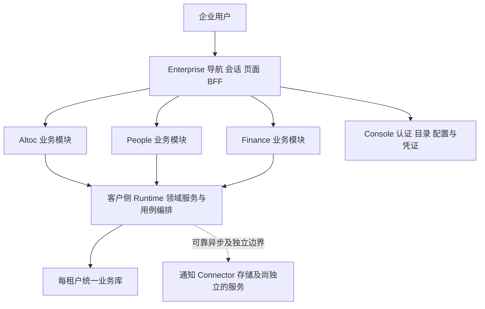

# Altoc People Finance 整合进 Enterprise 的方案与实施计划

日期：2026-10-02。版本：1.1。状态：评审修订后的方案与待执行计划。

本方案面向项目负责人和实施者，目标是尽快让销售、人事、财务在 Enterprise 内完成现有业务，并将三个模块的数据与运行路径接入每租户统一业务库。Altoc、People 优先复用现有界面和业务逻辑；Finance 按 Enterprise 的业务导航重新组织页面，复用既有财务规则与领域服务。

推荐推进方式是：先补公共接入和数据迁移基础，再并行推进 Altoc 经营操作、People 人员基础及 Finance 新界面；优先交付合同到回款、员工到项目成本两条完整业务链，最后完成其余已有功能和旧路径退出。一个批次的完成应包含页面、操作、数据、权限和所需后台执行，不能只以菜单可见或接口注册判断。

本次交付为计划文档，不包含业务代码实现、数据库迁移或环境启用。后续实际完成状态归入[统一实施总台账](./Unified-Enterprise-Implementation-Plan.md)的 INT-601～605 及对应验收记录；本文维护范围、依赖和任务定义。

本版补齐三通道和来源切换、既有 SQL 的兼容策略、跨域事务分类与环境批准点。评审处置见 §16；M1 必须先冻结这些边界，再扩大页面迁入范围。

## 1 目标和范围

### 1.1 已明确的方向

| 事项 | 本方案采用的方向 |
| --- | --- |
| 整合优先级 | 按用户本次要求，把 Altoc、People、Finance 接入 Enterprise 作为下一主线建议 |
| 前端 | Enterprise 唯一布局、会话、导航；业务模块保留代码组织和权限命名空间 |
| Finance 页面 | 允许重新设计，按办理任务和业务对象组织，逐项承接现有能力 |
| 数据 | 新启用路径直接使用统一业务库；历史独立库数据经核对后迁入 |
| 内部调用 | 同进程、同租户调用所属领域的 typed 公共入口；跨进程保留认证 |
| 人员权限 | 保留角色合并、数据范围、对象关系、敏感动作及职责分离 |
| Console | 独立管理控制台；Enterprise 保留个人页面和有权用户的外部入口 |
| Workflow | 沿既定统一库方向推进；每条审批链以实际已落地路径为准，不把工作项完成 lane 推广成所有审批都已同库 |

架构依据为 [ADR-018](./ADR-018-Unified-Enterprise-Application-and-Data.md)、[ADR-018a](./ADR-018a-Fold-Aims-Codocs-Into-Enterprise.md) D8～D11 和 [ADR-019](./ADR-019-Enterprise-Business-Frontend-Integration.md)。历史文档中的旧排期保留为过程记录；本方案不宣称原试点总验收已完成。

### 1.2 完整交付范围

1. 三个模块当前已实现、仍有效的页面和可达业务动作，包括子组件请求、附件、导出、审批、回调、通知和后台任务。
2. 复用三个领域已有 Runtime 适配器与业务规则，补 Host 三通道、统一库表映射、迁移对账及跨域事务入口。
3. 与 Aims、Assets、Codocs、Console、Workflow 的必要调用改造。
4. Finance 页面重组，以及完成这些页面所必需的受控查询、分页和摘要接口。
5. 旧链接兼容、历史数据可追溯、任务唯一执行方、故障恢复和逐项退役。

首批闭环与完整范围分开验收。后续批次仍在本计划内，不能把“首批已交付”表述为三个模块已经全部整合。

### 1.3 本轮范围边界

本轮不新增完整总账、凭证、关账、税务申报、银企直连、工资发放或招聘考勤套件；不改造 Account，不合并 Platform 或 Console 的安全数据库。AI 经营分析的新能力、独立移动应用和没有现成领域合同的新批量动作另列需求。

Aims、Codocs、Assets 保留与本轮链路有关的必要修复和接线。其他功能增强建议排在整合交付之后；现有业务的阻断缺陷仍及时处理。

## 2 当前基线与证据

初稿源码核对基线：bfea3ee41fd4349d555395e2a6ba960e8ba660b6；本次评审复核 HEAD：5910d77bd910cd9960288cd02ca55c0299f536e1，分支 feat/adr018-enterprise-integration。初稿核对时的工作区改动未作为完成证据；本次仅修订专项计划。环境判断来自仓库部署记录，本次未读取线上配置或数据库。

| 对象 | 当前源码事实 | 不能由此推导的结论 | 证据 |
| --- | --- | --- | --- |
| Enterprise | businessModules 注册 Aims、Assets、Codocs；Altoc 为导航及原生页面贡献者 | 三个新模块已完整组合 | [注册表](../enterprise/composition/registry.mjs) |
| Altoc | 源应用 31 个页面文件；Host 有 12 个基础只读页面及 13 个 BFF 路由文件，其中 1 个为履约启动 | 31 页已迁入，或履约链已在目标环境启用 | [读接入合同](./Unified-Enterprise-Altoc-Read-Integration.md)、[页面盘点](./Unified-Enterprise-Altoc-Pages-Inventory.md)、[Host 路由清单](../enterprise/composition/business-api-routes.generated.mjs) |
| People | 源应用 16 个页面文件；未注册 Host 组合模块，Host 下无 People BFF 路由 | 人员业务没有实现 | [People 模块说明](../people/CLAUDE.md)、[页面目录](../people/app/pages) |
| Finance | 源应用 7 个页面文件，动态页面承载 28 项页面配置；Host 下无 Finance BFF 路由 | 挂载 7 个文件即可完成全部财务功能 | [页面配置](../finance/app/config/pageConfigs.ts)、[Finance 模块说明](../finance/CLAUDE.md) |
| 可复用 Runtime | Finance 有 75 个 Go 文件，其中 32 个测试文件；People 有 51 个，其中 24 个测试文件。已有资源路由、领域校验和逻辑表名 SQL；People 还复用 compat 适配器 | 需要从零重建后端，或已有实现已兼容 Enterprise 认证与统一库 | [Finance 适配器](../data-runtime/internal/apps/finance/adapter.go)、[People 适配器](../data-runtime/internal/apps/people/adapter.go) |
| Workflow 接线 | Finance 已定义开票、报销、项目支出、付款四类提交映射；回调目标 helper 当前仅对 Aims 映射到 Enterprise | 三域审批定义、历史实例和回调已全部迁入；源码定义存在也不证明目标库 flow_action_defs 已启用 | [Finance 审批接线](../finance/server/utils/financeWorkflow.ts)、[回调目标](../workflow/server/utils/callbackTarget.ts) |
| Runtime Registry | 配置层已经接受 altoc、people、finance 领域 | 三域完整表映射、统一 adapter 和 Host 操作已经接通 | [统一配置](../data-runtime/internal/config/enterprise.go) |
| Host 用户通道 | Foundation 和 Runtime 的域级能力白名单仍为 aims/assets/codocs/altoc/console | Finance、People 只补菜单就能调用 Runtime | [Foundation 客户端](../foundation/server/utils/enterpriseRuntimeClient.ts)、[Runtime 认证](../data-runtime/internal/server/enterprise_context.go) |
| Altoc 安装基础 | 现有领域安装规格为 13 张表，服务于基础只读接入 | 完整经营、服务、回执、任务和财务关联表都已安装 | [安装工具](../data-runtime/cmd/hzy-enterprise-add-altoc/README.md) |
| 历史数据 | 自托管切换记录保留 Altoc、Finance、People 冷存档库 | 三域为空库、可直接执行初始化覆盖 | [生产切换记录](./Go-Live-Self-Hosted-S4-Cutover-Runbook.md) |
| 既有集成证据 | 2026-08-29 记录了 Altoc 开票请求经 Finance 创建 Workflow 运行实例 | 新 Enterprise 上的审批完成、开票、收款、核销已经全部验证 | [历史走查记录](./Altoc-Finance-走查ISSUE清单-2026-09.md) |

页面文件数量包含首页、拒绝页等，并非有效业务页面数量。31、16、7 和 28 分别是不同统计口径，不能直接相加作为验收分母。Go 文件数按对应 internal/apps 目录递归统计，包含测试，不代表需要重写的文件数；Runtime 路由数量按 APF-01 的 METHOD/path 和动作清单统计，避免通配分派被误算成一个业务动作。

实施开始前须补齐：目标环境当前版本和开关、三库真实表量与数据水位、历史迁移版本、附件可用性、活跃回调地址、在途 operation/receipt、定时触发者，以及可用于验收的岗位账号。历史记录与新回读不一致时记录差异和处置，不静默覆盖。

## 3 目标结构和领域归属

图中的三个业务模块属于 Enterprise 内部代码组织。Host 到 Runtime 仍是独立信任边界；Host 和浏览器均不持有数据库凭据。

| 数据或流程 | 权威领域 | 整合后的使用方式 |
| --- | --- | --- |
| 客户、商机、报价、合同、付款条款、经营回款计划 | Altoc | Aims、Finance 引用稳定业务键；展示当前事实时按权限查询 |
| 项目、任务、验收、已审核工时 | Aims | Altoc 关联交付；Finance 计算成本；People 固化贡献 |
| 员工事实、任职、岗位职级、人员成本快照、个人绩效状态 | People | Finance 读取有效职级基础；Console 接收经 People 提交后的受控异步生命周期投影 |
| 开票申请、正式发票、到账、核销、支出、项目财务与金额快照 | Finance | Altoc、People 读取各自获准摘要，不改写财务事实 |
| 目录身份、用户账号、认证、凭证与系统参数 | Console | 维持独立安全边界；人事事实通过既有受控路径生效 |
| 审批实例、审批任务和决定 | Workflow | 单据领域维护业务状态，Workflow 维护审批事实 |
| 正文与文件内容 | Codocs 或既有文件服务 | 只保存稳定引用，附件权限由正式文件合同核验 |

同库可以消除当前事实的重复读取和部分内部消息往返，但历史签署内容、成本快照、审计、命令回执仍保留。每一条跨域写都由所属领域执行状态校验。

## 4 Altoc 迁入范围

沿用现有业务页面与组件，按下面分组适配 Host。基础只读页逐组升级或替换为正式业务页面；同一路径最终只保留一套有效实现。

| 分组 | 现有页面或入口 | 需一并迁入的操作 | 批次 |
| --- | --- | --- | --- |
| 客户经营 | customers 列表、新建、详情、编辑 | 客户维护、联系人、开票资料、负责人、审批和关联文档；跨域服务摘要分阶段补齐 | M2 |
| 销售机会 | leads 列表、新建、详情；opportunities 列表、新建、详情、编辑 | 跟进、分配、作废/转换、商机状态转换、联系人关系和文档引用 | M2 |
| 报价 | quotes 列表、新建、详情 | 明细、版本、审批、状态转换及转合同所需事实 | M2 |
| 合同和回款 | contracts 列表、新建、详情；payments 列表、详情 | 合同行、付款条款、履约义务、结算计划、签署、履约启动、项目关联、回款跟踪 | M2；Finance 联动在 M3 |
| 投标和服务运营 | tenders 三页；客户详情内服务相关面板 | 投标、维保、服务覆盖、服务工单、Aims 派发、续约、知识归档和产品反馈 | M5 |
| 经营概览 | index、dashboard/index | 已有指标、漏斗、预测、应收及下钻；统计与列表同范围 | M5 |
| 配置和运维 | settings/index、settings/teams、admin/integration-operations | 字典、团队、操作诊断、受控重放；业务配置落在 Enterprise 设置 | 按依赖提前，M5 完成 |
| 共享或占位入口 | login、no-access、settings/profile、admin/index | 登录与拒绝页复用 Host；本人资料复用既有入口；占位页登记去向，不复制应用外壳 | M1～M2 |

contacts、service-ticket、maintenance/service-agreement 当前没有独立页面，不能按 manifest 资源数量制造新的页面迁移任务。服务能力先在已有客户/合同对象工作区内承接；独立业务列表确有需要时另作有依据的增量。

合同履约验收必须包括一份多合同行合同、多个项目计划，以及付款条款到里程碑的关系。已有 AA-03/AA-04 实现作为复用起点，先核对当前身份、开关、表映射和回执，不能按历史 TODO 重新开发一遍。

Altoc 基础读页面使用本地 ID，通知和集成常使用 code。逐类明确 URL 参数语义，兼容入口在所属领域内做受控解析，避免将 code 当 ID 或通过宽查询寻找替代对象。

## 5 People 迁入范围

| 分组 | 现有页面文件 | 迁入内容和依赖 | 批次 |
| --- | --- | --- | --- |
| 员工与任职 | employees/index、employees/[uid]、assignments | 员工最小事实、任职历史、主任职、生效日期、审批、范围与敏感字段 | M2 |
| 岗位与职级 | settings/positions、settings/ranks、settings/standard-costs | 岗位字典、职级字典、M/P 职级工资及绩效工资范围；三项语义保留，不简单合并成一个表 | M2 |
| 入职与离职 | onboarding-cases/index、offboarding-cases/index、offboarding-cases/[code] | 资料补全、开通/激活、状态刷新、取消、交接任务、资产回收协调 | M2 基础，M5 完成外部与异常路径 |
| 成本留档 | cost-snapshots | 从 Finance 成本参数生成月末有效任职快照，保留历史口径 | M4 |
| 个人绩效 | performance-cycles/index、performance-cycles/[code] | 汇集已审核工时、贡献快照、评分、确认、关闭与财务金额引用 | M4 |
| 人事事实源 | settings/hr-source-sync | 钉钉来源、部门映射、差异复核、停用确认、同步任务与失败恢复 | M5 |
| 工作台与诊断 | index、integration-operations | 原有概要和操作诊断；按业务导航放置，不另造全员人事看板 | 按依赖提前，M5 完成 |
| 拒绝页 | no-access | 由 Host 承接 | M1 |

岗位、职级字典和职级工资设置应分别判权。员工列表权限不蕴含薪资/成本字段读取权；项目负责人能读取项目成本汇总，也不自然获得全体员工成本明细。

People 当前既有根 /api/v1 请求，也有 /api/admin 编排请求；原 peopleApiPath 依赖应用 basePath。迁移时必须同时盘点页面与子组件，使用模块明确的 Host 路径，避免请求落入 Console 根 API。

正常运营期以 People 为人事事实源。未来生效任职不提前投影；已批准且生效的变更在 People 事务内记录可靠投递，提交后更新 Directory，由 Directory 按命令键和生命周期版本幂等处理。Console 独立安全库不加入 People 业务事务。人员离职到账号停用、Assets 回收和通知必须纳入同一业务交付批次的成功、延迟、乱序和恢复验收。

## 6 Finance 页面重设计

### 6.1 设计方向

采用 Enterprise 现有视觉体系，以紧凑表格、清晰状态和对象详情为主。工作台提供当前用户的申请和待办入口，经营区承载财务办理与核算，设置区维护规则。默认使用已授权的视图，不要求用户切换企业角色。

保留 /finance 下已有可用 URL 的兼容能力。新的“我的申请”入口是同一单据页面的受控个人视图；本人身份取自验证会话和签名 actor，服务端限定本人范围，query 仅表达筛选意图，不能授予权限。复用 manifest 已声明的人员 resource/action；新增提交、撤回等独立动作时必须显式定义及授权，不默认由 edit 蕴含。单纯增加“本人”筛选不新造一套权限动作。

本轮重设计包含信息架构、页面布局、交互、必要查询和详情呈现。现有后端不支持的批量核销、自动开票、智能对账、跨币种换算等能力不因页面出现按钮而被默认纳入。

### 6.2 导航安排

| Enterprise 区域 | 工作区 | 内容 |
| --- | --- | --- |
| 工作台 → 我的工作 | 我的财务申请 | 我的报销、项目支出申请、付款申请；开票申请按已存在的人员权限提供入口 |
| 工作台 → 审批办理 | 统一审批入口 | 复用 Workflow 的待办与记录，回到业务单据查看完整上下文 |
| 经营 → 财务收支 | 开票、收款与核销、支出、申请办理 | 高频财务工作，以待处理筛选和单据详情为主 |
| 经营 → 账户与资金 | 银行账户、余额快照、余额变动 | 显示账户、币种、余额日期和来源，不把快照推定成银行实时余额 |
| 经营 → 成本核算 | 项目核算、成本分摊、员工标准成本、绩效金额 | 当前期间与历史计算依据可追溯 |
| 经营 → 经营分析 | 财务概览与报表 | 复用已有指标和汇总，不把部分数据包装成公司完整经营结论 |
| 设置 → 业务配置 | 财务分类、科目映射、核算对象、成本参数、金额规则 | 明确生效范围和日期 |
| 设置 → 集成与运行／安全与审计 | 审批关联、操作诊断、财务审计 | 面向获权人员，业务失败可回到对应单据 |

实际导航贡献使用当前 [business-areas](../enterprise/composition/business-areas.mjs) 的分组码，沿 manifest 注册。侧栏“设置”采用 2026-10-02 当前命名；Console 独立控制台不重新并入。

### 6.3 现有 28 项配置的承接

下表路径省略 /finance 前缀。多个入口可进入同一工作区的不同视图，保留旧链接语义，不能丢失原筛选或对象身份。

| 当前配置路径 | 新页面或工作区 | 批次 |
| --- | --- | --- |
| invoices | 正式发票列表与详情 | M3 |
| invoices/requests | 开票申请列表与详情 | M3 |
| receipts | 到账列表与详情 | M3 |
| reconciliation | 核销工作区与记录 | M3 |
| expenses | 支出台账 | M3 |
| expenses/claims | 报销申请，含本人和办理视图 | M3 |
| expenses/projects | 支出台账的项目视图，保留原入口语义 | M3 |
| expenses/project-requests | 项目支出申请 | M3 |
| payments/requests | 付款申请 | M3 |
| bank-accounts | 银行账户列表与详情 | M2 |
| bank-accounts/balances | 账户余额快照 | M2 |
| bank-accounts/balance-changes | 资金变动视图 | M3 |
| project-accounting | 项目核算列表与对象详情 | M4 |
| project-accounting/allocations | 项目期间成本分摊 | M4 |
| project-accounting/employee-costs | 员工期间标准成本 | M4 |
| performance | 绩效金额结果 | M4 |
| performance/contributions | 财务贡献归因 | M4 |
| performance/rules | 设置中的绩效金额规则 | M4 |
| performance/snapshots | 计算历史与依据 | M4 |
| settings | 财务科目配置 | 按依赖提前，M3 完成 |
| accounting-objects | 核算对象配置 | 按依赖提前，M3 完成 |
| settings/subject-mappings | 业务与科目映射 | 按依赖提前，M3 完成 |
| settings/income-types | 收入分类 | M3 |
| settings/expense-types | 费用分类 | M3 |
| settings/people-cost-parameters | 人力成本参数 | M2 |
| settings/approval-instances | 单据审批关联与同步状态 | M3 |
| settings/audit-logs | 财务审计 | 按写入批次提供，M3 完成 |
| reports | 财务报表与既有导出 | M4 |

此外，7 个源页面文件中的首页、发票编辑、开票申请详情、到账详情、集成操作诊断和拒绝页均须登记去向。动态页面按上表拆解；正式 Host 不保留“任意 slug 都显示财务功能占位”的兜底。

### 6.4 首批重点页面

| 页面 | 首屏与列表 | 详情和主要操作 | 必须保留的业务边界 |
| --- | --- | --- | --- |
| 开票申请 | 状态、客户、合同、金额、责任人、截止时间；待处理筛选 | 来源回款计划、申请内容、审批记录、指派、提交和获权开票操作 | 审批通过只表示申请已批准；正式发票由独立 issue 动作产生 |
| 正式发票 | 号码、客户、合同、金额、日期、发票状态、核销状态 | 附件预览、编辑及已有红冲/作废等生命周期动作、关联到账与核销记录 | 发票状态和收款状态分别表达；实际可用动作以领域规则为准 |
| 到账 | 到账额、未核销额、付款方、日期、责任人、来源分类 | 确认、分类、核销入口和关联记录 | 资金事实归 Finance；来源和责任人由服务端复核 |
| 核销 | 选定到账、可核销对象、已分配与剩余金额 | 提交前金额及归属复核，结果记录，既有撤销入口 | 金额精度、并发余额、职责分离和重放由服务端保证；依照已有分配能力设计交互 |
| 支出与申请 | 类型、金额、项目、收款方、状态与待办 | 申请编辑、提交、审批、确认、附件及关联台账 | 申请、批准与实际付款分开；审批和付款的独立动作不得由 UI 合并绕过 |
| 项目核算 | 项目、期间、收款、直接支出、人力/资产成本、核算就绪状态 | 成本构成、来源、缺失项、重算和历史结果 | 缺有效输入时毛利和毛利率保持未就绪，不显示为 0 或完整收益 |

### 6.5 交互和视觉细则

1. 列表使用页头、可选摘要、筛选及主操作、结果区的结构；摘要由服务端在相同授权范围内计算，不能用当前页金额代表全部结果。
2. 详情首屏给出对象名、业务编号、状态和不超过 8 项关键字段；正文按业务内容、附件、关联单据、审批与历史分区。
3. 简单对象不超过 6 个独立字段时使用弹窗或侧边面板；7～8 个单步字段优先宽侧边面板；子表、实时合计、核销分配、审批预检使用独立页面。
4. 客户、合同、项目、员工和账户使用受权限限制且真实分页的选择器；申请人和操作者来自验证会话。技术 UID 可用于追溯，不作为普通用户的主要录入方式。
5. 金额明确币种和精度；多币种分组显示。没有获准的换算规则时不跨币种相加。格式化和状态标签复用 Foundation。
6. 列表状态进入 URL；详情返回保留搜索、筛选和页码。重复提交、返回刷新、迟到响应和多标签切换有明确行为。
7. 区分加载、空数据、无权限、依赖故障和业务冲突。202 只表达已受理或处理中，不显示为开票/同步完成。
8. 列表、详情、附件和导出分别判权；敏感字段没有权限时省略或明确拒绝，不从缓存泄漏。
9. 桌面以 1440 宽验证，窄屏以 390 宽验证；复杂表格采用受控横向滚动或字段收敛，主要办理动作、金额合计和错误提示可达。
10. 优先完成开票申请、核销、项目核算三类代表页面的线框与交互说明，再复用到其余页面。本计划不额外要求三套视觉方案或新的强制选择关口；用户后续指定视觉评审点时遵循。

以上以根 CLAUDE 的当前 Host 规则和 [UI 规范](./UI_UX_SPEC.md)为准；UI 规范中旧独立应用 Shell 的历史要求，不用于恢复第二套 Host 布局。

### 6.6 Finance / Altoc 职责冲突矩阵

APF-06 交付逐动作矩阵，关联 manifest、Platform 冲突规则、持久化对象关系和领域校验；UI 只解释拒绝原因，不能替代服务端判断。

| 场景 | 本轮处理依据 | 回归要求 |
| --- | --- | --- |
| 开票、报销、项目支出、付款的申请与审批 | 保留已实现的自审批拦截和审批人校验，不把发起人自行取消误判成审批 | 同一人、不同人、多人审批、缺审批 actor、重放分别验证；按各单据现有规则验收 |
| 付款申请／支出制单与付款确认 | 保留 payment_confirmation_duty_separation；比较受信操作者与已落库申请人、经办人或创建者 | 伪造 paidBy、confirmedBy、修改请求中的申请人均不能绕过；Host 用户不能降级为无 actor 服务调用 |
| Altoc 合同／回款计划操作到 Finance 开票、确认、核销 | 两域分别校验具体动作、责任关系、范围和现有实例冲突规则 | 合同 edit 不自动授予财务 issue/confirm；合并角色、自定义角色仍执行冲突检查 |
| 开票申请人必须不同于开票人；到账确认人必须不同于核销人 | 这两项不是本次抽查已证实的通用强制规则；M0 核查现有政策，已有规则完整保留，新增强制分离单独形成业务决策 | 未确认前不把评审举例变成上线门槛；确认后补 manifest／冲突策略与领域测试 |

已核实实现见 [付款职责分离](../data-runtime/internal/apps/finance/payment_confirmation_duty_separation.go)及[审批职责分离测试](../data-runtime/internal/apps/finance/approval_duty_separation_test.go)。

## 7 前端和 Runtime 实施方式

### 7.1 页面与模块组合

- 为三个模块补齐或调整显式业务入口，沿现有 Layer 注册方式组合。Altoc 现有 navigation 贡献和原生页切换必须去重。
- 扩展模块别名、自动导入和 CSS 来源登记；目前 [alias 实现](../enterprise/composition/business-module-alias.mjs)还未包含 People、Finance。store 和同名符号逐项复核，唯一登录与会话仍由 Host 提供。
- Finance 将动态大页面拆成业务页、专用表单和可复用的轻量公共组件；Altoc、People 仅做迁入所需布局、路由和请求适配。业务专用组件留在所属模块。
- 显式注册 BFF，重新生成 navigation、api-readiness、组合 manifest 和网关拓扑；不存在的操作继续失败关闭。
- 浏览器业务 URL 按受信模块注册归属。People 根 API、Finance /api/v1/finance 以及共享 Foundation /api 路径分别适配，不通过全局替换 appCode 或导入独立中间件接管全站。
- 缓存包含租户、环境、主体、模块、对象、查询及所需权限版本；撤权、身份切换和迟到响应沿 Host 既有机制处理。

### 7.2 三通道能力与人员授权

沿 ADR-018a D11 §9.3 固定以下九项能力，不留到逐页实施时再命名。Enterprise 出站身份为 enterprise.runtime，source_app=enterprise；grant 同步覆盖实际使用的 data-runtime／tenant-runtime audience 和 deployment 绑定。

| 域 | 用户动作 | 系统任务 | 通知详情只读复核 |
| --- | --- | --- | --- |
| Altoc | altoc:enterprise-host:execute | altoc:scheduler:execute | altoc:notification-detail:authorize |
| People | people:enterprise-host:execute | people:scheduler:execute | people:notification-detail:authorize |
| Finance | finance:enterprise-host:execute | finance:scheduler:execute | finance:notification-detail:authorize |

- 用户通道必须有验证会话、签名用户委托和短期 permit，拒绝非空 purpose；Runtime 复核 actor、tenant/deployment、具体 resource/action、对象范围及事务时点关系。
- 系统通道只执行注册表允许的机器动作，固定 system 主体；拒绝任何用户委托头，按租约和 generation 执行。人工 replay 等管理动作仍走用户通道。
- 只读复核通道限定已登记路径，签名委托的 purpose 固定为 notification-detail-authorization，viewer 来自验证后的上游命令；只输出授权结果，不能办理业务写入。
- 每次申请令牌只请求当前通道需要的 scope，不混合用户、系统与 purpose 能力。同步更新 Foundation 客户端、Runtime API 合同、域及路由白名单、Console grant seed/verify 和签发探测。

人员授权复用 Foundation；权限目录以模块 manifest 为事实源。跨域操作分别复核各域权限，合同 edit 不授予创建项目、开票或完整财务明细，员工 view 不授予成本字段。按照 [ADR-019](./ADR-019-Enterprise-Business-Frontend-Integration.md)，服务能力不进入人员导航权限，也不替代具体人员动作。

#### 7.2.1 优先复用路由族和适配器

APF-04 采用“已登记路由族 + 精确 METHOD/路径模板 + 人员资源/动作映射”复用现有领域 handler。公共认证与 permit 编译集中实现，不为每个 CRUD 重写一套业务服务。

Host 用户入口保持当前合同的 `/v1/enterprise/<domain>/…` 命名空间，受控分派到既有 adapter；参数、对象键、请求体和查询均绑定具体操作。复用 /v1/finance/…、/v1/people/…、/v1/altoc/… 的处理逻辑，不等于允许 enterprise.runtime 任意穿透旧路径。系统、purpose、旧服务入口分别登记；仅扩大正则或添加 /** 通配放行不合格。确需改变公开路径合同时，同时修改受影响合同与生成制品。

M1 先验证每域 list/detail/write、一项机器动作、一项 purpose 复核及跨通道拒绝，再推广路由映射。以样例结果估算复用成本，不预先宣称工作量相差一个数量级。

#### 7.2.2 来源切换与双来源窗口

APF-04 逐路由盘点 /v1/finance/**、/v1/people/**、/v1/altoc/** 及接收方写死的旧 *.runtime 来源。登记旧 client/source_app、目标 client/source_app、audience、deployment、通道、允许的操作和兼容开关；修正后补错来源 403 测试。不能只修改发起端身份。

双来源窗口按路由族开启，只允许 enterprise.runtime 的新合同和该族原有精确身份的旧合同。沿 P1 的认证方式，仅明确的 source_app_mismatch 可进入受限旧来源验证；缺 scope、无效签名、过期、错租户或错 deployment 不触发降级。每条分支都完成自身精确校验。

为仍运行的旧消费者保留有期限的兼容窗口，并记录退出条件；新环境无旧消费者时显式关闭 legacy。不能把 P1 为既有 Aims 运行路径保留的默认 true 无条件复制为三域常开。停旧 owner、回调和在途操作收口后关闭对应族，验证旧来源拒绝，再按 §13 撤 grant。

#### 7.2.3 两条特殊边界

| 边界 | 现有约束 | 迁入后的处理与验收 |
| --- | --- | --- |
| People HR 来源部门重映射 | peopleHRSourceDepartmentRemapSubject 固定 client:people.runtime，精确能力 people:hr-source-department-remap:execute，加管理员签名委托 | 显式登记为 people:enterprise-host:execute 下的一个固定操作，要求 HR 管理员 permit 和签名 actor，只接受绑定的 enterprise.runtime，不新增 capability；旧身份仅在该路由专用兼容窗口按原精确能力校验。普通 People 用户、scheduler、伪造 actor、非空 purpose 一律拒绝，不靠全局 subject 替换 |
| Finance 数据范围断言 | financeRuntimeQuery 只信任由 actor HMAC 覆盖请求目标的 scope 断言 | Host 签名覆盖实际出站 path/query；验证前不得改写目标，映射到内部 handler 后保留不可变的已验证授权上下文。验证缺委托、改 path/query、伪造范围和跨租户均失败；无 actor 机器路径清除人员范围字段，人工 replay 不得豁免 |

具体边界见 [Runtime 接收与 Finance 查询认证](../data-runtime/internal/server/server.go)。复用路由时必须保留这些检查，不能将服务 Token 本身当作用户身份。

### 7.3 领域服务与同库事务

Runtime Registry 已允许三域配置，主要工作是补完整表映射、正式读取/写入入口和 adapter 接线。不能以设置相同 DSN 代替 Registry 的 tenant、owner、generation 和事务检查。

单域操作复用所属 adapter 的规则；适合共享事务的跨域操作提取显式接受事务句柄的服务入口。禁止在事务内等待 Console、Workflow Node、OSS 或其他网络服务。

同进程调用经所属模块 typed 公共入口，保留对象范围与职责分离，增加边界测试防止深层导入扩散。已被替代的 Service API 删除或固定 410；仍有进程外消费者的入口继续执行原认证合同。

现有回执、幂等键和冻结命令优先复用。新旧入口应重放出同一业务结果，不能因为改了物理应用名就重复开票、重复建项目或重新产生历史消息。

多域写复用 B2/B3 的 Registry.ResolveDomains、持久化 generation 栅栏和 caller-Tx owning 核心模式；不能让两个 wrapper 各自提交。BeginWorkflowWriteTransaction 的具体 lane 只用于已支持的 Aims/Workflow 场景，其他域提取相应受限入口，不伪装成该 lane。正反向操作共用固定对象锁序及 receipt 获取点，同层 ID 排序；锁序按参与域与对象固定，不按每次请求的“来源→目标”动态翻转。APF-04/05 在 M1 冻结相关链的锁序表，后续业务批次用并发、回滚和重放验证。

### 7.4 Workflow 代理与回调整组迁入

APF-12/18 扩展现有仅覆盖 Aims 的代理和回调映射，按逻辑 app_code=altoc、finance 分别登记完整动作组；People 在 APF-01 核查实际审批入口后同样登记，不能只迁一个演示单据。

每组同时处理目标 URL、路径前缀、audience=enterprise、enterprise:workflow-callback:execute、Enterprise 接收方及 owning 模块分派。保留实例及冻结命令的逻辑 app_code、业务键、原 callback 相对路径语义和幂等键，不全局替换为 enterprise。受理端校验受信回调身份与 app_code/动作/路径映射，不能由浏览器字段任选目标模块。

盘点 flow_action_defs、路线、回调日志、运行中实例和冻结 callback_url；发送端统一选择物理目标，历史命令按原键重投，不能只更新新建实例。Workflow 提交入口中写死 finance 等旧来源的校验也逐条迁移。grant、来源和整组回调就绪后才切该组，覆盖错 app_code、错前缀、重复与迟到回调。源码／初始化定义和目标环境有效定义分别取证。

## 8 数据迁移与启用

### 8.1 三域映射

| 域 | 完整盘点对象 | 关键对账 |
| --- | --- | --- |
| Altoc | 字典、客户联系人、线索商机、报价版本、合同子表、回款、服务运营、文档引用、审计和可靠操作 | 客户/合同/计划业务键、金额与状态、项目及付款条款关系、服务覆盖引用 |
| People | 员工、任职、岗位职级、标准成本设置、月度成本、贡献、绩效、入离职任务、同步状态及回执 | employee_uid、主任职和有效日期、部门引用、冻结快照、生命周期水位 |
| Finance | 科目和分类、核算对象、账户及快照、申请、发票附件、到账核销、支出、成本、绩效金额、审批映射、审计和可靠操作 | 按币种和期间的金额、已核销/剩余额、单据与回执、历史核算与附件引用 |

采用 B1 的 **兼容视图族为主，冲突名称有限改用 Resolved.Table**，不对 Finance/People 全量 SQL 做机械重写。现有 Runtime adapter、compat 资源配置和 SQL 本身就是消费者：既有名字有的带业务前缀，有的是通用逻辑名，均须从真实读取、写入、schema 检查和任务闭包派生规格。

| 名称类型 | 固定策略 | 验证要求 |
| --- | --- | --- |
| 各域独有逻辑名，且物理名不同 | Registry 映射到领域物理表；派生全列 MERGE / SQL SECURITY INVOKER 兼容视图，复用旧 SQL | enterpriseviews.Install 与 verify-views 共用规格；安装集与派生集双向相等，列、定义及目标域正确 |
| 逻辑名与物理名相同 | 直接访问已登记物理表，不生成视图 | 禁止同名自引用；启动检查、迁移规格及 Runtime 所需表集合一致 |
| SharedPhysicalNames 中的 integration_operation、integration_operation_attempt、integration_operation_dead_letter_actionable、service_command_receipt 等 | 保持 SharedPhysicalNames 原列表；采用 `<domain>_integration_operation*`、`<domain>_service_command_receipt` 等域前缀物理名，消费者经 Resolved.Table 及对应 repository 配置访问 | 不建立通用逻辑名视图指向任一域，不合并回执或任务账本；验证三域命令键、租约与回执隔离 |
| system_parameters | 不加入 SharedPhysicalNames，不改变 Assets 的 ExclusiveOwners 或既有视图；三域源库实际存在时，逻辑／物理均采用 `<domain>_system_parameters`，消费者有限适配 | 不借用 Assets 参数；源不存在则记录，不制造数据；现有 Assets 定义和数据不变 |
| 其他名称冲突 | M0/M1 显式分类；优先专属逻辑名及 Resolved.Table，未处理冲突阻止安装 | 不为消除报错扩充共享名例外，不覆盖既有对象 |

physical/logical 表名、列、索引、外键、trigger、JSON 引用字段家族和 migration checksum 逐项登记。表规格必须覆盖审计、历史快照、回执及在途 operation，不能只满足首屏查询。JSON 中业务 app_code 不因物理 Host 改名而改写；确需转换的引用给出明确规则和对账。

实现复用 [B1/B2/B3 设计及落地记录](./Aims-Workflow-Unified-Transaction-Design.md)、[视图派生机制](../data-runtime/internal/enterpriseviews/views.go)和[共享名称注册表](../data-runtime/internal/enterprise/shared_names.go)。三域扩展采用显式可选规格，未选中时既有默认映射和 review hash 不漂移；Altoc 13 表独立安装的来源、去重与完整域规格纳入统一验证，不能重复安装或假定它已经覆盖全域。

完整三域安装沿 dry-run 与闭集计划 → review hash → shadow-copy／视图安装 → 校验 → drain/final-copy → 激活协议，各真实环境写入按 §11.1 批准。生成本次独立 candidate、目标库及 hash，不复用旧 C000001 两域 target/hash；通用复制和视图安装拒绝已激活目标，不绕过检查直接给活动库补表。仅既有激活协议允许同 cutover key、hash、generation 的精确回执重放。已有活动域的数据与增量同步纳入新候选完整闭集；实际库名、代次和切换面在 APF-05 冻结，不默认停写或覆盖活动库。

### 8.2 执行顺序

1. 回读目标环境和冷存档来源，确认是否仍有外部旧 writer、定时任务或回调写入，确定最终水位。
2. 生成三域表、引用、JSON 内引用、历史快照、审计、回执和在途操作清单。优先在公共映射中一次覆盖全域，减少每迁一页就补一张表。
3. 完成字段和数据冲突报告。金额、归属、业务键冲突需有明确处理记录，不静默覆盖或生成虚假缺失记录。
4. 在可丢弃的完整隔离副本演练 shadow-copy、视图安装、双向校验、业务写入和恢复；同时验证已有 Aims/Assets/Workflow 等已启用域的定义、数据及行为不变。DDL 不假定能被业务事务回滚。
5. 生成新租户初始化或历史租户导入候选、完整迁移闭集与 review hash；在尚未激活的目标执行经授权的复制和安装，保留 source ID/code 映射与摘要。最终 drain/final-copy 同样绑定独立评审 hash，不能使用旧批准替代本次候选。
6. 在目标环境完成备份、源水位冻结／最终增量校验、精确 grant verify、真实客户端组合 scope 签发探测及受限账号预检，准备 Registry、回调与任务 owner 切换。批准点见 §11.1。
7. 激活同一固定候选，按模块和已验收操作分别开启 read/write/scheduler，再执行实际业务验收。先迁数据不自动放行全部写入口；未开放能力保留原明确 owner 或关闭，不能出现两方同时写。

若数据准备允许，三域映射与隔离演练可共同开展；各业务域仍独立开关和验收，People 或 Finance 的数据问题不必阻塞已完成验收的 Altoc 功能。

### 8.3 恢复和回退

无新写入时可按演练过的步骤撤销本批路由或配置。有新写入后，默认暂停受影响写入并向前修复；确需恢复旧执行路径时，先证明旧代码兼容当前统一数据，或完成反向迁移和对账。切回冷存档 DSN 不构成有效回退。

每个批次记录固定源码、构建摘要、数据迁移回执、配置与 grant 差异、回调地址、任务 owner 和恢复步骤。数据库删除、历史数据清理和生产发布只在实际授权范围内执行，不因本计划出现步骤而自动执行。

## 9 必须贯通的业务链

| 链路 | 完成标准 | 批次 |
| --- | --- | --- |
| 合同到项目 | 合同与项目关系、项目负责人、多计划、里程碑和回款条款正确；重试不重复建项目 | M2 |
| 验收到回款 | 验收使计划可开票，申请进入审批，获权人员开票，到账确认和核销后回到合同查看财务摘要 | M3 |
| 人员到目录 | 经批准且生效的任职更新必要目录事实；未来任职不提前生效；离职和重新入职顺序正确 | M2 |
| 离职到资产 | 当前离职事实形成资产回收协调，任务、责任人与通知可追溯；故障恢复不重复建任务 | M5 |
| 工时到项目成本 | Finance 读取 Aims 已审核工时、People 有效主任职/职级和 Finance 参数，生成期间成本并重算项目结果 | M4 |
| 项目贡献到绩效 | People 固化贡献、评分及确认/关闭；Finance 金额快照只作为财务依据引用 | M4 |
| 服务工单到交付 | Altoc 服务工单进入 Aims 执行、结果回写、覆盖和 SLA 正确；知识和反馈沿正式接口贯通 | M5 |

Finance 基础收支不等待 People 全部绩效完成。项目成本也不依赖绩效周期。People 的月度成本留档与 Finance 项目人力分摊分别保留，不能合成一张含义模糊的“人员成本表”。

Workflow 现阶段仍独立运行的审批链复用受控代理、回调和回执。将其进一步改为同库用例可以随对应链实施，但不把全面重写审批引擎作为首批前置。

### 9.1 各链的提交方式

下表按 ADR-018 §4.2 固定主路径。“共享事务”仍通过 owning typed 入口执行；“typed 读取”不等于允许 Finance 直接操作 People/Aims 表；涉及独立 Console、外部通知等副作用仍提交后执行。

| 链路或子步骤 | 主路径分类 | 原子边界、重试与验收 |
| --- | --- | --- |
| Altoc 合同到 Aims 项目／里程碑 | 共享事务 | 复用 AA-03/04 的 owning 入口，合同关系、项目、里程碑及业务回执按现有合同原子提交；校准统一 Registry 与既定锁序 |
| Finance 核销等变更 → Altoc 合同财务摘要（altoc-summary） | 共享事务 | 双域就绪后，在受限用例内由 Finance 维护财务事实、Altoc 维护所属摘要；共用固定锁序，摘要失败则该用例回滚。旧 pending／leased 仍用原命令和回执收口，新事务路径不再生成重复内部投递；外部通知另建 outbox |
| People 生效人事事实 → Console Directory | outbox | People 事实与投递记录同事务，提交后跨边界发送；Directory 按生命周期版本与命令键幂等。断网、乱序、未来生效、离职后重入职不产生部分人事提交或旧版本覆盖 |
| People 离职 → Assets 回收协调 | 共享事务（同 Runtime 已迁入部分）；外部效果 outbox | 人事任务与 Assets 所属协调记录由受限内部入口提交；若相关 Assets 路径尚独立，该子路径明确保留可靠投递并单列环境状态，不能声称同事务。账号停用和通知始终提交后执行 |
| Altoc 服务工单 → Aims 派发及交付结果回写 | 共享事务 | owning 入口保存工单关系、执行对象、结果和回执；正向派发、反向回写使用同一锁序，不按请求方向倒置。中途失败整体回滚，历史 operation/receipt 沿原键收口 |
| Finance 读取 Aims 已审核工时、People 有效主任职／职级以计算成本 | owning typed 读取 + Finance 本域写事务 | 冻结获权输入集合、有效时点和版本／hash；日历等外部事实在业务事务前读取。同一提交事务内经 owning 入口复核本地输入版本并按固定锁序作必要短锁保护，变化则重算或拒绝；只写 Finance 的成本、就绪状态与历史依据，不在跨网络计算期间持锁 |
| People 贡献／绩效与 Finance 金额引用 | owning typed 读取 + 各自领域提交 | People 固化贡献和人员状态，Finance 保持金额快照权威；保存来源版本及引用，不双写同一绩效金额事实 |
| 仍独立的 Workflow 审批提交与回调 | outbox／可靠命令 | 沿原冻结命令和回执，使用 §7.4 的整组代理及回调映射；仅已实际迁入的指定 lane 使用其共享事务合同 |

共享事务验收包括：相同 tenant/DB/Key/generation、持久化 Registry 栅栏、对象与 receipt 固定锁序、任一域失败全部回滚、正反向并发无锁序反转、原键重放不重复效果。事务期间禁止 Console、Workflow Node、OSS 等网络 IO；审批人、目录及日历预读失败应明确失败，不能在锁内补网络调用。

## 10 后台任务与服务身份

下表按源码列出任务族。它是迁移清单，不证明目标环境已经开启任务。

| 域 | 已有任务或执行族 | 目标安排 |
| --- | --- | --- |
| Altoc | integration-operations/drain、receivable-due、overdue/scan、stale/scan | 有界领域扫描由 Runtime 承接；仍需外部 IO 的投递由 Enterprise 所属模块执行器承接，按任务登记唯一 owner |
| People | directory-lifecycle、assets-offboarding、dead-letter-notifications、offboarding-due | 生效事实和准备逻辑在 Runtime；跨 Console/Assets/通知边界按正式调用或已迁入内部服务执行 |
| Finance | altoc-summary、finance-due，以及审批与可靠操作执行器 | 按 §9.1 将新摘要回写并入共享事务，历史任务沿原键收口；通知、独立 Workflow 和外部效果保留可靠投递 |

任务迁移需要明确执行器、触发者、tenant/environment、允许动作、租约、generation、在途命令和回退 owner。三通道能力按 §7.2 固定，按任务核对精确路由和来源；用户触发的管理重放不混入系统任务。

共享 Runtime 代码允许 typed 内部调用，不向内部函数重复签 JWT；Enterprise 到 Runtime 的系统通道仍鉴权。迁移期间按实际通道核验 data-runtime 和 tenant-runtime audience，不能借旧模块高权限身份绕过缺失授权。

涉及该批功能的任务应随该批一起迁入或证明正式兼容路径可用，不能全部拖到最后。M5 是剩余任务和外部场景的总收口。新增批次默认不产生第二个 scheduler owner；调度能力的代码、授权和环境触发分别记录。

通知投递、外部审批、文件处理与独立 Console 生命周期仍可能需要 outbox。历史 pending、leased、dead-letter 和 receipt 不删除、不重新生成业务身份；ACK 丢失、旧版本回放和责任人变化必须可恢复。

## 11 分批计划和工作包

### 11.1 里程碑

| 里程碑 | 可交付成果 | 前置 | 放行条件 | 批准点 |
| --- | --- | --- | --- | --- |
| M0 范围基线 | 三域动作清单、历史数据报告、身份/任务依赖、Finance 页面承接表及实施估算 | 本方案 | 未知项有核查动作；首批关键冲突明确 | 盘点和本地方案无需追加批准；仅新增业务政策等实质选择需明确决策 |
| M1 公共接入 | 三域注册、路由族复用模板、九项能力、来源与回调整组映射合同、SQL 兼容规格、固定锁序表、隔离样例和 Finance 代表设计 | M0 | 三通道及特殊边界反例通过；完整迁移／视图闭集验证；按 §12.1 记录代码和隔离验证证据 | 隔离夹具直接验证；若此批进入真实环境，逐项列 shadow-copy、视图安装、grant seed 的目标和 hash 后取得适用授权 |
| M2 经营与人员基础 | Altoc 经营主链和合同到项目；People 员工/任职/职级；Finance 账户、余额快照、成本参数 | M1；对应域数据准备 | 真实岗位完成增改查及所需审批／生命周期，跨域引用与任务可恢复；记录 §12.1 环境与业务证据 | 本批数据安装／最终复制、Registry 激活、配置／回调切换、任务 owner 交接，复用已覆盖的授权 |
| M3 财务收支闭环 | 新开票/到账/核销界面、支出与申请、配置和审批诊断；合同摘要回写 | M2 中 Altoc 与 Finance 前置；无需等待 People 绩效 | 从回款计划到批准、开票、到账核销完成；职责冲突、回滚、重放通过；四态证据分列 | 本批新增 grant、Workflow 整组回调和财务写／任务切换；停旧摘要 owner 单独列明 |
| M4 成本与绩效 | 项目核算、成本分摊、People 成本快照与绩效、Finance 金额依据、报表 | People 基础、Finance 参数、Aims 工时和 M3 相关收支 | 缺输入、调岗、生效日期、重算并发、历史不漂移有证据；四态分列 | 本批配置／调度切换；影响现有账期或正式快照的首次重算明确对象和后果 |
| M5 全功能承接 | Altoc 投标/服务运营、People HR 来源及异常生命周期、剩余已有功能和任务 | 对应前置批次；可提前开发独立部分 | 全部有效入口有迁入、共享承接或明确退役记录；四态逐动作核对，无悬空操作 | 剩余环境启用、HR 来源切换和停旧 owner 逐项列明；不重复询问已有适用授权 |
| M6 运行收口 | 分批观察、恢复验证、旧消费者归零和维护文档同步 | 各批实际环境验收 | §13 的消费、令牌、观察期和撤销反例齐全 | 关闭 legacy、停旧进程／任务、撤 client/grant／配置分别列对象、证据和恢复方式，每批取得适用批准 |

M2～M5 可以分域、分完整功能批次启用，不必等待所有模块全部完成才向用户交付。生产放行仍完成该批所依赖的租户隔离、权限、数据恢复和真实业务验收；不会因本方案调整顺序跳过必要条件。

“批准点”遵守根 CLAUDE 的 Execution Style：已授权的本地修改、经确认无生产访问的可丢弃隔离夹具及相关修复直接执行；已有同环境、同对象、同后果的授权可复用。真实环境 shadow-copy、视图安装、grant seed、配置／Registry／回调切换、停旧 owner 和撤 grant 在执行前逐项列入可审阅批次，缺少适用授权才申请。可一次批准边界清楚的整批动作，不强制每条命令重新询问；测试部署授权不延伸到生产。

批准材料至少列目标租户／环境／实例、源码与构建、差异、迁移或配置 hash、备份／恢复、执行后回读与预期影响。计划获认可、dry-run 成功或隔离测试通过均不自动批准真实环境切换。

### 11.2 工作分解

任务 ID 用于实施跟踪。当前全部为待执行计划，不自动勾选对应 INT 任务。

| ID | 工作包及具体产物 | 依赖 | 验收归属 |
| --- | --- | --- | --- |
| APF-01 | 生成三域“页面/动作 → BFF → Runtime → 表/外部副作用 → 人员权限”清单，明确交付 People 实际 Workflow 动作组清单，作为 M1 回调整组合同的输入；复核历史 ISSUE 的当前状态 | 无 | M0；INT-601/605 |
| APF-02 | 回读目标环境、冷存档、schema 漂移、在途操作、账号和调度；形成数据及启用差异报告 | 无 | M0；INT-601 |
| APF-03 | 注册模块、导航、别名、自动导入、样式来源、共享会话与 URL 兼容；更新生成制品 | APF-01 | M1；INT-605 |
| APF-04 | 复用路由族及精确 permit 映射；九项能力、逐路由来源迁移与双来源窗口；HR 专用边界／Finance 目标签名；grant seed/verify、固定锁序合同及通道反例 | APF-01 | M1；INT-602～605 |
| APF-05 | 三域迁移闭集与 JSON 家族、兼容视图＋有限 Resolved.Table、共享名／参数隔离、shadow-copy／新 hash／已激活目标拒绝、双向 verify-views 和恢复演练；纳入已有活动域保护 | APF-02；与 APF-04 合并校核 | M1 基础，各批数据验收 |
| APF-06 | Finance 信息架构、28 项映射、三类代表线框、状态／权限／Finance-Altoc 职责冲突矩阵及查询合同；区分现有政策和待定新增规则 | APF-01 | M1；INT-603/605 |
| APF-07 | Altoc 客户、联系人、线索、商机、报价及其文档和审批动作迁入 | APF-03/04/05 对应部分 | M2；INT-602/605 |
| APF-08 | 合同工作区、付款条款、履约、关联项目、里程碑回款；复用并校准 AA-03/04 | APF-07；Aims/Workflow 所需链路可用 | M2；INT-602 |
| APF-09 | People 员工、任职、岗位职级、成本设置、入职与 Directory 生效链 | APF-03/04/05；APF-10 参数 | M2；INT-604/605 |
| APF-10 | Finance 账户/余额快照、成本参数和首批依赖字典；提供 People 所需受控读取 | APF-03/04/05/06 对应部分 | M2；INT-603/604 |
| APF-11 | Finance 开票申请、正式发票、到账、核销的新页面与完整 BFF/Runtime 操作 | APF-06/10 | M3；INT-603/605 |
| APF-12 | Altoc 开票到 Workflow、Finance/Altoc 摘要共享事务、文件预览；altoc/finance 的 app_code 整组代理／回调映射、历史实例和原键重试 | APF-08/11；APF-18 对应路由族 | M3；INT-603 |
| APF-13 | 支出、报销、项目支出、付款申请、分类配置、审批关联与审计 | APF-10/11；Workflow | M3；INT-603/605 |
| APF-14 | 已审核工时、有效职级、工作日历与参数生成项目成本；完整集合替换和历史查询 | APF-09/10；Aims 数据；M3 收支 | M4；INT-604 |
| APF-15 | People 成本留档/贡献/绩效，以及 Finance 归因、金额规则、计算记录、报表导出 | APF-09/10/14 的相关读取 | M4；INT-603/604 |
| APF-16 | Altoc 投标、服务覆盖/工单/续约、Assets/Codocs 摘要、知识与产品反馈 | APF-07/08；涉及 M3/4 的摘要按依赖接入 | M5；INT-602/603/605 |
| APF-17 | People HR 事实源、部门映射、离职资产协调、外部开通及失败恢复 | APF-09；Console/Connector/Assets | M5；INT-604 |
| APF-18 | 逐族迁移 scheduler、drain、通知、purpose、整组回调与人工重放；登记唯一 owner、legacy 开关及在途命令收口，用户／机器动作分开 | APF-02/04/05；随各功能批次 | M2～M5；INT-602～605 |
| APF-19 | 固定候选、岗位/两租户/故障/浏览器验证；按 §12.1 四态记录证据；逐项列真实环境复制、视图、grant、切换和停旧 owner 的批准及恢复材料，复用有效授权 | 对应批次实现 | 每个里程碑 |
| APF-20 | 全动作对照、外部消费者核查、旧 grant 零签发和旧来源零使用、缓存／在途窗口、撤销反例、精确退役与文档同步 | 各批环境验收与观察 | M5/M6；INT-605，退役回归 INT-701～705 |

### 11.3 并行方式和关键路径

建议工作分为公共接入与数据、Altoc、People、Finance 页面与业务四个职责。是否由多人执行按实际资源决定，本计划不要求自动启动代理或增加并发数量。

公共文件由集成负责人收口：Foundation 传输、Runtime 认证与路由、Registry/迁移规格、Host 注册和网关拓扑。业务负责人在既定合同下修改各自页面和领域入口；财务设计不与公共授权重构互相等待。

首条关键路径是 APF-01/02 → APF-04/05 → APF-08/10/11 → APF-12 → M3 验收。第二条是 APF-09/10 与 Aims 工时 → APF-14 → M4。People 绩效和 Altoc 服务运营不阻塞首条财务收支闭环。

资源仅有一条实施线时，建议顺序为：公共模板和数据样例 → Finance 参数/账户 → Altoc 合同主链 → People 基础 → Finance 收支 → 项目成本 → 剩余功能。功能模板以一组真实 list/detail/write 跑通后复用，避免同时打开大量半成品页面。

### 11.4 排期方法

当前没有全量表数据回读、逐动作缺口和明确投入人数，本文不承诺缺乏依据的固定上线日期。M0 完成时按实际缺口补每个工作包的负责人、工作量区间、目标日期和外部前置，形成滚动排期。

前两个实施批次应有明确交付：第一批完成 M0、公共接入样例和 Finance 代表页面设计；第二批交付 M2 的经营与人员基础及 Finance 参数。随后以 M3 为第一条完整经营收款交付节点，M4 为成本核算交付节点，M5 为三模块全量功能承接节点。

既有代码可直接复用的工作量与需要补合同、迁数据、真实联调的工作量分开估算；页面文件数量、单测数量和 AI 并发数不作为工期依据。

## 12 验收标准

### 12.1 每个动作的完成记录

实施清单中的每一行至少包含：稳定动作 ID、来源页面、目标页面、HTTP METHOD/path、Runtime 操作、人员资源/动作、对象/字段范围、数据映射、外部效果或任务 owner、测试证据、环境版本、完成状态和剩余项。

“已盘点”是准备状态；其后四个交付状态分别取证，不能相互替代：

| 状态 | 必需证据 |
| --- | --- |
| 已实现 | 固定源码／构建，动作到路由、权限、表与任务的对应，相关检查结果 |
| 隔离验证通过 | 可丢弃夹具及环境隔离证明、迁移／视图验证、成功／拒绝／并发／回滚／重放结果；未执行项单列 |
| 环境可用 | 实际目标与版本、适用批准记录、数据／Registry 回读、grant verify、真实组合 scope 签发、回调和唯一 owner 检查 |
| 业务验收通过 | 对应岗位的页面与完整链路记录、金额／范围／历史对账、异常恢复和剩余范围 |

代码提交和构建不自动提升为环境可用；接口 200 和页面可见不自动提升为业务验收通过。里程碑表、APF-19 和总台账引用同一证据，不用单一“完成”覆盖四态。

### 12.1.1 2026-10-03 实际交付台账（源码基线 `4a5fa619`）

本表按 **已有源码 / 新实现 / seed 候选 / 环境待验** 分开记录；它们是交付材料分类，不是可以顺次自动升级的验收等级。上方“已实现、隔离验证、环境可用、业务验收”证据要求继续适用。已有源码包括独立端历史能力；不等于 Host 已承接。seed 文件存在不等于授权已写入。提交号是范围索引，不是环境版本。

用户已决定三域历史数据不迁移（客户导入仅预留未来接口），新模型以 [APF 领域设计](./Enterprise-APF-Domain-Design.md) 为准；本文前文的历史迁移/重构提议按写入日期阅读，不再授权旧表复制。APF-17/18B 尚待用户裁定。

本机已有启用回执：53 张 base、七个增量子集、部分精确 grant 与七个 Workflow 定义；最近文档化运行候选 `8ee33d32` / Runtime `0.3.295-test.apf-enable.5`。Finance 范围仍待 Platform 发布/同步；scheduler disabled。Workflow/Console seed 只部分在 hzy0 执行，不宣称全量。最新源码提交晚于该候选的功能逐项待验。本轮未连接 hzy0 或生产。

| APF | 已有源码 | 新实现（主要提交） | seed 候选 / 安装制品 | 环境待验 / 实际证据 |
| --- | --- | --- | --- | --- |
| APF-01 | 旧页面/链路盘点 | M0 b638282b；冷存档核查6c574d4f | — | 历史数据不迁移；冷存档不是本轮环境回读 |
| APF-02 | 统一库/Registry/旧表事实 | 新 schema 0f6d5c02/49df34d3；历史不迁移113110d0/7d202993 | — | 旧数据冷存档；统一库新模型按05安装，生产不作启用声明 |
| APF-03 | 原三模块层/Host组合 | M1 9146cf23；Finance前端ea49496a；Altoc UX1363a4d6；People/Altoc修复bf93771e | 复用04候选 | hzy0菜单/基础页面已启用；全页面/角色组合仍待验 |
| APF-04 | 原人员权限与跨应用合同 | U/P/S样例9146cf23；域回调58685d12；18A075db5f0；People收窄4a5fa619 | v2.34；09c2；18 scheduler；16e窄目标 | hzy0仅部分Console/Workflow seed已执行；新回调、purpose全族和撤权矩阵待验 |
| APF-05 | 统一库只建工具 | 基础53表9146cf23；安装CLI c04b323c；增量框架3dc87ed9；tenders子集32244c98 | 安装/verify/rollback规格，无grant | hzy0 base+七增量已装；B5/新成本投影等没有完整启用证据 |
| APF-06 | 原Finance导航/人员资源 | 新IA ea49496a；权限加载127f872e；范围8ee33d32；SOD/角色审计48f286dc | 默认scope迁移/策略发布候选 | Finance范围待Platform发布/同步；不能据代码标生效 |
| APF-07 | 原客户/销售页面 | WP4a d057d697；WP4b1f92cd36；07a5c0ffc5f；07b6176fa7f；UX/目录1363a4d6/40f2587a | 复用域grant；B2安装候选 | hzy0客户新建/详情与线索有抽验；全链及其它角色待验 |
| APF-08 | 原合同/项目关联 | WP4c4ad04d97；审批58685d12；服务链95c8ff35 | D-06/schema与对应seed候选 | 基础合同栈已启用；多项目/审批/服务端到端及旧owner收尾待验 |
| APF-09 | 原People人员/任职 | 09ab/d ff4f8452；c1 58685d12；c2 635acaed；死锁953c0fe1；列表bf93771e | 09c2 Directory精确seed/verify；private/facts安装 | hzy0主数据可写；真实钉钉开通恢复待验；manual自动开通关闭 |
| APF-10 | 原Finance账户/参数 | WP3 9de74eff；UI ea49496a；许可加载127f872e | 复用U域grant | hzy0已启用；正式Finance范围待发布，代表样例非完整验收 |
| APF-11 | 原开票/到账/核销 | 11a79afbe43；11b635acaed | finance-B3安装；相关Workflow定义候选 | hzy0表/路由已启用；完整金额对账、审批恢复与岗位验收待验 |
| APF-12 | 原Altoc/Finance调用与Workflow | 12a58685d12；11b635acaed（开票/回写/文件/回调） | Workflow精确合同/定义，仅部分hzy0执行 | 源码闭集可用；旧实例/在途/消费者退役未验完 |
| APF-13 | 原支出/报销/付款/字典 | 13a5c0ffc5f；13b6176fa7f | finance-13a/13b安装；审批定义候选 | hzy0已装与启用；Finance范围与确认/退回/对账待验 |
| APF-14 | Aims审核工时/日历；People费率 | 14a075db5f0；14b6aed7346；14c2271f417 | finance-cost及后续输入/投影安装候选 | 首批成本表已装；后续完整输入/投影与重算闭环待验；范围待发布 |
| APF-15 | 独立People绩效/贡献/成本与Finance报表 | 尚无本计划全量承接交付；不得用14公共核算替代 | 未形成完整新增候选 | 环境待验；绩效回调仍原People，不转Enterprise |
| APF-16 | 原投标/服务/反馈/摘要 | a fc725e44；b32244c98；c95c8ff35；d d3cd53ce；e2271f417；f930c5ede；g c7488ea8 | B5各子集；16e Assets/Codocs窄grant候选 | a–g源码已交付；B5安装/目标seed/新f,g候选与业务待验；Aims反馈owner保留 |
| APF-17 | 原HR事实源/部门/离职资产协调 | 09c2仅覆盖钉钉入职部分；APF-17规则仍待用户裁定 | 不把09c2候选视为17完整seed | 未完成；manual身份绑定、HR/离职跨边界待裁定 |
| APF-18 | 原各应用scheduler/drain/通知/purpose | 18A075db5f0；People回调收窄4a5fa619；18B只读盘点 | 三域scheduler双audience seed/verify候选 | hzy0 scheduler disabled；B/C语义/在途核查/legacy退役待裁定 |
| APF-19 | 既有候选/smoke/浏览器验收记录 | hzy0安装8996585a；启用474b942c；后续cdf570e1/47ca7358 | 只引用获批部分写入回执 | 本机已启用；岗位/两租户/故障/长窗口和全动作验收不完整 |
| APF-20 | 既有闭集/readiness/对外合同 | 本轮新增全动作矩阵（文档，尚未提交） | 旧grant撤销/owner退役不自动获批 | 旧精确scope零签发、旧源零使用、在途窗口与撤销反例未收口 |

每个 Host 写入口、固定操作、人员动作和安装单元见 [APF 全动作对照表](./Enterprise-APF-Action-Matrix.md)。hzy0 的健康/少量页面200不能据此关闭 APF-19/20 或 INT-601～605。

### 12.2 功能与财务一致性

| 验收组 | 必须覆盖的场景 |
| --- | --- |
| Altoc | 客户到报价合同、合同多项目、验收/回款条款、分次开票、服务结果重复/乱序 |
| People | 调岗调级、生效日期、唯一主任职、批准/驳回、离职后重新入职、快照不随后续修改漂移 |
| Finance | 部分到账/部分核销、重复提交、并发核销、允许的作废/红冲/撤销、金额精度、同币种对账 |
| 成本 | 缺任职/职级/参数/日历/工时的明确未就绪，输入补齐恢复，原有受管成本集合完整替换 |
| 跨域 | 来源对象、目标对象各自判权；关系业务键一致；中途失败无部分账务提交 |
| 异步 | 受理与完成可区分；通知、审批、文件或外部系统失败后用原命令恢复，ACK 丢失不重复业务效果 |

金额和状态对账使用领域既有计算口径。回款计划额、开票额、实收额、应收和毛利分别表达；待核算值不能当 0，期末快照不能当实时余额。

### 12.3 人员和系统边界

验收主体至少覆盖普通员工、销售、人事、财务经办、财务审批/确认、项目负责人及管理员，并包含自定义角色、合并角色和模拟角色。已有账号不足时在获准测试环境准备对应夹具，不在生产临时广授权限。

授权变化执行根 CLAUDE 要求的完整回归：权限合并、模拟隔离、自定义角色、动作蕴含、数据范围、过期/撤销。新信任边界同时覆盖缺能力、错 audience/source/tenant/deployment、过期 Token、无 actor、篡改 permit、用户/系统/purpose 通道混用，以及幂等重放。

专项反例必须覆盖 §6.6 职责冲突矩阵、§7.2.2 双来源开关开／关、People HR 专用身份及管理员委托、Finance path/query 与范围断言篡改，以及 §7.4 错 app_code／回调前缀。兼容认证遇到新通道缺 scope 或坏签名不能退回旧宽身份。业务提交、人工 replay 与机器 claim/ACK 分别验证，不能互相借用通道。

列表、total、摘要、详情、下拉、附件和导出分别验证范围；至少两租户交替和并发访问，覆盖多标签撤权、切换用户/租户、迟到响应。

### 12.4 代码和环境验证

按受影响范围使用既有模块测试、typecheck、lint 和 Host 构建；不为纯路由配置机械复制测试。新增授权和跨域写优先复用现有 H3、真实 JWT、隔离 MySQL、事务回滚及重放测试。

生成制品需通过 navigation、api-readiness、manifest 与 Gateway 漂移检查；模块别名和自动导入闭包校验通过。涉及托管云构建或 renderer 的变更执行根 validate:business-cloudflare 和对应构建/dry-run；这不等于已部署托管云。

环境验收使用同一固定源码与构建，完成 Console grant verify、真实客户端全部实际 scope 组合的签发探测、Runtime 绑定回读、浏览器主流程和失败恢复。记录请求耗时、错误、重复初始化及必要构建容量，和相同环境的现有基线比较；性能阈值在 M0 的实际基线中确定。

### 12.5 完整整合的判定

三个模块可宣布完成整合，须同时满足：

1. APF-01 冻结的有效业务动作全部有 Enterprise 承接和验收证据；Finance 28 项配置及额外独立页面全部有明确去向。复用 Host 登录、删除重复占位属于入口收敛，不能用“退役”删除仍有效的业务功能。
2. 三域实际读写落在登记的统一库路径；历史数据、关键业务键、金额、快照及附件引用对账通过。
3. 本文第 9 节适用业务链的正常和失败路径通过；没有必须回到未运行旧应用才能完成的步骤。
4. 所需后台任务有唯一 owner，回调与通知能恢复，权限和租户边界矩阵通过。
5. 已启用功能在固定目标环境完成真实岗位及浏览器验收；已实现但未启用的能力单列，不能计为环境交付。

M5 满足功能与运行承接，M6 再完成观察期后的旧路径退役。用户另行明确后置的功能保留在范围差异表中，其余既有能力不得自行移出完整交付分母。

## 13 启用和旧路径退出

首选在现有授权的隔离/本机测试环境验证，再准备自托管目标环境分批启用；其他租户与托管云分别读取自己的配置与证据。平台全量功能资格不等于当前环境所有域已经可以写入。

每批发布顺序为：数据兼容准备 → Runtime 路由和领域服务 → Host 页面/BFF → Gateway/回调/任务绑定 → 真实账号验收。具体版本允许按现有兼容机制合并部署，但不得先暴露稳定失败的业务入口。

同一地址的旧、新写路径只允许一个当前 owner。旧书签按已登记的读取页面兼容，写请求不靠重定向改变身份或命令语义。

退役按消费者逐条执行：先停止旧写入与重复调度，历史回调与在途命令收口后关闭对应 legacy 入口，再撤不再使用的 client/grant 和部署配置。三域当前未在新环境运行的独立前端无需重新部署，也不能为不存在的旧进程伪造“legacy 命中为零”的观测。

每域退役证据包括：外部调用方／定时任务／Webhook／审批回调清单逐项核查、旧 client/grant 零新签发、可观测 Runtime／服务入口的旧来源零使用、历史 pending/leased 和回调归属收口。零签发不证明旧缓存 Token 未被使用；必须覆盖最大 Token 有效期、缓存有效期及实际重试窗口，缺少指标则补可验证的核查与探测，不能把无日志等同零调用。

[ADR-018a D7](./ADR-018a-Fold-Aims-Codocs-Into-Enterprise.md) 所涉及旧进程沿用本机至少 7 天、生产至少 14 天观察；按 D11 每批获适用批准后撤身份／grant，用真实旧客户端做拒绝探测并继续观察 24 小时。窗口尚有调用则定位消费者，不自动强退。观察期影响旧路径退役，不人为拖延已验收新功能的分批使用。

冷存档和审计保留按既有规则处理。代码整合结束不自动删除历史库、附件或回执。

## 14 主要风险与处置

| 已识别风险 | 对进度的影响 | 处置 |
| --- | --- | --- |
| 总台账、NEXT 与新架构存在日期跨度 | 容易重复旧工作或等待已过时的前置 | 实施启动时更新近期执行入口，历史证据保留日期；本方案只新增专项链接 |
| 页面搬入但子组件 API、附件、回调遗漏 | 列表可见，实际办理中断 | APF-01 以可达动作闭包盘点，各批同时交付后台依赖 |
| 三通道、旧来源、HR 专用身份或 Finance 请求目标断言漏迁 | 页面被 403 阻断或迁移扩大授权 | APF-04 逐路由映射和反例；不借旧凭据、宽 scope 或匿名 actor 绕过 |
| 旧 SQL 消费者、共享名和视图规格不一致 | SQL 读错域或运行期缺表 | APF-05 固定兼容视图＋有限 Resolved.Table，保持 SharedPhysicalNames 和 Assets 参数边界 |
| 历史 schema 漂移或误用旧目标/hash，Altoc 仅部分安装 | 覆盖活动数据或迁移闭集遗漏 | APF-02/05 新候选、新 hash、已激活目标拒绝，隔离完整副本及既有域回归 |
| 跨域锁序随调用方向翻转，或锁内等待外部 IO | 死锁、部分提交和长事务 | owning caller-Tx 入口、固定锁序 helper、网络预读与提交后 outbox、正反向并发验证 |
| 财务重设计扩展成新 ERP | 主线延期 | 以 28 项配置及实际可达动作承接，新增业务能力单独登记 |
| 金额、成本或人员数据在聚合中越权 | 泄漏敏感信息，结果不可使用 | 服务端独立范围/字段校验；摘要、total 和导出同样验证 |
| 旧 operation 被重新生成或任务双执行 | 重复建项目、开票、通知或核销 | 保留命令身份、单 owner、租约/generation 和重复唤醒测试 |
| 所有内部消息和审批一次性重写 | 增加改造面并拖延首批 | 先收敛本批必要同进程调用，其余真实边界保留可验证可靠路径 |
| 只有管理员和演示数据验收 | 普通岗位无法办理，存量行为被遗漏 | 固定岗位矩阵、真实存量只读对照及隔离业务写入夹具 |

## 15 实施启动清单

下一轮执行建议从以下具体产物开始，完成后进入 M2：

1. 完成 APF-01/02：三域动作与历史数据差异表，标出可直接复用、需要补接线、需要补业务实现的项目。
2. 冻结九项能力、精确路由／人员动作映射、旧来源窗口、两条特殊边界、回调 app_code 组和跨域固定锁序；各域验证 list/detail/write、机器动作及 purpose 样例。
3. 完成三域全量映射、兼容视图与 JSON 家族规格；以新 candidate/hash 完成隔离 shadow-copy、verify-views、导入／恢复与已有域不变验证。
4. 完成 Finance 开票申请、核销、项目核算三类代表页面、职责冲突矩阵和真实接口对应；按四态记录，准备具体真实环境批准材料。
5. 先接 Finance 人力成本参数及账户，再连续交付 Altoc 合同工作台和 People 员工/任职/职级。

实施期间，总台账承接里程碑与实际完成证据，本文承接范围和任务定义；已有专项合同按实际代码变化同步。需要作出的新业务选择集中记录，常规实现与可查明的历史事实由实施者自行处理。

## 16 2026-10-02 评审处置

| 评审项 | 结论与落点 |
| --- | --- |
| 必改 M1：三通道、来源、特殊边界和回调 | 采纳，见 §7.2～7.4、APF-04/12/18；新域 legacy 不无条件默认常开 |
| 必改 M2：SQL 与三域安装协议 | 采纳，见 §2/8.1/8.2、APF-05；明确兼容视图为主＋有限 Resolved.Table，SharedPhysicalNames 不变，新目标／hash 与活动目标保护 |
| 必改 M3：跨域分类 | 采纳，见 §5/7.3/9.1；People→Directory 为提交后可靠异步。锁序修正为正反向共同遵守的固定顺序，不能按来源→目标动态排序 |
| 必改 M4：批准点与四态 | 采纳环境批准点及证据要求，见 §11.1/12.1/APF-19；按根执行约定复用授权，隔离夹具和本地修改不额外叠加批准 |
| 建议 S1：路由族复用 | 采纳复用策略，见 §7.2.1；保留 Host 命名空间和精确映射，不开放通配代理，不宣称未经估算的工作量倍数 |
| 建议 S2：职责冲突矩阵 | 采纳矩阵，见 §6.6/12.3；评审中的新增分离示例先核查政策，不直接变成强制业务规则 |
| 建议 S3/S7：补资产与证据 | 采纳，见 §2；注明 Go 文件含测试、审批提交映射与回调源码，目标环境 flow_action_defs 另行回读，不将源码当已启用证明 |
| 建议 S4：个人动作 | 采纳显式授权要求，见 §6.1；本人范围来自 actor，现有动作复用，单纯个人筛选不额外制造动作 |
| 建议 S5：退役证据 | 采纳并补强，见 §13；外部消费者、零签发之外，还核查旧来源实际使用、缓存 Token 和在途回调 |
| 建议 S6：术语 | 采纳，见 §3/5/7.2；Console 为 People 提交后的异步投影，服务能力不代替人员权限 |

以上均为计划修订；本次未实现接线、执行数据库操作、修改 grant 或启用任何环境。
