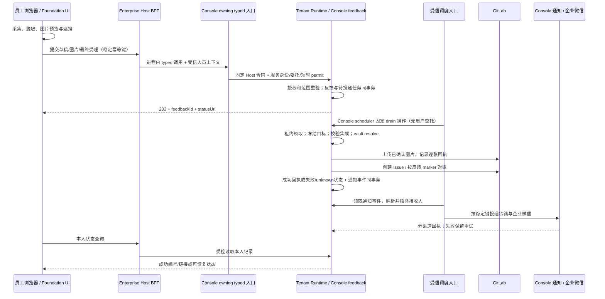

# 全局「反馈问题/需求」设计

状态：已批准（2026-10-07）。实现与环境上线分别验收。基线：`origin/feat/adr018-enterprise-integration`（`fee2ee84`），核查日期：2026-10-07。适用范围：Enterprise Host 全局入口、Foundation 共享组件、Console 反馈领域与 GitLab 集成；既有 WebDev 开发工作台保持独立。

用户裁定：目标项目固定为 `huizhi-yun/huizhiyun`；Issue 默认显示提交人姓名；先实施 G0+G1（文本反馈与管理员企业微信/铃铛通知），再实施 G2+G3（图片与截图）。图片批开始前，由用户/管理员启用 GitLab「Require authentication to view media files」，代理提供准确设置路径与验证步骤。生产 DDL、Platform manifest 发布与 test 重签、真实 GitLab 测试写入另行批准。

## 1. 已批准的边界决策

员工从右上角「反馈问题/需求」图标打开弹窗，填写问题、需求或建议；可附诊断信息与经过预览、遮挡的图片。提交先在本租户可靠受理，再由 Console 受控集成在指定 GitLab 项目创建 Issue，成功后显示 `项目名 #IID` 和链接。员工不需要 GitLab Token，也不需要 WebDev 开发权限。

| 决策 | 推荐方案与理由 |
| --- | --- |
| 领域归属 | Console 拥有反馈受理、本人记录、目标配置与投递回执；Foundation 提供 UI/采集/脱敏工具；GitLab 是研发处理工作项的事实源。反馈不是自动开发任务，不自动触发 WebDev claim/Agent。 |
| 复用方式 | 演进 `useIssueReporter` / `IssueReporter`，保留旧消费者兼容边界；抽取 Console GitLab HTTP、配置/vault 与审计内核，新增反馈专用 typed 操作。不能直接把 Aims 的 `issue-upsert` 改名使用。 |
| GitLab 写权限 | 保留创建反馈 Issue、上传已确认图片及限定对账读取；仓库 `commit/resolve-actions` 继续禁用。实际 Token 可能仍具有较宽 API scope，必须同时以固定操作、项目绑定和最小项目角色限制使用。 |
| 截图 | 默认「自动截图当前页」用本地 DOM 栅格化，仅当前可视区域；截图前提示范围，生成后必须预览、可涂抹，再确认附带。手工粘贴/上传为稳定基础，浏览器原生屏幕捕获只作显式可选后备。 |
| 可见性 | 员工只能查看本人反馈；本租户反馈管理员可查看租户内记录。GitLab 项目权限独立，不因员工能提交就给其仓库权限。 |
| 管理员通知 | GitLab 创建成功及失败均生成持久事件，复用现有站内铃铛与企业微信链路；接收人按人员/角色配置，默认系统管理员；通知失败不改变建单结果。 |
| 可靠性 | 本地事务受理 + 持久投递步骤 + 幂等请求摘要 + 租约；上游结果不确定时先对账，不能把超时直接当失败后重复创建。 |
| 迁移 | 新入口只走 GitLab 链路；旧 WebDev 记录保留原身份、编号与处理流程。禁止同时双写两套收件箱。 |

本方案确定产品和技术方向；目标 `integrationCode`、项目 ID、标签映射、保留期和目标 GitLab 版本在实施准备批核验，不读取或导出生产凭据。方案批准不等于批准生产 DDL、策略发布、项目权限调整或真实外部 Issue/图片写入。

## 2. 仓库现状与可复用资产

以下是源码事实，不代表生产部署状态已现场验证。本次未访问生产库、修改进程或读取 secret/config 文件。

| 已有实现 | 核查结论 | 新方案处理 |
| --- | --- | --- |
| [useIssueReporter](../foundation/app/composables/useIssueReporter.ts) | 采集 URL/路由/UA/环境及最近错误；20 条内存缓冲、单条截断 500 字符，提交最近 10 条；默认 `/api/webdev-report/issues`。`appVersion` 只有类型声明，采集未实际填充。URL 去 query/hash；主要只正则遮盖邮箱、手机号、身份证，`at` 未同等处理；无错误 TTL、账号切换清空及主动附带选择。 | 保留公开入口，补诊断白名单、TTL/身份边界、可勾选/预览、幂等和 transport。旧脱敏不足以直接用于全局上报。 |
| [IssueReporter.vue](../foundation/app/components/IssueReporter.vue) | 已有弹窗、三类旧枚举 `bug/feature/question`、高/中/低、当前页/应用范围、「我已提报」、401 刷新后重试；`floating=false` 可由工具栏控制。打开会清空草稿，提交时自动附上下文。无图片、截图、遮挡。 | 改为新枚举和表单语义；失败保留内容，取消时明确是否丢弃；成功界面保留 Issue 回执。 |
| [采集插件](../foundation/app/plugins/issue-console-capture.client.ts)、[反馈开关](../foundation/app/composables/useFeedbackReporter.ts) | 插件安装全局错误捕获；开关读取 `feedback.reporter.enabled`，读取失败兜底启用。 | 入口可显示，但服务配置/授权未知时禁止提交并显示重试，不用“默认启用”替代服务端授权。 |
| [共享提交路由](../foundation/server/api/webdev-report/issues.post.ts)、[WebDev adapter](../foundation/server/utils/webdevReport.ts) | 由会话派生 reporter，签服务 Token 转发 WebDev；服务端可另发企业微信提醒。旧代理会将部分上游 401/403 改写为 502。 | 新链路保留身份派生原则，收敛错误语义；将 best-effort 通知升级为持久事件，明确新的接收人/角色配置，不将浏览器身份字段作为凭据。 |
| [WebDev intake](../webdev/server/api/webdev/issues/intake.post.ts)、[原设计](../webdev/docs/WebDev-Issue-Inbox-Design.md) | 落 `webdev_issues`，可能按规则自动领取并建 Agent job；旧设计提及截图但也明确待补。`fingerprint` 字段存在，不等于已实现提交幂等。 | 不让普通反馈创建开发任务；旧记录只读入口/原处理入口分离，禁止批量重投到 GitLab。 |
| [WebDev 附件路由](../webdev/server/api/webdev/attachments.post.ts) | 要求 `webdev_workspace:execute`，转交 Dev Agent；有数量/字节限制，但不是 GitLab 上传或全员反馈附件合同。 | 可参考交互，不能给全员 WebDev 权限或直接复用其存储通道。 |
| [Foundation Git adapter](../foundation/server/utils/gitIntegration.ts)、[Console GitLab Runtime](../data-runtime/internal/apps/console/gitlab_operations.go) | 按 `integrationCode`（默认 `gitlab.default`）加载 active integration 及其绑定 vault 凭据，只在 Runtime 解析 Token；复核 `integrationCodes + operations` 并记录 vault resolve。现有 `issue-upsert` 使用 `hzy-aims:item-key`，可修改/重开已绑定 Issue，检索仅单页 100 条。 | 复用凭据解析/HTTP/审计，不复用 Aims 命名空间、更新权限或单页检索作为可靠去重证明。新增反馈专属创建、上传、精确对账；不得赋予任意 IID 修改能力。 |
| [Runtime 路由](../data-runtime/internal/server/server.go) | `issue-upsert` 要求 `Idempotency-Key` 非空，但这段路由没有把该键传入 `ExecuteServiceGitLabOperation`；当前 marker 搜索不是原子 exactly-once 保证。 | 新反馈必须有自己的持久 receipt/outbox，不宣称沿用现有请求头即可解决重复 Issue。 |
| [v2.35 grant 收敛](../console/docs/sql/Console-SQL-Seed-v2.35-gitlab-repository-read-only-candidate.sql) | 仅撤回 `gitlab.commit/resolve-actions`，明确保留 `gitlab.issue-upsert`。对应提交 `631e81cc`。 | 与用户要求保留 Issue 写入一致；不能为反馈恢复仓库内容写能力。 |
| 全局挂载 | `LayoutSidebar.vue` 和 Console Shell 挂载旧组件；当前 Enterprise 自有 `app/layouts/default.vue` 未挂载它。Shell 来源修复见提交 `670f5a28`。 | Enterprise 顶栏只挂一次；避免页内旧浮动按钮与新顶栏重复出现，iframe 不分别弹窗。 |

能力文档存在历史描述，例如 [Foundation 能力清单](FOUNDATION_CAPABILITIES.md) 的 Git adapter 表仍提及 `createGitCommit()`；以当前源码及 [MODULE_CONTRACTS](MODULE_CONTRACTS.md) 的“仓库内容只读”结论为准。实施时同步修正文档，不借本次设计恢复旧通路。

## 3. 用户流程与 UI 线框

### 3.1 入口与字段

已登录 Host 顶栏铃铛附近放一个图标按钮，悬浮/无障碍名称均为「反馈问题/需求」。手机同样显示图标，弹窗占满可用宽度；标题栏/提交栏固定，中间内容滚动。基础表单保持单步，诊断和附件详情折叠，不另建普通员工工单后台。

| 字段 | 默认及约束（建议值，实施时可调整） |
| --- | --- |
| 类型 | 「问题」`bug` / 「需求」`feature` / 「建议」`suggestion`，默认问题。旧 `question` 保留历史显示为咨询，不默认为建议。 |
| 标题 | 必填，1–160 字；提示描述“在哪一步发生什么”。 |
| 描述 | 必填，最多 10,000 字；问题提示实际/预期/复现步骤，需求提示目标/使用场景。首版按纯文本处理。 |
| 严重度/优先级 | 问题显示「影响程度」低/中/高/阻断；需求和建议显示「期望优先级」低/中/高。默认中，只提交一组有效字段；不等于研发承诺或正式排期。 |
| 页面 URL | 自动取打开弹窗时的页面，允许编辑；默认删 query/hash。仅支持本租户登记的可信入口或相对路径，可留空；不得接受 URL 凭据、危险协议或用它发起服务端抓取。 |
| 附加诊断 | 两个独立且默认不勾选的选项：「附带浏览器和应用版本」「附带最近错误摘要」；点击可先看完整发送内容。无错误时显示 0 条，不编造版本。 |
| 用户/租户/时间 | 显示当前身份和租户名称、服务端接收时间说明；服务端必须记录 UID/tenant/receivedAt 用于授权与回执，这些不是可伪造的表单字段。外发身份另见 §8。 |
| 图片 | 粘贴、上传、自动截图；每张都经预览/遮挡确认后加入待提交列表。建议最多 5 张、每张处理后 5 MiB、合计 15 MiB。 |

浏览器型号/版本从 UA 或可用 UA Client Hints 粗粒度解析，不采集高熵设备指纹；应用版本来自可信构建标识，无法取得则为“未知”。客户端发生时间只是提示，服务端 UTC 接收时间为记录事实。

### 3.2 弹窗及确认界面

```text
顶栏                    [反馈图标] [铃铛] [用户 ▾]
┌ 反馈问题/需求 ─────────────────────────── [×] ┐
│ 类型 [问题 ▾]                 影响程度 [中 ▾] │
│ 标题 * [___________________________________] │
│ 描述 *                                       │
│ [发生了什么？期望什么？如何复现？           ] │
│ [__________________________________________] │
│ 页面 [https://aidcp.wiztek.cn/…             ] │
│ 图片 [粘贴或上传] [自动截图当前页]            │
│ [预览1 · 遮挡 · 移除] [预览2 · 遮挡 · 移除]   │
│ □ 附带浏览器和应用版本              [预览]   │
│ □ 附带最近错误摘要（2 条）           [预览]   │
│ 提交身份：张某 · 示例企业                     │
│ 发送到：研发反馈项目；仅发送本次确认的内容    │
├─────────────────────────────────────────────┤
│ [我的反馈]                         [提交反馈] │
└─────────────────────────────────────────────┘

┌ 图片预览与遮挡 ──────────────────────────────┐
│ 仅发送处理后的图片，请遮挡个人及业务敏感内容 │
│ [裁剪] [实色涂抹/矩形遮挡] [撤销] [重置]      │
│                 图片预览                     │
│ [取消这张图片]                   [确认附带]  │
└─────────────────────────────────────────────┘

成功：已创建「研发反馈 #123」 [打开 GitLab] [复制编号]
受理中：反馈 F-xxx 已受理，正在创建 GitLab Issue [查看进度]
结果不确定：已受理，正在核对，请勿重复提交 [查看进度]
```

点击「自动截图当前页」先说明只采集当前可视区域、已知敏感区将遮挡；用户确认采集后暂时收起反馈弹窗并记录当前路由快照，完成后打开图片编辑。截图生成和涂抹都在本机，**「确认附带」仍不上传；最终点击「提交反馈」才发送**。处理期间路由或账号改变则丢弃结果并提示重试。

关闭有内容的弹窗用 `useConfirm()` 确认丢弃；失败保留当前内存草稿和已确认图片。未完成内容不自动写 localStorage。401 重新认证后同一 UID/tenant 才能恢复重试；身份切换立即清空草稿、缓存和 Blob URL。

「我的反馈」在弹窗内显示最近记录，并链接到 `/enterprise/feedback` 分页列表/本人详情；没有 GitLab 项目访问权也能看到本次提交的回执、投递状态。管理员在 Console「反馈管理」查看本租户列表和受控重试，目标配置置于「反馈设置」，不要求员工进入 Console 管理页。

## 4. 数据流与职责边界



- 同进程同租户的 Enterprise→Console 编排使用 Console public typed 入口，遵守 ADR-018a D11，不发服务 Token、不绕 HTTP 自调用。Console 管理前端与 Host 共用 owning 编排。
- Nuxt→Runtime 是跨进程边界：Host 沿用 `console:enterprise-host:execute`，加签名人员委托和短时 permit；Runtime 再检查 current Directory active、对象 UID/tenant、策略期限。独立 Console 使用对应精确 Console Runtime 合同。
- 无用户 worker 走 `console:scheduler:execute` 的固定 feedback 操作表，不能伪造一名员工替代系统通道。worker 已受理任务的投递授权来自受理记录和当前有效集成配置；员工停用不改变已授权受理事实，但后续浏览器访问仍拒绝。管理员可显式取消尚未开始外发的任务。
- Runtime 内 Console feedback→Console GitLab 内核是领域内部 typed 调用，不携内部 JWT 自调固定操作 HTTP。调用参数必须来自受理快照和受控 attachmentId，不能来自任意浏览器 GitLab 请求体。
- 保留独立应用入口时，应用先验证其人员会话，再向 Console Service API 发送精确 `console:feedback:submit` 服务能力和签名委托；不得仅凭 service token 内的应用身份信任 JSON 中的 reporterUid。这条兼容通路在最后一批再开放。
- GitLab base URL、Token 只由 Runtime 根据 integration 配置与 vault 绑定解析。Console BFF/Enterprise/Foundation 浏览器层均不获取原始 GitLab 凭据。

## 5. 目标配置与权限

### 5.1 配置事实源

Console 新增租户级 feedback settings：`enabled`、`integrationCode`、固定 `projectId`、展示名称、类型/影响/优先级标签映射、允许的来源应用、附件/诊断开关与限额、保留期、`recipientUids/recipientRoleCodes`（反馈接收人/角色）、通知设置及配置 revision。`integrationCode` 首选独立 `gitlab.feedback`；经核验也可使用既有 `gitlab.default`，但不得因复用集成自动扩展其调用者或 operation grant。

通知接收设置详见 §7.3，两种渠道默认同时启用；企业微信继续由 Console 既有集成按 integrationCode（通常为 `wecom.default`）解析，浏览器只提交接收人/角色选择，不提交凭据。

保存配置时通过受控项目读取核对 projectId、项目路径、Issue 功能和可见性；允许访问的项目必须在 Runtime integration 的可执行配置边界中登记，不能只写无执行语义的 `scope_json.endpoints`。浏览器不能在提交中覆盖 `integrationCode/projectId/labels/assignee/authorId`。标签由管理员映射，未登记值拒绝，避免自动创建任意 GitLab 标签。

配置 revision 在最终受理时冻结，后台不能把旧反馈静默发送到管理员刚切换的新项目。集成停用/目标撤销则暂停投递；修复后的重试仍使用原目标，改投必须另行明确确认且保留审计，不能在结果不确定时改投另一项目。凭据可正常轮换，任务不保存 Token，只记录使用的凭据版本审计引用。

### 5.2 人员权限（拟新增 Manifest 事实）

| 资源/动作 | 用途 | 默认角色与范围 |
| --- | --- | --- |
| `console:feedback:submit` | 创建本人草稿、上传本人附件、最终提交 | 员工基线显式包含；Directory active 且可登录，排除 `system:*`/服务主体 |
| `console:feedback:view` | 本人列表、详情、回执及附件 | 员工基线 `subject:self`；反馈管理员 `tenant:global` |
| `console:feedback:retry` | 对可安全恢复的任务请求重试/对账 | 反馈管理员显式包含；不允许通过“重试”跳过不确定态 |
| `console:feedback:admin` | 本租户管理查询、未外发任务取消与处置 | 反馈管理员；与 `retry/submit` 不隐式等价 |
| `console:feedback-settings:view/edit` | 查看/设置目标与标签、限额 | 配置管理员；不自动获得 vault reveal/rotate 权限 |

应用角色建议为 `console:feedback_reporter`、`console:feedback_manager`；Platform 企业员工基线组合 reporter，使全员正常登录即可提交，**不要求员工切换角色**。资源/动作/推荐角色只写 Manifest，SQL 初始化据此派生服务 grant。授权模拟模式禁止提交、上传、重试和设置变更。

人员会话/permit、服务通道、integration operation/project allowlist、GitLab Token 角色是四个不同边界；任何一层通过都不能代替其他层。正常运行合并有效授权，保持 permission/scope/来源/有效期同一 grant，不把一个角色的权限和另一个角色的范围拼接。

服务端所有草稿/附件/查询都按 `tenant + reporter_uid` 或明确管理员范围查询。浏览器传入 UID/tenant、其他人的 attachmentId、其他租户反馈 ID 均拒绝。列表不能先取全租户再在浏览器过滤。

### 5.3 GitLab 权限与写能力

现有仓库只读策略保留；反馈专用操作只能上传图片、创建本反馈 Issue 和读取其对账结果。建议项目级专用服务身份，按目标 GitLab 版本实测满足创建/上传所需的最小角色，不为方便直接授予 Maintainer。传统 Token 的 `api` 范围不是“仅创建 Issue”的权限，因此必须叠加受控 Runtime 操作与固定项目约束。[GitLab 项目访问令牌说明](https://docs.gitlab.com/user/project/settings/project_access_tokens/)

GitLab 作者显示集成机器人，不通过 sudo/authorId 冒充员工。描述中的“提交人”由受信 Directory 显示名生成；完整 UID 留本租户审计。回链由登记的租户 public origin + `/enterprise/feedback/{id}` 构造，不取任意 Host Header。

建议每租户独立私有反馈项目。若运营选择多个租户共用支持项目，须单独确认接收团队和数据范围；员工仍只能读取本租户本人回执，不同步任意 Issue 正文/评论，也不为员工批量授予共享项目成员权限。返回 GitLab 链接不保证员工能打开；UI 明示“需要 GitLab 项目权限”，同时保留本站可读回执。

## 6. 接口与数据模型（拟新增）

### 6.1 浏览器/BFF 合同

所有响应 `private, no-store`；写入检查会话、CSRF/同源策略、内容大小及幂等键。Console 管理页保留独立管理入口。

| 方法和路径 | 输入/输出及权限 |
| --- | --- |
| `GET /enterprise/api/feedback/options` | 返回可用状态、类型、限额、目标展示名称、诊断规则版本；不返回 Token、secretRef 或底层连接配置 |
| `POST /enterprise/api/feedback/drafts` | 最终提交按钮触发后创建本人草稿；返回 `feedbackId`；必须 `submit` 和稳定幂等键 |
| `POST /enterprise/api/feedback/{id}/attachments` | multipart，仅发送已确认处理后的图片；服务端解码校验、重编码、摘要与所有权绑定，返回 attachmentId |
| `DELETE /enterprise/api/feedback/{id}/attachments/{attachmentId}` | 仅未受理草稿可移除；需本人身份、幂等键，最终受理后不能修改冻结材料 |
| `POST /enterprise/api/feedback/{id}/submit` | 类型/标题/描述/严重度或优先级/URL/选中诊断/附件 ID/consentVersion；冻结规范化内容与目标；返回 202 受理回执 |
| `GET /enterprise/api/feedback` | 本人真实分页，建议默认 20、最大 50；状态筛选与 total |
| `GET /enterprise/api/feedback/{id}` | 本人详情/投递状态；有 `feedback:view` 租户管理范围的接收人也可受权只读查看，管理写操作仍在 Console；成功含 project displayName、issueIid、issueWebUrl；可短轮询，退到后台停止 |
| `GET /enterprise/api/feedback/{id}/attachments/{attachmentId}` | 对本站保留的净化图片再次鉴权；不提供匿名永久 OSS 地址 |
| `GET /api/v1/console/feedback`、`/{id}` | 管理员租户内分页/详情，无任意 GitLab 代理 |
| `POST /api/v1/console/feedback/{id}/retry`、`/cancel` | 显式 retry/admin；期待 revision、幂等键；只允许合法状态转换 |
| `GET/PATCH /api/v1/console/feedback-settings` | 配置 view/edit；PATCH 带 revision，冲突 409 |

草稿创建→图片上传→受理属于一次用户提交的内部步骤，不要求用户手动保存草稿。无图片时直接完成创建与受理；上传中断时重用 feedbackId 和每张图片键，用户可选择继续或移除未成功图片后重新确认，不悄悄丢图后提交。

Runtime 增加 `/v1/enterprise/console/feedback:{固定操作}`、独立 Console 的对应固定路由及 scheduler `feedback-delivery:{固定操作}`。操作清单、permit canonical、Gateway 精确路由、来源/deployment/audience 必须同步登记；不是 `/feedback/*` 任意通配代理。新增上传合同须用 canonical envelope 绑定文件 SHA-256、长度、MIME、feedbackId、UID/tenant/目标部署及期限，不能沿用仅签 JSON 的 permit 却不覆盖二进制内容。

拟定的内部 GitLab 操作为 `feedback-upload`、`feedback-create-issue`、`feedback-reconcile`，均属于 feedback 专用 typed 入口；不立即开放通用 Service API。若后续确需跨进程暴露，须另登记精确 semantic operation、`integrationCode + projectId` 可执行边界和 grant，不借用 Aims `gitlab.issue-upsert` 权限。

### 6.2 状态与错误

正常链路：`draft → queued → uploading → creating → submitted`。辅助状态：`retry_wait`、`unknown`（上游结果不确定）、`blocked`（配置/授权待修复）、`cancelled`（尚未外发）、`failed`（确定且不可自动恢复）。投递成功与 GitLab 工作项的 opened/closed 分开；首版不把“已送达”显示成“问题已解决”。

| 响应/状态 | 展示与恢复 |
| --- | --- |
| 202 queued/unknown | 已受理，显示本站编号和状态入口；不是“创建成功”，保留同一 feedbackId |
| 200 submitted | 返回并显示 `projectId + issueIid + webUrl`，重复请求返回同一回执 |
| 400/413/415 | 指明字段、大小或格式问题，保留其他已填写内容；不输出上游响应原文 |
| 401 | 登录过期；同一身份恢复后按原键查回执再重试 |
| 403 | 人员权限/租户/对象范围不足；不包装为普通网络故障，不自动重试 |
| 409 | 同键异内容、配置/草稿 revision 冲突；重新确认后生成新意图键；不得换键重复投未知结果 |
| 429 | 用户/租户额度限制，返回 Retry-After；服务端跨实例计数 |
| 503 | 本地授权/Runtime/集成依赖不可用。若尚未受理可原键重试；已受理则查询/等待后台，不重新建单 |

GitLab 401/403 发生在后台时记录 `blocked` 和脱敏错误码，用户文案为“已受理，目标集成需要管理员处理”，不能误导员工重新登录解决 GitLab 凭据问题。

### 6.3 Console 拥有的持久事实

| 拟新增表 | 关键字段/约束 |
| --- | --- |
| `console_feedback_settings` | tenant 主键，配置 revision、integrationCode、projectId、标签映射、接收人/角色、企业微信 integrationCode、限额和保留策略；无凭据明文 |
| `console_feedback` | tenant+UUID 主键、reporterUid、类型/内容、脱敏 URL/诊断与同意版本、receivedAt、sourceRoute、目标快照、payloadHash、状态/revision、GitLab projectId/IID/webUrl、脱敏失败码 |
| `console_feedback_attachments` | tenant+attachmentId，feedbackId/reporterUid，私有对象键、处理后 SHA-256/大小/MIME、confirmedAt、GitLab 上传回执、保留期限；禁止原始截图持久化 |
| `console_feedback_events` | tenant+feedbackId+eventType+generation 唯一；成功/失败/待核对通知意图、脱敏通知摘要、接收规则快照、接收人解析状态；与反馈状态同事务 |
| `console_feedback_delivery` | GitLab 步骤按 tenant+feedbackId+步骤/attachmentId 唯一；通知步骤按 tenant+eventId+recipientUid+channel 唯一；稳定 operationKey、请求摘要、lease/fencing、attempts、nextAttemptAt、逐渠道回执与不确定证据 |

受理和待投递任务在本地同一事务提交；复用 Console mutation receipts/operation logs，不把外部 HTTP 调用放进长数据库事务。最终 `tenant + reporterUid + clientIntentKey` 唯一；GitLab `integrationCode + projectId + IID` 的绑定不得对应两条反馈。草稿附件必须全部属于当前人和当前反馈，受理后冻结。

图片内容使用本租户私有对象存储的反馈专用前缀，复用受控存储 adapter、生命周期清理；Nuxt 不新增 DB/OSS secret。若现有 adapter 无法提供对象范围、限额和安全下载，实施中必须先补合同，不能用公共 bucket 或 Dev Agent 临时目录替代。

## 7. GitLab 投递、幂等与图片一致性

首版使用成熟的 REST Issue 路径创建普通 Issue 类型工作项，避免依赖尚未验证的 GitLab 新 Work Items GraphQL 能力。目标 GitLab 版本/功能在准备批实测；不假定当前官方最新版等于本地部署版本。[Issues API](https://docs.gitlab.com/api/issues/)

服务端调用 `POST /api/v4/projects/{projectId}/uploads`，逐张记录返回的上传路径；再 `POST /api/v4/projects/{projectId}/issues` 创建工作项。返回的 `iid` 是项目内编号，必须和 projectId 一起保存。只接受当前集成 origin 与项目下的合法上传路径/Issue URL，不原样信任上游返回的任意链接。[Markdown uploads API](https://docs.gitlab.com/api/project_markdown_uploads/)

Issue 内容由服务端模板生成：类型、员工建议的影响/优先级、描述、净化页面 URL、经确认的诊断、图片和本站反馈回链。显示名/租户展示名由受信身份导出；不放邮箱、手机号、完整 UID 或内部部署地址。用户文本按纯文本转义，禁用原始 HTML、远程图片、GitLab quick actions、`@all` 等可触发副作用的内容；用户不能在正文注入系统 marker 或改写标签/指派。

### 7.1 确定性与结果不确定

1. 草稿、附件和最终提交分别使用稳定意图键；同键同摘要返回当前事实，同键异摘要 409。网络重试不换键；规范化 payloadHash 包含净化内容、诊断选择、附件 SHA 和冻结目标 revision。
2. 后台按反馈/步骤加租约，并用 fencing 防止旧 worker 写回新领取结果。单次外部调用的 deadline 小于租约且预留回写时间；发起前持久记录 dispatch intent。
3. 新 marker 为 `<!-- hzy-feedback:v1:<opaque-key> -->`，其中 opaque-key 由租户和反馈 ID 的不可逆稳定派生值组成。保留本地绑定账本，不能复用 `hzy-aims:item-key` 或仅用标题查重。
4. GitLab 创建返回成功后，持久写 IID/URL，再确认步骤完成。响应丢失、连接断开、worker 崩溃或收到无法判断是否已创建的 5xx，进入 `unknown`，下一 worker 只能对账，不能重新 POST。
5. 对账限定冻结项目，检索并逐条精确核对 marker；按分页完整扫描候选。搜索索引延迟、权限不足、达到扫描上限都不是“确定不存在”。发现一条则补回执；多条则管理员处理重复；零条仍不能仅凭一次搜索重建。
6. 无法证明未执行的任务保持待核对，由管理员在 GitLab 确认结果并绑定已有 IID，或经明确确认后重新投递；这些处置须作为额外管理合同验收。首版不承诺跨本地 DB 与 GitLab 的严格 exactly-once。

现有 `issue-upsert` 请求头检查和单页 marker 搜索不能替代上述机制。Lease/fencing 只能防本地并发回写，不能撤回 GitLab 已接收的请求。

### 7.2 图片部分成功

- 已确认图片在本地受理前可重传同摘要，不重复建立附件；不同处理结果视为新附件。
- 每张 GitLab 上传独立步骤。上传成功、建 Issue 失败时复用已有上传回执，不能再次全量上传；只有所有选中图片准备好才创建含完整图片的 Issue。
- 上传结果丢失也标记 unknown；使用本地步骤 key 派生安全文件名，按已验证的 GitLab 上传查询能力核对；版本/权限不支持查询时转人工核对，不能假设 `/uploads` 接受通用幂等键。
- 管理员/用户选择放弃图片必须形成新确认内容且明确旧上传处置。取消本地反馈不自动等于删除 GitLab 文件；上传孤儿按专用清理流程登记和删除，删除权限与正常创建凭据分离。
- 建 Issue 返回错误后不得留下“成功”Toast；关闭浏览器不影响已受理任务。重试退避、限次并保留失败原因；配置错误不进行高频自动重试。

### 7.3 管理员企业微信与铃铛通知（本次追加必需项）

**触发语义：**用户“提交成功”指 GitLab Issue 已创建并有回执；202 仅为可靠受理。创建成功生成 `console.feedback.created`；GitLab 上传/创建第一次确定失败（包括等待自动重试）生成 `console.feedback.delivery_failed`；上游结果不确定生成 `console.feedback.delivery_unknown`，文案为“待核对”而非“创建失败”。这三个事件与相应反馈状态、回执在同一事务落库，浏览器离开也不丢通知。未通过本地校验的 400/401/403 不发管理员通知，避免错误输入制造告警。

**接收规则：**“反馈接收人/角色”支持显式员工 UID 和企业角色 code，取并集并去重；未自定义时选择租户的系统管理员企业角色。`system_admin` 是既有默认候选 code，实际有效角色与成员由 Console 策略/Directory 解析，不把代码字符串当超级权限。通过既有 role-holders / subject-eligibility 能力解析当前有效人员；同进程调用 owning helper，跨进程才使用既有精确能力。不能直接挪用为项目治理固定 purpose 设计的 helper 而放宽其白名单，应登记 feedback 专用用途。

所有接收者均须当前 Directory active，且有本租户 `console:feedback:view` 的管理范围；仅有同名角色而无权限不能收到标题等内容。实施时将默认系统管理员对应的反馈管理权限显式登记到 Manifest/Platform 映射。配置 UI 预览有效收件人数量，不能保存到任意企业微信账号或 `@all`。

事件记录接收规则版本，worker 首次解析后冻结 UID 集合，领取每个渠道任务时复验资格；离职/撤权者不再发送。不自动补发历史事件给新上任管理员。无有效收件人、缺企业微信映射或角色服务不可用时保留待处理通知并在 Console 反馈管理/集成健康中显示原因，不假装投递完成。两个渠道的收件人业务范围相同，企业微信身份映射复用既有集成目录。

**内容模板：**

```text
【新反馈 #123】[问题] 文档保存失败
提交人：张某
页面：https://aidcp.wiztek.cn/codocs/…（脱敏后的 URL）
GitLab：https://gitlab.example/feedback/project/-/issues/123
[查看反馈]

【反馈投递失败 F-xxx】[需求] 希望增加导出
提交人：李某
页面：https://aidcp.wiztek.cn/enterprise/…
GitLab：尚未创建
状态：已保留待重试记录；目标集成需要管理员处理
[查看反馈并处理]
```

标题、类型、提交人、页面与 GitLab 链接均取受理快照/受信回执，标题与姓名再次脱敏、控制长度；不包含截图、正文、控制台错误、栈、Token、内部地址或任意原始失败响应。错误通知在已知 Issue 创建成功而后续步骤失败时可以带已验证的 Issue 链接；未知结果不得编造编号或链接。

外部通知的主要 action URL 指向可受权查看的反馈详情，使用 **deployment public URL 的绝对地址**：`{trustedPublicOrigin}/enterprise/feedback/{id}`。页面 URL 和 GitLab URL 同样必须是校验后的 HTTPS 绝对地址；前者属于登记的租户入口，后者属于配置的 GitLab origin/项目。复用 [Foundation notify](../foundation/server/utils/notify.ts) 的 `resolveExternalNotificationActionUrl/externalNotificationActionUrl`，不得由请求 Host、内部 Console URL 或浏览器回传 origin 拼接。public URL 缺失时保留外发待重试，不能发送失效相对链接；铃铛可使用同站受控相对路由。

**投递复用与恢复：**Console 通过既有 typed notification publisher 写站内铃铛，企业微信继续走 Foundation 通知编排及现有 Connector/Notification Runtime 集成，不自行调用企业微信裸 HTTP，也不生成第二套 Token 配置。[旧 feedbackNotify](../foundation/server/utils/feedbackNotify.ts) 可复用文案组织思路；其 catch 后忽略失败的调用方式不再用于新链路。

现有 `sendNotification/orchestrateNotificationDelivery` 先持久写铃铛，再发外部通道，并通过 `NotificationDeliveryError.result` 保留两者状态。新通知 worker 必须把分渠道结果写回持久步骤：铃铛已成功、企业微信失败时，重试同一通知意图与稳定键，铃铛幂等返回旧回执，外部通道仅重试未完成投递。若新增分渠道 helper，应复用现有底层调用与回执校验；不能吞掉外部错误后把事件 ack 为完成。

通知键由 `tenant + feedbackId + eventType + generation + uid + channel` 派生有界摘要，不放姓名/标题。一次连续失败周期只发一条失败/待核对提醒，不按每次自动重试重复广播；失败后 GitLab 创建成功发送独立成功事件并关联同一反馈。明确创建失败的通知不删除、覆盖或完成 GitLab 待重试步骤。通知自身失败只重试通知，**绝不重新创建 GitLab Issue**。

管理员详情入口及通知详情注册 feedback 来源/用途，点击时重新检查当前反馈管理权限；历史通知或 GitLab 链接不授予访问权。没有 GitLab 权限时管理员仍可打开本站回执检查集成错误。企业微信不可用时铃铛可先成功，UI 显示各渠道 pending/failed/delivered，并可在恢复后续投。

上线需一并核验 Console 通知发布、当前部署使用的外部通知 Runtime scope、role-holders/subject-eligibility 能力及 worker 双 audience grant。测试环境沿用 `notifyRedirectTo` 与禁止本地外发保护，真实双渠道测试须使用获批收件人；本设计不触发实际通知。

## 8. 截图与隐私设计

### 8.1 技术选型

| 方式 | 优点 | 限制与采用方式 |
| --- | --- | --- |
| 粘贴/上传 | 员工熟悉、移动端可用，不依赖页面渲染 | 可能含其他应用信息，仍强制预览/遮挡；只在弹窗焦点下处理显式 paste，不后台读剪贴板 |
| html2canvas | 本地按 DOM 生成图片，可在 clone 中遮挡指定区域；适合当前 Host 页面 | 不是浏览器真实截图，CSS/跨域资源/canvas/iframe 可能缺失；首选增强方案，动态加载、自托管依赖，不为补全资源开放截图代理。参考 [工作原理与限制](https://html2canvas.hertzen.com/documentation) |
| 原生 `getDisplayMedia()` | 捕获浏览器实际渲染，复杂内容保真较好 | 需安全上下文、用户手势且每次授权；不能静默指定来源，可能选到其他窗口。仅作为“选择标签页截图”后备，不称为无提示自动截图；取得一帧后立即 stop 全部 tracks，不采音频。参考 [MDN](https://developer.mozilla.org/en-US/docs/Web/API/MediaDevices/getDisplayMedia) |
| 服务端无头浏览器 | 可集中生成截图 | 需要登录态/会话，无法保证重现员工未保存内容，扩大数据面；本方案不采用 |

html2canvas 配置采用 `onclone/ignoreElements` 或 `data-html2canvas-ignore` 屏蔽反馈 UI、通知面板、用户菜单及敏感区，`logging=false`、`allowTaint=false`、不配置任意资源 proxy；跨域图片仅在现有合法 CORS 条件允许时渲染，否则占位。限制输出像素和超时，取消后释放 clone/canvas/Blob。[配置说明](https://html2canvas.hertzen.com/configuration)

不得承诺“自动遮挡已消除所有敏感信息”：DOM 标记可能遗漏，原生捕获更无法依赖 DOM 遮挡覆盖所有来源。保留逐图人工预览确认；自动捕获失败时仍可正常提交文本或手工截图，不能卡住主流程。

### 8.2 脱敏规则与同意

- **采集前控制**：密码输入、凭据保险箱、Token/密钥展示页等默认禁止自动截图；业务可用统一 `data-feedback-private` 标记敏感容器。图片只截当前可视区域，不自动滚动全页、不展开折叠内容、不获取隐藏 DOM 文本。
- **错误摘要**：仅当前 tenant/UID 会话内最近 5 分钟的 error/unhandledrejection，最多 10 条、每条 500 字符、总量建议 8 KiB。采集入缓冲时即脱敏，不保留原始对象/请求体。提交时仅发送用户勾选的文本，再由服务端二次规范化。
- **脱敏内容**：Token/Bearer/JWT/API key、Cookie/Authorization、密码、连接串、签名 URL 参数、邮箱/电话/身份证及明显账号字段；message、source/stack、URL 均使用同一规则。仅正则不能保证检测全部商业敏感内容，所以必须可预览、移除，默认不附带错误。
- **URL**：先移除 query/hash；对路径内邮件、外部标识和敏感对象段按登记路由规则遮挡。员工可编辑净化 URL，最终预览即实际发送版本。原始 URL 不落日志、不进入指纹。
- **身份**：本地必需审计字段不能取消；外发描述默认仅展示提交人显示名、租户展示名及受控回链，可配置为部门/化名。确认区明示哪些身份字段会发送。用户/租户/接收时间由服务端派生；客户端填写的版本、浏览器和发生时间标记为诊断线索。
- **图片**：实色不透明遮挡或裁剪，禁止把模糊当作不可恢复遮挡。确认后导出扁平化新图片并丢弃原图、编辑历史和可逆遮挡层；服务端重编码去 EXIF/元数据。首版仅 PNG/JPEG/静态 WebP，拒绝 SVG、HTML、动画和伪造 MIME；限制尺寸/解码像素，防解压炸弹。
- **日志**：访问日志仅记 requestId、feedbackId、状态、大小和耗时，不记描述、错误原文、图片、Token 或签名 URL；错误响应只输出稳定分类和追踪号。
- **留存建议**：未受理草稿及临时图片 24 小时清理；已成功外发的本地图片缓存 7 天后清理，保留回执；失败/unknown 图片最长 30 天并提前提示管理员，过期后标记需补材料，不能再声称可自动重试。反馈正文/审计建议 180 天，最终保留策略由租户确认。以上均为候选策略，不是已上线承诺。

### 8.3 GitLab 图片访问是独立上线门槛

**私有项目不自动保证图片 URL 私密。** GitLab 官方说明：默认图片可凭上传 URL 访问，需要启用“Require authentication to view media files”才能要求图片访问鉴权；confidential Issue 也不能替代项目/媒体访问设置。[GitLab 上传文件安全说明](https://docs.gitlab.com/security/user_file_uploads/)

因此上线图片前必须核验私有目标项目、媒体鉴权和未经认证直接访问测试。若部署版本无法满足，不向该项目上传图片，保留文本反馈并明示附件暂不可用；不能以随机长 URL 代替访问控制。配置定期/投递前复核失效时暂停图片任务。

GitLab 中的图片与描述有独立保留期、备份和管理员权限。删除本站记录或到期清理对象存储不代表 GitLab 副本已删除；误传处置必须包含删除 GitLab 上传、修订 Issue、检查通知邮件等传播范围，并记录处理结果。不给普通员工或常规反馈 worker 增加全项目删除能力。

## 9. 与已有 useIssueReporter / WebDev 的迁移关系

1. 复用名称和单一 UI 组件，扩展为明确 transport contract：`options → createDraft → upload → submit → getReceipt → listMine`。Foundation 不持有 Console/GitLab 业务事实，拥有方注入本地固定 BFF；浏览器不能通过参数任选 external base URL 或 transport。
2. 旧 `targetBasePath/targetPageUrl/targetRoutePattern` 只在旧 Shell 可信应用目录校验后兼容；Enterprise 直接按当前 Host 路由识别来源模块，不能信任任意客户端 appCode 获得权限。
3. 旧 `/api/webdev-report/issues` 在未迁移应用中暂时继续服务 WebDev；新 Host 显式挂新 API，失败不会 fallback 到 WebDev。旧枚举和状态单独适配显示，不把 WebDev “修复中”伪装成 GitLab “创建中”。
4. 迁移按入口/应用配置一次性切换，保存记录的 transport 与外部引用。请求超时后先向原 transport 查回执；禁止故障期间切换通道重投同一内容。
5. WebDev 历史 Issue 不批量迁移、不触发再领取。需要研发自动化时由 GitLab/WebDev 管理员另行明确接入，不能把全员反馈作为 Agent 自动执行指令。
6. 退役旧路由前核对 Shell、独立应用、外部消费者和旧 service grant 签发；全部迁移后按合同返回 410 或删除。旧查询可保留受权只读访问，旧写 grant 逐项撤销。任何回退必须先停止新提交，处理在途任务，不能重放已送达 GitLab 的记录。
7. 旧 `feedback.reporter.enabled` 可作为迁移期总开关，但新目标是否就绪以服务端 settings/授权检查为准。旧 `feedback.notify.wecomUsers` 仅作为迁移参考，由管理员确认后转换为新的“反馈接收人/角色”设置；默认系统管理员。成功和失败通知随 G1 交付，按 §7.3 持久投递，不自动广播正文或敏感诊断。

## 10. 分批实施与验收

各批交付以可独立审阅的合同和验收证据为界；不按未经核实的日期承诺。G0 完成后可并行准备文案/组件，但真实投递必须等 G1 授权和持久合同通过。

| 批次 | 范围与成本判断 | 新合同/schema/页面 | 关键验收 |
| --- | --- | --- | --- |
| G0：版本与边界核查 | 小；确定真实目标、部署 GitLab 版本、可用 API/最小角色、私有媒体访问策略、现有 storage/worker 可复用范围 | 定稿 Manifest/permit/目标配置/保留期；只读核查清单及真实 test 写入待批项 | 不读出 Token；列出 token/grant/code 三层权限差异；选定 test 专用项目；区分已核实与待批准 |
| G1：可靠文本反馈 | 中高；顶栏弹窗、三类表单、可选诊断、目标/标签配置、本人回执与管理员列表、可靠 GitLab 创建/对账、成功/失败管理员双渠道通知 | feedback/settings/events/delivery 表、Console typed/BFF/Runtime、固定 GitLab feedback 操作、Manifest/角色、worker seed/verify、管理设置与列表 | 受理事务、稳定键、403/503/409/429、真实分页；丢回执/超时/并发只核对不盲重建；错误摘要脱敏且可不附带；GitLab #IID/链接返回；管理员铃铛/企业微信成功与失败事件、绝对回链、接收人去重/权限/投递重试；无 WebDev 自动 job |
| G2：图片提交闭环 | 高；粘贴/上传、预览/实色遮挡、私有暂存、GitLab uploads、部分失败/孤儿清理 | attachments 表、流式上传/摘要签名 permit、受控下载/清理、图片编辑器 | 未确认零上传；最终图片不可恢复遮挡；跨用户附件拒绝；MIME/尺寸/EXIF；图片成功建单失败与未知上传对账；匿名 GitLab 图片访问必须拒绝 |
| G3：自动截图与移动适配 | 中；本地 html2canvas 当前视口，原生截图后备与降级 | lazy capture adapter、敏感标记、截图确认/编辑 UI；无新业务表 | 1440/390；长页不全页采集、弹窗不入图、敏感区遮挡、跨域/iframe 占位、canvas/CORS失败降级；原生 tracks 全关闭；手机不支持仍可粘贴/上传/文本提交 |
| G4：旧入口收敛 | 中；Shell/独立应用适配、新旧记录入口和旧写路径退役 | 需要时新增跨进程 `console:feedback:submit` 合同，明确双 audience grant；更新 Foundation 能力/模块合同/退役清单 | 消费者核查、旧 grant 零签发证据、无双按钮/双写、身份与租户切换缓存清空、历史 WebDev 记录仍可处理 |

首个可上线范围为 G1 的文本反馈；用户本次要求的完整图片和自动截图能力须 G2/G3 完成后才可称为全部实现。GitLab 处理状态同步、评论往返、Agent 自动修复不属于本轮必需功能，后续可另立合同。

### 10.1 横向验证矩阵

- **授权**：匿名、停用用户、保留主体、全员基线、合并角色、自定义角色、模拟隔离、admin 不蕴含 submit/retry、本人/管理员范围、跨 tenant/deployment、过期策略与依赖故障。
- **服务与 permit**：缺 capability、错来源/audience/目标部署、入站 Token 不转发、撤销服务凭据、上传二进制摘要篡改、错反馈/附件、TS/Go canonical 金向量。
- **集成**：假 GitLab HTTP 服务覆盖上传/创建/读取、429/超时/5xx/Token 过期、issue 已创建但响应丢失、上传响应丢失、marker 冲突/多个命中/分页/索引延迟；确认没有任何 repository write 请求。
- **通知**：默认系统管理员、显式人员与角色并集去重及管理权限过滤、停用/撤权、无接收人、角色服务 503；GitLab 成功/失败/unknown 均产生相应耐久事件；铃铛成功企业微信失败、ack 丢失、重复调度只重试未完成渠道；通知不能触发重新建 Issue；外链固定 public origin、通知无图片/诊断；失败后恢复成功发送独立完成事件。
- **MySQL**：隔离可丢弃实例验证 migration 重入、schema manifest、receipt 唯一、并发受理、lease/fencing、逐步回执、配置 revision、清理与 FK；不连接 hzy0 统一库。
- **隐私/UI**：脱敏夹具包含正文/栈/URL 的 secret、PII、签名参数；截图/错误不勾选时网络请求中不存在；身份切换清空；1440/390、键盘焦点、关闭草稿、错误保留、图片取消与流释放。
- **环境验收**：获批 test 专用项目真实创建/上传并回读编号、标签、图片与回链；核验匿名媒体访问拒绝；所需 Runtime `data-runtime/tenant-runtime` 双 audience grant 及精确 semantic/project 边界均实际签发验证。没有环境证据只可报告代码候选完成。

### 10.2 发布批准点与回退

实施交付应把以下动作逐项列为“未申请/待批准/已批准待执行/已执行有证据”：Manifest 发布和员工基线映射、test 重签、schema/对象存储策略安装、服务 grant seed、GitLab 目标/机器人角色/媒体设置变更、test 真实写入、生产 DDL、生产开关与首条真实反馈。用户批准设计只授权进入下一步实施安排，不自动执行这些环境动作。

发布顺序为 schema 与受控存储→Runtime 合同→配置/策略/grant→BFF/UI→test 验收→生产启用。回退先停止新受理和未开始的外发，再回退入口；保留已受理反馈、图片步骤和 GitLab 回执，不删表、不自动切回 WebDev 重投。已发生的 GitLab 外部写入按独立处置流程处理。

## 13. G0+G1 实施记录

本批只交付文本链路，图片/媒体权限设置与自动截图进入 G2+G3。Console schema v2.41 使用四表：反馈、冻结配置、事件及通道回执。GitLab 建单尝试和租约字段随反馈主记录同事务保存，未另建相同事实的投递表；通知使用独立 delivery 表。

员工入口为 Host 顶栏与 `/enterprise/feedback`，Console 管理入口为 `/admin/feedback`。默认不启用投递；先完成环境授权验证，再配置 `HZY_CONSOLE_FEEDBACK_DELIVERY_ENABLED=true`。普通用户 202 表示“已受理”；只有持久 GitLab 回执才能显示 Issue 编号。默认提交人显示 Directory 姓名。

确定失败需管理员显式重试；结果未知每隔至少 5 分钟对账，零命中不会自动重新创建。G1 不提供强制重发 unknown 的绕过按钮：管理员应先在 GitLab 核对，无法形成明确证据时保留待核对记录。失败通知同一反馈去重一次，恢复成功另发成功事件。

保留期本批固定为草稿 24 小时、已完成本地记录 180 天；未完成投递不清理。图片批之前再实现图片留存与媒体访问验收。生产审批和实际测试证据以本批报告为准。

## 14. 我的反馈列表验收打磨

时间使用 Foundation `formatDateTime`，按浏览器本地时区显示到分钟；类型、优先级与状态采用中文业务标签，已建单显示 `#IID` 链接。列表通过 `useListPage` 保存 URL 筛选/页码，筛选变化回第一页，提供总数和分类空状态。

Host 与 Console 列表 GET 新增可选 `status`、`kind`、`pageSize`（默认 20，范围 1–100）；Runtime 在租户及本人/管理员范围内先筛选，再执行 COUNT 与稳定排序分页。参数进入既有签名 payload，非法枚举拒绝；无新增 schema、manifest、grant 或开关。本改动需要 BFF 与 Runtime 同批更新，不能仅热更新前端后向旧 Runtime 发送新参数。

## 15. G2+G3 实施合同（2026-10-08）

本批基于 G0+G1，图片能力默认关闭。人工媒体访问验证通过后，Runtime 运维配置同时设置 `HZY_CONSOLE_FEEDBACK_MEDIA_ENABLED=true` 与 `HZY_CONSOLE_FEEDBACK_MEDIA_VERIFIED_AT=<UTC RFC3339>`；验证时间最多有效 7 天，过期停止新图片受理/上传，文字反馈不受影响。每次图片投递及建单前再通过 GitLab Projects API 检查固定项目路径、`visibility=private`、`enforce_auth_checks_on_uploads=true`；字段缺失或读取失败均关闭图片链路。管理员不能在浏览器提交中覆盖这些事实。

### 15.1 实现与已批准设计的对应关系

- Foundation 提供图片上传/弹窗内粘贴、预览、裁剪、实色矩形遮挡、最近 5 步撤销。确认后只保留扁平 PNG Blob，销毁原图画布与编辑历史；草稿不进 localStorage。最多 5 张，单张 5 MiB、合计 15 MiB。只有最终点击“提交反馈”才创建草稿、上传已确认图片并受理。
- `html2canvas@1.4.1` 由包管理器固定版本、随本站构建、自托管并动态加载。仅截当前视口，最多 400 万输出像素；屏蔽反馈弹层/遮罩、菜单、`data-feedback-private`、iframe/canvas/video；禁止密码或凭据页面自动采集。Nuxt UI 的现代 CSS 色值在克隆 DOM 内转换为浏览器解析的 RGBA；不能渲染的内容不通过外部代理补全。15 秒超时，晚到结果释放画布。
- 显式“选择标签页截图”使用 `getDisplayMedia({video:true,audio:false})`。这可能捕获其他窗口，不能自动屏蔽其中内容；用户仍须预览和遮挡。取得一帧或失败后停止全部 tracks，视频与画布释放。手机不支持时可继续手工上传或文本提交。
- 私有暂存使用 Console Runtime 的 `console_feedback_attachments` 表（v2.42），图片列为有界 MEDIUMBLOB，无公共对象地址、外部存储配置或 Nuxt 数据库凭据。浏览器→BFF 按流读取并限制 5 MiB，BFF→Runtime 沿既有签名 permit 发送规范 JSON/base64；签名绑定完整字节及 SHA-256，不声称跨进程全链路零拷贝流式处理。
- Runtime 接受 PNG/JPEG，先解析尺寸（单边 8192、总像素 1600 万），再解码、重编码为 PNG，丢弃 EXIF/元数据；拒绝动画、伪造格式和超限数据。浏览器支持静态 WebP 输入，经过编辑器确认后转为 PNG；Runtime 不直接接受 WebP/SVG/HTML。
- 草稿冻结 attachmentIds。每次上传复核活跃身份、本人归属和当前开关；同附件不同摘要、同幂等键不同对象均 409。提交逐一确认全部图片已暂存，不以部分图片成功偷偷提交。读取附件独立执行本人/管理员范围，返回 `private,no-store`，过期为 410。
- GitLab 图片按步骤保存 `uploading/uploaded/failed/unknown` 与上传 ID/路径；上传失败时不建 Issue，明确失败可按原反馈重试，已上传图片不重复传。丢响应/丢回执保留未知状态，不盲目重传。
- 未知上传按生成文件名和服务端规范图片摘要双重对账；多命中拒绝。GitLab 列表只提供上传 ID，不提供原 Markdown 路径，因此找回 ID 只作为处置证据，不伪造图片链接。尚有未知图片意味着从未通过“全部图片就绪”的建单门禁，管理员可取消后清理，再重新提交；未知 Issue POST 仍不可取消。此恢复分支需要人工处置，不承诺自动恢复投递。
- 管理员显式“清理孤儿图片”只处理已取消、无 Issue 回执的反馈及服务端已核验上传 ID。调用前记录操作审计，DELETE 204/404 可重放；未知未对账项返回 409，不宣称清理完成。普通 worker 没有 GitLab DELETE 分支。GitLab Token 需具有该项目上传对账/删除所需角色；缺权保持记录，不扩大 Token 权限。
- 本地图片每轮最多清理 50 条：未提交/已取消 24 小时、成功 7 天、失败/未知 30 天。清理图片不等于删除 GitLab 副本；保留外部回执和未知对账证据。详情显示本地图片是否已清理，不再承诺过期图片可自动重试。沿用 G1 正文留存。

### 15.2 固定接口与权限

| 接口 | 人员动作 | 行为 |
| --- | --- | --- |
| `PUT /enterprise/api/feedback/:id/attachments/:attachmentId` | `feedback:submit`，本人 | 原始 PNG/JPEG 二进制；Idempotency-Key；受控摘要签名；私有暂存 |
| `GET /enterprise/api/feedback/:id/attachments/:attachmentId` | `feedback:view`，本人或管理员范围 | 受控读取；不返回 GitLab Token/存储路径 |
| `GET /api/v1/console/feedback/:id/attachments/:attachmentId` | `feedback:view` | Console 管理读取，同 owning 实现 |
| `POST /api/v1/console/feedback/:id/cleanup-media` | 显式 `feedback:admin`，租户范围 | 仅已取消反馈的孤儿图片处置；原有 admin 定义中的处置操作 |

Runtime 固定操作增加 `attachment-put/attachment-read/cleanup-media`。前两项可走 Enterprise Host，cleanup 仅 Console。复用 `console:enterprise-host:execute`、Console 的精确 `feedback:view/admin` 与既有 scheduler，不新增人员动作或服务 capability；admin 不蕴含 submit/retry。图片不进入管理员铃铛/企业微信正文。

### 15.3 GitLab 媒体门槛：用户操作与匿名验证

这不是实例级 `/admin` 设置。用户/管理员以项目 Maintainer 或 Owner 身份打开：

1. [目标项目 General 设置](https://gitlab.wiztek.cn/huizhi-yun/huizhiyun/edit)。侧栏 **Settings → General**（设置 → 通用）。
2. 展开 **Visibility, project features, permissions**（可见性、项目功能、权限）。
3. 项目可见性确认 **Private**。在 **Project visibility** 区勾选 **Require authentication to view media files**，保存。
4. 若部署版本没有该选项或 API 不返回对应字段，图片投递继续关闭，不以私有项目、confidential Issue 或随机长 URL 替代。

验证使用项目中已有的无敏感测试图片，或在另行批准的 test 写入中由管理员上传合成图片。不能先开反馈图片功能来生成验证素材。

- 在已登录、具有项目访问权的浏览器中打开图片本身的直链，确认 200 且确为预期图片，记录不含凭据的状态证据。
- 新建无痕窗口，确认未登录 GitLab，再直接打开**同一图片 URL**，而不是 Issue 页面。应被要求登录或返回拒绝/404，不得显示图片；同时检查 Network 中图片请求未返回图片字节。
- 用无 Cookie、无 Authorization 的请求再验证一次：`curl --disable --max-redirs 0 -sS -D /tmp/feedback-media-headers -o /tmp/feedback-media-body '<图片直链>'`。只在本机替换 URL，不把包含上传 secret 的完整地址贴到报告。查看状态、Content-Type 与响应内容；302/303 必须指向登录页，401/403/404 可接受。200、公开 CDN 图片或意外重定向均不能通过。
- 匿名失败必须与前一项登录成功成对，避免把已删除图片的 404 误当鉴权成功。退出登录/另一个无项目权限账号也不能读取。若有反向代理/CDN，验证实际对外地址及缓存响应。
- 记录项目、GitLab 版本、设置截图、检查时间和双向结果。经上线批准后才填写两个 Runtime 开关；7 天内复核。变更项目可见性、代理缓存或 GitLab 版本后立即关闭并重新验证。

依据：[GitLab 上传文件访问控制](https://docs.gitlab.com/security/user_file_uploads/)、[Projects API](https://docs.gitlab.com/api/projects/)、[Markdown uploads API](https://docs.gitlab.com/api/project_markdown_uploads/)。上传 ID 返回需要 GitLab 17.3 或更高；列表、按 ID 下载/删除需要对应 API 和 Maintainer/Owner 权限。本批未核验生产 GitLab 版本/设置，也未向真实 GitLab 上传图片或创建 Issue。
