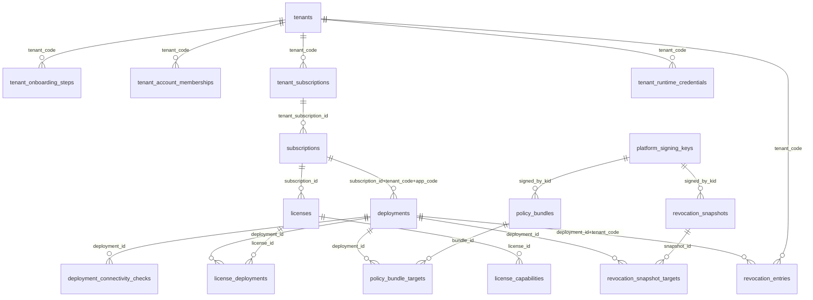
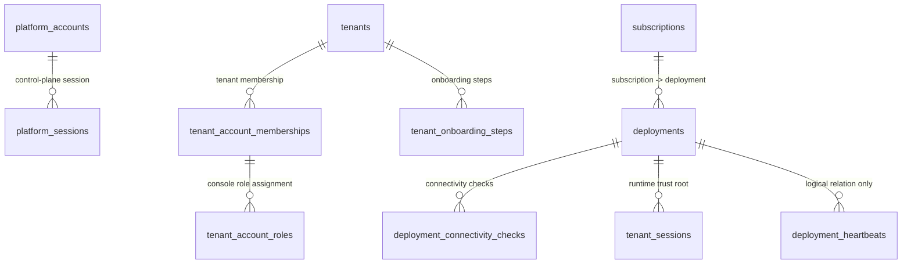
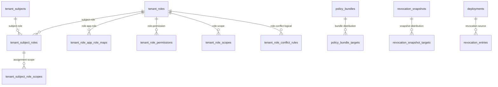

# HZY Platform ERD (v2.4)

来源：

- `docs/HZY-Platform-SQL-DDL-Draft-v2.sql`

生成日期：2026-04-24

说明：

- 下图按当前主线 DDL 里的实际 FK 绘制（已并入 v2.4 应用版本、订阅计划与 manifest action 快照）。
- 没有 FK 的“逻辑关联”表，会在每节末尾单独列出。
- 本图是当前平台数据主线的 ER 视图；`docs/archive/` 下历史文档不再纳入。

## 1) Platform Domain ER

```mermaid
erDiagram
  platform_accounts ||--o{ platform_sessions : "account_id"
  platform_accounts ||--o{ platform_account_roles : "account_id"
  platform_roles ||--o{ platform_account_roles : "role_id"

  platform_roles ||--o{ platform_role_permissions : "role_id"
  platform_resources ||--o{ platform_role_permissions : "resource_id"
  platform_resources ||--o{ platform_resources : "parent_id"

  platform_plans ||--o{ platform_plan_capabilities : "plan_id"
  platform_capabilities ||--o{ platform_plan_capabilities : "capability_code"
  platform_plans ||--o{ platform_plan_apps : "plan_id"
  platform_applications ||--o{ platform_plan_apps : "app_code"

  platform_app_roles ||--o{ platform_app_role_permissions : "app_role_id"
  platform_app_roles ||--o{ platform_app_role_scopes : "app_role_id"
  platform_system_roles ||--o{ platform_system_app_role_maps : "system_role_id"
  platform_app_roles ||--o{ platform_system_app_role_maps : "app_role_id"

  platform_orders ||--o{ platform_invoices : "order_id"
  platform_orders ||--o{ platform_payments : "order_id"
  platform_invoices ||--o{ platform_payments : "invoice_id"

  platform_feature_flags ||--o{ platform_feature_flag_assignments : "flag_id"
  platform_accounts ||--o{ platform_api_keys : "owner_account_id"

  platform_applications ||--o{ platform_app_manifest_registrations : "app_code"
  platform_applications ||--o{ platform_app_releases : "app_code"
  platform_app_manifests ||--o{ platform_app_manifest_registrations : "result_manifest_id+app_code"
  platform_app_manifests ||--o{ platform_app_releases : "manifest_id+app_code"
  platform_app_manifests ||--o{ platform_app_manifest_resources : "manifest_id+app_code"
  platform_app_manifest_resources ||--o{ platform_app_manifest_resource_actions : "manifest_resource_id+manifest_id+app_code+resource_code"

  platform_accounts ||--o{ platform_app_manifest_registrations : "submitted_by_account_id"
  platform_accounts ||--o{ platform_app_manifest_registrations : "reviewed_by_account_id"

  platform_app_manifests ||--o| platform_applications : "latest_manifest_id+app_code"
  platform_app_manifest_registrations ||--o| platform_applications : "latest_registration_id+app_code"
  platform_app_releases ||--o| platform_applications : "latest_release_id+app_code"
  platform_app_releases ||--o{ platform_plan_apps : "pin_release_id+app_code"
  platform_app_manifest_resource_actions ||--o{ platform_app_role_permissions : "manifest_action_id+app_code+resource_code+action"
  platform_app_manifest_resource_actions ||--o{ platform_app_role_scopes : "manifest_action_id+app_code+resource_code+action"
```

Platform 域当前仍无 FK 定义的表：

- `platform_app_supported_scopes`
- `platform_tenant_lifecycle_events`
- `platform_tickets`
- `platform_announcements`
- `platform_webhooks`
- `platform_audit_logs`

## 2) Boundary Domain ER

Boundary 域当前仍无 FK 定义的表：

- `tenant_account_memberships -> platform_accounts`（逻辑关联，无 FK）
- `deployment_heartbeats`

## 3) Tenant Domain ER（含跨域 FK）

```mermaid
erDiagram
  tenant_subjects ||--o{ tenant_subjects : "parent_subject_id"
  tenant_subjects ||--o{ tenant_subject_memberships : "subject_id+tenant_code"
  tenant_subjects ||--o{ tenant_subject_memberships : "container_subject_id+tenant_code"

  tenant_subjects ||--o{ tenant_subject_identities : "subject_id+tenant_code"
  tenant_identity_providers ||--o{ tenant_subject_identities : "provider_id+tenant_code"

  tenant_subjects ||--o{ tenant_sessions : "subject_id+tenant_code"
  deployments ||--o{ tenant_sessions : "deployment_id+tenant_code"

  tenant_roles ||--o{ tenant_roles : "parent_id"
  tenant_roles ||--o{ tenant_role_permissions : "role_id+tenant_code"
  tenant_roles ||--o{ tenant_role_app_role_maps : "role_id+tenant_code"
  tenant_roles ||--o{ tenant_role_conflict_rules : "left/right role_code logical"

  tenant_subjects ||--o{ tenant_subject_roles : "subject_id+tenant_code"
  tenant_roles ||--o{ tenant_subject_roles : "role_id+tenant_code"
  tenant_subject_roles ||--o{ tenant_subject_role_scopes : "assignment_id+tenant_code"

  tenant_account_memberships ||--o{ tenant_account_roles : "tenant_code+account_id"
  tenant_roles ||--o{ tenant_account_roles : "role_id+tenant_code"

  tenant_permission_templates ||--o{ tenant_template_roles : "template_id+tenant_code"
  tenant_roles ||--o{ tenant_template_roles : "role_id+tenant_code"

  tenant_permission_templates ||--o{ tenant_template_bindings : "template_id+tenant_code"
  tenant_subjects ||--o{ tenant_template_bindings : "subject_id+tenant_code"

  tenant_subjects ||--o{ tenant_template_overrides : "subject_id+tenant_code"
  tenant_roles ||--o{ tenant_template_overrides : "role_id+tenant_code"
  tenant_permission_templates ||--o{ tenant_template_overrides : "source_template_id+tenant_code"

  tenant_roles ||--o{ tenant_role_scopes : "role_id+tenant_code"
```

Tenant 域当前仍无 FK 定义的表：

- `tenant_audit_logs`

## 4) 开通与运行链路

## 5) 授权与吊销链路

