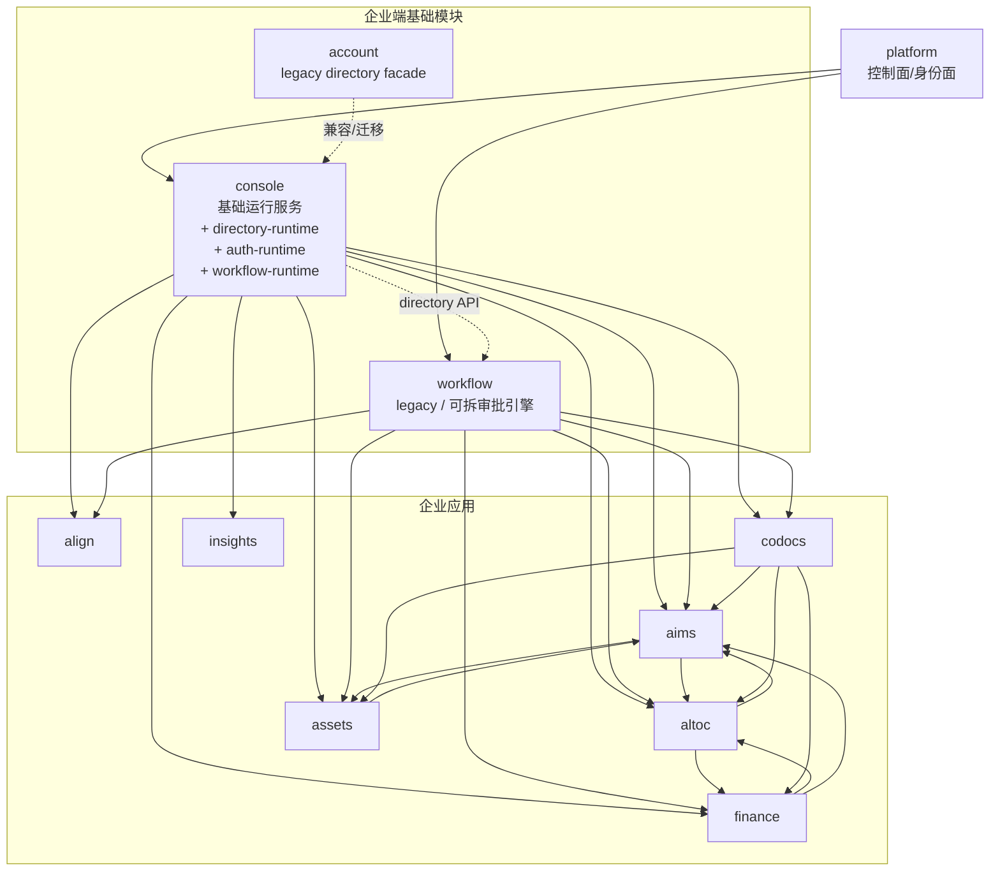

# 汇智云（Huizhi.Yun）整体架构文档

状态：Draft（重构版）
更新日期：2026-06-15
范围：平台级架构视图（现状 + 目标收敛方向），不替代各模块 PRD / README / 详细设计

## 1. 文档目标

本文档统一回答以下问题：

- 汇智云当前按什么模块分层组织
- 三类模块（`platform`、企业端基础模块、企业应用）各自负责什么
- 模块之间的边界、依赖关系和禁止事项是什么
- 默认部署模式与企业私有化部署模式下，模块如何落位

本文档的口径与以下目标文档保持一致：

- `docs/Huizhi-yun-Platform-Target-Architecture.md`
- `docs/Directory-Runtime-Contract.md`
- `docs/Account-Directory-Runtime-Refactor-Plan.md`
- `docs/Console-Directory-Runtime-Integration-Plan.md`
- `docs/Console-Functional-Design-v1.md`
- `docs/Console-Unified-Employee-Portal-Plan.md`
- `docs/MODULE_CONTRACTS.md`

## 2. 模块分层与三类分类

### 2.1 三类模块清单

| 分类 | 模块 | 定位 | 部署属性 |
|------|------|------|----------|
| 平台模块 | `platform` | 控制面与身份治理中心（Control Plane + Identity Plane） | 平台托管优先；私有化交付 `platform-core`（剥离 SaaS 运营域） |
| 企业端基础模块 | `console` | 客户侧基础运行服务，目标内置 `directory-runtime` / `auth-runtime` / `workflow-runtime`（org-profile / settings / integrations / credential-vault / directory / local auth / approval） | 客户侧部署，Starter 默认包含 |
| 企业端基础模块（过渡） | `account` | 当前组织目录与部分身份能力载体；目标收敛为 `console.directory-runtime` 的兼容 facade 或迁移源 | 过渡期客户侧部署；目标不再作为 Starter 必选独立服务 |
| 企业端基础模块（过渡/可拆） | `workflow` | 当前通用审批流程引擎；目标收敛为 `console.workflow-runtime`，保留未来独立部署边界 | 过渡期客户侧部署；目标不再作为 Starter 必选独立服务 |
| 企业应用（可选增强） | `align` | 深度组织协同、跨部门协助、人员借调、HR/财务轻流程；不再承担统一员工入口 | 客户侧部署，第一阶段可暂缓 |
| 企业应用 | `codocs` | 协作文档与知识管理 | 客户侧部署 |
| 企业应用 | `aims` | 研发项目全生命周期管理 | 客户侧部署 |
| 企业应用 | `altoc` | LTC 经营管理（客户/商机/合同/回款） | 客户侧部署 |
| 企业应用 | `assets` | 资产与资源管理、环境与交付视图 | 客户侧部署 |
| 企业应用 | `finance` | 经营财务中台（发票/到账/核销/支出/项目财务核算） | 客户侧部署 |
| 企业应用 | `insights` | 代码仓库监测分析与研发效能报表 | 客户侧部署 |

说明：`foundation` 是共享代码层（Nuxt Layer），不是业务模块，不纳入上述三类模块统计。

### 2.2 平台逻辑拓扑

### 2.3 Foundation 定位（共享层）

`foundation` 的架构角色是**共享实现层**，不是平台治理模块，也不是企业应用。

定位：

- 形态：`@hzy/foundation` Nuxt Layer（无独立端口、无独立业务库）
- 归属：运行在 Workload Plane，服务企业端基础模块与企业应用
- 作用：沉淀 Console OIDC、目录读取、Workflow 代理、service token、集成配置 adapter、共享布局与通用组件，降低模块重复实现成本

负责：

- Console OIDC 接入、旧 CAS/Account bridge 迁移兼容
- Console Directory API adapter、Workflow 代理与 service token 获取
- 集成配置 adapter、轻量 RUM、通用服务端工具
- 通用页面框架、导航与审批相关共享组件
- 通用 composables / server utils / 类型重导出规范

不负责：

- 平台控制面治理（租户/订阅/License/策略包）
- 业务模块主数据与业务状态
- 跨模块在线业务编排与业务终态持久化

演进方向：

- `foundation` 继续承担 UI 与通用应用层能力
- 新目录、身份、权限和服务认证主路径通过 `console`、`platform` policy bundle 与 Foundation adapter 承接，不再沉积在 legacy `accountApi` 桥接

## 3. 三类模块职责与边界

### 3.1 平台模块：`platform`

**负责**：

- 租户、订阅、部署、License、Capability、Revocation 等控制面治理
- 应用注册与 Manifest 治理（App Registry）
- 平台角色/模板/策略包治理（Policy Bundle）
- 控制面账户体系与平台运营管理台（`/admin`、`/dashboard`）
- 运行时治理信号（connectivity checks、heartbeats）

**不负责**：

- 企业应用业务主数据（项目、合同、文档正文、资产台账等）
- 客户组织目录明细（用户/部门/项目注册表详情）
- 客户侧企业配置明细与 secret 明文

**边界原则**：

- `platform` 管治理与授权模型
- 不直接承载客户业务运行时明细数据

**部署差异（必须遵守）**：

- SaaS 模式：`platform` 可包含运营域（租户开通、订阅、计费、工单、公告等）
- 企业私有化模式：`platform` 必须剥离 SaaS 管理与运营域，仅保留客户本地运行所需的 `platform-core` 能力（身份、授权、策略包、应用注册、部署治理、租户管理台）

### 3.2 企业端基础模块：`console` / `account` / `workflow`

| 模块 | 负责 | 不负责 | 与 `platform` 关系 | 与企业应用关系 |
|------|------|--------|--------------------|----------------|
| `console` | 企业基础资料、系统参数、集成配置、`credential-vault`、本地 service credential、目标内置组织目录、本地 auth runtime 与 workflow-runtime | 平台授权治理、应用清单治理、订阅与 License 治理、业务主数据 | 被 `platform` 治理（manifest/deployment/license/bundle/heartbeat） | 为应用提供基础配置、secret 引用、目录读取、本地 service client 与审批流转能力 |
| `account` | 当前用户/部门/岗位、项目注册表、目录同步、目录管理面；迁移期提供 legacy Account API 兼容 | 平台授权治理、应用清单治理、订阅与 License 治理、新增目录能力的长期承载 | 过渡期被 `platform` 治理；目标能力迁入 `console` 后可退化为 facade 或下线 | 过渡期为应用提供组织目录读取；目标由 `foundation -> console.directory-runtime` 替代 |
| `workflow` | 当前流程定义、审批实例、待办、动作执行、回调；迁移期提供 legacy Workflow API 兼容 | 业务对象终态存储、组织目录主数据、平台授权治理、新增审批能力的长期承载 | 过渡期被 `platform` 治理；目标能力迁入 `console.workflow-runtime` 后可退化为 facade 或下线 | 过渡期为应用提供统一审批流转；目标由 `foundation -> console.workflow-runtime` 替代 |

### 3.3 企业应用：`align` / `codocs` / `aims` / `altoc` / `assets` / `finance` / `insights`

| 模块 | 核心职责 | 关键依赖 | 明确不负责 |
|------|----------|----------|------------|
| `align` | 可选深度组织协同：跨部门协助、人员借调、HR/财务轻流程、协同 SLA 与统计；不再承担统一员工入口 | 目录服务（当前 `account`，目标 `console.directory-runtime`）、`workflow`，后续可关联 `aims/codocs/altoc` | 权限主数据、流程引擎、其他业务主档、轻量员工工作台入口 |
| `codocs` | 文档协作、知识管理、文档版本与实时协同 | 目录服务、`workflow`（审批） | 用户权限主数据、项目执行、经营主档 |
| `aims` | 研发项目执行闭环（立项-迭代-任务-缺陷-工时） | 目录服务、`workflow`、`codocs`，并与 `altoc` 桥接 | 客户/合同主档、审批引擎 |
| `altoc` | 经营闭环（客户-商机-报价-合同-回款） | 目录服务、`workflow`、`codocs`，并与 `aims` 桥接 | 项目执行系统、文档正文编辑 |
| `assets` | 资产/资源管理、环境与交付视图、成本归因 | 目录服务、`workflow`，并计划对接 `altoc/aims/codocs` | 项目执行、客户合同主档、审批引擎 |
| `finance` | 经营财务中台：发票、到账、核销、支出、费用审批、项目财务核算、绩效金额财务口径 | 目录服务、`workflow`、`altoc`、`aims`、`assets`、`people` | 完整会计总账、税务申报、客户合同主档、项目执行、个人绩效主流程 |
| `insights` | 代码仓库分析、贡献/效能报表 | 目录服务（用户映射与审计），GitLab/FastAPI | 项目管理、文档管理、平台授权治理 |

### 3.4 应用模块接入 Foundation 的要求

以下要求适用于企业应用与企业端基础模块（`platform` 除外）：

1. 接入要求
在 Nuxt 模块中默认通过 `extends: ['../foundation']`（或等效包引用）接入共享能力；`platform` 明确禁止依赖 `foundation`。

2. 能力复用要求
新增认证、目录读取、审批能力时，优先复用 `foundation` 的 composables / server api / 组件，不重复造轮子。

3. 集成方式要求
模块间调用必须走 API 与代理层，禁止跨模块数据库直连；目录服务 / `workflow` 访问优先通过 `foundation` 适配层统一处理。过渡期目录适配可 fallback 到 `account`，目标优先指向 `console.directory-runtime`。

4. 控制面能力边界要求
新控制面能力（授权治理、策略包、deployment 等）不得继续塞入 `foundation` 的 legacy `accountApi`；应走 `platform-sdk / platform client`。

5. 覆盖与反哺要求
允许模块按需覆盖 Layer 同名文件，但通用能力应反哺 `foundation`，并同步更新 `docs/FOUNDATION_CAPABILITIES.md`。

6. 例外管理要求
当前未完全接入 `foundation` 的模块（如历史迁移中的 `insights`）可阶段性保留本地实现，但新功能应避免继续扩大分叉并逐步收敛。

## 4. 模块关系与主链路

### 4.1 治理链（Platform Governance）

`platform -> (console/企业应用)`；过渡期仍可治理独立 `account` / `workflow`

- 通过应用注册、订阅、部署、License、策略包、心跳检查治理运行时
- 业务应用和基础模块都属于被治理对象，不反向承载平台治理职责

### 4.2 基础能力链（Base Runtime Chain）

`企业应用 -> console.directory-runtime`：取组织目录与项目注册表
`企业应用 -> console`：取企业基础配置、集成参数、`secret_ref` 与本地 service client
`企业应用 -> workflow（当前）/ console.workflow-runtime（目标）`：发起审批、接收回调、完成业务状态流转
`企业应用 -> foundation`：复用认证、共享布局、目录/审批访问适配能力

过渡期允许 `foundation -> account` 继续承接目录读取；新增目录能力应优先落到 `console.directory-runtime`。

### 4.3 业务协同链（Business Chain）

- `altoc <-> aims`：经营-交付桥接（商机/合同到项目/里程碑）
- `altoc <-> finance`：合同/回款计划到发票、到账、核销
- `aims/people <-> finance`：工时、人员成本、项目成本与绩效金额财务口径
- `assets <-> aims/altoc/finance`：产品主档、环境、资产、成本归因与交付视图
- `codocs -> aims/altoc/assets/align`：文档能力作为跨业务上下文
- `codocs -> finance`：合同、发票、报销、审计附件等文档引用
- `insights`：通过代码数据与组织维度补充研发效能分析

### 4.4 统一员工入口链（Presentation Integration Chain）

SSO 落地后，汇智云的员工侧展现入口收敛到 `console`，而不是 `platform`。

- `platform` 继续作为控制面，负责应用注册、manifest/release、订阅、license、deployment 与 policy bundle 治理。
- `console` 作为企业员工统一入口，负责企业工作台、应用中心、轻量待办/通知/协同入口、当前用户可见应用过滤、Console OIDC 登录态与登出链路。
- `foundation` 为各业务应用提供统一顶栏、AppLauncher、UserMenu、OIDC 登录/回调/刷新/登出适配。
- 企业应用保持独立部署与独立业务边界，通过 SSO、共享壳层和统一入口形成一体化体验。

默认集成方式是“独立应用 + 统一身份 + 统一入口 + 统一导航”，不是 iframe 聚合，也不是把业务应用合并成单体。详细方案见 `docs/Console-Unified-Employee-Portal-Plan.md`。

## 5. 数据事实源与稳定标识

### 5.1 数据归属

| 数据域 | 唯一事实源 | 主要消费者 |
|--------|------------|------------|
| 租户/订阅/部署/License/策略包 | `platform` | 全模块（治理面） |
| 企业基础资料/系统参数/集成配置/凭证引用 | `console` | 全部企业应用 + supporting services |
| 用户/部门/岗位/项目注册表 | `console.directory-runtime`（当前由 `account` 兼容承接） | `workflow` + 全部企业应用 |
| 审批定义/实例/待办 | `console.workflow-runtime`（当前由独立 `workflow` 兼容承接） | `align/codocs/aims/altoc/assets` |
| 员工入口、应用中心、轻量待办/通知/协同入口 | `console.employee-portal` | 全部企业用户与企业应用 |
| 文档正文与文档元数据 | `codocs` | `aims/altoc/assets/align` |
| 研发执行数据 | `aims` | `altoc/assets/align`（按需） |
| 客户/合同/回款 | `altoc` | `aims/assets/align`（按需） |
| 资产/环境/资源台账 | `assets` | `aims/altoc`（按需） |
| 发票/到账/核销/支出/项目财务核算 | `finance` | `altoc/aims/assets`（按需） |
| 代码效能分析数据 | `insights` | 管理视图/研发管理场景 |

### 5.2 跨模块稳定标识

- 用户：`uid`
- 部门：`dept_code`
- 项目注册表：`project_code`
- 文档：`uuid` / `document_id`
- 审批实例：`instance_id`
- 业务对象：各模块自身 `code` / `uuid` / `biz_id`

## 6. 部署模式

### 6.1 模式 A：Managed Control Plane（默认）

适用：小微团队与中型研发团队。

部署特征：

- `platform`：汇智云平台侧托管
- 企业端基础模块（目标 `console/workflow`，过渡期含 `account`）：客户侧部署
- 企业应用（6 个）：客户侧部署
- 数据面（MySQL/Redis/OSS/Git 等）：客户侧部署

核心价值：平台统一治理，客户保留业务数据与运行时控制权。

### 6.2 模式 B：Self-Hosted Enterprise（企业私有化）

适用：中大型团队、国企、强合规或断网场景。

部署特征：

- `platform` 仅交付 `platform-core`，并部署在客户侧私有环境
- SaaS 运营域（租户全局运营、订阅计费、平台工单/公告等）不进入私有化交付物
- 平台治理模型不变，仅部署拓扑变化
- 所有业务数据、目录数据、基础配置和运行时日志均留在客户侧

### 6.3 模块级部署矩阵

| 模块 | 默认模式（Managed Control Plane） | 企业私有化模式（Self-Hosted Enterprise） |
|------|-----------------------------------|------------------------------------------|
| `platform` | 平台侧托管（含 platform-core + SaaS 运营域） | 客户侧部署 `platform-core`（不含 SaaS 运营域） |
| `console` | 客户侧部署，目标内置 directory-runtime / auth-runtime / workflow-runtime | 客户侧部署，目标内置 directory-runtime / auth-runtime / workflow-runtime |
| `account` | 过渡期客户侧部署；目标由 `console.directory-runtime` 兼容替代 | 过渡期可部署；目标不作为独立必选服务 |
| `workflow` | 过渡期客户侧部署；目标由 `console.workflow-runtime` 兼容替代 | 过渡期可部署；目标不作为独立必选服务 |
| `align` | 可选增强；第一阶段可暂缓，轻量协同入口由 `console` 承接 | 可选部署 |
| `codocs/aims/altoc/assets/insights` | 客户侧部署 | 客户侧部署 |

补充：当前默认不提供“平台侧托管企业应用数据面”的标准交付形态；若后续新增 Hosted Workload，将作为独立模式评估。

### 6.4 平台拆分演进（预留）

为支持私有化剥离与后续独立演进，`platform` 可按部署单元拆分为两个应用：

1. `platform-core`：控制面核心（Identity、Policy、Manifest、Runtime Governance、Tenant Admin），可部署在客户侧
2. `platform-ops`：SaaS 运营域（租户运营、订阅计费、平台运营后台），仅 SaaS 平台侧部署

当前仓库仍是单应用实现，但接口与职责应按上述边界持续收敛，避免私有化交付时再做大规模反向拆分。

## 7. 架构红线

- 禁止跨模块数据库直连做在线业务
- 业务应用不得自建平台级 IAM 与授权治理
- 新增授权治理能力不得继续沉积在 `account`
- 新增目录能力不得继续扩大 `account` 独立职责，应优先落到 `console.directory-runtime`
- `workflow` 只做流程，不做业务终态事实源
- `console` 不承载业务主数据，不暴露 secret 明文给常规读取接口；轻量协同能力仅限入口、摘要、阅读状态、简单提醒和关联索引
- 企业应用不得复制其他应用主档作为新的事实源
- 企业私有化交付不得包含 SaaS 运营域台账（如全局订阅计费、平台运营工单等）

## 8. 当前模块状态快照（2026-06-15）

| 模块 | 分类 | 端口 | 当前状态 |
|------|------|------|----------|
| `platform` | 平台模块 | 3011 | 控制面开发中，已覆盖租户、订阅、部署、License、policy bundle、runtime heartbeat 等主链路 |
| `console` | 企业端基础模块 | 3000 | 基础运行服务已落地并持续建设，包含企业配置、目录运行时、认证运行时、凭证保险箱、集成配置、员工入口与本地授权消费 |
| `account` | 企业端基础模块（过渡） | 3000 | 已上线，作为 legacy 目录/身份/项目注册表迁移源与兼容 facade |
| `workflow` | 企业端基础模块（过渡/可拆） | 3020 | 开发中，当前独立审批运行时，目标可收敛到 console.workflow-runtime |
| `codocs` | 企业应用 | 3001 | 已上线 |
| `aims` | 企业应用 | 3002 | 开发中（MVP/Beta） |
| `altoc` | 企业应用 | 3003 | MVP 一期基本完成 / 开发中 |
| `assets` | 企业应用 | 3004 | 设计中，脚手架已建 |
| `finance` | 企业应用 | 3006 | v0.1-v0.3 MVP 实现中 |
| `insights` | 企业应用 | 3009 | 已上线 |
| `align` | 企业应用（可选增强） | 3008 | 脚手架已创建；统一员工入口已收敛到 console，Align 暂定位为未来深度组织协同应用 |

## 9. 参考文档

- `docs/Huizhi-yun-Platform-Target-Architecture.md`
- `docs/MODULE_CONTRACTS.md`
- `docs/Directory-Runtime-Contract.md`
- `docs/Account-Directory-Runtime-Refactor-Plan.md`
- `docs/Console-Directory-Runtime-Integration-Plan.md`
- `docs/Console-Functional-Design-v1.md`
- `docs/Console-Unified-Employee-Portal-Plan.md`
- `docs/Console-API-Contract-v1.md`
- `docs/Console-Bootstrap-and-Rotation-Sequence-v1.md`
