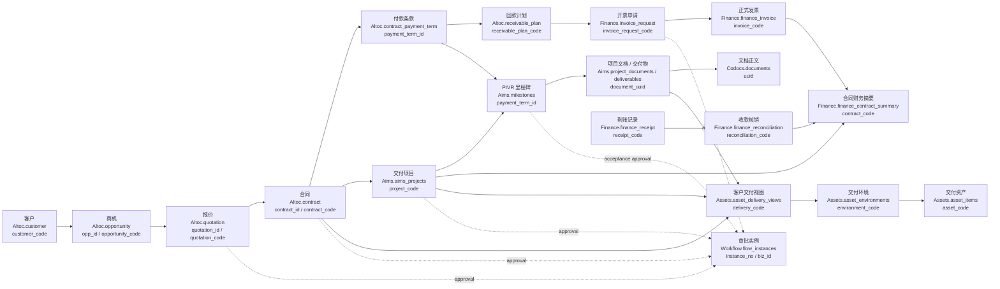

# 汇智云一体化运营闭环差距与落地路线

状态：Draft  
日期：2026-06-15  
定位：把“支撑软件产品 / SaaS 平台类公司完整运营活动”的目标，落成可拆解、可排期、可验收的执行基线。

## 1. 文档目的

本文用于承接当前仓库现状分析，回答三个执行问题：

- 汇智云距离“一体化运营平台”还差哪些关键闭环。
- 哪些能力应先打通，哪些能力应后置。
- 后续需求、研发、测试和验收如何围绕端到端业务链路拆任务。

本文不替代以下文档：

- `docs/Huizhi-yun-PRD.md`：产品总体需求。
- `docs/Huizhi-yun-Architecture.md`：整体架构现状与边界。
- `docs/MODULE_CONTRACTS.md`：当前已实现和约定的跨模块契约。
- 各模块 `CLAUDE.md`、`docs/*_schema.sql`、API_SPEC：模块级设计和实现细节。

## 2. 目标产品闭环

目标是支撑软件产品 / SaaS 平台类公司的完整运营活动，并让各环节形成可追溯的数据闭环。

核心业务链路：

```text
产品规划
  -> 需求 / 版本 / 路线图
  -> 设计研发 / 测试 / 发布
  -> 项目交付 / 验收 / 运维
  -> 市场营销 / 商机 / 报价 / 合同
  -> 开票 / 到账 / 核销 / 项目核算
  -> 资产沉淀 / 知识沉淀 / 绩效归因
```

目标不是把所有数据合并到一个数据库，而是在模块边界清晰的前提下，通过稳定业务键、服务 API、审批流、事件和统一入口形成一体化体验。

## 3. 当前实现快照

### 3.1 已具备的基础

- `platform` 已承担租户、订阅、部署、License、应用注册、manifest、policy bundle 和角色授权治理。
- `console` 已承担企业基础配置、目录运行时、认证运行时、凭证保险箱、集成配置、应用入口和轻量消息中心方向。
- `foundation` 已提供统一认证、目录、Workflow 代理、应用启动器、共享布局、service token 和 tenant-runtime/data-runtime helper。
- `data-runtime` 已作为 tenant-runtime 当前实现基座，Finance 和 Workflow 是成熟 pilot，Aims / Altoc / Assets / Codocs 已有兼容 adapter。
- People 已新增为 Phase 3 人员最小事实源，采用 tenant-runtime/data-runtime 模式。
- `Codocs` 已是较成熟的协作文档与知识管理模块。
- `Aims` 已进入 MVP/Beta，覆盖项目、需求、任务、缺陷、工时、产品版本等研发管理主干。
- `Altoc` 已进入 MVP 一期基本完成，覆盖客户、线索、商机、报价、合同、回款等 LTC 主干。
- `Assets` 已有产品资产、实物资产、资源资产、环境和交付视图模型，但仍按设计中 / 脚手架口径推进。
- `Finance` 已进入 v0.1-v0.3 MVP，覆盖财务台账、核销、审批、项目核算和绩效金额财务口径方向。
- `Workflow` 已具备通用审批定义、实例、待办、动作执行和回调能力。

### 3.2 主要薄弱点

- 业务模块功能已有雏形，但端到端编排还不完整。
- Aims、Altoc、Assets、Finance、Workflow 之间很多接口仍处于“计划中 / 二期 / 兼容 adapter”阶段。
- 完整 HRM / 考勤仍未进入范围；岗位职级、M/P 职级设置、员工成本、绩效周期已收敛为 People 最小事实源主路径，人力成本计算参数归 Finance。
- 运维服务、SLA、维保、客户系统台账和售后工单尚未产品化闭环。
- 作业成果自动归档到 Codocs / Assets 的规则还不完整。
- 管理驾驶舱需要的统一经营事实和事件链路尚未稳定。

## 4. 差距清单

| 目标域 | 现状 | 差距 | 优先级 |
| --- | --- | --- | --- |
| 产品规划推动研发 | Assets 是产品主档，Aims 是产品版本事实源 | 缺产品路线图、版本目标、解决方案 / 报价产品目录到研发计划的稳定链路 | P1 |
| 设计研发 | Aims 已覆盖项目、需求、任务、缺陷、工时、GitLab 集成方向 | 测试管理、代码质量、Insights 与工作项关联、设计交付物追溯不足 | P1 |
| 交付运维 | Aims 有 PIVR，Altoc-Aims 桥接设计已存在 | 合同到交付项目、验收到开票、运维到缺陷 / 需求回流未闭环 | P0 |
| 项目管理 | Aims 主干较强 | 项目成本、资产投入、合同里程碑、验收回款的跨模块状态同步不足 | P0 |
| 文档 / 知识资产 | Codocs 已成熟 | 需求、方案、合同、交付物、验收报告、故障知识等自动分类归档不足 | P1 |
| 市场营销 / LTC | Altoc 一期基本完成 | Altoc -> Aims、Altoc -> Finance、Altoc -> Assets 仍需产品化 API 和状态机 | P0 |
| 人力资源 / 绩效 | Console Directory 管登录人和部门；People 管最小人员事实、任职、成本、贡献快照和个人绩效主流程；Finance 管绩效金额/提成奖金财务口径 | 完整 HRM / 考勤不在近期范围；People 与 Aims、Finance 的服务链路需继续硬化 | P1 |
| 资产与财务 | Assets / Finance 模块已建 | 采购审批、资产入库、交付环境、项目成本、核销回写未形成稳定闭环 | P0 |
| 统一入口 / 待办 / 通知 | Console 方案明确，已有通知中心方向 | 跨模块待办聚合、最近访问、轻量事项、业务动作入口需要落地 | P1 |
| 经营分析 / AI | 局部模块有 dashboard 和 AI 辅助 | 缺统一事件口径和跨模块指标事实，AI 只能做局部辅助 | P2 |

## 5. 落地原则

1. 先打通一条真实端到端闭环，再横向扩模块功能。
2. 不合库，不跨库 JOIN；模块间只通过 API、事件、回调和 tenant-runtime/data-runtime 合同协作。
3. 跨模块引用只保存稳定业务键，例如 `customer_code`、`contract_code`、`project_code`、`product_code`、`document_uuid`、`asset_code`、`finance_code`。
4. 服务端跨模块调用统一使用 Console service token，不新增共享 webhook secret、静态 API key 或业务应用本地跨模块 secret。
5. `platform` 管治理，`console` 管企业运行时入口，业务模块管各自事实源。
6. `Align` 暂不承接统一员工入口；只有轻量协同演进出完整状态机、SLA、借调履约、HR / 轻财务台账时再启用。
7. 任何新跨模块契约落地时，同步更新 `docs/MODULE_CONTRACTS.md` 和相关模块文档。

## 6. 首个端到端验收场景

建议首个可演示闭环选择“客户合同交付与回款闭环”。

### 6.1 场景步骤

1. Altoc 创建客户、联系人、商机。
2. Altoc 创建报价并审批。
3. Altoc 创建合同，包含付款条款、交付范围、关联产品 / 解决方案。
4. 合同生效后，Altoc 调用 Aims 创建或关联交付项目。
5. Aims 项目写入 `customer_code`、`contract_code`、`opp_id`、`contract_id`。
6. Aims 根据合同付款条款创建 PIVR 里程碑，并写入 `payment_term_id`。
7. Aims 项目中关联 Codocs 方案、需求、设计、交付、验收文档。
8. Aims 完成 Verification / 验收里程碑后，通知 Altoc 将对应回款计划推进到可开票。
9. Altoc 或业务用户发起 Finance 开票申请。
10. Workflow 完成开票审批。
11. Finance 生成发票、记录到账、完成核销。
12. Finance 回传合同财务摘要给 Altoc，并生成项目财务摘要。
13. Assets 建立客户交付视图，关联产品、环境、数字资产、交付文档和成本归因。
14. Console 显示相关待办、通知和应用入口。

### 6.2 验收标准

- 能从 Altoc 合同详情跳转到 Aims 项目、Codocs 交付文档、Finance 合同财务摘要和 Assets 客户交付视图。
- 能从 Aims 项目详情看到合同、客户、付款条款、PIVR 里程碑和交付文档。
- Aims 验收里程碑完成后，不直接写 Altoc 数据库，而是通过 Altoc API 推进回款计划状态。
- Finance 核销完成后，Altoc 合同页能看到开票、到账、核销、未收金额和风险状态。
- Assets 交付视图能按客户 / 合同 / 项目聚合交付资产、环境和文档。
- 全链路关键状态变更有审计日志、幂等键和可追踪业务键。

## 7. 执行路线

### Phase 0：闭环基线与契约冻结

目标：确定首条闭环的对象、字段、状态和 API，避免边做边改。

任务：

- 定义跨模块业务对象关系表 / 事件口径，至少覆盖客户、商机、合同、付款条款、项目、里程碑、文档、资产、财务单据。
- 梳理 Altoc、Aims、Finance、Assets、Workflow 现有字段与缺口。
- 将首条闭环 API 合同补入 `docs/MODULE_CONTRACTS.md`。
- 明确每个跨模块动作的调用方、被调用方、认证 scope 和幂等键。

验收：

- 有一张“端到端对象关系图”。
- 有一份 API / 事件清单。
- 每个业务状态只能有一个事实源。

#### Phase 0 冻结结果（2026-06-15）

Phase 0 的设计基线已冻结为“客户合同交付与回款闭环”。本阶段不要求业务代码全部实现，但要求后续 Phase 1 不能再改变对象事实源、跨模块业务键、事件语义、服务认证和幂等规则。

##### 端到端对象关系图



##### 事实源与状态冻结表

| 对象 / 状态 | 唯一事实源 | 稳定业务键 | 当前已有字段 | Phase 1 不得越界 |
| --- | --- | --- | --- | --- |
| 客户 | Altoc `customer` | `customer_code` = `customer.code` | `customer.code/name/status/owner_user_id/owner_dept_code` | Aims、Finance、Assets 只保存客户编码和名称快照，不维护客户主档 |
| 商机 | Altoc `opportunity` | `opp_id`，后续可补 `opportunity_code` | `opportunity.id/code/customer_id/status/amount/owner_user_id` | Aims 只引用 `opp_id`，不推进销售阶段 |
| 报价 | Altoc `quotation` | `quotation_id`，后续可补 `quotation_code` | 已有关联 `opportunity_id` 的报价与版本模型 | Workflow 只审批报价动作，不保存报价终态 |
| 合同 | Altoc `contract` | `contract_code` = `contract.code`，兼容 `contract_id` | `contract.id/code/status/opportunity_id/amount/effective_date` | Aims、Finance、Assets 不复制合同主档；Finance 只保存财务快照 |
| 付款条款 | Altoc `contract_payment_term` | `payment_term_id` | `term_type/amount/ratio/trigger_stage_type/expected_date` | Aims 里程碑只映射，不修改条款 |
| 回款计划 | Altoc `receivable_plan` | `receivable_plan_code` = `receivable_plan.code` | `payment_term_id/status/amount/planned_invoice_date/received_amount` | Finance 核销后通过 API / 事件回传摘要，不直写 Altoc |
| 交付项目 | Aims `aims_projects` | `project_code` | 已有 `opp_id/contract_id/customer_code/customer_name/contract_code/lifecycle_status` | Altoc 不维护项目执行状态 |
| PIVR 里程碑 | Aims `milestones` | `project_code + milestone_id`，映射 `payment_term_id` | 已有 `status/pivr_stage/payment_term_id` | Altoc 不推进里程碑状态；Aims 完成验收后通知 Altoc |
| 项目文档 / 交付物 | Aims `project_documents` / `deliverables`，正文在 Codocs | `document_uuid` / `codocs_uuid` | 已有 `project_code/milestone_id/doc_category/codocs_uuid/document_uuid` | Altoc/Assets/Finance 只引用文档 UUID 和标题快照 |
| 开票申请 | Finance `invoice_request` | `invoice_request_code` = `invoice_request.code` | 已有 `source_app/source_biz_code/customer_code/contract_code/receivable_plan_code/status/workflow_instance_id` | Altoc 只能发起申请，不生成正式发票事实 |
| 正式发票 | Finance `finance_invoice` | `invoice_code` = `finance_invoice.code` | 已有 `contract_code/project_code/receivable_plan_code/status/invoice_amount` | Altoc 展示摘要，不保存发票主档 |
| 到账记录 | Finance `finance_receipt` | `receipt_code` = `finance_receipt.code` | 已有 `contract_code/project_code/receivable_plan_code/status/received_amount` | Altoc 展示回款状态，不保存到账事实 |
| 收款核销 | Finance `finance_reconciliation` | `reconciliation_code` | 已有 `receipt_id/invoice_id/contract_code/project_code/reconciled_amount/status` | Altoc 回款计划状态由 Finance 摘要/API 触发更新 |
| 合同财务摘要 | Finance `finance_contract_summary` | `contract_code` | 已有 `invoice_amount/received_amount/reconciled_amount/risk_status` | 摘要可被 Altoc 读取，但计算事实仍在 Finance |
| 交付视图 / 环境 / 资产 | Assets `asset_delivery_views` / `asset_environments` / `asset_items` | `delivery_code` / `environment_code` / `asset_code` | 已有 `customer_code/contract_code/project_code/status` | Assets 不维护合同、项目、财务主档 |
| 审批实例 | Workflow `flow_instances` | `instance_no` + `app_code/resource_code/biz_id/action_code` | 已有 `biz_id/status/callback_url` 与 callback log | Workflow 不保存业务终态，只回调业务模块 |

##### 现有字段与缺口

| 模块 | 已具备 | Phase 1 前必须补齐或确认 |
| --- | --- | --- |
| Altoc | 客户、商机、报价、合同、付款条款、回款计划、合同阶段、文档链接模型；合同状态覆盖 `effective/delivering/accepted/completed` | Phase 1 已补合同生效交付编排入口、回款计划可开票 service endpoint、Finance 核销摘要同步 endpoint、回款计划开票申请 UI / 编排入口、合同页 Finance 摘要展示和回款计划 bridge 审计 |
| Aims | 项目已保存 `opp_id/contract_id/customer_code/contract_code`；里程碑已有 `payment_term_id`；项目文档和交付物已有文档 UUID | Phase 1 已补创建/关联交付项目、按付款条款同步 PIVR 里程碑 service endpoint；验收通过时可自动按 `payment_term_id` 通知 Altoc 推进回款计划 |
| Finance | 已有开票申请、正式发票、到账、核销、合同财务摘要、项目财务摘要；已存在合同摘要读取 API | Phase 1 已补开票申请按来源业务键幂等、Altoc 发起后自动提交 Finance 开票审批、核销后通过 Finance Nuxt 编排层调用 Altoc `finance-summary:sync`；专门幂等表与事件总线化进入后续硬化 |
| Assets | 已有交付视图、环境、资产、文档关联、月度成本，均可保存 `customer_code/contract_code/project_code` | 增加 service-only upsert 客户交付视图端点；明确交付文档引用使用 Codocs/Aims 文档 UUID；成本输出给 Finance 的事件/API 后置 Phase 2 |
| Workflow | 已有 action sync、instance、task、callback log；业务键是 `app_code/resource_code/biz_id/action_code` | 报价、合同、开票、项目立项/验收动作需要统一 action code；所有回调使用 Console service token，callback payload 必须带 `idempotencyKey` |

##### Phase 0 API / 事件清单

以下清单是跨模块 service API 合同基线。状态列表示截至 2026-06-16 的当前工程状态。

| # | 动作 / 事件 | 调用方 | 被调用方 | 合同 | 认证与 scope | 幂等键 | 状态 |
| --- | --- | --- | --- | --- | --- | --- | --- |
| 1a | 合同生效交付编排入口 | Altoc UI / Workflow / service | Altoc | `POST /api/v1/service/contracts/{contractCode}/activate-delivery` | 用户需 `contract:edit` 权限；service 调用 `aud=altoc`, `scope=altoc:write altoc:contract:edit` | `altoc:contract:{contract_code}:activate-delivery:v1` | Phase 1 已实现 Nuxt 编排入口：先调用 Altoc runtime 激活合同并生成回款计划，再用 Console service token 调用 Aims 创建项目和同步付款里程碑 |
| 1 | 合同生效后创建或关联交付项目 | Altoc | Aims | `POST /api/v1/service/projects/from-contract` | `aud=aims`, `scope=aims:write`, `source=altoc` | `altoc:contract:{contract_code}:project-link:v1` | Phase 1 已实现 Aims service 端点与 tenant-runtime 转发；按 `contract_code` 派生幂等 |
| 2 | 查询合同交付项目关联 | Altoc / Aims | Aims | `GET /api/v1/service/projects/by-contract/{contractCode}` | `aud=aims`, `scope=aims:read` | 读接口不需要；调用链 trace 使用 `x-hzy-request-id` | Phase 1 已实现 |
| 3 | 按付款条款创建/同步 PIVR 里程碑 | Altoc 或 Aims 内部编排 | Aims | `POST /api/v1/service/projects/{projectCode}/payment-milestones:sync` | `aud=aims`, `scope=aims:write` | `altoc:contract:{contract_code}:payment-terms:{payment_terms_version}` | Phase 1 已实现；按 `project_code + payment_term_id` upsert |
| 4 | 验收里程碑完成，回款计划进入可开票 | Aims | Altoc | `POST /api/v1/service/receivable-plans/{receivablePlanCode}/mark-billable` 或 `POST /api/v1/service/payment-terms/{paymentTermId}/receivable-plan:mark-billable` | `aud=altoc`, `scope=altoc:write altoc:receivable:mark-billable`, `source=aims` | `aims:milestone:{project_code}:{milestone_id}:accepted:v1` | Phase 1 已实现 Altoc 两个 service 端点与 tenant-runtime 转发；Aims `review-approve` 可先按显式 `receivablePlanCode`，否则自动按 runtime 返回的 `paymentTermId` 通知 Altoc |
| 5 | 发起开票申请 | Altoc | Finance | Altoc `POST /api/v1/receivable-plans/{receivablePlanCode}/invoice-request` 编排 Finance `POST /api/v1/finance/invoice-requests` | `aud=finance`, `scope=finance:write`, `source=altoc` | `altoc:receivable:{receivable_plan_code}:invoice-request:v1` | Phase 1 已实现：Altoc UI 入口调用本地编排器，runtime 校验回款计划并组装 payload，Finance 按 `source_app/source_biz_type/source_biz_code` 幂等创建，Altoc runtime 写回款计划审计 |
| 6 | 开票审批提交与回调 | Altoc / Finance / Workflow | Finance | Finance `POST /api/v1/finance/invoice-requests/{code}/submit` + workflow callback endpoint | `aud=finance`, `scope=finance:write` / `scope=workflow:callback` | `altoc:receivable:{receivable_plan_code}:invoice-request:v1:submit:v1` / `workflow:{instance_no}:finance:invoice-request:{code}` | Phase 1 已实现提交链路：Altoc 发起后自动调用 Finance submit，Finance 优先创建 Workflow 审批实例，不可用时写本地 fallback；Workflow callback 能力沿用 Finance 既有实现 |
| 7 | 合同财务摘要读取 | Altoc | Finance | `GET /api/v1/finance/contracts/{contractCode}/summary` / `GET /api/v1/finance/contracts/summaries` | `aud=finance`, `scope=finance:read`, `source=altoc` | 读接口不需要；摘要版本用 `calculated_at` | Phase 1 已实现：Altoc 合同列表和合同详情发票页读取并展示 Finance 开票、到账、核销、未核销摘要 |
| 8 | 核销完成后通知经营侧刷新回款计划 | Finance | Altoc | `POST /api/v1/service/contracts/{contractCode}/finance-summary:sync` | `aud=altoc`, `scope=altoc:write altoc:contract:finance-summary:sync`, `source=finance` | `finance:reconciliation:{reconciliation_code}:altoc-summary:v1` 或 `finance:contract:{contract_code}:summary:{calculated_at}` | Phase 1 已实现服务端闭环：Finance `POST /api/v1/finance/reconciliation` 本地编排器先调用 runtime 创建核销并返回摘要，再用 Console service token 调 Altoc 同步回款计划已收 / 未收 / 状态；Altoc 同步失败不回滚 Finance 核销，响应附带同步错误供重放 |
| 9 | 创建/更新客户交付视图 | Aims 或 Altoc | Assets | `POST /api/v1/service/deliveries/upsert` | `aud=assets`, `scope=assets:write`, `source=aims|altoc` | `contract:{contract_code}:project:{project_code}:delivery-view:v1` | Phase 2 已实现；按 `delivery_code` 或 `contract_code + project_code` 幂等 upsert，返回交付资产包 |
| 10 | 关联交付文档到交付视图 | Aims / Assets | Assets | `POST /api/v1/service/deliveries/{deliveryCode}/documents` | `aud=assets`, `scope=assets:write` | `delivery:{delivery_code}:document:{document_uuid}` | Phase 2 已实现；保存 Codocs UUID 和 `artifact_type`，并把 Aims 里程碑等上下文写入 `asset_documents.source_context` |
| 11 | 同步审批动作定义 | Aims / Altoc / Finance / Assets | Workflow | `POST /api/v1/action-defs/sync` | `aud=workflow`, `scope=workflow:proxy` 或 app service grant | `workflow:action-defs:{app_code}:{manifest_hash}` | 已有通用能力 |
| 12 | 审批终态回调业务模块 | Workflow | Aims / Altoc / Finance / Assets | 各业务模块 callback endpoint | `aud=<app>`, `scope=workflow:callback`, `source=workflow` | `workflow:{instance_no}:{status}:{completed_at}` | Workflow 能力已有；各业务动作需接入 |

##### 事件口径

Phase 1 先不引入新的全局事件总线，所有事件先以“service API + 幂等键 + 审计日志”的方式落地；后续若引入事件汇总表或消息队列，事件名保持以下语义不变。

| 事件名 | 事实源 | 触发条件 | 消费方 | 关键载荷 |
| --- | --- | --- | --- | --- |
| `altoc.contract.effective` | Altoc | 合同状态变为 `effective` | Aims, Assets, Workflow | `customer_code`, `contract_code`, `contract_id`, `opp_id`, `payment_terms[]` |
| `aims.project.linked_to_contract` | Aims | 交付项目创建或绑定合同 | Altoc, Assets, Finance | `project_code`, `customer_code`, `contract_code`, `opp_id`, `contract_id` |
| `aims.milestone.accepted` | Aims | V / 验收里程碑状态变为 `completed` 且已绑定 `payment_term_id` | Altoc, Finance | `project_code`, `milestone_id`, `payment_term_id`, `receivable_plan_code?`, `accepted_at` |
| `altoc.receivable.billable` | Altoc | 回款计划进入可开票状态 | Finance, Console | `receivable_plan_code`, `contract_code`, `amount`, `planned_invoice_date` |
| `finance.invoice_request.approved` | Finance | 开票申请审批通过 | Altoc, Console | `invoice_request_code`, `contract_code`, `receivable_plan_code`, `requested_amount` |
| `finance.invoice.issued` | Finance | 正式发票生成 | Altoc | `invoice_code`, `invoice_no`, `contract_code`, `receivable_plan_code`, `invoice_amount` |
| `finance.receipt.confirmed` | Finance | 到账确认 | Altoc | `receipt_code`, `contract_code`, `receivable_plan_code`, `received_amount` |
| `finance.reconciliation.completed` | Finance | 核销完成 | Altoc, Aims | `reconciliation_code`, `contract_code`, `receivable_plan_code`, `reconciled_amount` |
| `finance.contract.summary.updated` | Finance | 合同摘要重算 | Altoc, Aims, Console | `contract_code`, `invoice_amount`, `received_amount`, `reconciled_amount`, `risk_status`, `calculated_at` |
| `assets.delivery_view.upserted` | Assets | 客户交付视图创建或更新 | Aims, Altoc, Console | `delivery_code`, `customer_code`, `contract_code`, `project_code`, `status` |

##### 统一幂等与审计规则

- 所有跨模块写操作必须带 `Idempotency-Key` header；没有 header 时，被调用方应拒绝 service-only 写操作或按请求体派生同等幂等键。
- 幂等键格式：`<source_app>:<source_object_type>:<source_object_key>:<action>:v<major>`；涉及目标对象时追加 `:<target_object_key>`。
- 被调用方必须记录 `source_app`、`source_biz_type`、`source_biz_code`、`idempotency_key`、`request_id`、`actor_uid`、`service_client_id`、`created_at`；若现有表没有字段，先写入审计日志或后续补专门的 bridge log 表。
- 幂等冲突返回已创建对象的稳定业务键，不重复创建业务对象。
- Workflow 回调必须带 `instance_no`、`app_code`、`resource_code`、`action_code`、`biz_id`、`status`、`completed_at`、`idempotencyKey`。

##### Phase 0 冻结结论

- 首条闭环的对象关系、事实源、业务键、API / 事件清单、scope 和幂等规则已冻结。
- `docs/MODULE_CONTRACTS.md` 已补入同一套合同，作为 Phase 1 代码实现的评审基准。
- Phase 1 允许新增 endpoint、字段和实现细节，但不得改变“Altoc 管经营、Aims 管交付、Finance 管财务事实、Assets 管资产/交付视图、Workflow 管审批实例”的事实源分工。

### Phase 1：Altoc -> Aims -> Finance 主链路

目标：打通合同交付和回款闭环。

任务：

- Altoc 合同生效后创建 / 关联 Aims 项目。
- Aims 支持按合同付款条款创建 PIVR 里程碑。
- Aims 验收里程碑完成后调用 Altoc 推进回款计划。
- Altoc 发起 Finance 开票申请。
- Finance 完成开票、到账、核销并向 Altoc 提供合同财务摘要。
- Workflow 接入报价审批、合同审批、开票审批、项目立项 / 验收审批。

验收：

- 跑通第 6 节完整演示。
- 模块间无数据库直连。
- 服务端调用均使用 Console service token。

#### Phase 1 完成结果（2026-06-15）

- Aims data-runtime 已提供 `POST /v1/aims/service/projects/from-contract`、`GET /v1/aims/service/projects/by-contract/{contractCode}`、`POST /v1/aims/service/projects/{projectCode}/payment-milestones:sync`，Nuxt `/api/v1/service/...` 已纳入 tenant-runtime 转发。
- Altoc 已提供 `POST /api/v1/service/contracts/{contractCode}/activate-delivery` 编排入口：通过 tenant-runtime 激活合同、生成合同签约阶段回款计划，再用 Console service token 调用 Aims 创建 / 关联交付项目并同步付款里程碑。
- Altoc data-runtime 已提供 `POST /v1/altoc/service/receivable-plans/{receivablePlanCode}/mark-billable` 和 `POST /v1/altoc/service/payment-terms/{paymentTermId}/receivable-plan:mark-billable`，可将回款计划从 `pending` 推进到 `to_invoice`，对已进入开票/回款/已收状态的计划幂等返回；Aims `POST /api/v1/milestones/{id}/review-approve` 可先按显式 `receivablePlanCode`，否则自动按 runtime 返回的 `paymentTermId` 使用 Console service token 触发 Altoc。
- Finance `POST /v1/finance/invoice-requests` 已按 `source_app + source_biz_type + source_biz_code` 做自然幂等，避免 Altoc 重复发起同一回款计划开票申请。
- Altoc 已提供 `POST /api/v1/receivable-plans/{receivablePlanCode}/invoice-request` 用户侧编排入口，合同详情和回款计划详情可直接发起 Finance 开票申请；该入口使用 Console service token 调 Finance，随后自动调用 Finance submit 进入 Workflow / local fallback 审批状态，并在 Altoc runtime 写回款计划审计。
- Altoc 合同列表和合同详情发票页已读取 Finance 合同摘要；合同详情已展示开票、到账、核销和未核销金额。
- Finance `POST /api/v1/finance/reconciliation` 已落成本地编排器：调用 Finance runtime 创建核销、返回合同和回款计划摘要，再用 Console service token 调 Altoc `finance-summary:sync` 刷新经营侧回款计划；Altoc 同步失败不回滚 Finance 核销，响应附带同步错误供后续重放。
- 阶段 1 的端到端主链路已完成。后续硬化项包括专门 idempotency/bridge log 表、事件总线化和更完整的端到端演示数据脚本。

### Phase 2：Assets 交付视图与成果资产化

目标：让交付过程沉淀为资产和知识，而不是停留在项目过程数据。

任务：

- Assets 客户交付视图支持引用 Altoc 客户 / 合同、Aims 项目 / 里程碑、Codocs 文档。
- Assets 产品资产与 Aims 产品版本继续按既有契约深化。
- Codocs 文档支持从 Aims / Altoc / Assets 业务上下文自动归类。
- 定义交付成果类型：方案、需求、设计、测试报告、部署手册、验收报告、培训材料、运维知识、客户环境记录。
- 资产采购、领用、分配、退回、报废接入 Workflow 审批。
- Assets 成本归因输出给 Finance 项目核算。

验收：

- 能按客户 / 合同 / 项目查看交付资产包。
- 能按产品查看版本、特性、关联项目、关联文档和交付实例。
- 项目成本能包含资产采购、资源订阅和环境投入。

#### Phase 2 完成结果（2026-06-15）

- Assets data-runtime 已提供 `POST /v1/assets/service/deliveries/upsert`、`POST /v1/assets/service/deliveries/{deliveryCode}/documents`、`GET /v1/assets/service/deliveries/package`、`GET /v1/assets/service/projects/{projectCode}/cost-summary`，Nuxt `/api/v1/service/...` 在校验 Console service token 后继续通过 tenant-runtime 转发。
- 客户交付视图按 `delivery_code` 或 `contract_code + project_code` 幂等维护，只保存 Altoc `customer_code/contract_code`、Aims `project_code` 等稳定业务键；交付资产包详情返回产品、环境和文档包。
- 交付文档已定义九类 `artifact_type`：`solution`、`requirement`、`design`、`test_report`、`deployment_manual`、`acceptance_report`、`training_material`、`ops_knowledge`、`customer_environment_record`；Aims 里程碑、来源应用、客户 / 合同 / 项目上下文写入 `asset_documents.source_context`，并记录 `asset_events.document_linked` 审计事件。
- 产品资产详情已返回 `delivery_instances`，前端产品详情页可同时查看版本 / 特性（经 Aims 契约）、关联项目 / 文档和交付实例。
- Codocs tenant-runtime 创建文档时支持按 Aims / Altoc / Assets 业务上下文自动归类，未显式传 `doc_type` 时按项目、销售、产品或知识资产口径落类。
- Assets 已向 Workflow 同步采购、领用、分配、退回、报废审批动作定义，并提供采购单和资产操作的 `workflow:sync` runtime 终态回写入口；资产操作默认 `pending`，审批通过后才联动资产主档。
- Assets 项目成本摘要输出资产采购、资源订阅、环境投入和月度成本归集四类 line item；Finance 通过既有 `project_cost_allocation` 写入和 `project_finance_summary` 重算能力承接资产成本。
- 已完成后端 `go test ./...` 和 Assets 前端 `pnpm --dir assets typecheck` 验证。后续硬化项包括专门 service idempotency/bridge log、事件总线发布、既有租户 `asset_documents.source_context` 迁移脚本和端到端演示数据脚本。

### Phase 3：People 最小事实源与项目绩效

目标：支撑项目核算、人力成本和个人绩效，不先做完整 HR 系统。

设计文档：[People 模块设计与实施方案](./People-Module-Design-and-Implementation-Plan.md)。

任务：

- 在 Console Directory 与 People 中定义最小员工事实：员工、部门、岗位、职级、入离职状态。
- 定义员工成本快照输入：月度成本、职级成本、外包成本或成本区间。
- Aims 输出工时、项目参与、交付贡献。
- Finance 计算项目人力成本、项目毛利、财务贡献归因和绩效金额财务口径；个人绩效周期、确认和归档归 People。
- Workflow 接入报销、付款、项目支出和必要 HR 轻流程。

当前落地：

- 已新增 `people/` Nuxt 应用，覆盖工作台、员工、任职变更、标准成本、成本快照、绩效周期、岗位字典、职级字典。
- 已新增 `data-runtime/internal/apps/people` adapter，提供 People schema 检查、通用资源 CRUD、员工详情、绩效周期详情、标准成本生成月度快照、贡献快照同步、项目人力成本读取和 Workflow 回调。
- 已新增 `people/docs/people_schema.sql`，People schema 采用 `people_employees`、`people_standard_cost_rates`、`people_assignments`、`people_cost_snapshots`、`people_performance_cycles`、`people_contribution_snapshots`、`people_documents` 等最小事实表；已执行旧版 schema 的租户可用 `people/docs/people_standard_cost_incremental.sql` 增量补齐标准成本体系。
- 已新增 Aims 编排端点 `POST /api/v1/projects/{projectId}/people-contributions/sync`，按日期范围聚合项目工时并同步到 People `contributions:sync`。
- 已新增 Finance 编排端点 `POST /api/v1/finance/project-accounting/sync-people-costs`，通过 Console service token 读取 People 项目人力成本，写入 Finance `employee_cost_snapshot` 与 `project_cost_allocation(allocation_type=labor)`，并触发 `project_finance_summary` 重算。

当前判断：Phase 3 MVP 验收链路已补齐。后续硬化项包括自动调度 / 事件触发、标准成本定期复核与审批、People 贡献评分与绩效确认规则、Finance 绩效金额/提成奖金财务规则、People 读取 Finance 金额快照契约与专门 bridge log。

验收：

- 一个项目能计算收入、支出、人力成本、毛利和毛利率。
- 一个员工能按周期看到项目贡献、财务金额依据和绩效基础数据。
- 历史绩效周期使用 People 与 Finance 快照，不受后续员工资料或财务规则变更影响。

### Phase 4：运维服务与客户成功

目标：覆盖交付后的 SLA、维保、服务工单和需求回流。

设计文档：[Phase 4 运维服务与客户成功设计方案](./Phase4-Service-Ops-and-Customer-Success-Plan.md)。

任务：

- 定义客户系统 / 交付实例台账，可归入 Assets 交付视图或 Altoc 维保域。（Phase 2 Assets 交付资产包已落地，P4.3 已接入 Altoc 客户页）
- Altoc 增加维保合同、续约、服务期限、SLA 条款。（P4.1 已落地 schema / data-runtime）
- 建立运维工单：报障、咨询、需求、变更。
- 工单可回流到 Aims 缺陷 / 需求。（P4.2 已落地 service endpoint；Altoc 客户详情服务运营页签已提供回流操作入口）
- 运维知识归档到 Codocs，并关联客户、系统、产品版本。（P4.4 已落地 `document_relations` 关联契约）
- Finance 支持维保收入、服务成本和续约回款分析。（P4.4 已落地维保财务摘要只读聚合）

验收：

- 能从客户查看合同、交付系统、维保期限、服务工单、知识库和续约机会。（P4.3 已在 Altoc 客户详情服务运营页签落地）
- 工单能生成 Aims 缺陷 / 需求并追踪交付结果。

### P3 / P4 发布收口门禁

Phase 5 启动前先完成 P3 / P4 发布收口与端到端验收，执行文档：[P3 / P4 发布收口与端到端验收清单](./P3-P4-Release-Readiness-and-E2E-Acceptance.md)。

收口重点：

- 按根仓、People、Aims、Altoc、Codocs、Finance、Platform / Console、Cloudflare 网关拆分提交和回滚边界。
- 验证 People 入口、角色授权、tenant gateway、data-runtime schema、Console service token 和跨模块 scope。
- 跑通 People 项目人力成本闭环、Altoc 服务工单回流、Codocs 运维知识关联和 Finance 维保财务摘要。
- 准备至少一组生产租户演示数据，作为 Phase 5 指标快照与 AI 可追溯来源。

### Phase 5：统一经营驾驶舱与 AI

目标：在事实链路稳定后做管理看板和 AI 辅助决策。

任务：

- 建立经营指标口径：商机转化、合同额、回款、DSO、项目毛利、交付周期、缺陷率、资产投入、人均产出。
- 建立跨模块事件汇总或指标快照，不直接查询各业务库。
- AI 辅助场景优先选择：商机风险、交付风险、回款风险、项目复盘、知识推荐、成本异常。
- Console / Platform 区分员工驾驶舱和租户治理驾驶舱。

验收：

- 管理层能按客户、产品、项目、部门、人员查看投入产出。
- AI 建议能追溯到明确业务事实和文档来源。

## 8. 推荐工作流拆分

### Epic A：跨模块对象关系与事件基线

- [x] 定义 `biz_relation` 或等价事件口径。（当前采用 service API + 事件语义口径，暂不强制新增物理 `biz_relation` 表）
- [x] 定义统一幂等键规则。
- [x] 定义跨模块状态变更审计字段。（现阶段允许先写审计日志；专门 bridge log 表后续硬化）
- [x] 更新 `MODULE_CONTRACTS.md`。

### Epic B：经营到交付桥接

- [x] Altoc 合同生效创建 / 关联 Aims 项目。
- [x] Aims 支持按合同付款条款同步 / 生成 PIVR 里程碑。（不单独实现手工付款条款选择器）
- [x] Aims PIVR 里程碑绑定 `payment_term_id`。
- [x] Aims 验收完成通知 Altoc 回款计划进入可开票。

### Epic C：经营到财务桥接

- [x] Altoc 发起 Finance 开票申请。
- [x] Finance 提供合同财务摘要 API。
- [x] Altoc 合同详情展示 Finance 摘要。
- [x] Finance 核销完成后支持摘要重算，并通过 service API 通知 Altoc 刷新经营侧回款状态；事件总线化和专门 bridge log 后续硬化。

### Epic D：成果资产化

- [ ] Aims 项目成果自动关联 Codocs 文档。
- [x] Assets 客户交付视图引用 Aims / Altoc / Codocs。
- [ ] Assets 产品主档与 Aims 产品版本继续深化。
- [ ] 交付包和验收材料形成可归档资产。

### Epic E：审批与待办统一

- [ ] 同步 Aims、Altoc、Assets、Finance 审批动作到 Workflow。
- [ ] Workflow 回调各业务模块使用 Console service token。
- [ ] Console 聚合我的待办和通知。
- [ ] Foundation 顶栏统一通知入口接入所有业务应用。

### Epic F：People / 绩效最小闭环

- [x] 定义 People 最小事实源边界。
- [x] 定义 M/P 职级设置和 Finance 人力成本参数口径。
- [x] 定义员工成本快照。
- [x] Aims 工时和贡献输出给 People。
- [x] Finance 从 People 读取项目人力成本。
- [x] Finance 计算项目核算中的人力成本、毛利和毛利率。
- [x] People 绩效周期详情读取 Finance 绩效金额快照，并可从 Aims 汇集贡献快照。
- [x] People 绩效周期最小确认/关闭动作落地，确认时固化贡献快照确认时间。
- [ ] People 个人绩效确认闭环硬化：评分规则、金额规则、申诉、支付闭环。

### Epic G：运维服务与客户成功

- [x] 定义 Phase 4 模块边界和最小数据契约。
- [x] Assets 提供客户系统 / 交付实例台账。
- [x] Altoc 提供维保合同、SLA、续约和服务工单事实源。
- [x] Aims 承接服务工单生成缺陷 / 需求 / 变更工作项。
- [x] Codocs 归档运维知识并关联客户、系统和产品版本。
- [x] Finance 支持维保收入、服务成本和续约回款分析。

## 9. 近期两轮建议排期

### Sprint 1：合同交付闭环设计冻结

- 完成首条闭环对象关系图。
- 更新 `MODULE_CONTRACTS.md` 的 Altoc ↔ Aims ↔ Finance ↔ Assets 契约。
- 明确各模块要新增的 service endpoint、scope、幂等键和回调。
- 产出第一个端到端 demo 的测试脚本 / 手工验收清单。

### Sprint 2：Altoc -> Aims 主链路实现

- Altoc 合同生效创建 / 关联 Aims 项目。
- Aims 项目和里程碑支持合同、客户、付款条款引用。
- Aims 验收完成调用 Altoc API 推进回款计划。
- Console / Workflow 能看到相关审批和通知。

## 10. 风险与控制

| 风险 | 表现 | 控制方式 |
| --- | --- | --- |
| 继续横向铺功能但没有闭环 | 每个模块都有页面，但用户仍需人工串联 | 以第 6 节演示链路作为近期唯一主验收 |
| 跨模块调用绕过 Console service token | 出现静态 secret、共享 webhook key、本地 env 膨胀 | 所有新接口评审 `aud/scope/token_use/source_app` |
| People 范围失控 | 过早做完整 HRM / 考勤 / 薪酬发放系统 | 先只做项目核算和绩效所需最小人员事实 |
| Align 重新变成门户 | Console 和 Align 入口重复 | 保持 Console 员工入口，Align 只做深度协同对象 |
| Finance 和 Altoc 边界混淆 | Altoc 既做经营预测又做财务事实 | Altoc 管经营过程，Finance 管发票、到账、核销和财务事实 |
| Assets 变成孤立台账 | 资产靠人工录入，不能反映项目和交付 | 所有资产尽量从项目、采购、交付、文档、产品自动引用 |
| AI 先于事实链路建设 | AI 输出无法追溯，建议不可执行 | AI 放在 Phase 5，先做事实与事件链路 |

## 11. 后续文档同步要求

当本路线进入实施时，必须同步维护：

- `docs/MODULE_CONTRACTS.md`：任何跨模块 API、事件、scope、回调变更。
- `aims/CLAUDE.md`、`altoc/CLAUDE.md`、`assets/CLAUDE.md`、`finance/CLAUDE.md`：模块职责或依赖变化。
- 各模块 `docs/*_schema.sql`：任何业务字段或表结构变化。
- 各模块 API 文档：新增 service endpoint、callback endpoint、业务状态机。
- `docs/FOUNDATION_CAPABILITIES.md`：若新增通用通知、Workflow、service token 或 AppShell 能力。
- `docs/P3-P4-Release-Readiness-and-E2E-Acceptance.md`：P3 / P4 发布、部署、验收和回滚边界变化。

## 12. 当前结论

汇智云的底座方向已经正确，平台治理、Console 运行时、Foundation 共享层和 tenant-runtime 路径都已经具备继续扩展的基础。下一阶段不应优先追求更多独立功能页，而应集中把“客户合同交付与回款闭环”打穿。

只要该闭环跑通，后续产品规划、研发、交付、运维、资产、财务、人力绩效和经营分析都可以沿同一套业务键、审批流、事件和服务认证模型扩展。
