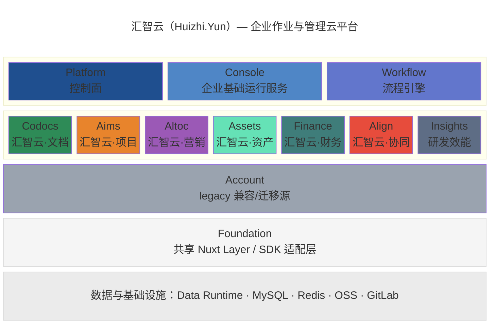
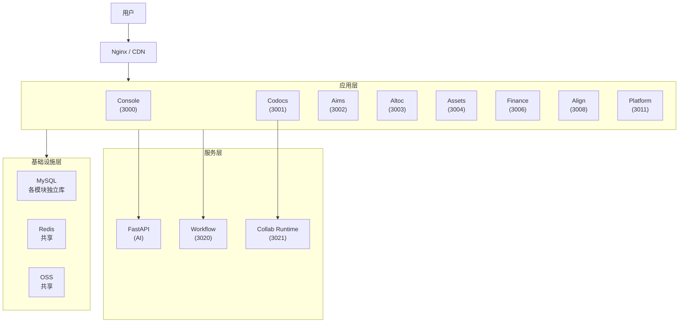

# 汇智云（Huizhi.Yun）产品需求文档

日期：2026年3月14日
作者：周光营
版本：2.0

> 口径收敛说明（2026-06-15）：本文原始版本形成于早期“Account + 五大业务模块”阶段。当前实施基线已经调整为“Platform 控制面 + Console 企业基础运行服务 + Foundation 共享层 + 业务应用矩阵”，`account` 仅作为 legacy 兼容 facade / 迁移源保留。执行排期以 `docs/MODULE_CONTRACTS.md`、`docs/Huizhi-yun-Architecture.md` 和 `docs/Huizhi-yun-Integrated-Operations-Roadmap.md` 为准；本文保留产品愿景和功能需求，但以下模块、数据关系、技术架构与里程碑已按当前事实收敛。

***

## 1. 概述

汇智云（Huizhi.Yun）是面向中小型软件产品 / SaaS 企业的**企业作业与管理云平台**。平台以 AI 与统一数据契约为核心驱动力，通过控制面、企业基础运行服务和业务应用矩阵，支撑产品规划、设计研发、交付运维、项目管理、文档知识资产、市场营销（线索到现金）、人力资源与绩效、资产与财务等完整运营活动，帮助企业实现**全流程数字化、数据互联互通、AI 辅助决策**。

**核心理念：** 不是多个独立工具的拼凑，而是一个数据打通的一体化运营平台——产品规划推动研发，交付运维基于产品开展，研发/交付/运维纳入项目管理，营销围绕产品/解决方案推进，合同与交付项目关联，作业成果沉淀为资产和文档，营销与项目投入产出对接财务管理。

**问题：** 中小型软件企业普遍面临多系统割裂（项目管理用 A、文档用 B、CRM 用 C）、数据孤岛、管理成本高、AI 能力难以落地等痛点。

**为什么是现在：** AI Agent 技术成熟，企业降本增效需求迫切，国产替代窗口期，多重因素叠加形成最佳入场时机。

***

## 2. 产品架构

### 2.1 模块总览



注：`console` 为 Starter 默认包含的客户侧基础运行服务，承接 `org-profile / system-settings / directory-runtime / auth-runtime / integration-config / credential-vault / employee-portal`，不作为独立售卖业务模块。`account` 仅作为迁移期兼容 facade。

### 2.2 模块定义

| 模块        | 英文代号 | 命名含义                      | 定位                                               | 端口 |
| ----------- | -------- | ----------------------------- | -------------------------------------------------- | ---- |
| 平台控制面 | Platform | Control Plane                 | 租户、订阅、部署、License、策略包与应用治理         | 3011 |
| 企业运行服务 | Console | Enterprise Runtime            | 企业配置、目录、认证、凭证保险箱、集成配置、员工入口 | 3000 |
| 汇智云·文档 | Codocs   | Collaborative Docs            | 知识管理与文档协作平台                             | 3001 |
| 汇智云·项目 | Aims     | 目标驱动                      | 研发、交付、运维项目全生命周期管理                 | 3002 |
| 汇智云·营销 | Altoc    | AI-assisted LTC               | 线索到现金经营管理（客户、商机、报价、合同、回款） | 3003 |
| 汇智云·资产 | Assets   | Asset Management              | 产品主档、资产、环境、资源、作业成果资产台账       | 3004 |
| 汇智云·财务 | Finance  | Financial Operations          | 发票、到账、核销、支出、费用、项目财务核算         | 3006 |
| 汇智云·协同 | Align    | Alignment & Collaboration     | 远期可选深度组织协同增强                           | 3008 |
| 研发效能 | Insights | Engineering Insights          | 代码仓库分析、研发效能与质量监测                   | 3009 |
| 流程引擎 | Workflow | Workflow Runtime              | 通用审批流程；目标可收敛到 Console workflow-runtime | 3020 |
| 迁移兼容 | Account  | Legacy Account                | legacy 目录/身份/项目注册表迁移源与兼容 facade     | 3000 |

### 2.2A 基础运行服务（非业务模块）

| 组件 | 说明 | 是否 Starter 默认包含 |
| ---- | ---- | -------------------- |
| `foundation` | 共享代码层 / Nuxt Layer / SDK 适配层，不承载数据库 | 是 |
| `console` | 客户侧基础运行服务，承接企业基础信息、系统参数、外部集成配置、凭证保险箱 | 是 |

### 2.3 模块间数据关系

```
Platform ────────────────────────────────────────────────
  │ 租户/订阅/部署/License/策略包/应用治理
  └──→ Console 与各业务应用：运行授权、应用入口、policy bundle

Console ─────────────────────────────────────────────────
  │ 企业资料/系统参数/目录/认证/凭证保险箱/集成配置/员工入口
  ├──→ Codocs：文档归属、协作权限、审阅人
  ├──→ Aims：项目成员、任务指派、项目注册表
  ├──→ Altoc：销售人员、客户负责人
  ├──→ Assets / Finance：部门、人员、项目、服务凭证
  └──→ Workflow：审批主体、服务 token、回调认证

Assets ←──→ Aims
  │ 产品主档/环境/资产 → 版本、项目、交付视图
  │ 作业成果资产 → 产品/项目/客户/合同分类归档

Aims ←──→ Altoc
  │ 合同/商机 → 交付项目
  │ 合同交付物 → 项目里程碑
  │ 工时/交付进度 → 成本、回款、经营分析
  └ 运维工单 → 缺陷/需求/交付改进

Altoc ←──→ Finance
  │ 合同/回款计划 → 发票、到账、核销
  └ 营销投入/项目收入 → 财务核算与经营报表

Codocs ←──→ Aims / Altoc / Assets / Finance
  │ PRD、方案、合同、交付物、审计附件统一归档
  └ 文档元数据保留业务键，不复制业务主档

Workflow / Align
  │ Workflow 承接通用审批实例与回调
  └ Align 仅在需要深度组织协同、人员借调、HR/轻财务流程时启用
```

***

## 3. 目标与目的

### 3.1 总体目标

* **内部使用：** 提高公司整体运营效率，实现研发、营销、管理的数字化闭环

* **对外销售：** 搭建可商用的 SaaS 平台，为中小型软件企业提供一站式管理解决方案

### 3.2 量化目标

* 覆盖企业**至少 80%** 的核心作业流程（产品 + 研发 + 交付运维 + 营销 + 财务 + 办公）

* 管理企业运营过程中 **100%** 的工作成果，做到**过程可追溯、结果可验证**

* 通过 AI 辅助，提高**至少 30%** 的整体工作效率

* 减少**至少 50%** 的跨系统切换成本（取代多个独立工具）

### 3.3 关键绩效指标（KPI）

| 指标                   | 关联模块       | 目标值        |
| ---------------------- | -------------- | ------------- |
| 任务按期完成率         | Aims           | ≥ 85%         |
| 文档协作活跃度（日活） | Codocs         | ≥ 60% 员工    |
| 审批流程平均耗时       | Workflow / Console | ≤ 24h    |
| 商机转化率             | Altoc          | 提升 20%      |
| 合同-交付项目关联率    | Altoc + Aims   | ≥ 95%         |
| 发票-到账-核销闭环率   | Finance        | ≥ 95%         |
| AI 建议采纳率          | 全平台         | ≥ 50%         |
| 用户跨模块使用率       | 全平台         | ≥ 3 模块/用户 |

***

## 4. 目标用户

### 4.1 企业画像

* 20\~500 人规模的软件企业或软硬结合企业

* 有研发团队，使用 Git 进行代码管理

* 正在使用多个独立工具（Jira + 飞书/钉钉 + Excel + CRM），希望整合

### 4.2 用户角色

| 角色           | 核心使用模块     | 主要诉求                               |
| -------------- | ---------------- | -------------------------------------- |
| 企业管理者/CEO | Console + Altoc + Finance + Aims | 经营数据全局视图，快速审批             |
| 项目经理       | Aims + Codocs    | 项目进度可视化，资源协调               |
| 产品经理       | Aims + Codocs    | 需求管理，PRD 协作                     |
| 开发人员       | Aims + Codocs    | 任务领取，技术文档                     |
| 测试人员       | Aims             | 缺陷跟踪，测试管理                     |
| 销售人员       | Altoc            | 客户管理，商机跟进                     |
| 财务人员       | Finance + Altoc + Aims | 合同回款，发票核销，项目成本与绩效 |
| HR/行政        | Console + Workflow + Align（可选） | 组织目录、流程审批、深度协同 |

### 4.3 核心痛点

* 多系统割裂，数据无法打通，重复录入

* 缺乏从需求到交付的全链路追溯能力

* 管理动作（写日报、催进度、做报表）消耗大量时间

* AI 能力无法有效融入日常工作流

***

## 5. 模块功能需求

> **优先级与阶段说明：**
>
> * **基座优先级：** Platform / Console / Foundation / Workflow 是当前企业 SaaS 运行底座；`Account` 只保留迁移期兼容。
>
> * **业务优先级：** 第一闭环是“产品/方案 → 销售合同 → 交付项目 → 文档/资产沉淀 → 发票/到账/核销 → 经营分析”。
>
> * **应用状态：** Codocs 已上线；Aims、Altoc、Finance 处于 MVP/Beta 推进；Assets 处于设计/脚手架；Align 第一阶段暂缓。
>
> * **协同边界：** 统一员工入口、轻量待办、通知与应用中心由 Console 承接；Align 仅作为深度组织协同增强。

### 5.1 迁移期账号兼容（Account）— ✅ 已上线 / legacy

Account 已实现用户、部门、角色、权限、应用、项目注册表、CAS、LDAP、企业微信、审计等能力，但当前目标不再把它作为新平台底座。新增目录、身份、权限和服务认证能力应走 Console Directory Runtime、Console OIDC、Platform policy bundle 与 Foundation adapter；Account 仅作为 legacy 数据迁移源和兼容 facade。

| 功能         | 状态 | 说明                                             |
| ------------ | ---- | ------------------------------------------------ |
| 用户管理     | ✅    | CRUD、禁用、头像、个人信息                       |
| 部门管理     | ✅    | 多级部门树、部门成员、负责人、委员会             |
| 角色与权限   | ✅    | 角色 CRUD、资源权限（view/edit/admin）、权限继承 |
| 应用管理     | ✅    | 内部/外部应用、SSO 配置、应用 Secret             |
| API 密钥管理 | ✅    | 密钥 CRUD、Scope、速率限制、IP 白名单            |
| CAS 单点登录 | ✅    | CAS 登录/回调                                    |
| 企业微信登录 | ✅    | OAuth 登录、消息推送                             |
| LDAP 同步    | ✅    | 用户目录同步、属性映射                           |
| 钉钉同步     | ✅    | 组织架构同步、用户信息同步                       |
| 项目管理     | ✅    | 项目 CRUD、项目树、项目成员、GitLab 同步         |
| 审计日志     | ✅    | 登录日志、操作日志、API 调用日志                 |

### 5.2 汇智云·文档（Codocs）— ✅ 已实现

知识管理与文档协作平台。

| 功能                | 状态 | 说明                                        |
| ------------------- | ---- | ------------------------------------------- |
| 文档 CRUD           | ✅    | 创建、编辑、删除、文件夹组织                |
| Milkdown 富文本编辑 | ✅    | Markdown 所见即所得、代码高亮、Mermaid 图表 |
| 实时协作            | ✅    | Collab Runtime + Y.js CRDT，多人同时编辑    |
| 文档分类            | ✅    | 私有/部门/项目/公司/知识库                  |
| 版本管理            | ✅    | 版本历史、差异对比、版本回滚                |
| 文档分享            | ✅    | 用户/部门/组织级分享，读写权限              |
| 文档注释            | ✅    | 内容标注、评论线程、回复                    |
| 审阅发文            | ✅    | 多级审批流、委员会审阅、状态追踪            |
| 项目文档同步        | ✅    | GitLab 双向同步、冲突检测与解决             |
| 文档模板            | ✅    | 模板管理、基于模板新建                      |
| 资讯管理            | ✅    | 文章/新闻发布（后续迁移至 Align）           |
| 工作日志            | ✅    | 日报管理（后续迁移至 Align）                |
| 回收站              | ✅    | 软删除、恢复、永久删除                      |
| 图片管理            | ✅    | OSS 存储、元数据关联、孤立图片清理          |
| 导出功能            | ✅    | 导出为 DOCX 格式                            |

### 5.3 汇智云·项目（Aims）— 🟡 MVP/Beta 开发中

目标驱动的研发项目全生命周期管理。

#### 5.3.1 项目管理

* 项目立项申请与审批（对接 Workflow / Console service token）

* 项目信息管理（变更/关闭/归档）

* 项目仪表板：进度概览、风险预警

* 版本规划与发布：版本号管理、发布日期、Changelog 自动生成

#### 5.3.2 需求管理

* 需求创建与分析（AI 辅助需求拆解）

* 需求评审与变更追踪

* 需求追溯矩阵（需求 → 任务 → 代码 → 测试用例）

* 需求与 Codocs 文档双向关联

#### 5.3.3 迭代与任务管理

* **迭代管理：** Sprint/Cycle 规划、迭代评审、回顾

* **看板管理：** Kanban 视图、WIP 限制、泳道

* **任务管理：**

  * 任务层级（Epic → Story → Task → Sub-task）

  * AI 驱动的 WBS 任务分解

  * 工期估算与依赖关系（甘特图）

  * 智能排期与资源分配

  * 任务状态自动流转

#### 5.3.4 缺陷管理

* Bug 创建、指派、跟踪（从 Codocs Issue 模块迁移增强）

* 缺陷与需求/任务/代码关联

* 缺陷统计与趋势分析

#### 5.3.5 代码管理

* GitLab API 深度集成（仓库/分支/MR）

* 代码提交与任务自动关联

* 代码审查流程（MR/PR 评审）

* 代码质量看板（静态分析集成）

#### 5.3.6 测试管理

* 测试计划与测试用例管理

* 测试执行与报告

* 缺陷关联与回归追踪

#### 5.3.7 报表与度量

* 燃尽图、迭代速度趋势

* 人员工时统计、任务完成率

* 代码贡献分析（基于 nuxt-template 模块扩展）

* AI 洞察报表

### 5.4 汇智云·营销（Altoc）— 🟡 MVP 一期基本完成 / 开发中

AI 辅助的线索到现金（LTC）全流程管理。覆盖从线索发现到回款计划的完整经营链路：**线索 → 商机 → 报价 → 合同 → 交付项目关联 → 回款计划 → 运维线索**。发票、到账、核销、支出与项目财务核算由 Finance 承接；产品主档、资产、环境与资源由 Assets 承接。

#### 5.4.1 客户管理（CRM）

* 客户信息管理（企业客户、联系人、决策链）

* 客户标签与分类

* AI 客户画像分析

* 客户跟进记录与提醒

* 客户关系地图（组织架构 + 决策影响力）

#### 5.4.2 商机管理

* 线索录入与 AI 智能评分

* 商机阶段管理（漏斗视图）

* 商机转化率分析

* 竞品关联分析

* 商机赢率预测（AI 辅助）

#### 5.4.3 产品与报价管理

* 产品/服务目录引用（权威主档来自 Assets）

* 价格策略管理（标准价、折扣规则、阶梯报价）

* 报价单创建与审批（对接 Workflow）

* 报价模板管理

* 报价版本追踪（历史报价对比）

* 产品组合与套餐配置

#### 5.4.4 销售过程管理

* 销售阶段定义与流转（可配置的销售方法论）

* 销售活动记录（拜访、电话、演示、投标）

* 销售任务与日程管理

* 销售团队协作（协同跟进、角色分工）

* 投标管理（标书关联 Codocs 文档）

* 销售漏斗与预测看板

* AI 销售教练（下一步行动建议）

#### 5.4.5 合同管理

* 合同创建与审批（对接 Workflow）

* 合同模板管理

* 合同执行跟踪（交付物关联 Aims 项目里程碑）

* 合同变更与续约

* 合同到期预警

#### 5.4.6 回款计划管理

* 回款计划制定（关联合同付款条款：预付款/里程碑款/验收款/质保金）

* 开票申请发起（后续由 Finance 生成与管理发票）

* 回款进度跟踪（到账确认与发票核销由 Finance 管理）

* 逾期应收预警与催收提醒

* 回款进度看板（按客户/合同/项目维度）

* 坏账管理

* DSO（应收账款周转天数）分析

#### 5.4.7 运行维护管理

* 客户服务工单（报障、咨询、需求）

* SLA 服务级别协议管理

* 维保合同管理（关联原始合同，到期续签提醒）

* 运维任务指派与跟踪

* 客户满意度调查

* 运维知识库（常见问题、解决方案，关联 Codocs）

* 服务报告生成

#### 5.4.8 经营财务视图

* 收入预测与回款计划看板（数据来自合同与 Finance）

* 项目毛利预估（关联 Aims 工时与 Finance 成本）

* 基础经营报表（收入/成本/利润视图）

* 费用报销入口链接到 Finance / Workflow

> 注：Altoc 不做发票、到账、核销和完整财务核算，这些由 Finance 承接；也不做完整会计账套（总账、凭证），与金蝶/用友互补而非竞争。

#### 5.4.9 进销存管理（轻量）

* 供应商管理

* 采购订单与入库

* 销售出库与发货

* 库存查询与预警

* 进销存报表

> 注：作为 LTC 闭环的一部分，保障合同交付过程中的物资管理，非独立 ERP。产品主档和资产库存的权威事实源为 Assets，Altoc 仅引用销售所需快照。

### 5.4A 汇智云·财务（Finance）— 🟡 v0.1-v0.3 MVP 实现中

Finance 承接经营财务中台能力，重点服务“合同/项目/费用/发票/到账/核销”的管理闭环，不替代完整会计总账系统。

* 发票管理：发票申请、开票记录、发票状态、合同/回款计划关联
* 到账管理：银行到账登记、客户/合同/项目归集
* 核销管理：到账、发票、回款计划之间的匹配与核销
* 支出与费用：费用申请、报销、付款申请、Workflow 审批
* 项目财务：项目收入、成本、毛利、投入产出与绩效口径
* 财务看板：应收、逾期、DSO、项目利润、营销与项目投入产出

#### 5.4.10 营销分析

* 销售漏斗与转化分析

* 回款趋势与 DSO 分析

* 客户 LTV（生命周期价值）分析

* 销售人员业绩排行

* 运维服务质量分析

* AI 销售预测与经营洞察

### 5.5 汇智云·协同（Align）— 🟡 远期规划

Align 调整为远期可选深度组织协同增强应用，不再承担全平台统一工作入口。统一员工入口、应用中心、轻量待办、通知公告和简单事项入口由 Console 承接；Align 仅在需要完整协同业务对象、人员借调、协同 SLA、HR/轻财务台账时启用。

若启用 Align，可聚焦企业微信/钉钉做不好的深度协同场景，并按需对接钉钉能力（考勤、审批）。

#### 5.5.1 审批管理（对接钉钉）

* 普通审批流程对接钉钉 OA 审批：在 Align 深度协同对象中发起审批，通过 Console workflow-runtime 或钉钉审批引擎执行

* 审批模板管理：在 Align 中定义审批表单，同步至钉钉审批模板

* 审批数据回写：从钉钉获取审批结果与流程数据，在 Align 中统一展示

* 审批记录查询与统计

* 承接各模块的审批需求（发文、合同、报销、立项等）

* 特殊审批流程（如文档审阅发文）保留平台内置引擎

#### 5.5.2 HR 管理（对接钉钉考勤）

* **考勤管理：** 对接钉钉智能考勤，自动同步打卡/外勤/请假/加班数据

* **考勤报表：** 月度考勤汇总、异常考勤提醒、部门考勤统计

* **假期管理：** 年假/调休/事假/病假额度管理与审批（通过钉钉审批）

* **加班管理：** 加班申请、调休兑换、加班统计

* **员工档案：** 入职/转正/调岗/离职流程管理（基于 Account 组织架构）

* **薪酬基础：** 考勤数据为薪酬计算提供基础数据（不做完整薪酬模块）

#### 5.5.3 OKR 管理

* 目标设定与对齐（公司 → 部门 → 个人）

* 关键结果追踪（关联 Aims 项目进度）

* OKR 评审周期管理

* 目标达成率分析

#### 5.5.4 公告与通知

* 公司公告发布（从 Codocs 迁移）

* 通知中心（聚合所有模块的通知）

* 多渠道推送（站内信、邮件、企业微信、钉钉）

#### 5.5.5 日报周报

* 工作日志管理（从 Codocs 迁移）

* AI 自动生成日报（基于 Aims 任务完成数据 + Codocs 文档编辑记录）

* 周报/月报汇总

* 管理者团队报告视图

#### 5.5.6 会议管理

* 会议预约与日程

* 会议纪要（关联 Codocs 文档）

* 会议决议追踪

* AI 会议摘要

#### 5.5.7 企业知识搜索

* 全平台统一搜索（文档、任务、客户、公告等）

* AI 智能问答（基于企业知识库）

***

## 6. AI 能力规划

AI 不是独立模块，而是贯穿所有模块的底层能力。

| AI 能力      | 应用场景                         | 关联模块 |
| ------------ | -------------------------------- | -------- |
| 智能文档助手 | 文档写作辅助、内容润色、翻译     | Codocs   |
| 需求分析     | 自然语言需求 → 结构化用户故事    | Aims     |
| WBS 分解     | 需求自动拆解为任务树             | Aims     |
| 智能排期     | 基于历史数据的工期估算与资源分配 | Aims     |
| 代码审查     | MR/PR 自动审查，代码质量建议     | Aims     |
| 日报生成     | 基于任务完成记录自动生成日报     | Console / Aims |
| 客户分析     | 客户画像、商机评分、流失预警     | Altoc    |
| 销售预测     | 基于历史数据的收入预测           | Altoc    |
| 智能搜索     | 跨模块语义搜索、知识问答         | 全平台   |

***

## 7. 非功能性需求

* **SaaS 化：** 按企业隔离数据，支持多企业，支持私有化部署

* **性能：** 页面加载 < 2s，API 响应 < 500ms，WebSocket 实时同步延迟 < 200ms

* **安全性：** 数据加密（AES-256）、HTTPS、RBAC 权限控制、审计日志

* **可扩展性：** Monorepo + 独立模块架构，模块可独立部署和扩展

* **可靠性：** 服务正常运行时间 ≥ 99.5%，数据自动备份

* **兼容性：** 支持 Chrome、Edge、Firefox，响应式适配移动端

***

## 8. 用户体验设计原则

* 简洁的用户界面，符合中国企业用户习惯

* 界面语言：中文（预留国际化扩展）

* 界面风格：现代简约，参考飞书/Notion 交互体验

* 深色和浅色模式

* 交互模式：简单操作列表内完成，复杂操作弹窗/抽屉处理

* 模块间无缝跳转，统一导航体验

* 移动端优先适配审批、通知、任务查看等高频场景

***

## 9. 技术架构

### 9.1 技术栈

| 层级                | 技术选型                  | 说明                                  |
| ------------------- | ------------------------- | ------------------------------------- |
| 前端框架            | Nuxt 4 + Vue 3            | SSR/SPA 混合模式                      |
| UI 组件库           | Nuxt UI v4 + Tailwind CSS | 统一设计语言                          |
| 编辑器              | Milkdown (Crepe)          | Markdown 所见即所得                   |
| 实时协作            | Collab Runtime + Y.js     | CRDT 无冲突协同                       |
| 后端（Nitro）       | Nuxt Server / Nitro       | 轻量 API 路由                         |
| 后端（AI/计算密集） | FastAPI + Python          | AI 推理、数据分析                     |
| 数据库              | MySQL 8.0                 | 关系型数据存储                        |
| 缓存                | Redis                     | 会话、热数据、消息队列                |
| 对象存储            | 阿里云 OSS                | 文档、图片、附件                      |
| 代码托管            | GitLab（自建）            | 代码仓库、CI/CD                       |
| AI 引擎             | Claude API / 本地模型     | 智能辅助能力                          |
| 认证                | Console OIDC + 企业 IdP（CAS/企业微信/LDAP 等） | 统一应用侧登录与服务认证 |
| 服务认证            | Console service token JWT | 跨模块服务端调用、回调、同步与写操作 |
| 钉钉集成            | 钉钉开放平台 API          | 可选考勤、OA 审批、组织同步、工作通知 |
| 消息推送            | 企业微信 + 钉钉 + 邮件    | 多渠道通知                            |

### 9.2 部署架构



### 9.3 模块间通信

* 同步调用：模块间通过 HTTP API、Foundation adapter 与 tenant-runtime/data-runtime contract 完成

* 服务认证：服务端调用、回调、同步和写操作统一使用 Console 签发的 `token_use=service` JWT

* 事实源约束：禁止跨模块数据库直连；跨模块引用使用 `uid`、`dept_code`、`project_code`、`uuid`、`biz_id` 等稳定业务键

***

## 10. 当前推进路线

详细执行路线见 `docs/Huizhi-yun-Integrated-Operations-Roadmap.md`。本文不再维护早期固定日期式里程碑，当前按能力闭环推进：

| 阶段 | 目标 | 交付口径 |
| ---- | ---- | -------- |
| Phase 0 | 文档与契约收敛 | 统一 Platform / Console / Foundation / Account legacy / 业务应用边界 |
| Phase 1 | 基础对象模型 | 统一产品、项目、客户、合同、资产、财务对象的业务键和跨模块引用规则 |
| Phase 2 | 首条经营闭环 | 产品/方案 → 商机/报价/合同 → Aims 交付项目 → Codocs 交付文档 → Finance 发票/到账/核销 |
| Phase 3 | 项目与交付运维深化 | 需求、版本、迭代、工单、缺陷、运维和资产环境视图连通 |
| Phase 4 | 资产与知识沉淀 | 作业成果归档为文档和资产，形成可复用知识资产与产品资产 |
| Phase 5 | 经营分析与绩效 | 营销、项目、交付、财务、人员投入产出进入统一经营视图 |

***

## 11. 成功标准

### 基础运行验收标准

* Console 支撑企业目录、认证、应用入口、集成配置、凭证保险箱和 service token 主路径
* Platform 支撑租户、订阅、部署、License、policy bundle 与运行时心跳
* 新增跨模块服务端调用不再引入静态共享密钥或 Account API 主路径

### 业务闭环验收标准

* 产品/方案、客户、商机、报价、合同、项目、文档、资产、发票、到账和核销之间有稳定业务键关联
* LTC 全流程线上化覆盖率 ≥ 90%（线索 → 商机 → 报价 → 合同 → 交付项目 → 回款计划）
* 合同-交付项目关联率 ≥ 95%
* 发票-到账-核销闭环率 ≥ 95%
* 研发项目管理覆盖率 ≥ 80%（需求 → 任务 → 代码 → 测试 → 发布）
* 交付成果进入 Codocs / Assets 的归档率 ≥ 90%
* 经营看板能同时查看营销收入、项目成本、回款状态和人员投入产出

***

## 12. 风险与应对

| 风险                     | 影响     | 概率 | 应对措施                                                         |
| ------------------------ | -------- | ---- | ---------------------------------------------------------------- |
| 模块过多，开发资源不足   | 延期     | 高   | 严格分期，Phase 1-2 优先；每个 Phase 交付可用产品                |
| AI API 服务不稳定/成本高 | 功能受限 | 中   | 核心功能不强依赖 AI；AI 为增强而非必须                           |
| 用户习惯迁移困难         | 推广慢   | 中   | 渐进式推广；先单模块切入再扩展                                   |
| 与钉钉/企微功能重叠      | 定位模糊 | 中   | Console/Workflow 承接通用入口和审批，Align 仅做深度协同增强 |
| 钉钉 API 变更或限制      | 功能受限 | 低   | 抽象钉钉适配层，预留企微等替代通道                               |
| 多模块数据一致性         | 数据质量 | 中   | 明确事实源和业务键；通过 API、service token、事件/补偿任务衔接 |

***

## 13. 审批与利益相关者

| 角色 | 姓名   | 审批 |
| ---- | ------ | ---- |
| 产品 | 周光营 | ✅    |
| 设计 | -      | ⏳    |
| 工程 | -      | ⏳    |
| 法律 | -      | ⏳    |

***

## 14. 附录

### 14.1 国内竞品分析

| 竞品         | 定位               | 核心优势                  | 劣势/缺口                 | 参考价值               |
| :----------- | :----------------- | :------------------------ | :------------------------ | :--------------------- |
| **PingCode** | 研发全生命周期管理 | 覆盖深度深，敏捷/瀑布双模 | 配置复杂，无营销/财务模块 | 学习模块划分和关联逻辑 |
| **ONES**     | 企业级研发管理     | 高度可配置，报表引擎强    | 价格昂贵，不够轻量        | 参考度量报表设计       |
| **Coding**   | 一站式 DevOps      | 代码托管与 CI/CD 强       | 项目管理偏弱              | 参考代码-任务自动关联  |
| **飞书**     | 协同办公平台       | OKR + 文档 + 审批一体化   | 研发管理/CRM 弱           | 参考文档协作体验       |
| **纷享销客** | CRM/营销管理       | LTC 流程完整              | 无研发管理                | 参考 CRM 功能设计      |

**汇智云差异化定位：** 市面上很少有产品能同时覆盖“产品规划 + 研发交付运维 + 文档知识资产 + LTC 经营 + 资产财务 + 组织协同”并保持数据互通。汇智云的核心壁垒是**跨模块业务键、统一运行底座、经营闭环数据和 AI 贯穿全流程**。

### 14.2 市场前景判定（SWOT 分析）

**优势（Strengths）：**

* **一体化平台：** 五大模块数据互通，取代多个独立工具

* **AI 原生架构：** AI Agent 驱动流程，非简单 AI 插件

* **已有基座：** Account + Codocs 已上线运行，技术验证完成

* **全流程闭环：** 从需求到交付到回款的完整链路

**劣势（Weaknesses）：**

* **品牌认知：** 新产品，缺乏大厂品牌背书

* **功能广度 vs 深度：** 五大模块全部做深需要大量资源

* **生态壁垒：** 早期缺乏第三方集成生态

**机会（Opportunities）：**

* **AI Agent 窗口期：** 企业急需"能干活"的 AI 工具

* **中小企业降本增效：** 一站式平台比多工具组合成本更低

* **国产替代：** Jira、Salesforce 等国外工具受限或涨价

**威胁（Threats）：**

* **巨头跟进：** 飞书、钉钉持续扩展能力边界

* **用户迁移成本：** 已使用其他工具的企业切换意愿有限

**结论：** 汇智云的核心定位是 **"AI 驱动的中小软件企业一体化作业平台"**——不是做最深的研发管理工具（PingCode），也不是做最广的协同办公（飞书），而是做**最懂软件企业的一站式平台**，用数据打通和 AI 驱动构建差异化壁垒。

### 14.3 术语表

| 术语 | 说明                                                   |
| ---- | ------------------------------------------------------ |
| LTC  | Lead to Cash，线索到现金，华为营销管理方法论           |
| WBS  | Work Breakdown Structure，工作分解结构                 |
| OKR  | Objectives and Key Results，目标与关键成果             |
| CRDT | Conflict-free Replicated Data Type，无冲突复制数据类型 |
| IAM  | Identity and Access Management，身份与访问管理         |
| CAS  | Central Authentication Service，集中认证服务           |
| LTV  | Lifetime Value，客户生命周期价值                       |
| DSO  | Days Sales Outstanding，应收账款周转天数               |
| SLA  | Service Level Agreement，服务级别协议                  |
