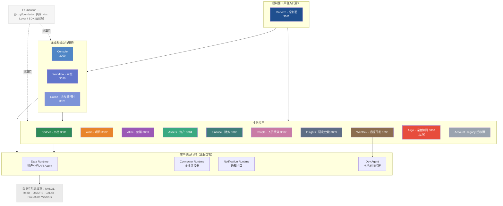
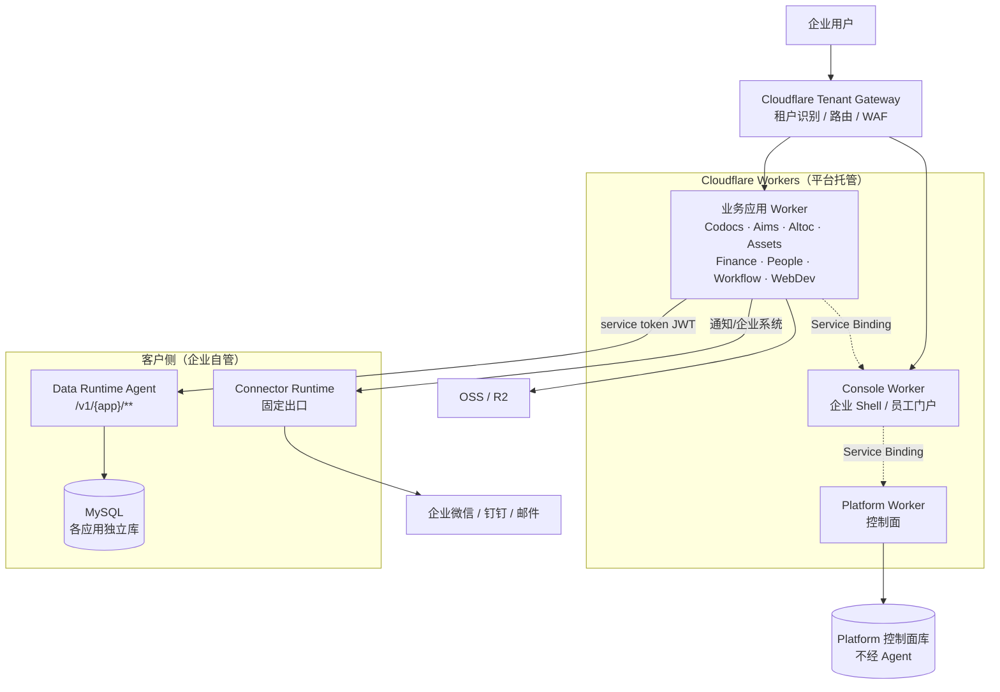

# 汇智云（Huizhi.Yun）产品需求文档

日期：2026年8月26日
作者：周光营
版本：3.0（上一版 2.0 / 2026-03-14，2026-06-15 做过一次口径收敛）

> **本次修订说明（2026-08-26）**
>
> v2.0 的结构仍停留在「Account + 五大业务模块」的早期形态，2026-06-15 只做了文字层面的收敛。本次按当前工程事实重写，主要变化：
>
> 1. **补齐缺失模块。** People（人员事实与绩效）、Assets（资产，此前无功能章节）、Insights（研发效能）、WebDev（远程开发代理）、Collab（协作运行时）进入正式章节；Platform / Console / Workflow 从「注释」升为独立功能章节。
> 2. **补齐运行时层。** Data Runtime、Connector Runtime、Notification Runtime、Dev Agent 四个 Go 运行时纳入架构与技术栈。
> 3. **新增第 5 章「交付与商业化模式」。** 明确 `managed-cloud-agent` / `self-hosted` 两条交付主线、License-Capability 授权模型与订阅计费链路（ADR-014）。
> 4. **技术架构重写。** 从「Nginx + PM2 多应用」更新为「Cloudflare Workers 托管应用运行时 + 客户侧 Data Runtime Agent 自管数据面」，并写入 Console 零直连数据面切换结论（ADR-017）。
> 5. **状态口径全部换成实测值。** 各模块完成度、闭环阶段进度与验收结论均标注核验日期与来源文档，不再使用无出处的「已完成」。
> 6. **仓库形态更新。** 2026-08-22 完成多仓合并，当前为单一 Git monorepo，组件级发布 Tag `<component>/vX.Y.Z`。
>
> **口径边界：** 本文只承载产品愿景、目标、功能范围与商业化模式。执行排期以 [`Huizhi-yun-Integrated-Operations-Roadmap.md`](./Huizhi-yun-Integrated-Operations-Roadmap.md) 与 [`SME-Landing-Priority-Directions-2026-07.md`](./SME-Landing-Priority-Directions-2026-07.md) 为准；架构现状以 [`Huizhi-yun-Architecture.md`](./Huizhi-yun-Architecture.md) 为准；跨模块契约以 [`MODULE_CONTRACTS.md`](./MODULE_CONTRACTS.md) 为准。文档导航入口见 [`START_HERE.md`](./START_HERE.md)。

***

## 1. 概述

汇智云（Huizhi.Yun）是面向中小型软件产品 / SaaS 企业的**企业作业与管理云平台**。平台以 AI 与统一数据契约为核心驱动力，通过控制面、企业基础运行服务、业务应用矩阵和客户侧运行时，支撑产品规划、设计研发、交付运维、项目管理、文档知识资产、市场营销（线索到现金）、人力资源与绩效、资产与财务等完整运营活动，帮助企业实现**全流程数字化、数据互联互通、AI 辅助决策**。

**核心理念：** 不是多个独立工具的拼凑，而是一个数据打通的一体化运营平台——产品规划推动研发，交付运维基于产品开展，研发/交付/运维纳入项目管理，营销围绕产品/解决方案推进，合同与交付项目关联，作业成果沉淀为资产和文档，营销与项目投入产出对接财务与人员绩效。

**问题：** 中小型软件企业普遍面临多系统割裂（项目管理用 A、文档用 B、CRM 用 C）、数据孤岛、管理成本高、AI 能力难以落地等痛点。

**为什么是现在：** AI Agent 技术成熟，企业降本增效需求迫切，国产替代窗口期，多重因素叠加形成最佳入场时机。

**架构立场（v3.0 新增）：** 汇智云的核心不是「托管客户所有业务数据」，而是**统一控制面 + 客户自管数据面**。平台托管应用运行时，客户在自己一侧部署 Data Runtime Agent 持有数据库，既解决 SME 的低运维诉求，也解决中大型客户的数据自主诉求。

***

## 2. 产品架构

### 2.1 分层总览


```mermaid
flowchart TB
  subgraph CP["控制面（平台方托管）"]
    Platform["Platform · 控制面<br>3011"]
  end

  subgraph BASE["企业基础运行服务"]
    Console["Console<br>3000"]
    Workflow["Workflow · 审批<br>3020"]
    Collab["Collab · 协作运行时<br>3021"]
  end

  subgraph APPS["业务应用"]
    Codocs["Codocs · 文档 3001"]
    Aims["Aims · 项目 3002"]
    Altoc["Altoc · 营销 3003"]
    Assets["Assets · 资产 3004"]
    Finance["Finance · 财务 3006"]
    People["People · 人员绩效 3007"]
    Insights["Insights · 研发效能 3009"]
    WebDev["WebDev · 远程开发 3090"]
    Align["Align · 深度协同 3008<br>（远期）"]
    Account["Account · legacy 迁移源"]
  end

  Foundation["Foundation — @hzy/foundation 共享 Nuxt Layer / SDK 适配层"]

  subgraph RT["客户侧运行时（企业自管）"]
    DataRT["Data Runtime<br>租户业务 API Agent"]
    ConnRT["Connector Runtime<br>企业连接器"]
    NotifRT["Notification Runtime<br>通知出口"]
    DevAgent["Dev Agent<br>本地执行代理"]
  end

  Infra["数据与基础设施：MySQL · Redis · OSS/R2 · GitLab · Cloudflare Workers"]

  CP --> BASE
  CP --> APPS
  BASE --> APPS
  Foundation -. 共享层 .-> BASE
  Foundation -. 共享层 .-> APPS
  APPS --> RT
  BASE --> RT
  WebDev --> DevAgent
  RT --> Infra

  style Platform fill:#1F4F8F,color:#fff
  style Console fill:#4F86C6,color:#fff
  style Workflow fill:#6276cc,color:#fff
  style Collab fill:#7C93D8,color:#fff
  style Codocs fill:#2E8B57,color:#fff
  style Aims fill:#E8842C,color:#fff
  style Altoc fill:#9B59B6,color:#fff
  style Assets fill:#3AA981,color:#fff
  style Finance fill:#3F7D7A,color:#fff
  style People fill:#C97BA5,color:#fff
  style Insights fill:#5E6D85,color:#fff
  style WebDev fill:#8B6D4F,color:#fff
  style Align fill:#E74C3C,color:#fff
  style Account fill:#9AA3AF,color:#fff
  style Foundation fill:#F5F5F5,stroke:#DDD,color:#666
  style Infra fill:#EBEBEB,stroke:#DDD,color:#666
```

四层职责：

| 层 | 组件 | 职责 | 归属 |
| --- | --- | --- | --- |
| 控制面 | `platform` | 租户、订阅、部署、License、策略包、应用治理、Runtime 发布 | 平台方托管 |
| 企业基础运行服务 | `console`、`workflow`、`collab` | 企业配置、目录、认证、凭证保险箱、集成配置、员工门户、审批流程、实时协作 | 随交付模式落位 |
| 业务应用 | `codocs`、`aims`、`altoc`、`assets`、`finance`、`people`、`insights`、`webdev`、`align` | 各业务域作业能力 | 随交付模式落位 |
| 客户侧运行时 | `data-runtime`、`connector-runtime`、`notification-runtime`、`dev-agent` | 数据面、企业系统连接、通知出口、本地开发执行 | 客户一侧部署 |

`foundation` 横跨全部 Nuxt 模块，是统一认证、目录、权限、审批与共享 UI 的唯一实现来源，不承载数据库。

### 2.2 模块定义

| 模块 | 英文代号 | 命名含义 | 定位 | 端口 |
| --- | --- | --- | --- | --- |
| 平台控制面 | Platform | Control Plane | 租户、订阅、部署、License、策略包、应用治理、Runtime 发布 | 3011 |
| 企业运行服务 | Console | Enterprise Runtime | 企业配置、目录、认证、凭证保险箱、集成配置、员工门户、企业 Shell | 3000 |
| 汇智云·文档 | Codocs | Collaborative Docs | 知识管理与文档协作平台 | 3001 |
| 汇智云·项目 | Aims | 目标驱动 | 研发、交付、运维项目全生命周期管理 | 3002 |
| 汇智云·营销 | Altoc | AI-assisted LTC | 线索到现金经营管理（客户、商机、报价、合同、回款） | 3003 |
| 汇智云·资产 | Assets | Asset Management | 实物/资源资产、环境与交付视图、采购到处置全流程 | 3004 |
| 汇智云·财务 | Finance | Financial Operations | 发票、到账、核销、支出、费用、项目财务核算 | 3006 |
| 汇智云·人员 | People | People & Performance | 人员事实、任职、成本快照、项目贡献与绩效 | 3007 |
| 汇智云·协同 | Align | Alignment & Collaboration | 远期可选深度组织协同增强 | 3008 |
| 研发效能 | Insights | Engineering Insights | 代码仓库分析、研发效能与质量监测 | 3009 |
| 流程引擎 | Workflow | Workflow Runtime | 通用审批流程；目标可收敛到 Console workflow-runtime | 3020 |
| 协作运行时 | Collab | Collab Runtime | Yjs / WebSocket 实时协作；默认由 Console 内嵌启动 | 3021 |
| 远程开发 | WebDev | Remote Dev Console | ADR-015 远程开发代理控制台（PoC） | 3090 |
| 迁移兼容 | Account | Legacy Account | legacy 目录/身份/项目注册表迁移源与兼容 facade | 3000 |

> `console` 是 Starter 默认包含的客户侧基础运行服务，不作为独立售卖业务模块。`account` 仅作为迁移期兼容 facade 与数据迁移源，默认不纳入新功能范围。

### 2.3 共享层与客户侧运行时

| 组件 | 类型 | 说明 | Starter 默认包含 |
| --- | --- | --- | --- |
| `foundation` | 共享代码层 | `@hzy/foundation` Nuxt Layer / SDK 适配层，统一认证、目录、权限、审批代理、Service Token、runtime helper 与共享 UI；不承载数据库 | 是 |
| `data-runtime` | Go 运行时 | tenant-runtime 业务 API Agent，部署在客户数据库一侧，为 Finance / Workflow / Assets / People / Altoc / Aims / Codocs / WebDev 提供 `/v1/<app>/**` 契约化数据面 | 是（`managed-cloud-agent`） |
| `connector-runtime` | Go 运行时 | 企业连接器运行时，从客户固定出口执行编译期固化的企业能力（不接受任意 URL / 脚本 / 插件） | 按需 |
| `notification-runtime` | Go 运行时 | 通知固定出口（首阶段企业微信 textcard）；`connector-runtime` 的兼容前身，迁移期保持接口兼容 | 按需 |
| `dev-agent` | Go 运行时 | ADR-015 本地开发执行代理，监听 `127.0.0.1`，只执行配置化仓库/命令模板，经 Cloudflare Tunnel 由 WebDev 调用 | 内部 |

### 2.4 模块间数据关系

```text
Platform ────────────────────────────────────────────────
  │ 租户/订阅/部署/License/策略包/应用治理/Runtime 发布
  └──→ Console 与各业务应用：运行授权、应用入口、签名 policy bundle

Console ─────────────────────────────────────────────────
  │ 企业资料/系统参数/目录/认证/凭证保险箱/集成配置/员工门户/企业 Shell
  │ 授权事实源：企业角色、应用角色组合、数据范围、service grant
  ├──→ Codocs：文档归属、协作权限、审阅人
  ├──→ Aims：项目成员、任务指派、项目注册表
  ├──→ Altoc：销售人员、客户负责人
  ├──→ Assets / Finance / People：部门、人员、项目、服务凭证
  └──→ Workflow：审批主体、service token、回调认证

Assets ←──→ Aims
  │ 产品主档/环境/资产 → 版本、项目、交付视图
  │ 作业成果资产 → 产品/项目/客户/合同分类归档

Aims ←──→ Altoc
  │ 合同/商机 → 交付项目；合同交付物 → 项目里程碑
  │ 工时/交付进度 → 成本、回款、经营分析
  └ 运维工单 → 缺陷/需求/交付改进

Altoc ←──→ Finance
  │ 合同/回款计划 → 开票申请、发票、到账、核销
  └ 营销投入/项目收入 → 财务核算与经营报表

People ←──→ Aims / Finance
  │ Aims 项目参与、任务、工时 → People 项目贡献快照
  │ Finance 人力成本参数 → People 月度成本快照
  └ People 成本/贡献快照 → Finance 项目核算与绩效金额口径

Insights ──→ Aims
  │ 代码贡献、质量与效能指标 → 研发度量视图（当前为独立库，非 tenant-runtime）

Codocs ←──→ Aims / Altoc / Assets / Finance / People
  │ PRD、方案、合同、交付物、岗位说明、审计附件统一归档
  └ 文档元数据保留业务键，不复制业务主档

Workflow / Align
  │ Workflow 承接通用审批实例与回调
  └ Align 仅在需要深度组织协同、人员借调、HR/轻财务流程时启用
```

**跨模块硬约束：**

- 禁止跨模块数据库直连，必须走 API、Foundation adapter 或 tenant-runtime 契约。
- 跨模块稳定标识：`uid`（用户）、`dept_code`（部门）、`project_code`（项目）、`uuid`（文档）、`biz_id`（业务对象）。
- 跨应用调用路径固定为「调用方 BFF → 目标应用 Service API → 目标应用自己的 tenant-runtime」，不得直连他人 runtime。
- 跨应用 capability 统一 `<target-app>:<resource>:<action>` 小写 kebab-case 格式。

***

## 3. 目标与目的

### 3.1 总体目标

* **内部使用：** 提高公司整体运营效率，实现研发、营销、管理的数字化闭环
* **对外销售：** 搭建可商用的 SaaS 平台，为中小型软件企业提供一站式管理解决方案
* **双月落地（2026-09/10）：** 9 月 Aims 项目管理在公司落地应用；10 月上线 Altoc 与 Finance，把软件开发、交付、运维服务、软件销售、回款五类主营业务纳入系统管理，「合同 → 交付 → 开票 → 回款 → 核算」跑成真实业务而非演示。详见 [`双月落地计划-2026-09-10.md`](./双月落地计划-2026-09-10.md)

### 3.2 量化目标

* 覆盖企业**至少 80%** 的核心作业流程（产品 + 研发 + 交付运维 + 营销 + 财务 + 人员 + 办公）
* 管理企业运营过程中 **100%** 的工作成果，做到**过程可追溯、结果可验证**
* 通过 AI 辅助，提高**至少 30%** 的整体工作效率
* 减少**至少 50%** 的跨系统切换成本（取代多个独立工具）

### 3.3 关键绩效指标（KPI）

| 指标 | 关联模块 | 目标值 |
| --- | --- | --- |
| 任务按期完成率 | Aims | ≥ 85% |
| 文档协作活跃度（日活） | Codocs | ≥ 60% 员工 |
| 审批流程平均耗时 | Workflow / Console | ≤ 24h |
| 商机转化率 | Altoc | 提升 20% |
| 合同-交付项目关联率 | Altoc + Aims | ≥ 95% |
| 发票-到账-核销闭环率 | Finance | ≥ 95% |
| 回款逾期识别时效 | Altoc + Finance | 逾期当日标记并通知责任人 |
| 项目工时填报覆盖率 | Aims + People | ≥ 90% 在编人员 |
| AI 建议采纳率 | 全平台 | ≥ 50% |
| 用户跨模块使用率 | 全平台 | ≥ 3 模块/用户 |

***

## 4. 目标用户

### 4.1 企业画像

* 20~500 人规模的软件企业或软硬结合企业
* 有研发团队，使用 Git 进行代码管理
* 正在使用多个独立工具（Jira + 飞书/钉钉 + Excel + CRM），希望整合

**首批落地画像（2026-07 收敛）：** ToB/ToG 项目制中小企业（IT 服务商、系统集成商、方案型销售团队，约 20–200 人）。其核心诉求只有三件事：

1. **现金流看得见** —— 本月该收多少、哪些逾期、发票开了没有
2. **项目盈亏算得清** —— 每个项目赚了还是亏了，不要做完才知道
3. **日常协作跑得顺** —— 报销、付款、开票审批别卡在微信里

### 4.2 用户角色

| 角色 | 核心使用模块 | 主要诉求 |
| --- | --- | --- |
| 企业管理者/CEO | Console + Altoc + Finance + Aims | 经营数据全局视图，快速审批 |
| 项目经理 | Aims + Codocs + People | 项目进度可视化，资源协调，项目盈亏 |
| 产品经理 | Aims + Codocs | 需求管理，PRD 协作 |
| 开发人员 | Aims + Codocs + WebDev | 任务领取，技术文档，远程开发 |
| 测试人员 | Aims | 缺陷跟踪，测试管理 |
| 销售人员 | Altoc | 客户管理，商机跟进 |
| 财务人员 | Finance + Altoc + Aims | 合同回款，发票核销，项目成本与绩效 |
| HR/行政 | People + Console + Workflow | 人员事实、任职变更、成本与绩效、流程审批 |
| 研发负责人 | Insights + Aims | 研发效能与代码质量度量 |
| 平台运营 | Platform | 租户开通、订阅计费、Runtime 发布、部署诊断 |

### 4.3 核心痛点

* 多系统割裂，数据无法打通，重复录入
* 缺乏从需求到交付到回款的全链路追溯能力
* 管理动作（写日报、催进度、做报表、对账）消耗大量时间
* AI 能力无法有效融入日常工作流
* SaaS 数据不落在自己手里，中大型客户与国企难以接受

***

## 5. 交付与商业化模式

> 依据 [`ADR-014`](./ADR-014-Managed-Cloud-Agent-and-Deployment-Profiles.md)、[`Huizhi-yun-Platform-Target-Architecture.md`](./Huizhi-yun-Platform-Target-Architecture.md)、[`License-and-Capability-Catalog.md`](./License-and-Capability-Catalog.md)。

### 5.1 一套内核，多种部署 Profile

产品内核只有一套，通过部署 profile 适配不同客户类型。

| 客户类型 | 规模 | 核心诉求 | 交付模式 |
| --- | --- | --- | --- |
| 小微团队 | 数十人内 | 快速上线、低运维 | **Managed Cloud Agent** |
| 中型研发团队 | 百人级 | 数据自主、平台仍有统一把手 | **Managed Cloud Agent** |
| 中大型团队 / 国企 | 千人级+ | 完全私有化、可审源码、可断网运行 | **Self-Hosted Enterprise** |

| Profile | 定位 | 应用运行时 | 数据访问路径 | 状态 |
| --- | --- | --- | --- | --- |
| `dev` | 本地开发 | 本地 Nuxt / dev-stack | 本地 MySQL 或 mock runtime | 内部 |
| `managed-cloud-agent` | 默认企业 SaaS 模式 | Cloudflare Workers | Worker → Data Runtime Agent → 客户数据库 | **主推** |
| `self-hosted` | 企业全栈私有化 | 客户侧服务器 / 内网 | 本地应用直连本地数据面 | **主推** |
| `managed-cloud-direct-db` | 早期验证与迁移期 | Cloudflare Workers | Worker → Hyperdrive → 客户 MySQL | 过渡 |
| `managed-cloud-d1` | 后续轻量 / 海外全托管 | Cloudflare Workers | Worker → D1 | 后续 |

`managed-cloud-agent` 下，Cloudflare 侧保持「一套 Tenant Gateway + 一套 Console / 业务应用 Worker 服务多个租户」；租户差异体现在运行时配置、Agent endpoint、policy bundle、service token 和数据面连接上，而不是每租户单独部署一套代码。

**Platform 控制面数据库不在 Data Runtime Agent 覆盖范围内**，Agent 不承担租户、订阅、License、bundle、Cloudflare 资源等控制面数据职责。

### 5.2 License 与 Capability

* **License 决定「能不能用哪些能力」，Capability 决定「当前这套部署开放哪些模块和高级特性」。**
* License 以组织/部署为粒度发放，不按人头；可离线验证，状态更新依赖 heartbeat。
* License 过期优先进入受限（只读）模式而非立即停机，状态机为 `active / grace / restricted / expired / revoked`。
* Capability 是运行时开关，与角色权限正交：Capability 控制产品能力边界，角色权限控制组织内部授权边界。
* Capability 分五类：身份与接入类、平台治理类、研发协同类、AI 与扩展类、交付模式类。

### 5.3 订阅与计费链路

```text
客户下单  →  订单 Order  →  支付/到账确认  →  订阅激活（30 天试用 + 1 年）
                              │
                              ├→ 发票 Invoice
                              └→ License 签发与下发 → 部署可用
```

规则要点：

* 对公转账订单在**确认到账**后按到账日期激活订阅并进入 30 天试用期；确认动作有防重复保护。
* 续订在现有到期日基础上 +1 年，可随时续订。
* 订单状态异常不得用「新建订单」绕过，否则订阅期限会重复计算。
* 停服为运营手动动作，不由系统自动执行。

***

## 6. 模块功能需求

### 6.0 模块状态总览

> 完成度为 2026-07-24 五模块实测评估（见 [`SME-Landing-Priority-Directions-2026-07.md`](./SME-Landing-Priority-Directions-2026-07.md)）；数据面收口结论核对于 2026-07-19（见 [`Tenant-Runtime-Migration-Boundary-Status.md`](./Tenant-Runtime-Migration-Boundary-Status.md)）。

| 模块 | 状态 | 数据面 | 完成度 | 备注 |
| --- | --- | --- | --- | --- |
| Platform | 🟢 已上线 | 平台侧控制面库 | — | 租户/订阅/License/bundle/Runtime 发布已在用 |
| Console | 🟢 已上线 | tenant-runtime（零直连已切换） | — | 2026-07 完成生产切换与 DB ACL 撤销 |
| Foundation | 🟢 已上线 | 无 | — | 全模块共享层 |
| Workflow | 🟡 开发中 | tenant-runtime（已收口） | — | 审批定义/实例/待办/回调已具备 |
| Collab | 🟡 开发中 | 经 Codocs runtime | — | 已移除 MySQL 依赖，默认由 Console 内嵌 |
| Codocs | 🟢 已上线 | tenant-runtime（代码边界已收口） | — | 真实环境验收待执行 |
| Aims | 🟡 MVP/Beta | tenant-runtime（已收口） | ~85% | 43 页 / 173 API；报表页明显薄弱 |
| Altoc | 🟡 MVP 一期基本完成 | tenant-runtime（已收口） | ~80% | 31 页 / 109 API |
| Assets | 🟡 Phase 2 交付资产包完成 | tenant-runtime（已收口） | ~80% | 34 页 / 92 API |
| Finance | 🟡 v0.1–v0.3 MVP | tenant-runtime（已收口） | ~70% | 7 页配置驱动，专门化页面少 |
| People | 🟡 Phase 3 MVP 初始实现 | tenant-runtime（已收口） | ~60% | 14 页 / 18 API |
| Insights | 🟢 已上线 | 独立 `hzy_repoinsight` | — | 未接 Foundation，本轮不迁移 |
| WebDev | 🔵 PoC | tenant-runtime | — | ADR-015 远程开发代理控制台 |
| Align | ⚪ 远期 | 本地自管 | — | 脚手架已创建，第一阶段暂缓 |
| Account | ⚪ legacy | 本地自管 | — | 仅作迁移源与兼容 facade |

**优先级口径：**

* **基座优先级：** Platform / Console / Foundation / Workflow 是企业 SaaS 运行底座；`account` 只保留迁移期兼容。
* **业务优先级：** 第一闭环是「产品/方案 → 销售合同 → 交付项目 → 文档/资产沉淀 → 发票/到账/核销 → 经营与绩效分析」。
* **协同边界：** 统一员工入口、轻量待办、通知与应用中心由 Console 承接；Align 仅作为深度组织协同增强。

---

### 6.1 平台控制面（Platform）— 🟢 已上线

平台方自用的控制面，不是租户业务应用，不基于 Foundation。

| 能力域 | 说明 |
| --- | --- |
| 租户管理 | 租户创建、开通编排、状态与生命周期 |
| 订阅与计费 | 订阅计划、订单、支付/到账确认、发票、续订 |
| License 治理 | License 签发、下发、状态机、心跳与撤销 |
| 应用治理 | 应用注册、`app.manifest.json` 校验与版本治理、资源/动作/应用角色事实源 |
| 策略包 | 签名 policy bundle 生成与分发，角色目录与动作蕴含表 |
| 部署管理 | 部署 profile、Cloudflare 资源、Runtime 发布与版本管理 |
| 运行诊断 | 部署心跳、runtime 版本核对、运行诊断与运营审计 |

> Manifest 是应用资源、动作和应用角色的唯一技术事实源；业务代码、路由规则、平台角色和测试不得维护相互独立的权限清单。

### 6.2 企业基础运行服务（Console）— 🟢 已上线

客户侧基础运行服务，Starter 默认包含，不作为独立售卖模块。

| 能力域 | 说明 |
| --- | --- |
| 企业资料与系统设置 | 组织资料、系统参数、业务字典 |
| Directory Runtime | 用户、部门树、岗位、项目注册表；目录能力从 Account 迁移承接 |
| Auth Runtime | Console OIDC、企业 IdP 对接（CAS / 企业微信 / LDAP / 钉钉）、会话与 Token |
| 授权事实源 | 企业角色、应用角色组合、数据范围、角色模拟、service grant |
| 凭证保险箱 | 外部集成 secret 集中托管，业务应用按 `integrationCode` 经 Foundation adapter 消费 |
| 集成配置 | 企业微信、钉钉、GitLab、OSS、AI 等集成的统一配置入口 |
| 员工门户 | 统一员工入口、我的应用、轻量待办、通知公告、最近访问 |
| 企业 Shell | `/shell/{appCode}` 跨应用前端切换，业务模块不得自建 iframe 总入口 |
| Service Token | 签发 `token_use=service` 短期 JWT，承载全部跨应用与 runtime 认证 |

**2026-07 里程碑：** 按 [`ADR-017`](./ADR-017-Console-Tenant-Data-Plane-Separation.md) 完成 Console 零直连数据面切换——生产代码 DB helper 导入与静态调用降为 0，`server/utils/db.ts`、`mysql2` 依赖与 Hyperdrive binding 已删除，Wiztek 生产切换与 Console DB ACL 撤销已完成。

**角色授权模型要点：**

* 普通运行模式合并主体全部有效授权，不要求用户切换角色获得日常权限。
* 角色模拟必须服务端会话控制，需要 `platform:authorization:simulate-role` / `simulate-user`，模拟态不继承真实操作者管理员权限。
* 应用角色定义「能做什么」，企业角色组合应用角色，数据范围定义「能对哪些对象做」。
* `admin` 默认只蕴含同资源 `view/edit/admin`；`approve`、`confirm`、`export`、`close`、`deploy` 等敏感动作必须显式授权。
* 列表、详情、写入、批量与导出必须分别执行服务端数据范围检查；前端隐藏不是安全边界。

### 6.3 审批流程引擎（Workflow）— 🟡 开发中

通用审批流程引擎，目标可收敛到 Console workflow-runtime，保留独立部署边界。

* 审批定义：表单、节点、条件分支、会签/或签、超时与升级
* 审批实例：发起、流转、撤回、加签、转办、终止
* 统一待办：跨应用待办聚合与 Foundation 审批面板
* 动作执行与回调：目标应用回调认证、幂等与重放保护
* 承接场景：项目立项、报价、合同、开票申请、报销、付款、资产采购、入转调离、绩效确认、文档审阅发文

### 6.4 汇智云·文档（Codocs）— 🟢 已上线

知识管理与文档协作平台，当前最成熟的业务模块。

| 功能 | 状态 | 说明 |
| --- | --- | --- |
| 文档 CRUD | ✅ | 创建、编辑、删除、文件夹组织 |
| Milkdown 富文本编辑 | ✅ | Markdown 所见即所得、代码高亮、Mermaid 图表 |
| 实时协作 | ✅ | Collab Runtime + Y.js CRDT，多人同时编辑 |
| 文档分类 | ✅ | 私有/部门/项目/公司/知识库 |
| 版本管理 | ✅ | 版本历史、差异对比、版本回滚 |
| 文档分享 | ✅ | 用户/部门/组织级分享，读写权限 |
| 文档注释 | ✅ | 内容标注、评论线程、回复 |
| 审阅发文 | ✅ | 多级审批流、委员会审阅、状态追踪 |
| 项目文档同步 | ✅ | GitLab 双向同步、冲突检测与解决 |
| 部门文档检索 | ✅ | 2026-08 新增部门维度文档服务与权限校验 |
| 文档模板 | ✅ | 模板管理、基于模板新建 |
| 资讯管理 | ✅ | 文章/新闻发布（后续可迁移至 Align） |
| 工作日志 | ✅ | 日报管理（后续可迁移至 Align） |
| 回收站 | ✅ | 软删除、恢复、永久删除 |
| 图片管理 | ✅ | OSS 存储、元数据关联、孤立图片清理 |
| 导出功能 | ✅ | 导出为 DOCX 格式 |

> 数据面边界：文档元数据、ACL、关系与版本必须经 tenant-runtime；Nuxt BFF 只处理 OSS 文件流、格式转换、外部集成与明确的受控编排。

### 6.5 汇智云·项目（Aims）— 🟡 MVP/Beta（~85%）

目标驱动的研发、交付、运维项目全生命周期管理。

#### 6.5.1 项目管理

* 项目立项申请与审批（对接 Workflow / Console service token）
* 项目信息管理（变更/关闭/归档）、管理员删除的权限与事务清理已收敛
* 项目仪表板：进度概览、风险预警
* 版本规划与发布：版本号管理、发布日期、Changelog 自动生成

#### 6.5.2 需求管理

* 需求创建与分析（AI 辅助需求拆解）
* 需求评审与变更追踪
* 需求追溯矩阵（需求 → 任务 → 代码 → 测试用例）
* 需求与 Codocs 文档双向关联

#### 6.5.3 迭代与任务管理

* **迭代管理：** Sprint/Cycle 规划、迭代评审、回顾
* **看板管理：** Kanban 视图、WIP 限制、泳道
* **任务管理：** 任务层级（Epic → Story → Task → Sub-task）、AI 驱动的 WBS 分解、工期估算与依赖关系（甘特图）、智能排期与资源分配、任务状态自动流转

#### 6.5.4 缺陷管理

* Bug 创建、指派、跟踪
* 缺陷与需求/任务/代码关联
* 缺陷统计与趋势分析

#### 6.5.5 代码管理

* GitLab API 深度集成（仓库/分支/MR）
* **GitLab Issue 同步与外部任务订阅**（2026-08 新增）
* 代码提交与任务自动关联
* 代码审查流程（MR/PR 评审）
* 代码质量看板（静态分析集成）

#### 6.5.6 测试管理

* 测试计划与测试用例管理
* 测试执行与报告
* 缺陷关联与回归追踪

#### 6.5.7 工时与报表度量

* 工时填报与统计（目标：极简填报，见 §11 方向④）
* 燃尽图、迭代速度趋势、任务完成率
* 代码贡献分析
* AI 洞察报表

> **已知缺口：** 报表页当前明显薄弱（`reports.vue` 仅 28 行），是 SME 落地方向③的重点补齐对象。

### 6.6 汇智云·营销（Altoc）— 🟡 MVP 一期基本完成（~80%）

AI 辅助的线索到现金（LTC）全流程管理，覆盖 **线索 → 商机 → 报价 → 合同 → 交付项目关联 → 回款计划 → 运维线索**。发票、到账、核销、支出与项目财务核算由 Finance 承接；产品主档、资产、环境与资源由 Assets 承接。

#### 6.6.1 客户管理（CRM）

* 客户信息管理（企业客户、联系人、决策链）
* 客户标签与分类、AI 客户画像分析
* 客户跟进记录与提醒、客户关系地图

#### 6.6.2 商机管理

* 线索录入与 AI 智能评分
* 商机阶段管理（漏斗视图）、转化率分析
* 竞品关联分析、商机赢率预测（AI 辅助）

#### 6.6.3 产品与报价管理

* 产品/服务目录引用（权威主档来自 Assets）
* 价格策略管理（标准价、折扣规则、阶梯报价）
* 报价单创建与审批（对接 Workflow）、报价模板与版本追踪
* 产品组合与套餐配置

#### 6.6.4 销售过程管理

* 销售阶段定义与流转（可配置的销售方法论）
* 销售活动记录（拜访、电话、演示、投标）、任务与日程
* 销售团队协作、投标管理（标书关联 Codocs 文档）
* 销售漏斗与预测看板、AI 销售教练

#### 6.6.5 合同管理

* 合同创建与审批（对接 Workflow）、合同模板管理
* 合同执行跟踪（交付物关联 Aims 项目里程碑）
* 合同变更与续约、到期预警

#### 6.6.6 回款计划管理

* 回款计划制定（关联合同付款条款：预付款/里程碑款/验收款/质保金）
* 开票申请发起（发票由 Finance 生成与管理）
* 回款进度跟踪与看板（按客户/合同/项目维度）
* **逾期预警：** 逾期自动标红并展示逾期天数；D30/D7/D1/expired 四阶段通知已实现（含阶段接替、责任人变更与 ack 丢失重放），默认由开关关闭，试点前需显式开启
* **账龄视图：** 逾期分桶（1-30 / 31-60 / 61-90 / 90+ 天）与应收/实收/逾期/未开票四象限
* 坏账管理、DSO 分析

#### 6.6.7 运行维护管理

* 客户服务工单（报障、咨询、需求）
* SLA 服务级别协议管理、维保合同管理与续签提醒
* 运维任务指派与跟踪、客户满意度调查
* 运维知识库（关联 Codocs）、服务报告生成

> **事实源已裁决：** Altoc 管客户成功经营事实与服务工单入口，Aims 只承接执行工作项并回写处理结果（契约已实现并锁定，含幂等绑定与 legacy 路径退役，见 `aims/CLAUDE.md` Phase 4 契约）。

#### 6.6.8 经营视图与分析

* 收入预测与回款计划看板（数据来自合同与 Finance）
* 项目毛利预估（关联 Aims 工时与 Finance 成本）
* 销售漏斗与转化分析、回款趋势与 DSO 分析
* 客户 LTV 分析、销售人员业绩排行、运维服务质量分析
* AI 销售预测与经营洞察

#### 6.6.9 进销存管理（轻量）

* 供应商管理、采购订单与入库、销售出库与发货、库存查询与预警、进销存报表

> 注：作为 LTC 闭环的一部分，保障合同交付过程中的物资管理，非独立 ERP。产品主档与资产库存的权威事实源为 Assets，Altoc 仅引用销售所需快照。Altoc 不做发票、到账、核销和完整会计账套（总账、凭证），与金蝶/用友互补而非竞争。

### 6.7 汇智云·财务（Finance）— 🟡 v0.1–v0.3 MVP（~70%）

经营财务中台，服务「合同/项目/费用/发票/到账/核销」管理闭环，不替代完整会计总账系统。

| 能力域 | 说明 |
| --- | --- |
| 发票管理 | 发票申请、开票记录、发票状态、合同/回款计划关联 |
| 到账管理 | 银行到账登记、客户/合同/项目归集、银行账户与余额快照 |
| 核销管理 | 到账、发票、回款计划之间的匹配与核销 |
| 支出与费用 | 项目支出、费用报销、付款申请、Workflow 审批编排 |
| 项目财务 | 项目收入、成本、毛利、投入产出与绩效口径 |
| 人力成本参数 | 基本工资、福利费率、管理分摊系数、固定资源分摊（供 People 生成快照） |
| 财务看板 | 应收、逾期、DSO、项目利润、营销与项目投入产出 |

> **不负责：** 客户/商机/报价/合同经营过程（→ Altoc）、项目交付执行（→ Aims）、员工组织主数据与个人绩效主流程（→ People / Console Directory）、审批流引擎（→ Workflow）、完整总账与税务申报。
>
> **已知缺口：** 前端依赖 1589 行 `[...slug].vue` + `pageConfigs` 配置驱动，专门化页面少；高频操作场景需要独立工作台（见 §11 方向②）。

### 6.8 汇智云·资产（Assets）— 🟡 Phase 2 交付资产包完成（~80%）

企业资产与资源管理，v3.0 新增章节。

| 能力域 | 说明 |
| --- | --- |
| 产品主档 | 产品/服务目录权威事实源，供 Altoc 报价引用 |
| 实物资产 | 笔记本、服务器等资产台账、标签与盘点 |
| 资源资产 | 订阅、席位、许可证等资源资产与配额 |
| 环境与交付视图 | 交付环境台账、环境与项目/客户/版本的关联视图 |
| 供应商管理 | 供应商档案与采购来源 |
| 全流程 | 采购 → 入库 → 分配 → 退回 → 处置，全流程经 Workflow 审批 |
| 预警 | 到期预警、配额预警 |
| 成本归因 | 项目/部门/客户维度的资产成本归因 |
| 作业成果资产 | 交付成果按产品/项目/客户/合同分类归档 |

> 五大资产分类定义与落类判定见 [`assets/docs/ASSET_CLASSIFICATION_GUIDE.md`](../assets/docs/ASSET_CLASSIFICATION_GUIDE.md)。
>
> **本阶段不深化：** IT 服务商资产体量小，现有能力已够用，试点跑通前不追加投入。

### 6.9 汇智云·人员（People）— 🟡 Phase 3 MVP 初始实现（~60%）

人员事实、任职、成本快照与项目贡献绩效，v3.0 新增章节。

| 能力域 | 说明 |
| --- | --- |
| 员工最小事实 | 员工基础事实，不复制 Console Directory 主数据 |
| 岗位与职级 | 岗位/职级字典、M/P 双序列职级设置（职级工资、绩效工资范围） |
| 任职历史 | 入职、转正、调岗、离职的任职变更记录（经 Workflow 审批） |
| 人员成本快照 | 按月固化人员成本（成本参数来自 Finance） |
| 项目贡献快照 | 从 Aims 项目参与、任务、工时固化贡献事实 |
| 绩效管理 | 个人绩效周期、绩效基础、评分与确认结果、绩效归档 |
| 文档引用 | 岗位说明、绩效说明、复盘报告只保存 Codocs `document_uuid` |

> **不负责：** 完整 HRM 套件、招聘、薪酬发放、社保个税、考勤排班、项目执行事实、文档正文、财务核算、提成/奖金/绩效金额财务核算与审批引擎。
>
> **本阶段不复杂化：** 评分校准、360 评估等保持在 Phase 3 最小实现之外。

### 6.10 研发效能（Insights）— 🟢 已上线（独立形态）

代码仓库监测分析平台，v3.0 新增章节。

* Git/SVN 代码贡献分析、提交历史分析、贡献者统计
* 代码质量监测、团队开发效能统计、部门维度报表
* GitLab 集成（bot token）
* 技术形态：Nuxt 4 + 独立 MySQL（`hzy_repoinsight`）+ Python FastAPI（8090，经 `/api/python/**` 代理）

> **特殊说明：** 本模块从独立 SaaS 项目迁入，**未使用 Foundation Layer**，认证与 Account API 调用为本地实现，也**未纳入 tenant-runtime 迁移范围**。收敛到统一底座是后续工作，不在当前落地窗口内。

### 6.11 远程开发控制台（WebDev）— 🔵 PoC

ADR-015 远程开发代理控制台，v3.0 新增章节。

* WebDev 控制台 UI：总览、任务工作区、Issue 收件箱、Diff 评审、部署视图、Agent 机群与历史
* `/api/webdev/**` BFF：认证 Console 用户并代理允许的操作到 Dev Agent 或 data-runtime
* 文件/图片附件上传：转发到 Dev Agent，不向浏览器暴露 Dev Agent token
* Issue 接入 API：供 Foundation 报障 helper 使用
* Dev Agent：运行在开发者本机，监听 `127.0.0.1`，只执行配置化仓库/命令模板，经 Cloudflare Tunnel 调用

### 6.12 汇智云·协同（Align）— ⚪ 远期规划

Align 是远期可选深度组织协同增强应用，**不承担全平台统一工作入口**。统一员工入口、应用中心、轻量待办、通知公告与简单事项入口由 Console 承接；Align 仅在需要完整协同业务对象、人员借调、协同 SLA、HR/轻财务台账时启用。

若启用，聚焦企业微信/钉钉做不好的深度协同场景，并按需对接钉钉能力：

* **审批扩展：** 在 Align 深度协同对象中发起审批，经 Console workflow-runtime 或钉钉审批引擎执行；审批模板同步与结果回写
* **HR 扩展：** 对接钉钉智能考勤（打卡/外勤/请假/加班同步）、考勤报表、假期与加班管理；员工档案与薪酬基础数据由 People 承接，Align 不重复建设
* **OKR 管理：** 目标设定与对齐（公司 → 部门 → 个人）、关键结果追踪（关联 Aims 项目进度）、评审周期与达成率分析
* **公告与通知：** 公司公告发布、通知中心聚合、多渠道推送
* **日报周报：** AI 自动生成日报（基于 Aims 任务与 Codocs 编辑记录）、周报/月报汇总、管理者团队报告视图
* **会议管理：** 会议预约与日程、会议纪要（关联 Codocs）、决议追踪、AI 会议摘要
* **企业知识搜索：** 全平台统一搜索、基于企业知识库的 AI 智能问答

### 6.13 迁移期账号兼容（Account）— ⚪ legacy

Account 已实现用户、部门、角色、权限、应用、项目注册表、CAS、LDAP、企业微信、钉钉、审计等能力，但**不再作为新平台底座**。新增目录、身份、权限和服务认证能力一律走 Console Directory Runtime、Console OIDC、Platform policy bundle 与 Foundation adapter。

| 功能 | 状态 | 说明 |
| --- | --- | --- |
| 用户管理 | ✅ | CRUD、禁用、头像、个人信息 |
| 部门管理 | ✅ | 多级部门树、部门成员、负责人、委员会 |
| 角色与权限 | ✅ | 角色 CRUD、资源权限（view/edit/admin）、权限继承 |
| 应用管理 | ✅ | 内部/外部应用、SSO 配置、应用 Secret |
| API 密钥管理 | ✅ | 密钥 CRUD、Scope、速率限制、IP 白名单 |
| CAS 单点登录 | ✅ | CAS 登录/回调 |
| 企业微信登录 | ✅ | OAuth 登录、消息推送 |
| LDAP 同步 | ✅ | 用户目录同步、属性映射（2026-08 迁移到 `ldapts`） |
| 钉钉同步 | ✅ | 组织架构同步、用户信息同步 |
| 项目管理 | ✅ | 项目 CRUD、项目树、项目成员、GitLab 同步 |
| 审计日志 | ✅ | 登录日志、操作日志、API 调用日志 |

> **默认排除：** 除非明确指定处理 Account，否则搜索、修改、测试与排查范围都不包含 `account/`；根级验证命令使用 `pnpm lint:active` / `typecheck:active` / `test:active`。

***

## 7. AI 能力规划

AI 不是独立模块，而是贯穿所有模块的底层能力。

| AI 能力 | 应用场景 | 关联模块 |
| --- | --- | --- |
| 智能文档助手 | 文档写作辅助、内容润色、翻译 | Codocs |
| 需求分析 | 自然语言需求 → 结构化用户故事 | Aims |
| WBS 分解 | 需求自动拆解为任务树 | Aims |
| 智能排期 | 基于历史数据的工期估算与资源分配 | Aims |
| 代码审查 | MR/PR 自动审查，代码质量建议 | Aims / Insights |
| 远程编码代理 | 自然语言任务 → 本机代理执行 → Diff 评审 → 部署 | WebDev / Dev Agent |
| 日报生成 | 基于任务完成记录自动生成日报 | Console / Aims |
| 客户分析 | 客户画像、商机评分、流失预警 | Altoc |
| 销售预测 | 基于历史数据的收入预测 | Altoc |
| 经营洞察 | 现金流、项目盈亏、投入产出的异常识别与归因 | Altoc / Finance / People |
| 智能搜索 | 跨模块语义搜索、知识问答 | 全平台 |

> AI 能力经 Console `integration-config + credential-vault` 统一托管凭证，业务应用通过 Foundation adapter 按 `integrationCode` 消费，不在各模块散落 API Key。

***

## 8. 非功能性需求

### 8.1 多租户与数据主权

* 按企业隔离数据，支持多企业；数据面默认由客户自管（Data Runtime Agent）
* 支持私有化部署（`self-hosted`），可审源码、可断网运行
* Platform 控制面数据与租户业务数据面严格分离

### 8.2 性能

* 页面加载 < 2s，API 响应 < 500ms，WebSocket 实时同步延迟 < 200ms
* 服务端真实分页，列表不得一次性拉取大 `page_size`

### 8.3 安全性

* 数据加密（AES-256）、全链路 HTTPS、RBAC + 数据范围双层授权、审计日志
* 跨应用调用统一使用 Console 签发的短期 `token_use=service` JWT，校验 JWKS、`iss`、`aud`、`token_use`、`source_app`、`target_app`、tenant、deployment、有效期与撤销状态
* 生产环境不接受缺失关键 claim 的 Token；`auth=disabled` 与静态 runtime Token 只允许用于显式本地开发或明确配置的离线兼容部署
* 所有跨应用写操作必须携带 `Idempotency-Key` 或等效幂等键，目标应用实现服务端幂等
* 认证失败返回 `401`，身份已验证但 capability / 来源 / 租户 / 部署不匹配返回 `403`；授权依赖不可用保留为 `503`，不得伪装成 `403`

### 8.4 可扩展性

* 单一 Git monorepo + 独立模块架构，模块可独立部署和扩展
* 组件级发布 Tag `<component>/vX.Y.Z`，`app.manifest.json` 保持在组件目录内
* 新增能力优先补 Foundation，不在各模块复制实现

### 8.5 可靠性

* 服务正常运行时间 ≥ 99.5%，数据自动备份
* 可靠集成任务使用持久化操作账本、outbox drain、死信与 actionable 重放
* 终态与重试上限、family 队头阻塞、未映射错误退化等已在 data-runtime 侧收敛

### 8.6 兼容性

* 支持 Chrome、Edge、Firefox，响应式适配移动端
* 前端验收视口：`1440px` 与 `390px`

***

## 9. 用户体验设计原则

* 简洁的用户界面，符合中国企业用户习惯
* 界面语言：中文（预留国际化扩展）
* 界面风格：现代简约，参考飞书/Notion 交互体验
* 深色和浅色模式
* 交互模式：简单操作列表内完成，复杂操作弹窗/抽屉处理
* 模块间无缝跳转：跨应用切换统一由 Console `/shell/{appCode}` 企业 Shell 与 Foundation `useApplicationShell()` 承接
* 移动端优先适配审批、通知、任务查看等高频场景

**强制交互规范**（源自 2026-07 五应用 UI/UX 评审，细则见 [`STANDARD_LIST_PAGE.md`](./STANDARD_LIST_PAGE.md)）：

* 危险操作确认统一使用 Foundation `useConfirm()`，禁止浏览器原生 `confirm/alert/prompt`
* 服务端搜索统一使用 `useDebouncedSearch()`，禁止把搜索 ref 直接放进响应式请求
* 服务端列表必须真实分页并配「共 N 条」，筛选变化重置页码
* 列表 `UTable` 必传 `:loading`，空表使用 Foundation `CommonEmptyState`
* 优先复用 Foundation 组件与 composable，禁止复制副本到业务模块维护
* 创建/编辑入口按复杂度选择 Modal / Slideover / 独立页面，不在列表结果区常驻表单

***

## 10. 技术架构

### 10.1 技术栈

| 层级 | 技术选型 | 说明 |
| --- | --- | --- |
| 仓库形态 | 单一 Git monorepo + pnpm workspace | 2026-08-22 完成多仓合并 |
| 前端框架 | Nuxt 4 + Vue 3 | SSR/SPA 混合模式 |
| UI 组件库 | Nuxt UI v4 + Tailwind CSS | 统一设计语言，使用语义色 |
| 共享层 | `@hzy/foundation` Nuxt Layer | 认证、目录、权限、审批、runtime helper、共享 UI |
| 编辑器 | Milkdown (Crepe) | Markdown 所见即所得 |
| 实时协作 | Collab Runtime + Y.js（hocuspocus） | CRDT 无冲突协同 |
| 应用后端 | Nuxt Server / Nitro | BFF 层，不直连业务数据库 |
| 租户数据面 | Go — `hzy-data-runtime` | 客户侧 tenant-runtime 业务 API Agent，`/v1/<app>/**` |
| 企业连接器 | Go — `connector-runtime` / `notification-runtime` | 客户固定出口执行企业能力与通知投递 |
| 开发代理 | Go — `hzy-dev-agent` | 本机命令执行代理（ADR-015） |
| AI/计算密集 | FastAPI + Python | AI 推理、数据分析（Insights 8090） |
| 数据库 | MySQL 8.0 | 各模块独立库，由 Data Runtime 持有 |
| 缓存 | Redis | 会话、热数据、消息队列 |
| 对象存储 | 阿里云 OSS / Cloudflare R2 | 文档、图片、附件、Runtime 制品 |
| 托管运行时 | Cloudflare Workers + Tenant Gateway | `managed-cloud-agent` 主线 |
| 代码托管 | GitLab（自建） | 代码仓库、CI/CD |
| AI 引擎 | Claude API / 本地模型 | 智能辅助能力 |
| 认证 | Console OIDC + 企业 IdP（CAS/企业微信/LDAP/钉钉） | 统一应用侧登录 |
| 服务认证 | Console service token JWT（`token_use=service`） | 跨模块调用、回调、同步与写操作 |
| 消息推送 | 企业微信 + 钉钉 + 邮件 | 经 Connector / Notification Runtime 投递 |

### 10.2 默认部署架构（`managed-cloud-agent`）


```mermaid
graph TB
  User["企业用户"] --> GW["Cloudflare Tenant Gateway<br>租户识别 / 路由 / WAF"]

  GW --> Shell["Console Worker<br>企业 Shell / 员工门户"]
  GW --> Apps

  subgraph CF["Cloudflare Workers（平台托管）"]
    direction LR
    Shell
    Apps["业务应用 Worker<br>Codocs · Aims · Altoc · Assets<br>Finance · People · Workflow · WebDev"]
    Platform["Platform Worker<br>控制面"]
  end

  Shell -. Service Binding .-> Platform
  Apps -. Service Binding .-> Shell

  subgraph Tenant["客户侧（企业自管）"]
    direction LR
    DataRT["Data Runtime Agent<br>/v1/{app}/**"]
    ConnRT["Connector Runtime<br>固定出口"]
    DB[("MySQL<br>各应用独立库")]
    DataRT --> DB
  end

  Apps -->|service token JWT| DataRT
  Apps -->|通知/企业系统| ConnRT
  ConnRT --> IM["企业微信 / 钉钉 / 邮件"]

  Platform --> PDB[("Platform 控制面库<br>不经 Agent")]
  Apps --> OSS["OSS / R2"]
```

要点：

* **一套 Worker 服务多租户**，租户差异体现在运行时配置、Agent endpoint、policy bundle 与 service token 上。
* **Platform 控制面库不经 Data Runtime Agent**，与租户数据面完全隔离。
* **托管云 Worker 访问 Console 必须走 `HZY_CONSOLE_SERVICE` Service Binding**，不得经租户公网地址形成跨 Worker 自等待，也避免 WAF 地理规则拦截。
* **跨 Worker 直达目标应用时**，必须经 Foundation 受信 route helper 原子改写 `x-hzy-app-code`、`x-hzy-deployment` 与 `x-forwarded-prefix`。

`self-hosted` 模式下同一套代码运行在客户服务器/内网，应用直连本地数据面，Platform 交付 `platform-core`（剥离 SaaS 运营域）。

### 10.3 模块间通信

* **同步调用：** 模块间通过 HTTP API、Foundation adapter 与 tenant-runtime 契约完成
* **调用路径：** 调用方 BFF → 目标应用 Service API → 目标应用自己的 tenant-runtime；不得直连他人 runtime
* **服务认证：** 每个信任边界分别使用 Console 签发的短期 `token_use=service` JWT；`source_app` 表示调用方，`target_app` 表示目标
* **授权分工：** 目标应用 manifest/API 契约定义「有哪些 capability」，Console service grant 定义「哪个调用方拥有哪些 capability」，目标接口声明「本接口要求哪个 capability」
* **事实源约束：** 禁止跨模块数据库直连；跨模块引用使用 `uid`、`dept_code`、`project_code`、`uuid`、`biz_id` 等稳定业务键

***

## 11. 当前推进路线

**当前主线：** 双月落地目标（2026-09/10），完整执行计划见 [`双月落地计划-2026-09-10.md`](./双月落地计划-2026-09-10.md)。长期路线见 [`Huizhi-yun-Integrated-Operations-Roadmap.md`](./Huizhi-yun-Integrated-Operations-Roadmap.md)。

### 11.1 推进方式（2026-08-26 修订）

**本项目由单人维护，可用时间不连续**（2026-05 有 20 个活跃日，2026-08 仅 7 个）。推进方式据此约定：

* **以公司经营目标为锚：** 9 月 Aims 落地、10 月 Altoc + Finance 上线。日历目标由业务定，周内任务按 P0/P1 分层——时间不足先砍 P1，P0 滑期超一周则显式顺延并改计划，不静默漂移。
* **按时间形态分配任务类型。** 碎片时间做自包含任务（修 bug、补测试、基础设施）；整块时间做跨模块业务链路（需要连续上下文，中断一次就要重新装载）。
* **每个出口是一句能判真假的话**，不是"代码完成"。例如「一份真实合同从生效走到核销，无手工补数」。
* **中断后回来先看根目录 `NEXT.md`**，不凭记忆接续；每周五更新 `NEXT.md` 与计划状态。
* **计划失真就改计划。** 7 月的 8 周计划因 monorepo 合并与 AIMS 上线前测试两度改变实际优先级而失真——两件事都是正确选择，错在计划文档未同步，造成"推不动"的错觉。

### 11.2 双月落地里程碑（2026-09 / 2026-10）

| 时间 | 里程碑 | 出口 |
| --- | --- | --- |
| 9 月 W1 | AIMS 生产收尾复验 — ✅ **已于 2026-08-26 提前完成** | 立项/里程碑/质检三链路生产走通，零 403/503 |
| 9 月 W2 | 真实项目数据导入与角色核验 | 100% 在管项目入系统 |
| 9 月 W3–W4 | 试点组试用 → 全员推开 | ≥80% 研发/交付人员每周在系统内操作 |
| 10 月 W2 | Altoc / Finance 上线前测试纠错（对标 AIMS 8 月纠错轮） | 主流程走查零 P0 残留 |
| 10 月 W3 | 客户/合同/回款计划导入，逾期通知开启 | 逾期通知实际送达责任人 |
| 10 月 W4 | 财务闭环启用 | ≥1 份真实合同完成开票→到账→核销，无手工补数 |
| 10 月 W5 | 双月验收 | 五类主营业务当期新增事实全部产生在系统内 |

SME 五方向的 ②③④⑤（Finance 工作台、经营驾驶舱、工时盈亏、审批 IM 通知深化）排入 11 月后重新评估。

### 11.3 一体化闭环阶段进度

> **完成口径：** 「Phase N 完成」以「至少一个真实租户在真实业务中跑完整条链路」为准，代码边界收口只记为「代码完成」。

| 阶段 | 目标 | 代码 | 真实验收 |
| --- | --- | --- | --- |
| Phase 0 | 文档与契约收敛 | ✅ | ✅ |
| Phase 1 | 基础对象模型：统一业务键与引用规则 | ✅（2026-06-15） | 🎯 10 月双月验收覆盖 |
| Phase 2 | 首条经营闭环：合同 → 项目 → 文档 → 发票/到账/核销 | ✅（含 Assets 交付资产包） | 🎯 10 月双月验收覆盖 |
| Phase 3 | 人员事实源与项目绩效（People） | 🟡 进行中 | — |
| Phase 4 | 服务工单与运维执行 | 🟡 核心契约已实现（Altoc 工单入口 → Aims 执行回流，见 `aims/CLAUDE.md`）；完整客户成功域挂起 | 10 月 P1 可选启用 |
| Phase 5 | 经营分析与绩效驾驶舱 | ⏸️ 挂起 | — |

### 11.4 已完成的关键工程里程碑

| 时间 | 里程碑 |
| --- | --- |
| 2026-06-15 | 一体化路线 Phase 0/1/2 代码完成，Altoc→Aims→Finance 主链路打通 |
| 2026-07-17 | Console 生产代码 DB 直连降为 0，`db.ts` / `mysql2` / Hyperdrive binding 删除 |
| 2026-07-19 | Wiztek 生产 Console 零直连切换与 DB ACL 撤销完成 |
| 2026-07-24 | 五模块完成度实测评估，SME 落地五优先方向评审通过 |
| 2026-08-22 | 多仓合并为单一 monorepo，发布链迁移完成；平台运营与企业租户用户手册上线 |
| 2026-08-24 | data-runtime 可靠性收敛（重试上限、队头阻塞、死信声明、错误映射）；Console/Platform 调用改走 Service Binding 绕开公网 WAF |
| 2026-08-26 | AIMS 上线前测试修复 13 个 ISSUE，发布 `aims/v0.1.3`；立项/审批/里程碑链路完成生产复验；制定双月落地计划 |

***

## 12. 成功标准

### 12.1 基础运行验收标准

* Console 支撑企业目录、认证、应用入口、集成配置、凭证保险箱和 service token 主路径 ✅
* Platform 支撑租户、订阅、部署、License、policy bundle 与运行时心跳 ✅
* 新增跨模块服务端调用不再引入静态共享密钥或 Account API 主路径 ✅
* Console 与业务应用均不直连租户数据库，全部经 tenant-runtime ✅（Insights / Align / Account 除外，不在本轮范围）

### 12.2 业务闭环验收标准

* 产品/方案、客户、商机、报价、合同、项目、文档、资产、人员、发票、到账和核销之间有稳定业务键关联
* LTC 全流程线上化覆盖率 ≥ 90%（线索 → 商机 → 报价 → 合同 → 交付项目 → 回款计划）
* 合同-交付项目关联率 ≥ 95%
* 发票-到账-核销闭环率 ≥ 95%
* 研发项目管理覆盖率 ≥ 80%（需求 → 任务 → 代码 → 测试 → 发布）
* 交付成果进入 Codocs / Assets 的归档率 ≥ 90%
* 经营看板能同时查看营销收入、项目成本、回款状态和人员投入产出

### 12.3 试点落地验收标准（新增）

* 试点客户一份真实合同从生效到核销全程在系统内走完，无手工补数据
* 逾期回款计划在列表和看板标红，且 IM 通知到达责任人
* 全链路跨模块契约测试覆盖：正常流 + 幂等重放 + 下游失败重试
* 老板首屏驾驶舱每日被实际打开使用

> **验收状态分层口径：** 「代码已实现」≠「自动化验证通过」≠「真实环境验收通过」≠「生产发布完成」。四层状态必须分别留证，不得用离线实现冒充上线结论。

***

## 13. 风险与应对

| 风险 | 影响 | 概率 | 应对措施 |
| --- | --- | --- | --- |
| 模块过多，开发资源不足 | 延期 | 高 | 严格分期；当前收敛到 SME 五优先方向，其余排队 |
| 试点客户与真实数据缺位 | 闭环无法验证 | 高 | 方向①第 1 周确定试点客户并导入最小真实数据集 |
| 跨应用授权漂移（403） | 功能不可用 | 中高 | grant 事实源统一到 Console；发布前对目标租户执行 grant verify 与令牌签发探测 |
| AI API 服务不稳定/成本高 | 功能受限 | 中 | 核心功能不强依赖 AI；AI 为增强而非必须 |
| 用户习惯迁移困难 | 推广慢 | 中 | 渐进式推广；先单模块切入再扩展 |
| 与钉钉/企微功能重叠 | 定位模糊 | 中 | Console/Workflow 承接通用入口和审批，Align 仅做深度协同增强 |
| 客户侧 Agent 运维负担 | 交付受阻 | 中 | Agent 单二进制部署、版本化发布与心跳诊断；Platform 侧提供部署与运行诊断视图 |
| 多模块数据一致性 | 数据质量 | 中 | 明确事实源和业务键；通过 API、service token、幂等与补偿任务衔接 |
| Insights / Align / Account 游离于统一底座 | 技术债累积 | 中 | 明确不在本轮范围并留档；试点跑通后重新排期收敛 |
| 钉钉 API 变更或限制 | 功能受限 | 低 | 抽象适配层，凭证与配置集中在 Console，预留企微等替代通道 |

***

## 14. 审批与利益相关者

| 角色 | 姓名 | 审批 |
| --- | --- | --- |
| 产品 | 周光营 | ✅ |
| 设计 | - | ⏳ |
| 工程 | - | ⏳ |
| 法律 | - | ⏳ |

***

## 15. 附录

### 15.1 国内竞品分析

| 竞品 | 定位 | 核心优势 | 劣势/缺口 | 参考价值 |
| :--- | :--- | :--- | :--- | :--- |
| **PingCode** | 研发全生命周期管理 | 覆盖深度深，敏捷/瀑布双模 | 配置复杂，无营销/财务模块 | 学习模块划分和关联逻辑 |
| **ONES** | 企业级研发管理 | 高度可配置，报表引擎强 | 价格昂贵，不够轻量 | 参考度量报表设计 |
| **Coding** | 一站式 DevOps | 代码托管与 CI/CD 强 | 项目管理偏弱 | 参考代码-任务自动关联 |
| **飞书** | 协同办公平台 | OKR + 文档 + 审批一体化 | 研发管理/CRM 弱 | 参考文档协作体验 |
| **纷享销客** | CRM/营销管理 | LTC 流程完整 | 无研发管理 | 参考 CRM 功能设计 |

**汇智云差异化定位：** 市面上很少有产品能同时覆盖「产品规划 + 研发交付运维 + 文档知识资产 + LTC 经营 + 资产财务人员 + 组织协同」并保持数据互通。核心壁垒是**跨模块业务键、统一运行底座、经营闭环数据、客户自管数据面和 AI 贯穿全流程**。

### 15.2 市场前景判定（SWOT 分析）

**优势（Strengths）：**

* **一体化平台：** 多模块数据互通，取代多个独立工具
* **AI 原生架构：** AI Agent 驱动流程，非简单 AI 插件
* **已有基座：** Platform / Console / Foundation 已上线运行，Codocs 成熟，五个业务模块完成度 60–85%，技术验证完成
* **数据主权友好：** 客户自管数据面（Data Runtime Agent），同时满足 SME 低运维与中大型客户数据自主诉求，这是纯 SaaS 竞品做不到的
* **全流程闭环：** 从需求到交付到回款到绩效的完整链路

**劣势（Weaknesses）：**

* **品牌认知：** 新产品，缺乏大厂品牌背书
* **功能广度 vs 深度：** 模块全部做深需要大量资源
* **生态壁垒：** 早期缺乏第三方集成生态
* **尚无外部试点客户：** 真实业务验证仍是最大空白
* **底座未完全统一：** Insights / Align / Account 仍游离于 Foundation 与 tenant-runtime 之外

**机会（Opportunities）：**

* **AI Agent 窗口期：** 企业急需「能干活」的 AI 工具
* **中小企业降本增效：** 一站式平台比多工具组合成本更低
* **国产替代：** Jira、Salesforce 等国外工具受限或涨价
* **数据合规趋严：** 数据不出企业的交付形态更容易通过 ToG / 国企采购

**威胁（Threats）：**

* **巨头跟进：** 飞书、钉钉持续扩展能力边界
* **用户迁移成本：** 已使用其他工具的企业切换意愿有限

**结论：** 汇智云的核心定位是 **「AI 驱动的中小软件企业一体化作业平台」**——不做最深的研发管理工具（PingCode），也不做最广的协同办公（飞书），而是做**最懂软件企业的一站式平台**，用数据打通、客户自管数据面和 AI 驱动构建差异化壁垒。

### 15.3 术语表

| 术语 | 说明 |
| --- | --- |
| LTC | Lead to Cash，线索到现金，华为营销管理方法论 |
| WBS | Work Breakdown Structure，工作分解结构 |
| OKR | Objectives and Key Results，目标与关键成果 |
| CRDT | Conflict-free Replicated Data Type，无冲突复制数据类型 |
| IAM | Identity and Access Management，身份与访问管理 |
| CAS | Central Authentication Service，集中认证服务 |
| LTV | Lifetime Value，客户生命周期价值 |
| DSO | Days Sales Outstanding，应收账款周转天数 |
| SLA | Service Level Agreement，服务级别协议 |
| BFF | Backend For Frontend，面向前端的后端聚合层 |
| tenant-runtime | 租户业务数据面运行时契约，当前实现为 `data-runtime` |
| Data Runtime Agent | 部署在客户数据库一侧的 Go 业务 API 代理，持有数据库连接 |
| Policy Bundle | Platform 签发的签名策略包，携带角色、资源、动作与蕴含关系 |
| Service Token | Console 签发的 `token_use=service` 短期 JWT，用于跨应用与 runtime 认证 |
| Capability | 运行时能力开关，决定当前部署开放哪些模块与高级特性 |
| Service Binding | Cloudflare Worker 之间的内部直连调用绑定，不经公网 |
| Manifest | `app.manifest.json`，应用资源、动作与应用角色的唯一技术事实源 |

### 15.4 相关文档

| 主题 | 文档 |
| --- | --- |
| 文档导航入口 | [`START_HERE.md`](./START_HERE.md) |
| 模块/命令索引 | [`MODULE_INDEX.md`](./MODULE_INDEX.md) |
| 架构现状 | [`Huizhi-yun-Architecture.md`](./Huizhi-yun-Architecture.md) |
| 目标架构 | [`Huizhi-yun-Platform-Target-Architecture.md`](./Huizhi-yun-Platform-Target-Architecture.md) |
| 跨模块契约 | [`MODULE_CONTRACTS.md`](./MODULE_CONTRACTS.md) |
| 执行路线图 | [`Huizhi-yun-Integrated-Operations-Roadmap.md`](./Huizhi-yun-Integrated-Operations-Roadmap.md) |
| 双月落地计划 | [`双月落地计划-2026-09-10.md`](./双月落地计划-2026-09-10.md) |
| SME 落地方向 | [`SME-Landing-Priority-Directions-2026-07.md`](./SME-Landing-Priority-Directions-2026-07.md) |
| 部署 Profile 决策 | [`ADR-014-Managed-Cloud-Agent-and-Deployment-Profiles.md`](./ADR-014-Managed-Cloud-Agent-and-Deployment-Profiles.md) |
| 远程开发代理 | [`ADR-015-WebDev-Remote-Development-Agent.md`](./ADR-015-WebDev-Remote-Development-Agent.md) |
| tenant-runtime 架构 | [`ADR-016-Tenant-Runtime-Business-API-Architecture.md`](./ADR-016-Tenant-Runtime-Business-API-Architecture.md) |
| Console 数据面分离 | [`ADR-017-Console-Tenant-Data-Plane-Separation.md`](./ADR-017-Console-Tenant-Data-Plane-Separation.md) |
| 数据面迁移现状 | [`Tenant-Runtime-Migration-Boundary-Status.md`](./Tenant-Runtime-Migration-Boundary-Status.md) |
| License 与 Capability | [`License-and-Capability-Catalog.md`](./License-and-Capability-Catalog.md) |
| Foundation 能力清单 | [`FOUNDATION_CAPABILITIES.md`](./FOUNDATION_CAPABILITIES.md) |
| 列表页与交互规范 | [`STANDARD_LIST_PAGE.md`](./STANDARD_LIST_PAGE.md) |
| 平台运营手册 | [`user/platform/README.md`](./user/platform/README.md) |
| 企业租户手册 | [`user/tenant/README.md`](./user/tenant/README.md) |
