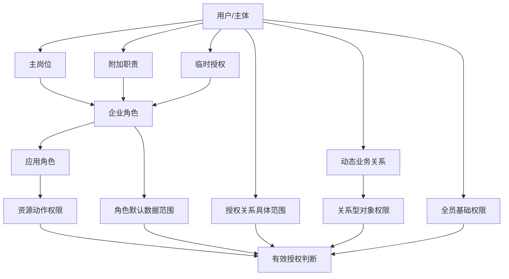

# Huizhi-yun 角色授权模型改进实施方案

> 文档状态：开发实施建议稿（P0 已部分提交，P1 合并权限与模拟已部分落地，P2 数据范围与授权生命周期正在分步落地，P3 静态/表驱动角色冲突规则、基础权限解释、成员权限页基础版与岗位职责目录基础版已接入；新增 Console/Foundation 授权事实源收敛方案与 TODO，见“实施进度”）
> 适用范围：Platform、Console、Foundation、各业务应用及 Policy Bundle / Tenant Runtime  
> 核心决策：**普通运行默认合并全部有效权限；具备授权模拟能力的系统管理员可主动进入严格角色模拟模式。**  
> 源码基线：基于本次提供的 `huizhi-yun` 源码快照进行静态分析。

---

## 实施进度（截至 2026-06-21）

> 本节记录方案落地进度，与下方设计正文配套；源码基线已从静态分析推进到部分编码落地。状态分四类，写明提交、验证与未接入项，避免高估进度。

### 已完成并提交

- **3.3 动作蕴含方向修复**：以 `actionSatisfies(granted, required, policy?)` 作为单一事实源，方向钉死“持有方蕴含需求方”（`admin` 默认满足 `view/edit`，但不蕴含 `approve` 等敏感动作；`edit` 仅蕴含 `view`）。platform `server/utils/authorization.ts` 的 `checkPermission` 与 console `server/utils/policyAuthorization.ts` 的 `hasPermissionInSnapshot` 两侧生产路径均已改用同一函数。提交时回归：authz-core golden 10/10、platform `test` 24/24；当前工作树验证见“本轮验证”。提交：platform `7a3cdbf` / `7e06a59`、console `5ba2608`。
- **共享授权包 `@hzy/authz-core`（方案 B）**：platform 仓导出、零框架依赖的纯算法 core，含 `actionSatisfies` / `evaluate`（授权单元遍历、权限并集但范围不跨授权拼接）/ `scopeMatches`（同维度 OR、跨维度 AND）/ `isEnterpriseRole`，以及 `GrantSource` / `RelationResolver` port 与全部判定类型。采用**单文件 `src/index.ts`**，已注册进根 `pnpm-workspace.yaml`。
- **跨仓消费验证（方案 B 关键环节）**：console（独立仓）经 `workspace:*` 跨仓消费 platform 仓的 `@hzy/authz-core`，console 与 platform `typecheck` 均 `EXIT=0`，证明“Platform 导出、Foundation / 业务应用消费”可行。

### 本轮已完成 / 待提交

- **3.4 自定义企业角色过滤**：生产路径已接入。platform `ENTERPRISE_TENANT_ROLE_SQL` 已改为 `app_code IS NULL + status=active + is_assignable=1`；console `policyAuthorization.ts` / `userApplications.ts`、Foundation `/api/user/applications` 和 6 个业务应用授权路径均改为通过 Foundation `isEnterpriseRoleRecord()` 调用 `@hzy/authz-core` 的 `isEnterpriseRole`。core 同时兼容 bundle/SQL 常见的 `isAssignable=0/1/'0'/'1'`。
- **角色有效性判断统一**：企业角色有效性已统一到 core 语义；系统角色来源仅保留为展示、权限展开和 legacy systemRolePermissions 去重上下文，不再决定租户自定义企业角色是否进入运行时 `availableRoles`。
- **敏感动作精确权限（部分完成）**：platform ops 已将订阅订单确认映射到 `ops.subscriptions/confirm`、部署写入映射到 `ops.deployments/deploy`；finance 已将回款确认与对账写入映射到 `confirm`；aims 周报导出已改为 `reports/export`；people 绩效周期确认/关闭改为 `performance_cycles/approve`；assets 增加 `/api/v1/**` 转发前权限 middleware，将采购/资产操作审批回写和直接生效操作映射到 `approve`；codocs 为文档/部门文档导出增加 `export` 动作并在下载、Slidev 导出、部门 DOCX 导出入口检查；altoc 增加 `/api/v1/**` 转发前权限 middleware，将报价/合同审批、回款确认、回款可开票同步、服务工单关闭与交付回写同步映射到精确动作，并移除用户态 `altoc:admin` 角色的敏感动作通配；workflow 已将任务同意/驳回/委托映射为 `workflow_tasks:approve|reject|delegate`，实例撤回/重新提交映射为 `workflow_instances:cancel|resubmit`，Nuxt fallback 与 tenant-runtime 转发路径均先校验精确动作；webdev 作业创建已按结构化任务字段区分 `webdev_workspace:execute` 与 `webdev_workspace:deploy`，部署类任务、部署模板和部署命令必须精确持有 `deploy`，普通 prompt 不会因为提到 deploy 文本而提权。
- **P1 默认 merged 生产接入（部分完成）**：`@hzy/authz-core` 已新增 `selectEffectiveRoleCodes()` 与 `resolveAuthorizationMode()`，普通运行默认返回全部有效企业角色；客户端传入的 `authorizationMode=role_simulation/user_simulation/privileged` 在服务端未显式允许时会降级为 `merged`，避免 Query/Header 直接控制模拟模式。Platform `buildAuthorizationSnapshot()` / runtime authorizations / runtime permission check / deployment bundle snapshot 已接入；Console policy authorization 与两个权限快照 API 已接入；Console 与 Foundation 的 `/api/user/applications` 应用可见性过滤已改为按有效企业角色并集计算；Aims、Finance、Altoc、Assets、Codocs、Workflow 6 个业务应用的 policy bundle fallback 已改为复用 Foundation grant builder 默认 merged 展开权限，且调用 Console 权限接口时不再转发旧 `activeRoleCode` 查询参数；6 个业务应用的本地复制版 `platformBundleAuthorization.ts` 已全部删除，直接使用 Foundation 公共 loader。Aims 全局管理员扩权、Altoc/Assets/Codocs 本地开发 bypass 通过显式 options 保留模块差异。
- **多角色回归（部分完成）**：Foundation 新增 `buildAllowedAppCodesFromPolicyBundle()`，Console 与 Foundation `/api/user/applications` 共用同一套 policy bundle 应用可见性解析；新增 bundle-shaped 回归覆盖“普通运行合并全部有效企业角色”“服务端允许后 `role_simulation` 收窄到 active role”“无效模拟角色不回退到其他角色”“未授权角色模拟请求按 `merged` 处理”。Platform 新增无 Nuxt 别名依赖的授权快照组装 helper 与 DB-shaped 回归，覆盖多企业角色 merged、允许后角色模拟收窄、无效模拟角色不回退、未授权模拟请求降级为 merged。
- **P2 scope evaluator / grant adapter（部分完成）**：`@hzy/authz-core` 的 `AuthorizationGrant` 已支持 `defaultScopes` / `assignmentScopes` 分组判定，避免同维度角色默认范围与授权关系范围被错误 OR 合并；Foundation 新增 `evaluateFoundationScopedAuthorization()`、`foundationScopeSetMatches()` 与 `foundationGrantScopeMatches()` 纯服务端 evaluator，支持同授权内同维度 OR、跨维度 AND、多授权 OR，且权限与范围必须绑定在同一 grant 内判定；已覆盖角色默认范围与授权范围交集、部门树、项目成员/所有者和 `tenant:global`。Foundation 还新增 `buildScopedAuthorizationGrantsFromPolicyBundle()` / `evaluatePolicyBundleScopedAuthorization()`，可把 Policy Bundle v1 的 `subjectRoles.assignmentId`、`subjectMemberships`、`subjectRoleScopes`、`rolePermissions`、`roleScopes` 组装成 grant 并调用 evaluator。Platform 新增 `buildDbAuthorizationGrants()` / `evaluateDbAuthorization()` 和 `DbGrantSource`，可从 DB 形态的 `tenant_subject_memberships`、`tenant_subject_roles`、`tenant_role_permissions`、`tenant_role_scopes`、`tenant_subject_role_scopes` 构建同一授权单元并调用 core `evaluate()`。Aims 已在项目对象窄路径首批接入 scoped evaluator：项目列表已接入可安全转换为 SQL 的全局/部门/明确 `project_code` scoped admin 过滤，项目对象上下文已改由 data-runtime 专用 `/v1/aims/projects/{id}/authorization-object` 只读端点解析，避免 scoped 判定前依赖 admin 项目详情，项目详情、项目更新、项目删除、项目成员列表/管理，`repos/milestones/work-items/requirements/requirement-contents/requirement-reviews/gitlab-commits` 等项目集合读取和其中可写集合创建，需求规格书章节 relation 读取，`documents` 项目文档路径，`products/releases` 项目产品/发布 runtime 路径，项目周报读取/保存，项目工时读取/录入/修改/删除，项目 Markdown/其他文档创建，People 贡献同步工时读取，以及本地 runtime 转发的需求导出、Codocs 候选、GitLab 同步上下文/落库、需求变更 target 创建和需求导入会消费 `current_user_is_project_admin`；Altoc 主对象普通 view/edit 数据范围、Finance 费用申请单、费用台账读写、项目核算读取/项目编码型写入、员工财务贡献/绩效本人/部门范围与绩效规则/重算全局闸门、People 员工本人/部门范围、任职读取范围、成本快照读取范围、绩效周期读取范围和 Finance 绩效金额读取范围也已完成首批窄路径接入；Policy Bundle v2、复杂跨维度/关系型列表范围、其他导出和其他业务模块范围过滤仍待后续阶段完成。
- **P2 授权生命周期字段与主体继承（部分完成）**：Platform 新增 `tenant_subject_roles` 的 `starts_at/status/assignment_kind/reason/approved_by_uid` 与 `tenant_account_roles` 的 `starts_at/status` 迁移和 DDL 草案；直接用户快照、控制台账户快照、Policy Bundle v1 `subjectRoles` 收集和租户管理员 subject-role API 已按 `status='active'`、已到 `starts_at`、未过期过滤。Platform 在线授权快照、Platform DB grant adapter、Policy Bundle v1 导出和 Foundation bundle adapter 已解析 active `tenant_subject_memberships` 中用户到部门/职位的 `member/manager/leader` 关系，可继承部门/职位主体上的角色与模板绑定；业务对象级生产过滤已扩展到 Aims、Altoc、Finance、People 首批窄路径，Policy Bundle v2 和更多业务路径仍待后续阶段完成。
- **P2 assignment scope 表（已建表，Foundation/Platform helper 已可解释，首批窄路径已接入）**：Platform 新增 `tenant_subject_role_scopes` DDL 与 v2.20 迁移，Policy Bundle v1 导出 `subjectRoles.assignmentId` 和 `subjectRoleScopes`；Foundation bundle adapter 与 Platform DB grant adapter 已能将其转换为同一授权关系内的 grant 并执行 `inherit/intersect/replace` 范围判定。现有扁平 `checkPermission` 不直接合并该范围，避免破坏同一授权单元语义；除 Aims 项目列表（全局/部门/明确 `project_code` 过滤）、项目详情、更新、删除、成员列表/管理、部分项目嵌套集合、需求规格书章节 relation、项目文档、项目产品/发布、项目周报、项目工时、项目 Markdown/其他文档创建、People 贡献同步工时读取、需求导出/GitLab 同步、需求变更 target 创建和需求导入，以及 Altoc 主对象普通 view/edit 数据范围、Finance 费用申请单本人/部门范围、费用台账读写范围、项目核算读取/项目编码型写入范围、员工财务贡献/绩效本人/部门范围与绩效规则/重算全局闸门、People 员工本人/部门范围、任职读取范围、成本快照读取范围、绩效周期读取范围和 Finance 绩效金额读取范围等窄路径外，其他业务 API 对象上下文接入仍归入后续阶段。
- **P3 静态/表驱动角色冲突规则（部分完成）**：Platform 新增代码配置型 `STATIC_ROLE_CONFLICT_RULES` 与 `evaluateStaticRoleConflicts()`，支持 `warning` / `enforce` 两种执行级别；租户管理员 subject-role 授权写入前会加载目标主体既有有效角色和候选角色的直接权限、应用角色映射权限并评估冲突，`enforce` 冲突返回 409，`warning` 冲突随响应返回。Console `AuthorizationsManager` 授权成功后会展示冲突预警 toast。当前内置规则覆盖 Finance 费用/付款制单与审批/确认、Assets 采购/资产操作经办与审批、People 任职/成本/绩效经办与审批、Webdev 执行与部署等高风险职责组合；全部默认 `warning`，符合中小企业“可兼任但实例双人校验”的策略。Platform 已新增 `tenant_role_conflict_rules` DDL 草案与 v2.21 迁移，运行时会合并 active 租户表规则并允许同 `rule_code` 覆盖内置规则；Console 已接入基础租户自定义规则列表、新增/编辑和启停 UI。角色目录治理和通用实例级冲突解释仍未完成。
- **P3 基础权限解释（部分完成）**：Platform 新增 `explainDbAuthorizationWithQueries()`，复用 DB grant adapter 和 authz-core `evaluate()`，可返回允许/拒绝、`no_permission` / `scope_not_matched` / `allowed` 原因、命中授权单元、候选授权单元及默认范围/授权关系范围来源；租户管理员新增 `/api/platform/tenant-admin/authorization-explain` 只读 API，Console `AuthorizationsManager` 已接入基础权限解释表单，支持按用户、app/resource/action 和常用对象上下文字段预览有效权限来源。Platform 企业工作台已新增成员权限页基础版，可按成员查看有效角色/权限来源，并在页内按选中成员和可选角色模拟收窄执行权限解释；baseline 来源展示、真实 Console 全局模拟会话联动和跨业务对象的通用“为什么有权/无权”诊断仍未完成。
- **Aims 首批 scoped authorization 接入（部分完成）**：Aims 新增 `checkAimsScopedPermission()` 与 `resolveAimsProjectAuthorizationObject()`，从本地已缓存 policy bundle 调用 Foundation `evaluatePolicyBundleScopedAuthorization()`；项目对象上下文通过 data-runtime 专用只读端点 `/v1/aims/projects/{id}/authorization-object` 解析项目编号、负责人、创建人、部门和成员 uid，Aims 不直连业务库，也不再为 scoped admin 判定预读 `/admin/projects/{id}`。`GET /api/v1/projects` 已把全局/`tenant:global` 项目管理员映射为全量列表，把可安全表达的部门 scope 与明确 `project_code` scope 映射为 data-runtime 列表过滤键；复杂跨维度或纯关系型 scope 不在列表层放大。项目入口 `GET/PUT/PATCH/DELETE /api/v1/projects/{id}` 会用该对象上下文计算 `current_user_is_project_admin`：详情可见性把该标记作为项目可见性分支，更新要求项目经理或 scoped 项目管理员，删除仍要求草稿项目且项目经理或 scoped 项目管理员；`GET /api/v1/projects/{id}/members` 已在 data-runtime 读取前执行项目可见性或 scoped admin 检查；`POST/DELETE /api/v1/projects/{id}/members` 已迁到 data-runtime，新增、移除和暂停成员要求项目经理或 scoped 项目管理员，并保留“不能移除自己”和“有工作项只能暂停”的业务规则；`repos/milestones/work-items/requirements/requirement-contents/requirement-reviews/gitlab-commits` 项目集合读取已统一要求项目可见或 scoped admin，其中可写集合创建要求项目经理或 scoped admin；`GET /api/v1/projects/{id}/requirements/spec` 的章节 relation 读取已改由 data-runtime 按 content 反查 project 后执行项目可见性或 scoped admin 检查；`GET/POST/PUT/PATCH /api/v1/projects/{id}/documents` 已注入项目可见性与 scoped admin 上下文，data-runtime 读取项目前要求项目可见或 scoped admin，绑定/替换文档保留创建人/负责人兼容分支并新增项目经理或 scoped admin 分支；`products/releases` 项目产品/发布 runtime 路径已注入 scoped admin 上下文，data-runtime 的项目成员/经理 helper 会把该标记作为项目成员/经理能力分支；`GET/POST /api/v1/projects/{id}/weekly-reports` 已注入项目可见性与 scoped admin 上下文，data-runtime 读取周报要求项目可见/成员或 scoped admin，保存周报要求项目经理或 scoped admin，同时保留全局周报管理权限分支；`GET/POST/PATCH/DELETE /api/v1/projects/{id}/time-entries` 已注入项目可见性与 scoped admin 上下文，data-runtime 读取工时要求项目可见或 scoped admin，录入/修改/删除工时时 scoped admin 可通过项目访问校验，但修改/删除仍保留只能操作本人记录的业务规则；本地 Nuxt `markdown-documents` / `other-documents` 创建入口已复用项目 scoped access query，允许项目 scoped admin 通过创建前校验；本地 Nuxt `people-contributions/sync` 已改为要求登录用户，并用项目 scoped access query 读取工时后同步 People；本地 Nuxt runtime 转发的 `requirements/export`、`requirements/codocs-candidates`、`sync-gitlab`、`requirement-targets` 和 `requirements/import` 会先构造项目部门范围与 scoped admin 标记，data-runtime 侧读取需求导出/Codocs 候选/GitLab 同步上下文前要求项目可见或 scoped admin，GitLab commit ingest、需求变更 target 创建和需求导入落库前要求项目经理或 scoped admin；管理员入口 `GET/PUT/PATCH/DELETE /api/v1/admin/projects/{id}` 不传对象上下文，只允许无范围或 `tenant:global` 的项目管理员能力作为系统级入口。该 scoped helper 也已改为普通运行 merged，不再强制按旧 active role 做 `role_simulation`。
- **Altoc 首批 scoped data access 接入（部分完成）**：Altoc 新增数据范围注入，BFF 会从 policy bundle grant 解析 `customer/lead/opportunity/quotation/contract/receivable/maintenance_contract/service_entitlement/service_ticket/renewal_opportunity/dashboard` 等资源的 `tenant:global`、`subject:self`、`department:self` 范围，并在 runtime query 注入 `current_user_altoc_access` / `current_user_data_access` 与允许部门集合；data-runtime compat 通用 CRUD、Altoc 专用列表/详情/dashboard/回款计划读取、runtime-forwarded 敏感命令，以及 Nuxt 本地编排首批入口（lead/opportunity 创建与分配、scan、invoice-request、Aims work-item、客户服务运营只读编排、文档链接、合同管理）会按 all/self/dept/none 执行全量、本人、部门或拒绝访问。data-runtime 已剥离浏览器 body 中伪造的数据范围字段，本地命令改为从受信 query 合并 data-scope，避免业务 payload 绕过 BFF 注入；显式 data-scope 会优先于 runtime token 的 resource admin scope，纯 service token 回写不带用户 data-scope 时保持 capability 驱动。服务调用无用户 actor 时不会注入用户数据范围，避免误伤跨应用 service endpoint。复杂混合 AND 范围、`department:tree` 解析、其他文件/导出类只读代理和未枚举业务对象范围仍待后续接入。
- **旧 active-role 降级（部分完成）**：Console 权限快照不再从普通 Cookie/Header/Query 自动读取旧 `activeRoleCode` 作为授权选择依据；Foundation `useAuthorization()` / `useUserApplications()` 不再发送旧 `activeRoleCode` 查询参数，`/api/user/applications` 不再读取或转发 `x-hzy-active-role`，`platform-adapter-nuxt` 默认也不再从请求解析旧活动角色；Aims、Finance、Altoc、Assets、Codocs、Workflow 权限接口调用 Console 时不再转发旧 active-role 查询参数，本地 policy bundle fallback 也不再按单个 active role 收窄授权。旧 Cookie 仅保留为客户端兼容状态和展示兜底，不再作为日常授权模式。
- **角色/用户模拟服务端会话（部分完成）**：Console 新增 `POST /api/v1/console/authorization/simulation-sessions`、`GET/DELETE /api/v1/console/authorization/simulation-sessions/current`，使用 httpOnly HMAC 签名 Cookie 保存短期 `role_simulation` / `user_simulation` 会话，并在会话 token 中绑定创建时的 policy bundle version/hash；创建会话前会通过 policy bundle 校验 `platform:authorization:simulate-role` 或 `platform:authorization:simulate-user`（映射为 app=`platform`、resource=`authorization`、action=`simulate-role|simulate-user`）。权限快照只在签名会话存在且当前 bundle 指纹未变化时启用模拟：`role_simulation` 显式加入并收窄到指定企业角色，目标角色无效时不会回退到操作者其他角色；`user_simulation` 按目标 `subjectCode` 读取真实合并权限；否则仍为 `merged`。Console `requirePermission` 已在模拟模式下阻断凭证库、服务凭证、集成配置、目录用户/部门/目录源/目录同步、运行控制（`system_settings:admin`），以及 `approve/confirm/export/deploy/pay/reconcile/impersonate/manage-credentials` 等高危动作，并写入 `simulation.blocked` 审计。
- **Platform 模拟 capability seed 源文件（待环境执行）**：新增 `platform/app.manifest.json` 声明 `platform:authorization:view/admin/simulate-role/simulate-user`，并在 `docs/HZY-Platform-SQL-Seed-v2.16-enterprise-roles.sql` 中将 `platform:authorization_admin` 映射给 `system_admin`。该能力要在实际环境生效，仍需导入 Platform manifest、执行企业角色 seed、重新生成并下发 policy bundle。
- **模拟状态栏（部分完成）**：Console 默认布局新增全局模拟状态栏，读取 current simulation session，展示角色/用户模拟目标、原因和过期时间；退出模拟会调用服务端 DELETE，并清理/刷新权限缓存；前端状态栏会在 Cookie 过期后重新读取 current session 并刷新权限。
- **模拟创建入口（部分完成）**：Console 默认布局右上角新增 `AuthorizationSimulationLauncher`，仅在已登录且具备 `platform:authorization:simulate-role` 或 `platform:authorization:simulate-user` 时展示；入口通过 `/api/auth/permissions?appCode=platform` 判断能力，支持角色模拟/用户模拟、角色快捷选择、TTL、是否包含 baseline 与原因输入，提交后调用服务端创建会话并刷新权限缓存。
- **模拟审计查询（部分完成）**：Console 日志管理页新增“授权模拟”入口，复用 `operation_logs` 查询 `authorization_simulation` 领域日志，并支持按创建会话、退出会话、会话过期、策略失效、授权拒绝、创建失败和高危拦截动作过滤；详情弹窗展示 `detail_json` 中的模拟模式、目标角色/用户、失败原因、拦截资源动作、策略指纹和过期时间。
- **P3 成员权限页与岗位职责目录基础版（部分完成）**：Platform 企业工作台新增“成员权限”和“岗位职责目录”入口。成员权限页通过 `/api/platform/tenant-admin/member-permissions` 聚合用户主体、部门/职位 membership、有效企业角色、权限来源和范围来源，并在同页调用 `/api/platform/tenant-admin/authorization-explain` 执行 app/resource/action 解释；选择单个角色时以 `role_simulation + activeRoleCode` 收窄到该角色进行内联模拟。岗位职责目录页通过 `/api/platform/tenant-admin/role-catalog` 按主岗位、管理职责、审批职责、高风险特权、自定义角色进行基础分组，展示权限数、应用角色映射数和已授权用户数。当前仍是可测试的基础视图和只读诊断闭环，尚未做角色分类可配置治理、主岗位/附加职责编辑流程、真实 Console 全局模拟会话联动、baseline 来源展示和通用实例级冲突解释。
- **本轮新增验证（成员权限页 / 岗位职责目录）**：platform `test` 38/38 通过，platform `git diff --check` 和根文档 diff whitespace 检查通过；platform `typecheck` 已执行但仍受既有 admin 页面严格类型问题阻塞，当前报错集中在 `app/pages/admin/**` 与 `app/pages/dashboard/subscription-plans.vue` 的隐式 `any`、`row.original` unknown 和索引类型问题，本次新增的成员权限页、岗位职责目录页及 tenant-admin API 未出现在错误列表中。
- **本轮验证**：authz-core `test` 12/12 + `typecheck`、platform `test` 38/38 + `typecheck`、foundation `test` 14/14 + `typecheck`、aims `typecheck`、finance `typecheck`、assets `typecheck`、codocs `typecheck`、workflow `test` 3/3 + `typecheck`、console `test` 8/8 + `typecheck`、webdev `test` 3/3 + `typecheck`、altoc `test` 9/9 均通过；6 个业务应用迁移到 Foundation 公共 `platformBundleAuthorization` 后，foundation `test` 14/14 + `typecheck`、aims/assets/codocs/finance/workflow `typecheck`、workflow `test` 3/3、altoc `test` 9/9 已复验通过；Aims 项目对象 scoped authorization 与项目成员/部分项目集合、项目文档、项目产品/发布、项目周报、项目工时、项目 Markdown/其他文档创建、People 贡献同步工时读取、本地 runtime-forwarded 需求导出/Codocs 候选/GitLab 同步/需求变更 target/需求导入迁移扩展，以及 data-runtime 专用项目授权对象上下文端点接入后，data-runtime `go test ./internal/apps/aims` 与 aims `typecheck` 已通过；root 与 aims/finance/altoc/assets/codocs/workflow `git diff --check` 均通过。Console 本地浏览器 smoke 已访问 `http://127.0.0.1:3300/` 与 `/admin`，当前 dev 配置会跳转真实 SSO，且因本机 `redirect_uri` 未登记返回 400；因此本轮浏览器检查只覆盖未登录跳转路径，登录态 topbar 布局仍需在可登录环境复验。此前 P0/敏感动作改动已验证 assets `test`、people `typecheck`、Altoc server tsconfig、data-runtime Altoc/server 聚焦测试；Altoc 全量 `typecheck` 仍受既有前端页面类型错误阻塞，当前报错集中在 `app/components/DocumentsPanel.vue`、`app/pages/contracts/new.vue`、`app/pages/opportunities/[id].vue`、`app/pages/quotes/[id].vue`、`app/pages/tenders/[id].vue` 等前端页面类型问题，不涉及本次修改的授权公共 loader 调用点。

- **Finance 首批 scoped authorization 接入（部分完成）**：Finance 新增费用申请单本人/部门范围、费用台账读写范围、项目核算读取范围、项目编码型写入范围和员工财务贡献/绩效本人/部门范围接入，BFF 会从 policy bundle grant 解析 `expenses` 资源的 `subject:self` / `department:self` scope、`project_accounting` 资源的 `tenant:global` / 明确 `project:member|owner` 项目编码 scope，以及 `performance` 资源的 `tenant:global` / `subject:self` / `department:self` scope，并在 runtime query/body 注入可信数据范围；data-runtime 的 `expense_claim`、`project_expense_request` 和 `payment_request` 列表会按申请人或 `applicant_dept_code` 过滤，详情、创建、编辑和提交会校验申请人必须是当前用户或处于授权部门内；`finance_expense` 列表/详情会按 `handler_user_id` 或 `department_code` 读取过滤，台账创建会按目标 `handler_user_id` 或 `department_code` 校验，台账更新会同时校验原记录和变更后的目标 `handler_user_id` / `department_code`，台账删除会校验原记录范围；`project_finance_summary` 与 `project_cost_allocation` 列表、项目核算详情和 `project-accounting/resolve` 会按授权 `project_code` 过滤或拒绝，本地 `project-accounting/aims-projects` 编排也会按同一项目范围裁剪 Aims 项目底表；`project-cost-allocations` 写入、`project-accounting/recalculate` 和本地 `sync-people-costs` 会按授权 `project_code` 校验或收窄；直达 `employee-costs` 列表/写入由于 `employee_cost_snapshot` 无 `project_code`，已收紧为仅允许全局项目核算范围，项目编码型同步链路只能在本地 `sync-people-costs` 已校验目标 `project_code` 后写入；财务工作台 `/dashboard/summary` 已按 dashboard 授权项目编码裁剪本月开票、到账、待审批、项目毛利和未核销到账聚合，项目范围模式不再返回全局银行账户数量；月度财务报表 `/reports` 已按授权项目编码裁剪开票、到账、费用、项目毛利和关联绩效金额聚合，`/reports/export` 已新增 CSV 导出入口并在 Finance BFF 要求 `reports:export`；合同财务摘要 `/contracts/{code}/summary`、`/contracts/summaries` 和维保财务摘要 `/service/customers/{customerCode}/maintenance-financial-summary` 已按授权项目编码或服务调用方传入的项目范围裁剪；Workflow callback 已携带审批人 uid 证据，Finance BFF 对 callback 要求 `workflow:callback` service token，data-runtime 对开票申请、费用报销、项目支出和付款申请的 `approved/rejected` 结果要求存在非申请人的审批人证据；`employee_finance_contribution` 与 `employee_finance_performance` 列表会按本人或部门过滤，`performance_calculation_snapshot` 会按本人、部门目标或关联员工绩效部门过滤，贡献创建会校验目标员工或部门范围，`performance_rule` 读取/创建和 `performance/recalculate` 已收紧为仅允许全局 `performance` 范围或服务上下文；显式 `status=paid/confirmed` 的费用台账或付款申请写入会在 Finance BFF 要求 `expenses:confirm`，data-runtime 在用户 actor 存在时拒绝经办人/制单人自行付款确认，服务回写无用户 actor 时仍按 capability 驱动；银行账户资料新增、修改和删除已在 Finance BFF 收紧为 `bank_accounts:admin`，余额快照录入仍保留为 `bank_accounts:edit`。当前覆盖费用报销、项目支出申请、付款申请本人/部门范围、费用台账读写范围、项目核算读取范围、成本分摊写入、员工成本直达全局收紧、财务工作台、月度财务报表、合同财务摘要和维保财务摘要项目范围及导出精确权限、项目重算、审批结果自审批拦截、付款确认非制单人校验、银行账户资料维护高权限收紧、员工财务贡献/绩效本人/部门读取、贡献创建范围和绩效规则/重算全局闸门；职责冲突实例级解释和其他报表等 Finance 对象级范围仍待后续接入。
- **People 首批 scoped authorization 接入（部分完成）**：People 新增员工本人/部门范围、成本快照读取范围、绩效周期读取范围和 Finance 绩效金额读取范围接入，BFF 会从 policy bundle grant 解析 `employees`、`assignments`、`cost_snapshots`、`performance_cycles` 和全局敏感 `standard_costs` 资源的 scope，并在 runtime query 注入 `current_user_employee_access`、compat 通用 `current_user_data_access`，以及员工敏感成本字段写入所需的 `current_user_standard_cost_access`；data-runtime 的 `people_employees` generic 列表、详情和更新按 `employee_uid = current_user` 或 `dept_code` 过滤或校验，员工 `monthly_standard_cost` 写入额外要求 `standard_costs/admin` 全局访问，`/v1/people/employees/{uid}/profile` 会在返回任职、成本快照、贡献、绩效周期和文档前校验员工本人或授权部门，`people_assignments` 列表/详情已按 `employee_uid` 或 `dept_code` 读取过滤，`people_cost_snapshots` 与 `people_contribution_snapshots` 列表/详情已按所属员工本人或部门过滤，`people_performance_cycles` 列表/详情会按周期下可见贡献员工过滤并只汇总可见贡献，`/v1/people/standard-costs` 读取要求 `standard_costs/view` 全局访问、写入要求 `standard_costs/admin` 全局访问；People BFF 读取 Finance 绩效金额时会先按同一 scope 解析可见贡献员工，再逐员工读取或过滤 Finance 返回，避免把项目/期间下其他员工金额重新放大。`subject:self` / `department:self` 不允许创建或删除员工事实，任职、成本快照、贡献快照和绩效周期普通 runtime 写入仍要求全局范围；其他薪酬/成本字段级拆分和其他 People 路径仍待后续接入。
- **本轮新增验证**：Finance 费用申请单本人/部门、费用台账读写、项目核算读取、成本分摊写入、员工成本直达全局收紧、财务工作台、月度财务报表、合同财务摘要和维保财务摘要项目范围、`reports:export` 导出、项目重算、审批结果自审批拦截、付款确认职责分离、银行账户资料维护高权限收紧、员工财务贡献/绩效 scoped access 和绩效规则/重算全局闸门接入后，data-runtime `go test -count=1 ./internal/apps/finance ./internal/server`、finance `typecheck`、workflow `typecheck` 和 workflow `test` 已通过；People 员工本人/部门、任职读取、标准成本全局敏感资源、员工 `monthly_standard_cost` 字段级写入保护、成本快照读取、绩效周期读取和 Finance 绩效金额读取 scoped access 接入后，data-runtime `go test -count=1 ./internal/apps/people` 与 people `typecheck` 已通过；Altoc scoped data access 与本地编排首批入口接入后，data-runtime `go test -count=1 ./internal/apps/compat ./internal/apps/altoc ./internal/server`、altoc `test` 与 altoc server tsconfig 检查已通过，Altoc 全量 `typecheck` 仍受既有前端页面类型错误阻塞。

### 未完成

- 安全的角色/用户模拟会话（P1 剩余）：目前已有 `AuthorizationMode` 类型、服务端模式授权降级策略、role/user simulation 签名会话、`simulate-role` / `simulate-user` 校验、Platform capability manifest/seed 源文件、目标用户合并权限快照、基础 `operation_logs` 审计、模拟审计查询入口、模拟模式高危写拦截、服务端过期清理与 `simulation.expired` 审计、策略指纹变化清理与 `simulation.invalidated` 审计、Console 全局模拟状态栏与右上角创建入口；尚未完成各环境 manifest 导入、seed 执行与 bundle 下发。前端创建入口与审计页仍需在可登录环境做浏览器级复验。
- 授权单元 `evaluate` 接入：默认权限快照仍是扁平 snapshot + `checkPermission`；Foundation `BundleGrantSource` 形态的 policy bundle → grant 适配器和 Platform `DbGrantSource` / `evaluateDbAuthorization()` 已建，旧 runtime permission check 尚未切换到 grant path；业务 API 对象上下文生产接入目前只覆盖 Aims 项目列表可表达范围、项目详情、更新、删除、成员列表/管理、部分项目嵌套集合、需求规格书 relation、项目文档、项目产品/发布、项目周报、项目工时、项目 Markdown/其他文档创建、People 贡献同步工时读取、需求导出/GitLab 同步、需求变更 target 和需求导入，以及 Altoc 主对象、runtime-forwarded 敏感命令与 Nuxt 本地编排首批入口数据范围、Finance 费用申请单本人/部门范围、费用台账读写范围、项目核算读取/写入范围、财务工作台、月度报表、合同财务摘要和维保财务摘要项目范围与导出动作、审批结果自审批拦截、付款确认职责分离、银行账户维护动作拆分和员工财务贡献/绩效本人/部门范围、People 员工本人/部门范围、成本快照读取范围、绩效周期读取范围和 Finance 绩效金额读取范围等窄路径。
- Policy Bundle v2、scope evaluator 生产接入（P2）；Foundation evaluator 与 bundle grant adapter 已完成，Platform 直接授权生命周期字段、部门/职位 membership 继承和 `assignment scope` 表/导出已接入；列表、其他导出、Altoc 复杂范围/`department:tree`/其他文件代理、People 其他字段级敏感拆分/其他路径、Finance 职责冲突实例级解释和其他报表等对象路径、Aims 其他写入路径仍未接入授权单元范围判定。
- 管理端交互、表驱动职责冲突规则、通用实例级自审批解释和人员生命周期联动（P3）。Platform 授权分配路径已完成静态/表驱动角色冲突评估、Console 预警提示、基础租户规则管理 UI、基础权限解释 API/UI、成员权限页基础闭环和岗位职责目录基础视图；仍未完成角色目录可配置治理、通用实例级解释、真实 Console 全局模拟会话联动、baseline 来源展示和人员生命周期联动。
- 6 个业务应用的 policy bundle fallback 已复用 Foundation grant builder 并默认按 merged 展开授权；Aims、Altoc、Assets、Codocs、Finance、Workflow 已全部删除本地复制版 `platformBundleAuthorization.ts` 并直接使用 Foundation 公共 loader。后续未完成的是对象级 scoped authorization 在更多业务 API 上的生产接入，而不是授权快照 loader 的文件级复制收敛。

### 已实施：统一 Console/Foundation 授权事实源，彻底移除业务应用本地 bundle

目标状态：业务应用不再以本地 policy bundle 作为授权事实源，也不再直接调用 `readCachedPlatformBundle()` 解析用户授权。Platform 仍负责生成和签名 policy bundle；Console 负责拉取、验签、缓存、解析和按租户/部署隔离；Foundation 负责提供业务应用统一消费的授权快照、scoped authorization 和数据范围 helper。业务应用只消费 Console/Foundation 的授权结果。

该收敛的动机不是删除 policy bundle，而是删除“业务应用各自持有和解释 bundle”的运行模式，避免开发环境、生产环境、Console 缓存和业务应用本地缓存出现版本、kid、tenant/deployment 或解释逻辑不一致。

设计决策：

- **Platform 是授权定义与签名事实源**：manifest、角色、授权关系、scope、职责冲突和 bundle 生成仍归 Platform。
- **Console 是运行时授权事实源**：Console 拉取并验签 Platform bundle，负责当前租户的授权快照、模拟会话、权限解释和 scoped grant 解析。
- **Foundation 是应用消费层**：业务应用通过 Foundation 调 Console runtime，不直接读本地 bundle、不复制 bundle grant 解析、不维护本地 fallback 算法。
- **生产 fail closed**：生产和共享测试环境中 Console 授权不可用时返回明确 `authorization_unavailable` / 503，不静默降级为本地旧 bundle，也不伪装成普通 403。
- **开发环境同链路**：本地开发也走 `Platform dev bundle -> Console dev runtime -> 业务应用`。只允许显式 local-dev bypass 用于极小范围的离线开发，并且不得作为默认路径或生产兼容路径。
- **scoped authorization 优先收敛**：Altoc、Finance、People、Aims 这类依赖 `tenant:global`、`department:self/tree`、`subject:self`、`project:member/owner`、`customer:owner/team` 等 scope predicate 的模块，必须先由 Console/Foundation 提供范围授权结果，不能简单退化为平面 `resources`。

完成清单：

- [x] Console 新增 scoped authorization runtime API：`POST /api/auth/scoped-authorization` 和 `POST /api/v1/console/user/scoped-authorization`，输入 `appCode/resource/action/activeRoleCode/authorizationMode/objectContext`，返回命中 grants、decision、active role、authorization mode、bundleVersion/bundleHash。
- [x] Console 当前权限快照 API 返回 `authorizationMode`、`bundleVersion`、`bundleHash`，并继续通过 `PolicyAuthorizationError` 区分空授权、bundle 不可用和授权服务错误。
- [x] Foundation 新增 `loadAuthorizationSnapshotFromConsoleRuntime()` 和 `loadScopedAuthorizationFromConsoleRuntime()`，业务应用通过 Foundation 调 Console runtime。
- [x] Foundation 旧 `loadAuthorizationFromCachedPlatformBundle()` 保留为兼容别名；有请求上下文时委托 Console runtime，无请求上下文时不再读取本地 bundle。旧 `listUserCodesByRoleFromCachedPlatformBundle()` 已禁用本地读取。
- [x] Altoc scoped data access 改走 Foundation/Console scoped helper，再转换为 data-runtime 使用的 `all/dept/self/none` 与部门集合查询参数。
- [x] Finance 费用申请、费用台账、项目财务、dashboard/report、合同/维保财务摘要和员工绩效相关 scoped access 改走 Foundation/Console scoped helper。
- [x] People 员工、任职、成本快照、绩效周期、Finance 绩效金额读取等 scoped access 改走 Foundation/Console scoped helper。
- [x] Aims 项目 scoped admin、项目列表范围和项目对象上下文 helper 改走 Foundation/Console scoped helper。
- [x] Codocs / Assets 清理业务授权快照本地 bundle fallback，保留 Console 授权快照、对象级 ACL 和 service capability 主路径。
- [x] `/api/user/applications` 不再读取业务应用本地 bundle 做应用可见性 fallback；Console 用户应用接口不可用时生产 fail closed，只有显式 local-dev 应用目录可作为离线开发入口。
- [x] 业务应用生产路径不再直接调用 `readCachedPlatformBundle()`；Foundation 本地 bundle reader 仅保留 Platform runtime 激活、heartbeat 后缓存刷新与诊断用途。
- [x] 更新 `docs/FOUNDATION_CAPABILITIES.md`、`docs/MODULE_CONTRACTS.md`、Console/Foundation/业务应用 `CLAUDE.md` 中的授权路径说明。
- [ ] 补更完整自动化测试：Console scoped API、Foundation client、Altoc `all/dept/self/none` 转换、active role simulation、Console 不可用 fail closed、bundle 更新后业务应用立即读取新授权。本轮已执行聚焦 lint/typecheck，详见本节验证记录。

实施结果：

- Console 是唯一运行时授权解析点；业务应用不再各自解析本地 policy bundle。
- Foundation 是业务应用唯一授权消费层；普通权限快照使用 `loadAuthorizationSnapshotFromConsoleRuntime()`，对象/范围授权使用 `loadScopedAuthorizationFromConsoleRuntime()`。
- Console 授权不可用时，业务应用授权快照、scoped access 和应用入口列表返回明确 503，不再静默降级为旧 bundle。
- Workflow 已停止按本地 bundle 解析角色成员。角色型审批人解析在 Console 授权目录 API 补齐前会返回 503，避免继续按旧事实源生成审批任务。

验收标准：

- Altoc scoped data access 生产路径不再读取业务应用本地 policy bundle。
- Console bundle 更新后，业务应用不需要本地 bundle 刷新即可得到最新授权和范围。
- Altoc 首页、商机、客户、合同等列表继续支持 `all/dept/self/none`，且无权限时返回授权服务不可用或业务可理解的拒绝原因。
- Console 授权不可用时生产环境返回明确授权服务不可用错误，不静默 fallback，也不误报为普通无权限 403。
- 本地开发环境默认通过 Console dev runtime 获取同一授权结果；仅显式 bypass 场景允许使用本地 manifest。

本轮验证：

- Console `typecheck`、`test` 12/12、授权相关聚焦 eslint 通过；`typecheck` 仍提示 `normalizeAuthorizationResources` / `RuntimePermissionInput` 自动导入同名 warning，不影响编译。
- Foundation `typecheck`、`test` 14/14、授权相关聚焦 eslint 通过；全量 `lint` 仍受既有 `packages/platform-sdk/src/index.ts`、`server/utils/deploymentProfile.ts`、`server/utils/objectStorage.ts` 风格问题阻塞。
- Aims、Finance、People、Codocs、Assets、Workflow `typecheck` 通过；Workflow `test` 3/3 通过；Altoc 全量 `typecheck` 仍受既有前端页面类型问题阻塞，错误集中在 `app/components/DocumentsPanel.vue`、`app/pages/contracts/new.vue`、`app/pages/quotes/[id].vue`、`app/pages/tenders/[id].vue` 等，与本轮授权文件无关。
- Console、Foundation、Altoc、Aims、Finance、People、Codocs、Assets、Workflow 本轮触碰文件聚焦 eslint 均通过；根仓和各嵌套仓库 `git diff --check` 通过。
- `readCachedPlatformBundle()` 扫描仅剩 Foundation `platformActivationCache`、`platformActivationRuntime` 和 `platform-activation` 插件中的 runtime 激活/诊断用途；业务应用目录无直接读取和无旧本地 bundle loader 引用。

### 关键决策与教训

- **包归属采用方案 B**：`platform/packages/authz-core` 由 platform 仓导出，foundation / 业务应用消费，符合“Platform 是授权事实源”的方向。
- **单文件回避 TS5097**：源码直引的 `.ts` 包内部若用 `.ts` 扩展名 import，会强制每个消费方 tsconfig 开 `allowImportingTsExtensions`（platform 开了未暴露，console 未开报 12 个 TS5097）。authz-core 采用单文件、无内部相对 import 回避（对齐 `@hzy/platform-sdk`）。
- **遗留待清理**：platform 主授权路径已走 `actionSatisfies`，但 `permissionActions.ts` 的 `expandActions` 仍被 ops RBAC SQL 候选动作展开使用；后续应收敛为 core 包装或同一策略表。

---

## 1. 文档目的

本文用于指导 Huizhi-yun 对现有角色授权体系进行系统性改造，目标不是简单增加角色或调整若干权限，而是建立一套同时满足以下要求的统一授权模型：

1. 适配中小软件企业常见的“一人多岗、一人多责”。
2. 保留开发、测试阶段逐角色验证权限定义的能力。
3. 让平台预置角色、租户自定义角色、应用角色、动态业务关系和数据范围真正形成闭环。
4. 降低租户管理员理解和维护权限的成本。
5. 对财务、人事、合同、生产发布等高风险操作保持精确控制。
6. 保证 Platform 在线鉴权、Console Policy Bundle、Foundation 公共能力及各应用本地鉴权结果一致。
7. 提供可解释、可审计、可测试、可渐进迁移的实现路径。

本文覆盖：

- 目标概念模型；
- 权限合并与角色模拟模式；
- 动作权限和数据范围语义；
- 数据库与 Policy Bundle 改造；
- API、Foundation 公共组件和应用接入方式；
- 管理端交互；
- 各应用角色重构建议；
- 职责分离、安全控制、测试和迁移方案；
- 可拆分为开发任务的实施清单。

---

## 2. 当前实现概览

现有平台已经形成较完整的两层角色思路：

```text
应用角色
  └─ 表达某个应用内的一组标准能力
     例如 altoc:sales、aims:pm、finance:accountant

企业角色
  └─ 表达企业岗位或职责，并组合多个应用角色
     例如销售经理、项目经理、财务会计
```

同时已经具备或规划：

- 全员基础权限 `baselinePermissions`；
- 平台预置企业角色；
- 租户继承角色和租户自定义角色；
- 用户直接授权；
- 权限模板、模板绑定和模板例外；
- 角色默认数据范围；
- 授权有效期；
- Policy Bundle 下发和本地运行时鉴权；
- 当前活动企业角色 `hzy_active_enterprise_role`。

主要关联实现包括：

```text
docs/Platform-Role-Permission-Design.md
platform/server/utils/authorization.ts
platform/server/utils/policyBundle.ts
console/server/utils/policyAuthorization.ts
foundation/server/utils/activeRole.ts
foundation/app/composables/useActiveRole.ts
*/server/utils/platformBundleAuthorization.ts
platform/app/components/console/AuthorizationsManager.vue
```

现有方向总体正确，但运行时仍以“只选择一个活动企业角色”为核心，且不同鉴权路径对角色和动作的解释存在差异。

---

## 3. 当前主要问题

### 3.1 普通用户只能使用一个活动企业角色

当前授权计算会从用户拥有的角色中选择一个 `activeRoleCode`，只计算该角色对应权限。未明确选择时，还可能按中文名称排序后选第一个角色。

这与中小软件企业实际岗位结构不匹配。例如：

- 创始人同时承担总经理、销售负责人和合同审批职责；
- 项目经理同时承担售前、交付和客户沟通；
- 财务会计兼任出纳或行政；
- 人事专员同时管理目录；
- 技术负责人同时具备项目管理和生产发布职责。

实际应用中频繁切换角色会造成：

- 功能入口忽隐忽现；
- 用户难以理解为什么当前没有按钮；
- 在一个应用中切换角色影响其他应用；
- 用户为了方便长期保持最高权限角色；
- 多岗位协同流程被人为割裂。

### 3.2 角色切换作为测试工具有价值，但不应成为日常授权模式

现有活动角色机制对于开发验证非常有价值：开发人员可以选择一个角色，检查该角色单独是否具备正确的菜单、按钮、API 和数据权限。

问题是当前测试机制与真实运行机制混在一起。应将其正式定义为“授权模拟”，而不是普通用户的默认权限模型。

### 3.3 Platform 动作包含关系存在方向风险

`platform/server/utils/authorization.ts` 当前对 `view/edit/admin` 的展开方式可能造成低权限动作匹配高权限请求。各业务应用本地工具又采用另一套逻辑，导致中央鉴权与应用鉴权结果不一致。

必须统一为：

```text
admin 可以满足同一资源的 view/edit/admin
edit 可以满足 view
view 不能满足 edit 或 admin
```

对于 `approve`、`confirm`、`close`、`export`、`deploy` 等敏感动作，不能默认被 `edit` 或 `admin` 隐含。

### 3.4 租户自定义企业角色可能被运行时过滤

当前多个 `isEnterpriseRole()` 实现依赖平台预置 `systemRoleCodes` 或 `sourceRoleCode` 判断企业角色。真正由租户创建、没有平台母版来源的自定义角色可能无法进入 `availableRoles`，从而无法生效。

正确判断应以租户角色自身属性为准：

```text
app_code IS NULL
status = active
is_assignable = true
```

角色来源只用于展示、升级和治理，不应决定角色是否有效。

### 3.5 部门、职位授权入口与运行时解析不一致

现有数据库和 API 支持 `user / department / job` 主体，但当前授权解析主要只处理用户主体，管理界面最终也主要选择员工。

这会造成：

- 管理员以为给部门或职位授权已经生效；
- 新员工无法根据职位自动获得岗位权限；
- 调岗后权限不能自动调整；
- 部门统一职责仍需逐人维护。

### 3.6 权限与数据范围被扁平化后可能失去授权上下文

现有快照主要分别聚合：

```text
permissions[]
scopes[]
```

但权限和范围必须保持同一次授权关系的绑定。例如：

```text
授权 A：项目经理 + 项目 A
授权 B：财务只读 + 部门 B
```

不能把授权 A 的项目管理权限与授权 B 的部门范围交叉组合。目标模型必须保留 `grantId / assignmentId`，确保“权限、角色、来源和数据范围”作为同一个授权单元参与判断。

### 3.7 数据范围缺少“授权关系级”的具体绑定

`tenant_role_scopes` 可以定义角色默认范围，却不足以表达：

```text
张三 -> 项目经理 -> 项目 A、项目 B
李四 -> 项目经理 -> 项目 C
```

需要在用户或主体获得角色的具体授权关系上绑定范围。

### 3.8 Manifest、平台角色和应用本地代码存在漂移

目前权限信息可能同时存在于：

- 应用 `app.manifest.json`；
- 应用本地 `app/config/permissions.ts`；
- 页面路由中间件；
- 服务端 `requirePermission()`；
- 平台应用角色表；
- 企业角色 seed；
- Policy Bundle；
- 各应用复制的 `platformBundleAuthorization.ts`。

如果没有生成机制和 CI 校验，容易出现：

- manifest 声明了 `approve`，接口却只校验 `edit`；
- 应用角色编码发生变化，本地仍引用旧编码；
- 推荐角色存在，但没有可访问路由；
- 同一权限在不同运行路径结果不一致。

### 3.9 预置企业角色过宽，岗位与高风险职责混合

当前部分角色同时包含日常业务权限和高风险审批、系统配置或全局数据权限，例如：

- 系统管理员同时拥有全部业务应用管理员；
- 销售总监同时拥有经营应用管理员和合同审批；
- 采购资产管理员同时经办采购和审批资产；
- 档案管理员被授予文档应用全局管理员；
- 人事专员和人力负责人都只有 `people:admin`；
- 项目经理使用全局财务只读，而不是项目范围财务摘要。

应将“岗位”和“附加职责”拆开。

---

## 4. 改进目标与非目标

### 4.1 改进目标

1. 所有普通运行场景默认合并用户全部有效授权。
2. 系统管理员正常工作时也使用合并权限，不自动进入单角色模式。
3. 具备独立模拟能力的管理员可主动进入严格角色模拟。
4. 租户自定义角色、职位、部门和模板授权能够真实生效。
5. 权限判断保留授权来源和数据范围上下文。
6. 应用角色和资源动作以 manifest 为唯一技术事实源。
7. 管理界面以“主岗位 + 附加职责 + 管理范围”为主要交互。
8. 提供“为什么有权/为什么无权”的解释能力。
9. 支持渐进迁移、双引擎对比和快速回滚。

### 4.2 非目标

本轮不建议一次性完成以下内容：

- 引入复杂的通用 ABAC 规则语言；
- 为所有应用建立字段级权限系统；
- 立即对所有存量 API 完成对象级数据权限改造；
- 以 AI 自动决定角色或授权；
- 在第一阶段引入通用显式拒绝 `deny` 规则。

首轮应优先确保角色合并、模拟、动作语义、自定义角色和授权上下文正确。

---

## 5. 设计原则

### 5.1 默认合并，模拟显式开启

```text
普通用户：始终合并全部有效权限
系统管理员：正常情况下也合并全部有效权限
具备模拟能力的管理员：可以主动进入模拟模式
```

不能仅因为用户拥有 `system_admin` 角色，就自动切换为单角色授权。系统管理员只获得“开启模拟”的资格。

### 5.2 角色定义能力，范围限定对象

```text
角色 / 应用角色：能做什么
数据范围：能对哪些对象做
动态关系：当前是否与该对象存在业务关系
```

角色名中不编码部门、区域或具体项目。

### 5.3 权限按授权单元计算，不做无上下文扁平拼接

每一个有效授权必须保留：

```text
角色
权限
范围
来源
有效期
授权主体
授权人
```

### 5.4 权限并集不等于数据范围无限并集

多个独立授权可以形成并集，但每个授权必须先在自己的范围内成立。不能将 A 授权的权限与 B 授权的范围拼接。

### 5.5 高风险动作使用独立权限

以下动作不得仅依赖 `edit`：

```text
approve
confirm
close
reopen
export
pay
reconcile
deploy
impersonate
simulate
manage_credentials
```

### 5.6 动态业务关系优先于静态角色膨胀

以下权限应主要由对象关系产生：

- Workflow 当前任务处理人；
- Aims 项目成员、负责人；
- Altoc 商机负责人、销售团队；
- Codocs 文档拥有者、分享对象；
- Assets 资产使用人、保管人；
- Finance 本人费用申请；
- People 员工本人、部门员工。

### 5.7 一个事实源，一套公共运行时

- Manifest 定义资源、动作和应用角色。
- Platform 定义企业角色、授权关系和范围。
- Policy Bundle 负责下发事实。
- Foundation 负责统一解析和判断。
- 业务应用不再复制完整授权算法。

### 5.8 默认拒绝、完整审计、可解释

缺少有效角色、范围、关系或策略时拒绝访问。高风险操作和模拟行为必须可追溯。

---

## 6. 目标角色授权模型

### 6.1 模型分层



### 6.2 全员基础权限

适用于租户内有效员工，自动授予本人、被分配和被分享对象的最低能力。

例如：

- 查看本人 Workflow 待办；
- 处理分配给本人的任务；
- 查看和编辑本人文档；
- 查看本人资产；
- 查看参与的项目和任务；
- 查看本人人事资料；
- 提交本人费用申请。

全员基础权限不作为普通企业角色展示，但必须在有效权限解释中显示为 `baseline` 来源。

### 6.3 主岗位

主岗位表达员工长期、稳定的主要职责，通常由 People 任职事实或目录职位自动驱动。

示例：

```text
销售专员
项目成员
项目经理
财务会计
人事专员
行政人员
```

每位员工通常只有一个主岗位，但平台不强制其只能拥有一个企业角色。

### 6.4 附加职责

附加职责表达“一人多岗”或额外责任，可以同时拥有多个。

示例：

```text
部门负责人
售前负责人
合同审批人
费用审批人
资产审批人
档案管理员
生产发布人
安全管理员
```

附加职责默认与主岗位权限合并，不要求用户切换。

### 6.5 动态业务关系

动态关系来自业务对象本身，不应长期物化为全局企业角色。

例如：

```text
用户是项目 A 的项目经理
用户是商机 B 的负责人
用户是文档 C 的拥有者
用户是流程任务 D 的处理人
用户是资产 E 的使用人
```

动态关系只对对应对象生效，业务关系结束时权限自动失效。

### 6.6 临时授权

临时授权适用于替岗、短期项目、审计、应急支持等场景，应包含：

- 开始时间；
- 结束时间；
- 授权原因；
- 授权人；
- 对应范围；
- 到期自动回收。

### 6.7 特权能力

系统凭证、生产发布、人员敏感信息、付款确认等高风险能力不建议与普通岗位长期绑定。应通过：

- 独立职责包；
- 二次验证；
- 短时激活；
- 全程审计；
- 必要时双人确认。

---

## 7. 授权运行模式

### 7.1 模式定义

```ts
type AuthorizationMode =
  | 'merged'
  | 'role_simulation'
  | 'user_simulation'
  | 'privileged'
```

| 模式 | 使用者 | 权限计算 | 主要用途 |
| --- | --- | --- | --- |
| `merged` | 所有普通用户及管理员 | 合并全部有效授权 | 日常业务 |
| `role_simulation` | 具备模拟能力的管理员 | 只使用指定企业角色，可选是否包含 baseline | 验证单个角色定义 |
| `user_simulation` | 具备用户模拟能力的管理员 | 使用目标用户真实合并权限 | 验证最终授权结果 |
| `privileged` | 获得特权激活资格的管理员 | 正常权限 + 短期特权能力 | 高风险管理操作 |

### 7.2 系统管理员行为

建议规则：

```text
系统管理员正常登录：merged
系统管理员主动点击“角色验证”：role_simulation
系统管理员主动选择“模拟用户”：user_simulation
系统管理员执行高危操作：privileged
```

不要写成：

```ts
if (hasRole('system_admin')) {
  useSingleRoleMode()
}
```

应使用独立权限：

```text
platform:authorization:simulate-role
platform:authorization:simulate-user
platform:authorization:activate-privileged
```

现有 `system_admin` 可在迁移期默认获得这些能力，但业务代码只检查能力，不直接检查角色名。

### 7.3 角色模拟的两个子模式

#### 角色独立模式

```text
有效权限 = 指定角色
```

用于验证角色定义本身，不包含：

- 管理员本人其他角色；
- 直接授权；
- 临时授权；
- 动态业务关系；
- baseline。

#### 角色实际模式

```text
有效权限 = 指定角色 + 全员基础权限
```

用于验证普通员工持有该角色时的真实基础体验。

### 7.4 用户模拟

用户模拟用于验证目标用户的最终权限：

```text
目标用户有效权限
= baseline
+ 主岗位
+ 附加职责
+ 部门/职位继承
+ 临时授权
+ 动态业务关系
```

管理员自身权限不得参与业务判断。

### 7.5 控制面与业务面隔离

管理员进入低权限模拟后，必须仍能退出模拟，但不能继续使用自身管理员业务权限。

```text
控制面：查看当前模拟状态、退出模拟
业务面：严格使用被模拟角色或用户权限
```

### 7.6 模拟会话安全要求

- 模拟上下文由服务端创建；
- 浏览器只保存不可预测的会话 ID；
- 不信任客户端直接提交的角色编码；
- 会话必须绑定租户、真实操作者和登录会话；
- 默认 15～30 分钟过期；
- 角色策略版本变化后模拟会话立即失效；
- 进入、切换、退出均写审计日志；
- 业务日志同时记录真实操作者和模拟身份；
- 生产环境默认禁止在模拟模式执行付款、凭证管理、生产部署、员工敏感数据修改等操作。

---

## 8. 有效权限计算规则

### 8.1 授权来源

目标引擎应收集以下来源：

1. 全员基础权限；
2. 用户直接企业角色；
3. 用户绑定的权限模板；
4. 职位主体继承的企业角色；
5. 部门主体继承的企业角色；
6. 模板例外授权；
7. 临时企业角色；
8. 业务应用动态关系；
9. 特权会话能力。

### 8.2 授权单元

不得只生成去重后的角色编码。每一次授权关系都应形成独立授权单元：

```ts
interface AuthorizationGrant {
  grantId: string
  assignmentId?: number
  subjectType: 'user' | 'job' | 'department' | 'project' | 'baseline' | 'relation'
  subjectCode: string
  roleCode?: string
  appRoleCode?: string
  sourceType: string
  sourceId?: string | null
  startsAt?: string | null
  expiresAt?: string | null
  permission: {
    appCode: string
    resourceCode: string
    action: string
  }
  scopes: AuthorizationScopePredicate[]
}
```

### 8.3 权限合并语义

普通运行模式下，多个有效授权采用允许并集：

```text
只要存在一个完整授权单元：
  动作满足
  且该授权单元的数据范围满足
  且动态关系满足
则允许访问
```

不能采用：

```text
把所有权限合并
把所有范围合并
然后任意组合
```

### 8.4 模板排除语义

当前 `template_overrides.exclude` 应只排除对应模板来源的角色，不应否定用户通过其他来源获得的同一角色。

例如：

```text
销售模板授予 altoc_sales
模板例外排除 altoc_sales
用户又被直接授予 altoc_sales
```

最终直接授权仍然生效。

首轮不建议增加通用 `deny`。显式拒绝在多角色、范围和动态关系叠加下容易造成难以解释的结果。对敏感场景优先使用：

- 不授予权限；
- 独立敏感资源；
- 职责冲突规则；
- 对象状态校验；
- 自审批禁止。

### 8.5 有效期规则

所有授权统一使用：

```text
status = active
starts_at <= now 或为空
expires_at > now 或为空
```

当前只有 `expired_at` 的表应补充 `starts_at` 和 `status`，避免通过未来授权或软停用时修改记录本身。

### 8.6 建议算法

```ts
function evaluateAuthorization(input: EvaluationInput): Decision {
  const context = resolveAuthorizationContext(input.event)

  const grants = context.mode === 'role_simulation'
    ? collectSimulatedRoleGrants(context)
    : context.mode === 'user_simulation'
      ? collectEffectiveSubjectGrants(context.simulatedSubjectId)
      : collectEffectiveSubjectGrants(context.actorSubjectId)

  const validGrants = grants
    .filter(isActiveAtCurrentTime)
    .filter(grant => actionSatisfies(grant.permission, input.requiredPermission))

  for (const grant of validGrants) {
    if (scopeMatches(grant.scopes, input.objectContext)
      && relationMatches(grant, input.objectContext)
      && separationOfDutyAllows(grant, input.objectContext)) {
      return allowWithTrace(grant)
    }
  }

  return denyWithTrace(validGrants)
}
```

---

## 9. 动作权限模型

### 9.1 统一权限格式

继续使用：

```text
app_code:resource_code:action
```

例如：

```text
altoc:opportunity:edit
altoc:contract:approve
finance:payment:confirm
webdev:deployment:deploy
platform:authorization:simulate-role
```

### 9.2 默认动作蕴含关系

建议统一默认规则：

```text
admin -> 同一资源的 view/edit/admin
edit  -> view
```

其他动作默认互不蕴含：

```text
edit 不蕴含 approve
edit 不蕴含 confirm
edit 不蕴含 export
edit 不蕴含 close
edit 不蕴含 deploy
admin 默认不蕴含 approve/confirm/export/close/deploy 等敏感动作
```

如果某个应用确需资源级 `admin` 覆盖全部动作，必须在 manifest / Policy Bundle 动作蕴含表中显式声明 `admin -> *`，并增加对应契约测试；不能作为全局默认行为。

### 9.3 Manifest 扩展

建议在应用 manifest 中增加动作蕴含定义。兼容现有字符串动作的同时，可逐步支持对象形式：

```json
{
  "code": "contract",
  "name": "合同",
  "actions": [
    { "code": "view" },
    { "code": "edit", "implies": ["view"] },
    { "code": "approve", "riskLevel": "high" },
    { "code": "admin", "implies": ["*"] }
  ]
}
```

平台物化 manifest 时生成统一的动作蕴含表或 Policy Bundle 数据。

### 9.4 公共判断函数

Foundation 提供唯一实现：

```ts
actionSatisfies({
  grantedAction,
  requiredAction,
  resourceActionPolicy
})
```

业务应用不得自行维护不同版本的 `view/edit/admin` 数组。

---

## 10. 数据范围模型

### 10.1 标准范围词汇

建议统一为：

```text
tenant:global
subject:self
department:self
department:tree
project:member
project:owner
customer:owner
customer:team
object:assigned
relation:participant
relation:owned_or_shared
environment:dev
environment:test
environment:prod
```

应用可以声明扩展范围，但应遵循：

```text
<dimension>:<predicate>
```

### 10.2 角色默认范围与授权具体范围

```text
应用角色：声明支持哪些范围类型
企业角色：提供默认范围策略
授权关系：绑定具体部门、项目、区域或对象
业务对象：提供动态关系
```

例如：

```text
企业角色：项目经理
默认策略：project:owner
张三授权：项目 A、项目 B
李四授权：项目 C
```

### 10.3 授权范围组合语义

建议定义：

1. 同一授权、同一维度的多个值使用 OR；
2. 同一授权、不同维度默认使用 AND；
3. 不同授权单元之间使用 OR；
4. 授权具体范围默认只能缩小角色默认范围；
5. 放宽范围必须使用具有授权管理能力的显式操作并审计。

示例：

```text
授权 1：部门 = 研发部或测试部，区域 = 华东
=> (研发部 OR 测试部) AND 华东

授权 2：项目 = 项目 A

最终：授权 1 匹配 OR 授权 2 匹配
```

### 10.4 建议范围结构

```ts
interface AuthorizationScopePredicate {
  dimension: string
  predicate: string
  value?: string | null
  group?: string
  source: 'role_default' | 'assignment' | 'relation' | 'baseline'
}
```

### 10.5 业务 API 的执行要求

每个受数据范围控制的业务资源必须在服务端实现：

- 列表查询过滤；
- 详情读取校验；
- 写入前对象级校验；
- 导出单独校验；
- 批量操作逐对象或可证明等价的范围校验。

前端隐藏菜单和按钮仅用于体验，不能作为安全边界。

---

## 11. 主体继承模型

### 11.1 支持主体

```text
user
job
department
project
committee
service
```

首轮重点实现：

```text
user -> job
user -> department
```

### 11.2 继承规则

- 用户直接角色：立即生效；
- 职位角色：用户处于该职位时生效；
- 部门角色：用户是该部门有效成员时生效；
- 下级部门继承：必须由授权范围明确声明 `department:tree`，不能默认；
- 项目权限：优先由 Aims 项目关系动态产生，不建议给项目主体授予全局角色；
- 多个职位或部门关系：按有效 membership 分别生成授权单元。

### 11.3 角色来源保留

同一角色来自多个来源时不能简单去重，应保留来源：

```text
roleCode = project_manager
source 1 = job:PM
source 2 = manual:temporary-assignment
```

因为两次授权可能具有不同范围和有效期。

---

## 12. 数据库改造建议

以下为目标结构建议，实际迁移文件名称和版本号应按项目当前迁移序列确定。

### 12.1 扩展 `tenant_subject_roles`

建议新增：

```sql
ALTER TABLE tenant_subject_roles
  ADD COLUMN starts_at DATETIME NULL AFTER granted_at,
  ADD COLUMN status VARCHAR(32) NOT NULL DEFAULT 'active' AFTER expired_at,
  ADD COLUMN assignment_kind VARCHAR(32) NOT NULL DEFAULT 'duty' AFTER source_type,
  ADD COLUMN reason VARCHAR(500) NULL AFTER source_id,
  ADD COLUMN approved_by_uid VARCHAR(128) NULL AFTER granted_by_uid,
  ADD UNIQUE KEY uk_tenant_subject_roles_id_tenant (id, tenant_code),
  ADD KEY idx_tenant_subject_roles_effective
    (tenant_code, subject_id, status, starts_at, expired_at);
```

`assignment_kind` 建议值：

```text
position
duty
temporary
inherited
privileged
```

### 12.2 新增授权关系级范围表

```sql
CREATE TABLE tenant_subject_role_scopes (
  id BIGINT UNSIGNED NOT NULL AUTO_INCREMENT,
  tenant_code VARCHAR(64) NOT NULL,
  assignment_id BIGINT UNSIGNED NOT NULL,
  app_code VARCHAR(64) NULL,
  resource_code VARCHAR(128) NULL,
  action VARCHAR(32) NULL,
  scope_dimension VARCHAR(64) NOT NULL,
  scope_predicate VARCHAR(64) NOT NULL,
  scope_value VARCHAR(255) NULL,
  scope_group VARCHAR(64) NOT NULL DEFAULT 'default',
  scope_mode VARCHAR(32) NOT NULL DEFAULT 'intersect',
  status VARCHAR(32) NOT NULL DEFAULT 'active',
  created_by_uid VARCHAR(128) NULL,
  created_at DATETIME NOT NULL DEFAULT CURRENT_TIMESTAMP,
  updated_at DATETIME NOT NULL DEFAULT CURRENT_TIMESTAMP ON UPDATE CURRENT_TIMESTAMP,
  PRIMARY KEY (id),
  KEY idx_subject_role_scope_assignment (tenant_code, assignment_id, status),
  KEY idx_subject_role_scope_assignment_ref (assignment_id, tenant_code),
  CONSTRAINT fk_subject_role_scope_assignment
    FOREIGN KEY (assignment_id, tenant_code)
    REFERENCES tenant_subject_roles (id, tenant_code)
);
```

`scope_mode`：

- `inherit`：使用角色默认范围；
- `intersect`：与角色默认范围取交集，推荐默认值；
- `replace`：替换角色默认范围，仅允许授权管理员使用。

### 12.3 扩展企业角色分类

建议给 `tenant_roles` 和 `platform_system_roles` 增加：

```text
role_category: position / duty / privileged / executive / custom
risk_level: low / medium / high / critical
allow_simulation: boolean
```

这用于管理界面分组和治理，不直接替代权限判断。

### 12.4 新增授权模拟会话

```sql
CREATE TABLE tenant_authorization_sessions (
  id CHAR(36) NOT NULL,
  tenant_code VARCHAR(64) NOT NULL,
  actor_subject_id BIGINT UNSIGNED NOT NULL,
  actor_uid VARCHAR(128) NOT NULL,
  login_session_id VARCHAR(128) NULL,
  mode VARCHAR(32) NOT NULL,
  simulated_role_id BIGINT UNSIGNED NULL,
  simulated_subject_id BIGINT UNSIGNED NULL,
  include_baseline TINYINT(1) NOT NULL DEFAULT 0,
  policy_revision BIGINT UNSIGNED NOT NULL,
  status VARCHAR(32) NOT NULL DEFAULT 'active',
  reason VARCHAR(500) NULL,
  created_at DATETIME NOT NULL DEFAULT CURRENT_TIMESTAMP,
  expires_at DATETIME NOT NULL,
  ended_at DATETIME NULL,
  PRIMARY KEY (id),
  KEY idx_auth_session_actor
    (tenant_code, actor_subject_id, status, expires_at)
);
```

### 12.5 职责冲突规则

```sql
CREATE TABLE tenant_role_conflict_rules (
  id BIGINT UNSIGNED NOT NULL AUTO_INCREMENT,
  tenant_code VARCHAR(64) NOT NULL,
  rule_code VARCHAR(128) NOT NULL,
  rule_name VARCHAR(255) NOT NULL,
  conflict_type VARCHAR(32) NOT NULL DEFAULT 'segregation_of_duties',
  enforcement VARCHAR(32) NOT NULL DEFAULT 'warning',
  left_role_code VARCHAR(128) NULL,
  right_role_code VARCHAR(128) NULL,
  left_app_code VARCHAR(64) NULL,
  left_resource_code VARCHAR(128) NULL,
  left_action VARCHAR(32) NULL,
  right_app_code VARCHAR(64) NULL,
  right_resource_code VARCHAR(128) NULL,
  right_action VARCHAR(32) NULL,
  description VARCHAR(500) NULL,
  condition_json JSON NULL,
  status VARCHAR(32) NOT NULL DEFAULT 'active',
  created_by_uid VARCHAR(128) NULL,
  created_at DATETIME NOT NULL DEFAULT CURRENT_TIMESTAMP,
  updated_at DATETIME NOT NULL DEFAULT CURRENT_TIMESTAMP ON UPDATE CURRENT_TIMESTAMP,
  PRIMARY KEY (id),
  UNIQUE KEY uk_tenant_role_conflict_rule (tenant_code, rule_code)
);
```

首轮可以只实现代码配置，后续再表驱动。截至 2026-06-21，Platform 已采用代码配置完成静态角色冲突首轮评估和授权分配预警/阻断接入，并新增 `tenant_role_conflict_rules` DDL 草案、v2.21 迁移、运行时 active 规则加载和 Console 基础规则管理 UI；岗位职责目录基础只读视图已接入，角色目录可配置治理和通用实例级解释仍待后续完成。

### 12.6 审计日志

现有 `tenant_audit_logs` 可继续记录授权配置变化。建议对模拟、提权和鉴权解释增加结构化字段，或单独增加授权审计表：

```text
actor_uid
actor_subject_id
authorization_mode
simulated_role_id
simulated_subject_id
decision
permission
object_type
object_id
matched_grant_id
policy_revision
request_id
```

不建议将每个普通读取请求都同步写数据库。可以：

- 高风险动作全量记录；
- 拒绝事件采样或全量记录；
- 普通允许事件写结构化日志系统；
- “权限解释”按需实时计算。

---

## 13. Policy Bundle v2 建议

### 13.1 目标

Policy Bundle 不再只提供扁平的角色、权限和范围集合，而是提供可还原授权上下文的数据。

### 13.2 建议结构

```json
{
  "schemaVersion": "policy-bundle.v2",
  "policyRevision": 1024,
  "generatedAt": "2026-06-20T00:00:00Z",
  "subjects": [],
  "subjectMemberships": [],
  "roles": [],
  "appRoles": [],
  "roleAppRoleMaps": [],
  "rolePermissions": [],
  "roleDefaultScopes": [],
  "roleAssignments": [],
  "assignmentScopes": [],
  "templateBindings": [],
  "templateOverrides": [],
  "baselineGrants": [],
  "actionImplications": [],
  "conflictRules": []
}
```

### 13.3 `roleAssignments`

```json
{
  "assignmentId": 1001,
  "subjectType": "user",
  "subjectCode": "u_001",
  "roleCode": "project_manager",
  "assignmentKind": "duty",
  "sourceType": "manual",
  "sourceId": "grant-20260620",
  "startsAt": null,
  "expiresAt": null,
  "status": "active"
}
```

### 13.4 兼容策略

迁移期可以同时输出：

```text
旧字段：subjectRoles、rolePermissions、roleScopes
新字段：roleAssignments、assignmentScopes、actionImplications
```

Foundation 新引擎优先读取 v2；旧应用继续读取 v1。完成切换后再移除旧结构。

### 13.5 策略版本

每次以下变化应递增租户 `policyRevision`：

- 角色权限变化；
- 应用角色映射变化；
- 用户、部门、职位授权变化；
- 授权范围变化；
- 模板绑定或例外变化；
- 主体关系变化；
- 动作蕴含规则变化。

模拟会话应记录创建时的策略版本，版本变化后自动失效或重新确认。

---

## 14. Foundation 统一授权运行时

### 14.1 目标

将当前多个应用复制的 `platformBundleAuthorization.ts` 收敛为 Foundation 公共实现。

建议新增：

```text
foundation/server/utils/authorization/
  types.ts
  bundleReader.ts
  subjectResolver.ts
  grantResolver.ts
  actionEvaluator.ts
  scopeEvaluator.ts
  simulationContext.ts
  decisionTrace.ts
  requirePermission.ts
```

应用只保留薄包装：

```ts
export const requireAltocPermission = createAppPermissionGuard('altoc')
```

### 14.2 公共类型

```ts
interface AuthorizationContext {
  tenantCode: string
  actorUid: string
  actorSubjectId: number
  mode: AuthorizationMode
  simulatedRoleId?: number
  simulatedSubjectId?: number
  includeBaseline: boolean
  policyRevision: number
}

interface AuthorizationDecision {
  allowed: boolean
  permission: string
  matchedAction?: string
  matchedGrantId?: string
  matchedRoleCode?: string
  matchedScopes?: AuthorizationScopePredicate[]
  reasonCode: string
  trace?: AuthorizationDecisionTrace
}
```

### 14.3 统一服务端入口

```ts
await requirePermission(event, {
  appCode: 'altoc',
  resourceCode: 'contract',
  action: 'approve',
  object: {
    type: 'contract',
    id: contractId,
    departmentCode: contract.departmentCode,
    ownerUid: contract.ownerUid
  }
})
```

### 14.4 统一前端入口

```ts
const {
  can,
  mode,
  roles,
  grants,
  enterRoleSimulation,
  exitSimulation
} = useAuthorization()
```

前端 `can()` 只用于界面控制，最终仍由服务端校验。

### 14.5 删除重复实现

当前公共授权快照 loader 已收敛到 Foundation，以下本地复制文件已删除：

```text
aims/server/utils/platformBundleAuthorization.ts
altoc/server/utils/platformBundleAuthorization.ts
assets/server/utils/platformBundleAuthorization.ts
codocs/server/utils/platformBundleAuthorization.ts
finance/server/utils/platformBundleAuthorization.ts
workflow/server/utils/platformBundleAuthorization.ts
```

---

## 15. Platform 与 Console API 设计

### 15.1 当前用户有效授权

```http
GET /api/v1/authorization/me?appCode=altoc
```

建议返回：

```json
{
  "mode": "merged",
  "actor": { "uid": "u001" },
  "roles": [
    { "roleCode": "sales_specialist", "source": "position" },
    { "roleCode": "contract_approver", "source": "duty" }
  ],
  "resources": {
    "opportunity": ["view", "edit"],
    "contract": ["view", "approve"]
  },
  "policyRevision": 1024
}
```

### 15.2 权限判断与解释

```http
POST /api/v1/authorization/evaluate
```

请求：

```json
{
  "permission": "altoc:contract:approve",
  "object": {
    "type": "contract",
    "id": "C-001",
    "departmentCode": "sales-east",
    "ownerUid": "u002"
  },
  "explain": true
}
```

响应：

```json
{
  "allowed": false,
  "reasonCode": "scope_not_matched",
  "matchedRoleCodes": ["contract_approver"],
  "trace": {
    "requiredPermission": "altoc:contract:approve",
    "candidateGrants": 2,
    "rejectedByScope": 2
  }
}
```

### 15.3 开启角色模拟

```http
POST /api/v1/authorization/simulation-sessions
```

当前 Console 落地路径：

```http
POST /api/v1/console/authorization/simulation-sessions
GET /api/v1/console/authorization/simulation-sessions/current
DELETE /api/v1/console/authorization/simulation-sessions/current
```

```json
{
  "mode": "role_simulation",
  "roleCode": "sales_specialist",
  "includeBaseline": true,
  "ttlMinutes": 30,
  "reason": "验证销售专员权限"
}
```

服务端必须验证：

```text
platform:authorization:simulate-role
```

### 15.4 开启用户模拟

```http
POST /api/v1/authorization/simulation-sessions
```

```json
{
  "mode": "user_simulation",
  "subjectCode": "u100",
  "ttlMinutes": 15,
  "reason": "排查用户无法查看项目问题"
}
```

要求：

```text
platform:authorization:simulate-user
```

### 15.5 退出模拟

```http
DELETE /api/v1/authorization/simulation-sessions/current
```

### 15.6 管理员查询用户有效权限

```http
GET /api/v1/authorization/subjects/{subjectCode}/effective
```

应返回：

- 全部角色；
- 授权来源；
- 有效期；
- 具体范围；
- 最终资源动作；
- 风险提示；
- 冲突职责；
- 即将过期授权。

### 15.7 角色定义验证

```http
POST /api/v1/authorization/roles/{roleCode}/validate
```

检查：

- 应用角色是否存在；
- 资源动作是否存在；
- 是否引用停用 manifest；
- 是否存在过宽权限；
- 是否存在互斥职责；
- 是否没有任何可访问路由；
- 是否缺少必要范围；
- 是否包含高风险动作。

---

## 16. 管理端交互改造

### 16.1 普通模式只展示业务概念

租户管理员默认只需理解：

```text
主岗位
附加职责
管理范围
有效期
```

不应要求其首先理解：

```text
应用角色
manifest action
模板例外
policy hash
active role
```

这些放入高级模式。

### 16.2 成员权限页面

建议按单个员工展示：

```text
姓名：张三
主岗位：项目经理
附加职责：合同审批人、部门负责人
管理范围：项目 A、项目 B；研发一部及下级部门
临时权限：生产发布人，2026-06-30 到期
动态关系：项目 A 负责人、商机 O-102 协作成员
```

同时展示“有效权限来源”：

```text
Aims 项目编辑：来自主岗位“项目经理”
合同审批：来自附加职责“合同审批人”
项目 A 财务摘要：来自项目负责人关系
个人文档编辑：来自全员基础权限
```

### 16.3 岗位与职责模板页面

角色按类别分组：

- 主岗位；
- 管理职责；
- 审批职责；
- 专业职责；
- 高风险特权；
- 自定义角色。

每个角色显示：

- 包含的应用角色；
- 关键业务能力；
- 默认数据范围；
- 风险等级；
- 已授权人数；
- 策略同步状态。

### 16.4 角色验证入口

仅对具有模拟能力的用户显示。

建议提供：

1. 角色独立验证；
2. 角色 + baseline 验证；
3. 指定用户最终权限模拟；
4. 权限矩阵预览；
5. 菜单与 API 授权测试。

进入模拟后顶部固定显示：

```text
正在模拟：销售专员（含基础权限）
真实操作者：系统管理员 张三
剩余时间：22 分钟
[退出模拟]
```

### 16.5 权限诊断

至少支持以下查询：

- 为什么张三可以查看这份合同？
- 为什么李四不能编辑项目？
- 谁可以导出全公司财务数据？
- 哪些用户同时拥有采购经办和采购审批？
- 哪些高权限将在 7 天内到期？
- 哪些离职员工仍存在有效授权？

---

## 17. 平台企业角色重构建议

### 17.1 从“大而全岗位”改为“主岗位 + 职责包”

建议将当前预置角色目录分成两类。

#### 主岗位模板

```text
销售专员
售前顾问
项目成员
项目经理
客户成功专员
商务专员
财务会计
人事专员
行政/资产专员
```

#### 附加职责模板

```text
部门负责人
销售负责人
项目总监 / PMO
合同管理员
合同审批人
费用审批人
资产审批人
档案管理员
财务负责人
安全管理员
目录管理员
集成管理员
生产发布人
```

### 17.2 拆分系统管理员

建议逐步将当前 `system_admin` 拆分为：

| 角色 | 主要权限 |
| --- | --- |
| 平台管理员 | 租户、应用、基础设置，不自动查看业务明细 |
| 目录管理员 | 用户、部门、职位、目录同步 |
| 安全管理员 | 凭证、服务客户端、安全策略、授权模拟 |
| 集成管理员 | 数据源、外部集成、目录连接器 |
| 业务超级管理员 | 仅应急使用，短期激活，完整审计 |

迁移期可以保留 `system_admin`，但应标记为高风险兼容角色，并在后续租户初始化中不再默认赋予全部业务应用管理员。

### 17.3 高管角色

总经理和副总经理默认应获得聚合经营视图，而不是所有原始业务明细。

建议新增：

```text
executive_dashboard_viewer
```

提供：

- 经营汇总；
- 项目健康度；
- 财务汇总；
- 人力和成本趋势；
- 销售管线。

原始合同、发票、薪酬成本等明细按附加职责和范围授权。

---

## 18. 各应用角色与范围改造建议

### 18.1 Console

建议应用角色：

```text
console:viewer
console:directory_manager
console:integration_manager
console:security_admin
console:admin
```

调整：

- `console:operator` 逐步拆分；
- 平台管理员不自动获得业务应用数据权限；
- 凭证库、服务客户端、授权模拟使用独立高风险动作；
- 安全管理员可获得 `platform:authorization:simulate-*`。

### 18.2 Workflow

关键原则：

> 能处理某个审批任务，主要由流程实例分配关系决定，不是因为持有一个可审批所有单据的静态角色。

建议：

- `workflow:approver` 只表达具备流程任务处理基础能力；
- 具体任务必须满足 `relation:assigned`；
- 专业审批资格由 Finance、Altoc、Assets 等应用角色决定；
- 禁止仅凭 `workflow:approver` 审批所有流程；
- 审批实例创建时固化解析结果。

### 18.3 Codocs

建议增加：

```text
codocs:records_manager
codocs:space_admin
```

区分：

- 编辑文档；
- 发布审阅；
- 档案治理；
- 空间管理；
- 应用全局配置。

档案管理员不应直接获得 `codocs:admin`。

### 18.4 Aims

建议角色：

```text
aims:viewer
aims:member
aims:pm
aims:pmo
aims:project_approver
aims:admin
```

调整：

- `aims:dev` 展示名和编码逐步改为更通用的 `aims:member`；
- 项目成员和项目经理权限主要由项目关系与项目范围产生；
- `aims:pm` 不等于全局项目管理员；
- 项目总监使用 `aims:pmo`，不使用 `aims:admin`；
- 项目财务只提供项目范围摘要，不直接授予全局 `finance:viewer`。

### 18.5 Altoc

建议应用角色：

```text
altoc:viewer
altoc:sales
altoc:sales_manager
altoc:presales
altoc:customer_success
altoc:contract_manager
altoc:contract_approver
altoc:sales_ops
altoc:admin
```

数据范围重点：

```text
customer:owner
customer:team
department:tree
subject:self
tenant:global
```

调整：

- 销售总监不再直接使用 `altoc:admin`；
- 销售运营负责字典、分配规则、漏斗配置，但不自动获得合同审批；
- 商机负责人、销售团队和客户负责人采用动态关系；
- 合同审批作为附加职责；
- 客户成功与销售职责分开；
- 导出、折扣审批、合同关闭使用独立动作。

### 18.6 Assets

建议角色：

```text
assets:employee
assets:custodian
assets:requester
assets:procurement
assets:inventory_manager
assets:asset_approver
assets:finance
assets:admin
```

调整：

- 资产使用人、保管人、采购经办、台账管理员、审批人分开；
- 采购经办人与审批人不得审批本人业务；
- 部门经理通过部门范围查看资产，不自动获得全局资产审批；
- 资产财务只查看成本相关数据。

### 18.7 Finance

建议逐步从五个粗粒度角色拆为：

```text
finance:expense_submitter
finance:ar_accountant
finance:ap_accountant
finance:cashier
finance:accountant
finance:reconciliation_operator
finance:expense_approver
finance:manager
finance:report_viewer
finance:admin
```

重点控制：

- 制单、审批、付款、核销相互分离；
- 付款确认、银行账户维护、敏感导出使用独立动作；
- 项目经理只看项目范围财务摘要；
- 高管默认看聚合报表；
- 员工本人只能查看和提交本人申请。

### 18.8 People

当前 `viewer/admin` 过粗，建议新增：

```text
people:employee
people:department_manager
people:specialist
people:manager
people:performance_manager
people:compensation_admin
people:directory_admin
people:admin
```

重点：

- 员工本人、部门经理、人事专员、人力负责人明确分层；
- 薪酬和成本快照单独控制；
- People 任职变化自动驱动主岗位授权；
- 离职自动回收全部岗位和职责授权。

### 18.9 Insights

建议范围：

```text
repository
team
department
project
tenant
```

高管默认获得聚合视图；贡献者归并、数据源和采集任务使用独立维护权限。

### 18.10 Webdev

现有 `operator/deployer/admin` 方向合理，但应真正落实到路由和 API。

建议增加环境范围：

```text
environment:dev
environment:test
environment:prod
```

生产部署要求：

- `deploy` 独立动作；
- 二次验证；
- 变更单或审批；
- 模拟模式禁止执行；
- 完整审计。

### 18.11 Align

Align 作为协作应用时，建议主要使用动态关系：

- 任务负责人；
- 任务参与人；
- 会议参与人；
- 工作空间成员。

不建议用大量静态企业角色表达每个协作关系。应用管理员只负责模板和全局配置。

---

## 19. 职责分离与自审批控制

### 19.1 两层控制

#### 静态角色冲突

用于提醒或阻止长期同时持有互斥职责，例如：

```text
采购经办 + 采购审批
付款制单 + 付款确认
安全管理员 + 安全审计员
```

#### 业务实例冲突

即使用户同时持有多个职责，也禁止对本人创建或负责的业务执行关键审批。

例如：

```text
合同编制人不能审批本人合同
采购申请人不能审批本人采购
费用申请人不能审批本人费用
付款制单人不能确认本人付款
发布申请人不能单独批准生产发布
```

### 19.2 中小企业适配

中小企业人员少，不能要求所有岗位完全分离。建议提供两种执行级别：

```text
warning：允许兼任，但实例必须由另一人确认
enforce：禁止同时持有或禁止执行
```

### 19.3 高风险操作

以下操作建议强制实例级双人原则或二次确认：

- 大额付款；
- 服务凭证导出或重置；
- 员工薪酬批量导出；
- 生产部署；
- 批量删除；
- 全租户数据导出；
- 业务超级管理员激活。

---

## 20. 人员生命周期联动

### 20.1 入职

```text
People 创建有效员工
→ Platform 同步 user subject
→ 自动获得 baseline
→ 根据主职位授予主岗位角色
→ 根据部门关系生成默认范围
```

### 20.2 调岗

```text
终止旧职位来源授权
→ 激活新职位来源授权
→ 重新计算部门范围
→ 保留人工附加职责和未到期临时授权
→ 生成权限变化审计
```

### 20.3 加入项目

```text
Aims 建立项目成员关系
→ 自动获得项目范围动态权限
→ 不需要管理员分配全局项目角色
```

### 20.4 离开项目

项目成员关系失效后，项目范围权限自动失效。

### 20.5 离职

```text
禁用身份和会话
→ baseline 停止
→ 岗位继承授权停止
→ 临时授权失效
→ 转交客户、项目、文档、资产
→ 清理未完成审批任务
```

---

## 21. 代码改造清单

### 21.1 Platform

重点修改：

```text
platform/server/utils/authorization.ts
platform/server/utils/policyBundle.ts
platform/server/api/platform/tenant-admin/subject-roles.*
platform/server/api/platform/console/authorization.get.ts
platform/app/components/console/AuthorizationsManager.vue
```

任务：

1. 修复动作蕴含方向；
2. 移除只允许平台预置企业角色的过滤；
3. 从“选一个 activeRole”改为默认合并全部授权；
4. 保留独立的模拟上下文参数；
5. 解析部门和职位主体继承；
6. 保留每个 assignment 上下文；
7. 输出 Policy Bundle v2；
8. 增加授权模拟会话 API；
9. 增加有效权限解释 API；
10. 增加授权范围 CRUD。

### 21.2 Console

重点修改：

```text
console/server/utils/policyAuthorization.ts
console/server/api/auth/permissions.get.ts
console/server/api/v1/console/user/permissions.get.ts
```

任务：

- 默认返回 merged 授权；
- 不再从普通 Cookie 读取活动角色作为真实授权依据；
- 读取服务端模拟会话；
- 返回授权模式、角色来源、策略版本；
- 支持解释信息；
- 修复自定义角色判断。

### 21.3 Foundation

重点修改：

```text
foundation/server/utils/activeRole.ts
foundation/app/composables/useActiveRole.ts
foundation/app/composables/useAuthorization.ts
foundation/app/composables/usePermissions.ts
```

建议：

- 将 `activeRole` 概念升级为 `authorizationContext`；
- 旧 Cookie 只作为迁移兼容或界面视角，不参与服务端最终授权；
- 新增统一授权运行时；
- 新增模拟状态栏组件；
- 统一 `can()`、`requirePermission()`、动作蕴含和范围判断。

### 21.4 业务应用

每个应用需要：

1. 删除重复授权算法；
2. 使用 Foundation 统一 Guard；
3. 将敏感 API 从 `edit` 改为精确动作；
4. 在列表、详情和写操作中落实数据范围；
5. 动态业务关系提供统一 resolver；
6. 增加权限契约测试。

---

## 22. 开发分阶段实施方案

### 阶段 0：建立基线与自动测试

目标：在修改行为前固定当前结果。

工作项：

- 为 Platform、Console 和至少一个业务应用建立角色权限矩阵测试；
- 记录现有 Policy Bundle 样例；
- 添加 `viewer/editor/admin` 权限测试；
- 添加自定义角色测试；
- 添加多角色用户测试；
- 建立授权结果快照工具。

### 阶段 1：修复 P0 正确性问题

工作项：

1. 修复动作包含方向；
2. 让租户自定义企业角色进入运行时；
3. 统一 Platform 和 Console 的企业角色判断；
4. 对 `approve/confirm/export/deploy` 等动作增加精确校验；
5. 为上述问题增加回归测试。

本阶段不改变普通用户单角色行为，降低风险。

### 阶段 2：引入 merged 模式

增加特性开关：

```text
authorization.runtimeMode = legacy_active_role | merged
authorization.mergedRoles.enabled = true/false
```

实现：

- 默认收集全部有效角色；
- 权限按授权单元合并；
- baseline 正常叠加；
- 旧 active role 可保留为 UI 工作视角，但不改变授权；
- 影子计算旧结果和新结果并记录差异。

### 阶段 3：实现管理员角色模拟

实现：

- `platform:authorization:simulate-role`；
- 服务端模拟会话；
- 角色独立和角色实际两种模式；
- 顶部模拟提示条；
- 退出控制面；
- 审计与过期；
- 生产高危操作限制。

完成后，旧 `hzy_active_enterprise_role` 不再作为日常授权模式。

### 阶段 4：用户模拟与权限解释

实现：

- `platform:authorization:simulate-user`；
- 目标用户最终权限计算；
- `authorization/evaluate`；
- “为什么有权/无权”；
- 管理员有效权限预览。

### 阶段 5：职位、部门继承

实现：

- 解析 `tenant_subject_memberships`；
- 支持 job/department 主体角色；
- UI 允许为职位或部门授权；
- 明确下级部门是否继承；
- 调岗和部门变更触发策略版本更新。

### 阶段 6：授权关系级数据范围

实现：

- 新表和迁移；
- Platform 范围管理；
- Policy Bundle v2；
- Foundation 范围引擎；
- 优先在 Altoc、Aims、Finance、People 落地。

### 阶段 7：角色目录和职责分离

实现：

- 主岗位 + 附加职责界面；
- 拆分系统管理员；
- 拆分高风险审批职责；
- 增加冲突规则和自审批拦截；
- 与 People 生命周期联动。

### 阶段 8：移除兼容代码

当所有应用完成切换后：

- 移除 legacy active-role 授权；
- 移除重复 `platformBundleAuthorization.ts`；
- 停止输出 Policy Bundle v1 兼容字段；
- 清理旧角色编码和失效 seed。

---

## 23. 渐进迁移与回滚

### 23.1 双引擎影子评估

上线 merged 模式前，同时计算：

```text
legacyDecision
newDecision
```

但仍以 legacy 为准，记录差异：

```text
legacy deny / new allow
legacy allow / new deny
角色差异
范围差异
动作蕴含差异
```

确认差异符合预期后，再按租户开启新引擎。

### 23.2 特性开关

建议：

```text
authorization.engine = legacy | v2-shadow | v2
authorization.simulation.enabled = true
authorization.assignmentScopes.enabled = false
authorization.subjectInheritance.enabled = false
authorization.sod.enabled = warning
```

### 23.3 租户级灰度

优先顺序：

1. 开发租户；
2. 内部测试租户；
3. 无复杂自定义角色的小租户；
4. 使用部门、职位和大量自定义角色的租户。

### 23.4 回滚

- 保留旧 Policy Bundle 字段；
- 保留 legacy engine 一段版本周期；
- 数据库迁移以新增字段和新表为主，不立即删除旧列；
- 出现问题时关闭 v2 feature flag；
- 模拟会话在回滚时全部失效。

---

## 24. 测试方案

### 24.1 单元测试

#### 动作权限

```text
viewer: view=true, edit=false, admin=false
editor: view=true, edit=true, admin=false
admin: view=true, edit=true, admin=true
edit 不蕴含 approve
admin 不蕴含同资源 approve，除非 manifest / Policy Bundle 显式授予 approve
```

#### 角色合并

```text
角色 A 有项目 view
角色 B 有项目 edit
合并后项目 edit=true
```

#### 模拟隔离

```text
管理员拥有 admin
模拟 viewer 后 admin=false
仍可退出模拟
```

#### 自定义角色

```text
source=custom、sourceRoleCode=null 的企业角色正常生效
```

#### 模板例外

```text
模板排除不影响直接授权
```

#### 有效期

```text
未开始、已过期、inactive 授权均不生效
```

### 24.2 数据范围测试

必须覆盖：

- 同维度 OR；
- 不同维度 AND；
- 多授权 OR；
- 权限与范围不能跨授权拼接；
- 角色默认范围与授权范围交集；
- 部门树；
- 项目成员关系；
- 所有者关系；
- 全租户范围。

### 24.3 集成测试

至少覆盖：

1. Platform 在线授权；
2. Console 本地 Policy Bundle；
3. Foundation 公共 Guard；
4. Altoc 客户/商机负责人范围；
5. Aims 项目成员范围；
6. Finance 项目财务和费用审批；
7. People 本人、部门和敏感成本权限；
8. Workflow 当前任务处理人。

### 24.4 安全测试

- 修改 Cookie 不能进入模拟；
- 修改 Header 不能选择任意角色；
- 模拟会话不能跨租户；
- 模拟会话不能被其他用户复用；
- 角色策略更新后旧模拟失效；
- 模拟模式高危写操作被拦截；
- 自审批被拦截；
- 批量接口不能绕过逐对象范围；
- 导出权限与普通查看权限分离。

### 24.5 性能测试

关注：

- 单用户多角色、多来源、多范围解析；
- 大部门树；
- Policy Bundle 大小；
- 授权快照缓存命中率；
- 权限判断 P95；
- 列表范围 SQL 性能。

建议将解析后的用户授权快照按以下维度缓存：

```text
tenantCode + subjectId + policyRevision + authorizationMode
```

动态对象关系不得错误地缓存成全局权限。

---

## 25. 可观测性与诊断

建议增加指标：

```text
authorization_decision_total{allowed,app,resource,action,reason}
authorization_shadow_diff_total{diff_type}
authorization_simulation_session_total{mode,status}
authorization_snapshot_build_duration_ms
authorization_bundle_revision_lag
authorization_scope_filter_duration_ms
```

结构化日志至少包含：

```text
request_id
tenant_code
actor_uid
authorization_mode
simulated_role_code
simulated_subject_code
required_permission
decision
reason_code
matched_grant_id
policy_revision
```

不得在日志中输出敏感业务正文或完整人员敏感数据。

---

## 26. 验收标准

### 26.1 核心功能

- 普通用户同时拥有多个角色时，无需切换即可使用权限并集；
- 系统管理员正常运行使用合并权限；
- 系统管理员可主动进入严格角色模拟；
- 模拟角色不继承管理员本人权限；
- 租户自定义角色正常生效；
- 部门和职位授权正常继承；
- 权限与范围保持同一授权上下文；
- 关键动作不再仅用 `edit` 代替；
- 数据范围在列表、详情、写入和导出中均执行；
- 可以解释用户权限来源。

### 26.2 安全

- viewer 无法通过 edit/admin 检查；
- 模拟上下文不可由客户端伪造；
- 生产高危操作不可在普通模拟中执行；
- 自审批和关键职责冲突受到控制；
- 策略变化可及时失效缓存和模拟会话。

### 26.3 便利性

- 租户管理员可使用“主岗位 + 附加职责 + 范围”完成日常授权；
- 新员工可根据职位自动获得权限；
- 调岗和离职可自动回收继承权限；
- 普通员工不再看到角色切换器；
- 管理员能够快速定位权限问题。

---

## 27. 建议拆分的开发任务

### P0：正确性

- [x] 修复 `view/edit/admin` 动作蕴含方向；（`actionSatisfies` 单一事实源，已接入 platform + console 两侧）
- [x] 增加动作权限公共测试矩阵；（authz-core golden 12/12 + platform `test` 37/37，含 `permissionActions`、platform ops 路由映射、授权模式降级、Platform DB 授权快照多角色回归、DB grant 范围回归和静态/表驱动角色冲突回归）
- [x] 修复租户自定义企业角色过滤；（platform SQL + console/foundation/6 个业务应用生产路径已接入 core 语义）
- [x] 统一 Platform、Console 和各应用角色有效性判断；（企业角色有效性通过 `isEnterpriseRole` / `isEnterpriseRoleRecord` 收口）
- [ ] 检查所有 `approve/confirm/export/deploy` API 的精确权限；（platform/finance/aims/people/assets/codocs/altoc/workflow/webdev 已完成一轮重点修复并补 assets/platform/altoc/workflow/webdev 映射测试，仍需继续全量审计）
- [x] 为多角色用户增加回归用例。（core 已含权限并集、角色选择与模式降级测试；Foundation bundle-shaped 应用可见性回归 3/3 已补，Console/Foundation 应用列表共用该 helper；Platform DB 授权快照集成级多角色回归 4/4 已补）

### P1：合并权限与模拟

- [x] 新增 AuthorizationMode；（core 类型、`selectEffectiveRoleCodes()` 与 `resolveAuthorizationMode()` 已提供，未授权模拟/特权模式默认降级为 `merged`）
- [x] 默认 merged 计算；（Platform 授权快照/权限检查/bundle snapshot、Console 权限快照、Console/Foundation 应用列表过滤已接入；Aims、Finance、Altoc、Assets、Codocs、Workflow policy bundle fallback 已复用 Foundation grant builder 默认 merged；6 个业务应用已删除本地复制版 `platformBundleAuthorization.ts` 并直接使用 Foundation 公共 loader）
- [ ] 新增角色模拟 capability；（Console 创建 role/user simulation 会话时已分别校验 `platform:authorization:simulate-role` / `platform:authorization:simulate-user`；Platform app manifest 与 v2.16 企业角色 seed 源文件已补，`system_admin` 默认映射 `platform:authorization_admin`；仍需各环境导入、执行 seed、生成 bundle 与治理）
- [x] 新增服务端模拟会话；（role/user simulation 短期签名 Cookie、current GET/DELETE、目标用户合并权限快照、基础审计与模拟模式高危写拦截已完成）
- [x] 新增模拟创建入口；（Console topbar 已接入 role/user simulation 创建 modal、能力判断、TTL、baseline 与原因输入，提交后创建服务端会话并刷新权限缓存；登录态浏览器布局仍需在可登录环境复验）
- [x] 新增模拟状态栏；（Console 全局状态栏已显示 role/user simulation 当前目标、原因、过期时间并支持退出；过期后会重新读取 current session 并刷新权限）
- [x] 新增模拟审计和自动过期；（role/user simulation 创建/拒绝/失败/退出/高危拦截/过期/策略失效已写 `operation_logs`，日志管理页已新增授权模拟查询入口、会话过期和策略失效筛选，Cookie `exp` 自动失效；服务端在 current session 与权限快照读取路径发现过期签名 Cookie 时会清理 Cookie 并写 `simulation.expired`，发现创建时 policy bundle version/hash 与当前 bundle 不一致时会清理 Cookie 并写 `simulation.invalidated`，前端状态栏会随过期或失效刷新）
- [x] 旧 active-role Cookie 降级为兼容字段。（Console / Foundation / platform-adapter-nuxt 默认不再读取、发送或转发旧 `activeRoleCode` 作为授权选择；Aims、Finance、Altoc、Assets、Codocs、Workflow 权限接口调用 Console 时也不再转发旧 active-role 查询参数；普通运行只使用 merged）

### P2：主体继承和数据范围

- [x] 解析职位和部门 membership；（Platform 授权快照、DB grant adapter、Policy Bundle v1 导出和 Foundation bundle adapter 已按 active `member/manager/leader` membership 继承部门/职位主体角色；Aims 项目列表可表达范围、项目详情、更新、删除、成员列表/管理、部分项目嵌套集合、需求规格书 relation、项目文档、项目产品/发布、项目周报、项目工时、项目 Markdown/其他文档创建、People 贡献同步工时读取、需求导出/GitLab 同步、需求变更 target 和需求导入，以及 Altoc、Finance、People 首批 scoped 数据范围窄路径已作为首批业务对象级生产过滤接入）
- [ ] 补充 `starts_at/status/assignment_kind`；（部分完成：Platform direct subject/account role schema、迁移、在线快照、Policy Bundle v1 收集和 subject-role API 已接入；仍待 Policy Bundle v2 串联）
- [x] 新增 assignment scope 表；（`tenant_subject_role_scopes` DDL + v2.20 迁移 + Policy Bundle v1 导出 + Foundation grant adapter + Platform DB grant adapter 已完成；Aims 项目列表可表达范围、项目详情、更新、删除、成员列表/管理、部分项目嵌套集合、需求规格书 relation、项目文档、项目产品/发布、项目周报、项目工时、项目 Markdown/其他文档创建、People 贡献同步工时读取、需求导出/GitLab 同步、需求变更 target 和需求导入，以及 Altoc 普通 view/edit 主对象数据范围、Finance 费用申请单本人/部门范围、费用台账读写范围、项目核算读取/项目编码型写入范围、员工财务贡献/绩效本人/部门范围与绩效规则/重算全局闸门、People 员工本人/部门范围、任职读取范围、成本快照读取范围、绩效周期读取范围和 Finance 绩效金额读取范围等窄路径已首批消费，其他业务 API 对象上下文接入仍待后续）
- [ ] Policy Bundle v2；
- [x] Foundation scope evaluator；（evaluator + Policy Bundle grant adapter + 回归 14/14 已完成；core 已支持 default/assignment scope 分组，Platform DB grant adapter 和 membership 继承已补；Aims 已完成项目列表可表达范围、项目详情、更新、删除、成员列表/管理、部分项目嵌套集合、需求规格书 relation、项目文档、项目产品/发布、项目周报、项目工时、项目 Markdown/其他文档创建、People 贡献同步工时读取、需求导出/GitLab 同步、需求变更 target 和需求导入等窄路径接入，且 scoped helper 普通运行默认 merged）
- [x] Altoc scoped data access 首批接入；（BFF 从 policy bundle grant 解析主对象和 dashboard 的 `tenant:global`、`subject:self`、`department:self` scope 并注入 `current_user_altoc_access` / `current_user_data_access`，data-runtime compat、Altoc 专用读取、runtime-forwarded 敏感命令和 Nuxt 本地编排首批入口按 all/self/dept/none 执行数据过滤或拒绝；复杂混合范围、`department:tree` 和其他文件/导出类只读代理仍待接入）
- [x] Finance 费用申请单本人/部门范围、费用台账读写、项目核算读取、项目编码型写入和员工财务贡献/绩效本人/部门范围首批接入；（BFF 从 policy bundle grant 解析 `expenses` 的 `subject:self` / `department:self` scope 并注入 `current_user_expense_request_access` 与可信部门编码，解析 `project_accounting` 的 `tenant:global` / 明确 `project:member|owner` 项目编码 scope 并注入 `current_user_project_finance_access` 与授权项目编码，解析 `performance` 的 `tenant:global` / `subject:self` / `department:self` scope，并新增 dashboard 范围解析注入同一可信项目编码；data-runtime 的 `expense_claim`、`project_expense_request`、`payment_request` 列表、详情、创建、编辑和提交按当前申请人或 `applicant_dept_code` 范围过滤或拒绝，`finance_expense` 列表/详情按 `handler_user_id` 或 `department_code` 过滤或拒绝，创建按目标 `handler_user_id` 或 `department_code` 校验，更新同时校验原记录和变更后的目标范围，删除校验原记录范围，`project_finance_summary`、`project_cost_allocation`、项目核算详情和 `project-accounting/resolve` 按授权 `project_code` 过滤或拒绝，本地 `project-accounting/aims-projects` 编排也按同一项目范围裁剪 Aims 项目底表，`project-cost-allocations` 写入、`project-accounting/recalculate` 和本地 `sync-people-costs` 按授权 `project_code` 校验或收窄，直达 `employee-costs` 列表/写入已因 `employee_cost_snapshot` 无 `project_code` 收紧为仅允许全局项目核算范围，财务工作台 `/dashboard/summary` 已按授权项目编码裁剪本月开票、到账、待审批、项目毛利和未核销到账聚合且项目范围模式不返回全局银行账户数量，月度财务报表 `/reports` 已按授权项目编码裁剪开票、到账、费用、项目毛利和关联绩效金额聚合，`/reports/export` CSV 导出要求 `reports:export`，合同财务摘要 `/contracts/{code}/summary`、`/contracts/summaries` 和维保财务摘要 `/service/customers/{customerCode}/maintenance-financial-summary` 已按授权项目编码或服务调用方传入的项目范围裁剪；Workflow callback 已携带审批人 uid 证据，Finance BFF 对 callback 要求 `workflow:callback` service token，data-runtime 对开票申请、费用报销、项目支出和付款申请的 `approved/rejected` 结果要求存在非申请人的审批人证据；显式 `status=paid/confirmed` 的费用台账或付款申请写入要求 `expenses:confirm`，并在 data-runtime 用户 actor 上下文中拒绝经办人/制单人自行付款确认；银行账户资料新增、修改和删除要求 `bank_accounts:admin`，余额快照录入保留 `bank_accounts:edit`；`employee_finance_contribution` 与 `employee_finance_performance` 列表按本人或部门过滤，`performance_calculation_snapshot` 按本人、部门目标或关联员工绩效部门过滤，贡献创建校验目标员工或部门范围，`performance_rule` 读取/创建和 `performance/recalculate` 收紧为仅允许全局 `performance` 范围或服务上下文；职责冲突实例级解释和其他报表等其他 Finance 对象范围仍待接入）
- [x] People 员工本人/部门范围、任职读取、标准成本全局敏感资源、员工月标准成本字段保护、成本快照读取、绩效周期读取和 Finance 绩效金额读取首批接入；（BFF 从 policy bundle grant 解析 `employees` / `assignments` / `cost_snapshots` / `performance_cycles` / `standard_costs` 的 scope 并注入 `current_user_employee_access`、`current_user_data_access`、`current_user_standard_cost_access` 与可信部门编码，data-runtime 的员工列表、详情、profile 和更新按 `employee_uid = current_user` 或 `dept_code` 过滤或拒绝，员工 `monthly_standard_cost` 写入要求 `standard_costs/admin` 全局访问，任职列表/详情、成本快照列表/详情、贡献快照列表/详情按所属员工本人或部门过滤或拒绝，绩效周期列表/详情按周期下可见贡献员工裁剪并只汇总可见贡献，标准成本表读取/写入要求 `standard_costs` 全局访问；People BFF 读取 Finance 绩效金额时会以可见贡献员工为白名单逐员工读取或过滤；self/dept scope 不允许创建/删除员工事实，任职、成本快照、贡献快照和绩效周期普通 runtime 写入仍要求全局范围，其他薪酬/成本字段级拆分和其他路径仍待接入）
- [ ] Altoc/Aims/Finance/People 首批接入。（部分完成：Aims `GET /api/v1/projects` 已接入全局/部门/明确 `project_code` scoped admin 列表过滤，项目 scoped 判定所需对象上下文已改由 data-runtime `/v1/aims/projects/{id}/authorization-object` 专用只读端点解析，`GET/PUT/PATCH/DELETE /api/v1/projects/{id}`、`GET/POST/DELETE /api/v1/projects/{id}/members`，`GET` 项目 `repos/milestones/work-items/requirements/requirement-contents/requirement-reviews/gitlab-commits` 集合和可写集合 `POST`，需求规格书 relation 读取，项目 `documents`、`products/releases` runtime 路径，`GET/POST /api/v1/projects/{id}/weekly-reports`，`GET/POST/PATCH/DELETE /api/v1/projects/{id}/time-entries`，本地 Nuxt `markdown-documents` / `other-documents` 创建入口、`people-contributions/sync` 工时读取，以及本地 runtime-forwarded `requirements/export`、`requirements/codocs-candidates`、`sync-gitlab`、`requirement-targets`、`requirements/import` 已接入项目 scoped admin 上下文；Altoc 主对象、dashboard、runtime-forwarded 敏感命令和 Nuxt 本地编排首批入口数据范围已接入；Finance 费用报销、项目支出申请和付款申请已接入本人/部门范围，费用台账列表/详情/创建/更新/删除已接入本人/部门范围，项目核算汇总、成本分摊、详情和 resolve 已接入明确项目编码读取范围，成本分摊写入、项目重算和本地 `sync-people-costs` 已接入明确项目编码写入范围，直达 `employee-costs` 列表/写入已收紧为仅允许全局项目核算范围，财务工作台、月度财务报表、合同财务摘要和维保财务摘要已接入授权项目编码聚合范围并新增 `reports:export` CSV 导出，开票申请、费用报销、项目支出和付款申请审批结果已接入非申请人审批证据校验，显式付款确认写入已要求 `expenses:confirm` 并拦截经办人/制单人自确认，银行账户资料维护已要求 `bank_accounts:admin`，员工财务贡献/绩效列表、绩效快照、贡献创建、绩效规则和重算入口已接入本人/部门或全局范围闸门；People 员工本人/部门范围已接入员工列表、详情、profile 和更新，任职、成本快照、贡献快照列表/详情已接入本人/部门读取范围，标准成本表和员工月标准成本字段已拆到 `standard_costs` 全局敏感权限，绩效周期列表/详情已按可见贡献员工裁剪，Finance 绩效金额读取已按可见贡献员工白名单过滤；`GET/PUT/PATCH/DELETE /api/v1/admin/projects/{id}` 已收紧为仅允许无范围或 `tenant:global` 的系统级项目管理员；Altoc 复杂混合范围/`department:tree`/其他文件代理、People 其他字段级敏感拆分/其他路径、Finance 职责冲突实例级解释和其他报表等对象路径、Aims 复杂跨维度/关系型列表范围、其他导出和其他写入路径仍待接入）

### P3：管理体验与治理

- [ ] 成员权限页面；（部分完成：Platform 企业工作台已新增基础页，可按成员查看有效角色、membership、有效权限和权限来源，仍待接入 baseline 来源、授权变更操作和 People 生命周期联动）
- [ ] 主岗位 + 附加职责角色目录；（部分完成：Platform 已新增岗位职责目录基础视图，按主岗位、管理职责、审批职责、高风险特权和自定义角色分组展示；仍待角色分类可配置治理、角色拆分建议和主岗位/附加职责编辑流）
- [ ] 权限解释 API 和 UI；（部分完成：Platform 已新增基础 `authorization-explain` API，Console `AuthorizationsManager` 和成员权限页均已接入权限解释表单，可解释用户在 app/resource/action 上的允许/拒绝、命中授权单元和范围候选；baseline 来源展示和跨业务对象通用诊断仍待完成）
- [ ] 成员权限页用户模拟/权限解释闭环；（部分完成：role/user simulation 服务端会话、Console 全局入口、状态栏和审计已完成；成员权限页已接入页内角色模拟收窄 + 权限解释闭环，仍未联动真实 Console 全局模拟会话和高危写拦截审计闭环）
- [ ] 角色冲突规则；（部分完成：Platform 已完成代码配置型静态角色冲突评估，新增 `tenant_role_conflict_rules` DDL/v2.21 迁移与运行时 active 规则加载，subject-role 授权写入支持 warning/enforce，Console 会展示 warning，并已接入基础租户自定义规则 UI；岗位职责目录基础视图已接入，角色目录治理和通用实例级解释仍未完成）
- [ ] People 入转调离联动；
- [ ] 清理过宽预置角色。

---

## 28. 建议加入根 `CLAUDE.md` 的开发规则

```md
### 角色授权模型

- 普通运行模式必须合并主体的全部有效授权，不得要求普通用户通过切换企业角色获得日常权限。
- 系统管理员正常运行时同样使用合并权限；角色切换仅作为显式授权模拟能力，不得根据 `system_admin` 角色自动进入单角色模式。
- 角色模拟必须由服务端会话控制，并要求 `platform:authorization:simulate-role` 或 `platform:authorization:simulate-user`；不得信任客户端 Cookie、Query 或 Header 直接指定模拟角色。
- 模拟模式下只计算被模拟角色或目标用户权限，不得隐式继承真实操作者的管理员权限；控制面仅保留查看和退出模拟的能力。
- 应用角色定义“能做什么”，企业角色组合应用角色，数据范围定义“能对哪些对象做”；具体部门、项目、客户或对象不得编码进角色名称。
- 授权判断必须保留角色、权限、数据范围、来源和有效期的同一授权上下文；不得分别合并全部权限和全部 scope 后任意拼接。
- 租户自定义企业角色只要 `app_code IS NULL`、`status=active`、`is_assignable=true` 就必须能够生效；角色来源不得作为运行时有效性的限制条件。
- `admin` 默认只满足同一资源的 `view/edit/admin`，`edit` 只默认蕴含 `view`；`approve`、`confirm`、`export`、`close`、`deploy` 等敏感动作必须显式授权。确需 `admin -> *` 的应用必须在 manifest / Policy Bundle 动作蕴含表中明示并有契约测试。
- Manifest 是应用资源、动作和应用角色的唯一技术事实源。业务代码、路由规则、平台角色和测试不得维护相互独立的权限清单。
- 所有服务端权限判断必须使用 Foundation 统一授权 helper；业务应用不得复制完整 Policy Bundle 解析、动作蕴含或角色选择算法。
- 部门、职位和模板授权只有在运行时继承链和对象范围真实执行后才可在管理界面标记为生效。
- 列表、详情、写入、批量操作和导出必须分别执行服务端数据范围检查；前端菜单和按钮隐藏不能作为安全边界。
- Workflow 审批任务、Aims 项目成员、Altoc 商机负责人、Codocs 文档分享、Assets 资产使用人等对象关系应优先使用动态关系授权，不得膨胀为全局静态角色。
- 高风险职责应与主岗位拆分，并对自审批、采购经办与审批、付款制单与确认、生产发布等场景实施职责冲突校验。
- 新增或修改角色授权逻辑时，必须增加角色合并、模拟隔离、自定义角色、动作蕴含、数据范围和过期授权测试。
```

---

## 29. 最终目标状态

完成改造后，Huizhi-yun 的角色授权应表现为：

```text
普通员工无需理解或切换角色
管理员按岗位和职责快速授权
一人多岗自然合并
项目、客户、文档和流程关系自动产生对象权限
数据范围与每次授权严格绑定
高风险操作独立控制
系统管理员可以严格模拟任何角色或用户
所有权限决策能够解释和审计
```

最终公式：

```text
有效权限
= 全员基础权限
+ 主岗位授权
+ 附加职责授权
+ 部门/职位继承授权
+ 动态业务关系授权
+ 有时限的临时授权
+ 经显式激活的特权能力
```

其中角色模拟不是权限来源，而是验证上述模型的开发和运维工具。

---

## 30. 推荐实施结论

本次改造最重要的不是继续增加更多预置角色，而是先建立正确的运行语义：

1. **默认合并全部有效授权；**
2. **系统管理员仅在主动开启时进入严格模拟；**
3. **权限、范围和来源按授权单元绑定；**
4. **自定义角色、职位和部门继承真实生效；**
5. **动作权限由 Manifest 和 Foundation 统一解释；**
6. **高风险职责与日常岗位分离；**
7. **提供可解释、可审计和可灰度迁移的授权引擎。**

建议按“P0 正确性修复 → merged 模式 → 管理员模拟 → 主体继承 → 数据范围 → 应用细化与职责分离”的顺序实施，避免同时重构角色目录、数据范围和全部应用接口而导致迁移风险过高。
