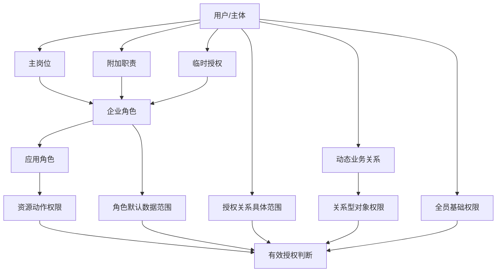

# Huizhi-yun 角色授权模型改进实施方案

> **当前实施参考（非发布或真实环境验收依据）**：最后事实核验：2026-07-11。当前事实源：根 `CLAUDE.md`、Platform/Console/Foundation 当前 `CLAUDE.md`、[`MODULE_CONTRACTS.md`](MODULE_CONTRACTS.md)、[`platform/docs/Platform-Role-Permission-Design.md`](../platform/docs/Platform-Role-Permission-Design.md)、应用 manifest 与对应自动化测试。本文的阶段性“已完成”只指仓库代码或离线验证证据，不表示 migration/seed、policy bundle 物化、Cloudflare 部署、真实租户权限验收或生产发布已经执行；这些外部动作须按目标环境单独、明确授权。

> 文档状态：开发实施建议稿（P0 已部分提交，P1 合并权限与模拟已部分落地，P2 数据范围与授权生命周期正在分步落地，P3 静态/表驱动角色冲突规则、基础权限解释、成员权限页基础版与岗位职责目录基础版已接入；新增 Console/Foundation 授权事实源收敛方案与 TODO，见“实施进度”）
> 适用范围：Platform、Console、Foundation、各业务应用及 Policy Bundle / Tenant Runtime
> 核心决策：**普通运行默认合并全部有效权限；具备授权模拟能力的系统管理员可主动进入严格角色模拟模式。**
> 源码基线：基于本次提供的 `huizhi-yun` 源码快照进行静态分析。

---

## 实施进度（截至 2026-07-07）

> 本节记录方案落地进度，与下方设计正文配套；源码基线已从静态分析推进到部分编码落地。状态分四类，写明提交、验证与未接入项，避免高估进度。

### 已完成并提交

- **3.3 动作蕴含方向修复**：以 `actionSatisfies(granted, required, policy?)` 作为单一事实源，方向钉死“持有方蕴含需求方”（`admin` 默认满足 `view/edit`，但不蕴含 `approve` 等敏感动作；`edit` 仅蕴含 `view`）。platform `server/utils/authorization.ts` 的 `checkPermission` 与 console `server/utils/policyAuthorization.ts` 的 `hasPermissionInSnapshot` 两侧生产路径均已改用同一函数。提交时回归：authz-core golden 10/10、platform `test` 24/24；当前工作树验证见“本轮验证”。提交：platform `7a3cdbf` / `7e06a59`、console `5ba2608`。
- **共享授权包 `@hzy/authz-core`（方案 B）**：platform 仓导出、零框架依赖的纯算法 core，含 `actionSatisfies` / `evaluate`（授权单元遍历、权限并集但范围不跨授权拼接）/ `scopeMatches`（同维度 OR、跨维度 AND）/ `isEnterpriseRole`，以及 `GrantSource` / `RelationResolver` port 与全部判定类型。采用**单文件 `src/index.ts`**，已注册进根 `pnpm-workspace.yaml`。
- **跨仓消费验证（方案 B 关键环节）**：console（独立仓）经 `workspace:*` 跨仓消费 platform 仓的 `@hzy/authz-core`，console 与 platform `typecheck` 均 `EXIT=0`，证明“Platform 导出、Foundation / 业务应用消费”可行。

### 本轮已完成（2026-07-02 已全部提交）

> 本小节所列改动已于 2026-07-02 提交至各模块仓；insights / align 的授权收敛残留于 2026-07-07 提交（insights `20fac07`、align `ce50c7c`）。

- **3.4 自定义企业角色过滤**：生产路径已接入。platform `ENTERPRISE_TENANT_ROLE_SQL` 已改为 `app_code IS NULL + status=active + is_assignable=1`；console `policyAuthorization.ts` / `userApplications.ts`、Foundation `/api/user/applications` 和 6 个业务应用授权路径均改为通过 Foundation `isEnterpriseRoleRecord()` 调用 `@hzy/authz-core` 的 `isEnterpriseRole`。core 同时兼容 bundle/SQL 常见的 `isAssignable=0/1/'0'/'1'`。
- **角色有效性判断统一**：企业角色有效性已统一到 core 语义；系统角色来源仅保留为展示、权限展开和 legacy systemRolePermissions 去重上下文，不再决定租户自定义企业角色是否进入运行时 `availableRoles`。
- **敏感动作精确权限（部分完成）**：platform ops 已将订阅订单确认映射到 `ops.subscriptions/confirm`、应用版本发布映射到 `ops.applications/release`、部署写入和租户策略包生成映射到 `ops.deployments/deploy`；tenant-admin 订阅开通、套餐 subscribe、部署创建/更新、租户 runtime token 轮换、data-runtime static token 生成、直接主体角色授予/撤销、租户角色定义/权限/范围/应用角色映射和系统角色启用/同步已要求租户 owner；Console 目录主体导出已从 `directory_sync/view` 收紧为 `directory_sync/export`，并同步 manifest 与推荐角色；Console 已激活状态下的 activation bundle refresh / retry 已收紧为 `system_settings:admin`，Foundation 兼容 `/api/platform-activation/retry` 也已在已激活后要求 Console `system_settings:admin`，未激活初始化 retry 保持可用，工作日历月度 service 接口已收紧为仅接受 `system_settings:view` service actor；finance 已将回款确认、对账、费用台账默认/显式确认、费用报销/项目支出/付款申请 direct `approved|paid` 状态和开票申请 direct `approved|issued` 状态映射到 `confirm|approve` 精确动作，People 成本参数/绩效金额 service 读取已收紧为仅允许 People 来源，并同步 Finance manifest 推荐角色；aims 周报导出和需求规格书导出已要求 `reports/export`，需求评审 `approve/reject`、里程碑 `review-approve` 和 legacy 审批记录项目/里程碑处理已要求 `projects/approve`，工作项 `confirm-append/reject-append/confirm-distribute` 及 legacy 工作项审批处理已新增 `work_items:confirm` manifest 动作并在状态变更前校验，Aims 项目经理 seed 与角色设计文档已同步该动作，产品版本 service 读取已收紧为仅允许 Assets 来源；people 绩效周期确认/关闭改为 `performance_cycles/approve`；assets 增加 `/api/v1/**` 转发前权限 middleware，将采购/资产操作审批回写和直接生效操作映射到 `approve`，并为本地 service API 例外补强邻近 `assets:read|write` service token 校验回归；codocs 为文档/部门文档导出增加 `export` 动作并在下载、Slidev 导出、部门 DOCX 导出入口检查；altoc 增加 `/api/v1/**` 转发前权限 middleware，将报价/合同审批、回款确认、回款可开票同步、服务工单关闭与交付回写同步映射到精确动作，并移除用户态 `altoc:admin` 角色的敏感动作通配，合同履约启动本地编排入口已把 service token 调用收紧到 `altoc/workflow` 来源和 `altoc:contract:edit` 等效 scope；workflow 已将任务同意/驳回/委托映射为 `workflow_tasks:approve|reject|delegate`，实例撤回/重新提交映射为 `workflow_instances:cancel|resubmit`，Nuxt fallback 与 tenant-runtime 转发路径均先校验精确动作，`workflow:admin` 推荐角色不再默认携带这些业务动作；webdev 作业创建已按结构化任务字段区分 `webdev_workspace:execute` 与 `webdev_workspace:deploy`，部署类任务、部署模板和部署命令必须精确持有 `deploy`，普通 prompt 不会因为提到 deploy 文本而提权，手动领取 Issue 创建 Codex 任务前也要求 `webdev_workspace:execute`；Align 仍保持暂缓脚手架，本轮新增权限面回归锁定仅暴露 `dashboard/admin` 资源、`/admin/**` 只要求 `admin`，且无 `approve/confirm/export/deploy` 菜单、路由或业务 API 文件名。
- **Console Account 管理面兼容写接口权限（已完成）**：迁移期保留的 `/api/v1/companies/**` 企业资料、业务领域、区域和行政区划写接口已在读取请求体、初始化标准区域模板或修改 `org_profiles / org_business_domains / regions / region_divisions` 前统一要求 `system_settings:edit`，避免旧 Account 管理面兼容入口只凭登录态改动 Console 企业基础配置；读取接口保持兼容只读路径。
- **Console 旧 Platform runtime config 兼容入口收紧（已完成）**：`POST /api/v1/platform-runtime/config` 会返回 Console `runtimeToken`，现已从“同租户 license 即可读取”收紧为只接受当前 Console deployment 的 license：`tenantCode`、`appCode=console`、`deploymentCode`、`kid`、签名和有效期均需匹配当前 Console runtime 配置；新业务应用仍走 `/api/v1/console/bootstrap/token` 的 license + bootstrap access key 短期 service token 交换。
- **Console 审计日志读取权限收敛（已完成）**：`GET /api/v1/login-logs`、`GET /api/v1/operation-logs` 和 `GET /api/v1/heartbeat/online` 已从仅页面路由守卫收紧为 API 自身先要求 `audit_logs:view`，再查询登录日志、操作日志或在线心跳；日志管理导航和 `/admin/logs` 路由改为消费专用 `audit_logs` 资源，Console manifest 新增 `audit_logs:view` 并仅授予 viewer/operator/security_admin/admin 等控制台治理角色，不默认授予目录基础角色。
- **统一在线状态与 Codocs clipboard actor 绑定（已完成）**：Codocs `/api/account/clipboard` 读写代理不再信任浏览器 query/body 的 `uid`，由 BFF `requireRequestUid(event)` 读取已验证会话 uid 后覆盖传给 Console runtime；全部 Foundation 业务应用统一继承共享 `POST /api/heartbeat` BFF，先验证 Console 用户会话，再以服务端 `public.appCode` 固定来源应用并转发 Console tenant-runtime。Console 自身也启用心跳，业务应用原有只返回成功的空壳接口已删除，浏览器不能伪造 uid/sourceApp。
- **P1 默认 merged 生产接入（部分完成）**：`@hzy/authz-core` 已新增 `selectEffectiveRoleCodes()` 与 `resolveAuthorizationMode()`，普通运行默认返回全部有效企业角色；客户端传入的 `authorizationMode=role_simulation/user_simulation/privileged` 在服务端未显式允许时会降级为 `merged`，避免 Query/Header 直接控制模拟模式。Platform `buildAuthorizationSnapshot()` / runtime authorizations / runtime permission check / deployment bundle snapshot 已接入；Console policy authorization 与两个权限快照 API 已接入；Console 与 Foundation 的 `/api/user/applications` 应用可见性过滤已改为按有效企业角色并集计算；Aims、Finance、Altoc、Assets、Codocs、Workflow 6 个业务应用的 policy bundle fallback 已改为复用 Foundation grant builder 默认 merged 展开权限，且调用 Console 权限接口时不再转发旧 `activeRoleCode` 查询参数；6 个业务应用的本地复制版 `platformBundleAuthorization.ts` 已全部删除，直接使用 Foundation 公共 loader。Aims 全局管理员扩权、Altoc/Assets/Codocs 本地开发 bypass 通过显式 options 保留模块差异。
- **Workflow tenant-runtime 本地 DB fallback 清理（继续推进）**：Workflow `server/middleware/data-runtime.ts` 已解耦旧 `flowEngine.ts` DB 依赖；管理配置接口 `action-defs / flow-schemas / form-schemas / routes` 的旧 Nuxt handler 已删除，不再保留本地 SQL fallback；审批实例、审批任务与动作列表主路径 `instances / tasks / actions` 的旧 Nuxt handler 也已删除，统一由 middleware 转发 tenant-runtime，runtime 不可用时返回统一 503。无运行时代码引用的旧 `flowEngine / routeMatcher / systemParameters / callbackService` DB utils 已删除，避免 Nuxt auto-import 重新启用本地流程引擎。测试已锁定这些 runtime 主路径目录不再存在本地 handler，`action-defs/sync` 作为 service token 校验入口继续保留。
- **Finance tenant-runtime 本地 DB fallback 清理（已完成）**：Finance `maybeCallCurrentFinanceDataRuntime()` 已对 `POST/PATCH/PUT/DELETE` 写路径在 tenant-runtime 未处理时直接返回 503，阻断审批/确认/台账写接口继续进入旧本地 SQL 分支；高风险 `workflow/callback` 本地 SQL 回调分支已物理移除，BFF 仅保留 tenant-runtime 转发和未命中 503；开票申请、费用报销、项目支出申请、付款申请的创建、编辑和提交 12 个 Nuxt 写入口已改为 runtime-only，旧 `submitApproval()` / `applyApprovalResult()` 本地审批提交与落账 helper 已删除；正式发票、到账、收款归类、费用台账、会计对象、员工成本/贡献、项目成本分摊、银行账户/余额、绩效规则/重算、对账作废、财务设置和 WizBiz 迁移导入等写入口均已移除本地持久化 fallback；列表、详情、汇总、报表导出、银行账户余额、项目核算、合同汇总和迁移状态等 GET 入口也已改为 tenant-runtime-only，runtime 未命中统一 503。旧 `financeList / financeRecord / financeReports / financeSummary / financeMigration / financeCalculation / financeAudit / financeWrite` helper 与本地审计 middleware 已删除，源码回归已遍历 Finance API/server，锁定不得重新导入本地 DB、财务本地读写工具、汇总重算或迁移工具。
- **Finance 发票文件预览对象事实校验（已完成）**：`GET /api/v1/finance/invoices/files/view` 虽作为本地对象存储签名代理保留，但已在签名前用请求中的发票 `code` 调 Finance tenant-runtime 读取可见发票事实，并要求请求的 URL/object key 与 `finance_invoice.invoice_file_url` 匹配；列表页和发票编辑页的预览链接会携带发票编码，避免只有 `invoices:view` 的用户凭猜测 OSS key 获取任意发票文件签名 URL。新增 Finance 源码回归锁定预览代理必须先完成 runtime 发票事实校验。
- **Finance 审批提交与审批结果边界收敛（已完成）**：Finance BFF 提交开票、报销、项目支出和付款审批时会忽略浏览器传入的 `skipWorkflow/workflowInstanceId/workflowStatus/approvalActorUids` 等 workflow/approval metadata，并且 Workflow 实例创建失败时直接 503，不再生成 `local` fallback 实例；data-runtime `SubmitApproval` 只允许带真实 Workflow instance 进入 `pending_approval`，禁止 `workflowPlatform=local` 和 `workflowStatus=approved|rejected|paid|issued` 等终态，审批通过、驳回、取消只能由 `workflow/callback` 服务令牌路径触发。新增 Go/Node 回归锁定 submit 不能绕过 Workflow 直接落账或伪造审批结果。
- **Codocs 发布申请 Workflow 绑定边界收敛（已完成）**：Codocs 用户会话接口 `POST /api/reviews/publish-requests/{id}/workflow-instance` 仅负责绑定真实 Workflow 实例并固定把发布申请置为 `running`，不再读取或透传浏览器请求体中的 `status=approved|rejected|cancelled` 作为审批终态；发布审批结果必须后续通过专用 Workflow 回调/service-only 路径承载，避免 `reviews:submit` 用户绕过审批流直接改写发布申请终态。新增源码回归锁定该绑定接口不得重新接受客户端终态。
- **Collab Runtime 权限面审计（已完成）**：Collab 作为 service-only internal runtime 保持 `bundleEnabled=false`、无推荐企业角色，仅暴露 `runtime:view/admin`；新增 `collabPermissionSurface` 源码回归锁定模块没有 Nuxt `server/api` 业务 handler，Hocuspocus runtime HTTP 只暴露 `health/runtime/providers`，Cloudflare Durable Object 只暴露健康路由，且源码 route-like 字符串不包含 `approve/confirm/export/deploy/release/publish/archive/download` 等 Codocs 业务动作端点。
- **Notification Runtime 投递运维敏感端点（已完成 API，Console UI 另批）**：投递查询与不确定结果对账拆分为 `notification-runtime:deliveries:read` 和 `notification-runtime:deliveries:reconcile` 两个精确 service capability，均不由 `send`、`admin` 或通配 scope 蕴含；GET 只返回 token 所属 tenant/deployment 的脱敏 ledger 事实，POST 只允许凭人工证据把当前 `partial_unknown` CAS 为 `succeeded|failed` 并追加不可变审计。`processing/succeeded/failed` 不可通过管理端点重置，failed 后只能由原业务来源携原 key/hash 经过 Claim/fencing 受控重试。推荐由安全/运行运维职责持有 read，由更窄的事故处置职责持有 reconcile；普通业务角色和业务应用 service client 不默认获得两项能力。
- **Data Runtime Aims 审批人绑定（已完成）**：Aims tenant-runtime `POST /v1/aims/requirement-reviews/{batchId}/approve` 已移除请求体 `approvedBy/approved_by` 覆盖，需求版本 `approved_by` 与 `created_by` 均来自受信 `current_user` 查询上下文；新增 `TestApproveRequirementReviewBatchUsesTrustedCurrentUserAsApprover` 和源码回归锁定请求体不能伪造需求评审批次审批人。
- **Data Runtime Assets 资产操作审批人绑定（已完成）**：Assets tenant-runtime actor 解析已改为优先读取受信 query 的 `operator_uid/current_user`，body 仅作兼容兜底；资产操作创建记录的 `requested_by` 和 Workflow 审批同步写入的 `approved_by` 均来自受信 operator，不再接受请求体 `approvedBy/approved_by` 覆盖；新增 Go 行为回归与源码回归锁定。
- **Data Runtime Assets 资产操作终态写入边界收敛（已完成）**：Assets tenant-runtime `POST /v1/assets/assignments` 创建路径已收紧为只能创建 `pending` 资产操作记录，不再接受 `status=active|returned|released|completed|cancelled` 等终态，也不再在创建事务中直接调用 `applyAssignmentEffect()` 联动资产主档；资产操作生效、归还、释放、完成或取消只能通过 `/v1/assets/assignments/{id}/workflow:sync` 的 Workflow 同步路径产生。新增 Go 行为回归和 Assets 源码回归锁定。
- **Data Runtime Assets 采购单流程状态边界收敛（已完成）**：Assets tenant-runtime `POST /v1/assets/purchase-orders` 普通创建路径只允许创建 `draft` 采购单，拒绝 `status=approved|received|completed|closed` 等流程终态；`PATCH /v1/assets/purchase-orders/{id}` 普通更新路径不再接受 `status`、`workflow_instance_id/workflowInstanceId` 或实例号字段，提交审批只能通过 `/submit` 写入 `pending_approval + workflow_instance_id`，审批结果只能通过 `/workflow:sync` 写入 `approved/rejected/closed`，入库/激活只能通过 `/receipts` 推进 `received/stocked`。采购单创建/编辑表单也已移除普通状态选择和提交字段，新增 Go/Node 源码回归锁定。
- **Codocs 管理员敏感删除/清理动作补齐（已完成）**：Codocs manifest 中 `documents` 资源声明了独立 `delete` 动作，`admin` 不再隐式蕴含删除后，`codocs:admin` 已显式补入 `codocs:documents:delete`，`DELETE /api/documents/:uuid` 已在 OSS 回收和 tenant-runtime 删除前要求 `documents/delete`；资讯书签管理、资讯删除、图片清理和 YJS 残留清理等 Codocs 管理面副作用入口已在 runtime、fetcher 或 OSS 调用前分别要求 `info/admin` 或 `admin/admin`；公司资产建目录、移动、归档、删目录和部门资产归档等 OSS destructive 入口已由源码回归锁定必须先校验 `company/admin` 或 `departments/admin`，再读取请求体、复制/删除 OSS 或写审计；项目 Issue 创建、更新和删除已在目录查询、runtime 写入或通知副作用前要求 `projects/edit`，创建人只取已验证会话 uid，不再信任请求体 `created_by`。普通 `editor`、`records_manager`、`publisher` 和 `space_admin` 不获得该敏感删除能力，角色拆分与敏感路由回归已锁定。
- **Data Runtime Altoc actor 授权上下文收敛（已完成）**：Altoc tenant-runtime `altocRuntimeBodyFromRequest()` 已改为 query 中存在任一 runtime 授权上下文时完全采用受信 query 的 `current_user/operator_uid/current_user_scopes/部门/数据范围`，请求体授权字段只在 query 完全缺失上下文时作为兼容兜底；`altocCommandBodyFromRequest()` 会剥离 body 中伪造的 actor、scope 和 data-scope 字段，只保留业务字段后再合并受信 runtime context；Altoc 本地 BFF 编排使用 scoped data access query 时也会注入已验证会话 actor，合同/回款开票、履约启动和逾期扫描不再优先使用浏览器 body 中的 `operatorUid/current_user`；新增回归锁定 body 不能覆盖 BFF/Foundation 注入的 actor、scope 或数据范围。
- **Data Runtime People / compat actor 授权上下文收敛（已完成）**：通用 compat adapter 已在 query 存在 runtime 授权上下文时忽略 body 中的 actor、scope、数据范围和部门上下文字段，query 完全缺失时才保留 body 兼容兜底；People 绩效周期确认/关闭和成本快照生成已改为 query operator 优先，People admin 编排端点显式传受信 `current_user/operator_uid` query，避免默认转发浏览器 query；新增 Go 回归锁定 body 不能覆盖 Foundation/BFF 注入的 actor、scope 或数据范围。
- **Data Runtime People 任职审批终态写入边界收敛（已完成）**：People 通用 `/v1/people/assignments` 创建/更新路径已禁止请求体直接写入 `approval_status` 或 `workflow_instance_id`，任职审批结果只能通过 `POST /api/v1/service/workflow/callback` 校验 `workflow:callback` 服务令牌后由 data-runtime service callback 回写；员工详情页手动任职调整不再提交 `approval_status='approved'`，避免普通 `assignments:edit` 绕过审批回写边界。
- **Data Runtime People 绩效周期终态写入边界收敛（已完成）**：People 通用 `/v1/people/performance-cycles` 创建/更新路径已禁止请求体直接写入 `status/confirmed_at/closed_at` 等终态字段，终态变更必须走 `service/performance-cycles/{cycleCode}:confirm|close` 专用 action，并由 People BFF 先要求 `performance_cycles:approve`；People BFF 创建绩效周期时不再向通用 runtime 显式传 `status='draft'`，改用 schema 默认草稿状态。People API 契约文档已同步标记 confirm/close 要求 `performance_cycles/approve`，新增 Go/Node 回归锁定普通 `edit` 路径不能伪造绩效周期确认/关闭。
- **Data Runtime People 成本快照确认字段写入边界收敛（已完成）**：People 通用 `/v1/people/cost-snapshots` 创建/更新路径已禁止请求体直接写入 `confirmed_at/confirmedAt`，避免普通 `cost_snapshots:edit` 把成本快照伪造成已确认；`cost_snapshots:approve` 保留给后续专用确认 action 使用，新增 Go/Node 回归锁定普通 `edit` 路径不能伪造成成本快照确认。
- **Data Runtime Finance actor/scoped 授权上下文收敛（已完成）**：Finance tenant-runtime HTTP mutation 入口已改为 `HandleMutationWithQuery()`，当 URL query 中存在 runtime 授权上下文时，先剥离请求体里的 `current_user/operator_uid`、费用本人/部门、项目财务项目编码和绩效本人/部门等授权字段，再合并 Foundation/BFF 注入的受信 query；query 完全缺失上下文时仍保留 body 兼容兜底，供内部兼容调用使用。新增回归锁定浏览器 body 不能把项目财务范围伪造为 `all`，也不能覆盖受信 actor/scope。
- **Data Runtime Workflow actor 授权上下文收敛（已完成）**：Workflow tenant-runtime `HandleRuntime()` 已在入口统一规范化 mutation body，query 中存在 `current_user` 等受信 actor 时剥离 body 里的 `current_user/operator_uid/actor_uid` 等伪造字段，再把受信 actor 写回 `current_user/operator_uid`；审批同意/驳回/委托、实例撤回/重提和管理配置创建写入都复用该规范化 body。由于 Workflow BFF 会覆盖 `current_user` 但不清洗浏览器 query 中的 `operator_uid`，runtime actor 解析明确以 `current_user` 优先，避免用户 query 伪造 operator 覆盖登录用户；query 完全缺失 actor 时保留 body 兼容兜底。
- **Data Runtime Codocs actor 授权上下文收敛（已完成）**：Codocs BFF `withCurrentUser()` 已用已验证会话 uid 覆盖 `current_user/currentUser/operator_uid/operatorUid/actorUid/actor_uid`，不再保留浏览器请求体或 query 中的同名 actor；tenant-runtime `HandleRuntime()` 已在 query 存在受信 actor 时清洗 body 里的 actor、owner/editor 字段，并把 `created_by/updated_by` 等审计字段重写为受信 actor，`markDocumentRead()` 也改为 actor 优先于目标 `uid`，避免请求体伪造阅读人、所有人、编辑人或审计人；query 完全缺失 actor 时保留 body 兼容兜底，供 service-only 兼容路径使用。
- **多角色回归（部分完成）**：Foundation 新增 `buildAllowedAppCodesFromPolicyBundle()`，Console 与 Foundation `/api/user/applications` 共用同一套 policy bundle 应用可见性解析；新增 bundle-shaped 回归覆盖“普通运行合并全部有效企业角色”“服务端允许后 `role_simulation` 收窄到 active role”“无效模拟角色不回退到其他角色”“未授权角色模拟请求按 `merged` 处理”。Platform 新增无 Nuxt 别名依赖的授权快照组装 helper 与 DB-shaped 回归，覆盖多企业角色 merged、允许后角色模拟收窄、无效模拟角色不回退、未授权模拟请求降级为 merged。
- **P2 scope evaluator / grant adapter（部分完成）**：`@hzy/authz-core` 的 `AuthorizationGrant` 已支持 `defaultScopes` / `assignmentScopes` 分组判定，避免同维度角色默认范围与授权关系范围被错误 OR 合并；Foundation 新增 `evaluateFoundationScopedAuthorization()`、`foundationScopeSetMatches()` 与 `foundationGrantScopeMatches()` 纯服务端 evaluator，支持同授权内同维度 OR、跨维度 AND、多授权 OR，且权限与范围必须绑定在同一 grant 内判定；已覆盖角色默认范围与授权范围交集、部门树、项目成员/所有者和 `tenant:global`。Foundation 还新增 `buildScopedAuthorizationGrantsFromPolicyBundle()` / `evaluatePolicyBundleScopedAuthorization()`，可把 Policy Bundle v1 的 `subjectRoles.assignmentId`、`subjectMemberships`、`subjectRoleScopes`、`rolePermissions`、`roleScopes` 组装成 grant 并调用 evaluator。Platform 新增 `buildDbAuthorizationGrants()` / `evaluateDbAuthorization()` 和 `DbGrantSource`，可从 DB 形态的 `tenant_subject_memberships`、`tenant_subject_roles`、`tenant_role_permissions`、`tenant_role_scopes`、`tenant_subject_role_scopes` 构建同一授权单元并调用 core `evaluate()`。Aims 已在项目对象窄路径首批接入 scoped evaluator：项目列表已接入可安全转换为 SQL 的全局/部门/明确 `project_code` scoped admin 过滤，并把当前用户 `project:member|owner` 关系范围下沉为受信 query 标记，由 data-runtime 在 `projectScopedAdminWhere()` 中按成员/负责人 SQL 分支执行；项目对象上下文已改由 data-runtime 专用 `/v1/aims/projects/{id}/authorization-object` 只读端点解析，避免 scoped 判定前依赖 admin 项目详情，项目详情、项目更新、项目删除、项目成员列表/管理，`repos/milestones/work-items/requirements/requirement-contents/requirement-reviews/gitlab-commits` 等项目集合读取和其中可写集合创建，需求规格书章节 relation 读取，`documents` 项目文档路径，`products/releases` 项目产品/发布 runtime 路径，项目周报读取/保存，项目工时读取/录入/修改/删除，用户个人工时读取，工作项子任务/状态流转读取，工作项执行上下文读取，工作项文档读取/关联/取消关联，工作项工时读取/录入/修改/删除，工作项提交审批写入，项目 Markdown/其他文档创建，People 贡献同步工时读取，以及本地 runtime 转发的需求导出、Codocs 候选、GitLab 同步上下文/落库、需求变更 target 创建和需求导入会消费 `current_user_is_project_admin`，Codocs 内容/章节代理和工作项源章节代理已在读取 Codocs 正文前强制要求项目上下文并校验 Aims 项目文档/交付物归属，工作项需求分解上下文已在读取源项目组候选前执行项目成员/scoped admin 守卫；Altoc 主对象普通 view/edit 数据范围、Finance 费用申请单、费用台账读写、项目核算读取/项目编码型写入、员工财务贡献/绩效本人/部门范围与绩效规则/重算全局闸门、People 员工本人/部门范围、任职读取范围、成本快照读取范围、绩效周期读取范围和 Finance 绩效金额读取范围也已完成首批窄路径接入；Policy Bundle 已新增 v2 兼容投影字段，Foundation 直接 evaluator 回归已覆盖 `customer:owner|team`、`object:assigned`、`relation:*` 别名和 `environment/deploymentEnvironment` 范围匹配，bundle-shaped 回归已覆盖 v2 `roleAssignments` / `rolePermissionGrants` / `assignmentScopes` 下的默认范围与授权范围默认交集、`scopeMode=inherit` 只继承默认范围、`department:tree`、`project:member`、`customer:team`、`object:assigned`、`relation:*` 与 `environment:prod` 对象上下文判定，复杂跨维度组合、其他关系型列表范围、其他导出和其他业务模块范围过滤仍待后续阶段完成。
- **P2 scope evaluator 对象范围语义对齐（已完成）**：本轮把 `@hzy/authz-core` 的对象范围谓词补齐到 Foundation evaluator 语义，`project:member|owner` 会先匹配可选 `projectCode`，避免跨项目借用成员关系；`customer:owner|team`、`object:assigned` 和 `environment:prod` 均按对象事实匹配。新增 core golden test 和 Platform DB grant 回归锁定 `tenant_subject_role_scopes` 中的 `project:member:PRJ-001` 不能在 `PRJ-002` 上通过，即使当前用户也出现在该对象的成员列表中。
- **P2 授权生命周期字段与主体继承（部分完成）**：Platform 新增 `tenant_subject_roles` 的 `starts_at/status/assignment_kind/reason/approved_by_uid` 与 `tenant_account_roles` 的 `starts_at/status` 迁移和 DDL 草案；直接用户快照、控制台账户快照、Policy Bundle v1 `subjectRoles` 收集和租户管理员 subject-role API 已按 `status='active'`、已到 `starts_at`、未过期过滤。Platform 在线授权快照、Platform DB grant adapter、Policy Bundle v1 导出和 Foundation bundle adapter 已解析 active `tenant_subject_memberships` 中用户到部门/职位的 `member/manager/leader` 关系，可继承部门/职位主体上的角色与模板绑定；业务对象级生产过滤已扩展到 Aims、Altoc、Finance、People 首批窄路径，Policy Bundle v2 和更多业务路径仍待后续阶段完成。
- **P2 assignment scope 表（已建表，Foundation/Platform helper 已可解释，首批窄路径已接入）**：Platform 新增 `tenant_subject_role_scopes` DDL 与 v2.20 迁移，Policy Bundle v1 导出 `subjectRoles.assignmentId` 和 `subjectRoleScopes`；Foundation bundle adapter 与 Platform DB grant adapter 已能将其转换为同一授权关系内的 grant 并执行 `inherit/intersect/replace` 范围判定。现有扁平 `checkPermission` 不直接合并该范围，避免破坏同一授权单元语义；除 Aims 项目列表（全局/部门/明确 `project_code` 过滤）、项目详情、更新、删除、成员列表/管理、部分项目嵌套集合、需求规格书章节 relation、项目文档、项目产品/发布、项目周报、项目工时、用户个人工时、工作项工时、项目 Markdown/其他文档创建、People 贡献同步工时读取、需求导出/GitLab 同步、需求变更 target 创建和需求导入，以及 Altoc 主对象普通 view/edit 数据范围、Finance 费用申请单本人/部门范围、费用台账读写范围、项目核算读取/项目编码型写入范围、员工财务贡献/绩效本人/部门范围与绩效规则/重算全局闸门、People 员工本人/部门范围、任职读取范围、成本快照读取范围、绩效周期读取范围和 Finance 绩效金额读取范围等窄路径外，其他业务 API 对象上下文接入仍归入后续阶段。
- **P2 Policy Bundle v2 兼容投影（部分完成）**：Platform `buildPolicyBundlePayload()` 已把主 `schemaVersion` 切换为 `policy-bundle.v2`，新生成 bundle 不再输出已被 v2 替代的 `subjectRoles`、`subjectRoleScopes`、`rolePermissions`、`roleScopes`、`baselinePermissions` 冗余字段，并输出 `compatSchemaVersions=['policy-bundle.v2']`、`policyRevision`、`roleAssignments`、`rolePermissionGrants`、`assignmentScopes`、`roleDefaultScopes`、`baselineGrants`、`actionImplications` 和 `conflictRules` 顶层字段。`rolePermissionGrants` 是 v2 角色权限事实投影，保留来源类型、应用角色、manifest action 和状态；`rolePermissions` 只作为历史 bundle 兼容字段，Foundation/Console 优先读取 `rolePermissionGrants`，缺失时回退历史 `rolePermissions`，且 v2 字段存在时已由回归锁定不会混入历史 `rolePermissions` 的陈旧 app 或权限。`roleAssignments` 会把直接授权生命周期字段投影为 `assignmentKind/sourceType/sourceId/startsAt/expiresAt/status`，Foundation 优先读取 v2 `roleAssignments`，且已由回归锁定 v2 字段存在时不会混入历史 `subjectRoles` 的陈旧角色；`assignmentScopes` 保留同一 assignment 上的范围上下文，Foundation 优先读取 v2 `assignmentScopes`，且已由回归锁定 v2 字段存在时不会混入历史 `subjectRoleScopes` 的陈旧范围；`roleDefaultScopes` 保留角色默认范围，Foundation 优先读取 v2 `roleDefaultScopes`，且已由回归锁定 v2 字段存在时不会混入历史 `roleScopes` 的陈旧默认范围；`actionImplications` 明确只包含 `edit -> view` 与 `admin -> view/edit`，不会让 `admin` 蕴含 `approve/confirm/export/deploy` 等敏感动作；`conflictRules` 合并内置规则和 active 租户表规则，租户同 `ruleCode` 可覆盖内置。`policyRevision` 已改为由 Platform `tenant_policy_revisions` 状态表驱动的租户级单调版本，`policy_hash` 相同的重复生成不递增，事实变化才递增，并在 `policy_bundles` 中快照；Console 普通权限快照、scoped authorization 快照和 Foundation 业务应用授权 helper 已透传；Foundation 应用可见性/范围授权与 Console 权限快照已优先消费 v2 `roleAssignments`、`rolePermissionGrants`、`assignmentScopes`、`roleDefaultScopes`、`baselineGrants`，并在缺失时回退历史 v1 字段；Console 快照同时按 active 部门/职位 membership 继承主体授权；Foundation scoped evaluator、Policy Bundle scoped adapter、Console 扁平权限检查和 scoped authorization 已按 v2 `actionImplications` 构造 `@hzy/authz-core` action policy；Foundation 已新增基于已验签 bundle 的实例冲突解释 helper，Console current-user 实例冲突解释入口会在 bundle 含 active `conflictRules` 时优先本地解释，旧 bundle 或本地解释不可用时才回退 Platform internal API。
- **P3 静态/表驱动角色冲突规则（部分完成）**：Platform 新增代码配置型 `STATIC_ROLE_CONFLICT_RULES` 与 `evaluateStaticRoleConflicts()`，支持 `warning` / `enforce` 两种执行级别；租户管理员 subject-role 授权写入前会加载目标主体既有有效角色和候选角色的直接权限、应用角色映射权限并评估冲突，`enforce` 冲突返回 409，`warning` 冲突随响应返回。Console `AuthorizationsManager` 授权成功后会展示冲突预警 toast。当前内置规则覆盖 Finance 费用/付款制单与审批/确认、Assets 采购/资产操作经办与审批、People 任职/成本/绩效经办与审批、Webdev 执行与部署、Codocs 文档发起与审阅审批/发布归档等高风险职责组合；全部默认 `warning`，符合中小企业“可兼任但实例双人校验”的策略。Platform 已新增 `tenant_role_conflict_rules` DDL 草案与 v2.21 迁移，运行时会合并 active 租户表规则并允许同 `rule_code` 覆盖内置规则；Console 已接入基础租户自定义规则列表、新增/编辑和启停 UI。岗位职责目录已新增租户级分类治理元数据、v2.22 迁移、页面内联保存和规则生成拆分建议；成员权限页已支持把可分配企业角色作为 `position` 主岗位、`duty` 附加职责、`temporary` 临时授权或 `privileged` 高风险特权直接授予/撤销，并在有效角色/直接授权分类展示中优先复用岗位职责目录治理元数据，未迁移时降级为推断分类；People active employment 投影已驱动 Platform 同步 People 来源主岗位授权；Platform 已新增租户管理员只读实例级冲突解释 API，可结合表驱动/内置冲突规则、授权单元解释和业务实例发起人/申请人/经办人上下文解释自审批风险；Console 已提供 current-user 代理，Foundation 已提供统一 helper，Finance 已作为首个业务应用新增 `/api/v1/finance/authorization/instance-conflict-explain`，按真实 tenant-runtime 单据事实解释费用审批/付款确认自审批风险，并已在费用报销、项目支出审批、付款申请和支出台账页面提供行内“冲突”解释弹窗；Assets 已新增 `/api/v1/authorization/instance-conflict-explain`，按 tenant-runtime 采购单申请人事实和资产操作 `requested_by` / 目标用户事实解释采购审批、资产操作审批自审批风险，并已在采购单列表与资产操作记录列表提供行内“冲突”解释弹窗；People 已新增 `/api/v1/authorization/instance-conflict-explain`，按任职变更 `created_by` / `employee_uid` 事实解释入转调离审批自审批风险，并已在任职变更列表提供行内“冲突”解释弹窗；Webdev 已新增 `/api/webdev/authorization/instance-conflict-explain`，按持久化任务 `createdBy` 事实解释开发执行人与部署人同人的风险，并已在历史记录任务列表提供行内“冲突”解释弹窗；Altoc 已新增 `/api/v1/authorization/instance-conflict-explain`，按 tenant-runtime 报价、合同与回款计划对象事实解释报价审批、合同审批和回款确认风险，并已在报价管理、合同管理和回款管理列表提供行内“冲突”解释弹窗；Aims 已新增 `/api/v1/authorization/instance-conflict-explain`，由 data-runtime 只读事实端点按需求评审批次 `submitted_by`、审批记录 `requested_by/reviewer_uid` 和项目部门/项目编码解释需求评审审批与工作项确认风险，并已在需求评审批次详情提供行内“冲突”解释弹窗；Codocs 已新增 `/api/reviews/authorization/instance-conflict-explain`，按 tenant-runtime 审阅记录 `initiator_uid` 与文档/归档目标事实解释审阅审批和确认发布自审批风险，并已在审阅详情页提供行内“冲突”解释弹窗；Workflow 已新增 `/api/v1/authorization/instance-conflict-explain`，按 tenant-runtime 审批任务详情的 `initiator_uid` 与 `assignee_uid` 事实解释审批任务自审批/职责冲突风险，并已在任务详情待审批卡片提供行内“职责冲突解释”入口；Platform 企业工作台“角色授权”页已新增实例职责冲突解释入口。其他未接入业务应用展示和可登录环境复验仍待后续完成。
- **本轮新增验证（Altoc/Aims/Workflow 内置职责冲突规则）**：Platform 内置 `STATIC_ROLE_CONFLICT_RULES` 已补 Altoc 报价经办/审批、合同经办/审批、回款经办/确认，Aims 项目经办/审批、工作项经办/确认、工时填报/审批，以及 Workflow 流程发起/任务审批分离规则。`staticRoleConflicts` 回归新增 manifest action 一致性检查，确保全部内置规则引用的资源动作都来自对应应用 manifest；`policyBundleSchemaVersion` 和 `policyBundleV2Compat` 回归锁定这些内置规则会和租户表规则一起进入 `policy-bundle.v2` 的 `conflictRules`。
- **P3 基础权限解释（部分完成）**：Platform 新增 `explainDbAuthorizationWithQueries()`，复用 DB grant adapter 和 authz-core `evaluate()`，可返回允许/拒绝、`no_permission` / `scope_not_matched` / `allowed` 原因、命中授权单元、候选授权单元及默认范围/授权关系范围来源；DB grant adapter 已与 Foundation bundle grant path 对齐，针对有效用户自动叠加 `baseline` 授权单元，成员权限页和 explain API 会把基础权限显示为 `baseline` 来源且不作为普通企业角色展示；租户管理员新增 `/api/platform/tenant-admin/authorization-explain` 只读 API，Console `AuthorizationsManager` 已接入基础权限解释表单，支持按用户、app/resource/action 和常用对象上下文字段预览有效权限来源；本轮进一步统一租户管理员权限解释与实例冲突解释的对象上下文解析，支持 `ownerUid/departmentCode/departmentTree/projectCode/projectMemberUids/customerOwnerUid/customerTeamUids/assignedUid/assignedUids/matchedRelations/environment/deploymentEnvironment`，并补齐 `@hzy/authz-core` 对 `environment:prod` 谓词范围的匹配，使 Platform DB explain 与 Foundation evaluator 的环境范围语义一致；Platform tenant-admin 权限解释已新增客户团队和对象指派范围回归，角色授权页与成员权限页也会透传这些对象上下文字段；同页已新增实例职责冲突解释入口，支持按用户、权限三元组、模拟模式和业务实例主体解释自审批/同人经办风险。Platform 企业工作台已新增成员权限页基础版，可按成员查看有效角色/权限来源，并在页内按选中成员和可选角色模拟收窄执行权限解释；成员权限页已软联动 Console 全局模拟会话，能读取当前 role/user simulation、同步目标用户、角色和 includeBaseline 语义，读不到 Console endpoint 时保持 Platform 独立运行；同页已新增直接授权列表与主岗位/附加职责授予、手动授权撤销，角色分类展示已优先读取岗位职责目录治理元数据。跨业务对象自动拉取事实的通用“为什么有权/无权”诊断仍未完成。
- **Aims 首批 scoped authorization 接入（部分完成）**：Aims 新增 `checkAimsScopedPermission()` 与 `resolveAimsProjectAuthorizationObject()`，从本地已缓存 policy bundle 调用 Foundation `evaluatePolicyBundleScopedAuthorization()`；项目对象上下文通过 data-runtime 专用只读端点 `/v1/aims/projects/{id}/authorization-object` 解析项目编号、负责人、创建人、部门和成员 uid，Aims 不直连业务库，也不再为 scoped admin 判定预读 `/admin/projects/{id}`。`GET /api/v1/projects` 已把全局/`tenant:global` 项目管理员映射为全量列表，把可安全表达的部门 scope、明确 `project_code` scope 与当前用户 `project:member|owner` 关系 scope 映射为 data-runtime 列表过滤键；复杂跨维度组合或其他无法安全表达为 SQL 的关系型 scope 不在列表层放大。项目入口 `GET/PUT/PATCH/DELETE /api/v1/projects/{id}` 会用该对象上下文计算 `current_user_is_project_admin`：详情可见性把该标记作为项目可见性分支，更新要求项目经理或 scoped 项目管理员，删除仍要求草稿项目且项目经理或 scoped 项目管理员；`GET /api/v1/projects/{id}/members` 已在 data-runtime 读取前执行项目可见性或 scoped admin 检查；`POST/DELETE /api/v1/projects/{id}/members` 已迁到 data-runtime，新增、移除和暂停成员要求项目经理或 scoped 项目管理员，并保留“不能移除自己”和“有工作项只能暂停”的业务规则；`repos/milestones/work-items/requirements/requirement-contents/requirement-reviews/gitlab-commits` 项目集合读取已统一要求项目可见或 scoped admin，其中可写集合创建要求项目经理或 scoped admin；`GET /api/v1/projects/{id}/requirements/spec` 的章节 relation 读取已改由 data-runtime 按 content 反查 project 后执行项目可见性或 scoped admin 检查；`GET/POST/PUT/PATCH /api/v1/projects/{id}/documents` 已注入项目可见性与 scoped admin 上下文，data-runtime 读取项目前要求项目可见或 scoped admin，绑定/替换文档保留创建人/负责人兼容分支并新增项目经理或 scoped admin 分支；`products/releases` 项目产品/发布 runtime 路径已注入 scoped admin 上下文，data-runtime 的项目成员/经理 helper 会把该标记作为项目成员/经理能力分支；`GET/POST /api/v1/projects/{id}/weekly-reports` 已注入项目可见性与 scoped admin 上下文，data-runtime 读取周报要求项目可见/成员或 scoped admin，保存周报要求项目经理或 scoped admin，同时保留全局周报管理权限分支；`GET/POST/PATCH/DELETE /api/v1/projects/{id}/time-entries` 已注入项目可见性与 scoped admin 上下文，data-runtime 读取工时要求项目可见或 scoped admin，录入/修改/删除工时时 scoped admin 可通过项目访问校验，但修改/删除仍保留只能操作本人记录的业务规则；直接 `PUT/PATCH/DELETE /api/v1/work-items/{id}` 已由 Aims middleware 注入可信项目 scoped admin 列表范围，data-runtime 通用 CRUD 前先按工作项反查项目，并要求当前用户为项目成员或匹配 scoped 项目管理员，避免任意登录用户跨项目修改/删除工作项；本地 Nuxt `markdown-documents` / `other-documents` 创建入口已复用项目 scoped access query，允许项目 scoped admin 通过创建前校验；本地 Nuxt `people-contributions/sync` 已改为要求登录用户，并用项目 scoped access query 读取工时后同步 People；本地 Nuxt runtime 转发的 `requirements/export`、`requirements/codocs-candidates`、`sync-gitlab`、`requirement-targets` 和 `requirements/import` 会先构造项目部门范围与 scoped admin 标记，data-runtime 侧读取需求导出/Codocs 候选/GitLab 同步上下文前要求项目可见或 scoped admin，GitLab commit ingest、需求变更 target 创建和需求导入落库前要求项目经理或 scoped admin；Codocs 内容/章节代理 `/api/v1/codocs/documents/{uuid}/content|section` 已强制要求 `projectId`，需求分解页和需求导入向导调用正文代理时传入项目 ID，并在读取 Codocs 正文前复用项目文档/交付物归属校验；工作项源章节代理 `/api/v1/work-items/{id}/source-sections` 已把 scoped 项目管理员上下文传给 runtime，runtime 按工作项反查项目并返回 `projectId`，BFF 再逐个校验源文档归属后才读取 Codocs 正文；管理员入口 `GET/PUT/PATCH/DELETE /api/v1/admin/projects/{id}` 不传对象上下文，只允许无范围或 `tenant:global` 的项目管理员能力作为系统级入口。该 scoped helper 也已改为普通运行 merged，不再强制按旧 active role 做 `role_simulation`。
- **Aims 周报汇总导出 scoped 范围补齐（已完成）**：`GET /api/v1/weekly-reports/export` 在 `reports:export` 动作校验后复用项目列表 access query 注入当前用户部门、管理部门和 scoped project admin 范围；data-runtime `/v1/aims/weekly-reports/export-data` 与周报汇总 SQL 复用 `projectVisibilityWhere(query, "p", currentUser)`，导出的项目汇总和明细工作项只来自用户可见项目集合。
- **Aims 工作项需求分解 scoped 范围补齐（已完成）**：`POST /api/v1/work-items/{id}/decompose-submit` 已从 Aims BFF 注入项目列表可见性和 scoped project admin 范围，并在转发 data-runtime 前剥离请求体中的 `current_user/operator_uid/uid`，actor 只来自服务端构造的受信 query；data-runtime 从工作项反查项目后，在需求分解落库和工时写入事务前要求项目负责人/项目经理或匹配部门/项目编码的 scoped 项目管理员，且不会把普通项目可见性分支放大为写权限。`GET /api/v1/work-items/{id}/decompose-context` 也已从 BFF 传入 scoped 项目管理员上下文，data-runtime 在返回源项目组候选、既有分解锚点和后续 Codocs 候选文档拉取依据前，按工作项所属项目执行项目成员或 scoped 项目管理员守卫。
- **Aims 工作项提交/撤回审批写入 scoped 范围补齐（已完成）**：`POST /api/v1/work-items/{id}/submit` 和 `POST /api/v1/work-items/{id}/withdraw` 已从本地 Nuxt DB handler 迁到 tenant-runtime/data-runtime；Aims BFF 在转发前注入 scoped project admin 列表范围，data-runtime 在提交时校验直接/分项执行信息和交付物要求、插入 `approval_records`、更新 `work_items.approval_status` 前要求项目负责人/项目经理或匹配 scoped 项目管理员；撤回时同样要求项目负责人/项目经理或匹配 scoped 项目管理员，并复验 pending 审批记录的 `requested_by` 等于当前 actor；`requested_by` 和撤回 actor 只取受信 `current_user`/`operator_uid` 查询上下文，忽略请求体伪造 actor，本地 handler 仅保留 tenant-runtime 未启用时的 503 兜底。
- **Aims 工作项任务分解/追加/撤回分配写入 scoped 范围补齐（已完成）**：`PUT /api/v1/work-items/{id}/breakdown`、`POST /api/v1/work-items/{id}/append-tasks` 与 `POST /api/v1/work-items/{id}/revoke-distribute` 已从 Aims BFF 注入项目列表可见性和 scoped project admin 范围；data-runtime 从目标工作项反查项目后，在读取/重建子任务与成果、写入追加草稿或撤回分配事务前要求项目负责人/项目经理或匹配 scoped 项目管理员，普通项目可见性不会获得任务分解、追加或撤回分配写权限。
- **Aims 工作项模板克隆写入 scoped 范围补齐（已完成）**：`POST /api/v1/work-items/{id}/clone-from-template` 已从 Aims BFF 注入项目列表可见性和 scoped project admin 范围；data-runtime 从模板工作项反查项目后，在模板类型校验和创建克隆工作项事务前要求项目负责人/项目经理或匹配 scoped 项目管理员，普通项目可见性不会获得需求变更克隆写权限。
- **Aims 需求派生写入 scoped 范围补齐（已完成）**：`POST /api/v1/requirements/{reqId}/create-task`、`POST /api/v1/requirements/{reqId}/changes` 与 `POST /api/v1/requirement-contents/{contentId}/restore` 已从 Aims BFF 注入项目列表可见性和 scoped project admin 范围；data-runtime 从需求或章节反查项目后，在创建关联任务、创建需求变更草稿或恢复章节事务前要求项目负责人/项目经理或匹配 scoped 项目管理员，普通项目可见性不会获得这些需求写权限。
- **Aims 需求评审批次项目写入 scoped 范围补齐（已完成）**：`POST /api/v1/requirement-reviews/{batchId}/create-tasks`、`append-requirements` 与 `withdraw` 已从 Aims BFF 注入项目列表可见性和 scoped project admin 范围；data-runtime 从评审批次反查项目后，在批量生成任务、追加需求或撤回批次事务前要求项目负责人/项目经理或匹配 scoped 项目管理员，普通项目可见性不会获得这些评审批次写权限。
- **Aims 项目环境写入 scoped 范围补齐（已完成）**：`POST /api/v1/projects/{id}/environments/upsert` 与 `POST /api/v1/projects/{id}/environments/{environmentCode}:status` 用户入口已在调用 Assets service API 产生跨应用副作用前，先用项目详情返回的 `current_user_role/current_user_is_project_admin` 预检项目经理或 scoped 项目管理员；随后 Aims runtime 写入项目环境关系、状态推进和 Assets 同步标记时复用项目列表 scoped admin query，并在用户上下文事务前再次要求项目经理或匹配 scoped 项目管理员。无用户 actor 的跨应用 service token 路径仍由 `aims:write` capability 负责，不被用户范围校验误伤。
- **Aims 直接项目对象写入 scoped 范围补齐（已完成）**：`PUT/PATCH/DELETE /api/v1/{milestones,deliverables,requirements,requirement-contents,requirement-reviews}/{id}` 已由 Aims middleware 注入可信项目 scoped admin 列表范围；data-runtime 在通用 CRUD 或专用处理前按对象反查 `project_id`，要求当前用户为项目负责人/项目经理或匹配 scoped 项目管理员，避免普通登录用户跨项目直接修改/删除这些项目对象。`POST /api/v1/deliverables/batch` 已从本地 Nuxt DB handler 迁到 data-runtime，runtime 会按每条交付物的 project/milestone/target/matter 归属解析真实项目并要求项目负责人/项目经理或匹配 scoped 项目管理员，不信任请求体 `projectId/projectCode` 作为授权事实。`PATCH/PUT /api/v1/work-items/{id}/deliverables/{deliverableId}` 工作项交付物证据/状态更新已迁到 data-runtime，按工作项所属项目要求项目成员或 scoped 项目管理员，`submitted_by` 只取受信当前用户上下文。`documents` 和 `approvals` 因文档归属/上传人和审批精确动作语义单列治理，见下一项。
- **Aims 文档/审批直接对象写入治理（已完成）**：直接 `PUT/PATCH/DELETE /api/v1/documents/{id}` 已在 data-runtime 通用 CRUD 前按 `project_documents` 归属链反查根项目；更新要求项目成员或 scoped 项目管理员，删除要求项目经理/scoped 项目管理员，非文件夹保留上传人删除分支；直接文档更新已禁止客户端改写 `portfolio/project/milestone/work_item` 归属字段。直接 `PUT/PATCH /api/v1/approvals/{id}` 已迁为 data-runtime 专用审批处理，Aims middleware 会先读取审批记录事实并按工作项审批要求 `work_items:confirm`、项目/里程碑审批要求 `projects:approve` 后注入受信标记；data-runtime 复验 pending 状态、指定审核人和受信标记后更新审批记录并联动项目/里程碑/工作项状态，直接删除审批记录返回 405；项目审批通过后会在同一事务中恢复原本本地 helper 的里程碑状态初始化：`planning -> todo`，且没有 active 里程碑时激活第一个 todo 里程碑。
- **Aims Codocs 立项书摘要代理范围收窄（已完成）**：`GET /api/v1/codocs/documents/{uuid}/summary` 已要求携带当前项目创建部门 `deptCode`，并在调用 Codocs 摘要前先校验当前用户可访问该部门；读取摘要后还会复核 Codocs 返回的 `deptCode` 与请求部门一致。新建项目页会随摘要请求传入当前表单部门，避免只凭 uuid 读取跨部门立项书摘要。
- **Altoc 首批 scoped data access 接入（部分完成）**：Altoc 新增数据范围注入，BFF 会从 policy bundle grant 解析 `customer/lead/opportunity/quotation/contract/receivable/maintenance_contract/service_entitlement/service_ticket/renewal_opportunity/dashboard` 等资源的 `tenant:global`、`subject:self`、`department:self` 和带显式 value 的 `department:tree` 范围，并通过 Console Directory active 部门树展开为根部门及子部门后在 runtime query 注入 `current_user_altoc_access` / `current_user_data_access` 与允许部门集合；data-runtime compat 通用 CRUD、Altoc 专用列表/详情/dashboard/回款计划读取、runtime-forwarded 敏感命令，以及 Nuxt 本地编排首批入口（lead/opportunity 创建与分配、scan、invoice-request、Aims work-item、客户服务运营只读编排、文档链接、合同管理、合同履约启动）会按 all/self/dept/self_dept/none 执行全量、本人、部门、本人且部门或拒绝访问，其中同一授权单元内 `subject:self AND department:*` 已由 BFF 转为 `self_dept`，data-runtime 按 `owner_user_id = current_user AND owner_dept_code IN (...)` 执行。data-runtime 已剥离浏览器 body 中伪造的数据范围字段，本地命令改为从受信 query 合并 data-scope，避免业务 payload 绕过 BFF 注入；显式 data-scope 会优先于 runtime token 的 resource admin scope，纯 service token 回写不带用户 data-scope 时保持 capability 驱动。服务调用无用户 actor 时不会注入用户数据范围，避免误伤跨应用 service endpoint；无显式 value 的 `department:tree` 和未知 scope 不再降级为 self。Codocs 文档预览代理已要求 `uuid + entity_type + entity_id/link_id`，并先经 tenant-runtime 文档链接范围校验后再读取正文；`document_link.external_url` 外部文档预览/新窗口打开已改为 `/api/v1/documents/external-view` 代理，要求 `link_id + entity_type + entity_id + url` 与 runtime 返回的文档链接事实匹配后才 302 到 HTTPS 外部文件；合同发票文件签名代理已要求 `contract_id/code + invoice_code + file_url`，先经 tenant-runtime 合同发票列表范围校验后再生成对象存储预览地址；`delivery-package` 和合同 `eligible-aims-projects` 跨应用只读编排已由源码回归锁定必须先完成 Altoc `customer/contract:view` scoped runtime 校验，再换取 Assets/Aims service token；legacy attachments GET/POST 本地附件代理已退役为 503，只允许走 runtime-backed document links；其他关系型/跨维度复杂范围、其他新增文件代理、导出类只读代理和未枚举业务对象范围仍待后续接入。
- **Altoc 维保财务摘要跨模块范围收窄（已完成）**：`GET /api/v1/customers/{customerCode}/maintenance-financial-summary` 已先用当前用户 `customer/view` scoped data access 读取 Altoc 维保摘要，并把浏览器传入的 `contract_codes/project_codes` 仅作为筛选条件与已授权维保合同/项目集合取交集；不会再把 query 中的任意合同或项目编码并入传给 Finance 的 service 调用范围。
- **旧 active-role 降级（部分完成）**：Console 权限快照不再从普通 Cookie/Header/Query 自动读取旧 `activeRoleCode` 作为授权选择依据；普通 `/api/auth/permissions` 与 bearer `/api/v1/console/user/permissions` 只接受 `appCode` 选择目标应用，不再读取或转发 `authorizationMode` query，旧 `resolveRequestedActiveRoleCode()` 解析函数已删除，显式模拟只保留在 scoped authorization、实例冲突解释和签名模拟会话路径；Foundation `useAuthorization()` / `useUserApplications()` 不再发送旧 `activeRoleCode` 查询参数，`/api/user/applications` 不再读取或转发 `x-hzy-active-role`，服务端旧 `activeRolePermissionQuery()/resolveActiveRoleCode()` helper 已删除，Foundation 共享用户菜单不再展示或写入普通角色切换状态，`platform-adapter-nuxt` 默认也不再从请求解析旧活动角色；Aims、Finance、Altoc、Assets、Codocs、Workflow 权限接口调用 Console 时不再转发旧 active-role 查询参数，本地 policy bundle fallback 也不再按单个 active role 收窄授权；Finance 本地客户端的 `useAuthorization()` 与 `useUserApplications()` 已补齐同一收敛，active role 只作为选中/展示状态，不再进入普通权限和应用列表请求 query；People `/api/auth/permissions`、普通 admin BFF 编排 API 和 `usePeopleAuthorization()` 已改为只消费 merged 权限快照，不再按 active role 查询、转发或遍历角色重试。旧 Cookie 仅保留为客户端兼容字段，不再作为日常授权模式。
- **角色/用户模拟服务端会话（部分完成）**：Console 新增 `POST /api/v1/console/authorization/simulation-sessions`、`GET/DELETE /api/v1/console/authorization/simulation-sessions/current`，使用 httpOnly HMAC 签名 Cookie 保存短期 `role_simulation` / `user_simulation` 会话，并在会话 token 中绑定创建时的 policy bundle version/hash；创建会话前会通过 policy bundle 校验 `platform:authorization:simulate-role` 或 `platform:authorization:simulate-user`（映射为 app=`platform`、resource=`authorization`、action=`simulate-role|simulate-user`）。权限快照只在签名会话存在且当前 bundle 指纹未变化时启用模拟：`role_simulation` 显式加入并收窄到指定企业角色，目标角色无效时不会回退到操作者其他角色；`user_simulation` 按目标 `subjectCode` 读取真实合并权限；否则仍为 `merged`。Console `requirePermission` 已在模拟模式下阻断凭证库、服务凭证、集成配置、目录用户/部门/目录源/目录同步、运行控制（`system_settings:admin`），以及 `approve/confirm/export/deploy/pay/reconcile/impersonate/manage-credentials` 等高危动作，并写入 `simulation.blocked` 审计。
- **Platform 模拟 capability seed 与环境门禁（待环境执行）**：新增 `platform/app.manifest.json` 声明 `platform:authorization:view/admin/simulate-role/simulate-user`，并将推荐应用角色拆成 `platform:authorization_admin` 与 `platform:authorization_simulator`；`authorization_admin` 只包含 `view/admin`，`authorization_simulator` 只包含 `view/simulate-role/simulate-user`，`platform/docs/sql/HZY-Platform-SQL-Seed-v2.16-enterprise-roles.sql` 将两者都映射给 `system_admin`，避免普通授权管理员天然具备用户/角色模拟。Platform dev DB ready verifier 已新增门禁，会检查 manifest action、应用角色权限、系统角色映射、租户物化映射和 active policy bundle v2 `rolePermissionGrants` 都包含 `system_admin` 来自 `platform:authorization_simulator` 的 `simulate-role/simulate-user`，并检查 `platform:authorization_admin` 不重新带回模拟权限。该能力要在实际环境生效，仍需在各环境执行 manifest 导入、企业角色 seed、租户角色物化、重新生成/下发 policy bundle，并让 ready verifier 通过。
- **模拟状态栏（部分完成）**：Console 默认布局新增全局模拟状态栏，读取 current simulation session，展示角色/用户模拟目标、原因和过期时间；退出模拟会调用服务端 DELETE，并清理/刷新权限缓存；前端状态栏会在 Cookie 过期后重新读取 current session 并刷新权限。
- **模拟创建入口（部分完成）**：Console 默认布局右上角新增 `AuthorizationSimulationLauncher`，仅在已登录且具备 `platform:authorization:simulate-role` 或 `platform:authorization:simulate-user` 时展示；入口通过 `/api/auth/permissions?appCode=platform` 判断能力，支持角色模拟/用户模拟、角色快捷选择、TTL、是否包含 baseline 与原因输入，提交后调用服务端创建会话并刷新权限缓存。
- **模拟审计查询（部分完成）**：Console 日志管理页新增“授权模拟”入口，复用 `operation_logs` 查询 `authorization_simulation` 领域日志，并支持按创建会话、退出会话、会话过期、策略失效、授权拒绝、创建失败和高危拦截动作过滤；详情弹窗展示 `detail_json` 中的模拟模式、目标角色/用户、失败原因、拦截资源动作、策略指纹和过期时间。
- **P3 成员权限页与岗位职责目录基础版（部分完成）**：Platform 企业工作台新增“成员权限”和“岗位职责目录”入口。成员权限页通过 `/api/platform/tenant-admin/member-permissions` 聚合用户主体、部门/职位 membership、有效企业角色、baseline 基础权限、权限来源、范围来源和直接 subject-role 授权，并在同页调用 `/api/platform/tenant-admin/authorization-explain` 执行 app/resource/action 解释；选择单个角色时以 `role_simulation + activeRoleCode` 收窄到该角色进行内联模拟；当同源 Console 当前存在全局 role/user simulation 时，页面会显示该会话、用户模拟自动切换目标成员、角色模拟优先使用会话角色，并按 includeBaseline 控制基础权限是否叠加。成员权限页已可加载可分配企业角色，并以 `assignmentKind=position|duty|temporary|privileged` 授予主岗位、附加职责、临时授权或高风险特权；页面只允许撤销 `sourceType=manual` 的直接授权，部门/职位继承和模板授权保持只读；有效角色和直接授权的分类优先读取 `tenant_role_catalog_metadata`，迁移未应用时回退规则推断。岗位职责目录页通过 `/api/platform/tenant-admin/role-catalog` 按主岗位、管理职责、审批职责、高风险特权、自定义角色进行基础分组，展示权限数、应用角色映射数和已授权用户数，并可保存租户级分类治理元数据、治理备注和拆分建议；API 会基于高风险信号、审批信号、权限数量、应用覆盖面和无人使用状态生成自动拆分建议，页面可一键采用到拆分建议草稿。Dashboard 角色管理已支持把平台继承/系统角色复制为 `source='custom'` 的租户自定义角色，复制 app-role 映射、高级权限和 scope 后刷新角色 policy hash，并在页面自动选中新副本继续编辑。People 生命周期首批联动已从前端显式调用补强为 BFF 级事实投影：员工创建/更新和非离职任职调整经 data-runtime 成功后，会用 Console service token upsert Console Directory 用户基础身份、`primary_dept_code`、职位字段和主部门 membership；Console employment endpoint 会继续调用 Platform internal employment authorization sync，确保 user subject active，按 `position_code/position_name` 匹配岗位职责目录 `main_position` 角色，维护 `source_type=system`、`assignment_kind=position`、`source_id=people:position:*` 的主岗位授权并撤销旧 People 主岗来源授权；`PATCH /api/v1/employees/{uid}` 写为 `left|inactive` 或 `POST /api/v1/assignments` 写入 `change_type=leave` 成功后，会调用 Directory disable endpoint 停用账号、撤销会话，并由 Console 调 Platform internal offboarding API 回收 Platform 运行时授权来源：禁用 user subject、撤销直接 subject role、禁用 assignment scope / template binding / template override、停用 membership，并写入 Platform `tenant_audit_logs` 与 Console `operation_logs`；Workflow 调用 `POST /api/v1/service/workflow/callback` 时，People BFF 会校验 `workflow:callback` 服务令牌、规范化 `resource_code/instance_id` payload，写入 data-runtime 审批状态后，仅在任职审批通过时读取 People 任职事实并触发同一 Console Directory employment/offboarding 投影；Platform 已新增 tenant-admin 生命周期授权审计查询和实例级职责冲突解释 API，Console 会在 Platform 主岗同步/离职回收失败时向操作人发布站内通知。Platform 企业工作台“角色授权”页已新增实例职责冲突解释入口；Console 已新增生命周期授权聚合指标接口和运营视图，可按筛选统计总记录、成功/失败、待重试、重试成功、影响成员和最近成功/失败时间，并返回最近 14 天趋势序列；日志管理页已展示生命周期趋势条；当前仍待可登录环境浏览器复验，以及其他业务应用统一消费。
- **本轮新增验证（Console Account 管理面兼容写接口权限）**：`console/test/legacyCompanyOrgPermission.test.ts` 覆盖 `POST/PATCH/DELETE/PUT` 9 个 `/api/v1/companies/**` 兼容写接口，锁定 `requireSystemSettingsAccess(event, 'edit')` 必须早于 `readBody`、标准区域模板初始化和企业资料/业务领域/区域/行政区划写库调用；当前复验 `node --test --experimental-strip-types test/legacyCompanyOrgPermission.test.ts` 9/9、Console `test` 80/80、Console `typecheck`、触碰文件 eslint 和 diff whitespace 检查通过。
- **本轮新增验证（成员权限页 / 岗位职责目录）**：platform `test`、`typecheck`、platform `git diff --check` 和根文档 diff whitespace 检查已在后续回合复验通过；成员权限页、岗位职责目录页及 tenant-admin API 已纳入当前 Platform 全量测试/类型检查验证面。
- **本轮新增验证（成员权限页角色目录分类联动）**：`/api/platform/tenant-admin/member-permissions` 的有效角色列表和直接授权列表已左联 `tenant_role_catalog_metadata`，分类展示优先使用岗位职责目录治理元数据，缺少 v2.22 元数据表时自动回退原推断分类；当前复验：platform `test` 61/61、platform `typecheck`、聚焦 eslint `server/api/platform/tenant-admin/member-permissions.get.ts`、platform `git diff --check` 和根实施方案 diff whitespace 检查通过。
- **本轮新增验证（Console 目录主体导出）**：Console `GET /api/v1/console/directory/subjects/export` 已从 `directory_sync:view` 收紧为 `directory_sync:export`，`console/app.manifest.json` 已声明 `directory_sync/export` 并给目录管理员、控制台管理员推荐角色显式补权；console `test` 16/16 通过，console `typecheck` 已执行但受既有 `ali-oss` 缺少声明文件问题阻塞（`server/api/oss/avatar.ts`、`server/utils/integrations.ts`），与本次目录导出权限改动无关。
- **本轮新增验证（Console 旧 Platform runtime config 兼容入口）**：`POST /api/v1/platform-runtime/config` 已收紧为只接受当前 Console deployment license，避免业务应用 license 换取 Console `runtimeToken`；新增 `console/test/platformRuntimeConfigPermission.test.ts` 锁定 `appCode=console`、`deploymentCode=config.deploymentCode` 和签名验证必须早于 `runtimeToken` 返回。当前复验：`node --test --experimental-strip-types test/platformRuntimeConfigPermission.test.ts` 1/1、Console `test` 81/81、Console `typecheck`、触碰文件 eslint 通过。
- **本轮新增验证（统一在线状态 / Codocs clipboard actor 绑定）**：Codocs `/api/account/clipboard` get/post 代理继续使用 `requireRequestUid(event)` 覆盖 Console runtime 请求中的 uid；在线状态改由 Foundation 共享 BFF 在读取 body 前验证用户会话、从服务端运行配置绑定 appCode，并把当前 Console session/Gateway 上下文转发到 Console `/api/v1/heartbeat`。Aims、Altoc、Assets、Codocs、Workflow 的本地空壳路由以及 Assets/Codocs 重复 composable 已删除，Finance、People、Webdev 也自动获得同一真实写入路径；回归锁定不得从 body 读取 uid/sourceApp。
- **本轮新增验证（People 生命周期投影）**：Console 新增 `POST /api/v1/console/service/directory/users/{uid}/employment`，只允许 People service token 以 `console_directory:write` 调用，并复用 `createDirectoryUser/updateDirectoryUser` 写入 service 审计；People BFF tenant-runtime middleware 已在员工创建/更新或非离职任职调整成功后投影 Console Directory 用户基础身份和主部门，在员工状态写为 `left|inactive` 或任职写入 `change_type=leave` 成功后自动调用 Directory disable service。Console disable endpoint 已串联 Platform `POST /api/platform/internal/authorization/users/{uid}/offboarding`，在 Platform 事务内禁用用户 subject、撤销直接授权、禁用模板授权来源和 membership，并写入 Platform tenant audit；Console operation log 会记录 Platform 回收结果，Platform 不可用时不回滚 Console 账号停用和会话撤销。新增 `people/test/directoryEmploymentProjection.test.ts`、`people/test/offboardingProjection.test.ts`、`console/test/directoryEmploymentProjection.test.ts` 和 `platform/test/offboardingAuthorization.test.ts` 覆盖投影规则、service endpoint 约束和 Platform 授权回收 SQL 语义。本轮复验：People 聚焦测试 6/6、People `typecheck`、Console `test` 19/19、Platform offboarding 聚焦测试 3/3、Platform `typecheck`、相关 diff 检查通过；后续已将 `appManifestPermission` 纯解析 helper 从 `h3` 解耦，Platform 全量 `test` 恢复通过。Console `typecheck` 仍受既有 `ali-oss` 缺少声明文件问题阻塞，均与本次离职授权回收链路无关。
- **本轮新增验证（Console / Foundation activation bundle refresh 权限）**：Console 已将已登录后的 `/api/activation/bundle-refresh` 收紧为 `system_settings:admin`，在运行时模式判断、heartbeat 和 `refreshPlatformBundle('admin-open-refresh')` 前先校验；`/api/activation/retry` 保持未激活初始化阶段可用，但已激活后再次手动重试也要求 `system_settings:admin`；Foundation 共享层兼容入口 `/api/platform-activation/retry` 已补同一门禁，读取本地 activation status 后，仅未激活初始化阶段允许无权限重试，已激活后必须先通过 Console `system_settings:admin` 权限快照校验，避免普通已登录用户触发运行时授权包刷新。本轮新增 `console/test/activationRefreshPermission.test.ts` 和 `foundation/test/platformActivationRetryPermission.test.ts` 锁定调用顺序；复验 `pnpm --dir console test` 24/24、`pnpm --dir console typecheck`、Foundation `test` 64/64、Foundation `lint`、Foundation `typecheck` 和 touched-file diff check 通过；同时为 Console 补充 `@types/ali-oss` devDependency，恢复 typecheck 门。
- **本轮新增验证（People 自动主岗位授权）**：People employment projection 已补充 `position_code`，Console Directory employment service 在本地目录投影成功后会调用 Platform `POST /api/platform/internal/authorization/users/{uid}/employment`；Platform 会确保 user subject active，按 `position_code/position_name` 匹配岗位职责目录 `main_position` 可分配角色，写入或恢复 `source_type=system`、`assignment_kind=position`、`source_id=people:position:*` 的授权，并撤销旧 People 主岗来源授权；匹配不到主岗位角色时只撤销旧 People 主岗来源并写审计，不阻断 Directory 投影。本轮复验：Platform `test` 64/64、Platform `typecheck`、Platform 聚焦 eslint、People 生命周期聚焦测试 6/6、People `typecheck`、People 聚焦 eslint、Console `test` 19/19、Console 聚焦 eslint 和三模块/root diff whitespace 检查通过；Console `typecheck` 阻塞已在后续 Console activation bundle refresh 权限收敛中通过补充 `@types/ali-oss` 消除。
- **本轮新增验证（People 生命周期审计查询 / 失败通知）**：Platform 新增 `/api/platform/tenant-admin/lifecycle-audits` 查询 People 主岗授权同步和离职授权回收的 `tenant_audit_logs`，支持 uid、action、source、keyword 与分页过滤，并归一化 `synced / no_matching_position_role / revoked / subject_missing` 状态；Console 在 Platform employment authorization sync 或 offboarding authorization reclaim 失败时，会向 `operatorUid` 发布 `authorization_lifecycle` 站内通知，通知结果随 `authorizationSync` / `authorizationReclaim` 写入 `operation_logs`。
- **本轮新增验证（baseline 来源展示）**：Platform DB grant adapter 已复用 `policyBundleBaseline` 清单为有效用户追加 `baseline` 授权单元，默认叠加到 merged / role simulation 解释路径，可通过 `includeBaseline=false` 关闭；成员权限 API 保留 baseline 权限来源和范围来源，但不会把 baseline 加入普通企业角色列表。成员权限页和内联解释 UI 已把 `sourceType=baseline` 展示为 `baseline`，不再显示 `unknown role`。新增 `platform/test/authorizationGrants.test.ts` 回归覆盖无企业角色时 baseline grant 仍可授权、`includeBaseline=false` 可关闭，以及 explain 结果返回 `subjectType/sourceType=baseline` 与 baseline 范围来源。本轮聚焦验证：`node --test --experimental-strip-types platform/test/authorizationGrants.test.ts` 6/6 通过。
- **本轮新增验证（默认登录用户权限治理）**：Platform 企业角色管理页左侧新增“登录用户”入口，用于维护所有未排除登录用户默认获得的 baseline 权限和排除名单；选中普通企业角色时，右侧按应用分组展示应用角色，并把该应用的登录用户 baseline 权限作为每个应用第一项，权限数量可展开查看且只显示本应用权限。新增 `/api/platform/ops/baseline-permissions` 读写接口、`platform_baseline_permissions` / `platform_baseline_excluded_subjects` 表和 v2.25 迁移；策略包 v2 `baselineGrants` 会携带 `excludedSubjectCodes`，Foundation scoped evaluator 与 Platform DB evaluator 均会跳过被排除用户。`/api/platform/ops/baseline-permissions` 已显式归入 `ops.roles` 权限域。当前复验：Platform 默认登录权限聚焦测试、ops 权限路由测试、Platform typecheck、Foundation scoped authorization 测试和 Foundation typecheck 均通过。
- **本轮新增验证（成员权限页联动 Console 全局模拟）**：Platform 成员权限页会尝试读取 `/api/v1/console/authorization/simulation-sessions/current`，401/403/404 静默降级，读到 active 会话时展示全局模拟状态；`user_simulation` 会自动切换到目标成员，`role_simulation` 会优先生效并禁用页内角色选择，详情和 explain 查询都会传递 `authorizationMode`、`activeRoleCode` 和 `includeBaseline=false`。`/api/platform/tenant-admin/member-permissions` 与 `/api/platform/tenant-admin/authorization-explain` 已支持 `includeBaseline` 查询参数。本轮复验：platform `typecheck`、Platform DB grant 聚焦测试 6/6、platform `git diff --check` 和根文档 diff whitespace 检查通过。
- **本轮新增验证（Platform 测试门恢复）**：`platform/server/utils/appManifestPermission.ts` 已从 `h3` 解耦为零框架依赖纯解析 helper，仍保留 `statusCode=400/statusMessage=Bad Request/message` 错误形态，避免 `node --test` 直接导入纯 helper 时解析 Nuxt/H3 运行时依赖失败。当前复验：platform `test` 53/53、platform `typecheck`、platform `git diff --check` 和根文档 diff whitespace 检查通过。
- **本轮新增验证（Webdev 手动 Issue claim 与前端路由权限）**：Webdev 手动领取 Issue 创建 Codex 任务入口已在调用 `claimIssueAndCreateJob()` 前要求 `webdev_workspace:execute`，并新增源码回归防止绕过；前端路由和导航权限也已锁定：`/deploy` 必须是 `webdev_workspace:deploy`，`/agents` 必须是 `webdev_workspace:admin`，Issue / review 仍为 `execute`，历史 / overview 仍为 `view`，避免页面入口把部署或管理页降级放宽。当前复验：`pnpm --dir webdev test` 12/12、`pnpm --dir webdev lint`、`pnpm --dir webdev typecheck` 和触碰文件 `git diff --check` 均通过。
- **本轮新增验证（Insights BFF 敏感写入/导出守卫）**：Insights 新增 BFF 侧权限路由映射和 legacy `auth_role` 兜底执行，`/api/python/**` 的数据采集触发、统计聚合、仓库状态维护、贡献者维护、监控扫描/规则/事件写入、系统设置/用户维护、仓库源/采集计划维护（`repo_ingestion:admin`）和监控参数维护（`monitoring:admin`），以及 `/api/sync/departments|contributors` Account 同步已在代理到 Python 或写本地库前先校验 manifest 资源动作；GET 型 `export/download/csv/xlsx` 风格 Python 代理路径已补 `dashboard:export` 显式守卫，避免导出接口因 GET 语义绕过敏感权限；`/api/python/auth/*` 与 `/api/python/cas/*` 公开认证代理已收窄为 `POST auth/check-email|login|send-code|verify-code|reset-password|set-password|platform-login` 与 `GET cas/validate` 方法级白名单，未知 `auth/cas` 前缀或同一路径错误方法默认要求 `insights_settings:admin`，避免未来 Python 后端新增同前缀管理接口或错误方法时自动公开；新增源代码回归会读取 Python `auth.py/cas.py` 路由装饰器并要求与 BFF 公开白名单完全一致；另一个源代码回归会枚举 `backend/server/python_service/api/*.py` 全部路由，要求每个非公开、非 profile 自助路由都解析到 `app.manifest.json` 中存在的资源动作，并要求写请求不能映射为 `view`；`/api/python/profile` 自助例外也已收窄为 `GET/PATCH profile` 与 `POST profile/password`，未知 profile 子路径默认回到 `insights_settings:admin`；同时修复 monitoring 扫描页 `$fetch` 类型写法和 Nuxt 顶层过期 `fonts` 配置，并恢复缺失的 `server/utils/hostClassifier.ts` 测试门。当前复验：`pnpm --dir insights test` 41/41、`pnpm --dir insights typecheck`、Insights 触碰文件聚焦 lint、`git -C insights diff --check` 通过；Insights 全量 `lint` 仍受既有页面/组件 lint 债务阻塞。
- **本轮新增验证（Finance / Insights 预置角色拆分）**：Finance 已新增 `expense_submitter/ar_accountant/ap_accountant/cashier/reconciliation_operator/report_viewer` 并将财务会计、财务负责人默认权限从审批、付款确认、收款确认和核销确认中拆出；`finance:admin` 已显式补齐 `dashboard:export`、`receipts:confirm`、`reconciliation:confirm` 与 `reports:export`，避免动作蕴含修复后模块管理员反而不能执行导出、收款确认或核销确认；Insights 已新增 `report_exporter/contributor_manager/ingestion_operator/monitoring_operator/monitoring_admin/repository_admin/settings_admin` 并将项目总监默认权限收敛到分析和报表导出，`insights:admin` 已显式补齐采集触发与报表导出动作。当前复验：Finance `node --test --experimental-strip-types "finance/test/**/*.test.ts"` 17/17、Finance `lint`、Finance `typecheck`、Insights `test` 28/28、Insights `typecheck`、Insights 新增测试文件聚焦 lint、root/模块 diff whitespace 检查通过；Insights 全量 `lint` 已可启动但仍受既有页面/组件 lint 债务阻塞，主要为历史 `any`、未使用变量和样式规则问题。
- **本轮新增验证（Platform ops 租户策略包生成权限）**：Platform ops `POST /api/platform/ops/tenants/{tenantCode}/bundles` 及 legacy `/api/platform/admin/tenants/{tenantCode}/bundles` 已从普通租户写入权限收紧为 `ops.deployments/deploy`，避免生成并签名租户 policy bundle 的高风险动作仅凭 `ops.tenants/edit` 执行；普通租户资料 `PATCH /api/platform/ops/tenants/{tenantCode}` 仍保持 `ops.tenants/edit`。当前复验：`node --test --experimental-strip-types test/platformOpsPermissionRoutes.test.ts` 6/6、触碰文件 eslint、触碰文件 `git diff --check` 均通过。
- **本轮新增验证（Platform ops 应用版本发布权限）**：Platform ops `PATCH /api/platform/ops/applications/{appCode}/releases/{releaseId}` 及 legacy `/api/platform/admin/applications/{appCode}/releases/{releaseId}` 已从普通应用写入权限收紧为 `ops.applications/release`；该 handler 在 `status=released` 时会更新应用 `latest_release_id`，影响跟随最新发布版本的租户部署，因此不再由 `ops.applications/edit` 或通用 `admin` 动作隐式覆盖。Ops super admin 种子同步包含 `release` 敏感动作。当前复验：`node --test --experimental-strip-types test/platformOpsPermissionRoutes.test.ts` 9/9、触碰文件 eslint、触碰文件 `git diff --check` 均通过。
- **本轮新增验证（Platform tenant-admin 部署与运行时凭证 owner 守卫）**：Platform tenant-admin 的部署创建/更新、租户级 runtime token 轮换和部署级 data-runtime static token 生成已补 `requireTenantOwnerForTenantAdmin()`，只在 tenant-admin 请求下要求 `platformTenantMembership.isOwner`，ops 路径仍走现有 ops RBAC。守卫已放在部署写库、`issueRuntimeToken()`、`findDeploymentByCode()` 和 static token 生成前，避免普通租户成员触发生产部署变更或获取运行时凭证。当前复验：`node --test --experimental-strip-types test/tenantAdminDeploymentOwnerGuard.test.ts test/platformOpsPermissionRoutes.test.ts` 13/13、触碰文件 eslint、触碰文件 `git diff --check` 均通过。
- **本轮新增验证（Platform tenant-admin 订阅与套餐开通 owner 守卫）**：Platform tenant-admin 的应用订阅开通 handler 会创建/更新 subscription、deployment、license，套餐 subscribe handler 会创建订单并激活租户套餐；两者已在事务和数据库写入前补 `requireTenantOwnerForTenantAdmin()`，只允许租户 owner 执行，ops 订阅编排仍走现有 ops RBAC。当前复验：`node --test --experimental-strip-types test/tenantAdminDeploymentOwnerGuard.test.ts test/platformOpsPermissionRoutes.test.ts` 15/15、触碰文件 eslint 通过。
- **本轮新增验证（Platform tenant-admin 直接授权 owner 守卫）**：Platform tenant-admin `subject-roles` 授予/撤销会直接改变成员有效企业角色；已在 subject/role 查询、系统角色 materialize、职责冲突评估和 `tenant_subject_roles` 写入/撤销前补 `requireTenantOwnerForTenantAdmin()`，普通租户成员不能自助授予或撤销高权限角色。当前复验：`node --test --experimental-strip-types test/tenantAdminDeploymentOwnerGuard.test.ts test/platformOpsPermissionRoutes.test.ts` 17/17、触碰文件 eslint、触碰文件 `git diff --check` 均通过。
- **本轮新增验证（Platform tenant-admin 角色治理 owner 守卫）**：Platform tenant-admin 租户角色新建/更新、角色权限替换、默认范围替换、应用角色映射替换和系统角色启用/同步会改变已有成员的授权边界；已在读取 body、查询角色、删除/插入 `tenant_role_permissions` / `tenant_role_scopes` / `tenant_role_app_role_maps`、刷新角色策略 hash 和系统角色 materialize 前补 `requireTenantOwnerForTenantAdmin()`。当前复验：`node --test --experimental-strip-types test/tenantAdminDeploymentOwnerGuard.test.ts test/platformOpsPermissionRoutes.test.ts` 20/20、触碰文件 eslint、触碰文件 `git diff --check` 均通过。
- **本轮新增验证（Platform tenant-admin 授权模板与职责冲突 owner 守卫）**：Platform tenant-admin 授权模板新建/更新、模板角色替换、模板绑定/覆盖和租户职责冲突规则替换都会改变成员有效授权来源或冲突治理策略；已在读取租户、查询模板/主体/角色、删除/插入 `tenant_template_roles` / `tenant_template_bindings` / `tenant_template_overrides` / `tenant_role_conflict_rules` 前补 `requireTenantOwnerForTenantAdmin()`。当前复验：`node --test --experimental-strip-types test/tenantAdminDeploymentOwnerGuard.test.ts test/platformOpsPermissionRoutes.test.ts` 23/23、platform `test` 93/93、platform `lint`、platform `typecheck`、触碰文件 eslint/diff check 和根实施方案 diff check 均通过。
- **本轮新增验证（Policy Bundle v2 兼容投影）**：Platform 新增纯 helper `policyBundleV2.ts`，将现有 v1 授权事实投影为 v2 顶层结构，并在策略包生成时写入同一个签名 payload；新增回归覆盖授权生命周期字段映射、`rolePermissionGrants`、assignment scope、role default scope、baseline grant、敏感动作不被 `admin` 默认蕴含，以及 `policyRevision` 由生成链路传入并透传。Platform 已新增 `tenant_policy_revisions` 状态表和 `policy_bundles.policy_revision/policy_hash` 快照列，生成策略包时用去除 `generatedAt/policyRevision` 的 payload 事实哈希判断是否递增，重复生成同一事实不递增，事实变化才递增；主 `schemaVersion` 已切换为 `policy-bundle.v2`，新生成 bundle 已去除 `subjectRoles`、`subjectRoleScopes`、`rolePermissions`、`roleScopes`、`baselinePermissions` 五个冗余授权字段，Platform dev DB 验证脚本已同步检查 v2 schema 和 DB-backed `policyRevision`。Foundation 应用可见性和 scoped grant adapter 已优先读取 v2 `roleAssignments` / `rolePermissionGrants` / `assignmentScopes` / `roleDefaultScopes` / `baselineGrants`，缺失时回退历史 v1 字段；Console 权限快照已优先读取 v2 `roleAssignments` / `rolePermissionGrants` / `baselineGrants`，并按 active 部门/职位 membership 继承主体授权；Console 权限快照、scoped authorization 快照和 Foundation 业务应用授权 helper 已透传 v2 `policyRevision`；Foundation scoped evaluator、Policy Bundle scoped adapter、Console 扁平权限检查和 scoped authorization 已消费 v2 `actionImplications`，未提供 action policy 时保持 core 默认保守蕴含；Foundation 已新增 `explainPolicyBundleInstanceConflicts()` 消费 v2 `conflictRules`，Console current-user 实例冲突解释优先使用本地已验签 bundle 解释，旧 bundle 才回退 Platform internal API。新生成 bundle 的文档契约已同步到 Foundation SDK、Control Plane API、Console 验收手册、Implementation Backlog 和平台角色权限设计文档，明确 `rolePermissionGrants` 为 v2 角色权限事实、`rolePermissions` 仅历史兼容。当前复验：`node --test --experimental-strip-types test/policyBundleV2Compat.test.ts test/policyBundleSchemaVersion.test.ts` 6/6、platform `test` 99/99、platform `lint`、platform `typecheck`、foundation `test` 47/47、foundation `lint`、foundation `typecheck`、console `test` 32/32、console `lint`、console `typecheck`、root/platform/foundation/console/assets `git diff --check` 均通过；Console typecheck 仍有 Nuxt 自动导入重名 warning，但不阻断编译。
- **本轮新增验证（统一 Console/Foundation 授权事实源自动化测试）**：Console scoped authorization runtime API 已补源码契约回归，锁定 session 与 bearer 两个入口会转发 `appCode/resource/action/activeRoleCode/authorizationMode/objectContext`、禁用缓存并保留 `PolicyAuthorizationError.reason`；Foundation Console runtime client 已补行为回归，覆盖普通权限快照读取、重复读取即时使用 Console 返回的新 `bundleVersion/bundleHash/policyRevision`、旧 `loadAuthorizationFromCachedPlatformBundle()` 在请求上下文下委托 Console、Console 不可用时生产 fail closed、不读取业务本地 bundle fallback，以及 scoped authorization 转发 role simulation 和对象上下文；本轮继续补源码边界回归，锁定 Foundation 业务授权 helper 不得导入 `fs/node:fs`、不得调用 `readFile/readFileSync/createReadStream`、不得消费 `HZY_POLICY_BUNDLE` 类 env 或 `policy-bundle.json/jsonc/jwt` 本地文件路径，并扫描 10 个业务应用运行时源码，禁止重新调用 `readCachedPlatformBundle` / `loadAuthorizationFromCachedPlatformBundle` / `listUserCodesByRoleFromCachedPlatformBundle`；Altoc 已抽出纯 `all/dept/self/none` 转换 helper 并覆盖全局、本人、部门、自部门、默认范围与 assignment scope 交集、无匹配权限等数据范围。当前复验：Foundation Console runtime client 聚焦测试 8/8、foundation `test` 60/60、console `test` 35/35、altoc `test` 51/51 均通过。
- **本轮新增验证（Console 普通权限快照旧 active-role 输入清理）**：Console session `/api/auth/permissions` 与 bearer `/api/v1/console/user/permissions` 已改为只按 `appCode` 读取普通 merged 权限快照，不再从 query 转发 `authorizationMode`，`policyAuthorization` 已删除旧 `activeRoleCode/roleCode/x-hzy-active-role/hzy_active_role/hzy_active_enterprise_role` 解析函数；新增 `console/test/ordinaryPermissionsActiveRole.test.ts` 锁定普通权限快照不消费旧 selector，同时保留 scoped authorization 与 instance explain API 的显式模拟输入。当前复验：`node --test --experimental-strip-types test/ordinaryPermissionsActiveRole.test.ts test/scopedAuthorizationApi.test.ts test/policyAuthorizationV2Projection.test.ts` 14/14 通过。
- **本轮新增验证（Foundation 服务端旧 active-role helper 清理）**：Foundation 已删除 `server/utils/activeRole.ts`，服务端不再提供可被 Nuxt auto-import 重新接入的 `activeRolePermissionQuery()` / `resolveActiveRoleCode()`；共享用户菜单已移除普通角色切换器，不再导入 `useActiveRole()`、写入旧角色 cookie 或展示切换成功提示。新增 `foundation/test/legacyActiveRoleServer.test.ts` 锁定 `/api/user/applications`、Foundation policy bundle helper、应用授权 helper 和用户菜单不读取旧 active-role query/header/cookie。当前复验：foundation `test` 63/63、`lint`、`typecheck` 通过。
- **本轮新增验证（Platform 授权治理预置角色拆分）**：`platform:authorization_admin` 已从“授权治理 + 角色/用户模拟”收敛为仅包含 `platform:authorization:view/admin` 的授权管理角色；新增 `platform:authorization_simulator` 独立承载 `platform:authorization:view/simulate-role/simulate-user`，用于权限排查和验收；`system_admin` seed 同时映射两个应用角色，保留最高管理员能力但避免普通授权管理员天然获得 impersonation 类高风险权限。当前复验：`node --test --experimental-strip-types test/platformAuthorizationRoleSplit.test.ts` 2/2、platform `test` 101/101 通过。
- **本轮新增验证（角色模拟 capability 环境门禁）**：Platform dev DB ready verifier 已补 `checkPlatformAuthorizationSimulationCapability()`，在 ready 模式下校验 `platform_app_manifest_resource_actions`、`platform_app_roles`、`platform_app_role_permissions`、`platform_system_app_role_maps`、`tenant_role_app_role_maps` 与 active `policy-bundle.v2` payload 的 `rolePermissionGrants`，确保 `system_admin` 的 `simulate-role/simulate-user` 来自独立 `platform:authorization_simulator`，并防止 `platform:authorization_admin` 重新承载模拟权限；`platformAuthorizationRoleSplit` 回归已锁定 verifier 覆盖这些表和 bundle 字段。
- **本轮新增验证（Manifest 推荐角色权限事实源）**：`platformAuthorizationRoleSplit` 与 `appManifestRoles` 回归已新增全工作区 manifest 一致性检查，要求每个推荐应用角色的 `suggestedPermissions` 都引用本应用 `resources.actions` 已声明的资源动作；检查同时支持字符串 action、对象 action 和 `delivery-result:sync` / `finance-summary:sync` 这类带冒号动作，防止推荐角色权限与 manifest 资源动作再次漂移。
- **本轮新增验证（People 预置角色分层）**：People manifest 已新增 `people:employee`、`people:department_manager`、`people:specialist`、`people:manager`、`people:approver`、`people:performance_manager`、`people:compensation_admin`、`people:directory_admin`，保留 `people:admin` 作为系统管理员级全量角色；HR 总监 seed 从 `people:admin` 收敛为 `people:manager + people:approver`，人事专员 seed 收敛为 `people:specialist`，员工/部门经理角色不做无范围默认映射；`people:manager` 不再默认包含 `performance_cycles:admin`、岗位/职级字典或 People 设置后台管理，绩效维护和字典维护分别由 `people:performance_manager` 与 `people:directory_admin` 作为附加职责承载。当前复验：People manifest JSON 解析通过、People Node 测试 13/13、people `lint`、people `typecheck`、root/people `git diff --check` 均通过。
- **本轮新增验证（Altoc 销售总监预置角色收敛）**：Altoc 继续保留 `altoc:admin` 作为系统管理员级经营全量角色，但平台企业角色 seed 已将销售总监从 `altoc:admin` 收敛为 `altoc:sales + altoc:contract_manager + altoc:contract_approver`，合同审批仍作为附加职责显式授予。当前复验：Altoc 新增角色拆分测试 2/2、altoc `test` 53/53、altoc `lint`、altoc `typecheck` 均通过。
- **本轮新增验证（Altoc 服务协议项目关系 service capability 闭环）**：Altoc 已为已转发 tenant-runtime 的服务协议项目关系 service API 补齐入站 service token capability 门禁：`GET /api/v1/service/service-agreements/{serviceAgreementCode}/project-relations`、`GET /default-project`、`GET /api/v1/service/service-agreement-projects/by-project/{projectCode}` 和 `GET /api/v1/service/projects/{projectCode}/contract-lines` 在代理前要求 `altoc:read` 且来源限定为契约允许的 Altoc/Aims/Finance；`POST /project-relations`、`POST /project-relations/default` 和 `POST /project-relations/{projectCode}:end|suspend` 在代理前要求 `altoc:contract:edit` 且仅允许 Altoc 自身 service 调用，避免已进入 tenant-runtime forward 白名单的项目关系维护路径绕过 service capability 校验。当前复验：Altoc `test` 73/73、`lint`、`typecheck` 和触碰文件 `git diff --check` 均通过。
- **本轮新增验证（Altoc Goal 3 成本归集 service capability 闭环）**：Altoc 已为 data-runtime 已实现的 Goal 3 经营核算 service API 补齐 Nuxt middleware 闭环：`GET/POST /api/v1/service/contract-lines/{contractLineCode}/cost-allocations`、`POST /api/v1/service/contract-lines/{contractLineCode}/profit-summary:freeze`、`POST /api/v1/service/contracts/{contractCode}/profit-summary:recalculate`、`GET /api/v1/service/service-agreements/{serviceAgreementCode}/cost-summary` 和 `POST /api/v1/service/service-agreements/{serviceAgreementCode}/cost-summary:recalculate` 已进入 tenant-runtime forward 白名单；读路径在代理前要求 `altoc:read`，写路径要求 `altoc:contract:edit`，并按契约限定 Finance/Aims/Altoc 或 Finance/Altoc 来源；权限路由映射也补为 `contract:view|edit`，避免降级为宽 transport scope。当前复验：Altoc `test` 75/75、`lint`、`typecheck` 和触碰文件 `git diff --check` 均通过。
- **本轮新增验证（Aims Goal 3 成本汇总 service capability 闭环）**：Aims 已为 data-runtime 已实现的 Goal 3 项目成本汇总 service API 补齐 Nuxt middleware 闭环：`GET /api/v1/service/projects/{projectCode}/cost-summary` 与 `POST /api/v1/service/projects/{projectCode}/cost-summary:recalculate` 已进入 tenant-runtime forward 白名单；读路径在代理前要求 `aims:read`，写路径要求 `aims:write`，并按契约限定 Finance/People 来源，避免已发布的成本归集 contract 只在 runtime 侧存在而 BFF 层未转发或未校验 service capability。当前复验：Aims 敏感路由回归 77/77 和触碰文件 `git diff --check` 均通过。
- **本轮新增验证（Altoc Goal 3 analytics 专用代理闭环）**：Altoc 已为 data-runtime 已实现的 `GET /api/v1/altoc/analytics/contract/{contractCode}` 与 `GET /api/v1/altoc/analytics/customer/{customerCode}` 补齐 Nuxt middleware 专用转发入口，使用 `${API_PREFIX}/altoc` 前缀避免默认 `/api/v1` 代理把路径误映射为 `/v1/altoc/altoc/analytics/...`；权限路由把 analytics 归入 `dashboard:view`，并用源码回归锁定专用代理位于默认 tenant-runtime proxy 之前。当前复验：Altoc `test` 76/76、`lint`、`typecheck` 和触碰文件 `git diff --check` 均通过。
- **本轮新增验证（Altoc 投标对象部门范围补齐）**：Altoc 投标对象继续按 `quotation` 授权单元执行，但 data-runtime 已将关联商机/客户的 `owner_dept_code` 投影为 tender 的可信部门范围事实；`GET /api/v1/tenders`、`GET /api/v1/tenders/{id}` 和投标里程碑/成员写入在部门 scope、`self_dept` scope 下不再退化为仅 owner 匹配。当前复验：data-runtime `go test -count=1 ./internal/apps/altoc`、altoc `test` 和触碰文件 `git diff --check` 均通过。
- **本轮新增验证（Codocs 档案管理员、普通编辑与部门经理发布职责收敛）**：Codocs manifest 已新增 `codocs:records_manager` 和 `codocs:space_admin`，档案治理、发布审阅、空间管理和应用全局配置分开；平台企业角色 seed 已将档案管理员从 `codocs:admin` 收敛为 `codocs:records_manager`，`codocs:admin` 仅保留给系统管理员级全量角色并已显式补齐项目文档导出；`codocs:editor` 不再默认包含 `documents:export` 或 `company:edit`，普通岗位的文档编辑能力不再自动附带导出和组织资产维护；`department_manager` seed 不再默认映射 `codocs:publisher`，组织资产发布和文档审阅审批改为附加职责。当前复验：Codocs manifest JSON 解析通过、Codocs Node 测试 16/16、`pnpm --filter codocs lint` 通过；`pnpm --filter codocs typecheck` 仍被既有编辑器依赖类型问题阻塞，错误集中在 `app/components/editor/*`、`MilkdownEditor.client.vue`、`@milkdown/prose/*`、`@vueuse/core`、`y-protocols` 和 `lib0` 类型解析，与本轮 manifest/seed/test 改动无关。
- **本轮新增验证（Assets 采购/台账/审批预置角色收敛）**：Assets manifest 已新增 `assets:requester`、`assets:custodian`、`assets:inventory_manager`，并将 `assets:procurement` 收窄为采购经办；采购经办、台账管理员、资产审批人和系统管理员分离。平台企业角色 seed 已移除部门经理默认 `assets:asset_approver`，采购/资产管理员从 `assets:procurement + assets:asset_approver` 收敛为 `assets:procurement + assets:inventory_manager`。当前复验：Assets manifest JSON 解析通过、assets `test` 26/26、assets `lint`、assets `typecheck` 均通过。
- **本轮新增验证（Aims 项目经理/PMO 预置角色继续收敛）**：Aims manifest 已新增 `aims:member` 和 `aims:pmo`，保留历史 `aims:dev` 兼容；`aims:pm` 不再默认包含全局 `projects:admin`，项目创建入口和按钮改用精确 `projects:create`，项目级管理能力主要由项目关系或 assignment scope 决定；`aims:pmo` 承载项目组合、项目状态、工时审核和报表查看/导出，不再默认包含 `projects:admin`、`timesheet:admin` 或 `reports:admin`，项目审批仍由 `aims:project_approver` 独立承载。`aims:admin` 保留系统管理员级管理型资源能力，但测试已锁定其不默认携带 `projects:approve`、`work_items:confirm`、`timesheet:approve` 或 `reports:export`。平台企业角色 seed 已将项目总监从 `aims:admin` 收敛为 `aims:pmo + aims:project_approver`，项目成员默认角色从 `aims:dev` 切到 `aims:member`；Aims v2.7 应用角色 SQL seed 已同步为当前 manifest 的 `aims:*` 角色编码和权限集合，避免旧 `aims.admin` / `aims.project_manager` / `aims.portfolio_manager` 点号角色重新放大权限。当前复验：Aims manifest/SQL seed 权限对齐检查通过、aims `test` 22/22、aims `lint`、aims `typecheck` 均通过。
- **本轮新增验证（默认企业角色 seed 防回归）**：Platform `platformAuthorizationRoleSplit` 回归已扩展到 v2.16 企业角色 seed：解析全部 96 条默认企业角色到应用角色映射，逐项确认目标应用角色存在于当前各应用 manifest，并锁定除 `system_admin` 外的默认企业角色不得直接包含 `*:admin` 应用角色；本轮继续补充高风险附加职责禁入默认岗位映射，覆盖 `platform:authorization_simulator`、Console 目录/安全治理、WebDev 发布/管理、Finance 出纳/核销确认、People 绩效/薪酬/目录管理、Assets 资产审批、Codocs 发布和 Insights 贡献者/采集/监控/仓库/配置治理等角色，防止后续预置岗位重新获得应用管理员、模拟、部署、确认或治理类高风险权限；同时展开默认映射的应用角色 manifest `suggestedPermissions`，锁定非 `system_admin` 默认角色不得间接获得授权模拟、Console 目录源/同步导出/安全治理、WebDev 部署/管理、Finance 确认、People 高危管理、Assets 审批、Codocs 发布/审批/归档和 Insights 治理权限，其中仅 `records_manager -> codocs:records_manager` 保留档案归档例外。当前复验：`node --test --experimental-strip-types test/platformAuthorizationRoleSplit.test.ts` 7/7、Platform `test` 108/108 通过；此前 Platform `lint` 通过。
- **本轮新增验证（应用 manifest 推荐角色高危动作清单）**：Platform `platformAuthorizationRoleSplit` 回归已进一步枚举 `aims/altoc/assets/codocs/collab/console/finance/insights/people/platform/webdev/workflow` 当前全部 app manifest 的推荐角色，锁定所有非 `*:admin` 推荐角色里出现的 `approve/confirm/export/deploy/reject/delegate/cancel/resubmit/close/archive/publish/delete/admin/trigger/simulate/release/rotate/reveal/retry` 类动作必须进入显式允许清单；Collab 继续保持无推荐角色。该回归把“应用角色本身是否过宽”与“默认企业角色是否引用过宽应用角色”分开校验，后续任何业务应用给非 admin 推荐角色新增高危动作都会先触发审计失败。当前复验：`node --test --experimental-strip-types test/platformAuthorizationRoleSplit.test.ts` 14/14、聚焦 eslint 通过。
- **本轮新增验证（Console HR 目录预置角色收敛）**：Console manifest 新增 `console:directory_operator`，只承载用户、部门和项目注册表管理，并对目录源和目录同步保持只读；`console:directory_manager` 继续保留目录源管理、目录同步管理和 subject export，作为附加职责授予。v2.16 默认企业角色 seed 将 HR 总监从 `console:directory_manager` 收敛到 `console:directory_operator`，人事专员则不授予任何 Console 应用角色；People 业务页需要的部门树改由受限 `console:directory-users:read` service capability 提供，避免业务读取与 Console UI entitlement 耦合。Platform seed 回归已把 `console:operator`、`console:directory_manager`、`console:security_admin` 及 Console 目录源/目录同步导出/系统设置/集成/凭证/服务凭证/协作运行时 admin 权限纳入非 `system_admin` 禁入清单。
- **本轮验证**：authz-core `test` 12/12 + `typecheck`、platform `test` 53/53 + `typecheck`、foundation `test` 14/14 + `typecheck`、aims `test` 18/18 + `typecheck`、finance `typecheck`、assets `typecheck`、codocs `typecheck`、workflow `test` 3/3 + `typecheck`、console `test` 8/8 + `typecheck`、webdev `test` 3/3 + `typecheck`、altoc `test` 9/9 均通过；6 个业务应用迁移到 Foundation 公共 `platformBundleAuthorization` 后，foundation `test` 14/14 + `typecheck`、aims/assets/codocs/finance/workflow `typecheck`、workflow `test` 3/3、altoc `test` 9/9 已复验通过；Aims 项目对象 scoped authorization 与项目成员/部分项目集合、项目文档、项目产品/发布、项目周报、项目工时、项目 Markdown/其他文档创建、People 贡献同步工时读取、本地 runtime-forwarded 需求导出/Codocs 候选/GitLab 同步/需求变更 target/需求导入迁移扩展，以及 data-runtime 专用项目授权对象上下文端点接入后，data-runtime `go test ./internal/apps/aims` 与 aims `typecheck` 已通过；root 与 aims/finance/altoc/assets/codocs/workflow `git diff --check` 均通过。Console 本地浏览器 smoke 已访问 `http://127.0.0.1:3300/` 与 `/admin`，当前 dev 配置会跳转真实 SSO，且因本机 `redirect_uri` 未登记返回 400；因此本轮浏览器检查只覆盖未登录跳转路径，登录态 topbar 布局仍需在可登录环境复验。此前 P0/敏感动作改动已验证 assets `test`、people `typecheck`、Altoc server tsconfig、data-runtime Altoc/server 聚焦测试；Altoc 全量 `typecheck` 仍受既有前端页面类型错误阻塞，当前报错集中在 `app/components/DocumentsPanel.vue`、`app/pages/contracts/new.vue`、`app/pages/opportunities/[id].vue`、`app/pages/quotes/[id].vue`、`app/pages/tenders/[id].vue` 等前端页面类型问题，不涉及本次修改的授权公共 loader 调用点。

- **Finance 首批 scoped authorization 接入（部分完成）**：Finance 新增费用申请单本人/部门范围、费用台账读写范围、项目核算读取范围、项目编码型写入范围和员工财务贡献/绩效本人/部门范围接入，BFF 会从 policy bundle grant 解析 `expenses` 资源的 `subject:self` / `department:self` scope、`project_accounting` 资源的 `tenant:global` / 明确 `project:member|owner` 项目编码 scope，以及 `performance` 资源的 `tenant:global` / `subject:self` / `department:self` scope，并在 runtime query/body 注入可信数据范围；data-runtime 的 `expense_claim`、`project_expense_request` 和 `payment_request` 列表会按申请人或 `applicant_dept_code` 过滤，详情、创建、编辑和提交会校验申请人必须是当前用户或处于授权部门内；`finance_expense` 列表/详情会按 `handler_user_id` 或 `department_code` 读取过滤，台账创建会按目标 `handler_user_id` 或 `department_code` 校验，台账更新会同时校验原记录和变更后的目标 `handler_user_id` / `department_code`，台账删除会校验原记录范围；`project_finance_summary` 与 `project_cost_allocation` 列表、项目核算详情和 `project-accounting/resolve` 会按授权 `project_code` 过滤或拒绝，本地 `project-accounting/aims-projects` 编排也会按同一项目范围裁剪 Aims 项目底表；`project-cost-allocations` 写入、`project-accounting/recalculate` 和本地 `sync-people-costs` 会按授权 `project_code` 校验或收窄；直达 `employee-costs` 列表/写入由于 `employee_cost_snapshot` 无 `project_code`，已收紧为仅允许全局项目核算范围，项目编码型同步链路只能在本地 `sync-people-costs` 已校验目标 `project_code` 后写入；财务工作台 `/dashboard/summary` 已按 dashboard 授权项目编码裁剪本月开票、到账、待审批、项目毛利和未核销到账聚合，项目范围模式不再返回全局银行账户数量；月度财务报表 `/reports` 已按授权项目编码裁剪开票、到账、费用、项目毛利和关联绩效金额聚合，`/reports/export` 已新增 CSV 导出入口并在 Finance BFF 要求 `reports:export`，财务报表页已接入按 `reports:export` 权限显示的 CSV 导出按钮并调用同一后端导出入口；合同财务摘要 `/contracts/{code}/summary`、`/contracts/summaries` 和维保财务摘要 `/service/customers/{customerCode}/maintenance-financial-summary` 已按授权项目编码或服务调用方传入的项目范围裁剪；Workflow callback 已携带审批人 uid 证据，Finance BFF 对 callback 要求 `workflow:callback` service token，data-runtime 对开票申请、费用报销、项目支出和付款申请的 `approved/rejected` 结果要求存在非申请人的审批人证据；`employee_finance_contribution` 与 `employee_finance_performance` 列表会按本人或部门过滤，`performance_calculation_snapshot` 会按本人、部门目标或关联员工绩效部门过滤，贡献创建会校验目标员工或部门范围，`performance_rule` 读取/创建和 `performance/recalculate` 已收紧为仅允许全局 `performance` 范围或服务上下文；显式 `status=paid/confirmed` 的费用台账或付款申请写入会在 Finance BFF 要求 `expenses:confirm`，data-runtime 在用户 actor 存在时拒绝经办人/制单人自行付款确认，服务回写无用户 actor 时仍按 capability 驱动；银行账户资料新增、修改和删除已在 Finance BFF 收紧为 `bank_accounts:admin`，余额快照录入仍保留为 `bank_accounts:edit`。当前覆盖费用报销、项目支出申请、付款申请本人/部门范围、费用台账读写范围、项目核算读取范围、成本分摊写入、员工成本直达全局收紧、财务工作台、月度财务报表、合同财务摘要和维保财务摘要项目范围及导出精确权限、项目重算、审批结果自审批拦截、付款确认非制单人校验、银行账户资料维护高权限收紧、员工财务贡献/绩效本人/部门读取、贡献创建范围和绩效规则/重算全局闸门；后续新增报表/摘要对象路径和其他 Finance 对象级范围仍待继续接入。
- **People 首批 scoped authorization 接入（部分完成）**：People 新增员工本人/部门范围、成本快照读取范围、People 文档引用独立 `documents` 权限和员工归属范围、绩效周期读取范围和 Finance 绩效金额读取范围接入，BFF 会从 policy bundle grant 解析 `employees`、`assignments`、`cost_snapshots`、`documents`、`performance_cycles` 和全局敏感 `standard_costs` 资源的 scope，并在 runtime query 注入 `current_user_employee_access`、compat 通用 `current_user_data_access`，以及员工敏感成本字段所需的 `current_user_standard_cost_access`；data-runtime 的 `people_employees` generic 列表、详情和更新按 `employee_uid = current_user` 或 `dept_code` 过滤或校验，员工 `monthly_standard_cost`、`cost_center_code` 和 `rank_code/rank_name` 读写额外要求 `standard_costs` 全局访问，任职列表/详情和 profile 内嵌任职记录中的职级字段也按同一读取权限脱敏，避免普通员工事实读取或编辑绕过薪酬/调级权限；`/v1/people/employees/{uid}/profile` 会先校验员工主体本人或授权部门，并对任职、成本快照、贡献和绩效周期按 `assignments:view`、`cost_snapshots:view` 与 `performance_cycles:view` 独立范围返回或置空，`people_assignments` 列表/详情已按 `employee_uid` 或 `dept_code` 读取过滤，`people_cost_snapshots`、`people_contribution_snapshots` 与 `people_documents` 列表/详情已按所属或关联员工本人/部门过滤，且 `/api/v1/documents` 先要求 `documents:view/edit/admin` 而不再复用 `employees` 动作权限，`people_performance_cycles` 列表/详情会按周期下可见贡献员工过滤并只汇总可见贡献，`/v1/people/standard-costs` 读取要求 `standard_costs/view` 全局访问、写入要求 `standard_costs/admin` 全局访问；People BFF 读取 Finance 绩效金额时会先按同一 scope 解析可见贡献员工，再逐员工读取或过滤 Finance 返回，避免把项目/期间下其他员工金额重新放大；`/v1/people/dashboard/overview` 已复用 `employees/view` scoped query，按 all/self/dept 裁剪员工数、当前任职、活跃绩效周期和近期任职列表，近期任职列表会按 `standard_costs:view` 脱敏职级/成本字段，本月实际成本额外要求 `standard_costs:view`，未命中时只返回未授权指标；普通 `/api/v1/**` runtime proxy 已在读取写请求 body 和转发 data-runtime 前按路径校验当前用户 People 资源动作权限，覆盖 dashboard、员工、任职、成本快照、文档引用、标准成本、绩效周期、岗位和职级字典；`/api/v1/service/**` service-only runtime proxy 已在转发 data-runtime 前校验 Console service token，Finance 读标准成本/成本快照/项目 people-costs 要求 `people:read`，Aims 同步贡献要求 `people:write`，Console 目录导入要求 `people:write`，People 自身服务编排写路径只接受 People service actor。`subject:self` / `department:self` 不允许创建或删除员工事实，任职、成本快照、贡献快照、文档引用和绩效周期普通 runtime 写入仍要求全局范围；其他未枚举薪酬字段级拆分和 service proxy/documents 以外的其他 People 路径仍待后续接入。
- **本轮新增验证**：Finance 费用申请单本人/部门、费用台账读写、项目核算读取、成本分摊写入、员工成本直达全局收紧、财务工作台、月度财务报表、合同财务摘要和维保财务摘要项目范围、`reports:export` 导出、项目重算、审批结果自审批拦截、付款确认职责分离、银行账户资料维护高权限收紧、员工财务贡献/绩效 scoped access 和绩效规则/重算全局闸门接入后，data-runtime `go test -count=1 ./internal/apps/finance ./internal/server`、finance `typecheck`、workflow `typecheck` 和 workflow `test` 已通过；People 员工本人/部门、任职读取、标准成本全局敏感资源、员工 `monthly_standard_cost`、`cost_center_code` 与 `rank_code/rank_name` 字段级写入/读取保护、dashboard 本月实际成本聚合门禁、dashboard 近期任职列表脱敏、成本快照读取、绩效周期读取和 Finance 绩效金额读取 scoped access 接入后，data-runtime `go test -count=1 ./internal/apps/people` 与 people `typecheck` 已通过；Altoc scoped data access 与本地编排首批入口接入后，data-runtime `go test -count=1 ./internal/apps/compat ./internal/apps/altoc ./internal/server`、altoc `test` 与 altoc server tsconfig 检查已通过，Altoc 全量 `typecheck` 仍受既有前端页面类型错误阻塞。

- **本轮新增验证（Altoc 实例职责冲突解释与敏感动作权限）**：Altoc 报价/合同/回款计划实例冲突解释 BFF 与报价管理、合同管理、回款管理列表行内解释入口接入后，继续补齐 dashboard `export/download/csv/xlsx` 风格 GET 路径的 `dashboard:export` 路由映射，并将客户详情 `PUT/PATCH status=approved` 收紧为 `customer:approve`，`approval_pending/draft` 仍保持 `customer:edit`；`pnpm --dir altoc test` 44/44、`pnpm --dir altoc lint`、`pnpm --dir altoc typecheck` 已通过。
- **本轮新增验证（Altoc `department:tree` 数据范围）**：Altoc scoped data access 已支持带显式 value 的 `department:tree` 转为受信 dept query；无显式 value 的 `department:tree` 与未知 scope 不再回退为 self，避免把不可解释范围放大为本人范围。当前复验：`pnpm --dir altoc test` 57/57、`pnpm --dir altoc lint`、`pnpm --dir altoc typecheck` 和触碰文件 diff whitespace 检查通过。
- **本轮新增验证（Foundation tenant-runtime proxy body context + Altoc body-derived scope）**：Foundation `maybeProxyCurrentApiToTenantRuntime()` 已把已读取的对象型请求 body 暴露给 `resolveScope` / `resolveQuery`，业务模块可以用同一个受信代理上下文推导 runtime service scope 与 data access query。Altoc 已将 runtime scope / data access 解析改为同时读取 body 与 query 中的 `action/status/entity_type/entityType`，覆盖客户 `status=approved` 精确 `customer:approve`、服务工单关闭和文档 link 删除等 body/query 混合路径，避免只靠 query 时降级为宽 transport scope 或缺少对象范围。当前复验：foundation `test` 58/58、foundation `typecheck`、altoc `test` 72/72、altoc `typecheck` 均通过。
- **本轮新增验证（Altoc 未声明导出路径 fail-closed）**：Altoc `/api/v1/**` 权限映射已将导出样式路径与当前应用权限清单声明保持回归一致；当前只有 dashboard 允许 `export/download/csv/xlsx` 风格路径映射到 `dashboard:export`，`customers/export`、`opportunities/download`、`quotes/{id}/xlsx`、`contracts/csv`、`payments/export` 等未在 manifest 声明导出的业务对象路径会映射到不存在于 manifest 的 `unsupported_export:admin` 守卫，避免未来 runtime 新增导出路径时被普通 `view` 或应用管理员权限放行。当前复验：Altoc 权限路由、文档预览、发票文件预览、头像代理与维保财务摘要范围测试 39/39 通过。
- **本轮新增验证（Assets 字典 401 回归）**：针对线上 `/assets/api/v1/dictionaries` 仍返回 401 的问题，Foundation `console-auth` 的 `bypassAuthPaths` 已兼容带应用 base path 的 `/api/**` 后缀匹配，并支持 `hzy.consoleOidc` 与顶层 `consoleOidc` 两种配置来源；Assets 已保持公开字典 GET/HEAD/OPTIONS 不走 tenant-runtime 与 BFF 权限守卫，普通页面默认使用内置字典，只有显式刷新才读取接口。本轮复验：foundation `test` 35/35、foundation `lint`、foundation `typecheck`、assets `test` 23/23、assets `lint`、assets `typecheck` 均通过。
- **本轮新增验证（Finance service-only API 鉴权顺序）**：Finance 普通用户权限中间件已跳过 `/api/v1/finance/service/**`，避免 People/Altoc 等 Console service token 调用先落入用户会话权限检查；这些 service-only 路径继续由 `tenant-runtime` 中间件在 data-runtime 代理前执行 `requireForwardedServiceCapability()`，覆盖 Workflow callback、维保财务摘要、People 成本参数和绩效金额服务读取。当前复验：`node --test --experimental-strip-types finance/test/financePermissionRoutes.test.ts` 8/8 通过。
- **本轮新增验证（Console 审计日志权限与 Finance 本地 fallback 复验）**：Console 新增 `audit_logs:view` 资源后，登录日志、操作日志和在线用户读取 API 均在查询前要求该权限，日志管理导航与 `/admin/logs` 路由同步消费 `audit_logs:view`；新增 `console/test/auditLogsPermission.test.ts` 锁定 API 守卫顺序、路由资源和 manifest 推荐角色边界。Finance 复验确认 BFF 写接口未命中 tenant-runtime 时 fail closed，`workflow/callback` 不再读取请求体或调用本地审批落账 helper，除 `server/utils/db.ts` 防误用桩外未发现 server 代码继续导入本地 DB 或旧财务读写 helper。当前复验：Console focused 3/3、Console `test` 84/84、Console `typecheck` 通过但仍有既有 duplicate import 警告、Console 触碰文件 eslint 通过；Finance focused 20/20、Finance `test` 31/31、Finance `typecheck`、Finance `lint` 均通过。
- **本轮新增验证（Notification Runtime 敏感端点缺席）**：Notification Runtime 作为客户侧通知发送运行时，只暴露 `GET /runtime/health`、`GET /runtime/capabilities` 和 `POST /v1/notifications/send`；新增 Go 回归锁定 capabilities 只声明 `notification-runtime:send`，send 无 token 或错误 token 返回 401，有效 token 后才进入请求体校验，JWT 服务令牌必须显式携带 `token_use=service` 并精确持有 `notification-runtime:send`，缺失或非 service 的 `token_use`、`*` / `notification-runtime:*` 等通配 scope 均不再满足发送能力，且 `/v1/notifications/approve|confirm|export|deploy|download|release` 均不存在。当前复验：notification-runtime `go test ./...` 通过。

- **本轮新增验证（Aims 实例职责冲突解释）**：Aims 新增 data-runtime `/v1/aims/authorization/instance-conflict-facts` 只读事实端点，支持 `requirement_review` 和 `approval` 两类对象，读取前复用项目成员/scoped 项目管理员守卫；Aims BFF 新增 `/api/v1/authorization/instance-conflict-explain`，先用受信项目范围查询获取对象事实，再按事实中的 `resourceCode` 要求 `view` 权限，并通过 Foundation `loadInstanceConflictExplanationFromConsoleRuntime()` 调 Console/Foundation 统一解释；需求评审批次详情页已新增行内“冲突”解释弹窗。本轮复验：data-runtime Aims 聚焦 `go test`、Aims `test` 新增实例冲突解释与敏感路由源码回归均通过。
- **本轮新增验证（Aims 审批列表读取范围补齐）**：`GET /api/v1/approvals` 已从“仅登录后转发 runtime、依赖前端 query 过滤”收紧为 BFF 注入当前用户部门/管理部门和 scoped project admin 范围；data-runtime 查询 `approval_records` 时会左联 `aims_projects`，并强制要求记录属于当前用户 reviewer/requested_by，或属于当前用户按 `projectVisibilityWhere()` 可见的项目。当前复验：`go test -count=1 ./internal/apps/aims -run 'TestApprovalList'`、`node --test --experimental-strip-types test/sensitiveRoutePermissions.test.ts` 77/77 通过。
- **本轮新增验证（Aims 需求直接集合读取范围补齐）**：`GET /api/v1/requirements`、`GET /api/v1/requirement-contents` 和 `GET /api/v1/requirement-reviews` 已从 compat 通用 CRUD 裸列表改为 data-runtime 专用直接集合读取；BFF 会为这三个顶层集合注入当前用户部门、管理部门和 scoped project admin 范围，runtime 查询对应需求表时显式 join `aims_projects` 并强制套用 `projectVisibilityWhere()`，再保留旧列表分页包络和常用字段/keyword 过滤，避免跨项目需求、规格章节或评审批次被顶层列表放大读取。当前复验：`go test -count=1 ./internal/apps/aims -run 'TestDirectRequirement|TestRequirement|TestApprovalList'`、`node --test --experimental-strip-types test/sensitiveRoutePermissions.test.ts` 78/78 通过。
- **本轮新增验证（Aims 顶层工作项集合读取范围补齐）**：`GET /api/v1/work-items` 已从 compat 通用 CRUD 裸列表改为 data-runtime 专用直接集合读取；BFF 为该顶层集合注入当前用户部门、管理部门和 scoped project admin 范围，runtime 查询 `work_items` 时显式 join `aims_projects` 并强制套用 `projectVisibilityWhere()`，同时保留旧工作项列表分页包络、camelCase 返回结构、`type/status/milestoneId/assigneeUid/priority/tier/parentId/view=board` 和 `keyword/search/q` 过滤，避免顶层工作项列表绕过项目可见性。当前复验：`go test -count=1 ./internal/apps/aims -run 'Test(DirectWorkItems|ProjectWorkItems)'`、`node --test --experimental-strip-types test/sensitiveRoutePermissions.test.ts` 79/79 通过。
- **本轮新增验证（Aims 顶层里程碑集合读取范围补齐）**：`GET /api/v1/milestones` 已从 compat 通用 CRUD 裸列表改为 data-runtime 专用直接集合读取；BFF 为该顶层集合注入当前用户部门、管理部门和 scoped project admin 范围，runtime 查询 `milestones` 时显式 join `aims_projects` 并强制套用 `projectVisibilityWhere()`，同时保留分页包络、camelCase 里程碑结构、进度聚合，以及 `projectId/projectCode/status/mode/pivrStage/templateKey` 和 `keyword/search/q` 过滤，避免顶层里程碑列表绕过项目可见性。当前复验：`go test -count=1 ./internal/apps/aims -run 'Test(DirectMilestones|DirectProjectMilestones|ProjectMilestones)'`、`node --test --experimental-strip-types test/sensitiveRoutePermissions.test.ts` 80/80 通过。
- **本轮新增验证（Aims 顶层文档集合读取范围注入补齐）**：`GET /api/v1/documents` 已补齐与工作项、里程碑等顶层集合一致的 BFF 查询上下文注入，转发 tenant-runtime 前会携带当前用户部门、管理部门和 scoped project admin 范围；data-runtime 的直接文档列表继续通过 `project_id/milestone_id/work_item_id/project_code` 解析项目并套用 `projectVisibilityWhere()`，避免显式项目管理员授权范围在顶层文档列表中失效。当前复验：`node --test --experimental-strip-types test/sensitiveRoutePermissions.test.ts` 80/80、`go test -count=1 ./internal/apps/aims -run 'TestListDirectDocuments|TestProjectDocumentRuntime'` 通过。
- **本轮新增验证（Aims 顶层交付物集合读取范围注入补齐）**：`GET /api/v1/deliverables` 已补齐与其他顶层项目集合一致的 scoped project admin 列表范围注入；BFF 会在转发 tenant-runtime 前携带当前用户部门、管理部门和 scoped project admin 范围，runtime 的 `deliverables` 专用列表继续 join `aims_projects` 并套用 `projectVisibilityWhere()`，避免显式项目管理员授权范围在顶层交付物列表中失效。当前复验：`node --test --experimental-strip-types test/sensitiveRoutePermissions.test.ts` 80/80、`go test -count=1 ./internal/apps/aims -run 'TestListDeliverables'` 通过。
- **本轮新增验证（Aims 需求评审批次创建 scoped/fallback 复验）**：`GET/POST /api/v1/projects/{id}/requirement-reviews` 均已由 Aims middleware 转发 tenant-runtime，Aims 本地 handler 只保留 tenant-runtime 未启用时的 503 明确兜底；data-runtime 专用创建路径在写入 `requirement_review_batches`、更新需求状态和变更内容版本前先执行项目更新守卫，要求项目经理或匹配 scoped 项目管理员。新增/复用源码回归锁定 `requirement-reviews` 属于项目 scoped nested collection、POST 会携带可信 scoped project admin 上下文，且 data-runtime 专用 GET/POST 路由先于 generic runtime fallback 执行；Aims 敏感路由回归也新增了 `server/api` 与 `server/middleware` 不得重新导入/调用本地 DB helper 的全量源码扫描，防止后续“其他写入路径”恢复 Nuxt 本地 DB fallback。当前复验：`node --test --experimental-strip-types test/sensitiveRoutePermissions.test.ts` 65/65、`go test -count=1 ./internal/apps/aims -run 'TestRequirementReview|TestProjectRequirementReviews'`、Aims `typecheck` 和触碰文件 `git diff --check` 均通过。
- **本轮新增验证（Aims 项目模板版本写入 trusted admin context）**：`POST /api/v1/project-template-versions`、`PUT /api/v1/project-template-versions/{id}` 和 `POST /api/v1/project-template-versions/{id}/transition` 的本地 runtime 转发已统一注入服务端计算的 `current_user_is_project_admin` query；该标记只来自 `hasAimsSystemManageAccess()`，不信任浏览器 body，data-runtime 继续在写入/发布/归档前执行 `requireProjectTemplateAdminActor()`。当前复验：`node --test --experimental-strip-types aims/test/sensitiveRoutePermissions.test.ts` 65/65、Aims `typecheck` 通过。
- **本轮新增验证（Aims Codocs 内容/章节/源章节代理项目上下文收紧）**：`GET /api/v1/codocs/documents/{uuid}/content|section` 已从“可仅凭 uuid 拉取 Codocs 正文”收紧为必须携带 `projectId`，并在 `getCodocsDocumentContent()` 前调用 Aims 项目文档/交付物归属校验；需求分解页和需求导入向导调用正文代理时都会传入当前项目 ID。`GET /api/v1/work-items/{id}/source-sections` 已把 scoped 项目管理员查询上下文传给 runtime，runtime 返回可信 `projectId` 后，BFF 在每个源文档正文读取前复用项目文档/交付物归属校验。源码回归锁定缺失 `projectId` 先返回 400、项目文档访问校验先于 Codocs 正文读取、共享 helper 同时查询项目文档和文档型交付物归属、两个前端正文调用点都传 `projectId`，并锁定源章节代理必须带 scoped 项目管理员查询、使用 runtime 项目上下文、先校验源文档再读取正文。当前复验：`node --test --experimental-strip-types aims/test/sensitiveRoutePermissions.test.ts` 66/66、Aims `typecheck`、data-runtime Aims 源章节 Go 单测和触碰文件 `git diff --check` 均通过。
- **本轮新增验证（Aims 需求分解上下文 scoped 读取）**：`GET /api/v1/work-items/{id}/decompose-context` 已从“只传 `current_user` 后读取工作项源项目组”收紧为携带 Foundation 计算出的 scoped 项目管理员查询上下文；data-runtime 在读取源项目组候选和既有锚点前，按工作项所属项目要求项目成员或 scoped 项目管理员。源码回归锁定 BFF 必须调用 `buildAimsProjectListRuntimeAccessQuery()`，runtime 必须先解析工作项项目上下文，再执行 `requireProjectMemberOrScopedAdmin()`，最后才读取源项目组候选。
- **本轮新增验证（Codocs 审阅/导出/发布/同步敏感权限）**：Codocs `app.manifest.json` 已补齐 `departments:export` 动作，避免推荐角色和服务端导出守卫引用不存在的 manifest 动作；文档/个人文件柜/部门文件柜/部门对外发文/Slidev 导出入口已用源码回归锁定 `documents:export` 或 `departments:export`；发布申请创建和 Workflow 实例回写已要求 `reviews:submit`，tenant-runtime 转发前的审阅模板写操作已要求 `admin:admin`，部门文件柜发布到组织资产目录已要求 `company:publish` 且在 OSS copy 前执行，资讯抓取同步触发已要求 `info:admin` 且在调用 fetcher 前执行；项目文档 GitLab 同步、冲突解决、使用 GitLab 版本、忽略冲突和提交到 GitLab 已要求 `projects:edit` 且在 OSS/GitLab 副作用前执行，提交到 GitLab 的作者 uid 改为服务端已验证会话 uid，不再信任请求体 `uid`，避免直接调用 BFF 或 runtime-backed API 绕过页面权限。本轮复验：`node --test codocs/test/*.test.ts` 12/12、Codocs 触碰文件 eslint、Codocs 触碰文件 `git diff --check` 通过；`pnpm --filter codocs typecheck` 仍受既有编辑器依赖类型问题阻塞，错误集中在 `app/components/editor/*`、`MilkdownEditor.client.vue`、`@milkdown/prose/*`、`@milkdown/utils`、`y-protocols/*`、`@vueuse/core` 等，非本轮服务端权限文件引入。
- **本轮新增验证（Codocs 文档正文下载兼容代理边界）**：Codocs 用户态 `POST /api/documents/download-content` 不再只凭请求体 `oss_path` 直接读取 OSS。普通 Codocs 文档必须传 `uuid/document_uuid`，BFF 先要求 `documents:export`，再按当前会话 uid 读取 tenant-runtime 文档元数据，并校验请求体 `oss_path` 与元数据路径一致后才下载正文；`doc_type=git-project` 的历史项目仓库预览必须传 `project_code`，BFF 先要求 `projects:export`，再按 Console Directory 项目 GitLab 仓库 URL 计算仓库前缀并校验 OSS path 属于该项目。项目仓库预览页已补传 `project_code`，源码回归锁定权限校验、文档元数据/项目路径校验均早于 OSS 下载。本轮复验：Codocs `sensitiveRoutePermissions` 22/22、`pnpm lint` 和触碰文件 `git diff --check` 通过；Codocs `typecheck` 仍被既有 Milkdown/@vueuse/y-protocols 类型问题阻塞，未出现本次改动文件错误。
- **本轮新增验证（Workflow runtime-forwarded 管理 API 守卫与管理员角色收敛）**：Workflow 已在 `server/utils/workflowPermissionRoutes.ts` 中继续保留任务 `approve/reject/delegate` 与实例 `cancel/resubmit` 精确权限映射，并补齐 `/api/v1/admin/action-defs|flow-schemas|form-schemas|routes` runtime-forwarded 配置 API 的服务端权限映射：GET 要求对应资源 `view`，POST/PATCH/DELETE 要求对应资源 `edit`，避免只依赖前端 `/admin/**` 路由守卫。`workflow:admin` 推荐角色已移除任务审批/驳回/委托和实例撤回/重提动作，只保留引擎管理能力；审批处理和发起人动作由 `workflow:approver` 与 `workflow:initiator` 显式承载。当前复验：Workflow `node --test --experimental-strip-types "test/**/*.test.ts"` 7/7、`pnpm --filter workflow lint`、`pnpm --filter workflow typecheck` 均通过。
- **Workflow tenant-runtime 主路径解耦旧本地 DB flow engine（已完成主路径清理）**：Workflow `server/middleware/data-runtime.ts` 已不再从旧 `flowEngine.ts` 导入发起人上下文，改用无本地 DB 依赖的 `server/utils/initiatorContext.ts` 通过 Console Directory 收集发起人、部门和领导上下文；旧 Nuxt `/api/v1/actions`、`instances`、`tasks`、`admin/*` 本地 SQL handler 已删除，仅保留 `action-defs/sync` 服务令牌校验入口；无运行时代码引用的旧 `flowEngine/routeMatcher/systemParameters/callbackService` DB utils 已删除，源码回归锁定 runtime middleware、主路径目录和旧 utils 不再加载本地 DB fallback。

### 2026-07-07 增量

- **环境落地（P1 收口）**：各环境 manifest 导入、企业角色 seed、租户角色物化与 bundle 下发已执行完成；altoc、aims、codocs、assets 等模块线上授权行为验证未见异常。
- **Console evaluate() 主路径接入（本轮新增，待提交）**：新增 `console/server/utils/policyAuthorizationGrants.ts`（零 Nuxt 依赖纯文件，`node --test` 行为回归直接加载），扁平权限快照改为按授权单元派生——三个权限收集循环产出 `CollectedFlatPermission`（origin=`role_permission/system_role_permission/baseline` + roleCode 溯源），`buildFlatSnapshotGrants()` 构建 `snapshot.grants`（扁平快照授权单元刻意不携带范围谓词，范围判定仍走 scoped authorization），`resources/permissions` 从授权单元派生保证展示与判定不漂移，`hasPermissionInSnapshot` 主路径改走 `@hzy/authz-core` 的 `evaluate()` 决策引擎（返回 matchedGrantId，为后续权限解释复用；裸 resources 快照保留 `actionSatisfies` 兼容回退）。console test 100/100（新增 grant path 行为与接线回归 12 例）、`typecheck` 0 错误（仅既有 auto-import 同名 warning）。

### 未完成

- 安全的角色/用户模拟会话（P1 剩余）：目前已有 `AuthorizationMode` 类型、服务端模式授权降级策略、role/user simulation 签名会话、`simulate-role` / `simulate-user` 校验、Platform capability manifest/seed 源文件、dev DB ready verifier 环境门禁、目标用户合并权限快照、基础 `operation_logs` 审计、模拟审计查询入口、模拟模式高危写拦截、服务端过期清理与 `simulation.expired` 审计、策略指纹变化清理与 `simulation.invalidated` 审计、Console 全局模拟状态栏与右上角创建入口；各环境实际 manifest 导入、seed 执行、租户角色物化、bundle 下发已于 2026-07-07 前执行完成（altoc / aims / codocs / assets 线上授权行为无异常）；剩余：模拟会话前端创建入口与审计页的浏览器级复验。
- 授权单元 `evaluate` 接入（Console 主路径已于 2026-07-07 切换，见“2026-07-07 增量”）：Console 默认权限快照已按授权单元派生并经 core `evaluate()` 判定；Foundation `BundleGrantSource` 形态的 policy bundle → grant 适配器和 Platform `DbGrantSource` / `evaluateDbAuthorization()` 已建。剩余：Foundation `scopeEvaluator` 与 core `evaluate()` 决策实现合一、Platform DB 侧主判定路径 grant 化；业务 API 对象上下文生产接入目前只覆盖 Aims 项目列表可表达范围、项目详情、更新、删除、成员列表/管理、部分项目嵌套集合、需求规格书 relation、项目文档、项目产品/发布、项目周报、项目工时、项目 Markdown/其他文档创建、People 贡献同步工时读取、需求导出/GitLab 同步、需求变更 target 和需求导入，以及 Altoc 主对象、runtime-forwarded 敏感命令与 Nuxt 本地编排首批入口数据范围、Finance 费用申请单本人/部门范围、费用台账读写范围、项目核算读取/写入范围、财务工作台、月度报表、合同财务摘要和维保财务摘要项目范围与导出动作、审批结果自审批拦截、付款确认职责分离、银行账户维护动作拆分和员工财务贡献/绩效本人/部门范围、People 员工本人/部门范围、成本快照读取范围、绩效周期读取范围和 Finance 绩效金额读取范围等窄路径。
- Policy Bundle v2、scope evaluator 生产接入（P2）；Foundation evaluator 与 bundle grant adapter 已完成，Platform 直接授权生命周期字段、部门/职位 membership 继承、`assignment scope` 表/导出和 Policy Bundle v2 兼容投影字段已接入，Foundation/Console 已优先读取 v2 兼容授权字段，Console/Foundation 授权快照已透传 v2 `policyRevision`，并消费 v2 `actionImplications` 与 `conflictRules`；租户级 `policyRevision` 已由 Platform `tenant_policy_revisions` 落库并在 `policy_bundles` 快照，主 `schemaVersion` 已切到 `policy-bundle.v2`，且新 bundle 已去除已有 v2 替代字段的冗余授权输出；角色权限事实已新增 `rolePermissionGrants` v2 投影，`rolePermissions` 仅保留历史 bundle 兼容回退；仍待列表、其他导出、Altoc 关系型/跨维度复杂范围和其他文件代理、People 员工读路径成本字段、dashboard 近期任职列表脱敏与 profile 嵌入资源拆分已完成但仍待其他字段级敏感拆分/其他普通路径、Finance 后续新增报表/摘要对象路径、Aims 当前用户 `project:member|owner` 以外的复杂跨维度/关系型列表范围、需要新增 manifest export 的业务对象导出实现和其他写入路径接入授权单元范围判定；Aims Codocs 正文/章节代理与工作项源章节代理已收紧为必须携带项目上下文后读取。
- 管理端交互、表驱动职责冲突规则、通用实例级自审批解释和人员生命周期联动（P3）。Platform 授权分配路径已完成静态/表驱动角色冲突评估、Console 预警提示、基础租户规则管理 UI、基础权限解释 API/UI、实例级职责冲突解释入口、baseline 来源展示、成员权限页基础闭环、成员权限页软联动 Console 全局模拟会话、成员权限页主岗位/附加职责手动授权编辑、岗位职责目录基础视图、角色目录分类治理内联保存和规则生成拆分建议；Platform tenant-admin 已新增实例级职责冲突解释 API；People 已完成员工创建/更新、调岗主部门、主岗位授权、离职停用账号、会话撤销、Platform 授权来源回收、Workflow 审批通过事件驱动投影、首批生命周期授权审计查询、失败站内通知、Console 重试入口和生命周期聚合指标视图；仍未完成其他业务应用统一消费、模拟模式高危写拦截审计闭环复验，以及可登录环境浏览器复验。
- 6 个业务应用的 policy bundle fallback 已复用 Foundation grant builder 并默认按 merged 展开授权；Aims、Altoc、Assets、Codocs、Finance、Workflow 已全部删除本地复制版 `platformBundleAuthorization.ts` 并直接使用 Foundation 公共 loader。后续未完成的是对象级 scoped authorization 在更多业务 API 上的生产接入，而不是授权快照 loader 的文件级复制收敛。

### 已实施：统一 Console/Foundation 授权事实源，彻底移除业务应用本地 bundle

目标状态：业务应用不再以本地 policy bundle 作为授权事实源，也不再直接调用 `readCachedPlatformBundle()` 解析用户授权。Platform 仍负责生成和签名 policy bundle；Console 负责拉取、验签、缓存、解析和按租户/部署隔离；Foundation 负责提供业务应用统一消费的授权快照、scoped authorization 和数据范围 helper。业务应用只消费 Console/Foundation 的授权结果。

该收敛的动机不是删除 policy bundle，而是删除“业务应用各自持有和解释 bundle”的运行模式，避免开发环境、生产环境、Console 缓存和业务应用本地缓存出现版本、kid、tenant/deployment 或解释逻辑不一致。

设计决策：

- **Platform 是授权定义与签名事实源**：manifest、角色、授权关系、scope、职责冲突和 bundle 生成仍归 Platform。
- **Console 是运行时授权事实源**：Console 拉取并验签 Platform bundle，负责当前租户的授权快照、模拟会话、权限解释和 scoped grant 解析。
- **Foundation 是应用消费层**：业务应用通过 Foundation 调 Console runtime，不直接读本地 bundle、不复制 bundle grant 解析、不维护本地 fallback 算法。
- **生产 fail closed**：生产和共享测试环境中 Console 授权不可用时返回明确 `authorization_unavailable` / 503，不静默降级为本地旧 bundle，也不伪装成普通 403。
- **开发环境同链路**：本地开发也走 `Platform dev bundle -> Console dev runtime -> 业务应用`。只允许显式 local-dev bypass 用于极小范围的离线开发，并且不得作为默认路径或生产兼容路径。
- **scoped authorization 优先收敛**：Altoc、Finance、People、Aims 这类依赖 `tenant:global`、`department:self/tree`、`subject:self`、`project:member/owner`、`customer:owner/team` 等 scope predicate 的模块，必须先由 Console/Foundation 提供范围授权结果，不能简单退化为平面 `resources`。

完成清单：

- [x] Console 新增 scoped authorization runtime API：`POST /api/auth/scoped-authorization` 和 `POST /api/v1/console/user/scoped-authorization`，输入 `appCode/resource/action/activeRoleCode/authorizationMode/objectContext`，返回命中 grants、decision、active role、authorization mode、bundleVersion/bundleHash。
- [x] Console 当前权限快照 API 返回 `authorizationMode`、`bundleVersion`、`bundleHash`，并继续通过 `PolicyAuthorizationError` 区分空授权、bundle 不可用和授权服务错误。
- [x] Foundation 新增 `loadAuthorizationSnapshotFromConsoleRuntime()` 和 `loadScopedAuthorizationFromConsoleRuntime()`，业务应用通过 Foundation 调 Console runtime。
- [x] Foundation 旧 `loadAuthorizationFromCachedPlatformBundle()` 保留为兼容别名；有请求上下文时委托 Console runtime，无请求上下文时不再读取本地 bundle。旧 `listUserCodesByRoleFromCachedPlatformBundle()` 已禁用本地读取。
- [x] Altoc scoped data access 改走 Foundation/Console scoped helper，再转换为 data-runtime 使用的 `all/dept/self/none` 与部门集合查询参数。
- [x] Finance 费用申请、费用台账、项目财务、dashboard/report、合同/维保财务摘要和员工绩效相关 scoped access 改走 Foundation/Console scoped helper。
- [x] People 员工、任职、成本快照、绩效周期、Finance 绩效金额读取等 scoped access 改走 Foundation/Console scoped helper。
- [x] Aims 项目 scoped admin、项目列表范围和项目对象上下文 helper 改走 Foundation/Console scoped helper。
- [x] Codocs / Assets 清理业务授权快照本地 bundle fallback，保留 Console 授权快照、对象级 ACL 和 service capability 主路径。
- [x] `/api/user/applications` 不再读取业务应用本地 bundle 做应用可见性 fallback；Console 用户应用接口不可用时生产 fail closed，只有显式 local-dev 应用目录可作为离线开发入口。
- [x] 业务应用生产路径不再直接调用 `readCachedPlatformBundle()`；Foundation 本地 bundle reader 仅保留 Platform runtime 激活、heartbeat 后缓存刷新与诊断用途。
- [x] 更新 `docs/FOUNDATION_CAPABILITIES.md`、`docs/MODULE_CONTRACTS.md`、Console/Foundation/业务应用 `CLAUDE.md` 中的授权路径说明。
- [x] 补更完整自动化测试：Console scoped API、Foundation client、Altoc `all/dept/self/none` 转换、active role simulation、Console 不可用 fail closed、bundle 更新后业务应用立即读取新授权。新增 Console scoped API 源码契约测试、Foundation Console runtime client 行为测试和 Altoc scoped data access 纯转换测试；当前复验 foundation `test` 53/53、console `test` 35/35、altoc `test` 51/51 通过。

实施结果：

- Console 是唯一运行时授权解析点；业务应用不再各自解析本地 policy bundle。
- Foundation 是业务应用唯一授权消费层；普通权限快照使用 `loadAuthorizationSnapshotFromConsoleRuntime()`，对象/范围授权使用 `loadScopedAuthorizationFromConsoleRuntime()`。
- Console 授权不可用时，业务应用授权快照、scoped access 和应用入口列表返回明确 503，不再静默降级为旧 bundle。
- Workflow 已停止按本地 bundle 解析角色成员。角色型审批人解析在 Console 授权目录 API 补齐前会返回 503，避免继续按旧事实源生成审批任务。

验收标准：

- Altoc scoped data access 生产路径不再读取业务应用本地 policy bundle。
- Console bundle 更新后，业务应用不需要本地 bundle 刷新即可得到最新授权和范围。
- Altoc 首页、商机、客户、合同等列表继续支持 `all/dept/self/none`，且无权限时返回授权服务不可用或业务可理解的拒绝原因。
- Console 授权不可用时生产环境返回明确授权服务不可用错误，不静默 fallback，也不误报为普通无权限 403。
- 本地开发环境默认通过 Console dev runtime 获取同一授权结果；仅显式 bypass 场景允许使用本地 manifest。

本轮验证：

- Console `typecheck`、`test` 12/12、授权相关聚焦 eslint 通过；`typecheck` 仍提示 `normalizeAuthorizationResources` / `RuntimePermissionInput` 自动导入同名 warning，不影响编译。
- Foundation `typecheck`、`test` 14/14、授权相关聚焦 eslint 通过；全量 `lint` 仍受既有 `packages/platform-sdk/src/index.ts`、`server/utils/deploymentProfile.ts`、`server/utils/objectStorage.ts` 风格问题阻塞。
- Aims、Finance、People、Codocs、Assets、Workflow `typecheck` 通过；Workflow `test` 3/3 通过；Altoc 全量 `typecheck` 仍受既有前端页面类型问题阻塞，错误集中在 `app/components/DocumentsPanel.vue`、`app/pages/contracts/new.vue`、`app/pages/quotes/[id].vue`、`app/pages/tenders/[id].vue` 等，与本轮授权文件无关。
- Console、Foundation、Altoc、Aims、Finance、People、Codocs、Assets、Workflow 本轮触碰文件聚焦 eslint 均通过；根仓和各嵌套仓库 `git diff --check` 通过。
- `readCachedPlatformBundle()` 扫描仅剩 Foundation `platformActivationCache`、`platformActivationRuntime` 和 `platform-activation` 插件中的 runtime 激活/诊断用途；业务应用目录无直接读取和无旧本地 bundle loader 引用。

### 关键决策与教训

- **包归属采用方案 B**：`platform/packages/authz-core` 由 platform 仓导出，foundation / 业务应用消费，符合“Platform 是授权事实源”的方向。
- **单文件回避 TS5097**：源码直引的 `.ts` 包内部若用 `.ts` 扩展名 import，会强制每个消费方 tsconfig 开 `allowImportingTsExtensions`（platform 开了未暴露，console 未开报 12 个 TS5097）。authz-core 采用单文件、无内部相对 import 回避（对齐 `@hzy/platform-sdk`）。
- **Platform ops RBAC 动作蕴含收敛（已完成）**：platform 主授权路径和 ops RBAC SQL 候选动作均已走 `@hzy/authz-core` 的 `actionSatisfies` 语义；`permissionActions.ts` 仅保留 SQL 查询需要的候选动作过滤包装，不再维护独立 `expandActions` 层级规则。新增 Platform 回归锁定 ops RBAC 不再引用 legacy `expandActions`，且 `view/edit/admin` 与 `confirm/deploy/release` 等敏感动作语义保持一致。

---

## 1. 文档目的

本文用于指导 Huizhi-yun 对现有角色授权体系进行系统性改造，目标不是简单增加角色或调整若干权限，而是建立一套同时满足以下要求的统一授权模型：

1. 适配中小软件企业常见的“一人多岗、一人多责”。
2. 保留开发、测试阶段逐角色验证权限定义的能力。
3. 让平台预置角色、租户自定义角色、应用角色、动态业务关系和数据范围真正形成闭环。
4. 降低租户管理员理解和维护权限的成本。
5. 对财务、人事、合同、生产发布等高风险操作保持精确控制。
6. 保证 Platform 在线鉴权、Console Policy Bundle、Foundation 公共能力及各应用本地鉴权结果一致。
7. 提供可解释、可审计、可测试、可渐进迁移的实现路径。

本文覆盖：

- 目标概念模型；
- 权限合并与角色模拟模式；
- 动作权限和数据范围语义；
- 数据库与 Policy Bundle 改造；
- API、Foundation 公共组件和应用接入方式；
- 管理端交互；
- 各应用角色重构建议；
- 职责分离、安全控制、测试和迁移方案；
- 可拆分为开发任务的实施清单。

---

## 2. 当前实现概览

现有平台已经形成较完整的两层角色思路：

```text
应用角色
  └─ 表达某个应用内的一组标准能力
     例如 altoc:sales、aims:pm、finance:accountant

企业角色
  └─ 表达企业岗位或职责，并组合多个应用角色
     例如销售经理、项目经理、财务会计
```

同时已经具备或规划：

- 全员基础权限 `baselinePermissions`；
- 平台预置企业角色；
- 租户继承角色和租户自定义角色；
- 用户直接授权；
- 权限模板、模板绑定和模板例外；
- 角色默认数据范围；
- 授权有效期；
- Policy Bundle 下发和本地运行时鉴权；
- 当前活动企业角色 `hzy_active_enterprise_role`。

主要关联实现包括：

```text
platform/docs/Platform-Role-Permission-Design.md
platform/server/utils/authorization.ts
platform/server/utils/policyBundle.ts
console/server/utils/policyAuthorization.ts
foundation/server/utils/activeRole.ts
foundation/app/composables/useActiveRole.ts
*/server/utils/platformBundleAuthorization.ts
platform/app/components/console/AuthorizationsManager.vue
```

现有方向总体正确，但运行时仍以“只选择一个活动企业角色”为核心，且不同鉴权路径对角色和动作的解释存在差异。

---

## 3. 当前主要问题

### 3.1 普通用户只能使用一个活动企业角色

当前授权计算会从用户拥有的角色中选择一个 `activeRoleCode`，只计算该角色对应权限。未明确选择时，还可能按中文名称排序后选第一个角色。

这与中小软件企业实际岗位结构不匹配。例如：

- 创始人同时承担总经理、销售负责人和合同审批职责；
- 项目经理同时承担售前、交付和客户沟通；
- 财务会计兼任出纳或行政；
- 人事专员同时管理目录；
- 技术负责人同时具备项目管理和生产发布职责。

实际应用中频繁切换角色会造成：

- 功能入口忽隐忽现；
- 用户难以理解为什么当前没有按钮；
- 在一个应用中切换角色影响其他应用；
- 用户为了方便长期保持最高权限角色；
- 多岗位协同流程被人为割裂。

### 3.2 角色切换作为测试工具有价值，但不应成为日常授权模式

现有活动角色机制对于开发验证非常有价值：开发人员可以选择一个角色，检查该角色单独是否具备正确的菜单、按钮、API 和数据权限。

问题是当前测试机制与真实运行机制混在一起。应将其正式定义为“授权模拟”，而不是普通用户的默认权限模型。

### 3.3 Platform 动作包含关系存在方向风险

`platform/server/utils/authorization.ts` 当前对 `view/edit/admin` 的展开方式可能造成低权限动作匹配高权限请求。各业务应用本地工具又采用另一套逻辑，导致中央鉴权与应用鉴权结果不一致。

必须统一为：

```text
admin 可以满足同一资源的 view/edit/admin
edit 可以满足 view
view 不能满足 edit 或 admin
```

对于 `approve`、`confirm`、`close`、`export`、`deploy` 等敏感动作，不能默认被 `edit` 或 `admin` 隐含。

### 3.4 租户自定义企业角色可能被运行时过滤

当前多个 `isEnterpriseRole()` 实现依赖平台预置 `systemRoleCodes` 或 `sourceRoleCode` 判断企业角色。真正由租户创建、没有平台母版来源的自定义角色可能无法进入 `availableRoles`，从而无法生效。

正确判断应以租户角色自身属性为准：

```text
app_code IS NULL
status = active
is_assignable = true
```

角色来源只用于展示、升级和治理，不应决定角色是否有效。

### 3.5 部门、职位授权入口与运行时解析不一致

通用角色授权支持 `user / department / job` 主体，但当前授权解析主要只处理用户主体，管理界面最终也主要选择员工。`project` 是独立的最小投影与动态关系容器，不得冒充 `job` 或参与通用岗位角色继承。

这会造成：

- 管理员以为给部门或职位授权已经生效；
- 新员工无法根据职位自动获得岗位权限；
- 调岗后权限不能自动调整；
- 部门统一职责仍需逐人维护。

### 3.6 权限与数据范围被扁平化后可能失去授权上下文

现有快照主要分别聚合：

```text
permissions[]
scopes[]
```

但权限和范围必须保持同一次授权关系的绑定。例如：

```text
授权 A：项目经理 + 项目 A
授权 B：财务只读 + 部门 B
```

不能把授权 A 的项目管理权限与授权 B 的部门范围交叉组合。目标模型必须保留 `grantId / assignmentId`，确保“权限、角色、来源和数据范围”作为同一个授权单元参与判断。

### 3.7 数据范围缺少“授权关系级”的具体绑定

`tenant_role_scopes` 可以定义角色默认范围，却不足以表达：

```text
张三 -> 项目经理 -> 项目 A、项目 B
李四 -> 项目经理 -> 项目 C
```

需要在用户或主体获得角色的具体授权关系上绑定范围。

### 3.8 Manifest、平台角色和应用本地代码存在漂移

目前权限信息可能同时存在于：

- 应用 `app.manifest.json`；
- 应用本地 `app/config/permissions.ts`；
- 页面路由中间件；
- 服务端 `requirePermission()`；
- 平台应用角色表；
- 企业角色 seed；
- Policy Bundle；
- 各应用复制的 `platformBundleAuthorization.ts`。

如果没有生成机制和 CI 校验，容易出现：

- manifest 声明了 `approve`，接口却只校验 `edit`；
- 应用角色编码发生变化，本地仍引用旧编码；
- 推荐角色存在，但没有可访问路由；
- 同一权限在不同运行路径结果不一致。

### 3.9 预置企业角色过宽，岗位与高风险职责混合

当前部分角色同时包含日常业务权限和高风险审批、系统配置或全局数据权限，例如：

- 系统管理员同时拥有全部业务应用管理员；
- 销售总监同时拥有经营应用管理员和合同审批；
- 采购资产管理员同时经办采购和审批资产；
- 档案管理员被授予文档应用全局管理员；
- 人事专员和人力负责人都只有 `people:admin`；
- 项目经理使用全局财务只读，而不是项目范围财务摘要。

应将“岗位”和“附加职责”拆开。

---

## 4. 改进目标与非目标

### 4.1 改进目标

1. 所有普通运行场景默认合并用户全部有效授权。
2. 系统管理员正常工作时也使用合并权限，不自动进入单角色模式。
3. 具备独立模拟能力的管理员可主动进入严格角色模拟。
4. 租户自定义角色、职位、部门和模板授权能够真实生效。
5. 权限判断保留授权来源和数据范围上下文。
6. 应用角色和资源动作以 manifest 为唯一技术事实源。
7. 管理界面以“主岗位 + 附加职责 + 管理范围”为主要交互。
8. 提供“为什么有权/为什么无权”的解释能力。
9. 支持渐进迁移、双引擎对比和快速回滚。

### 4.2 非目标

本轮不建议一次性完成以下内容：

- 引入复杂的通用 ABAC 规则语言；
- 为所有应用建立字段级权限系统；
- 立即对所有存量 API 完成对象级数据权限改造；
- 以 AI 自动决定角色或授权；
- 在第一阶段引入通用显式拒绝 `deny` 规则。

首轮应优先确保角色合并、模拟、动作语义、自定义角色和授权上下文正确。

---

## 5. 设计原则

### 5.1 默认合并，模拟显式开启

```text
普通用户：始终合并全部有效权限
系统管理员：正常情况下也合并全部有效权限
具备模拟能力的管理员：可以主动进入模拟模式
```

不能仅因为用户拥有 `system_admin` 角色，就自动切换为单角色授权。系统管理员只获得“开启模拟”的资格。

### 5.2 角色定义能力，范围限定对象

```text
角色 / 应用角色：能做什么
数据范围：能对哪些对象做
动态关系：当前是否与该对象存在业务关系
```

角色名中不编码部门、区域或具体项目。

### 5.3 权限按授权单元计算，不做无上下文扁平拼接

每一个有效授权必须保留：

```text
角色
权限
范围
来源
有效期
授权主体
授权人
```

### 5.4 权限并集不等于数据范围无限并集

多个独立授权可以形成并集，但每个授权必须先在自己的范围内成立。不能将 A 授权的权限与 B 授权的范围拼接。

### 5.5 高风险动作使用独立权限

以下动作不得仅依赖 `edit`：

```text
approve
confirm
close
reopen
export
pay
reconcile
deploy
impersonate
simulate
manage_credentials
```

### 5.6 动态业务关系优先于静态角色膨胀

以下权限应主要由对象关系产生：

- Workflow 当前任务处理人；
- Aims 项目成员、负责人；
- Altoc 商机负责人、销售团队；
- Codocs 文档拥有者、分享对象；
- Assets 资产使用人、保管人；
- Finance 本人费用申请；
- People 员工本人、部门员工。

### 5.7 一个事实源，一套公共运行时

- Manifest 定义资源、动作和应用角色。
- Platform 定义企业角色、授权关系和范围。
- Policy Bundle 负责下发事实。
- Foundation 负责统一解析和判断。
- 业务应用不再复制完整授权算法。

### 5.8 默认拒绝、完整审计、可解释

缺少有效角色、范围、关系或策略时拒绝访问。高风险操作和模拟行为必须可追溯。

---

## 6. 目标角色授权模型

### 6.1 模型分层


```mermaid
flowchart TD
  U[用户/主体] --> B[全员基础权限]
  U --> P[主岗位]
  U --> D[附加职责]
  U --> T[临时授权]
  U --> R[动态业务关系]

  P --> ER[企业角色]
  D --> ER
  T --> ER
  ER --> AR[应用角色]
  AR --> PA[资源动作权限]

  ER --> DS[角色默认数据范围]
  U --> AS[授权关系具体范围]
  R --> RP[关系型对象权限]

  PA --> E[有效授权判断]
  DS --> E
  AS --> E
  RP --> E
  B --> E
```

### 6.2 全员基础权限

适用于租户内有效员工，自动授予本人、被分配和被分享对象的最低能力。

例如：

- 查看本人 Workflow 待办；
- 处理分配给本人的任务；
- 查看和编辑本人文档；
- 查看本人资产；
- 查看参与的项目和任务；
- 查看本人人事资料；
- 提交本人费用申请。

全员基础权限不作为普通企业角色展示，但必须在有效权限解释中显示为 `baseline` 来源。

当前 baseline 与排除名单由 Platform 全局治理并投影到每个租户的 policy bundle，不提供 tenant-scoped baseline 覆盖。租户差异通过角色授权、权限模板绑定和 `templateOverrides` 表达；这些授权单元必须与 baseline grant 分开判定，权限和范围不得跨单元拼接。`excludedSubjectCodes` 同时约束 Console 普通权限快照、Console scoped authorization 与 Foundation 业务授权 helper。

### 6.3 主岗位

主岗位表达员工长期、稳定的主要职责，通常由 People 任职事实或目录职位自动驱动。

示例：

```text
销售专员
项目成员
项目经理
财务会计
人事专员
行政人员
```

每位员工通常只有一个主岗位，但平台不强制其只能拥有一个企业角色。

### 6.4 附加职责

附加职责表达“一人多岗”或额外责任，可以同时拥有多个。

示例：

```text
部门负责人
售前负责人
合同审批人
费用审批人
资产审批人
档案管理员
生产发布人
安全管理员
```

附加职责默认与主岗位权限合并，不要求用户切换。

### 6.5 动态业务关系

动态关系来自业务对象本身，不应长期物化为全局企业角色。

例如：

```text
用户是项目 A 的项目经理
用户是商机 B 的负责人
用户是文档 C 的拥有者
用户是流程任务 D 的处理人
用户是资产 E 的使用人
```

动态关系只对对应对象生效，业务关系结束时权限自动失效。

### 6.6 临时授权

临时授权适用于替岗、短期项目、审计、应急支持等场景，应包含：

- 开始时间；
- 结束时间；
- 授权原因；
- 授权人；
- 对应范围；
- 到期自动回收。

### 6.7 特权能力

系统凭证、生产发布、人员敏感信息、付款确认等高风险能力不建议与普通岗位长期绑定。应通过：

- 独立职责包；
- 二次验证；
- 短时激活；
- 全程审计；
- 必要时双人确认。

---

## 7. 授权运行模式

### 7.1 模式定义

```ts
type AuthorizationMode =
  | 'merged'
  | 'role_simulation'
  | 'user_simulation'
  | 'privileged'
```

| 模式 | 使用者 | 权限计算 | 主要用途 |
| --- | --- | --- | --- |
| `merged` | 所有普通用户及管理员 | 合并全部有效授权 | 日常业务 |
| `role_simulation` | 具备模拟能力的管理员 | 只使用指定企业角色，可选是否包含 baseline | 验证单个角色定义 |
| `user_simulation` | 具备用户模拟能力的管理员 | 使用目标用户真实合并权限 | 验证最终授权结果 |
| `privileged` | 获得特权激活资格的管理员 | 正常权限 + 短期特权能力 | 高风险管理操作 |

### 7.2 系统管理员行为

建议规则：

```text
系统管理员正常登录：merged
系统管理员主动点击“角色验证”：role_simulation
系统管理员主动选择“模拟用户”：user_simulation
系统管理员执行高危操作：privileged
```

不要写成：

```ts
if (hasRole('system_admin')) {
  useSingleRoleMode()
}
```

应使用独立权限：

```text
platform:authorization:simulate-role
platform:authorization:simulate-user
platform:authorization:activate-privileged
```

现有 `system_admin` 可在迁移期默认获得这些能力，但业务代码只检查能力，不直接检查角色名。

### 7.3 角色模拟的两个子模式

#### 角色独立模式

```text
有效权限 = 指定角色
```

用于验证角色定义本身，不包含：

- 管理员本人其他角色；
- 直接授权；
- 临时授权；
- 动态业务关系；
- baseline。

#### 角色实际模式

```text
有效权限 = 指定角色 + 全员基础权限
```

用于验证普通员工持有该角色时的真实基础体验。

### 7.4 用户模拟

用户模拟用于验证目标用户的最终权限：

```text
目标用户有效权限
= baseline
+ 主岗位
+ 附加职责
+ 部门/职位继承
+ 临时授权
+ 动态业务关系
```

管理员自身权限不得参与业务判断。

### 7.5 控制面与业务面隔离

管理员进入低权限模拟后，必须仍能退出模拟，但不能继续使用自身管理员业务权限。

```text
控制面：查看当前模拟状态、退出模拟
业务面：严格使用被模拟角色或用户权限
```

### 7.6 模拟会话安全要求

- 模拟上下文由服务端创建；
- 浏览器只保存不可预测的会话 ID；
- 不信任客户端直接提交的角色编码；
- 会话必须绑定租户、真实操作者和登录会话；
- 默认 15～30 分钟过期；
- 角色策略版本变化后模拟会话立即失效；
- 进入、切换、退出均写审计日志；
- 业务日志同时记录真实操作者和模拟身份；
- 生产环境默认禁止在模拟模式执行付款、凭证管理、生产部署、员工敏感数据修改等操作。

---

## 8. 有效权限计算规则

### 8.1 授权来源

目标引擎应收集以下来源：

1. 全员基础权限；
2. 用户直接企业角色；
3. 用户绑定的权限模板；
4. 职位主体继承的企业角色；
5. 部门主体继承的企业角色；
6. 模板例外授权；
7. 临时企业角色；
8. 业务应用动态关系；
9. 特权会话能力。

### 8.2 授权单元

不得只生成去重后的角色编码。每一次授权关系都应形成独立授权单元：

```ts
interface AuthorizationGrant {
  grantId: string
  assignmentId?: number
  subjectType: 'user' | 'job' | 'department' | 'project' | 'baseline' | 'relation'
  subjectCode: string
  roleCode?: string
  appRoleCode?: string
  sourceType: string
  sourceId?: string | null
  startsAt?: string | null
  expiresAt?: string | null
  permission: {
    appCode: string
    resourceCode: string
    action: string
  }
  scopes: AuthorizationScopePredicate[]
}
```

### 8.3 权限合并语义

普通运行模式下，多个有效授权采用允许并集：

```text
只要存在一个完整授权单元：
  动作满足
  且该授权单元的数据范围满足
  且动态关系满足
则允许访问
```

不能采用：

```text
把所有权限合并
把所有范围合并
然后任意组合
```

### 8.4 模板排除语义

当前 `template_overrides.exclude` 应只排除对应模板来源的角色，不应否定用户通过其他来源获得的同一角色。

例如：

```text
销售模板授予 altoc_sales
模板例外排除 altoc_sales
用户又被直接授予 altoc_sales
```

最终直接授权仍然生效。

首轮不建议增加通用 `deny`。显式拒绝在多角色、范围和动态关系叠加下容易造成难以解释的结果。对敏感场景优先使用：

- 不授予权限；
- 独立敏感资源；
- 职责冲突规则；
- 对象状态校验；
- 自审批禁止。

### 8.5 有效期规则

所有授权统一使用：

```text
status = active
starts_at <= now 或为空
expires_at > now 或为空
```

当前只有 `expired_at` 的表应补充 `starts_at` 和 `status`，避免通过未来授权或软停用时修改记录本身。

### 8.6 建议算法

```ts
function evaluateAuthorization(input: EvaluationInput): Decision {
  const context = resolveAuthorizationContext(input.event)

  const grants = context.mode === 'role_simulation'
    ? collectSimulatedRoleGrants(context)
    : context.mode === 'user_simulation'
      ? collectEffectiveSubjectGrants(context.simulatedSubjectId)
      : collectEffectiveSubjectGrants(context.actorSubjectId)

  const validGrants = grants
    .filter(isActiveAtCurrentTime)
    .filter(grant => actionSatisfies(grant.permission, input.requiredPermission))

  for (const grant of validGrants) {
    if (scopeMatches(grant.scopes, input.objectContext)
      && relationMatches(grant, input.objectContext)
      && separationOfDutyAllows(grant, input.objectContext)) {
      return allowWithTrace(grant)
    }
  }

  return denyWithTrace(validGrants)
}
```

---

## 9. 动作权限模型

### 9.1 统一权限格式

继续使用：

```text
app_code:resource_code:action
```

例如：

```text
altoc:opportunity:edit
altoc:contract:approve
finance:payment:confirm
webdev:deployment:deploy
platform:authorization:simulate-role
```

### 9.2 默认动作蕴含关系

建议统一默认规则：

```text
admin -> 同一资源的 view/edit/admin
edit  -> view
```

其他动作默认互不蕴含：

```text
edit 不蕴含 approve
edit 不蕴含 confirm
edit 不蕴含 export
edit 不蕴含 close
edit 不蕴含 deploy
admin 默认不蕴含 approve/confirm/export/close/deploy 等敏感动作
```

如果某个应用确需资源级 `admin` 覆盖全部动作，必须在 manifest / Policy Bundle 动作蕴含表中显式声明 `admin -> *`，并增加对应契约测试；不能作为全局默认行为。

### 9.3 Manifest 扩展

建议在应用 manifest 中增加动作蕴含定义。兼容现有字符串动作的同时，可逐步支持对象形式：

```json
{
  "code": "contract",
  "name": "合同",
  "actions": [
    { "code": "view" },
    { "code": "edit", "implies": ["view"] },
    { "code": "approve", "riskLevel": "high" },
    { "code": "admin", "implies": ["*"] }
  ]
}
```

平台物化 manifest 时生成统一的动作蕴含表或 Policy Bundle 数据。

### 9.4 公共判断函数

Foundation 提供唯一实现：

```ts
actionSatisfies({
  grantedAction,
  requiredAction,
  resourceActionPolicy
})
```

业务应用不得自行维护不同版本的 `view/edit/admin` 数组。

---

## 10. 数据范围模型

### 10.1 标准范围词汇

建议统一为：

```text
tenant:global
subject:self
department:self
department:tree
project:member
project:owner
customer:owner
customer:team
object:assigned
relation:participant
relation:owned_or_shared
environment:dev
environment:test
environment:prod
```

应用可以声明扩展范围，但应遵循：

```text
<dimension>:<predicate>
```

### 10.2 角色默认范围与授权具体范围

```text
应用角色：声明支持哪些范围类型
企业角色：提供默认范围策略
授权关系：绑定具体部门、项目、区域或对象
业务对象：提供动态关系
```

例如：

```text
企业角色：项目经理
默认策略：project:owner
张三授权：项目 A、项目 B
李四授权：项目 C
```

### 10.3 授权范围组合语义

建议定义：

1. 同一授权、同一维度的多个值使用 OR；
2. 同一授权、不同维度默认使用 AND；
3. 不同授权单元之间使用 OR；
4. 授权具体范围默认只能缩小角色默认范围；
5. 放宽范围必须使用具有授权管理能力的显式操作并审计。

示例：

```text
授权 1：部门 = 研发部或测试部，区域 = 华东
=> (研发部 OR 测试部) AND 华东

授权 2：项目 = 项目 A

最终：授权 1 匹配 OR 授权 2 匹配
```

### 10.4 建议范围结构

```ts
interface AuthorizationScopePredicate {
  dimension: string
  predicate: string
  value?: string | null
  group?: string
  source: 'role_default' | 'assignment' | 'relation' | 'baseline'
}
```

### 10.5 业务 API 的执行要求

每个受数据范围控制的业务资源必须在服务端实现：

- 列表查询过滤；
- 详情读取校验；
- 写入前对象级校验；
- 导出单独校验；
- 批量操作逐对象或可证明等价的范围校验。

前端隐藏菜单和按钮仅用于体验，不能作为安全边界。

---

## 11. 主体继承模型

### 11.1 支持主体

```text
user
job
department
project
committee
service
```

首轮重点实现：

```text
user -> job
user -> department
```

### 11.2 继承规则

- 用户直接角色：立即生效；
- 职位角色：用户处于该职位时生效；
- 部门角色：用户是该部门有效成员时生效；
- 下级部门继承：必须由授权范围明确声明 `department:tree`，不能默认；
- 项目权限：优先由 Aims 项目关系动态产生，不建议给项目主体授予全局角色；
- 多个职位或部门关系：按有效 membership 分别生成授权单元。

### 11.3 角色来源保留

同一角色来自多个来源时不能简单去重，应保留来源：

```text
roleCode = project_manager
source 1 = job:PM
source 2 = manual:temporary-assignment
```

因为两次授权可能具有不同范围和有效期。

---

## 12. 数据库改造建议

以下为目标结构建议，实际迁移文件名称和版本号应按项目当前迁移序列确定。

### 12.1 扩展 `tenant_subject_roles`

建议新增：

```sql
ALTER TABLE tenant_subject_roles
  ADD COLUMN starts_at DATETIME NULL AFTER granted_at,
  ADD COLUMN status VARCHAR(32) NOT NULL DEFAULT 'active' AFTER expired_at,
  ADD COLUMN assignment_kind VARCHAR(32) NOT NULL DEFAULT 'duty' AFTER source_type,
  ADD COLUMN reason VARCHAR(500) NULL AFTER source_id,
  ADD COLUMN approved_by_uid VARCHAR(128) NULL AFTER granted_by_uid,
  ADD UNIQUE KEY uk_tenant_subject_roles_id_tenant (id, tenant_code),
  ADD KEY idx_tenant_subject_roles_effective
    (tenant_code, subject_id, status, starts_at, expired_at);
```

`assignment_kind` 建议值：

```text
position
duty
temporary
inherited
privileged
```

### 12.2 新增授权关系级范围表

```sql
CREATE TABLE tenant_subject_role_scopes (
  id BIGINT UNSIGNED NOT NULL AUTO_INCREMENT,
  tenant_code VARCHAR(64) NOT NULL,
  assignment_id BIGINT UNSIGNED NOT NULL,
  app_code VARCHAR(64) NULL,
  resource_code VARCHAR(128) NULL,
  action VARCHAR(32) NULL,
  scope_dimension VARCHAR(64) NOT NULL,
  scope_predicate VARCHAR(64) NOT NULL,
  scope_value VARCHAR(255) NULL,
  scope_group VARCHAR(64) NOT NULL DEFAULT 'default',
  scope_mode VARCHAR(32) NOT NULL DEFAULT 'intersect',
  status VARCHAR(32) NOT NULL DEFAULT 'active',
  created_by_uid VARCHAR(128) NULL,
  created_at DATETIME NOT NULL DEFAULT CURRENT_TIMESTAMP,
  updated_at DATETIME NOT NULL DEFAULT CURRENT_TIMESTAMP ON UPDATE CURRENT_TIMESTAMP,
  PRIMARY KEY (id),
  KEY idx_subject_role_scope_assignment (tenant_code, assignment_id, status),
  KEY idx_subject_role_scope_assignment_ref (assignment_id, tenant_code),
  CONSTRAINT fk_subject_role_scope_assignment
    FOREIGN KEY (assignment_id, tenant_code)
    REFERENCES tenant_subject_roles (id, tenant_code)
);
```

`scope_mode`：

- `inherit`：使用角色默认范围；
- `intersect`：与角色默认范围取交集，推荐默认值；
- `replace`：替换角色默认范围，仅允许授权管理员使用。

### 12.3 扩展企业角色分类

建议给 `tenant_roles` 和 `platform_system_roles` 增加：

```text
role_category: position / duty / privileged / executive / custom
risk_level: low / medium / high / critical
allow_simulation: boolean
```

这用于管理界面分组和治理，不直接替代权限判断。

### 12.4 新增授权模拟会话

```sql
CREATE TABLE tenant_authorization_sessions (
  id CHAR(36) NOT NULL,
  tenant_code VARCHAR(64) NOT NULL,
  actor_subject_id BIGINT UNSIGNED NOT NULL,
  actor_uid VARCHAR(128) NOT NULL,
  login_session_id VARCHAR(128) NULL,
  mode VARCHAR(32) NOT NULL,
  simulated_role_id BIGINT UNSIGNED NULL,
  simulated_subject_id BIGINT UNSIGNED NULL,
  include_baseline TINYINT(1) NOT NULL DEFAULT 0,
  policy_revision BIGINT UNSIGNED NOT NULL,
  status VARCHAR(32) NOT NULL DEFAULT 'active',
  reason VARCHAR(500) NULL,
  created_at DATETIME NOT NULL DEFAULT CURRENT_TIMESTAMP,
  expires_at DATETIME NOT NULL,
  ended_at DATETIME NULL,
  PRIMARY KEY (id),
  KEY idx_auth_session_actor
    (tenant_code, actor_subject_id, status, expires_at)
);
```

### 12.5 职责冲突规则

```sql
CREATE TABLE tenant_role_conflict_rules (
  id BIGINT UNSIGNED NOT NULL AUTO_INCREMENT,
  tenant_code VARCHAR(64) NOT NULL,
  rule_code VARCHAR(128) NOT NULL,
  rule_name VARCHAR(255) NOT NULL,
  conflict_type VARCHAR(32) NOT NULL DEFAULT 'segregation_of_duties',
  enforcement VARCHAR(32) NOT NULL DEFAULT 'warning',
  left_role_code VARCHAR(128) NULL,
  right_role_code VARCHAR(128) NULL,
  left_app_code VARCHAR(64) NULL,
  left_resource_code VARCHAR(128) NULL,
  left_action VARCHAR(32) NULL,
  right_app_code VARCHAR(64) NULL,
  right_resource_code VARCHAR(128) NULL,
  right_action VARCHAR(32) NULL,
  description VARCHAR(500) NULL,
  condition_json JSON NULL,
  status VARCHAR(32) NOT NULL DEFAULT 'active',
  created_by_uid VARCHAR(128) NULL,
  created_at DATETIME NOT NULL DEFAULT CURRENT_TIMESTAMP,
  updated_at DATETIME NOT NULL DEFAULT CURRENT_TIMESTAMP ON UPDATE CURRENT_TIMESTAMP,
  PRIMARY KEY (id),
  UNIQUE KEY uk_tenant_role_conflict_rule (tenant_code, rule_code)
);
```

首轮可以只实现代码配置，后续再表驱动。截至 2026-06-21，Platform 已采用代码配置完成静态角色冲突首轮评估和授权分配预警/阻断接入，并新增 `tenant_role_conflict_rules` DDL 草案、v2.21 迁移、运行时 active 规则加载和 Console 基础规则管理 UI；岗位职责目录基础只读视图已接入。截至 2026-06-29，岗位职责目录新增 `tenant_role_catalog_metadata` DDL 草案、v2.22 迁移、GET 推断/手动分类合并、页面内联保存和规则生成拆分建议；成员权限页新增主岗位/附加职责手动授权编辑流，并已在有效角色和直接授权分类展示中复用岗位职责目录治理元数据，缺表时回退推断分类；People 任职事实已通过 Console employment service 驱动 Platform 同步 People 来源主岗位授权；Platform 已新增 `/api/platform/tenant-admin/instance-conflict-explain` 与内部 `/api/platform/internal/authorization/instance-conflict-explain`，Console 已新增 current-user 代理，Foundation 已新增 `loadInstanceConflictExplanationFromConsoleRuntime()`，Finance 已新增 `/api/v1/finance/authorization/instance-conflict-explain` 并从 tenant-runtime 对象事实派生业务实例主体，可按用户、动作、对象范围和费用/付款申请人或经办人解释自审批/同人经办审批风险；Finance 通用列表页已在费用报销、项目支出审批、付款申请和支出台账行操作中接入解释弹窗；Assets 已新增采购单与资产操作记录实例职责冲突解释 API 和列表行内解释弹窗；People 已新增任职变更实例职责冲突解释 API 和列表行内解释弹窗；Webdev 已新增持久化任务实例职责冲突解释 API 和历史记录行内解释弹窗；Altoc 已新增实例职责冲突解释 API，从 tenant-runtime 报价、合同与回款计划事实派生主体，并在报价管理、合同管理和回款管理列表接入解释弹窗；Aims 已新增需求评审批次和审批记录实例职责冲突解释 API，从 data-runtime 只读事实端点派生申请人/审核人/项目范围主体，并在需求评审批次详情接入解释弹窗；Codocs 已新增审阅审批/发布归档内置冲突规则和实例职责冲突解释 API，从 tenant-runtime 审阅记录派生发起人、文档和归档目标事实，并在审阅详情页接入解释弹窗。Platform 企业工作台“角色授权”页已新增实例职责冲突解释入口。其他未接入业务应用展示和可登录环境复验仍待后续完成。

### 12.5.1 岗位职责目录治理元数据

```sql
CREATE TABLE tenant_role_catalog_metadata (
  id BIGINT UNSIGNED NOT NULL AUTO_INCREMENT,
  tenant_code VARCHAR(64) NOT NULL,
  role_id BIGINT UNSIGNED NOT NULL,
  category VARCHAR(64) NOT NULL,
  governance_note VARCHAR(1000) NULL,
  split_suggestion VARCHAR(1000) NULL,
  updated_by_uid VARCHAR(128) NULL,
  created_at DATETIME NOT NULL DEFAULT CURRENT_TIMESTAMP,
  updated_at DATETIME NOT NULL DEFAULT CURRENT_TIMESTAMP ON UPDATE CURRENT_TIMESTAMP,
  PRIMARY KEY (id),
  UNIQUE KEY uk_tenant_role_catalog_metadata (tenant_code, role_id)
);
```

该表只保存目录治理元数据，不改变 `tenant_roles` 的角色类型、系统角色来源、权限或 scope。目录读取时优先使用租户手动分类；未应用迁移时仍按角色名称、code、描述和来源执行规则推断，保证页面可读但不可保存治理结果。

### 12.6 审计日志

现有 `tenant_audit_logs` 可继续记录授权配置变化。建议对模拟、提权和鉴权解释增加结构化字段，或单独增加授权审计表：

```text
actor_uid
actor_subject_id
authorization_mode
simulated_role_id
simulated_subject_id
decision
permission
object_type
object_id
matched_grant_id
policy_revision
request_id
```

不建议将每个普通读取请求都同步写数据库。可以：

- 高风险动作全量记录；
- 拒绝事件采样或全量记录；
- 普通允许事件写结构化日志系统；
- “权限解释”按需实时计算。

---

## 13. Policy Bundle v2 建议

### 13.1 目标

Policy Bundle 不再只提供扁平的角色、权限和范围集合，而是提供可还原授权上下文的数据。

### 13.2 建议结构

```json
{
  "schemaVersion": "policy-bundle.v2",
  "policyRevision": 1024,
  "generatedAt": "2026-06-20T00:00:00Z",
  "subjects": [],
  "subjectMemberships": [],
  "roles": [],
  "appRoles": [],
  "roleAppRoleMaps": [],
  "rolePermissionGrants": [],
  "roleDefaultScopes": [],
  "roleAssignments": [],
  "assignmentScopes": [],
  "templateBindings": [],
  "templateOverrides": [],
  "baselineGrants": [],
  "actionImplications": [],
  "conflictRules": []
}
```

### 13.3 `roleAssignments`

```json
{
  "assignmentId": 1001,
  "subjectType": "user",
  "subjectCode": "u_001",
  "roleCode": "project_manager",
  "assignmentKind": "duty",
  "sourceType": "manual",
  "sourceId": "grant-20260620",
  "startsAt": null,
  "expiresAt": null,
  "status": "active"
}
```

### 13.4 兼容策略

迁移期可以同时输出：

```text
已退场冗余字段：subjectRoles、subjectRoleScopes、roleScopes、baselinePermissions
历史兼容权限字段：rolePermissions（新生成 bundle 不再输出）
新字段：roleAssignments、rolePermissionGrants、assignmentScopes、roleDefaultScopes、baselineGrants、actionImplications
```

当前实现采用 v2 主 schema + 历史 bundle fallback 策略：`schemaVersion` 已切换为 `policy-bundle.v2`，新生成 payload 顶层不再输出 `subjectRoles`、`subjectRoleScopes`、`rolePermissions`、`roleScopes`、`baselinePermissions`，并输出 `compatSchemaVersions=['policy-bundle.v2']`、`policyRevision`、`roleAssignments`、`rolePermissionGrants`、`assignmentScopes`、`roleDefaultScopes`、`baselineGrants`、`actionImplications`、`conflictRules`。`rolePermissionGrants` 是 v2 角色权限事实，Console/Foundation 优先读取 v2 字段，并继续对历史 bundle 回退 v1 `rolePermissions`。

Foundation 新引擎优先读取 v2；旧应用继续读取 v1。完成切换后再移除旧结构。

### 13.5 策略版本

每次以下变化应递增租户 `policyRevision`：

- 角色权限变化；
- 应用角色映射变化；
- 用户、部门、职位授权变化；
- 授权范围变化；
- 模板绑定或例外变化；
- 主体关系变化；
- 动作蕴含规则变化。

模拟会话应记录创建时的策略版本，版本变化后自动失效或重新确认。

当前兼容投影中的 `policyRevision` 已由 Platform 生成链路写入租户级单调版本：`tenant_policy_revisions` 以 `tenant_code` 锁定当前策略状态，`policy_bundles` 快照当次 `policy_revision` 与 `policy_hash`；同一策略事实重复生成新 bundle 时只更新 bundle 版本和签名，不递增 `policyRevision`，去除 `generatedAt/policyRevision` 后的 payload 事实哈希变化时才递增。旧 bundle 中基于内容派生的历史 `policyRevision` 只作为兼容负载保留，新生成 bundle 才表达“第 N 次策略变化”。

---

## 14. Foundation 统一授权运行时

### 14.1 目标

将当前多个应用复制的 `platformBundleAuthorization.ts` 收敛为 Foundation 公共实现。

建议新增：

```text
foundation/server/utils/authorization/
  types.ts
  bundleReader.ts
  subjectResolver.ts
  grantResolver.ts
  actionEvaluator.ts
  scopeEvaluator.ts
  simulationContext.ts
  decisionTrace.ts
  requirePermission.ts
```

应用只保留薄包装：

```ts
export const requireAltocPermission = createAppPermissionGuard('altoc')
```

### 14.2 公共类型

```ts
interface AuthorizationContext {
  tenantCode: string
  actorUid: string
  actorSubjectId: number
  mode: AuthorizationMode
  simulatedRoleId?: number
  simulatedSubjectId?: number
  includeBaseline: boolean
  policyRevision: number
}

interface AuthorizationDecision {
  allowed: boolean
  permission: string
  matchedAction?: string
  matchedGrantId?: string
  matchedRoleCode?: string
  matchedScopes?: AuthorizationScopePredicate[]
  reasonCode: string
  trace?: AuthorizationDecisionTrace
}
```

### 14.3 统一服务端入口

```ts
await requirePermission(event, {
  appCode: 'altoc',
  resourceCode: 'contract',
  action: 'approve',
  object: {
    type: 'contract',
    id: contractId,
    departmentCode: contract.departmentCode,
    ownerUid: contract.ownerUid
  }
})
```

### 14.4 统一前端入口

```ts
const {
  can,
  mode,
  roles,
  grants,
  enterRoleSimulation,
  exitSimulation
} = useAuthorization()
```

前端 `can()` 只用于界面控制，最终仍由服务端校验。

### 14.5 删除重复实现

当前公共授权快照 loader 已收敛到 Foundation，以下本地复制文件已删除：

```text
aims/server/utils/platformBundleAuthorization.ts
altoc/server/utils/platformBundleAuthorization.ts
assets/server/utils/platformBundleAuthorization.ts
codocs/server/utils/platformBundleAuthorization.ts
finance/server/utils/platformBundleAuthorization.ts
workflow/server/utils/platformBundleAuthorization.ts
```

---

## 15. Platform 与 Console API 设计

### 15.1 当前用户有效授权

```http
GET /api/v1/authorization/me?appCode=altoc
```

建议返回：

```json
{
  "mode": "merged",
  "actor": { "uid": "u001" },
  "roles": [
    { "roleCode": "sales_specialist", "source": "position" },
    { "roleCode": "contract_approver", "source": "duty" }
  ],
  "resources": {
    "opportunity": ["view", "edit"],
    "contract": ["view", "approve"]
  },
  "policyRevision": 1024
}
```

### 15.2 权限判断与解释

```http
POST /api/v1/authorization/evaluate
```

请求：

```json
{
  "permission": "altoc:contract:approve",
  "object": {
    "type": "contract",
    "id": "C-001",
    "departmentCode": "sales-east",
    "ownerUid": "u002"
  },
  "explain": true
}
```

响应：

```json
{
  "allowed": false,
  "reasonCode": "scope_not_matched",
  "matchedRoleCodes": ["contract_approver"],
  "trace": {
    "requiredPermission": "altoc:contract:approve",
    "candidateGrants": 2,
    "rejectedByScope": 2
  }
}
```

### 15.3 开启角色模拟

```http
POST /api/v1/authorization/simulation-sessions
```

当前 Console 落地路径：

```http
POST /api/v1/console/authorization/simulation-sessions
GET /api/v1/console/authorization/simulation-sessions/current
DELETE /api/v1/console/authorization/simulation-sessions/current
```

```json
{
  "mode": "role_simulation",
  "roleCode": "sales_specialist",
  "includeBaseline": true,
  "ttlMinutes": 30,
  "reason": "验证销售专员权限"
}
```

服务端必须验证：

```text
platform:authorization:simulate-role
```

### 15.4 开启用户模拟

```http
POST /api/v1/authorization/simulation-sessions
```

```json
{
  "mode": "user_simulation",
  "subjectCode": "u100",
  "ttlMinutes": 15,
  "reason": "排查用户无法查看项目问题"
}
```

要求：

```text
platform:authorization:simulate-user
```

### 15.5 退出模拟

```http
DELETE /api/v1/authorization/simulation-sessions/current
```

### 15.6 管理员查询用户有效权限

```http
GET /api/v1/authorization/subjects/{subjectCode}/effective
```

应返回：

- 全部角色；
- 授权来源；
- 有效期；
- 具体范围；
- 最终资源动作；
- 风险提示；
- 冲突职责；
- 即将过期授权。

### 15.7 角色定义验证

```http
POST /api/v1/authorization/roles/{roleCode}/validate
```

检查：

- 应用角色是否存在；
- 资源动作是否存在；
- 是否引用停用 manifest；
- 是否存在过宽权限；
- 是否存在互斥职责；
- 是否没有任何可访问路由；
- 是否缺少必要范围；
- 是否包含高风险动作。

---

## 16. 管理端交互改造

### 16.1 普通模式只展示业务概念

租户管理员默认只需理解：

```text
主岗位
附加职责
管理范围
有效期
```

不应要求其首先理解：

```text
应用角色
manifest action
模板例外
policy hash
active role
```

这些放入高级模式。

### 16.2 成员权限页面

建议按单个员工展示：

```text
姓名：张三
主岗位：项目经理
附加职责：合同审批人、部门负责人
管理范围：项目 A、项目 B；研发一部及下级部门
临时权限：生产发布人，2026-06-30 到期
动态关系：项目 A 负责人、商机 O-102 协作成员
```

同时展示“有效权限来源”：

```text
Aims 项目编辑：来自主岗位“项目经理”
合同审批：来自附加职责“合同审批人”
项目 A 财务摘要：来自项目负责人关系
个人文档编辑：来自全员基础权限
```

### 16.3 岗位与职责模板页面

角色按类别分组：

- 主岗位；
- 管理职责；
- 审批职责；
- 专业职责；
- 高风险特权；
- 自定义角色。

每个角色显示：

- 包含的应用角色；
- 关键业务能力；
- 默认数据范围；
- 风险等级；
- 已授权人数；
- 策略同步状态。

### 16.4 角色验证入口

仅对具有模拟能力的用户显示。

建议提供：

1. 角色独立验证；
2. 角色 + baseline 验证；
3. 指定用户最终权限模拟；
4. 权限矩阵预览；
5. 菜单与 API 授权测试。

进入模拟后顶部固定显示：

```text
正在模拟：销售专员（含基础权限）
真实操作者：系统管理员 张三
剩余时间：22 分钟
[退出模拟]
```

### 16.5 权限诊断

至少支持以下查询：

- 为什么张三可以查看这份合同？
- 为什么李四不能编辑项目？
- 谁可以导出全公司财务数据？
- 哪些用户同时拥有采购经办和采购审批？
- 哪些高权限将在 7 天内到期？
- 哪些离职员工仍存在有效授权？

---

## 17. 平台企业角色重构建议

### 17.1 从“大而全岗位”改为“主岗位 + 职责包”

建议将当前预置角色目录分成两类。

#### 主岗位模板

```text
销售专员
售前顾问
项目成员
项目经理
客户成功专员
商务专员
财务会计
人事专员
行政/资产专员
```

#### 附加职责模板

```text
部门负责人
销售负责人
项目总监 / PMO
合同管理员
合同审批人
费用审批人
资产审批人
档案管理员
财务负责人
安全管理员
目录管理员
集成管理员
生产发布人
```

### 17.2 拆分系统管理员

建议逐步将当前 `system_admin` 拆分为：

| 角色 | 主要权限 |
| --- | --- |
| 平台管理员 | 租户、应用、基础设置，不自动查看业务明细 |
| 目录管理员 | 用户、部门、职位、目录同步 |
| 安全管理员 | 凭证、服务客户端、安全策略、授权模拟 |
| 集成管理员 | 数据源、外部集成、目录连接器 |
| 业务超级管理员 | 仅应急使用，短期激活，完整审计 |

迁移期可以保留 `system_admin`，但应标记为高风险兼容角色，并在后续租户初始化中不再默认赋予全部业务应用管理员。

### 17.3 高管角色

总经理和副总经理默认应获得聚合经营视图，而不是所有原始业务明细。

建议新增：

```text
executive_dashboard_viewer
```

提供：

- 经营汇总；
- 项目健康度；
- 财务汇总；
- 人力和成本趋势；
- 销售管线。

原始合同、发票、薪酬成本等明细按附加职责和范围授权。

---

## 18. 各应用角色与范围改造建议

### 18.1 Console

建议应用角色：

```text
console:viewer
console:directory_manager
console:integration_manager
console:security_admin
console:admin
```

调整：

- `console:operator` 逐步拆分；
- 平台管理员不自动获得业务应用数据权限；
- 凭证库、服务客户端、授权模拟使用独立高风险动作；
- 安全管理员可获得 `platform:authorization:simulate-*`。

### 18.2 Workflow

关键原则：

> 能处理某个审批任务，主要由流程实例分配关系决定，不是因为持有一个可审批所有单据的静态角色。

建议：

- `workflow:approver` 只表达具备流程任务处理基础能力；
- 具体任务必须满足 `relation:assigned`；
- 专业审批资格由 Finance、Altoc、Assets 等应用角色决定；
- 禁止仅凭 `workflow:approver` 审批所有流程；
- 审批实例创建时固化解析结果。

### 18.3 Codocs

已新增：

```text
codocs:records_manager
codocs:space_admin
```

区分：

- 编辑文档；
- 发布审阅；
- 档案治理；
- 空间管理；
- 应用全局配置。

档案管理员不应直接获得 `codocs:admin`。
当前企业角色 seed 已把档案管理员收敛到 `codocs:records_manager`，`codocs:admin` 仅保留给系统管理员级全量场景，并显式包含 `projects:export`，避免 `projects:admin` 不再隐式蕴含项目文档导出。`codocs:editor` 只承载普通文档创建/编辑与审阅提交，不再默认包含 `documents:export` 或 `company:edit`；导出由档案管理员或管理员承担，组织资产空间维护由空间管理员或管理员承担。部门经理不再默认获得 `codocs:publisher`，部门文档协同依赖 baseline 的部门范围授权，组织资产发布和文档审阅审批通过 `codocs:publisher` 作为附加职责授予。

### 18.4 Aims

已新增或拆分：

```text
aims:viewer
aims:member
aims:pm
aims:pmo
aims:project_approver
aims:admin
```

调整：

- `aims:dev` 展示名和编码逐步改为更通用的 `aims:member`；
- 项目成员和项目经理权限主要由项目关系与项目范围产生；
- `aims:pm` 不等于全局项目管理员；
- `aims:pm` 默认只获得 `projects:create|edit|close` 等项目业务动作，不默认获得全局 `projects:admin`；
- 项目总监使用 `aims:pmo + aims:project_approver`，不使用 `aims:admin`；
- `aims:pmo` 默认不包含 `projects:admin`、`timesheet:admin`、`reports:admin` 或 `projects:approve`；
- 项目财务只提供项目范围摘要，不直接授予全局 `finance:viewer`。
当前 manifest 已新增 `aims:member` 和 `aims:pmo`，默认企业角色 seed 已把项目总监收敛到 `aims:pmo + aims:project_approver`，项目成员收敛到 `aims:member`；`aims:dev` 暂保留为历史兼容角色。Aims 项目创建 API 与前端入口已从 `projects:admin` 改为精确 `projects:create`。

### 18.5 Altoc

建议应用角色：

```text
altoc:viewer
altoc:sales
altoc:sales_manager
altoc:presales
altoc:customer_success
altoc:contract_manager
altoc:contract_approver
altoc:sales_ops
altoc:admin
```

数据范围重点：

```text
customer:owner
customer:team
department:tree
subject:self
tenant:global
```

调整：

- 销售总监不再直接使用 `altoc:admin`，默认企业角色 seed 已收敛为 `altoc:sales` + `altoc:contract_manager` + `altoc:contract_approver`；
- 销售运营负责字典、分配规则、漏斗配置，但不自动获得合同审批；
- 商机负责人、销售团队和客户负责人采用动态关系；
- 合同审批作为附加职责；
- 客户成功与销售职责分开；
- 导出、折扣审批、合同关闭使用独立动作。

### 18.6 Assets

建议角色：

```text
assets:employee
assets:custodian
assets:requester
assets:procurement
assets:inventory_manager
assets:asset_approver
assets:finance
assets:admin
```

调整：

- 资产使用人、保管人、采购经办、台账管理员、审批人分开；
- 采购经办人与审批人不得审批本人业务；当前默认企业角色 seed 已移除采购/资产管理员的 `assets:asset_approver`；
- 部门经理通过部门范围查看资产，不自动获得全局资产审批；当前默认企业角色 seed 已移除部门经理的 `assets:asset_approver`；
- 资产财务只查看成本相关数据。

### 18.7 Finance

首轮已从粗粒度财务角色拆为：

```text
finance:expense_submitter
finance:ar_accountant
finance:ap_accountant
finance:cashier
finance:accountant
finance:reconciliation_operator
finance:expense_approver
finance:manager
finance:report_viewer
finance:admin
```

重点控制：

- 制单、审批、付款、核销相互分离；
- 付款确认、银行账户维护、敏感导出使用独立动作；
- 项目经理只看项目范围财务摘要；
- 高管默认看聚合报表；
- 员工本人只能查看和提交本人申请。

当前 Finance manifest 已新增 `expense_submitter/ar_accountant/ap_accountant/cashier/reconciliation_operator/report_viewer`，并收窄 `finance:accountant` 与 `finance:manager`：默认财务会计不再含审批、付款确认、收款确认或核销确认，财务负责人不再隐式包含开票审批、费用审批或付款确认；平台预置 `finance_director` 只叠加审批和报表查看，不叠加出纳/核销确认，`finance_accountant` 只叠加应收、应付和综合台账处理。`finance:admin` 作为系统管理员级全量角色需要显式包含 `dashboard:export`、`receipts:confirm`、`reconciliation:confirm` 与 `reports:export`，因为 `admin` 动作不再隐式蕴含导出和确认类敏感动作。

### 18.8 People

`people:viewer` / `people:admin` 过粗，已新增首批分层应用角色：

```text
people:employee
people:department_manager
people:specialist
people:manager
people:performance_manager
people:compensation_admin
people:directory_admin
people:admin
```

重点：

- 员工本人、部门经理、人事专员、人力负责人明确分层；
- 薪酬和成本快照单独控制；
- People 任职变化自动驱动主岗位授权；
- 离职自动回收全部岗位和职责授权。
- 企业角色 seed 已将人力资源总监从 `people:admin` 收敛为 `people:manager` + `people:approver`，将人事专员从 `people:admin` 收敛为 `people:specialist`；`people:manager` 仅默认承载员工事实和任职管理，以及成本/绩效查看，不再包含绩效维护、岗位/职级字典或 People 设置后台管理；`people:employee` / `people:department_manager` 必须通过 baseline、岗位职责目录或成员权限页携带本人/部门范围授予，避免无范围映射扩大成全局查看。

### 18.9 Insights

建议范围：

```text
repository
team
department
project
tenant
```

高管默认获得聚合视图；贡献者归并、数据源和采集任务使用独立维护权限。

当前 Insights manifest 已从 `viewer/analyst/admin` 拆出 `report_exporter/contributor_manager/ingestion_operator/monitoring_operator/monitoring_admin/repository_admin/settings_admin`。`insights:analyst` 只保留研发效能、贡献者、部门、看板和异常监控读取；报表导出、贡献者维护、采集触发、监控规则、仓库源和全局配置改为附加职责。平台预置 `project_director` 默认仅叠加 `insights:analyst + insights:report_exporter`，不默认获得贡献者维护、采集触发、监控规则或配置管理。

### 18.10 Webdev

现有 `operator/deployer/admin` 方向合理，但应真正落实到路由和 API。

建议增加环境范围：

```text
environment:dev
environment:test
environment:prod
```

生产部署要求：

- `deploy` 独立动作；
- 二次验证；
- 变更单或审批；
- 模拟模式禁止执行；
- 完整审计。

### 18.11 Align

Align 作为协作应用时，建议主要使用动态关系：

- 任务负责人；
- 任务参与人；
- 会议参与人；
- 工作空间成员。

不建议用大量静态企业角色表达每个协作关系。应用管理员只负责模板和全局配置。

---

## 19. 职责分离与自审批控制

### 19.1 两层控制

#### 静态角色冲突

用于提醒或阻止长期同时持有互斥职责，例如：

```text
采购经办 + 采购审批
付款制单 + 付款确认
安全管理员 + 安全审计员
```

#### 业务实例冲突

即使用户同时持有多个职责，也禁止对本人创建或负责的业务执行关键审批。

例如：

```text
合同编制人不能审批本人合同
采购申请人不能审批本人采购
费用申请人不能审批本人费用
付款制单人不能确认本人付款
发布申请人不能单独批准生产发布
```

### 19.2 中小企业适配

中小企业人员少，不能要求所有岗位完全分离。建议提供两种执行级别：

```text
warning：允许兼任，但实例必须由另一人确认
enforce：禁止同时持有或禁止执行
```

### 19.3 高风险操作

以下操作建议强制实例级双人原则或二次确认：

- 大额付款；
- 服务凭证导出或重置；
- 员工薪酬批量导出；
- 生产部署；
- 批量删除；
- 全租户数据导出；
- 业务超级管理员激活。

---

## 20. 人员生命周期联动

### 20.1 入职

```text
People 创建有效员工
→ Platform 同步 user subject
→ 自动获得 baseline
→ 根据主职位授予主岗位角色
→ 根据部门关系生成默认范围
```

### 20.2 调岗

```text
终止旧职位来源授权
→ 激活新职位来源授权
→ 重新计算部门范围
→ 保留人工附加职责和未到期临时授权
→ 生成权限变化审计
```

### 20.3 加入项目

```text
Aims 建立项目成员关系
→ 自动获得项目范围动态权限
→ 不需要管理员分配全局项目角色
```

### 20.4 离开项目

项目成员关系失效后，项目范围权限自动失效。

### 20.5 离职

```text
禁用身份和会话
→ baseline 停止
→ 岗位继承授权停止
→ 临时授权失效
→ 转交客户、项目、文档、资产
→ 清理未完成审批任务
```

---

## 21. 代码改造清单

### 21.1 Platform

重点修改：

```text
platform/server/utils/authorization.ts
platform/server/utils/policyBundle.ts
platform/server/api/platform/tenant-admin/subject-roles.*
platform/server/api/platform/console/authorization.get.ts
platform/app/components/console/AuthorizationsManager.vue
```

任务：

1. 修复动作蕴含方向；
2. 移除只允许平台预置企业角色的过滤；
3. 从“选一个 activeRole”改为默认合并全部授权；
4. 保留独立的模拟上下文参数；
5. 解析部门和职位主体继承；
6. 保留每个 assignment 上下文；
7. 输出 Policy Bundle v2；
8. 增加授权模拟会话 API；
9. 增加有效权限解释 API；
10. 增加授权范围 CRUD。

### 21.2 Console

重点修改：

```text
console/server/utils/policyAuthorization.ts
console/server/api/auth/permissions.get.ts
console/server/api/v1/console/user/permissions.get.ts
```

任务：

- 默认返回 merged 授权；
- 不再从普通 Cookie 读取活动角色作为真实授权依据；
- 读取服务端模拟会话；
- 返回授权模式、角色来源、策略版本；
- 支持解释信息；
- 修复自定义角色判断。

### 21.3 Foundation

重点修改：

```text
foundation/server/utils/activeRole.ts
foundation/app/composables/useActiveRole.ts
foundation/app/composables/useAuthorization.ts
foundation/app/composables/usePermissions.ts
```

建议：

- 将 `activeRole` 概念升级为 `authorizationContext`；
- 旧 Cookie 只作为迁移兼容或界面视角，不参与服务端最终授权；
- 新增统一授权运行时；
- 新增模拟状态栏组件；
- 统一 `can()`、`requirePermission()`、动作蕴含和范围判断。

### 21.4 业务应用

每个应用需要：

1. 删除重复授权算法；
2. 使用 Foundation 统一 Guard；
3. 将敏感 API 从 `edit` 改为精确动作；
4. 在列表、详情和写操作中落实数据范围；
5. 动态业务关系提供统一 resolver；
6. 增加权限契约测试。

---

## 22. 开发分阶段实施方案

### 阶段 0：建立基线与自动测试

目标：在修改行为前固定当前结果。

工作项：

- 为 Platform、Console 和至少一个业务应用建立角色权限矩阵测试；
- 记录现有 Policy Bundle 样例；
- 添加 `viewer/editor/admin` 权限测试；
- 添加自定义角色测试；
- 添加多角色用户测试；
- 建立授权结果快照工具。

### 阶段 1：修复 P0 正确性问题

工作项：

1. 修复动作包含方向；
2. 让租户自定义企业角色进入运行时；
3. 统一 Platform 和 Console 的企业角色判断；
4. 对 `approve/confirm/export/deploy` 等动作增加精确校验；
5. 为上述问题增加回归测试。

本阶段不改变普通用户单角色行为，降低风险。

### 阶段 2：引入 merged 模式

增加特性开关：

```text
authorization.runtimeMode = legacy_active_role | merged
authorization.mergedRoles.enabled = true/false
```

实现：

- 默认收集全部有效角色；
- 权限按授权单元合并；
- baseline 正常叠加；
- 旧 active role 可保留为 UI 工作视角，但不改变授权；
- 影子计算旧结果和新结果并记录差异。

### 阶段 3：实现管理员角色模拟

实现：

- `platform:authorization:simulate-role`；
- 服务端模拟会话；
- 角色独立和角色实际两种模式；
- 顶部模拟提示条；
- 退出控制面；
- 审计与过期；
- 生产高危操作限制。

完成后，旧 `hzy_active_enterprise_role` 不再作为日常授权模式。

### 阶段 4：用户模拟与权限解释

实现：

- `platform:authorization:simulate-user`；
- 目标用户最终权限计算；
- `authorization/evaluate`；
- “为什么有权/无权”；
- 管理员有效权限预览。

### 阶段 5：职位、部门继承

实现：

- 解析 `tenant_subject_memberships`；
- 支持 job/department 主体角色；
- UI 允许为职位或部门授权；
- 明确下级部门是否继承；
- 调岗和部门变更触发策略版本更新。

### 阶段 6：授权关系级数据范围

实现：

- 新表和迁移；
- Platform 范围管理；
- Policy Bundle v2；
- Foundation 范围引擎；
- 优先在 Altoc、Aims、Finance、People 落地。

### 阶段 7：角色目录和职责分离

实现：

- 主岗位 + 附加职责界面；
- 拆分系统管理员；
- 拆分高风险审批职责；
- 增加冲突规则和自审批拦截；
- 与 People 生命周期联动。

### 阶段 8：移除兼容代码

当所有应用完成切换后：

- 移除 legacy active-role 授权；
- 移除重复 `platformBundleAuthorization.ts`；
- 停止输出 Policy Bundle v1 兼容字段；
- 清理旧角色编码和失效 seed。

---

## 23. 渐进迁移与回滚

### 23.1 双引擎影子评估

上线 merged 模式前，同时计算：

```text
legacyDecision
newDecision
```

但仍以 legacy 为准，记录差异：

```text
legacy deny / new allow
legacy allow / new deny
角色差异
范围差异
动作蕴含差异
```

确认差异符合预期后，再按租户开启新引擎。

### 23.2 特性开关

建议：

```text
authorization.engine = legacy | v2-shadow | v2
authorization.simulation.enabled = true
authorization.assignmentScopes.enabled = false
authorization.subjectInheritance.enabled = false
authorization.sod.enabled = warning
```

### 23.3 租户级灰度

优先顺序：

1. 开发租户；
2. 内部测试租户；
3. 无复杂自定义角色的小租户；
4. 使用部门、职位和大量自定义角色的租户。

### 23.4 回滚

- 保留旧 Policy Bundle 字段；
- 保留 legacy engine 一段版本周期；
- 数据库迁移以新增字段和新表为主，不立即删除旧列；
- 出现问题时关闭 v2 feature flag；
- 模拟会话在回滚时全部失效。

---

## 24. 测试方案

### 24.1 单元测试

#### 动作权限

```text
viewer: view=true, edit=false, admin=false
editor: view=true, edit=true, admin=false
admin: view=true, edit=true, admin=true
edit 不蕴含 approve
admin 不蕴含同资源 approve，除非 manifest / Policy Bundle 显式授予 approve
```

#### 角色合并

```text
角色 A 有项目 view
角色 B 有项目 edit
合并后项目 edit=true
```

#### 模拟隔离

```text
管理员拥有 admin
模拟 viewer 后 admin=false
仍可退出模拟
```

#### 自定义角色

```text
source=custom、sourceRoleCode=null 的企业角色正常生效
```

#### 模板例外

```text
模板排除不影响直接授权
```

#### 有效期

```text
未开始、已过期、inactive 授权均不生效
```

### 24.2 数据范围测试

必须覆盖：

- 同维度 OR；
- 不同维度 AND；
- 多授权 OR；
- 权限与范围不能跨授权拼接；
- 角色默认范围与授权范围交集；
- 部门树；
- 项目成员关系；
- 所有者关系；
- 全租户范围。

### 24.3 集成测试

至少覆盖：

1. Platform 在线授权；
2. Console 本地 Policy Bundle；
3. Foundation 公共 Guard；
4. Altoc 客户/商机负责人范围；
5. Aims 项目成员范围；
6. Finance 项目财务和费用审批；
7. People 本人、部门和敏感成本权限；
8. Workflow 当前任务处理人。

### 24.4 安全测试

- 修改 Cookie 不能进入模拟；
- 修改 Header 不能选择任意角色；
- 模拟会话不能跨租户；
- 模拟会话不能被其他用户复用；
- 角色策略更新后旧模拟失效；
- 模拟模式高危写操作被拦截；
- 自审批被拦截；
- 批量接口不能绕过逐对象范围；
- 导出权限与普通查看权限分离。

### 24.5 性能测试

关注：

- 单用户多角色、多来源、多范围解析；
- 大部门树；
- Policy Bundle 大小；
- 授权快照缓存命中率；
- 权限判断 P95；
- 列表范围 SQL 性能。

建议将解析后的用户授权快照按以下维度缓存：

```text
tenantCode + subjectId + policyRevision + authorizationMode
```

动态对象关系不得错误地缓存成全局权限。

---

## 25. 可观测性与诊断

建议增加指标：

```text
authorization_decision_total{allowed,app,resource,action,reason}
authorization_shadow_diff_total{diff_type}
authorization_simulation_session_total{mode,status}
authorization_snapshot_build_duration_ms
authorization_bundle_revision_lag
authorization_scope_filter_duration_ms
```

结构化日志至少包含：

```text
request_id
tenant_code
actor_uid
authorization_mode
simulated_role_code
simulated_subject_code
required_permission
decision
reason_code
matched_grant_id
policy_revision
```

不得在日志中输出敏感业务正文或完整人员敏感数据。

---

## 26. 验收标准

### 26.1 核心功能

- 普通用户同时拥有多个角色时，无需切换即可使用权限并集；
- 系统管理员正常运行使用合并权限；
- 系统管理员可主动进入严格角色模拟；
- 模拟角色不继承管理员本人权限；
- 租户自定义角色正常生效；
- 部门和职位授权正常继承；
- 权限与范围保持同一授权上下文；
- 关键动作不再仅用 `edit` 代替；
- 数据范围在列表、详情、写入和导出中均执行；
- 可以解释用户权限来源。

### 26.2 安全

- viewer 无法通过 edit/admin 检查；
- 模拟上下文不可由客户端伪造；
- 生产高危操作不可在普通模拟中执行；
- 自审批和关键职责冲突受到控制；
- 策略变化可及时失效缓存和模拟会话。

### 26.3 便利性

- 租户管理员可使用“主岗位 + 附加职责 + 范围”完成日常授权；
- 新员工可根据职位自动获得权限；
- 调岗和离职可自动回收继承权限；
- 普通员工不再看到角色切换器；
- 管理员能够快速定位权限问题。

---

## 27. 建议拆分的开发任务

### P0：正确性

- [x] 修复 `view/edit/admin` 动作蕴含方向；（`actionSatisfies` 单一事实源，已接入 platform + console 两侧）
- [x] 增加动作权限公共测试矩阵；（authz-core golden 12/12 + platform `test` 37/37，含 `permissionActions`、platform ops 路由映射、授权模式降级、Platform DB 授权快照多角色回归、DB grant 范围回归和静态/表驱动角色冲突回归）
- [x] 修复租户自定义企业角色过滤；（platform SQL + console/foundation/6 个业务应用生产路径已接入 core 语义）
- [x] 统一 Platform、Console 和各应用角色有效性判断；（企业角色有效性通过 `isEnterpriseRole` / `isEnterpriseRoleRecord` 收口）
- [ ] 检查所有 `approve/confirm/export/deploy` API 的精确权限；（已完成一轮重点修复并为 platform/console/collab/notification-runtime/finance/aims/people/assets/codocs/altoc/workflow/webdev/insights/align 补齐关键源码回归；详细进展见上方“敏感动作精确权限（部分完成）”和后续已完成分项。仍需继续全量审计新增 API 与默认企业角色敏感授权。）
- [x] Platform ops RBAC 动作候选收敛到 authz-core；（ops 后台 SQL RBAC 不再调用 `expandActions` 本地层级展开，而是用 `candidateActionsForRequiredAction()` 基于 `actionSatisfies()` 过滤已知动作候选；`release/confirm/deploy` 等敏感动作仍需精确持有，`admin` 不会默认蕴含敏感动作。新增 Platform 回归覆盖候选动作真值表、ops RBAC 源码约束和 ops 路由敏感动作映射）
- [x] Notification Runtime 发送 capability 精确匹配；（JWT 服务令牌必须显式携带 `token_use=service`，且不再接受 `*` 或 `notification-runtime:*` 通配 scope 满足 `/v1/notifications/send`，必须精确持有 `notification-runtime:send`；`auth=disabled` 与 static token 本地模式仍只作为显式开发/安装兼容路径。新增 Go 回归覆盖 exact、多 scope、全局通配、资源通配、其他 capability 以及缺失/错误 token_use）
- [x] Console Account 管理面兼容写接口权限补齐；（`POST/PATCH/DELETE/PUT /api/v1/companies/**` 企业资料、业务领域、区域和行政区划写接口已在读取请求体、标准区域模板初始化或写库前要求 `system_settings:edit`；新增 Console 源码回归 9/9 锁定调用顺序）
- [x] Console 旧 Platform runtime config 兼容入口收紧；（`POST /api/v1/platform-runtime/config` 只接受当前 Console deployment license，要求 `appCode=console` 且 `deploymentCode` 匹配当前 runtime 配置，避免业务应用 license 换取 Console `runtimeToken`；新增 Console 源码回归锁定 license appCode、deploymentCode 与签名验证早于 runtime token 返回）
- [x] Console/Foundation 通知读取与归档 recipient 绑定回归；（Console `POST /api/v1/console/notifications/{id}/read|archive` 和 `read-all` 已锁定必须先解析当前用户，再按 `uid + notification_id` 或 `r.uid = ?` 更新收件人状态，不接受 body/query 传入的 uid；Foundation `/api/notifications/**` 兼容代理只转发当前用户 access token 或 cookie，不注入 `x-hzy-actor-uid` / `x-user-uid` 等可伪造收件人 header，且 `read/archive/read-all` 均在解析路由参数或 body 过滤条件前先预检用户凭证）
- [x] 统一在线状态与 Codocs clipboard actor 绑定；（`/api/account/clipboard` 读写代理用服务端会话 uid 覆盖浏览器 query/body uid；全部 Foundation 业务应用由共享 `/api/heartbeat` BFF 验证用户并以服务端 appCode 写 Console tenant-runtime，Console 自身同步上报；空壳路由已删除，新增跨模块源码回归锁定）
- [x] Codocs 旧审阅动作入口 fail-closed 回归；（`/api/reviews/{id}/approve|archive|reject|resubmit|send|receive|remind|seal`、`/api/reviews/workflow-callback` 和旧 `/api/reviews` 发起入口在补齐 tenant-runtime 合同前保持 503，不得恢复本地 DB 写入、运行时绕行或未声明的审阅敏感动作处理；新增源码回归枚举锁定）
- [x] Codocs Slidev 内部服务代理权限收敛；（`GET /api/slides/content|demo` 与 `POST /api/slides/preview` 已在读取请求体或调用 Slidev 渲染服务前要求 `documents:view`，`POST /api/slides/export` 保持先要求 `documents:export`，避免未登录或无文档权限请求借 Codocs BFF 读取当前编辑内容或滥用内部渲染/导出服务；源码回归锁定四个 Slidev 代理的权限校验均先于 body 读取与外部服务调用）
- [x] Codocs 周报写入口 actor 绑定顺序收敛；（`POST /api/weekly-reports/create|submit|revise|remind` 与 `POST /api/personal-weekly-reports/create` 已在读取请求体、读取/创建/更新文档元数据、上传 OSS 或发送通知前绑定服务端会话 uid；个人/部门周报创建的 `ownerUid/operatorUid` 均只使用该受信 actor，不再从 body `owner_uid` 派生所有者；源码回归锁定不得从 body/query 派生提交人）
- [x] Codocs 通用文档/文件夹/工作日志 actor 与 owner 绑定收敛；（`POST /api/worklogs/create`、`POST /api/documents`、`POST /api/documents/upload`、`POST /api/folders` 已在读取 body/multipart、创建文档/文件夹元数据或上传 OSS 前绑定服务端会话 uid，`ownerUid/owner_uid/operatorUid` 均只使用该受信 actor，不再从 body/multipart `owner_uid` 派生所有者；`POST/PATCH /api/documents/{uuid}/shares`、`POST /api/documents/{uuid}/notify`、`PUT /api/documents/{uuid}` 与 `PATCH /api/folders/{id}` 也已把会话 actor、对象事实读取和部门经理校验前置到请求体解析或副作用之前，分享通知发送者名称不再信任客户端 `ownerName`）
- [x] Codocs `/api/v1` service-only 兼容入口委托 actor 边界回归；（`POST /api/v1/documents`、`POST /api/v1/documents/{uuid}/preview-access`、`POST /api/v1/project-cabinet/upload` 与 `DELETE /api/v1/project-cabinet/{uuid}` 已锁定必须先校验 Console service token 和 `codocs:documents:write` scope，之后才能读取 body/multipart、信任 Aims 等上游已校验的 `ownerUid/actorUid/project_code` 委托字段、访问 tenant-runtime 元数据或执行 OSS 上传/回收副作用；项目文件柜下载/预览 URL 继续要求 `codocs:documents:read` 并校验 `project_code/expected_oss_path` 后才签发 OSS URL）
- [x] Insights 公开认证代理方法级白名单；（`/api/python/auth/*` 公开认证代理只允许 Python 实际声明的 `POST auth/check-email|login|send-code|verify-code|reset-password|set-password|platform-login` 跳过登录态权限检查，`/api/python/cas/validate` 只允许 `GET` 公开；同一路径错误方法和未知 auth/cas 子路径均回到 `insights_settings:admin`；源码回归会读取 Python `auth.py/cas.py` 路由装饰器并要求与 BFF 白名单一致）
- [x] Insights profile 代理例外精确化；（`/api/python/profile` 仅 `GET/PATCH profile` 和 `POST profile/password` 作为已登录用户自助路径跳过额外资源动作校验，未知 `profile/**` 子路径按默认规则要求 `insights_settings:admin`，避免未来 Python 后端新增同前缀管理/会话端点时继承通配放行）
- [x] Insights Python 代理权限映射全量覆盖测试；（源码回归枚举 `backend/server/python_service/api/*.py` 全部 APIRouter 路由，要求每个非公开认证、非 profile 自助端点都解析到 `app.manifest.json` 中存在的资源动作，并要求 `POST/PUT/PATCH/DELETE` 不能映射为 `view`，防止后续新增 Python API 漏配 BFF 权限）
- [x] Insights Account sync 本地写口守卫枚举；（源码回归枚举 `server/api/sync/*.post.ts`，要求每个本地 Account 同步写口在读取运行配置、调用 Account API 或执行本地 SQL 前先走 `requireInsightsApiPermission(resolveInsightsSyncApiPermission(...))`，防止绕过 Python proxy 权限映射新增本地同步写口）
- [x] Align 暂缓模块 admin 裸路径守卫补齐；（`routeRules` 同时覆盖 `/admin` 与 `/admin/**`，避免只有子路径匹配导致 `app/pages/admin/index.vue` 裸路径绕过 `admin:admin` 守卫；源码回归锁定 `/` 不匹配、`/admin` 与 `/admin/settings` 均匹配对应 admin 规则）
- [x] Finance 前端路由守卫根路径匹配补齐；（`matchRouteRule()` 已让 `/invoices/**`、`/reports/**`、`/settings/**` 等通配规则同时匹配 `/invoices`、`/reports`、`/settings` 和带尾斜杠的 section root，避免 Finance catch-all 页面列表首页绕过前端资源权限守卫；源码回归锁定列表根路径和详情子路径均命中对应规则）
- [x] Workflow 管理台 admin 裸路径守卫补齐；（`routeRules` 同时覆盖 `/admin` 与 `/admin/**`，避免审批流程管理台首页 `app/pages/admin/index.vue` 绕过 `flow_schemas:admin` 前端守卫；源码回归锁定 `/admin` 和 `/admin/flows` 均命中管理权限规则）
- [x] Data Runtime Aims 需求评审批次审批人绑定；（`POST /v1/aims/requirement-reviews/{batchId}/approve` 需求版本落库的 `approved_by` 与 `created_by` 均来自受信 `current_user` 查询上下文，不再接受请求体 `approvedBy/approved_by` 覆盖；新增 Go 行为回归与源码回归锁定）
- [x] Data Runtime Assets 资产操作审批人绑定；（`actorFromRequest()` 已优先使用受信 query 的 `operator_uid/current_user`，仅在 query 缺失时兼容 body actor；资产操作创建记录的 `requested_by` 和 Workflow 审批同步写入的 `approved_by` 均来自受信 operator，不再接受请求体 `approvedBy/approved_by` 覆盖；新增 Go 行为回归与源码回归锁定）
- [x] Data Runtime Altoc actor 授权上下文收敛；（`altocRuntimeBodyFromRequest()` 已在 query 存在 runtime 授权上下文时忽略 body actor/scope/dept/data-scope，`altocCommandBodyFromRequest()` 会先剥离 body 中伪造的授权上下文字段再合并受信 query；保留 query 完全缺失上下文时的 body 兼容兜底；新增 Go 回归锁定 body 不能覆盖 BFF/Foundation 注入的 actor、scope 或数据范围）
- [x] Data Runtime People / compat actor 授权上下文收敛；（通用 compat adapter 在 query 存在 runtime 授权上下文时忽略 body actor/scope/dept/data-scope，query 完全缺失时才兼容 body；People 绩效周期确认/关闭和成本快照生成改为 query operator 优先，People admin 编排端点显式传受信 `current_user/operator_uid` query，避免浏览器 query 默认透传；新增 Go 回归锁定 body 不能覆盖 BFF/Foundation 注入的 actor、scope 或数据范围）
- [x] Data Runtime People 任职审批终态写入边界收敛；（通用 `POST/PATCH/PUT /v1/people/assignments` 已拒绝 `approval_status/workflow_instance_id` 字段，审批结果只能由 Workflow callback service token 路径回写；员工详情页手动任职调整不再提交 `approval_status='approved'`；新增 Go/Node 回归锁定普通 `assignments:edit` 路径不能伪造任职审批通过）
- [x] Data Runtime People 绩效周期终态写入边界收敛；（通用 `POST/PATCH/PUT /v1/people/performance-cycles` 已拒绝 `status/confirmed_at/closed_at` 终态字段，确认/关闭只能通过 `service/performance-cycles/{cycleCode}:confirm|close`，且 People BFF 先要求 `performance_cycles:approve`；新增 Go/Node 回归锁定普通 `edit` 路径不能伪造周期确认或关闭）
- [x] Data Runtime People 成本快照确认字段写入边界收敛；（通用 `POST/PATCH/PUT /v1/people/cost-snapshots` 已拒绝 `confirmed_at/confirmedAt` 确认字段，避免普通 `cost_snapshots:edit` 伪造成已确认快照；`cost_snapshots:approve` 保留给后续专用确认 action 使用；新增 Go/Node 回归锁定普通 `edit` 路径不能伪造成成本快照确认）
- [x] Data Runtime Finance actor/scoped 授权上下文收敛；（Finance HTTP mutation 入口已切到 `HandleMutationWithQuery()`，query 存在 runtime 授权上下文时剥离 body 里的 actor、费用范围、项目财务范围和绩效范围授权字段，只合并 Foundation/BFF 注入的受信 query；query 完全缺失时保留 body 兼容兜底；新增 Go 回归锁定 body 不能伪造项目财务 `all` 范围或覆盖受信 actor/scope）
- [x] Data Runtime Workflow actor 授权上下文收敛；（Workflow `HandleRuntime()` 入口已统一规范化 mutation body，query 中存在受信 actor 时剥离 body 的 `current_user/operator_uid/actor_uid` 等字段并写回受信 `current_user/operator_uid`；审批同意/驳回/委托、实例撤回/重提和管理配置创建写入都复用该 body；runtime actor 解析以 BFF 覆盖的 `current_user` 优先于可能来自浏览器 query 的 `operator_uid`，并保留 query 缺失 actor 时的 body 兼容兜底）
- [x] Data Runtime Codocs actor 授权上下文收敛；（Codocs BFF `withCurrentUser()` 使用会话 uid 覆盖 actor query/body；data-runtime `HandleRuntime()` 在 query 有受信 actor 时剥离 body 的 actor、owner/editor 字段，并把 `created_by/updated_by` 等审计字段重写为受信 actor；已读写入改为 actor 优先于目标 `uid`；query 缺失 actor 时保留 service-only body 兼容兜底；新增 Go/Node 回归锁定浏览器 body 不能伪造 Codocs actor）
- [x] Console Vault 明文 reveal 权限收紧；（`POST /api/v1/console/vault/secrets/{secretCode}/reveal` 已从 `credential_vault:edit` 收紧为 `credential_vault:admin`，并在读取请求体和展示明文前校验；Vault 页面把创建/轮换继续绑定 `edit`，明文 Reveal 单独绑定 `admin`）
- [x] Console data-runtime 远程更新权限收紧；（Console manifest 新增 `data_runtime:view/edit/deploy/admin`，`GET /api/v1/console/data-runtime/status` 与 `update-status` 改用 `data_runtime:view`，`POST /api/v1/console/data-runtime/update` 改用显式 `data_runtime:deploy`，`dataRuntime.*` 运行参数写入改用 `data_runtime:edit`，页面把运行参数保存与远程更新拆成 `edit/deploy` 两个按钮门禁）
- [x] Console runtime apps PM2 控制权限收紧；（Console manifest 新增 `runtime_apps:view/admin`，`GET /api/v1/console/runtime/apps` 从 `system_settings:admin` 改为 `runtime_apps:view`，`POST /api/v1/console/runtime/apps/{appCode}/action` 在读取 action 和执行 PM2 `start/stop/restart` 前要求 `runtime_apps:admin`；应用运行管理页把状态查看与启停控制拆成 `view/admin` 语义，普通 Console 运维只默认查看运行状态）
- [x] Console 授权生命周期重试权限收紧；（Console manifest 新增 `authorization_lifecycle:view/admin`，`POST /api/v1/console/authorization-lifecycle/retry` 从 `system_settings:admin` 收紧为 `authorization_lifecycle:admin`，在读取请求体、重试 People 主岗授权同步或离职授权回收前校验；普通 Console 运维只默认查看授权生命周期日志，不默认获得人工重试授权边界的能力）
- [x] Console subject export 重建权限收紧；（`POST /api/v1/console/directory/sync-jobs` 对普通外部目录源同步继续要求 `directory_sync:edit`，但当 `providerCode=console|manual` 且 `objectScope=subjects|all` 会重建供 Platform subject sync 使用的 `directory_subject_exports` 时，启动任务前追加要求 `directory_sync:admin`；目录同步页把外部源同步按钮和 subject export 重建按钮拆成 `edit/admin` 两个门禁）
- [x] Console 审计日志读取 API 权限收敛；（`GET /api/v1/login-logs`、`GET /api/v1/operation-logs`、`GET /api/v1/heartbeat/online` 已在读取日志表或在线心跳前要求 `audit_logs:view`；`/admin/logs` 导航/路由和 Console manifest 同步专用审计日志资源，目录基础角色不默认获得审计读取能力；新增 Console 源码回归锁定）
- [x] Platform tenant-admin 直接主体角色授予/撤销 owner 守卫；（`subject-roles` 授予/撤销会改变成员有效企业角色，已在系统角色 materialize、职责冲突评估和 `tenant_subject_roles` 写入/撤销前要求租户 owner）
- [x] Platform tenant-admin 角色治理写口 owner 守卫；（租户角色定义、角色权限、默认范围、应用角色映射和系统角色启用/同步会改变授权边界，已在读取/写入角色治理表和刷新策略 hash 前要求租户 owner）
- [x] Platform tenant-admin 授权模板与职责冲突规则 owner 守卫；（授权模板、模板角色、模板绑定/覆盖和租户职责冲突规则会改变成员授权来源或治理策略，已在查询与写入模板/绑定/覆盖/冲突规则表前要求租户 owner）
- [x] Platform v1 策略包与撤销快照下载 runtime token 回归；（`/api/v1/policy/**`、`/api/v1/revocations/**` 和 runtime bundle 入口由 `platform-access` middleware 统一先执行 `requireRuntimeAccess()`，下载 URL 仍指向受 runtime token 保护的 v1 policy/revocation 前缀，源码回归锁定不得出现 public download 或 auth disabled 绕过）
- [x] 为多角色用户增加回归用例。（core 已含权限并集、角色选择与模式降级测试；Foundation bundle-shaped 应用可见性回归 3/3 已补，Console/Foundation 应用列表共用该 helper；Platform DB 授权快照集成级多角色回归 4/4 已补）

### P1：合并权限与模拟

- [x] 新增 AuthorizationMode；（core 类型、`selectEffectiveRoleCodes()` 与 `resolveAuthorizationMode()` 已提供，未授权模拟/特权模式默认降级为 `merged`）
- [x] 默认 merged 计算；（Platform 授权快照/权限检查/bundle snapshot、Console 权限快照、Console/Foundation 应用列表过滤已接入；Aims、Finance、Altoc、Assets、Codocs、Workflow policy bundle fallback 已复用 Foundation grant builder 默认 merged；6 个业务应用已删除本地复制版 `platformBundleAuthorization.ts` 并直接使用 Foundation 公共 loader）
- [ ] 新增角色模拟 capability；（代码、manifest、v2.16 seed、dev DB ready verifier、accept 验收脚本和初始化提示已落地；详细进展见上方 P1 与“角色模拟 capability 环境门禁”。仍需各环境实际导入 manifest、执行 seed、物化租户角色、生成/下发 bundle 并通过 verifier。）
- [x] 新增服务端模拟会话；（role/user simulation 短期签名 Cookie、current GET/DELETE、目标用户合并权限快照、基础审计与模拟模式高危写拦截已完成；高危拦截已覆盖 Console 凭证、服务凭证、集成配置、目录写入/同步、系统设置，以及本轮新增拆分的 `data_runtime:edit|deploy|admin`、`runtime_apps:admin`、`authorization_lifecycle:admin`）
- [x] 新增模拟创建入口；（Console topbar 已接入 role/user simulation 创建 modal、能力判断、TTL、baseline 与原因输入，提交后创建服务端会话并刷新权限缓存；登录态浏览器布局仍需在可登录环境复验）
- [x] 新增模拟状态栏；（Console 全局状态栏已显示 role/user simulation 当前目标、原因、过期时间并支持退出；过期后会重新读取 current session 并刷新权限）
- [x] 新增模拟审计和自动过期；（role/user simulation 创建/拒绝/失败/退出/高危拦截/过期/策略失效已写 `operation_logs`，日志管理页已新增授权模拟查询入口、会话过期和策略失效筛选，Cookie `exp` 自动失效；服务端在 current session 与权限快照读取路径发现过期签名 Cookie 时会清理 Cookie 并写 `simulation.expired`，发现创建时 policy bundle version/hash 与当前 bundle 不一致时会清理 Cookie 并写 `simulation.invalidated`，前端状态栏会随过期或失效刷新）
- [x] 旧 active-role Cookie 降级为兼容字段。（Console / Foundation / platform-adapter-nuxt 默认不再读取、发送或转发旧 `activeRoleCode` 作为授权选择；Console 普通权限快照 API 不再读取 `authorizationMode` query 或保留旧 active-role query/header/cookie 解析函数，Foundation 服务端旧 active-role request parsing helper 已删除，Foundation 客户端 `useAuthorization()` 也不再读取 `useActiveRole()`、不再接受 `activeRoleCode` override、不会因角色展示切换重算权限快照，用户菜单已移除普通角色切换器且不再突变授权 snapshot 或写入旧角色 cookie；显式模拟只保留在 scoped/instance explain/签名模拟会话路径；Aims、Finance、Altoc、Assets、Codocs、Workflow 权限接口调用 Console 时也不再转发旧 active-role 查询参数；普通运行只使用 merged）
- [x] Finance 客户端旧 active-role 输入清理；（Finance 本地 `useAuthorization()` 不再读取 `useActiveRole()`、不再接受 `activeRoleCode` override、不会把 cookie 或手动选中的 `activeRoleCode` 作为 `/api/auth/permissions` query 发送，也不会因本地角色展示选择重算权限快照；`useUserApplications()` 不再按 active role 变化重新请求 `/api/user/applications` 或附带 query；active role 仅保留为本地展示状态，源码回归锁定普通请求和普通授权快照都不再消费旧 active-role）
- [x] People 普通授权路径旧 active-role 输入清理；（People `/api/auth/permissions` 不再读取 query 中的 `activeRoleCode/roleCode` 并转发 Console；`assertPeoplePermission()` 只请求 `appCode=people` 的 merged 权限快照，普通 admin BFF 编排入口不再从 body/query 解析 active role，页面请求体也不再携带该字段；`usePeopleAuthorization()` 不再遍历 `availableRoles` 调 `loadPermissions({ activeRoleCode })`，源码回归锁定普通授权路径不再按旧 active-role 收窄）

### P2：主体继承和数据范围

- [x] 解析职位和部门 membership；（Platform 授权快照、DB grant adapter、Policy Bundle v1 导出和 Foundation bundle adapter 已按 active `member/manager/leader` membership 继承部门/职位主体角色；Aims 项目列表可表达范围、项目详情、更新、删除、成员列表/管理、部分项目嵌套集合、需求规格书 relation、项目文档、项目产品/发布、项目周报、项目工时、用户个人工时、项目 Markdown/其他文档创建、People 贡献同步工时读取、需求导出/GitLab 同步、需求变更 target 和需求导入，以及 Altoc、Finance、People 首批 scoped 数据范围窄路径已作为首批业务对象级生产过滤接入）
- [x] 补充 `starts_at/status/assignment_kind`；（Platform direct subject/account role schema、迁移、在线快照、Policy Bundle v1 收集、subject-role API、Policy Bundle v2 `roleAssignments` 兼容投影，以及 Foundation/Console 对 v2 授权生命周期字段的优先消费已接入）
- [x] 新增 assignment scope 表；（`tenant_subject_role_scopes` DDL + v2.20 迁移 + Policy Bundle v1 导出 + Foundation grant adapter + Platform DB grant adapter 已完成；Aims 项目列表可表达范围、项目详情、更新、删除、成员列表/管理、部分项目嵌套集合、需求规格书章节 relation、项目文档、项目产品/发布、项目周报、项目工时、用户个人工时、工作项子任务/状态流转读取、工作项工时、项目 Markdown/其他文档创建、People 贡献同步工时读取、需求导出/GitLab 同步、需求变更 target 和需求导入，以及 Altoc 普通 view/edit 主对象数据范围、Finance 费用申请单本人/部门范围、费用台账读写范围、项目核算读取/项目编码型写入范围、员工财务贡献/绩效本人/部门范围与绩效规则/重算全局闸门、People 员工本人/部门范围、任职读取范围、成本快照读取范围、绩效周期读取范围和 Finance 绩效金额读取范围等窄路径已首批消费，其他业务 API 对象上下文接入仍待后续）
- [ ] Policy Bundle v2；（签名 payload 主版本、v2 授权字段、policyRevision、actionImplications、conflictRules、Foundation/Console v2 优先读取与 v1 fallback 已落地；详细进展见上方“Policy Bundle v2 兼容投影”。仍待更多业务对象路径接入授权单元范围判定。）
- [x] Foundation scope evaluator；（evaluator + Policy Bundle grant adapter 已完成；直接 evaluator 回归覆盖同授权范围 OR/跨维度 AND、多授权 OR、默认范围与授权范围交集、部门树、项目成员/所有者、客户 owner/team、对象 assigned、relation 别名、环境范围和 `tenant:global`，Policy Bundle v2 bundle-shaped 回归覆盖 `roleAssignments` / `rolePermissionGrants` / `assignmentScopes` 下的部门树、项目、客户、对象、关系别名和环境上下文；core 已支持 default/assignment scope 分组，Platform DB grant adapter 和 membership 继承已补；Aims 已完成项目列表可表达范围、项目详情、更新、删除、成员列表/管理、部分项目嵌套集合、需求规格书 relation、项目文档、项目产品/发布、项目周报、项目工时、用户个人工时、项目 Markdown/其他文档创建、People 贡献同步工时读取、需求导出/GitLab 同步、需求变更 target 和需求导入等窄路径接入，且 scoped helper 普通运行默认 merged）
- [x] Authz-core 对象范围谓词与 Foundation evaluator 对齐；（`project:member|owner` 已先匹配可选 `projectCode`，`customer:owner|team`、`object:assigned` 与 `environment:prod` 已按对象事实匹配；新增 core golden test 与 Platform DB grant 回归，锁定项目编码型 assignment scope 不能跨项目复用成员关系）
- [x] Altoc scoped data access 首批接入；（主对象、dashboard、首批本地编排、安全文件代理和 service capability 已接入；详细范围见上方“Altoc 首批 scoped data access 接入”。其他关系型/跨维度复杂范围、其他新增文件代理和导出类只读代理另按后续条目推进。）
- [x] Foundation tenant-runtime proxy body context 与 Altoc body-derived scope 补齐；（Foundation `TenantRuntimeProxyContext` 已新增 `body`，`maybeProxyCurrentApiToTenantRuntime()` 在调用 `resolveScope` / `resolveQuery` 前读取并暴露对象型 body；Altoc runtime service scope 与 scoped data access query 解析已同时读取 body/query 中的 `action/status/entity_type`，使客户审批、服务工单关闭、文档 link 删除等 body 驱动动作和实体上下文不会在转发层降级为宽 transport scope 或缺少对象范围）
- [x] Finance 费用申请单、费用台账、项目核算、员工财务贡献/绩效范围首批接入；（本人/部门/项目编码型范围、dashboard/report/summary 裁剪、service capability、实例冲突解释和审批/确认边界已落地；详细范围见上方 Finance 首批 scoped authorization 与本地 DB fallback 清理分项。）
- [x] Finance service-only API 普通权限中间件绕过与 service capability 闭环；（`finance-permission` 已跳过 `/api/v1/finance/service/**`，避免 People/Altoc 等 Console service token 调用先被普通用户权限检查误拦；`tenant-runtime` 中间件继续在 data-runtime 代理前校验 `workflow:callback` / `finance:read` service capability，覆盖 Workflow callback、维保财务摘要、People 成本参数和绩效金额服务读取）
- [x] Finance 发票文件预览对象事实校验；（`GET /api/v1/finance/invoices/files/view` 本地签名代理在返回 legacy URL 或 OSS signed URL 前，必须使用发票 `code` 读取 Finance tenant-runtime 发票详情并比对 `invoice_file_url` 与请求 URL/object key；发票列表页和编辑页预览链接已携带 `code`，源码回归锁定不能只凭可猜测的 `finance/invoices/**` object key 生成签名 URL）
- [x] Altoc 服务协议项目关系 service capability 闭环；（已为已转发 tenant-runtime 的 `GET /api/v1/service/service-agreements/{serviceAgreementCode}/project-relations`、`GET /default-project`、`GET /api/v1/service/service-agreement-projects/by-project/{projectCode}` 和 `GET /api/v1/service/projects/{projectCode}/contract-lines` 补齐 `altoc:read` 入站 service token 校验，并为 `POST /project-relations`、`POST /project-relations/default`、`POST /project-relations/{projectCode}:end|suspend` 补齐 `altoc:contract:edit` 校验；源码回归锁定这些路径在 tenant-runtime proxy 前执行 `requireForwardedServiceCapability`）
- [x] Altoc Goal 3 经营核算 service capability 闭环；（已为 `GET/POST /api/v1/service/contract-lines/{contractLineCode}/cost-allocations`、`POST /api/v1/service/contract-lines/{contractLineCode}/profit-summary:freeze`、`POST /api/v1/service/contracts/{contractCode}/profit-summary:recalculate`、`GET /api/v1/service/service-agreements/{serviceAgreementCode}/cost-summary` 和 `POST /api/v1/service/service-agreements/{serviceAgreementCode}/cost-summary:recalculate` 补齐 tenant-runtime forward 白名单、`contract:view|edit` 权限路由映射和入站 service token capability 校验；读路径要求 `altoc:read`，写路径要求 `altoc:contract:edit`，并按契约限定来源应用）
- [x] Altoc 服务协议覆盖关系 service capability 闭环；（`GET /api/v1/service/service-agreements/{serviceAgreementCode}/coverages` 和 `GET /api/v1/service/service-agreement-coverages/by-environment|by-delivery-asset/{code}` 继续由 tenant-runtime 转发并要求 `altoc:read` service token；`POST /coverages` 与 `POST /coverages/{coverageCode}:resolve|suspend|end|confirm-legacy` 作为本地 BFF 编排入口保留，但必须先经过 `altoc:contract:edit` service token capability 校验，再进入覆盖关系引用校验和 runtime 写入；源码回归锁定 capability 校验早于 runtime proxy 与本地 BFF 放行）
- [x] Aims Goal 3 项目成本汇总 service capability 闭环；（已为 `GET /api/v1/service/projects/{projectCode}/cost-summary` 与 `POST /api/v1/service/projects/{projectCode}/cost-summary:recalculate` 补齐 tenant-runtime forward 白名单和入站 service token capability 校验；读路径要求 `aims:read`，写路径要求 `aims:write`，来源限定 Finance/People，与 `docs/MODULE_CONTRACTS.md` 的 Goal 3 成本归集契约一致；回归测试锁定 capability 校验先于 runtime proxy 执行）
- [x] Altoc Goal 3 analytics 专用代理闭环；（已为 `GET /api/v1/altoc/analytics/contract/{contractCode}` 与 `GET /api/v1/altoc/analytics/customer/{customerCode}` 补齐 `${API_PREFIX}/altoc` 专用 tenant-runtime proxy，避免默认 `/api/v1` 代理生成重复 `altoc` 路径；权限路由映射为 `dashboard:view`，源码回归锁定专用代理先于默认 proxy 执行）
- [x] Altoc 投标对象部门范围补齐；（`GET /api/v1/tenders`、`GET /api/v1/tenders/{id}` 和投标里程碑/成员写入继续按 `quotation` 授权单元执行；data-runtime 已用关联商机/客户的 `owner_dept_code` 作为 tender 的可信部门范围事实，部门 scope 和 `self_dept` scope 不再退化为仅 owner 匹配，投标成员/里程碑写入锁定 tender 时也会复验 `scope_owner_dept_code`）
- [x] Altoc 维保财务摘要跨模块查询范围收窄；（`GET /api/v1/customers/{customerCode}/maintenance-financial-summary` 已先按当前用户 `customer/view` scoped data access 从 Altoc runtime 读取维保合同/项目范围，再把浏览器传入的 `contract_codes/project_codes` 与该授权集合取交集后调用 Finance；query 参数只可缩小筛选范围，不能把未授权合同或项目编码并入 Finance service 请求）
- [x] Altoc 跨应用只读代理 scoped token 顺序回归；（`GET /api/v1/customers/{customerCode}/delivery-package` 必须先用当前用户 `customer:view` scoped data access 读取 Altoc 客户维保摘要验证客户可见性，再换取 Assets `assets:read` service token；`GET /api/v1/contracts/{id}/eligible-aims-projects` 必须先用当前用户 `contract:view` scoped data access 读取合同和客户编码，再换取 Aims `aims:read` service token；源码回归锁定 service token 获取不能早于 Altoc 授权事实校验）
- [x] People 员工/任职/成本/文档/绩效/dashboard 与 Finance 绩效金额读取首批接入；（员工与任职职级字段、月标准成本、成本中心按 `standard_costs:view/admin` 脱敏或写入门禁；profile 嵌入资源、文档引用、service-only proxy、dashboard 成本聚合与近期任职列表脱敏已拆分；详细范围见上方 People 首批 scoped authorization 分项。）
- [x] Aims 首批 scoped 接入结项；（项目、审批、工作项、需求、交付物、文档、周报、工时和旧本地 DB helper 清理已按上方 Aims 分项落地；复杂跨维度/关系型列表和新增导出对象按后续独立条目推进。）
- [ ] Altoc/Finance/People 后续 scoped 接入；（Altoc 其他关系型/跨维度复杂范围、其他新增文件代理和导出类只读代理，Finance 后续新增报表/摘要对象路径，以及 People 其他未枚举薪酬字段级拆分或新增 service/documents 以外路径仍待继续接入；详细当前状态见上方 P2 进度。）
- [x] People service-only proxy 未登记 capability 默认拒绝；（People BFF `/api/v1/service/**` 只有列入 `serviceCapabilityRequirement()` 的后缀可在 Console service token capability 校验后转发 data-runtime，未知 service 后缀会在代理前 403，避免普通会话或未登记跨应用调用借 People runtime 身份穿透到 service-only API）
- [x] Assets service-only proxy 未登记 capability 默认拒绝；（Assets BFF `/api/v1/service/**` 已把本地产品查询、产品编码解析、交付包、客户交付资产、正式环境、引用解析和成本摘要等 service 后缀统一纳入 middleware capability 映射；未知 service 后缀会在通用 tenant-runtime 转发前 403，避免未登记跨应用调用落到 `assets.read/write` transport scope）
- [x] Assets 普通 runtime proxy 未知路径不再转发；（Assets BFF `shouldForwardAssetsRuntime()` 已改为普通 `/api/v1/**` 路径必须能解析出 `resolveAssetsApiPermission()` 资源动作才转发 tenant-runtime，service 路径仍先走 capability 映射；未知普通路径不再带 `assets.read/write` 传输层 scope 穿透 runtime）
- [x] Aims service-only proxy 未登记 capability 默认拒绝；（Aims BFF `/api/v1/service/**` 已把本地产品版本读取、合同项目桥接、成本汇总、项目环境和服务工单等 service 后缀统一纳入 middleware capability 映射；未知 service 后缀会在 tenant-runtime 转发或本地 handler 前 403，避免未登记跨应用调用落到通用 runtime 路径）
- [x] Finance service-only proxy 未登记 capability 默认拒绝；（Finance BFF `/api/v1/finance/service/**` 只有列入 `serviceCapabilityRequirement()` 的后缀可在 Console service token capability 校验后转发 tenant-runtime，未知 service 后缀会在代理前 403，避免写请求落到通用 `finance.write` scope）
- [x] Altoc service-only proxy 未登记 capability 默认拒绝；（Altoc BFF `/api/v1/service/**` 只有列入 `serviceCapabilityRequirement()` 的跨应用 service 后缀可在 Console service token capability 校验后转发 tenant-runtime；未知 service 后缀会在代理前 403，用户态 `activate-delivery` 本地编排入口保留当前登录用户 `contract:edit` 与数据范围校验）
- [x] Altoc 文档 runtime 代理实体上下文 fail-closed；（`GET /api/v1/documents` 与 `GET/DELETE /api/v1/documents/{id}` 在构造 tenant-runtime scope 前必须带受支持的 `entity_type`，并映射到 customer/lead/opportunity/quotation/contract 对象权限；缺失或未知实体类型会在转发前 400，不再退回 `altoc.read/write` 传输层宽 scope）
- [x] Altoc 未声明导出路径不再降级为 view；（`resolveAltocApiPermission()` 的导出样式路径映射由回归测试锁定与当前应用权限清单声明一致，只有 dashboard 的 `export/download/csv/xlsx` 风格路径映射到 `dashboard:export`；`customers/export`、`opportunities/download`、`quotes/{id}/xlsx`、`contracts/csv`、`payments/export` 等业务对象路径因未在 manifest 声明导出动作而映射到不存在于 manifest 的 `unsupported_export:admin` 守卫，避免未来 tenant-runtime 新增导出端点时绕过显式 export 授权）
- [x] Codocs service-only proxy 未登记 capability 默认拒绝；（Codocs BFF `/api/v1/service/**` 只有 `ops-knowledge/link` 可在 Console service token capability 校验后转发 tenant-runtime；未知 service 后缀会在本地 BFF/tenant-runtime 处理前 403，避免未登记跨应用调用借 Codocs runtime 身份穿透）
- [x] Codocs runtime-forwarded 文档共享/版本/目录写入权限守卫；（`POST /api/documents/{uuid}/shares`、`PATCH/DELETE /api/documents/{uuid}/shares/{shareId}`、`DELETE /api/documents/{uuid}/versions/{versionId}`、`POST /api/folders` 与 `PATCH/DELETE /api/folders/{id}` 已在 Codocs tenant-runtime 代理前分别要求 `documents:edit/create`，不再只依赖 `codocs.write` 传输层 scope）
- [x] Aims 审批列表读取范围接入；（`GET /api/v1/approvals` 已由 Aims middleware 注入当前用户部门/管理部门和 scoped project admin 查询上下文；data-runtime 列表查询强制限定为当前用户 reviewer/requested_by 的审批，或当前用户按项目可见性/scoped admin 范围可见项目下的审批，避免裸请求枚举全租户 `approval_records`）
- [x] Aims 产品资产 service 代理用户权限闸门；（`GET /api/v1/product-assets` 在申请 `assets:read` Console service token 前要求当前用户具备 `projects:view`，避免匿名或无 Aims 项目权限请求借 Aims BFF service token 枚举 Assets 产品目录；源码回归锁定先校验用户权限再申请跨应用 service token）
- [x] Aims Codocs 立项书摘要代理部门范围收窄；（`GET /api/v1/codocs/documents/{uuid}/summary` 已要求请求携带当前项目创建部门 `deptCode`，服务端在调用 Codocs 摘要前先校验当前用户可访问该部门，读取后复核摘要 `deptCode` 必须等于请求部门；新建项目页会随摘要请求传入当前表单部门，避免只凭 uuid 读取跨部门立项书摘要）
- [x] Aims 周报汇总导出范围接入；（`GET /api/v1/weekly-reports/export` 已复用项目列表 access query 注入用户部门、管理部门和 scoped project admin 范围，data-runtime `/v1/aims/weekly-reports/export-data` 汇总 SQL 已复用 `projectVisibilityWhere(query, "p", currentUser)` 过滤项目集合，避免仅凭 `reports:export` 导出超出可见范围的项目周报）
- [x] Aims 工作项需求分解提交写入范围接入；（`POST /api/v1/work-items/{id}/decompose-submit` 已注入项目 scoped admin 列表范围，并在 BFF 转发前清洗请求体中的 `current_user/operator_uid/uid`，actor 只取服务端构造的受信 query；runtime 在创建 target/task、source anchor、工时记录和更新源工作项状态前要求项目负责人/项目经理或匹配 scoped 项目管理员；普通项目可见性、成员可见性和部门可见性不会自动获得该写权限）
- [x] Aims 工作项需求分解上下文读取范围接入；（`GET /api/v1/work-items/{id}/decompose-context` 已注入项目 scoped admin 列表范围，runtime 在返回工作项、源项目组候选和既有锚点前按工作项所属项目要求项目成员或匹配 scoped 项目管理员；后续 BFF 只基于该受信 runtime 结果拉取 Codocs 候选文档）
- [x] Aims 工作项执行上下文读取范围接入；（`GET /api/v1/work-items/{id}/execution-context` 已注入项目 scoped admin 列表范围，runtime 在读取执行页所需交付物、GitLab 提交和工时记录前，按工作项所属项目要求项目成员或匹配 scoped 项目管理员；本地 Nuxt handler 不再直接读取执行上下文业务表）
- [x] Aims 工作项提交/撤回审批写入范围接入；（`POST /api/v1/work-items/{id}/submit` 和 `POST /api/v1/work-items/{id}/withdraw` 已由 Aims middleware 转发 tenant-runtime；提交时 data-runtime 在校验直接/分项执行信息和交付物要求、插入 `approval_records`、更新 `work_items.approval_status` 前要求项目负责人/项目经理或匹配 scoped 项目管理员，撤回时复验 pending 审批记录 `requested_by` 等于当前 actor 后取消审批并恢复工作项审批状态；actor 只取受信 `current_user`/`operator_uid` 查询上下文，本地 Nuxt handler 仅作为 tenant-runtime 未启用时的 503 兜底，不再直接读写业务库）
- [x] Aims 工作项任务分解、追加任务和撤回分配写入范围接入；（`PUT /api/v1/work-items/{id}/breakdown`、`POST /api/v1/work-items/{id}/append-tasks` 与 `POST /api/v1/work-items/{id}/revoke-distribute` 已注入项目 scoped admin 列表范围，runtime 在读取/重建子任务与成果、写入追加草稿或撤回分配事务前要求项目负责人/项目经理或匹配 scoped 项目管理员；普通项目可见性、成员可见性和部门可见性不会自动获得该写权限）
- [x] Aims 工作项需求变更模板克隆写入范围接入；（`POST /api/v1/work-items/{id}/clone-from-template` 已注入项目 scoped admin 列表范围，runtime 在模板类型校验和创建克隆工作项事务前要求项目负责人/项目经理或匹配 scoped 项目管理员；普通项目可见性、成员可见性和部门可见性不会自动获得需求变更克隆写权限）
- [x] Aims 需求派生写入范围接入；（`POST /api/v1/requirements/{reqId}/create-task`、`POST /api/v1/requirements/{reqId}/changes` 与 `POST /api/v1/requirement-contents/{contentId}/restore` 已注入项目 scoped admin 列表范围，runtime 在创建关联任务、创建需求变更草稿或恢复章节事务前要求项目负责人/项目经理或匹配 scoped 项目管理员；普通项目可见性、成员可见性和部门可见性不会自动获得这些需求写权限）
- [x] Aims 需求评审批次项目写入范围接入；（`POST /api/v1/requirement-reviews/{batchId}/create-tasks`、`append-requirements` 与 `withdraw` 已注入项目 scoped admin 列表范围，runtime 在批量生成任务、追加需求或撤回批次事务前要求项目负责人/项目经理或匹配 scoped 项目管理员；普通项目可见性、成员可见性和部门可见性不会自动获得这些评审批次写权限）
- [x] Aims 需求评审批次解析与 Workflow 同步范围接入；（`GET /api/v1/requirement-reviews/{batchId}/resolve` 已由 BFF 注入项目列表可见性和 scoped project admin 范围，data-runtime 为直接 `GET /v1/aims/requirement-reviews/{batchId}` 增加专用处理，先解析批次所属项目，再要求项目成员或匹配 scoped 项目管理员后才返回项目跳转事实；`POST /api/v1/requirement-reviews/{batchId}/sync-workflow` 的 prepare 和回写两段 runtime 调用也复用同一 scoped query，避免 Workflow 同步编排绕过 Console/Foundation 授权事实源）
- [x] Aims Codocs 文档代理读取范围接入；（`/api/v1/codocs/documents/{uuid}/content|section|preview-access` 已统一复用 `assertCodocsProjectDocumentAccess()`，helper 先按 `projectId` 构造项目 scoped access query，再允许项目成员、负责人、创建人或匹配 scoped 项目管理员访问；文档索引和交付物归属查询也复用同一受信 query，`preview-access` 不再复制一套裸 `current_user` 的项目/成员/文档查询逻辑）
- [x] Aims 项目文件柜预览/下载/access-check Codocs 策略闭环；（`GET /api/v1/projects/{id}/documents/{documentId}/preview|download` 和 `POST /api/v1/projects/{id}/documents/{documentId}/access-check` 不再在 Codocs access-check 异常或 deny 时回退为 `project_member_direct` 允许；预览/下载入口必须先得到 Codocs `view/download` allow 后才生成项目文件柜预览或下载 URL，权限解释入口仅接受 `view/download/edit` 动作并原样返回 Codocs 策略判定结果）
- [x] Aims 直接文档创建/删除范围接入；（`POST /api/v1/documents` 的本地 Codocs 空文档编排和 `DELETE /api/v1/documents/{id}` 的项目文件柜清理编排已在调用 data-runtime 前构造项目列表 scoped access query；runtime 创建时按解析出的项目归属要求项目成员或匹配 scoped 项目管理员，删除时本地预检和最终 runtime delete 都复用受信授权上下文，body 不再携带 `current_user/operator_uid` 作为授权事实）
- [x] Aims 项目需求评审批次读取/创建本地 DB fallback 清理；（`GET /api/v1/projects/{id}/requirement-reviews` 与 `POST /api/v1/projects/{id}/requirement-reviews` 均由 Aims middleware 转发 tenant-runtime；GET 由 data-runtime 专用处理返回 `batches` 兼容结构并补齐需求摘要，读取前执行项目读取范围守卫；POST 由 data-runtime 专用处理创建评审批次，创建前要求项目经理或 scoped 项目管理员，保留 baseline/change 批次校验、活动里程碑约束、change parent 基线校验、pending baseline 冲突检查、需求状态迁移和 `requirement_review_batches` 写入语义；本地 Nuxt handler 仅作为 tenant-runtime 未启用时的 503 兜底，不再直接读取或写入 `requirement_review_batches`、`requirement_items`、`requirement_contents` 或 `milestones`）
- [x] Aims 需求直接集合读取范围接入；（`GET /api/v1/requirements`、`GET /api/v1/requirement-contents` 和 `GET /api/v1/requirement-reviews` 仍由 Aims middleware 转发 tenant-runtime，但不再落入 compat 通用裸列表；BFF 会注入项目可见性与 scoped 项目管理员列表范围，data-runtime 专用处理在查询 `requirement_items`、`requirement_contents` 和 `requirement_review_batches` 前 join `aims_projects` 并复用 `projectVisibilityWhere()`，同时保留 `{items,total,page,pageSize}` 分页包络、常用精确过滤和 keyword 搜索；源码回归锁定该专用路由先于 generic fallback 执行）
- [x] Aims 顶层工作项集合读取范围接入；（`GET /api/v1/work-items` 仍由 Aims middleware 转发 tenant-runtime，但不再落入 compat 通用裸列表；BFF 会注入项目可见性与 scoped 项目管理员列表范围，data-runtime 专用处理在查询 `work_items` 前 join `aims_projects` 并复用 `projectVisibilityWhere()`，同时保留旧 `{items,total,page,pageSize}` 分页包络、camelCase 工作项结构、`type/status/milestoneId/assigneeUid/reporterUid/priority/tier/parentId/projectId/projectCode` 过滤和 `keyword/search/q` 搜索；源码回归锁定该专用路由先于直接工作项详情和 generic fallback 执行）
- [x] Aims 顶层里程碑集合读取范围接入；（`GET /api/v1/milestones` 仍由 Aims middleware 转发 tenant-runtime，但不再落入 compat 通用裸列表；BFF 会注入项目可见性与 scoped 项目管理员列表范围，data-runtime 专用处理在查询 `milestones` 前 join `aims_projects` 并复用 `projectVisibilityWhere()`，同时保留 `{items,total,page,pageSize}` 分页包络、camelCase 里程碑结构、进度聚合、`projectId/projectCode/status/mode/pivrStage/templateKey` 过滤和 `keyword/search/q` 搜索；源码回归锁定该专用路由先于 generic fallback 执行）
- [x] Aims 需求详情读取本地 DB fallback 清理；（`GET /api/v1/requirements/{reqId}` 已由 Aims middleware 显式转发 tenant-runtime，并注入受信 scoped 项目管理员范围；data-runtime 专用处理先读取需求项目归属并执行项目成员或 scoped 项目管理员守卫，再返回兼容旧接口的需求元数据、父需求、内容树、上下文模块、关联任务和版本列表；本地 Nuxt handler 仅作为 tenant-runtime 未启用时的 503 兜底，不再直接读取 `requirement_items`、`requirement_contents`、`work_items` 或 `requirement_versions`）
- [x] Aims 需求创建本地 DB fallback 清理；（`POST /api/v1/projects/{id}/requirements` 已由 Aims middleware 转发 tenant-runtime，并注入受信 scoped 项目管理员范围；data-runtime 专用处理要求项目经理或 scoped 项目管理员，保留旧接口的项目 active 校验、需求标题/类型/优先级/来源/scope note 规范化、项目内递增 `req_number` 与全局 `req_code` 生成、指定 `workItemId` 或需求基线 target 回落、已有章节锁定校验、已有章节 baseline 关联、新增单个章节并回填 `content_original_id`、需求规格文档 `imported_clean/imported_locked -> imported_dirty` 标记，以及事务冲突重试；本地 Nuxt handler 仅作为 tenant-runtime 未启用时的 503 兜底，不再直接读写 `requirement_items`、`requirement_item_contents`、`requirement_contents`、`work_items` 或 `project_documents`）
- [x] Aims 需求元数据更新本地 DB fallback 清理；（`PATCH/PUT /api/v1/requirements/{reqId}` 已由 Aims middleware 转发 tenant-runtime，并注入受信 scoped 项目管理员范围；data-runtime 专用处理要求项目经理或 scoped 项目管理员，保留旧接口的锁定状态拒绝、`baselined -> change_pending` 状态迁移、标题/类型/分类/优先级/来源/里程碑字段更新和需求规格文档 `imported_clean -> imported_dirty` 标记；本地 Nuxt PATCH handler 仅作为 tenant-runtime 未启用时的 503 兜底，不再直接更新 `requirement_items` 或 `project_documents`）
- [x] Aims 需求删除/废弃本地 DB fallback 清理；（`DELETE /api/v1/requirements/{reqId}` 已由 Aims middleware 转发 tenant-runtime，并注入受信 scoped 项目管理员范围；data-runtime 专用处理要求项目经理或 scoped 项目管理员，保留旧接口的已基线/评审中拒绝、变更需求只删除该变更新增内容版本、解绑 `requirement_item_contents`、draft 物理删除、非 draft 标记 `deprecated` 和需求规格文档 `imported_clean -> imported_dirty` 标记；本地 Nuxt DELETE handler 仅作为 tenant-runtime 未启用时的 503 兜底，不再直接读写 `requirement_items`、`requirement_contents`、`requirement_item_contents` 或 `project_documents`）
- [x] Aims 需求规格章节创建本地 DB fallback 清理；（`POST /api/v1/projects/{id}/requirement-contents` 已由 Aims middleware 转发 tenant-runtime，并注入受信 scoped 项目管理员范围；data-runtime 专用处理要求项目经理或 scoped 项目管理员，保留旧接口的项目 active 校验、标题/标题层级/父章节校验、功能项必须指定模块、中文或数字序号延续、模块正文按下一层 Markdown 标题自动拆分功能项、`content_original_id` 回填和需求规格文档 `imported_clean -> imported_dirty` 标记；本地 Nuxt handler 仅作为 tenant-runtime 未启用时的 503 兜底，不再直接调用 `requirementContentCreate` 或读写 `requirement_contents` / `project_documents`）
- [x] Aims 需求规格章节编辑/删除本地 DB fallback 清理；（`PATCH/PUT /api/v1/requirement-contents/{contentId}` 与 `DELETE /api/v1/requirement-contents/{contentId}` 已由 Aims middleware 转发 tenant-runtime，并注入受信 scoped 项目管理员范围；data-runtime 专用处理要求项目经理或 scoped 项目管理员，保留旧接口的已废弃章节拒绝编辑、祖先/子树关联已评审或已基线需求时拒绝编辑、章节标题/正文更新后置为 `modified`、删除前项目 active 校验、仅 `draft/baselined` 版本可删除、子树已设需求项时拒绝删除、递归标记 `deprecated` 和需求规格文档 `imported_clean -> imported_dirty` 标记；本地 Nuxt PATCH/DELETE handler 仅作为 tenant-runtime 未启用时的 503 兜底，不再直接读写 `requirement_contents`、`requirement_item_contents` 或 `project_documents`）
- [x] Aims 需求版本快照读取本地 DB fallback 清理；（`GET /api/v1/requirements/{reqId}/versions` 已由 Aims middleware 显式转发 tenant-runtime，并注入受信 scoped 项目管理员范围；data-runtime 专用处理先按需求反查 `project_id`，执行项目成员或 scoped 项目管理员读取守卫，再返回兼容旧接口的 `versionNo/snapshot/changeType/changeReason/batchId/approvedBy/approvedAt/createdBy/createdAt` 结构；本地 Nuxt handler 仅作为 tenant-runtime 未启用时的 503 兜底，不再直接读取 `requirement_versions` 或 `requirement_items`）
- [x] Aims 需求变更内容 diff 读取本地 DB fallback 清理；（`GET /api/v1/requirements/{reqId}/change-diff` 已由 Aims middleware 显式转发 tenant-runtime，并注入受信 scoped 项目管理员范围；data-runtime 专用处理先按需求反查项目并执行项目成员或 scoped 项目管理员读取守卫，再读取变更需求元数据和 `requirement_item_contents/requirement_contents` diff，保持旧 `requirement + items[].contentOriginalId/diffStatus/base/change` 返回结构；本地 Nuxt handler 仅作为 tenant-runtime 未启用时的 503 兜底，不再直接读取需求内容表）
- [x] Aims 需求变更影响读取本地 DB fallback 清理；（`GET /api/v1/requirements/{reqId}/change-impact` 已由 Aims middleware 显式转发 tenant-runtime，并注入受信 scoped 项目管理员范围；data-runtime 专用处理先按需求反查项目并执行项目成员或 scoped 项目管理员读取守卫，再读取关联 `task/change_request` 工作项并保持旧 `safe_to_update/user_choice/force_change_request` 与 `direct_update/mixed/change_request_only` 推荐规则；本地 Nuxt handler 仅作为 tenant-runtime 未启用时的 503 兜底，不再直接读取 `work_items` 或 `requirement_items`）
- [x] Aims 项目环境写入范围接入；（`POST /api/v1/projects/{id}/environments/upsert` 与 `POST /api/v1/projects/{id}/environments/{environmentCode}:status` 用户入口在调用 Assets service API 前预检项目经理或 scoped 项目管理员，Aims runtime 写入项目环境关系、状态推进和 Assets 同步标记时在用户上下文事务前复验项目经理或 scoped 项目管理员；无用户 actor 的跨应用 service token 路径继续由 `aims:write` capability 授权）
- [x] Aims 直接工作项写入范围接入；（`PUT/PATCH/DELETE /api/v1/work-items/{id}` 由 Aims middleware 注入可信项目 scoped admin 列表范围，data-runtime 在通用 CRUD 前按工作项反查项目，要求当前用户为项目成员或匹配 scoped 项目管理员；普通登录用户不再能跨项目直接修改或删除工作项；本地 Nuxt `PUT/DELETE /api/v1/work-items/{id}` handler 仅作为 tenant-runtime 未启用时的 503 兜底，不再直接读取、更新、删除 `work_items` 或写 `work_item_changelog`）
- [x] Aims 直接项目对象写入范围接入；（`PUT/PATCH/DELETE /api/v1/{milestones,deliverables,requirements,requirement-contents,requirement-reviews}/{id}` 由 Aims middleware 注入可信项目 scoped admin 列表范围，data-runtime 在通用 CRUD 或专用处理前按对象反查项目，要求当前用户为项目负责人/项目经理或匹配 scoped 项目管理员；`documents` 与 `approvals` 因文档归属和审批精确动作语义单列治理，见下一项）
- [x] Aims 文档和审批直接对象写入治理；（直接 `PUT/PATCH/DELETE /api/v1/documents/{id}` 在 runtime 前按文档归属链反查项目并执行成员/经理/上传人/scoped admin 守卫，直接文档更新禁止改写归属字段；本地 `PUT /api/v1/documents/{id}` handler 仅保留 tenant-runtime 未启用时的 503 兜底，不再直接读取或更新 `project_documents`；直接 `PUT/PATCH /api/v1/approvals/{id}` 由 Aims middleware 按审批对象校验 `work_items:confirm` 或 `projects:approve` 后注入受信标记，data-runtime 专用处理复验 pending/审核人/标记并联动实体状态，直接删除审批记录返回 405；本地 `PUT /api/v1/approvals/{id}` handler 仅保留 tenant-runtime 未启用时的 503 兜底，不再直接读写 `approval_records`、`aims_projects`、`milestones` 或 `work_items`；项目审批通过后已在同一事务中执行里程碑 `planning -> todo` 和首个 todo 自动激活）
- [x] Aims 审批记录列表本地 DB fallback 清理；（`GET /api/v1/approvals` 已由 Aims middleware 转发 tenant-runtime；data-runtime 专用处理保留旧 `reviewer_uid/requested_by/status/entity_type/entity_id/project_id` 过滤与 `entityType/entityId` 推导返回结构；本地 Nuxt handler 仅作为 tenant-runtime 未启用时的 503 兜底，不再直接读取 `approval_records`）
- [x] Aims 审批记录创建本地 DB fallback 清理；（`POST /api/v1/approvals` 已由 Aims middleware 转发 tenant-runtime；data-runtime 专用处理只使用受信 `current_user`/`operator_uid` 作为 `requested_by`，按 `project/milestone/work_item` 实体反查真实 `project_id/project_code`，不信任请求体 `projectId/projectCode`；本地 Nuxt handler 仅作为 tenant-runtime 未启用时的 503 兜底，不再直接写入 `approval_records`）
- [x] Aims 旧工作项审批状态直写入口禁用；（`PATCH /api/v1/work-items/{id}/approval-status` 不再读取请求体或执行本地 SQL，统一返回 410 并指向 `/api/v1/approvals/{id}` 审批记录闭环；审批通过/拒绝只能通过带 `work_items:confirm` / `projects:approve` 精确权限和 reviewer/pending 复验的路径改变实体状态）
- [x] Aims 交付物批量创建写入范围接入；（`POST /api/v1/deliverables/batch` 已由 Aims middleware 转发 tenant-runtime，data-runtime 按每条交付物的 project/milestone/target/matter 归属解析真实项目，要求项目负责人/项目经理或匹配 scoped 项目管理员后再批量插入 `deliverables`；请求体 `projectId/projectCode` 不再作为授权事实，本地 Nuxt handler 仅作为 tenant-runtime 未启用时的 503 兜底，不再直接读写业务库）
- [x] Aims 交付物列表和直接对象本地 DB fallback 清理；（`GET /api/v1/deliverables` 与 `PUT/PATCH/DELETE /api/v1/deliverables/{id}` 已由 Aims middleware 转发 tenant-runtime；BFF 顶层交付物列表会注入当前用户部门、管理部门和 scoped 项目管理员范围，data-runtime 列表专用处理保留旧 `entityType/entityId`、target/matter 展示字段和项目级视图排除 matter 中间产物的语义，并复用项目可见性范围过滤；直接更新在提交状态时只使用受信 `current_user`/`operator_uid` 填充 `submitted_by/submitted_at`，直接删除保留“必选交付物不可删、仅 pending 可删”规则；本地 Nuxt handler 仅作为 tenant-runtime 未启用时的 503 兜底，不再直接读写 `deliverables`）
- [x] Aims 工作项 GitLab 提交读取与关联写入范围接入；（`GET /api/v1/work-items/{id}/commits`、`POST /api/v1/work-items/{id}/commits` 与 `DELETE /api/v1/work-items/{id}/commits/{commitId}` 已由 Aims middleware 转发 tenant-runtime，data-runtime 在读取或写入 `gitlab_commits.work_item_id` 前按工作项反查项目并要求项目成员或匹配 scoped 项目管理员，提交也必须属于同一项目；本地 Nuxt handler 仅作为 tenant-runtime 未启用时的 503 兜底，不再直接读写业务库）
- [x] Aims 工作项 GitLab 提交 diff 本地 DB fallback 清理；（`GET /api/v1/work-items/{id}/commits/{commitId}/diff` 的 Aims BFF 仅保留 GitLab diff 集成编排；提交仓库与 SHA 元数据改由 data-runtime 专用 `diff-metadata` 端点读取，读取前按工作项反查项目并要求项目成员或匹配 scoped 项目管理员；diff 文件数 `files_changed` 写回改由 data-runtime 专用端点处理并复验同一访问范围；本地 Nuxt handler 不再直接读取或更新 `gitlab_commits`）
- [x] Aims 工作项评论读取与创建范围接入；（`GET /api/v1/work-items/{id}/comments` 与 `POST /api/v1/work-items/{id}/comments` 已由 Aims middleware 转发 tenant-runtime，data-runtime 在读取分页评论或插入评论前按工作项反查项目并要求项目成员或匹配 scoped 项目管理员；本地 Nuxt handler 仅作为 tenant-runtime 未启用时的 503 兜底，不再直接读写业务库）
- [x] Aims 工作项文档读取、关联和取消关联范围接入；（`GET/POST/DELETE /api/v1/work-items/{id}/documents` 与 `DELETE /api/v1/work-items/{id}/documents/{documentId}` 已由 Aims middleware 转发 tenant-runtime，data-runtime 在读取、关联或取消关联 `project_documents.work_item_id` 前按工作项反查项目；读取和关联要求项目成员或匹配 scoped 项目管理员，取消关联要求项目经理或匹配 scoped 项目管理员；本地 Nuxt handler 仅作为 tenant-runtime 未启用时的 503 兜底，不再直接读写业务库）
- [x] Aims 工作项交付物证据/状态更新范围接入；（`PATCH/PUT /api/v1/work-items/{id}/deliverables/{deliverableId}` 已由 Aims middleware 转发 tenant-runtime，data-runtime 在更新 `deliverables` 证据、文档绑定或提交状态前按工作项反查项目并要求项目成员或匹配 scoped 项目管理员；提交人 `submitted_by` 只取受信 `current_user`/`operator_uid` 查询上下文，本地 Nuxt handler 仅作为 tenant-runtime 未启用时的 503 兜底，不再直接读写业务库）
- [x] Aims 工作项分解上下文本地 DB fallback 清理；（`GET /api/v1/work-items/{id}/breakdown-context` 已由 Aims middleware 转发 tenant-runtime；data-runtime 专用处理继续返回分解页所需 `item/current/children/previousArtifacts/latestApproval/pendingApproval` 兼容结构，并在读取成果、文档和子任务前按工作项所属项目要求项目成员或匹配 scoped 项目管理员；本地 Nuxt handler 仅作为 tenant-runtime 未启用时的 503 兜底，不再直接读取 `work_items`、`deliverables`、`project_documents` 或 `approval_records`）
- [x] Aims 工作项详情本地 DB fallback 清理；（`GET /api/v1/work-items/{id}` 已由 Aims middleware 的 runtime CRUD 路径转发 tenant-runtime，并为直接详情读取注入受信 scoped 项目管理员范围；data-runtime 专用处理先按工作项反查项目并执行项目成员或 scoped 项目管理员读取守卫，再返回旧详情页依赖的工作项主体、最近评论、变更日志、附件、关联关系和子项数量结构；本地 Nuxt handler 仅作为 tenant-runtime 未启用时的 503 兜底，不再直接读取 `work_items`、`work_item_comments`、`work_item_changelog`、`work_item_attachments` 或 `work_item_relations`）
- [x] Aims 工作项子任务与状态流转读取范围接入；（`GET /api/v1/work-items/{id}/children` 与 `GET /api/v1/work-items/{id}/transitions` 已由 Aims middleware 转发 tenant-runtime，data-runtime 在读取子任务或状态流转规则前按工作项反查项目并要求项目成员或匹配 scoped 项目管理员；本地 Nuxt handler 仅作为 tenant-runtime 未启用时的 503 兜底，不再直接读写业务库）
- [x] Aims 工作项工时读取、录入、修改和删除范围接入；（`GET/POST/PATCH/DELETE /api/v1/work-items/{id}/time-entries` 已由 Aims middleware 转发 tenant-runtime，data-runtime 在读取列表或录入工时前按工作项反查项目并要求项目成员或匹配 scoped 项目管理员；修改和删除先通过同一项目访问守卫，再要求 `time_entries.uid` 等于当前用户，保留“只能操作本人记录”的业务规则；本地 Nuxt handler 仅作为 tenant-runtime 未启用时的 503 兜底，不再直接读写业务库）
- [x] Aims 项目/用户工时本地 DB fallback 清理；（`GET /api/v1/projects/{id}/time-entries` 与 `GET /api/v1/users/{uid}/time-entries` 已由 Aims middleware 转发 tenant-runtime，data-runtime 分别执行项目可见性/scoped admin 读取守卫和本人用户工时读取守卫；本地 Nuxt handler 仅作为 tenant-runtime 未启用时的 503 兜底，不再导入 `server/utils/db` 或查询 `time_entries`）
- [x] Aims 项目列表、详情、更新和删除本地 DB fallback 清理；（`GET /api/v1/projects` 与 `GET/PUT/PATCH/DELETE /api/v1/projects/{id}` 已由 Aims middleware 转发 tenant-runtime，并注入当前用户部门、管理部门和 scoped 项目管理员范围；data-runtime 项目列表专用处理保留分页、筛选、成员数、文档数和当前用户项目角色字段，项目详情在项目可见性守卫后继续返回旧前端依赖的 `members` 与 `repos` 兼容数组，项目更新继续复验项目经理或 scoped 项目管理员并同步负责人成员关系，项目删除保留“仅草稿可物理删除、项目经理或 scoped 管理员可操作”的旧规则；本地 Nuxt handler 仅作为 tenant-runtime 未启用时的 503 兜底，不再直接读取或写入 `aims_projects`、`aims_project_members` 或 `aims_project_repos`）
- [x] Aims 项目工作台前端入口 scoped 设计回归；（`/projects` 不新增粗粒度前端 routeRule，避免只有项目成员/负责人/部门范围或 scoped 项目管理员关系授权的用户被 `projects:view` 页面守卫提前挡住；页面继续调用 `GET /api/v1/projects`，由 Aims BFF 注入当前用户部门、管理部门和 scoped 项目管理员列表范围，data-runtime 返回裁剪后的项目列表。源码回归同时锁定 `/admin` 和 `/weekly-reports` 仍有前端守卫，`/projects` 入口必须依赖 runtime scoped authorization。）
- [x] Aims 项目创建本地 DB fallback 清理；（`POST /api/v1/projects` 已由 Aims middleware 在 runtime proxy 前校验精确 `projects:create` 权限后转发 tenant-runtime；data-runtime 专用 `createProjectWithProductBinding` 保留项目编码去重、项目计数器、创建人成员、项目模板实例化、产品绑定和产品线项目集自动归一为 `product_dev` 的旧语义；本地 Nuxt handler 仅作为 tenant-runtime 未启用时的 503 兜底，不再直接读取或写入 `aims_projects`、`project_counters`、`aims_project_members`、模板工作项或项目产品表）
- [x] Aims 管理员项目入口本地 DB fallback 清理；（`GET /api/v1/admin/projects` 与 `PATCH/DELETE /api/v1/admin/projects/{id}` 已由 Aims middleware 要求 Aims 管理员入口权限后转发 tenant-runtime；data-runtime 使用 `adminProjects` / `updateProjectWithLeaderSync` / `adminDeleteProject` 专用路径保留管理员列表聚合、负责人同步和确认删除语义；本地 Nuxt handler 仅作为 tenant-runtime 未启用时的 503 兜底，不再直接读取或写入 `aims_projects`、`approval_records` 或 `work_items`）
- [x] Aims 项目成员本地 DB fallback 清理；（`GET/POST/DELETE /api/v1/projects/{id}/members` 已由 Aims middleware 转发 tenant-runtime；data-runtime 读取前执行项目可见性守卫，新增/移除/暂停成员前执行项目经理或 scoped 项目管理员守卫，并保留“不能移除自己”“有工作项只能暂停”的旧业务规则；本地 Nuxt handler 仅作为 tenant-runtime 未启用时的 503 兜底，不再直接读取或写入 `aims_project_members` 或 `work_items`）
- [x] Aims 直接文档列表本地 DB fallback 清理；（`GET /api/v1/documents` 已由 Aims middleware 作为 runtime 资源转发；data-runtime 专用处理兼容旧 `portfolio_id/project_id/project_code/milestone_id/work_item_id/parent_id` 过滤和树形返回，并通过 `project_id/milestone_id/work_item_id/project_code` 解析项目后复用项目可见性/scoped 项目管理员范围过滤；本地 Nuxt handler 仅作为 tenant-runtime 未启用时的 503 兜底，不再直接读取 `project_documents`）
- [x] Aims 直接文档创建本地 DB fallback 清理；（`POST /api/v1/documents` 已迁为 Aims BFF + data-runtime 闭环：Aims BFF 仅保留 Codocs 空文档创建编排并调用 tenant-runtime 写 Aims 索引；data-runtime 专用处理生成/接受 `uuid`、校验标题、解析唯一归属、支持父目录继承和归属一致性校验，项目/里程碑/工作项归属会反查真实 `project_id/project_code` 并要求项目成员或 scoped 项目管理员；本地 Nuxt handler 不再直接读取父目录或写入 `project_documents`）
- [x] Aims 项目文档访问 helper 本地 owner DB fallback 清理；（`server/utils/projectDocumentAccess.ts` 已移除未被调用的 `requireProjectDocumentMember/requireProjectDocumentManager` 本地 DB 守卫，不再导入 `documentOwners` 或通过 Nuxt 进程直读 `project_documents/work_items/milestones/aims_projects` 解析文档归属；项目文档访问、下载、访问策略、访问审计和删除继续通过 data-runtime 读取文档事实和项目上下文）
- [x] Aims 项目文档访问 helper 事实读取 scoped query 接入；（`getRuntimeDocument` 与里程碑/工作项归属解析 helper 读取 data-runtime 事实时已统一构造 `buildAimsProjectListRuntimeAccessQuery(event, { uid, baseQuery: { operator_uid: uid } })`，携带 Console scoped 项目管理员部门/项目范围；`getProjectContext` 已把对象级 scoped 项目管理员计入项目管理上下文，访问策略写回 runtime 时也改为 query 携带同一受信范围、body 不再携带 `current_user/operator_uid` 授权字段，避免项目文档下载、访问策略、访问审计和删除预检在非成员但有授权范围的项目管理员场景被 BFF 或 runtime 直接对象守卫误拒绝）
- [x] Aims Nuxt-only runtime 写转发 actor 边界收敛；（`forwardAimsRuntimePost()` 继续在受信 query 注入 `current_user`，但转发 body 会统一清理浏览器 payload 中的 `current_user/operator_uid`，复用该 helper 的审批回调、需求变更、GitLab 同步、环境状态和模板版本等本地编排写入口不再把请求体 actor 作为授权事实传给 data-runtime）
- [x] Aims 项目 Markdown/其他文档创建 actor 边界收敛；（`POST /api/v1/projects/{id}/markdown-documents` 与 `POST /api/v1/projects/{id}/other-documents` 在创建 Codocs 文档或上传文件后，写入 Aims 文档索引时复用前置项目 scoped access query，body 只携带文档索引业务字段，不再携带 `current_user/operator_uid` 授权字段）
- [x] Aims data-runtime 通用 actor 解析顺序收敛；（`currentUserFrom()` 已改为优先读取受信 query 的 `current_user/operator_uid`，仅在 query 缺失时兼容 body 的 `current_user/operator_uid/uid`，避免仍未清洗的浏览器 payload 覆盖 BFF 注入的 actor）
- [x] Aims/Workflow 权限快照本地 bundle fallback 残留描述清理；（Aims 与 Workflow 的 `GET /api/auth/permissions` 源码说明已改为“通过 Foundation 调用 Console 运行时授权快照，业务应用不再读取本地 policy bundle”，并增加源码回归，锁定权限快照入口不得重新声明或调用本地 Platform policy bundle fallback）
- [x] Aims 项目文档绑定本地 DB fallback 清理；（`GET/POST/PUT/PATCH /api/v1/projects/{id}/documents` 已由 Aims middleware 转发 tenant-runtime；data-runtime 专用处理保留项目级文档列表返回 `documents/proposal` 兼容结构，绑定/替换继续支持 `codocsUuid|documentId` 和 `repoProjectCode/repoFilePath` 两类来源、重复绑定检查、立项书替换的先删后插语义；读取前执行项目可见性守卫，绑定和替换前保留创建人/负责人兼容分支并允许项目经理或 scoped 项目管理员；本地 Nuxt handler 仅作为 tenant-runtime 未启用时的 503 兜底，不再直接读取或写入 `project_documents` 或 `aims_projects`）
- [x] Aims 项目仓库关联本地 DB fallback 清理；（`GET/POST/DELETE /api/v1/projects/{id}/repos` 已由 Aims middleware 转发 tenant-runtime；data-runtime 专用处理保留旧接口语义：列表按创建时间返回 camelCase 字段，关联继续接受 `repoProjectCode` / `repo_project_code` 并做重复检查，删除继续支持 `repoProjectCode` 查询参数；读前执行项目可见性守卫，写前执行项目经理或 scoped 项目管理员守卫；本地 Nuxt handler 仅作为 tenant-runtime 未启用时的 503 兜底，不再直接读取或写入 `aims_project_repos`）
- [x] Aims 项目 GitLab 提交列表本地 DB fallback 清理；（`GET /api/v1/projects/{id}/gitlab-commits` 已由 Aims middleware 转发 tenant-runtime；data-runtime 专用读取保留旧 `unlinked`、`exclude_work_item_id`、`uid` 和 `keyword` 过滤及 camelCase 字段输出，读取前执行项目可见性守卫；本地 Nuxt handler 仅作为 tenant-runtime 未启用时的 503 兜底，不再直接读取 `gitlab_commits`）
- [x] Aims 项目里程碑集合本地 DB fallback 清理；（`GET/POST /api/v1/projects/{id}/milestones` 已由 Aims middleware 转发 tenant-runtime；data-runtime 专用处理保留旧列表语义：里程碑按 `sort_order/start_date` 排序、聚合工作项权重计算 `progress`、合并 milestone/target 交付物和需求 target 默认交付物；创建继续校验名称、强约束截止日、回款条款必须绑定合同且仅允许 V 阶段，并在 `deliverables` 入参存在时同步里程碑直挂交付物；读前执行项目可见性守卫，写前执行项目经理或 scoped 项目管理员守卫；本地 Nuxt handler 仅作为 tenant-runtime 未启用时的 503 兜底，不再直接读取或写入 `milestones`、`work_items` 或 `deliverables`）
- [x] Aims 项目工作项列表本地 DB fallback 清理；（`GET /api/v1/projects/{id}/work-items` 已由 Aims middleware 转发 tenant-runtime，并注入项目可见性与 scoped 项目管理员范围；data-runtime 专用处理保留旧 `type/status/milestoneId/assigneeUid/priority/search/tier/parentId/view=board` 过滤、分页和 board 分组语义，返回旧 camelCase 工作项列表结构；读取前执行项目可见性守卫；本地 Nuxt handler 仅作为 tenant-runtime 未启用时的 503 兜底，不再直接读取 `work_items`）
- [x] Aims 项目工作项创建本地 DB fallback 清理；（`POST /api/v1/projects/{id}/work-items` 已由 Aims middleware 转发 tenant-runtime，并注入受信 scoped 项目管理员范围；data-runtime 专用处理要求项目经理或 scoped 项目管理员，保留旧接口的工作项类型/标题/里程碑校验、target 层 `draft|active` 与 matter 层仅 `active` 生命周期门控、P 阶段里程碑禁止创建需求类 target、自增 `project_counters` 编号、默认 `planning|todo` 状态、review level 0-4 归一、`work_item_changelog` 创建日志和受信 `current_user` reporter；本地 Nuxt handler 仅作为 tenant-runtime 未启用时的 503 兜底，不再直接读写 `work_items`、`work_item_changelog` 或 `project_counters`）
- [x] Aims 需求评审批次创建与 Workflow 同步本地 DB fallback 清理；（`POST /api/v1/projects/{id}/requirement-reviews` 已迁到 data-runtime，创建前要求项目经理或 scoped 项目管理员，保留 baseline/change 批次校验、活动里程碑约束、change parent 基线校验、pending baseline 冲突检查、需求状态迁移和 `requirement_review_batches` 写入语义；`POST /api/v1/requirement-reviews/{batchId}/sync-workflow` 的 Aims BFF 仅保留 Workflow service 查询编排，批次事实读取、活动里程碑复验和 `workflow_instance_id` 回写均由 data-runtime 完成；本地 Nuxt handler 不再直接读取或写入 `requirement_review_batches`、`requirement_items` 或 `requirement_contents`）
- [x] Aims 工作项批量更新本地 DB fallback 清理；（`PATCH /api/v1/work-items/batch` 已由 Aims middleware 显式转发 tenant-runtime，并注入受信 scoped 项目管理员范围，避免默认 CRUD 将 `batch` 误当作工作项 ID；data-runtime 专用处理按工作项反查真实项目，要求项目成员或 scoped 项目管理员，复验所涉项目均为 `active`，状态变更继续按项目级优先、系统默认兜底的 `workflow_transitions` 规则校验，再批量更新 `status/priority/assignee_uid/milestone_id` 并写入 `work_item_changelog`；actor 只取受信 `current_user`/`operator_uid` 查询上下文，本地 Nuxt handler 仅作为 tenant-runtime 未启用时的 503 兜底，不再直接读写 `work_items`、`workflow_transitions` 或 `work_item_changelog`）
- [x] Aims 直接里程碑对象本地 DB fallback 清理；（`GET/PUT/PATCH/DELETE /api/v1/milestones/{id}` 已由 Aims middleware 转发 tenant-runtime；GET 注入项目可见性和 scoped 项目管理员范围，data-runtime 专用读取保留旧详情结构、工作项权重 `progress` 和 milestone/target/需求 target 交付物合并；更新继续保留字段级局部更新、无字段报错、强约束截止日校验、回款条款必须绑定合同且仅允许 V 阶段、`deliverables` 入参同步直挂交付物；删除前保留 `work_items.milestone_id` 占用检查并返回旧中文提示；写入前执行项目经理或 scoped 项目管理员守卫；本地 Nuxt handler 仅作为 tenant-runtime 未启用时的 503 兜底，不再直接读取或写入 `milestones`、`work_items` 或 `deliverables`）
- [x] Aims 项目重复检查本地 DB fallback 清理；（`GET /api/v1/projects/check-duplicate` 已由 Aims middleware 转发 tenant-runtime，data-runtime 专用处理继续按 `name` / `projectCode|project_code` 检查未归档项目重复；本地 Nuxt handler 仅作为 tenant-runtime 未启用时的 503 兜底，不再直接查询 `aims_projects`）
- [x] Aims 里程碑详情本地 DB fallback 清理；（`GET /api/v1/milestones/{id}/detail` 已由 Aims middleware 转发 tenant-runtime，并注入当前用户部门、管理部门和 scoped 项目管理员范围；data-runtime 在返回里程碑、target/matter 和交付物详情前按里程碑所属项目执行项目读取范围守卫；本地 Nuxt handler 仅作为 tenant-runtime 未启用时的 503 兜底，不再直接读取 `milestones`、`work_items` 或 `deliverables`）
- [x] Aims 工作台与个人工作项本地 DB fallback 清理；（`GET /api/v1/workspace`、`GET /api/v1/my-work-items` 与 `GET /api/v1/my-board` 已由 Aims middleware 作为 runtime 只读集合转发；data-runtime 已提供工作台聚合和我的工作项专用实现，个人看板前端消费 runtime `items` 并自行分组；本地 Nuxt handler 仅作为 tenant-runtime 未启用时的 503 兜底，不再直接读取 `work_items`、`work_item_changelog` 或 `aims_project_members`）
- [x] Aims 到期提醒定时扫描本地 DB fallback 清理；（原 `server/plugins/due-reminder.ts` 已长期在插件入口直接 `return`，本轮删除不可达的 Nuxt 进程 DB 扫描和旧 SQL；恢复到期提醒时应新增 data-runtime/service 化查询和通知规则开关，不得在 Aims BFF 恢复 `queryRows(work_items)` 扫描）
- [x] Aims 常用项目本地 DB fallback 清理；（`GET/POST/DELETE /api/v1/favorites` 已由 Aims middleware 转发 tenant-runtime，data-runtime 专用处理保留旧接口语义：GET 联表返回项目编号/名称/生命周期状态，POST 校验项目存在后 `INSERT IGNORE`，DELETE 继续支持 `projectId` 查询参数；actor 只取受信 `current_user`/`operator_uid` 查询上下文，本地 Nuxt handler 仅作为 tenant-runtime 未启用时的 503 兜底，不再直接读写 `user_favorite_projects`）
- [x] Aims 项目集本地 DB fallback 清理；（`GET/POST /api/v1/portfolios` 与 `GET/PUT/PATCH/DELETE /api/v1/portfolios/{id}` 已由 Aims middleware 转发 tenant-runtime，data-runtime 专用处理保留旧接口语义：列表返回 `projectCount`，详情返回关联项目列表，写入继续要求服务端校验 `portfolios:admin` 后注入受信 `current_user_can_manage_portfolios=1`；runtime 写入拒绝客户端伪造管理标记，本地 Nuxt handler 仅作为 tenant-runtime 未启用时的 503 兜底，不再直接读写 `project_portfolios` / `aims_projects`）
- [x] Aims 项目模板版本本地 DB fallback 清理；（`GET/POST /api/v1/project-template-versions`、`GET/PUT /api/v1/project-template-versions/{id}` 与 `POST /api/v1/project-template-versions/{id}/transition` 已由 Aims middleware 转发 tenant-runtime；data-runtime 专用处理保留旧接口的模板集 join、`usageCount`、默认系统模板种子、草稿克隆、草稿编辑和 `publish/archive/revert_to_draft` 流转语义；写入前由 Aims middleware 校验系统/模板管理能力并注入受信 `current_user_is_project_admin=1`，runtime 拒绝浏览器伪造管理标记；本地 Nuxt handler 不再导入 `projectTemplates` 或直接读写 `project_template_versions` / `project_template_sets` / `aims_projects`）
- [x] Aims 项目模板版本 NUXT-only 写入口 trusted admin context 补齐；（模板版本创建、更新和 `publish/archive/revert_to_draft` 状态流转的本地 runtime 转发会通过 `buildProjectTemplateAdminRuntimeQuery()` 注入服务端计算的 `current_user_is_project_admin`，该值只由 `hasAimsSystemManageAccess()` 得出；data-runtime 写入仍要求 `requireProjectTemplateAdminActor()`，浏览器 body 中伪造的管理标记不会被采用）
- [x] Aims 旧本地 DB helper 死代码清理；（已删除不再被 API、middleware、plugin 或页面调用的 `requirementContentCreate/notifyTrigger/aimsOwners/projectMilestones/projectPermission/requirementTarget/workItemStartDate/projectLifecycle/projectDocumentBinding/milestoneDeliverables/projectDeletion/requirementTask/projectTemplates/workflowEngine/documentOwners/systemParameters/requirementCode` 等 Nuxt server utils，避免 Nuxt 自动导入重新启用旧本地 repository；`server/utils/db.ts` 仅保留为防误用桩，源码回归锁定除该桩外的 server utils 不得再导入或调用本地 DB helper）

- [x] Altoc 服务工单 Aims 工作项项目解析 scoped 事实收敛；（`POST /api/v1/service-tickets/{ticketCode}/aims-work-item` 已在读取 service ticket 前注入 `service_ticket/edit` scoped data access，服务协议默认项目 fallback 和 legacy 合同项目候选 fallback 只使用已授权读取到的工单事实，不再信任浏览器 body 里的 `serviceAgreementCode`、`contractCode` 或 `customerCode` 扩大跨应用查询范围；服务协议默认项目读取会携带同一份受信 data-scope query，回归测试锁定在调用 Aims service token 前完成 scoped 工单读取和项目解析。）

### P3：管理体验与治理

- [ ] 成员权限页面；（基础页、有效角色/membership/baseline/来源展示、直接授权授予撤销、分类元数据展示和生命周期审计分页已落地；详细进展见上方 P3 成员权限页基础版。仍待可登录环境浏览器复验和通知链路实测。）
- [ ] 主岗位 + 附加职责角色目录；（岗位职责目录、租户级分类治理、分页/分类统计、自动拆分建议、成员权限页授权编辑流和 People 主岗同步已落地；详细进展见上方 P3 岗位职责目录基础版。仍待浏览器复验。）
- [ ] 权限解释 API 和 UI；（Platform `authorization-explain`、Console/成员权限页表单、共享对象上下文和项目/客户/对象/环境范围解释已落地；详细进展见上方权限解释分项。仍待跨业务对象自动拉取事实的通用诊断。）
- [ ] 成员权限页用户模拟/权限解释闭环；（页内角色模拟收窄、同源 Console 全局模拟联动、includeBaseline 透传、源码回归和模拟高危写拦截审计已落地；详细进展见上方成员权限页模拟闭环分项。仍待可登录环境浏览器复验。）
- [x] 默认登录用户权限治理；（企业角色管理页已新增“登录用户”入口，可维护默认登录 baseline 权限和排除用户；普通角色视图会按应用把登录用户 baseline 权限拆为第一项展示，权限明细只展开本应用；Platform ops API、v2.25 DDL、Policy Bundle v2 `excludedSubjectCodes` 和 Foundation/Platform evaluator 排除逻辑已落地；`baseline-permissions` ops 路由显式归入 `ops.roles` 权限域。）
- [ ] 角色冲突规则；（静态/表驱动规则、租户自定义规则、Policy Bundle v2 conflictRules、Console current-user 代理、Foundation helper 与 Finance/Assets/People/Webdev/Altoc/Aims/Codocs/Workflow/Platform 行内解释入口已落地；详细进展见上方 P3 角色冲突规则分项。仍待其他未接入业务应用展示和可登录环境复验。）
  - 本轮补充 Altoc/Aims/Workflow 内置长期职责冲突规则，并新增 manifest action 一致性回归，避免冲突规则引用不存在的资源动作；同时锁定内置规则和租户规则会进入 `policy-bundle.v2.conflictRules`。
- [ ] People 入转调离联动；（People BFF 到 Console Directory employment/offboarding 投影、Platform 主岗授权同步/离职回收、Workflow callback 通过后触发、生命周期审计/通知/重试 API 与运营视图已落地；详细进展见上方 People 入转调离联动分项。仍待可登录环境浏览器复验。）
- [ ] 清理过宽预置角色。（Platform、Console、People、Altoc、Codocs、Assets、Aims、Finance、Insights、Webdev 的主要默认角色拆分和高风险动作回归已落地；详细进展见上方“清理过宽预置角色”分项。仍待其他业务应用过宽预置角色继续审计。）
  - 本轮补充 app manifest 非 admin 推荐角色流程动作显式允许清单，Aims 工时提交/工作项指派、Altoc 线索和商机流转、Codocs 审阅提交、Webdev 执行能力等推荐角色流程动作新增时必须先审计。
  - 本轮补充 app manifest 推荐角色权限声明一致性回归，所有 `suggestedPermissions` 必须指向同一 manifest 中已声明的资源动作，且由 Platform `platformAuthorizationRoleSplit` / `appManifestRoles` 回归兼容对象 action 与带冒号 action。
- [x] Workflow 管理员预置权限收敛；（`workflow:admin` 保留流程引擎配置、任务和实例管理视图，不再默认包含 `workflow_tasks:approve|reject|delegate` 或 `workflow_instances:cancel|resubmit`；业务审批处理和发起人撤回/重提分别由 `workflow:approver` 与 `workflow:initiator` 显式承载）
- [x] Workflow tenant-runtime 中间件主路径本地 DB 依赖清理；（`server/middleware/data-runtime.ts` 已改为导入无 DB 依赖的 `server/utils/initiatorContext.ts` 收集发起人目录上下文，不再通过旧 `flowEngine.ts` 间接加载 `server/utils/db`；测试锁定 runtime middleware 和新 helper 不含 `queryRow/queryRows`）
- [x] Workflow 管理配置接口本地 DB fallback 清理；（已删除 `server/api/v1/admin/action-defs`、`flow-schemas`、`form-schemas`、`routes` 下的旧 Nuxt SQL handler；这些路径已由 `server/middleware/data-runtime.ts` 统一先做 Console 登录、精确管理权限校验并转发 tenant-runtime，runtime 不可用时返回统一 503；源码回归锁定 admin API 目录不再保留本地 handler）
- [x] Workflow 审批实例/任务主路径本地 DB fallback 清理；（已删除 `server/api/v1/actions`、`instances`、`tasks` 下的旧 Nuxt SQL handler；动作列表、实例创建/预检/详情/按业务对象查询/历史查询/撤回/重提、待办/已办/发起任务列表、任务详情和同意/驳回/委托均由 `server/middleware/data-runtime.ts` 统一做 Console 登录、精确动作权限校验、委托人目录校验和发起人目录上下文注入后转发 tenant-runtime；`action-defs/sync` 作为服务令牌校验入口继续保留）
- [x] Workflow 个人审批工作台前端入口关系授权回归；（`/tasks`、`/tasks/{id}`、`/instances` 和 `/instances/{id}` 不新增粗粒度前端 routeRule，避免只有任务处理人或流程发起人关系的用户被静态页面守卫挡住；页面继续调用 `GET /api/v1/tasks/pending|done|initiated`、任务详情和实例详情，由 Workflow BFF 注入受信 `current_user`，data-runtime 按 `flow_tasks.assignee_uid`、`flow_instances.initiator_uid` 或关联任务关系过滤。源码回归锁定这些个人入口无前端 routeRule，但 runtime 列表和详情必须执行 actor 关系守卫。）
- [x] Workflow 旧本地流程引擎 DB utils 死代码清理；（已删除无运行时代码引用的 `server/utils/flowEngine.ts`、`routeMatcher.ts`、`systemParameters.ts`、`callbackService.ts`；审批流转、路由匹配、回调日志和系统参数读写均应由 tenant-runtime/data-runtime 承担，Nuxt BFF 不再保留可被 auto-import 误用的本地 DB 流程引擎）
- [x] Finance tenant-runtime 本地 DB fallback 清理；（`maybeCallCurrentFinanceDataRuntime()` 已对 `POST/PATCH/PUT/DELETE` 写路径在 tenant-runtime 未处理时直接返回 503，阻断审批/确认/台账写接口进入旧本地 SQL fallback；`workflow/callback` 本地 SQL fallback 已物理移除；开票申请、费用报销、项目支出申请、付款申请创建/编辑/提交 12 个 Nuxt 写入口已改为 runtime-only，旧本地审批提交/落账 helper 已删除；正式发票、到账、收款归类、费用台账、会计对象、员工成本/贡献、项目成本分摊、银行账户/余额、绩效规则/重算、对账作废、财务设置和 WizBiz 迁移导入等写入口均已移除本地持久化 fallback；列表、详情、汇总、报表导出、银行账户余额、项目核算、合同汇总和迁移状态等 GET 入口也已改为 tenant-runtime-only，runtime 未命中统一 503；旧本地读写/汇总/迁移/审计 helper 和本地审计 middleware 已删除；源码回归已遍历 Finance API/server，锁定不得重新导入本地 DB、财务本地读写工具、汇总重算或迁移工具）
- [x] Finance 审批提交与审批结果边界收敛；（Finance BFF 提交审批时剥离浏览器传入的 `skipWorkflow/workflowInstanceId/workflowStatus/approvalActorUids` 等 workflow/approval metadata，Workflow 实例创建失败直接 503，不再生成 `local` fallback；data-runtime `SubmitApproval` 要求真实 Workflow instance，仅写入 `pending_approval`，拒绝 `workflowPlatform=local` 和 `workflowStatus=approved|rejected|paid|issued` 等终态；审批结果只能通过 `workflow/callback` 服务令牌路径触发；新增 Go/Node 回归锁定普通 submit 不能绕过 Workflow 直接落账或伪造审批结果）
- [x] Codocs 发布申请 Workflow 绑定边界收敛；（`POST /api/reviews/publish-requests/{id}/workflow-instance` 只绑定 Workflow 实例并固定写入 `workflow_status='running'`，不再接受浏览器请求体 `status=approved|rejected|cancelled` 来改写发布申请终态；审批结果必须由后续专用 Workflow 回调/service-only 路径承载；新增源码回归锁定用户会话绑定接口不得重新透传客户端终态）
- [x] Assets 资产操作创建终态写入边界收敛；（`POST /v1/assets/assignments` tenant-runtime 创建路径只允许创建 `pending` 记录，拒绝 `active|returned|released|completed|cancelled` 等终态并返回 `asset_assignment_status_requires_workflow`，创建事务不再调用 `applyAssignmentEffect()` 直接联动资产主档；终态变更保留在 `/v1/assets/assignments/{id}/workflow:sync` Workflow 同步路径。新增 Go 行为回归和 Assets 源码回归锁定普通创建不能绕过 Workflow 直接生效）
- [x] Assets 采购单普通写入流程状态边界收敛；（`POST /v1/assets/purchase-orders` 只允许创建 `draft`，拒绝直接写入审批/入库/完成/关闭等流程终态；`PATCH /v1/assets/purchase-orders/{id}` 普通更新不再接受 `status`、`workflow_instance_id/workflowInstanceId` 或实例号字段，提交审批、Workflow 审批结果和入库/激活推进分别保留在 `/submit`、`/workflow:sync` 和 `/receipts` 专用路径；采购单创建/编辑表单已移除状态选择和提交字段；新增 Go 行为回归和 Assets 源码回归锁定）
- [x] People 人力负责人预置权限继续收敛；（`people:manager` 不再默认包含 `performance_cycles:admin`、`positions:admin`、`ranks:admin` 或 `admin:admin`；绩效维护和字典/设置维护分别由 `people:performance_manager` 与 `people:directory_admin` 作为附加职责承载）
- [x] People 员工读路径成本字段脱敏；（People BFF 会为员工列表、员工详情、员工 profile、员工写响应、任职变更 generic 响应和 dashboard overview 注入服务端计算的 `current_user_standard_cost_access`，data-runtime 在返回 `people_employees`、`people_assignments` 泛型 CRUD、profile 聚合与 dashboard 近期任职列表前按该标记脱敏 `monthly_standard_cost`、`cost_center_code`、`rank_code` 和 `rank_name`，dashboard 本月实际成本聚合未命中 `standard_costs:view` 时返回未授权指标；profile 内嵌 `cost_snapshots` 不再随普通 `employees:view` 暴露，需独立命中 `cost_snapshots:view` 的本人/部门/全局范围，否则返回空数组。新增 Go/Node 回归锁定浏览器 query 不能伪造成本字段权限，普通员工读路径不会拿到标准成本、成本中心、职级、任职变更职级、dashboard 近期任职职级、dashboard 成本聚合或成本快照明细）
- [x] People 员工 profile 嵌入资源权限拆分；（`GET /api/v1/employees/{uid}/profile` 仍以 `employees:view` 校验员工主体可见性，但 BFF 会额外注入 `assignments:view`、`cost_snapshots:view`、`performance_cycles:view` 与 `documents:view` 的受信范围；data-runtime 按这些独立范围决定是否返回任职历史、成本快照、贡献快照、绩效周期和文档引用，未命中时返回空数组，避免普通员工台账查看权限间接放大到任职、绩效或 People 文档引用数据。新增 Go/Node 回归锁定浏览器 query/body 不能伪造 profile 嵌入资源授权）
- [x] People 文档引用资源权限拆分；（People manifest 和权限配置新增 `documents:view/edit/admin`，`/api/v1/documents` 普通 runtime proxy 在转发 data-runtime 前改为校验 `documents` 资源动作，不再复用 `employees:view/edit`；`GET /api/v1/employees/{uid}/profile` 内嵌 `documents` 也必须命中独立 `documents:view` 本人/部门/全局范围才返回；data-runtime `people_documents` 仍按员工父对象执行本人/部门范围过滤，确保文档引用有独立授权开关但不会脱离员工归属范围。新增 Go/Node 回归锁定 BFF 路径映射、profile 内嵌文档过滤和推荐角色边界）
- [x] Finance 管理员敏感导出/确认动作补齐；（`finance:admin` 作为系统管理员级全量角色已显式包含 `dashboard:export`、`receipts:confirm`、`reconciliation:confirm` 与 `reports:export`，避免 `admin` 动作不再蕴含导出或确认类敏感动作后出现管理员无法导出、收款确认或核销确认）
- [x] Codocs 普通编辑角色继续收敛；（`codocs:editor` 不再默认包含 `documents:export` 或 `company:edit`，普通销售、项目、人事岗位的文档编辑能力不再自动附带导出和组织资产维护）
- [x] 部门经理默认 Codocs 发布审阅职责收敛；（`department_manager` seed 不再默认映射 `codocs:publisher`，部门文档协同走 baseline 部门范围，组织资产发布和审阅审批作为附加职责单独授予）
- [x] Console 运行控制/授权生命周期权限预置角色回归锁定；（Platform 默认企业角色拆分测试已把 `console:data_runtime:deploy`、`console:data_runtime:admin`、`console:runtime_apps:admin` 与 `console:authorization_lifecycle:admin` 纳入非 `system_admin` 默认角色禁止间接展开的高风险权限集合，防止后续 seed 通过非系统预置企业角色重新授予租户 data-runtime 远程更新、PM2 应用启停或 People 授权生命周期人工重试能力）
- [x] Webdev BFF 控制/收件箱 API 精确权限补齐；（`GET /api/webdev/agent/enrollment` 已在调用 Dev Agent 前要求 `webdev_workspace:admin`，agent health、任务列表/详情/日志读取已要求 `webdev_workspace:view`；附件上传、任务取消、Issue 收件箱列表/详情/创建/更新已要求 `webdev_workspace:execute`；自动领取规则读取/保存已要求 `webdev_workspace:admin`；源码回归锁定权限校验先于读取 body/multipart、data-runtime 查询或 Dev Agent proxy）
- [x] Codocs / Insights 管理员显式敏感动作补齐；（`codocs:admin` 已显式包含 `documents:delete` 与 `projects:export`，`DELETE /api/documents/:uuid` 已在 OSS 回收和 tenant-runtime 删除前校验 `documents/delete`，Codocs 资讯书签管理/资讯删除/图片清理/YJS 残留清理已在副作用前校验 `info/admin` 或 `admin/admin`，项目 Issue 创建/更新/删除已在副作用前校验 `projects/edit` 且创建人只取会话 uid，`insights:admin` 已显式包含 `repo_ingestion:trigger`；Workflow 与 Aims 的 `admin` 角色按既定设计保持配置/管理视图职责，不默认补业务审批、委托、撤回、重提、工作项确认、工时审批或报表导出）
- [x] Codocs 文件柜变更边界收敛；（个人文件柜上传、文件重命名/移动/删除和转文档已要求会话 uid 等于文件 `owner_uid` 或直接以会话 uid 写入 `owner_uid/operatorUid`，不再信任客户端传入上传人；部门文件柜上传、文件重命名/移动/删除和转文档已在 OSS 上传/读取、metadata 更新、文档创建和 OSS 回收前要求部门经理，并把上传 `owner_uid` 写为会话 uid；部门文件柜目录创建、重命名和删除不再被通用 runtime proxy 抢先转发，改由本地 BFF 读取目录事实后校验部门经理，目录创建的 `owner_uid` 只取会话 uid，不信任请求体）
- [x] Codocs 组织/部门资产浏览边界收敛；（`company-assets/list|preview` 和禁用导出的 `company-assets/export-docx` 已在 OSS 列表、签名 URL、正文下载或禁用策略返回前要求 `company:view`；`dept-assets/list|preview` 已在 OSS 列表和正文下载前要求 `departments:view`，`dept-assets/export-docx` 已在查询发布记录和下载正文前要求 `departments:export`；本轮补充组织/部门资产 OSS path helper，列表 prefix、预览 path 和部门对外发文 DOCX 导出 path 会拒绝绝对路径、反斜杠、控制字符、空段和 `.`/`..` 段，并分别强制落在 `codocs/company/`、`codocs/departments/{deptCode}/` 与 `codocs/departments/{deptCode}/outsides/` 前缀内，避免仅凭 `startsWith/includes` 或字符串拼接读取组织或部门资产内容）
- [x] Codocs 文档正文下载兼容代理对象事实绑定；（`POST /api/documents/download-content` 普通文档路径必须传 `uuid/document_uuid`，先要求 `documents:export` 并按会话 uid 读取 tenant-runtime 文档元数据，再校验请求体 `oss_path` 与文档元数据路径一致后才读取 OSS；`doc_type=git-project` 仅作为历史项目仓库文件预览兼容，必须传 `project_code`，先要求 `projects:export` 并校验 OSS path 落在该项目 GitLab 仓库前缀下；项目仓库预览页已补传 `project_code`，前端通用 OSS client 也已改为普通文档必须传 `documentUuid`、Git 项目文档必须传 `projectCode`，源码回归锁定权限和对象/项目路径校验先于 OSS 下载）
- [x] Codocs 项目文件柜签名 URL 边界回归；（面向 Aims 的 `GET /api/v1/project-cabinet/{uuid}/download-url|preview-url` 已要求 Console service token `codocs:documents:read`，并在生成 OSS 签名 URL 或读取文本预览前按 `project_code` 与调用方传入的 `expected_oss_path` 绑定项目文件事实；legacy 部门柜兼容路径也必须同时满足项目 OSS 前缀和完全匹配的 `expected_oss_path`）
- [x] Altoc 头像 OSS 代理路径边界收敛；（`GET /api/oss/avatar?path=` 虽只用于用户头像展示，但不在 `/api/v1` 权限 middleware 覆盖范围内，现已在读取 OSS 前规范化头像相对路径，拒绝绝对路径、反斜杠、`.`/`..` 段、异常字符、超长路径和非图片扩展；OSS 返回对象还必须是 `image/*`，并设置 `X-Content-Type-Options: nosniff`，源码回归锁定不能只凭 query path 直接拼接读取对象）
- [x] Assets/Codocs/Console OSS 图片代理路径边界收敛；（Assets 与 Console `GET /api/oss/avatar?path=`、Codocs `GET /api/oss/avatar?path=` 和 `GET /api/oss/image?path=` 已在读取 OSS 或解析 Console vault secret 前规范化相对对象路径，拒绝绝对路径、反斜杠、`.`/`..` 段、异常字符、超长路径和非图片扩展；Codocs 管理图片清理页的 `GET /api/admin/images/preview?path=` 与 `DELETE /api/admin/images` 也已复用同一图片路径规范化，并额外限制为 `codocs/users/{uid}/images/{file}` 对象，避免只凭 `startsWith/includes` 判断删除图片；头像代理还校验 OSS 返回 `Content-Type` 必须为 `image/*`，所有代理响应设置 `X-Content-Type-Options: nosniff`，Console 代理不再把底层 OSS/vault 错误 message 透传给客户端；新增 Assets/Codocs/Console 源码回归锁定 path normalization 先于对象读取、元数据读取和删除）
- [x] Insights 系统代理 GET 边界收敛；（`/api/python/system/users/by-email` 与 `/api/python/system/ingestion_completed` 等 `system/**` 代理路径已在通用“非导出 GET 只要求登录”放行前映射为 `insights_settings:admin`，避免系统用户查询或可携带 DB 设置的内部状态读取仅凭普通登录态访问）
- [x] Insights 配置代理 GET 边界收敛；（`settings/params|users` 等全局配置读取已要求 `insights_settings:admin`，`settings/repo-sources|sync-schedule` 读取已要求 `repo_ingestion:admin`，`settings/monitoring` 读取已要求 `monitoring:admin`，避免配置、用户与仓库源信息只凭普通登录态读取）
- [x] Insights 采集/监控运维代理 GET 边界收敛；（`ingestion/**` 的状态、日志和运行记录读取已从通用登录态读取收紧为 `repo_ingestion:view`，采集启动/停止/同步等写操作继续要求 `repo_ingestion:trigger`；`monitoring/start-date|event-levels|event-types` 规则配置读取已要求 `monitoring:admin`，与规则写操作保持一致）
- [x] Insights 监控事件代理 GET 边界收敛；（`monitoring/events`、`monitoring/events/stats` 和 `monitoring/events/{id}` 已在通用 GET 放行前映射为 `monitoring:view`，事件状态更新和删除继续要求 `monitoring:edit`，避免异常事件明细与统计仅凭普通登录态读取）
- [x] Insights 普通业务读代理显式 view 映射；（仓库、贡献者、部门、提交、dashboard/report/statistics 等普通 GET 代理已从隐式 `null` 规则改为显式 `repos|contributors|departments|commits|dashboard:view`，`repos/sync-status` 映射为 `repo_ingestion:view`；旧 Insights cookie 角色掩码下 `view` 暂保持“已登录即可读”兼容，便于后续迁移 Console/Foundation 权限事实源时直接消费资源动作）
- [x] Insights 未知 GET 代理默认拒绝；（Python BFF 代理中未命中的 GET 路径不再返回 `null` 走普通登录态读取，而是 fail-closed 到 `insights_settings:admin`；个人资料自助例外仅保留 `GET/PATCH profile` 与 `POST profile/password`，未知 `profile/**` 子路径同样默认拒绝）

---

## 28. 已加入根 `CLAUDE.md` 的开发规则

> 已同步到根 [`CLAUDE.md`](../CLAUDE.md) 的“角色授权模型”小节，作为后续角色授权开发的默认约束。

```md
### 角色授权模型

- 普通运行模式必须合并主体的全部有效授权，不得要求普通用户通过切换企业角色获得日常权限。
- 系统管理员正常运行时同样使用合并权限；角色切换仅作为显式授权模拟能力，不得根据 `system_admin` 角色自动进入单角色模式。
- 角色模拟必须由服务端会话控制，并要求 `platform:authorization:simulate-role` 或 `platform:authorization:simulate-user`；不得信任客户端 Cookie、Query 或 Header 直接指定模拟角色。
- 模拟模式下只计算被模拟角色或目标用户权限，不得隐式继承真实操作者的管理员权限；控制面仅保留查看和退出模拟的能力。
- 应用角色定义“能做什么”，企业角色组合应用角色，数据范围定义“能对哪些对象做”；具体部门、项目、客户或对象不得编码进角色名称。
- 授权判断必须保留角色、权限、数据范围、来源和有效期的同一授权上下文；不得分别合并全部权限和全部 scope 后任意拼接。
- 租户自定义企业角色只要 `app_code IS NULL`、`status=active`、`is_assignable=true` 就必须能够生效；角色来源不得作为运行时有效性的限制条件。
- `admin` 默认只满足同一资源的 `view/edit/admin`，`edit` 只默认蕴含 `view`；`approve`、`confirm`、`export`、`close`、`deploy` 等敏感动作必须显式授权。确需 `admin -> *` 的应用必须在 manifest / Policy Bundle 动作蕴含表中明示并有契约测试。
- Manifest 是应用资源、动作和应用角色的唯一技术事实源。业务代码、路由规则、平台角色和测试不得维护相互独立的权限清单。
- 所有服务端权限判断必须使用 Foundation 统一授权 helper；业务应用不得复制完整 Policy Bundle 解析、动作蕴含或角色选择算法。
- 部门、职位和模板授权只有在运行时继承链和对象范围真实执行后才可在管理界面标记为生效。
- 列表、详情、写入、批量操作和导出必须分别执行服务端数据范围检查；前端菜单和按钮隐藏不能作为安全边界。
- Workflow 审批任务、Aims 项目成员、Altoc 商机负责人、Codocs 文档分享、Assets 资产使用人等对象关系应优先使用动态关系授权，不得膨胀为全局静态角色。
- 高风险职责应与主岗位拆分，并对自审批、采购经办与审批、付款制单与确认、生产发布等场景实施职责冲突校验。
- 新增或修改角色授权逻辑时，必须增加角色合并、模拟隔离、自定义角色、动作蕴含、数据范围和过期授权测试。
```

---

## 29. 最终目标状态

完成改造后，Huizhi-yun 的角色授权应表现为：

```text
普通员工无需理解或切换角色
管理员按岗位和职责快速授权
一人多岗自然合并
项目、客户、文档和流程关系自动产生对象权限
数据范围与每次授权严格绑定
高风险操作独立控制
系统管理员可以严格模拟任何角色或用户
所有权限决策能够解释和审计
```

最终公式：

```text
有效权限
= 全员基础权限
+ 主岗位授权
+ 附加职责授权
+ 部门/职位继承授权
+ 动态业务关系授权
+ 有时限的临时授权
+ 经显式激活的特权能力
```

其中角色模拟不是权限来源，而是验证上述模型的开发和运维工具。

---

## 30. 推荐实施结论

本次改造最重要的不是继续增加更多预置角色，而是先建立正确的运行语义：

1. **默认合并全部有效授权；**
2. **系统管理员仅在主动开启时进入严格模拟；**
3. **权限、范围和来源按授权单元绑定；**
4. **自定义角色、职位和部门继承真实生效；**
5. **动作权限由 Manifest 和 Foundation 统一解释；**
6. **高风险职责与日常岗位分离；**
7. **提供可解释、可审计和可灰度迁移的授权引擎。**

建议按“P0 正确性修复 → merged 模式 → 管理员模拟 → 主体继承 → 数据范围 → 应用细化与职责分离”的顺序实施，避免同时重构角色目录、数据范围和全部应用接口而导致迁移风险过高。
