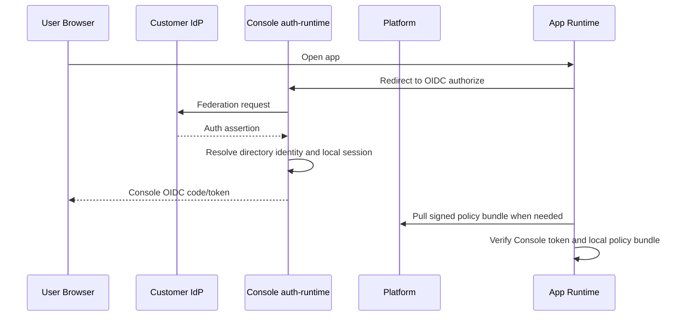

# Platform Identity Plane 设计 v1

状态：Draft，已按 Console auth-runtime 边界修订  
日期：2026-04-29  
定位：目标设计，作为 `Huizhi-yun-Platform-Target-Architecture.md` 的配套文档；企业应用用户 IdP 详见 `Console-Auth-Runtime-IdP-Implementation-Plan.md`

---

## 0. 文档目标

本文档定义汇智云 `Platform Identity Plane` 的职责、信任链、关键对象和第一版实现边界，重点回答：

- 控制面 IdP 与 Console 应用用户 IdP 如何分工
- Platform runtime/control token 与 Console OIDC token 如何分工
- Policy Bundle 如何生成、签名、分发、失效
- Heartbeat 如何保证平台仍有“把手”
- Managed Control Plane 与 Enterprise 两种模式下，Identity Plane 有何差异

本文档不展开：

- 完整 API 契约
- 完整 SQL DDL
- 迁移步骤与现网兼容策略

---

## 1. 定位

`Platform Identity Plane` 是平台控制面身份与授权分发层，负责：

- 控制面账户登录与 session（平台员工、租户管理员）
- Runtime 信任与 tenant runtime token 治理
- Platform signing key 管理
- 最小授权主体目录
- Policy Bundle 签名与分发
- 心跳、吊销、宽限期控制
- 控制面与 runtime 审计

它不负责：

- 企业应用用户的本地登录会话、refresh token、OIDC client secret
- CAS / 企业微信 / 钉钉 / LDAP 等上游登录回调的长期承载
- 业务对象级关系求值
- 客户业务数据存储
- 业务接口逐请求在线鉴权

一句话：

**Platform Identity Plane 是授权与运行时治理的信任锚点；Console auth-runtime 是企业应用用户 IdP。**

---

## 2. 设计原则

| # | 原则 |
|---|------|
| I1 | 客户 IdP 是应用用户身份源，Console 不维护上游密码，Platform 不承载应用用户密码 |
| I2 | 应用用户 Token 由 Console auth-runtime 签发，Platform 签名 policy bundle / license / revocation |
| I3 | Policy Bundle 由平台签名下发，业务应用本地执行 |
| I4 | 平台只存最小主体目录，不存用户 PII |
| I5 | 运行时默认不要求逐请求回源平台 |
| I6 | Heartbeat 是控制手段，不是请求链路依赖 |
| I7 | Enterprise 与 Managed 模式复用同一模型，只改变部署位置 |

---

## 3. 两种部署模式下的 Platform Identity Plane

### 3.1 Managed Control Plane

部署位置：

- 平台侧部署 Identity Plane

职责：

- 控制面账户登录、租户管理员 session、平台员工 session
- runtime token 校验与部署实例信任治理
- 生成并签名 Policy Bundle
- 下发吊销列表与宽限策略
- 记录控制面与 runtime 审计

客户侧业务应用职责：

- 使用 Foundation SDK 验签 Console OIDC Token
- 拉取并缓存 Policy Bundle
- 结合本地业务关系做最终授权

### 3.2 Self-Hosted Enterprise

部署位置：

- 客户侧部署 Identity Plane

职责：

- 与 Managed 模式保持相同
- 仅 License 续签、升级包分发等场景与汇智云交互

说明：

- 模型不变
- 信任根仍然是 `deployment_id`
- 只是签发者从“平台云端实例”变成本地实例

---

## 4. 核心对象

### 4.1 Deployment

代表一次平台实例部署，是 Identity Plane 的信任边界。

核心字段：

- `deployment_id`
- `deployment_mode`
- `public_key`
- `license_fingerprint`
- `status`

约束：

- 每个部署实例有且仅有一套签名密钥对
- `token.iss = deployment_id`

### 4.2 Subject

平台侧最小授权主体，不含 PII。

核心字段：

- `subject_id`
- `tenant_code`
- `subject_type`
- `external_ref`
- `parent_subject_id`
- `status`

`subject_type` 第一版建议支持：

- `user`
- `department`
- `job`

### 4.3 Session

表示一次登录会话。

核心字段：

- `session_id`
- `deployment_id`
- `tenant_code`
- `subject_id`
- `idp_type`
- `issued_at`
- `expires_at`
- `status`

### 4.4 Policy Bundle

由平台生成、签名、分发的授权策略快照。

核心字段：

- `bundle_id`
- `tenant_code`
- `bundle_version`
- `bundle_hash`
- `bundle_json`
- `signature`
- `created_at`

### 4.5 Revocation List

统一表示需要失效的对象。

第一版至少支持：

- 被吊销的 session
- 被吊销的 bundle version
- 被吊销的 license fingerprint
- 被禁用的 deployment

---

## 5. 身份分工

### 5.1 应用用户登录

应用用户登录由客户侧 `console.auth-runtime` 承接：

- 上游：LDAP / AD / CAS / 企业微信 / 钉钉 / 通用 OIDC / 本地账号。
- 中间层：Console 完成 federation、身份映射、`local_sessions` 与 OIDC token 签发。
- 下游：业务应用只接 Console OIDC，不直接理解上游身份源协议。

Console 登录成功后，业务应用通过 token 中的 `hzy.subjectCode` / `hzy.uid` 与 Platform policy bundle 中的 `subjects.subjectCode` 对齐授权主体。

### 5.2 Platform 控制面登录

Platform 只承接控制面账户登录：

- `/admin`：平台员工，`platform_accounts.account_type='staff'`。
- `/dashboard`：租户管理员，`platform_accounts.account_type='tenant_admin'`。
- 控制面 session 落在 `platform_sessions`，并按 `session_scope` 隔离。

Platform 不保存应用用户 session、refresh token、OIDC client secret 或上游 IdP secret。

### 5.3 标准应用用户登录流程



### 5.4 Subject 映射规则

Platform 不直接相信任意上送的显示名。Console subject sync 只向 Platform 投影最小主体。第一版按以下规则对齐：

1. Console Directory 以 `uid` 作为用户稳定标识。
2. Console subject sync 向 Platform 投影 `subject_type=user / subject_code=<uid> / external_ref / status`。
3. Console OIDC token MVP 使用 `sub=user:<uid>`，并在 `hzy.subjectCode=<uid>` 中保留对齐字段。
4. Platform policy bundle 使用 `subjects.subjectCode` 与 `subjectRoles.subjectCode` 下发授权。

不建议：

- 用邮箱做跨租户全局唯一主键
- 用姓名做匹配

---

## 6. Token 设计

### 6.1 Access Token

本节描述 Platform runtime/control token 的结构；业务应用用户 OIDC token 由 Console 签发，详见 `Console-Auth-Runtime-IdP-Implementation-Plan.md`。

Platform token 建议采用 JWT。

建议结构：

```json
{
  "iss": "<deployment_id>",
  "sub": "<subject_id>",
  "tenant": "<tenant_code>",
  "sid": "<session_id>",
  "policy_ver": "<bundle_version>",
  "caps": "<capability_hash>",
  "iat": 1745000000,
  "exp": 1745003600
}
```

字段说明：

- `iss`：签发实例
- `sub`：授权主体
- `tenant`：所属租户
- `sid`：会话 ID
- `policy_ver`：签发时绑定的策略包版本
- `caps`：能力开关摘要

### 6.2 不放进 Token 的内容

不放：

- 姓名
- 邮箱
- 手机
- 部门名称
- 详细权限清单
- 详细 scope 清单

原因：

- 避免 PII 泄露
- 避免 Token 过大
- 避免权限变更后 Token 失控

### 6.3 Refresh Token

第一版建议：

- Platform 控制面会话可支持 refresh token 或 session refresh
- 应用用户 refresh token 只由 Console auth-runtime 持有
- 客户侧业务应用不直接解释 refresh token

### 6.4 验签要求

所有业务应用必须：

1. 校验 Console OIDC token 签名
2. 校验 `iss`
3. 校验 `exp`
4. 校验 `tenant`
5. 校验 `policy_ver` 是否与本地可接受版本匹配
6. 校验 session / license / bundle 是否未被吊销或超出本地接受窗口

---

## 7. Policy Bundle 设计

### 7.1 为什么需要 Policy Bundle

仅靠 Token 无法承载完整授权模型。  
平台又不能要求业务应用每次请求都回源，因此需要：

**签名策略包 = 本地可验证的授权快照。**

### 7.2 Bundle 内容

第一版建议包含：

- `bundle_version`
- `tenant_code`
- `applications`
- `resources`
- `roles`
- `role_permissions`
- `permission_templates`
- `template_bindings`
- `template_overrides`
- `role_scopes`
- `capabilities`
- `generated_at`
- `signature`

说明：

- 第一版建议按 `tenant` 维度生成主 bundle
- 若后续体积过大，再引入按 app 或增量 bundle

### 7.3 Bundle 生成时机

以下事件发生时，应触发新 bundle：

- 角色变更
- 模板变更
- 模板绑定变更
- 模板覆盖变更
- 范围规则变更
- 应用 manifest 变更
- capability 变更

### 7.4 Bundle 分发方式

建议两种方式并存：

1. 被动拉取
   - App / SDK 通过版本检查拉取
2. 主动通知
   - 通过 webhook / message 通知客户侧 runtime 更新

第一版最低要求：

- 支持拉取
- 支持版本比对

### 7.5 Bundle 验证

业务应用拿到 bundle 后必须：

1. 校验签名
2. 校验 `tenant_code`
3. 校验 `bundle_hash`
4. 校验版本是否未被吊销

---

## 8. Heartbeat 设计

### 8.1 Heartbeat 的定位

Heartbeat 的作用不是逐请求鉴权，而是：

- 同步策略版本
- 同步吊销列表
- 同步 license 状态
- 维持平台对部署实例的控制力

### 8.2 Heartbeat 载荷建议

客户侧 → 平台：

- `deployment_id`
- `tenant_code`
- `current_bundle_version`
- `license_fingerprint`
- `runtime_version`
- `app_codes`
- `coarse_metrics`

平台侧 → 客户侧：

- `latest_bundle_version`
- `bundle_download_url`
- `revocation_list_version`
- `license_status`
- `grace_deadline`

### 8.3 默认策略

第一版建议：

- 心跳周期：5 分钟到 30 分钟可配置
- 平台不可达时继续使用本地 bundle
- 若超过 `grace_days` 未成功心跳，则进入受限模式

### 8.4 受限模式

受限模式的目标不是立即把客户系统打死，而是保留销售与商业控制力。

第一版建议：

- 普通用户只读
- 管理员可登录并查看状态
- 新登录可按 license 策略决定是否允许

具体收敛策略留待《License 与 Capability 清单》专题确定。

---

## 9. 吊销机制

### 9.1 吊销对象

第一版支持吊销：

- Session
- Policy Bundle
- License
- Deployment

### 9.2 吊销传播

吊销传播路径：

1. 平台记录 revocation entry
2. Heartbeat 返回最新 revocation version
3. 客户侧 runtime 拉取并缓存 revocation list
4. 本地 SDK 拒绝已吊销对象

### 9.3 一致性边界

第一版明确接受：

- 吊销传播是“近实时”，不是强实时
- 强控制依赖 heartbeat 周期和宽限期

这也是 Control-Plane SaaS 模式的现实边界。

---

## 10. 会话与审计

### 10.1 Session 生命周期

Platform 第一版建议：

1. 登录成功创建 session
2. refresh 时延续 session 或轮换 session
3. logout 时标记失效
4. 强制下线时进入 revocation list

### 10.2 审计事件

至少记录：

- 登录成功 / 失败
- federation 成功 / 失败
- token 签发
- bundle 生成
- bundle 拉取
- heartbeat 成功 / 失败
- revocation 下发
- license 状态变化

### 10.3 审计归属

- Managed 模式：Platform 控制面与授权治理审计在平台侧；应用用户登录审计在客户侧 Console
- Enterprise 模式：审计在本地部署内

业务应用自己的业务审计仍然由各 app 负责。

---

## 11. Foundation SDK 职责

Identity Plane 与业务应用之间的运行时契约，应主要落在 Foundation SDK。

SDK 至少提供：

- `verifyToken()`
- `fetchPolicyBundle()`
- `verifyPolicyBundle()`
- `loadRevocationList()`
- `checkPermission()`
- `getScopes()`
- `sendHeartbeat()`

SDK 不负责：

- 解释业务关系
- 查询业务数据库
- 决定部门或项目成员语义

---

## 12. 第一版实现边界

第一版建议明确收敛到以下范围：

- 支持 LDAP / CAS / OIDC 联邦接入
- 支持 Platform 控制面 session 与 runtime token；应用用户 OIDC 由 Console 负责
- 支持 tenant 级 Policy Bundle
- 支持 session / bundle / license / deployment 吊销
- 支持心跳与宽限期
- 支持 Foundation SDK 本地验 token + bundle

第一版暂不做：

- 跨部署实例身份联邦
- 用户级差异 bundle 增量下发
- 多地域 Identity Plane 联邦
- 复杂设备信任模型
- 细粒度持续会话风险评估

---

## 13. 需要继续补的配套文档

基于本文，建议继续补三份文档：

1. 《Control Plane API 契约》
   定义登录后取 bundle、拉 revocation、发 heartbeat 的接口

2. 《License 与 Capability 清单》
   定义受限模式和 capability 如何影响 Identity Plane

3. 《Foundation SDK 契约》
   定义 token 校验、bundle 校验、缓存策略、错误码
