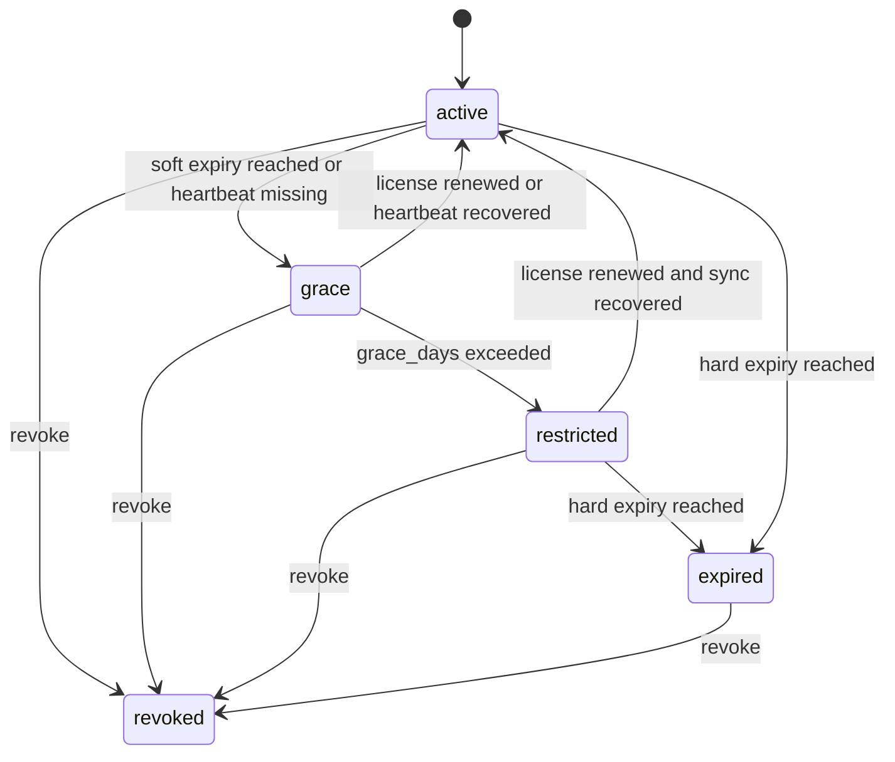

# License 与 Capability 清单 v1

状态：Draft  
日期：2026-04-21  
定位：目标设计，作为 `Huizhi-yun-Platform-Target-Architecture.md`、`Identity-Plane-Design.md`、`Control-Plane-API-Contract.md` 与 `Foundation-SDK-Contract.md` 的配套文档

---

## 0. 文档目标

本文档定义汇智云平台第一版的：

- License 模型
- Capability 清单
- License 状态机
- `active / grace / restricted / expired / revoked` 下的功能策略
- Managed Control Plane 与 Enterprise 两种模式下的授权边界

本文档不展开：

- 计费价格表
- 法务条款细节
- License 签名算法实现

---

## 1. 设计目标

License 与 Capability 机制要同时满足四件事：

1. 给销售可解释、可操作的“把手”
2. 不让客户业务逐请求依赖平台在线
3. 支持离线可验证
4. 支持 Enterprise 独立交付

一句话：

**License 决定“能不能用哪些能力”，Capability 决定“当前这套部署开放哪些模块和高级特性”。**

---

## 2. 基本原则

| # | 原则 |
|---|------|
| L1 | License 以组织/部署为粒度，不按个人用户发放 |
| L2 | Capability 是运行时开关，不等于角色权限 |
| L3 | License 可离线验证，但状态更新依赖 heartbeat |
| L4 | License 过期后优先进入受限模式，而不是立刻完全停机 |
| L5 | Capability 控制产品能力边界，角色权限控制组织内部授权边界 |
| L6 | Managed 与 Enterprise 复用同一 capability 模型，仅部署方式不同 |

---

## 3. 概念区分

### 3.1 Role / Permission

回答：

- 某个用户在某个应用里能做什么

例如：

- `aims:pm`
- `codocs:editor`

### 3.2 Scope

回答：

- 某个用户能操作哪些数据

例如：

- `self`
- `department`
- `member`

### 3.3 Capability

回答：

- 这套部署/这个客户买没买这项产品能力

例如：

- 是否允许 `advanced_identity_federation`
- 是否允许 `advanced_audit`
- 是否允许 `ai_gateway`

### 3.4 License

回答：

- 当前 deployment 的商业授权是否有效
- 当前 capability 集合是什么
- 当前是否还在宽限期内

---

## 4. License 模型

### 4.1 License 粒度

第一版建议以 `deployment` 为主粒度。

一个 License 绑定：

- 一个 `deployment_id`
- 一个 `deployment_mode`
- 一个 capability 集合
- 一个有效期区间

### 4.2 License 结构

建议签入字段：

```json
{
  "licenseId": "lic_20260421_xxx",
  "deploymentId": "dep_xxx",
  "deploymentMode": "managed_control_plane",
  "tenantCode": "c000001",
  "tier": "pro",
  "capabilities": [
    "advanced_identity_federation",
    "advanced_audit",
    "gitlab_sync"
  ],
  "softExpiry": "2026-05-31T23:59:59Z",
  "hardExpiry": "2026-06-30T23:59:59Z",
  "graceDays": 7,
  "issuedAt": "2026-04-21T00:00:00Z",
  "signature": "<signature>"
}
```

### 4.3 核心字段说明

- `deploymentId`
  - License 绑定的部署实例
- `deploymentMode`
  - `managed_control_plane` / `enterprise`
- `tier`
  - 能力包等级
- `capabilities`
  - 当前可用产品能力集合
- `softExpiry`
  - 软过期，开始告警
- `hardExpiry`
  - 硬过期，进入更严格限制
- `graceDays`
  - 允许离线心跳失败的宽限天数

---

## 5. Capability 清单

第一版建议把 capability 分成五类。

## 5.1 身份与接入类

说明：

- 租户应用用户的基础 federated SSO 是平台基线能力，不单独作为收费 capability
- 本类 capability 主要描述身份接入增强项和目录增强项

| Capability | 说明 |
|---|---|
| `advanced_identity_federation` | 启用多 IdP、增强属性映射与复杂 federation 策略 |
| `ldap_directory` | 启用 LDAP 目录同步/映射增强 |
| `app_marketplace` | 启用应用市场与第三方 app 注册 |

## 5.2 平台治理类

| Capability | 说明 |
|---|---|
| `advanced_audit` | 启用高级审计、扩展审计检索与导出 |
| `custom_role_templates` | 启用自定义角色模板治理能力 |
| `policy_push_hooks` | 启用 bundle 变更主动通知 / webhook |

## 5.3 研发协同类

| Capability | 说明 |
|---|---|
| `gitlab_sync` | 启用 GitLab 集成 |
| `gitea_sync` | 启用 Gitea 集成 |
| `workflow_engine` | 启用工作流引擎能力 |

## 5.4 AI 与扩展类

| Capability | 说明 |
|---|---|
| `ai_gateway` | 启用 AI 网关 |
| `knowledge_enhanced_search` | 启用增强检索与知识能力 |

## 5.5 交付模式类

| Capability | 说明 |
|---|---|
| `managed_control_plane` | 启用平台托管控制面模式 |
| `enterprise_deployment` | 启用企业版本地部署模式 |

说明：

- 交付模式类 capability 不用于前台展示
- 它主要用于平台和 SDK 判断运行模式是否合法

---

## 6. Tier 建议

第一版建议保留三档：

| Tier | 定位 | 默认 Capability 候选 |
|---|---|---|
| `starter` | 基础协作版 | `managed_control_plane` |
| `pro` | 经营协同版 | `managed_control_plane` + `gitlab_sync` + `workflow_engine` |
| `advanced` | 高级治理版 | `managed_control_plane` + `advanced_identity_federation` + `advanced_audit` + `custom_role_templates` + `policy_push_hooks` |

说明：

- Tier 是销售话术与交付分档
- `AI` / `Insights` 建议作为独立增值包，不强绑定某个 tier
- `Self-Hosted Enterprise` 是 `deploymentMode`，不是 tier；是否本地部署由交付模式决定
- 运行时最终只认 capability 集合

---

## 7. License 状态机

第一版建议统一为五态：

- `active`
- `grace`
- `restricted`
- `expired`
- `revoked`

### 7.1 状态定义

| 状态 | 含义 |
|---|---|
| `active` | License 有效，心跳正常 |
| `grace` | 未到硬过期，但心跳异常或临近过期 |
| `restricted` | 超过宽限或进入受限模式，但未完全停用 |
| `expired` | License 硬过期，禁止正常业务使用 |
| `revoked` | License 被主动吊销，立即受限或停用 |

### 7.2 状态流转



---

## 8. 各状态下的功能策略

这是第一版最关键的运营规则。

## 8.1 `active`

策略：

- 所有已授权 capability 正常可用
- 登录、token 刷新、bundle 拉取、heartbeat 全正常
- 业务应用按正常授权运行

## 8.2 `grace`

触发条件：

- 到达 `softExpiry`
- 或 heartbeat 暂时失败但未超过 `graceDays`

策略：

- 业务功能保持正常
- UI 强提示续费 / 恢复连接
- 管理后台显示告警状态
- 平台侧加强日志和告警

## 8.3 `restricted`

触发条件：

- 超过 `graceDays` 未恢复心跳
- 或平台主动下发受限指令

策略建议：

- 普通用户进入只读模式
- 写操作默认禁止
- 管理员可登录、查看状态、执行恢复操作
- 新登录默认允许，但可按 capability 或销售策略收紧
- 继续允许：
  - 查看数据
  - 导出必要数据
  - 管理员查看 license 状态

这是默认建议，因为它兼顾：

- 商业控制力
- 不致于客户业务瞬间瘫痪

## 8.4 `expired`

触发条件：

- 到达 `hardExpiry`

策略建议：

- 普通用户禁止进入主要业务功能
- 管理员可登录 License 管理和诊断界面
- 业务应用默认不再允许新写入
- 仅保留：
  - 状态查看
  - license 更新
  - 系统诊断

## 8.5 `revoked`

触发条件：

- 平台或运维主动吊销 License

策略建议：

- 比 `expired` 更严格
- 默认禁止普通用户登录业务界面
- 管理员只保留恢复与诊断通道
- 下一次成功同步后立即生效

---

## 9. Capability 与状态的关系

Capability 决定“有没有某个功能”，  
License 状态决定“当前允许以什么强度使用”。

例子：

- 基础 federated SSO 是平台基线能力，不依赖单独 capability
- 客户没有 `advanced_identity_federation`
  - 那么即使 `active`，多 IdP、高级属性映射等增强配置也不可见
- 客户有 `advanced_identity_federation`，但当前 `restricted`
  - 可以保留已生效配置，但不一定允许新建或修改复杂 federation 规则

所以运行时判断建议统一表达为：

`FeatureAvailable = LicenseStateAllows && CapabilityEnabled && PermissionAllows`

---

## 10. Managed 与 Enterprise 的差异

### 10.1 Managed Control Plane

特点：

- License 由平台在线下发
- 状态更新主要依赖 heartbeat
- 销售和运营可通过平台侧直接施加控制

### 10.2 Enterprise

特点：

- License 可离线导入
- 平台连接主要用于续签、升级、支持
- 吊销与状态变更的传播会更慢

因此第一版要明确：

- Enterprise 接受“更弱的实时控制”
- 但模型仍保持一致

---

## 11. SDK 与业务应用应如何消费

### 11.1 SDK 消费

SDK 应至少暴露：

```ts
function getRuntimeStatus(): {
  licenseStatus: 'active' | 'grace' | 'restricted' | 'expired' | 'revoked'
  graceDeadline?: string
  capabilities: string[]
}
```

```ts
function hasCapability(capability: string): boolean
```

### 11.2 业务应用消费

业务应用应根据：

1. `licenseStatus`
2. `capabilities`
3. `roles / permissions / scopes`

共同决定：

- 菜单是否展示
- 页面是否可进入
- 按钮是否禁用
- 接口是否允许执行

### 11.3 默认决策建议

| 场景 | 建议 |
|---|---|
| `active + capability on + permission yes` | 正常可用 |
| `grace + capability on + permission yes` | 正常可用，但展示警告 |
| `restricted + capability on + permission yes` | 默认只读 |
| `expired` | 默认不可用，仅保留诊断与恢复 |
| `revoked` | 默认更严格，仅保留恢复通道 |

---

## 12. License 校验契约

第一版业务侧至少要校验：

1. License 签名
2. `deploymentId` 是否匹配
3. 当前时间是否超过 `hardExpiry`
4. revocation list 中是否已吊销

不建议业务应用自己解释复杂的销售规则。  
复杂规则由平台和 SDK 收敛成统一状态值。

---

## 13. 第一版建议的最小清单

第一版建议至少落这些 capability：

- `managed_control_plane`
- `enterprise_deployment`
- `advanced_identity_federation`
- `advanced_audit`
- `custom_role_templates`
- `gitlab_sync`
- `ai_gateway`

第一版建议至少落这些 license 状态：

- `active`
- `grace`
- `restricted`
- `expired`
- `revoked`

---

## 14. 暂不在第一版细化的事项

以下内容先不在第一版做复杂化：

- capability 之间的依赖图
- 按应用分别售卖的精细计费
- 用量超限后的自动降级算法
- 复杂法务例外条款映射
- 不同国家/地区的税务逻辑

---

## 15. 后续建议

基于本文，接下来最适合继续补：

1. 《App Manifest 规范》
   把 app 注册资源、推荐角色、支持 scope 的格式钉死

2. 《平台运营后台信息架构》
   把 license、deployment、bundle、heartbeat、revocation 的运维视图设计出来
