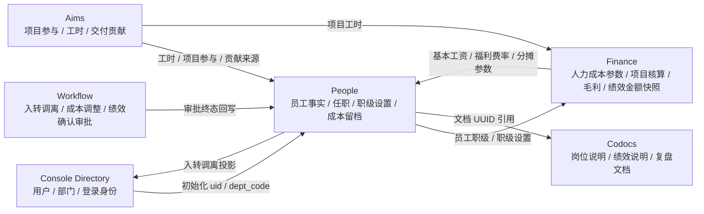

# People 模块设计与实施方案

> 状态：Phase 3 MVP 已落地，生产数据切换推进中
> 应用名称：People  
> 中文名称：人员  
> 建议 app code：`people`  
> 建议目录：`people/`  
> 建议端口：`3007`

## 1. 背景与目标

Huizhi-yun Phase 3 的目标是支撑项目核算、人力成本和个人绩效，但不先建设完整 HR 系统。People 模块的定位是：

> People 是 Huizhi-yun 的人力事实源与个人绩效主流程模块，负责员工身份、任职关系、岗位职级、M/P 职级设置、成本快照、绩效周期、项目贡献归因基础、评分/确认结果和绩效档案；首版不覆盖招聘、薪酬社保、培训、复杂考勤等完整 HR 流程。

People 解决三个核心问题：

1. 为 Finance 项目核算提供员工职级事实和 M/P 职级设置，Finance 按 Aims 工时实时计算项目标准人力成本。
2. 为员工绩效提供稳定的周期、参与项目、贡献归因基础、确认结果和历史档案。
3. 为后续“人类员工 + AI Agent”统一能力、成本、产出和贡献归因留下扩展空间。

## 2. 设计原则

- **最小事实源**：首版只沉淀项目核算和绩效所需的人力事实，不扩张为完整 HRM。
- **历史快照优先**：任职、职级、成本、绩效口径必须支持历史回放，后续调岗、调级、离职不得影响已结周期。
- **不复制登录与权限**：账号、认证、权限、基础组织目录仍归 Console Directory；People 只保存员工业务事实与历史快照。
- **明确目录同步方向**：生产切换期可从 Console Directory 初始化 People 员工事实；正常运营期，入转调离应先在 People 形成审批后的 HR 事实，再投影到 Console Directory 的账号和组织关系。
- **不直连跨模块数据库**：Aims、Finance、Workflow、Codocs、Console 之间通过 API、Foundation adapter 或 tenant-runtime/data-runtime 交互。
- **面向人类工作主体**：People 管人类员工。后续 Agent 模块可按同一抽象扩展 AI Agent 的身份、成本、任务和贡献归因。

## 3. 模块边界

### People 负责

- 员工业务事实：员工编号、用工类型、入离职状态、入职日期、离职日期。
- 任职关系：部门、岗位、职级、生效时间、失效时间、主任职标记。
- 岗位与职级：岗位族、M/P 职级层级、标准成本匹配基础。
- 职级成本设置：M1-M5、P1-P10 的职级工资、绩效工资范围和有效期；基本工资、福利费率、管理分摊系数和固定资源分摊由 Finance 参数提供。
- 成本快照：月度标准成本、实际成本、成本来源、标准成本规则引用、任职快照。
- 绩效周期：周期定义、状态、计算基准、评分/确认结果和归档状态。
- 贡献快照：从 Aims / Finance 等来源固化项目参与、工时、角色、贡献分。
- 文档引用：岗位说明、绩效说明、复盘材料等 Codocs 文档 UUID。

### People 不负责

- 登录账号、密码、SSO、权限分配：由 Console Directory / Foundation 负责。
- 项目、任务、里程碑、工时原始事实：由 Aims 负责。
- 项目收入、支出、毛利、提成/奖金/绩效金额财务口径：由 Finance 负责，People 只引用其快照作为个人绩效依据。
- 审批流程定义和流转实例：由 Workflow 负责。
- 文档正文与协作：由 Codocs 负责。
- 招聘、培训、薪酬社保、复杂考勤、劳动合同全流程：后续扩展，不进首版。

## 4. 首版业务闭环

首版闭环：

1. Console 提供生产切换期的用户和部门基础目录，People 可一键初始化员工事实。
2. People 维护员工业务事实、任职快照、M/P 职级设置和成本快照，并在正常运营期成为入转调离事实源。
3. Aims 输出项目参与、工时、任务或里程碑贡献来源。
4. People 将 Aims 来源固化为绩效周期贡献快照。
5. Finance 提供人力成本计算参数；People 可按职级设置 + Finance 参数生成成本快照留档，但 Finance 项目核算主路径读取 People 员工职级/职级设置和 Aims 工时，按月计算项目标准人力成本、项目毛利和绩效金额财务口径。
6. Workflow 处理人员异动、成本调整、绩效确认等必要审批。
7. Codocs 保存岗位说明、绩效说明、项目复盘等正文，People 只引用文档 UUID。

## 5. MVP 数据模型

### 5.1 `people_employees`

员工业务事实表。`employee_uid` 对应 Console Directory 的 `uid`。

| 字段 | 说明 |
| --- | --- |
| `id` | 内部 ID |
| `employee_uid` | 稳定员工 UID，等于 Console user uid |
| `employee_no` | 员工编号 |
| `display_name` | 员工显示名快照 |
| `employment_type` | `full_time` / `part_time` / `contractor` / `intern` |
| `employment_status` | `active` / `probation` / `suspended` / `resigned` |
| `hire_date` | 入职日期 |
| `leave_date` | 离职日期 |
| `primary_dept_code` | 当前主部门编码 |
| `manager_uid` | 当前直属负责人 UID，可选 |
| `remark` | 备注 |
| `created_at` / `updated_at` | 审计时间 |

约束：

- `employee_uid` 唯一。
- `employee_no` 可为空，但非空时唯一。
- People 不保存登录账号和认证凭据。

### 5.2 `people_positions`

岗位字典。

| 字段 | 说明 |
| --- | --- |
| `position_code` | 岗位编码 |
| `position_name` | 岗位名称 |
| `job_family` | 岗位族，例如 engineering / delivery / sales / finance / ops |
| `status` | `active` / `inactive` |
| `remark` | 备注 |

### 5.3 `people_ranks`

职级字典与成本区间。

| 字段 | 说明 |
| --- | --- |
| `rank_code` | 职级编码 |
| `rank_name` | 职级名称 |
| `rank_level` | 数值层级，用于排序和规则匹配 |
| `cost_band_min` | 成本区间下限 |
| `cost_band_max` | 成本区间上限 |
| `currency_code` | 默认 `CNY` |
| `status` | `active` / `inactive` |

### 5.4 `people_assignments`

员工任职历史表，用于支持历史绩效回放。

| 字段 | 说明 |
| --- | --- |
| `employee_uid` | 员工 UID |
| `dept_code` | 部门编码 |
| `position_code` | 岗位编码 |
| `rank_code` | 职级编码 |
| `manager_uid` | 任职期负责人 UID |
| `effective_from` | 生效日期 |
| `effective_to` | 失效日期，可为空 |
| `is_primary` | 是否主任职 |
| `change_reason` | `hire` / `transfer` / `promotion` / `demotion` / `leave` / `manual` |
| `workflow_instance_id` | Workflow 审批实例，可选 |

约束：

- 同一员工同一时间只能有一个主任职。
- 绩效和成本计算必须使用周期内有效任职快照，不读取“当前任职”覆盖历史。

### 5.5 `people_standard_cost_rates`

M/P 职级设置表。它是当前阶段项目人力成本测算的前置主数据，People 只维护职级工资和绩效工资范围；基本工资、福利成本费率、管理分摊系数和固定资源分摊由 Finance `finance_people_cost_parameter` 提供。

| 字段 | 说明 |
| --- | --- |
| `rate_code` | 标准成本规则编码 |
| `rate_name` | 规则名称 |
| `rank_series` | `M` 管理序列 / `P` 专业序列 |
| `rank_code` | 职级编码，M1-M5 / P1-P10 |
| `rank_level` | 职级层级 |
| `rank_salary` | 职级工资 |
| `performance_salary_min` / `performance_salary_max` | 绩效工资范围 |
| `effective_from` / `effective_to` | 有效期 |
| `monthly_standard_cost` | 按当前 Finance 参数计算的展示冗余值；快照生成时以 Finance 实时参数重新计算 |

约束：

- 生成快照时按员工 `rank_code` 匹配职级设置，不再按岗位专属演示规则匹配。
- 月标准成本公式：基本工资 + 职级工资 + 绩效工资中位数 + 福利成本 + 管理分摊 + 资源分摊。
- 福利成本 =（基本工资 + 职级工资 + 绩效工资中位数）× Finance 福利成本费率。
- 管理分摊 =（基本工资 + 职级工资 + 绩效工资中位数 + 福利成本）× Finance 管理分摊系数。
- 已生成的历史成本快照不因规则后续调整自动改写，必须重新生成或走成本调整动作。

### 5.6 `people_cost_snapshots`

员工月度成本快照。该表用于 People 成本留档、追溯和未来实际成本接入；Finance 项目核算主路径不依赖该表，而是读取员工职级与职级设置后按标准成本实时计算。

| 字段 | 说明 |
| --- | --- |
| `employee_uid` | 员工 UID |
| `period_month` | 月份，格式 `YYYY-MM` |
| `standard_cost_amount` | 标准成本 |
| `actual_cost_amount` | 实际成本 |
| `currency_code` | 默认 `CNY` |
| `cost_source` | `standard_rate` / `employee_standard` / `manual` / `payroll_import` / `finance_adjustment` |
| `cost_basis` | `standard` / `actual` / `manual_adjusted` |
| `standard_rate_code` | 命中的标准成本规则 |
| `dept_code_snapshot` | 部门快照 |
| `position_code_snapshot` | 岗位快照 |
| `rank_code_snapshot` | 职级快照 |
| `workflow_instance_id` | 成本调整审批实例，可选 |
| `source_refs_json` | 来源引用 |

约束：

- 唯一键：`employee_uid + period_month`。
- 历史快照只允许通过明确调整动作修改，并保留审计事件。
- 薪资实际成本未接入前，`cost_basis=standard`，`actual_cost_amount` 可暂等于标准成本，但必须通过口径字段说明它不是薪资实际。

### 5.7 `people_performance_cycles`

绩效周期表。

| 字段 | 说明 |
| --- | --- |
| `cycle_code` | 周期编码 |
| `cycle_name` | 周期名称 |
| `period_start` | 周期开始日期 |
| `period_end` | 周期结束日期 |
| `cycle_type` | `monthly` / `quarterly` / `yearly` / `project` |
| `status` | `draft` / `collecting` / `calculating` / `confirmed` / `closed` |
| `confirmed_at` | 确认时间 |
| `workflow_instance_id` | 绩效确认审批实例，可选 |

### 5.8 `people_contribution_snapshots`

绩效贡献快照。它是 Aims / Finance 等来源数据的周期固化结果，不替代源系统。

| 字段 | 说明 |
| --- | --- |
| `cycle_code` | 绩效周期 |
| `period_month` | 月份 |
| `employee_uid` | 员工 UID |
| `project_code` | 项目编码 |
| `role_type` | `pm` / `dev` / `qa` / `design` / `delivery` / `ops` / `sales` / `other` |
| `work_hours` | 工时 |
| `contribution_score` | 贡献分 |
| `source_app` | 来源应用，例如 `aims` |
| `source_biz_type` | 来源类型，例如 `worklog` / `task` / `milestone` |
| `source_refs_json` | 来源对象列表 |

约束：

- 支持按周期重算，但已 `closed` 周期默认冻结。
- 若重算历史周期，必须产生审计事件。

### 5.9 `people_documents`

People 侧文档引用表。

| 字段 | 说明 |
| --- | --- |
| `object_type` | `employee` / `position` / `cycle` / `performance_review` |
| `object_id` | 对象内部 ID 或稳定编码 |
| `document_uuid` | Codocs 文档 UUID |
| `document_type` | `job_description` / `performance_note` / `review_report` / `attachment` |
| `source_context` | 业务上下文 JSON |

## 6. API 设计

### 6.1 用户侧 API

| 方法 | 路径 | 说明 |
| --- | --- | --- |
| `GET` | `/api/v1/employees` | 员工列表 |
| `POST` | `/api/v1/employees` | 创建或补录员工事实 |
| `GET` | `/api/v1/employees/{employeeUid}/profile` | 员工完整档案 |
| `PATCH` | `/api/v1/employees/{employeeUid}` | 更新员工业务事实 |
| `POST` | `/api/v1/assignments` | 创建任职变更 |
| `GET/POST/PATCH` | `/api/v1/standard-costs` | 查询或维护 M/P 职级设置 |
| `POST` | `/api/v1/cost-snapshots` | 写入或调整成本快照 |
| `GET` | `/api/v1/cost-snapshots?employee_uid=&period_month=` | 成本快照查询 |
| `POST` | `/api/admin/performance-cycles` | 校验 People 权限后创建草稿绩效周期，本地编排接口 |
| `POST` | `/api/admin/performance-cycles/{cycleCode}/collect` | 校验 People 权限后读取 Aims 工时并汇集为贡献快照，本地编排接口 |
| `POST` | `/api/admin/performance-cycles/{cycleCode}/confirm` | 校验 People 权限后确认绩效周期，固化周期和贡献快照确认时间 |
| `POST` | `/api/admin/performance-cycles/{cycleCode}/close` | 校验 People 权限后关闭已确认绩效周期 |
| `GET` | `/api/v1/employees/{employeeUid}/performance-basis?cycle_code=` | 员工绩效基础数据 |
| `POST` | `/api/admin/directory-sync/import` | 从 Console Directory 初始化/校准 People 员工事实，本地编排接口，不直连数据库 |
| `GET` | `/api/admin/cost-parameters/current` | 读取 Finance 当前人力成本参数，用于职级设置页展示 |
| `POST` | `/api/admin/cost-snapshots/generate` | 读取 Finance 参数后生成 People 月度成本快照，本地编排接口 |
| `GET` | `/api/admin/performance-amounts` | 读取 Finance 绩效金额快照，用于绩效周期详情页展示 |

### 6.2 Service API

跨模块调用使用 Console service token。

| 调用方 | 目标 | 路径 | scope | 说明 |
| --- | --- | --- | --- | --- |
| People BFF | People data-runtime | `POST /v1/people/service/directory-users:sync` | `people:write` | Console Directory → People 初始化导入，按 `employee_uid` 幂等 upsert |
| People BFF | Finance | `GET /api/v1/finance/service/people-cost-parameters?effective_date=` | `finance:read` | 读取基本工资、福利费率、管理分摊系数和固定资源分摊 |
| People BFF | People data-runtime | `POST /v1/people/service/cost-snapshots:generate` | `people:write` | 从 M/P 职级设置 + Finance 参数生成月度员工成本快照 |
| People | Console Directory | `POST/PATCH /api/v1/console/directory/users` 与用户部门关系接口 | `console:directory.write` | 后续正常运营期由 People 入转调离事件投影到 Console |
| Finance | People | `GET /v1/people/service/standard-costs:resolve?employee_uids=&effective_date=` | `people:read` | 获取员工有效职级和匹配的 M/P 职级设置；项目标准成本由 Finance 结合 Aims 工时计算 |
| Finance / 兼容方 | People | `GET /v1/people/service/employees/{employeeUid}/cost-snapshot?period_month=` | `people:read` | 获取员工月度成本快照，用于留档或兼容查询 |
| Finance / 兼容方 | People | `GET /v1/people/service/projects/{projectCode}/people-costs?period_month=` | `people:read` | 基于成本快照和绩效贡献快照的兼容聚合，不作为项目核算主路径 |
| People BFF | Finance | `GET /api/v1/finance/service/performance-amounts?cycle_code=&period_start=&period_end=&employee_uid=&project_code=` | `finance:read` | 读取绩效金额/提成奖金财务口径快照，作为 People 绩效周期依据 |
| Aims | People | `POST /v1/people/service/contributions:sync` | `people:write` | 同步项目参与、工时、贡献来源 |
| People BFF | Aims data-runtime | `GET /v1/aims/admin/projects?search=` + `GET /v1/aims/projects/{projectId}/time-entries?start_date=&end_date=` | `aims:read` | 绩效周期详情页“汇集贡献”按 `project_code` 解析项目并汇集 Aims 工时来源；需执行 Console seed v1.24 |
| People BFF | People data-runtime | `POST /v1/people/service/performance-cycles/{cycleCode}:confirm` / `:close` | `people:write` | 确认周期和关闭周期；确认时同步固化贡献快照 `confirmed_at` |
| Workflow | People | `POST /v1/people/service/workflow/callback` | `workflow:callback` | 回写入转调离、成本调整、绩效确认终态 |
| Codocs | People | `POST /v1/people/service/documents/link` | `people:write` | 可选，回写 People 对象文档关系 |

### 6.3 data-runtime 路径建议

若 People 首版直接接入 tenant-runtime，data-runtime adapter 使用以下内部路径：

- `/v1/people/employees`
- `/v1/people/assignments`
- `/v1/people/standard-costs`
- `/v1/people/cost-snapshots`
- `/v1/people/performance-cycles`
- `/v1/people/contribution-snapshots`
- `/v1/people/service/employees/{employeeUid}/cost-snapshot`
- `/v1/people/service/standard-costs:resolve`
- `/v1/people/service/directory-users:sync`
- `/v1/people/service/cost-snapshots:generate`
- `/v1/people/service/contributions:sync`
- `/v1/people/service/workflow/callback`

## 7. Workflow 接入

首版需要同步的审批动作：

| action code | 名称 | 业务对象 | 说明 |
| --- | --- | --- | --- |
| `employee_onboard` | 入职确认 | employee | 创建员工事实和首个任职 |
| `employee_transfer` | 调岗审批 | assignment | 部门、岗位、负责人变更 |
| `employee_rank_change` | 职级调整 | assignment / rank | 职级升降或校准 |
| `employee_leave` | 离职确认 | employee / assignment | 结束任职并更新状态 |
| `employee_cost_adjust` | 成本调整 | cost_snapshot | 修改历史或当期成本快照 |
| `performance_cycle_confirm` | 绩效周期确认 | performance_cycle | 周期计算结果冻结 |

规则：

- People 可以先创建 `pending` 业务记录。
- Workflow 通过 callback 回写 approved / rejected / cancelled。
- 审批通过后才更新员工当前状态、任职生效、成本快照生效或绩效周期关闭。
- 审批终态必须写审计事件。

## 8. Finance 项目核算关系

Finance 仍是项目财务事实源，People 是个人绩效主流程事实源。People 向 Finance 提供人力成本和贡献基础，Finance 向 People 提供项目财务指标和绩效金额财务口径快照。

Finance 项目核算读取 People：

- 员工月度成本快照。
- 项目成员在周期内的有效任职快照。
- 项目参与、工时和贡献快照。

Finance 写入自身：

- `project_cost_allocation` 中的 `allocation_type=labor`。
- `project_finance_summary` 中的人力成本、项目毛利、毛利率。
- 员工财务贡献归因和绩效金额类快照。

Finance 可被 People 读取或同步回 People：

- 项目毛利、回款、收入、成本等项目财务指标。
- 提成、奖金、绩效金额等财务口径快照。
- 金额计算依据、规则版本和来源追溯信息。

People 不计算项目毛利、奖金金额、提成金额，不维护财务摘要；People 负责绩效周期创建、汇集、评分、确认、申诉和归档。

## 9. 与 AI Agent 的后续对照

People 首版只管人类员工，但数据抽象应避免只适配传统 HR。

后续 Agent 模块可形成对照：

| People | Agent |
| --- | --- |
| 员工 UID | Agent ID |
| 部门、岗位、职级 | Agent 团队、角色、能力等级 |
| 员工成本快照 | Agent 调用成本、订阅成本 |
| 项目参与、工时、贡献 | Agent 任务执行、调用记录、产出贡献 |
| 绩效周期 | Agent 评估周期 |
| 绩效确认 | Agent 评估确认 |

因此 People 的贡献快照应保留 `source_app`、`source_biz_type`、`source_refs_json`，未来可让人类和 Agent 使用同一类项目投入产出分析。

## 10. 首版页面建议

| 页面 | 说明 |
| --- | --- |
| `/people` | People 工作台 |
| `/people/employees` | 员工列表 |
| `/people/employees/{employeeUid}` | 员工档案，含任职、成本、项目参与、绩效基础 |
| `/people/assignments` | 任职变更记录 |
| `/people/settings/standard-costs` | 职级设置 |
| `/people/cost-snapshots` | 成本快照 |
| `/people/performance-cycles` | 绩效周期 |
| `/people/performance-cycles/{cycleCode}` | 周期详情与贡献快照 |
| `/people/settings/positions` | 岗位字典 |
| `/people/settings/ranks` | 职级字典 |

首版 UI 应偏运营后台风格：信息密度高、表格和筛选优先，不做营销式首页。

## 11. 权限资源建议

| resource | actions |
| --- | --- |
| `people.employees` | `read`, `write`, `admin` |
| `people.assignments` | `read`, `write`, `approve` |
| `people.standard_costs` | `read`, `write`, `approve`, `admin` |
| `people.cost_snapshots` | `read`, `write`, `approve` |
| `people.performance_cycles` | `read`, `write`, `confirm` |
| `people.contribution_snapshots` | `read`, `write`, `recalculate` |
| `people.settings` | `read`, `write`, `admin` |

## 12. 实施路线

### Phase 3.0：People 契约冻结

- 冻结模块名称、app code、端口、目录结构。
- 更新 `docs/MODULE_CONTRACTS.md`，加入 People 与 Console / Aims / Finance / Workflow / Codocs 的合同。
- 输出 People schema 初稿与 API spec。
- 明确 Finance 项目核算读取 People 的 service API。

### Phase 3.1：People MVP

- 新建 `people/` Nuxt 应用，接入 Foundation、Console auth、权限、tenant-runtime。
- 新增 People data-runtime adapter。
- 实现员工、岗位、职级、任职、标准成本、成本快照的 CRUD。
- 实现员工档案页、标准成本页和成本快照页。

### Phase 3.2：Aims 贡献同步

- Aims 提供项目成员、工时、任务和里程碑贡献输出。
- People 实现 `contributions:sync` 和绩效周期汇集。
- 员工档案页展示项目参与和贡献基础。

### Phase 3.3：Finance 项目核算接入

- Finance 调 People 读取人员成本和贡献基础。
- Finance 写入项目人力成本分摊。
- 项目财务摘要包含收入、支出、资产成本、人力成本、毛利和毛利率。

### Phase 3.4：Workflow 与绩效确认

- 同步 People 审批动作定义。
- 接入入职、调岗、职级调整、离职、成本调整、绩效确认 callback。
- 已确认绩效周期冻结，重算需要审批或管理员动作。

### Phase 3.5：生产数据切换与目录投影

- `people_schema.sql` 保持生产 schema 和基础字典，不写入演示员工；演示数据单独放入 `people_demo_seed.sql`。
- People 员工页提供 `同步目录` 操作，从 Console Directory 初始化活跃用户到 People 员工事实和当前任职快照。
- data-runtime 提供 `POST /v1/people/service/directory-users:sync`，由 People BFF 读取 Console 后调用，避免 People 应用直连数据库。
- 冻结 People → Console Directory 投影契约：后续入职、调岗、离职审批通过后，由 People 调用 Console 目录写接口创建/更新登录用户和主部门关系。

## 13. 验收标准

Phase 3 完成时至少满足：

- 一个员工能看到基础信息、当前任职、历史任职、岗位、职级、状态、成本快照、项目参与和绩效周期基础数据。
- 一个项目能通过 Finance 汇总收入、支出、资产成本、人力成本、毛利和毛利率。
- 历史绩效计算使用 People 快照，不受员工后续调岗、调级、离职影响。
- Aims、People、Finance、Workflow、Codocs 之间无数据库直连。
- 服务端跨模块调用均使用 Console service token。
- 生产初始化不注入演示员工；Console Directory 的活跃用户可通过 People 同步入口导入为员工事实。

## 14. 后续扩展

不进入首版，但保留扩展方向：

- 考勤与工时导入。
- 外包人员、供应商人员和成本分摊规则。
- 绩效评分、奖金、提成、绩效校准。
- 招聘、培训、证书、能力画像。
- 薪酬社保与 payroll 导入。
- 与 AI Agent 模块统一项目投入、成本、产出和贡献归因。
