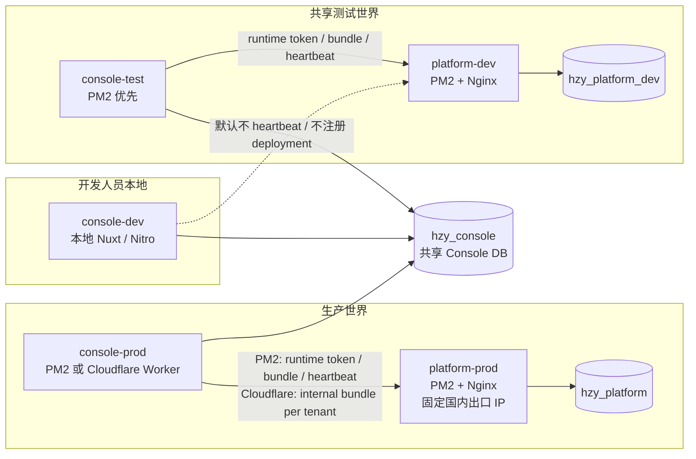

# Platform / Console 生产、测试与本地开发隔离方案

状态：落地中

更新时间：2026-05-29

适用范围：Platform、Console、共享测试环境、开发人员本地 Console、Wiztek 内部租户

## 1. 背景与目标

当前需要同时满足几类诉求：

1. Platform 长期不能依赖 Cloudflare Worker 作为主运行环境，因为微信 / 企业微信登录等服务端能力需要稳定国内出口 IP。
2. Platform 自身仍在迭代开发，开发验证不能影响生产控制面、生产 bundle、生产 license 与生产 runtime token。
3. Console 希望尽量复用 `wiztek` 租户的真实组织、用户、目录和基础配置，避免共享测试环境反复同步数据。
4. 普通外部租户不需要 dev 环境概念，不能因为内部开发需要把实例隔离复杂度扩散到所有租户。
5. 开发人员可以在各自电脑上运行 Console 做页面、接口和普通功能开发，但个人实例不应默认成为 Platform runtime。

本方案的目标是：

- Platform 生产与开发控制面彻底分库隔离。
- Console 生产与共享测试环境可以共用 `hzy_console`，降低数据同步成本。
- `console-test` 作为唯一共享端到端测试 runtime，连接 `platform-dev`。
- `console-dev` 作为开发人员本地 Console 命名，默认不注册 Platform deployment、不 heartbeat。
- Console 共享 DB 时只隔离运行态 cache，不引入全局 `console_instance` 或 `is_dev` 租户模型。
- 兼容 Console prod 部署到 Cloudflare Worker 的场景。

## 2. 命名与核心决策

### 2.1 两个 Platform 世界

Platform 按实例与数据库分成两个世界：

| 项目 | 生产 | 开发控制面 |
| --- | --- | --- |
| Platform 实例 | `platform-prod` | `platform-dev` |
| Platform DB | `hzy_platform` | `hzy_platform_dev` |
| Platform 运行形态 | 国内服务器 PM2 / Nginx | 国内服务器 PM2 / Nginx |
| Platform signing key | 生产根签名密钥 | 开发根签名密钥 |
| Runtime token / license | 生产独立生成 | 测试独立生成 |
| 目标用户 | 真实生产运营与租户 | 内部开发、共享测试、端到端测试 |

生产数据库不增加 `_prod` 后缀；只有开发数据库增加 `_dev` 后缀。

两个 Platform 实例不得连接同一个 Platform DB。`platform-dev` 不能写 `hzy_platform`。

### 2.2 三类 Console 实例

Console 按用途分成三类实例：

| 项目 | 生产 | 共享测试 | 本地开发 |
| --- | --- | --- | --- |
| Console 实例 | `console-prod` | `console-test` | `console-dev` |
| 运行位置 | 生产 PM2 或 Cloudflare Worker | 国内服务器 PM2 优先 | 开发人员电脑 |
| Console DB | `hzy_console` | `hzy_console` | 默认 `hzy_console`，也可本地 DB |
| 连接 Platform | `platform-prod` | `platform-dev` | 默认不作为 Platform runtime |
| Platform deployment | `wiztek-console` | `wiztek-test-console` | 默认无 |
| Bundle cache | 生产 cache scope / 生产 cache dir | 测试 cache scope / 测试 cache dir | 个人本地 cache dir |
| Heartbeat | 开启 | 开启 | 默认关闭 |
| 端到端测试 | 生产验证 | 统一使用 | 不使用 |

命名约定：

- `console-prod`：生产 Console runtime，连接 `platform-prod`。
- `console-test`：共享集成 / 端到端测试 Console runtime，连接 `platform-dev`。
- `console-dev`：开发人员本地 Console 实例，面向日常开发调试，默认不注册 Platform deployment。

历史命名清理：

- 原方案里用于共享集成环境的 `console-dev` 统一改名为 `console-test`。
- `local-dev` 不再作为正式实例名，统一称为 `console-dev`。

旧名到新名的映射固定为：

| 旧称 | 新称 | 含义 |
| --- | --- | --- |
| `console-dev` | `console-test` | 服务器上的共享集成 / 端到端测试环境 |
| `local-dev` | `console-dev` | 开发人员电脑上的本地 Console 实例 |

这样命名后，`dev` 表示开发人员本地开发体验，`test` 表示稳定的共享测试 runtime。

### 2.3 Console DB 可共享

`console-prod`、`console-test` 和必要时的 `console-dev` 可以共用 `hzy_console`。

Console DB 共用的目的，是直接复用 `wiztek` 的真实目录、用户、组织、系统设置、集成配置和部分基础数据。

共库时必须遵守：

- `console-prod` 和 `console-test` 使用不同 Platform 激活材料。
- `console-prod` 和 `console-test` 使用不同 runtime cache scope 或不同文件 cache 目录。
- `console-dev` 默认只做本地开发，不 heartbeat、不刷新共享 runtime 状态、不自动物化会影响生产 / 测试回调地址的 runtime 配置。
- `console-prod` / `console-test` 默认不信任请求头里的 `x-hzy-tenant` / `x-hzy-deployment` 或登录上游配置头覆盖运行态；scope、deploymentCode 和登录配置必须来自 env。
- Console schema 变更必须兼容生产代码；破坏性 schema 变更不得直接落到共享 `hzy_console`。

多个开发人员可以各自运行 `console-dev` 并连接共享 `hzy_console`，但这里的“安全”只表示不会自动写 Platform runtime 状态：不会 heartbeat、不会刷新共享 bundle cache、不会物化 auth client、不会启动后台 runtime job。它仍然是连接同一个 Console DB 的应用实例，开发人员通过页面或接口主动修改组织资料、系统设置、集成配置、凭证、目录数据、auth session 等普通业务数据时，仍会影响共享 `hzy_console`。如果正在开发破坏性 schema、批量写入、目录同步、凭证轮换或会污染生产样本数据的功能，应改用个人本地 DB，或在共享 `console-test` 上按测试流程执行。

### 2.4 不引入租户级 dev 概念

不在产品模型中为所有租户引入 `is_dev` 或 `console_instance`。普通租户默认只有生产世界。

共享测试与本地开发通过以下方式隔离：

- `platform-dev` 使用独立 DB。
- `console-test` 使用独立 Platform 激活材料。
- `console-test` runtime cache 使用独立 cache 目录或 cache scope。
- `console-dev` 默认不作为 Platform runtime，不 heartbeat。
- 共享 session 的副作用仅限访问测试 / 本地开发环境的内部开发人员。

### 2.5 不复用生产 bundle artifact

共享测试环境不复制生产 bundle 文件。

可以复用生产授权配置的形状，例如 app registry、plans、role templates、`wiztek` 租户基础配置和 subject 投影，但必须由 `platform-dev` 使用开发 signing key 重新生成测试 bundle。

原因：

- bundle 内包含 Platform 来源、deploymentCode、homeUrl、callbackUrl、logoutUrl、basePath、apiBase、bundle targets 等运行态信息。
- 生产 bundle 指向生产 deployment 与生产 URL，不能直接用于共享测试环境。
- test bundle 应由 `platform-dev` 签名，`console-test` 用 dev signing pubkey 验签。

## 3. 目标拓扑



示例域名：

| 服务 | 示例 |
| --- | --- |
| Platform prod (Cloudflare) | `https://huizhi.yun` |
| Platform prod (PM2/private) | `https://platform.wiztek.cn` |
| Platform dev | `https://platform-dev.wiztek.cn` |
| Console / runtime prod (Cloudflare) | `https://console.huizhi.yun` |
| Console / runtime prod (PM2/private) | `https://hzy.wiztek.cn` 或现有生产入口 |
| Console / runtime test | `https://hzy-test.wiztek.cn` 或内部共享测试入口 |
| Console dev (`console-dev`) | `http://localhost:3000`、`http://localhost:3001` 等个人本地端口 |

实际域名可以按当前网关策略调整，但 Platform prod 和 Platform dev 应使用不同域名，`console-test` 也应有稳定测试入口。

## 4. Console Runtime Cache 隔离

Console 共用 DB 时，最关键的隔离对象不是 session，而是 runtime cache。

必须隔离的 cache：

- `policy_bundle`
- `activation_status`
- 后续如有 revocation cache、runtime applications cache，也必须纳入同一 scope。

### 4.1 PM2 / Node 部署

PM2 场景可使用文件缓存目录隔离：

```env
# console-prod
HZY_PLATFORM_BUNDLE_CACHE_BACKEND=file
HZY_PLATFORM_BUNDLE_CACHE_DIR=.data/platform-runtime

# console-test
HZY_PLATFORM_BUNDLE_CACHE_BACKEND=file
HZY_PLATFORM_BUNDLE_CACHE_DIR=.data/platform-runtime-test

# console-dev on developer laptop
HZY_PLATFORM_BUNDLE_CACHE_BACKEND=file
HZY_PLATFORM_BUNDLE_CACHE_DIR=.data/platform-runtime-dev
```

如果 `HZY_PLATFORM_BUNDLE_CACHE_BACKEND` 未设置且当前为 Node / PM2 部署，默认仍可走文件缓存。

### 4.2 Cloudflare Worker 部署

Cloudflare Worker 不应依赖文件缓存作为持久状态。Console prod 如果部署在 Cloudflare 上，应使用 `managed-cloud-multitenant` 共享模式、DB cache，以及统一基础 scope：

```env
# console-prod on Cloudflare
HZY_PLATFORM_BUNDLE_CACHE_BACKEND=db
HZY_PLATFORM_BUNDLE_CACHE_SCOPE=managed-cloud-console
HZY_CONSOLE_ACTIVATION_MODE=managed-cloud-multitenant
HZY_PLATFORM_ENVIRONMENT=prod
```

Cloudflare 生产部署的非 secret 配置样例放在 `console/.env.cloudflare.example`。真实 `console/.env.cloudflare` 只保留在部署机并由 `.gitignore` 忽略；Platform service token、Tenant Gateway internal token、vault master key、diagnostics token、Console OIDC private signing key 等必须使用 Worker secrets。共享 Cloudflare Console 不配置 `HZY_PLATFORM_TENANT_CODE`、`HZY_PLATFORM_DEPLOYMENT_CODE`、`HZY_PLATFORM_RUNTIME_TOKEN` 或 `HZY_PLATFORM_LICENSE_TOKEN`。上游员工登录配置由 Platform deployment settings 写入签名 policy bundle，下发给 Console runtime。

DB cache key 不能只有：

```text
policy_bundle
activation_status
```

应当变成：

```text
managed-cloud-console:prod:wiztek:policy_bundle
managed-cloud-console:prod:wiztek:activation_status
managed-cloud-console:prod:another-tenant:policy_bundle
managed-cloud-console:prod:another-tenant:activation_status
```

Cloudflare 共享 Console 的 `HZY_PLATFORM_BUNDLE_CACHE_SCOPE` 固定为 `managed-cloud-console`，运行时再按 `environment + tenantCode` 派生实际 scope。PM2 / 私有单租户部署仍可使用 `HZY_PLATFORM_DEPLOYMENT_CODE` 作为默认 scope。运行时代码在 DB cache 后端下也会 fail-fast：如果既没有 scope，也没有 deploymentCode，则拒绝读写 legacy unscoped key，避免误配置实例污染共享 cache。

`console-dev` 默认不使用 DB cache；如果必须使用 DB cache，应显式配置个人 scope，例如 `wiztek-dev-gavin-console`，并禁止作为常规流程。

## 5. Session 共享策略

本方案暂不隔离 Console session。

允许的副作用：

- 内部开发者访问 `console-test` 或本地 `console-dev` 后，自己的 prod 登录态可能被覆盖。
- 内部开发者在测试 / 本地环境退出后，自己的 prod session 可能同时失效。
- auth / OIDC / refresh token 测试期间，该开发者本人的登录状态可能不干净。

接受该副作用的原因：

- 测试和本地开发入口只面向内部开发人员。
- 不访问测试 / 本地开发环境的普通生产用户不受影响。
- 引入 session 实例隔离会扩大 schema 和 auth-runtime 改造面，当前收益不如 cache 隔离明确。

后续触发条件：

- 如果开始系统性测试 auth-runtime、OIDC logout、refresh token rotation、单点退出等能力，再评估 session 隔离。
- session 隔离优先通过可配置 cookie 名实现，例如 `CONSOLE_SESSION_COOKIE=console_dev_session`，不优先引入租户级 `console_instance`。

### 5.1 Console OIDC signing key

`console-prod`、`console-test` 与部分 `console-dev` 共用 `hzy_console` 时，`auth_signing_keys` 也是共享 auth runtime 状态。它不能像本地临时 DB 一样由任意实例自动生成或自动轮换，否则 `console-test` / `console-dev` 可能因为读不到生产私钥而把生产 current signing key 置为 retired，影响生产 OIDC token 签发和验签。

同机 PM2 运行两个 Console 时，embedded Collab runtime 也必须显式处理。默认样例让 `console-prod` 以 embedded 模式监听 `COLLAB_PORT=3021` 并通过 `HZY_TENANT_RUNTIME_URL` 访问 Codocs tenant-runtime，让 `console-test` 设置 `CONSOLE_COLLAB_MODE=disabled`，避免测试实例启动第二个 embedded Collab runtime 争用端口。需要测试 Collab 时，应改用外部 Collab 服务，或给 `console-test` 显式配置独立 `COLLAB_PORT` 和 `COLLAB_CODOCS_RUNTIME_URL` 后再打开 embedded。

因此共享 DB 模式下固定规则是：

- `CONSOLE_AUTH_SIGNING_KEY_AUTOGENERATE=false`
- `CONSOLE_AUTH_SIGNING_KEY_ROTATE_UNUSABLE=false`
- `auth_signing_keys.private_key_ref` 指向受管私钥，例如 `env:CONSOLE_AUTH_SIGNING_PRIVATE_JWK`
- 需要签发 OIDC token 的共享实例都必须配置同一把当前私钥，或在未来完成 auth runtime 实例隔离后再使用独立私钥

初始化 / 轮换 Console OIDC signing key 时，使用：

```bash
pnpm --dir console run cloudflare:oidc-key
```

该命令会输出 public JWK 插入 SQL 和 private JWK。SQL 只执行一次；private JWK 放到 Cloudflare Worker secret 或 PM2 env，不写入 git。`console-dev` 连接共享 `hzy_console` 时不得开启自动生成或自动轮换。只有使用个人本地 Console DB 时，才允许临时设置 `CONSOLE_AUTH_SIGNING_KEY_AUTOGENERATE=true`。

## 6. Console 共库风险边界

Console 共库时，需要避免测试 / 本地开发实例覆盖生产关键运行态。

| 风险 | 处理 |
| --- | --- |
| test bundle 覆盖 prod bundle cache | 必须用不同文件目录或 DB cache scope |
| test activation status 覆盖 prod activation status | 同上 |
| `console-dev` 覆盖 prod/test runtime cache | 默认仅使用个人本地文件 cache；禁止默认 DB cache |
| test bootstrap 覆盖 `org_profiles` | `platform-dev` 初始化时保持 `wiztek` profile 与生产一致；必要时限制 test bootstrap 不更新共享企业资料 |
| test OIDC client 物化影响 prod callback | prod/test app callback 应同时可并存；不要让 test bundle 物化逻辑删除生产 redirect URI |
| `console-dev` 本地物化影响共享 callback | 本地默认关闭 runtime 物化；需要联调时使用 `console-test` |
| test/dev 自动轮换 Console OIDC signing key 影响生产 token | prod/test/dev 默认 `CONSOLE_AUTH_SIGNING_KEY_AUTOGENERATE=false` 且 `CONSOLE_AUTH_SIGNING_KEY_ROTATE_UNUSABLE=false`；共享 DB 的 signing key 由运维显式生成和分发 |
| Platform 误发布到 Cloudflare 导致企业微信固定 IP 不成立 | `platform-prod` / `platform-dev` 固定使用国内 PM2/Nginx；`pnpm run deploy:cloudflare` 默认被阻断，只有显式设置 `HZY_ALLOW_PLATFORM_CLOUDFLARE_DEPLOY=true` 才允许历史 / 非 wiztek 例外发布；真实 `platform/.env.cloudflare` 不跟踪进 git；Platform Cloudflare 配置不得引用 `platform.wiztek.cn` / `platform-dev.wiztek.cn` |
| test migration 影响 prod Console | Console schema 变更必须兼容 prod 代码；禁止 test 自动执行破坏性迁移 |
| dev/test integration / vault 操作影响生产凭证 | 测试环境默认不做生产凭证轮换测试；需要测试时使用专用 integrationCode 或专用 secretCode |

## 7. Platform Dev 数据初始化

`hzy_platform_dev` 不与生产共库，但可以从生产导入配置形状。

### 7.1 初始化来源

从 `hzy_platform` 导出并导入到 `hzy_platform_dev`：

- app registry
- app manifests / releases
- plans / plan apps / capabilities
- platform system roles
- role templates
- `wiztek` 租户基础记录
- `wiztek` subscriptions / deployments 的测试副本
- 必要的 tenant roles / templates / subject 投影

服务器上优先使用包装脚本生成 `hzy_platform_dev`：

```bash
export PLATFORM_PROD_DB_PASSWORD='生产库密码'
export PLATFORM_DEV_DB_PASSWORD='开发库密码'

pnpm --dir platform run db:init-dev:wiztek
pnpm --dir platform run db:init-dev:wiztek -- --execute --drop-target
```

该命令默认 dry-run；执行模式会创建 / 重建 `hzy_platform_dev`，从 `hzy_platform` 导入数据，清理生产运行态材料，把生产库当前的 `C000001-console` 改写为 `wiztek-test-console` / `https://hzy-test.wiztek.cn`，并自动运行 sanitized 校验。底层工具是 `pnpm --dir platform run db:init-dev -- ...`，需要改主机、用户、deployment code 或 public URL 时可直接传给包装脚本。

### 7.2 禁止复制

以下内容不得从生产复制到 dev：

- `platform_signing_keys`
- runtime token 明文或 hash
- license token
- deployment bootstrap secrets
- production-only audit sensitive data
- 与生产外部系统绑定的敏感凭证

dev 环境应重新生成：

- dev Platform signing key
- test Console license
- test runtime token
- test policy bundle
- test deployment code，例如 `wiztek-test-console`

个人 `console-dev` 默认不生成 Platform deployment。只有在调试 runtime 协议本身时，才临时创建个人 deployment，例如 `wiztek-dev-gavin-console`，用完清理。

## 8. 配置示例

### 8.1 platform-prod

```env
NODE_ENV=production
HOST=127.0.0.1
PORT=3010
DB_NAME=hzy_platform
PLATFORM_SERVICE_URL=https://platform.wiztek.cn
HZY_PLATFORM_SIGNING_PRIVATE_KEY=base64:<prod-private-key>
HZY_PLATFORM_DIAGNOSTICS_TOKEN=<optional-diagnostics-token>
```

生成 prod signing key：

```bash
pnpm --dir platform run signing:key -- --label prod
```

输出中的 private key 只进入 `platform-prod` env；输出中的 kid/pubkey 进入 `console-prod` env 或 Cloudflare non-secret vars。

### 8.2 platform-dev

```env
NODE_ENV=production
HOST=127.0.0.1
PORT=3011
DB_NAME=hzy_platform_dev
PLATFORM_SERVICE_URL=https://platform-dev.wiztek.cn
HZY_PLATFORM_SIGNING_PRIVATE_KEY=base64:<dev-private-key>
HZY_PLATFORM_DIAGNOSTICS_TOKEN=<optional-diagnostics-token>
```

生成 dev signing key：

```bash
pnpm --dir platform run signing:key -- --label dev
```

输出中的 private key 只进入 `platform-dev` env；输出中的 kid/pubkey 进入 `console-test` env。不要复用 prod key。

### 8.3 console-prod on PM2

参考样例文件：`console/.env.prod.example`。

```env
NODE_ENV=production
HZY_CONSOLE_PM2_NAME=hzy-console-prod
HOST=127.0.0.1
PORT=3030
DB_NAME=hzy_console
HZY_CONSOLE_RUN_MODE=prod
HZY_CONSOLE_TRUST_TENANT_GATEWAY=false
HZY_PLATFORM_RUNTIME_ENABLED=true
HZY_PLATFORM_HEARTBEAT_ENABLED=true
HZY_PLATFORM_BUNDLE_REFRESH_ON_BOOT=true
HZY_PLATFORM_AUTH_CLIENT_MATERIALIZE=true
HZY_CONSOLE_AUTH_CLIENT_MATERIALIZE_MODE=upsert
HZY_CONSOLE_BACKGROUND_JOBS_ENABLED=true
HZY_CONSOLE_DEV_POLICY_BYPASS=false
CONSOLE_AUTH_SIGNING_KEY_AUTOGENERATE=false
CONSOLE_AUTH_SIGNING_KEY_ROTATE_UNUSABLE=false
HZY_PLATFORM_URL=https://platform.wiztek.cn
HZY_PLATFORM_TENANT_CODE=wiztek
HZY_PLATFORM_DEPLOYMENT_CODE=wiztek-console
HZY_PLATFORM_RUNTIME_TOKEN=<prod-runtime-token>
HZY_PLATFORM_SIGNING_KID=<prod-signing-kid>
HZY_PLATFORM_SIGNING_PUBKEY=<prod-signing-pubkey>
HZY_PLATFORM_LICENSE_TOKEN=<prod-license-token>
HZY_PLATFORM_BUNDLE_CACHE_BACKEND=file
HZY_PLATFORM_BUNDLE_CACHE_DIR=.data/platform-runtime
HZY_PLATFORM_BUNDLE_CACHE_SCOPE=wiztek-console
HZY_CONSOLE_DIAGNOSTICS_TOKEN=<optional-diagnostics-token>
```

### 8.4 console-prod on Cloudflare

```env
DB_NAME=hzy_console
HZY_CONSOLE_RUN_MODE=prod
HZY_CONSOLE_TRUST_TENANT_GATEWAY=false
HZY_PLATFORM_RUNTIME_ENABLED=true
HZY_PLATFORM_HEARTBEAT_ENABLED=false
HZY_PLATFORM_BUNDLE_REFRESH_ON_BOOT=false
HZY_PLATFORM_AUTH_CLIENT_MATERIALIZE=true
HZY_CONSOLE_AUTH_CLIENT_MATERIALIZE_MODE=upsert
HZY_CONSOLE_BACKGROUND_JOBS_ENABLED=false
HZY_CONSOLE_DEV_POLICY_BYPASS=false
CONSOLE_AUTH_SIGNING_KEY_AUTOGENERATE=false
CONSOLE_AUTH_SIGNING_KEY_ROTATE_UNUSABLE=false
HZY_DEPLOYMENT_PUBLIC_URL=https://console.huizhi.yun
HZY_PLATFORM_URL=https://huizhi.yun
HZY_CONSOLE_ACTIVATION_MODE=managed-cloud-multitenant
HZY_PLATFORM_ENVIRONMENT=prod
HZY_PLATFORM_SIGNING_KID=<prod-signing-kid>
HZY_PLATFORM_SIGNING_PUBKEY=<prod-signing-pubkey>
HZY_PLATFORM_BUNDLE_CACHE_BACKEND=db
HZY_PLATFORM_BUNDLE_CACHE_SCOPE=managed-cloud-console
# Worker secrets: HZY_CLOUDFLARE_INTERNAL_TOKEN,
# legacy compatible secrets: HZY_CONSOLE_PLATFORM_SERVICE_TOKEN, HZY_TENANT_GATEWAY_INTERNAL_TOKEN,
# HZY_CONSOLE_DIAGNOSTICS_TOKEN, HZY_CONSOLE_VAULT_MASTER_KEY, CONSOLE_AUTH_SIGNING_PRIVATE_JWK
```

Cloudflare Worker 不能使用文件 cache 作为持久 runtime 状态；配置生成器会拒绝 `HZY_PLATFORM_BUNDLE_CACHE_BACKEND=file`。上线前可运行：

```bash
pnpm run validate:console-cloudflare -- --env-file console/.env.cloudflare
```

该校验会用真实 Cloudflare env 生成临时 wrangler 配置，确认 Worker vars 中使用 DB cache + managed scope、拒绝 legacy unscoped cache fallback、拒绝旧 Tenant Gateway 无 token 信任、拒绝 dev runtime flags、强制生产 `auth_clients` 物化使用 `upsert` 模式、指向 `hzy_console`、禁用本机 PM2 app control，并确认 tenant runtime token、license token、Platform service token、Tenant Gateway token、vault master key 等值不会写入 wrangler vars。最终严格上线门禁会追加 `--strict-env`，要求 `HZY_CONSOLE_HYPERDRIVE_ID`、Worker 名称、Platform signing kid/pubkey 等非 secret 值已填充且不是占位值，并确认 Platform signing pubkey 是可解析的 Ed25519 public PEM。

### 8.5 console-test on PM2

```env
NODE_ENV=production
HZY_CONSOLE_PM2_NAME=hzy-console-test
HOST=127.0.0.1
PORT=3031
DB_NAME=hzy_console
HZY_CONSOLE_RUN_MODE=test
HZY_CONSOLE_TRUST_TENANT_GATEWAY=false
HZY_PLATFORM_RUNTIME_ENABLED=true
HZY_PLATFORM_HEARTBEAT_ENABLED=true
HZY_PLATFORM_BUNDLE_REFRESH_ON_BOOT=true
HZY_PLATFORM_AUTH_CLIENT_MATERIALIZE=true
HZY_CONSOLE_AUTH_CLIENT_MATERIALIZE_MODE=append
HZY_CONSOLE_BACKGROUND_JOBS_ENABLED=true
HZY_CONSOLE_DEV_POLICY_BYPASS=false
CONSOLE_AUTH_SIGNING_KEY_AUTOGENERATE=false
CONSOLE_AUTH_SIGNING_KEY_ROTATE_UNUSABLE=false
HZY_PLATFORM_URL=https://platform-dev.wiztek.cn
HZY_PLATFORM_TENANT_CODE=wiztek
HZY_PLATFORM_DEPLOYMENT_CODE=wiztek-test-console
HZY_PLATFORM_RUNTIME_TOKEN=<test-runtime-token>
HZY_PLATFORM_SIGNING_KID=<dev-signing-kid>
HZY_PLATFORM_SIGNING_PUBKEY=<dev-signing-pubkey>
HZY_PLATFORM_LICENSE_TOKEN=<test-license-token>
HZY_PLATFORM_BUNDLE_CACHE_BACKEND=file
HZY_PLATFORM_BUNDLE_CACHE_DIR=.data/platform-runtime-test
HZY_PLATFORM_BUNDLE_CACHE_SCOPE=wiztek-test-console
HZY_CONSOLE_DIAGNOSTICS_TOKEN=<optional-diagnostics-token>
```

### 8.6 console-dev on developer laptop

`console-dev` 是个人本地实例，默认不作为 Platform runtime：

```env
NODE_ENV=development
DB_NAME=hzy_console
HZY_CONSOLE_RUN_MODE=dev
HZY_CONSOLE_TRUST_TENANT_GATEWAY=false
HZY_PLATFORM_RUNTIME_ENABLED=false
HZY_PLATFORM_HEARTBEAT_ENABLED=false
HZY_PLATFORM_BUNDLE_REFRESH_ON_BOOT=false
HZY_PLATFORM_AUTH_CLIENT_MATERIALIZE=false
HZY_CONSOLE_AUTH_CLIENT_MATERIALIZE_MODE=append
HZY_CONSOLE_BACKGROUND_JOBS_ENABLED=false
HZY_CONSOLE_DEV_POLICY_BYPASS=true
CONSOLE_COLLAB_MODE=disabled
CONSOLE_AUTH_SIGNING_KEY_AUTOGENERATE=false
CONSOLE_AUTH_SIGNING_KEY_ROTATE_UNUSABLE=false
HZY_PLATFORM_BUNDLE_CACHE_BACKEND=file
HZY_PLATFORM_BUNDLE_CACHE_DIR=.data/platform-runtime-dev
```

多人各自运行 `console-dev` 是可行的，但必须按本地开发模式理解：本地实例默认只关闭 Platform runtime 相关副作用，不隔离共享业务数据。登录态、普通表单保存、管理后台配置修改、凭证写入、目录 / 集成相关手工操作仍会直接写共享 `hzy_console`。日常页面和接口开发可以共库；涉及 destructive migration、批量导入、目录同步、凭证轮换、auth-runtime 协议或需要稳定端到端状态的测试，不应使用个人 `console-dev`，而应使用个人本地 DB 或共享 `console-test`。

`console-test` 共用 `hzy_console` 时，`HZY_CONSOLE_AUTH_CLIENT_MATERIALIZE_MODE=append` 只给已有 OIDC client 追加测试回调 URI：不创建新的 active client、不 prune 生产 bundle clients，也不覆盖已有 `auth_clients` 的 `home_url`、`logout_url`、`status` 等核心字段。生产 `console-prod` 使用 `upsert` 作为事实源。这样测试环境可以允许已有应用使用测试回调地址登录，但不会因为 test bundle 缺少某个应用而停用生产 OIDC client；新应用在 `console-test` 首次端到端联调前，需要先显式创建或经过生产事实源物化出对应 client。

如果本地需要验证 policy authorization，可使用 `console-test` 的测试 bundle 作为本地只读 seed，但不允许本地实例把 heartbeat、activation status 或 auth client 物化写回共享运行态。如果临时把本地 `console-dev` 开成 Platform runtime，只能连接 `platform-dev`，例如本地 `http://localhost:3011` 或远端 `https://platform-dev.wiztek.cn`，不得指向 `platform-prod`。如果临时要联调 Collab runtime，也应显式打开 `CONSOLE_COLLAB_MODE=external` 或 `embedded`，并避免把个人本地 runtime 当作共享测试入口。

`HZY_CONSOLE_TRUST_TENANT_GATEWAY` 默认必须为 `false`。只有未来引入已签名、已校验的内部 Tenant Gateway 头时，才允许单独评审开启；当前 prod/test/dev 隔离方案不依赖请求头覆盖 deploymentCode、cache scope 或登录上游配置。

### 8.7 Console PM2 双实例启动

Console 提供 `console/ecosystem.config.cjs`，通过 `HZY_CONSOLE_ENV_FILE` 选择 env 文件，通过 `HZY_CONSOLE_PM2_NAME` 区分 PM2 进程。

生产 Console：

```bash
cd /srv/hzy/console-prod
cp .env.prod.example .env.prod
vim .env.prod
pnpm install
pnpm run build:prod
pnpm run pm2:start:prod
pnpm run pm2:logs:prod
```

共享测试 Console：

```bash
cd /srv/hzy/console-test
cp .env.test.example .env.test
vim .env.test
pnpm install
pnpm run build:test
pnpm run pm2:start:test
pnpm run pm2:logs:test
```

建议 `console-prod` 与 `console-test` 使用独立 release/workdir，避免构建产物、`.output` 和本地 `.data` 目录互相覆盖。即使在同一个 checkout 中临时验证，也不要并发运行 `build:prod`、`build:test` 或 `build:dev`，Nuxt / Nitro 会复用本地 cache，可能出现构建产物竞态。服务端 Platform runtime 配置以 PM2 / Cloudflare 运行期 env 为准，构建期 `runtimeConfig` 只作为兜底。

启动前可先做 PM2 模板静态校验，该命令只加载 `ecosystem.config.cjs` 和 env 文件，不启动进程：

```bash
pnpm run validate:pm2-runtime -- \
  --platform-prod-env platform/.env.prod \
  --platform-dev-env platform/.env.dev \
  --console-prod-env console/.env.prod \
  --console-test-env console/.env.test
```

如果生产 Console 在 Cloudflare，静态 PM2 模板校验也要追加 `--console-prod-cloudflare`，跳过不存在的生产 Console PM2 app：

```bash
pnpm run validate:pm2-runtime -- --console-prod-cloudflare \
  --platform-prod-env platform/.env.prod \
  --platform-dev-env platform/.env.dev \
  --console-test-env console/.env.test
```

`console-dev` 不纳入 PM2 校验，因为它是开发人员个人 Nuxt / Nitro 本地进程，不属于共享服务器 runtime。

本地维护验收脚本时可用 fixture 回归 PM2 校验逻辑：

```bash
pnpm run verify:pm2-live:fixture
```

fixture 只用于脚本回归；最终 `--strict` 验收禁止使用 `--pm2-jlist-file`，必须读取服务器真实 `pm2 jlist`。

### 8.8 Nginx 双入口

仓库提供可直接复制的 Nginx 模板：

| 文件 | 用途 |
| --- | --- |
| `platform/deploy/nginx/platform-wiztek.conf` | Platform prod/dev HTTP 与证书申请入口 |
| `platform/deploy/nginx/platform-wiztek.ssl.conf` | Platform prod/dev HTTPS 入口 |
| `console/deploy/nginx/console-wiztek.conf` | Console prod/test HTTP 与证书申请入口 |
| `console/deploy/nginx/console-wiztek.ssl.conf` | Console prod/test HTTPS 入口 |
| `console/deploy/nginx/console-test-only.conf` | Console prod 在 Cloudflare 时的 test-only HTTP 入口 |
| `console/deploy/nginx/console-test-only.ssl.conf` | Console prod 在 Cloudflare 时的 test-only HTTPS 入口 |

默认映射：

```text
platform.wiztek.cn     -> 127.0.0.1:3010 -> hzy-platform-prod
platform-dev.wiztek.cn -> 127.0.0.1:3011 -> hzy-platform-dev
hzy.wiztek.cn          -> 127.0.0.1:3030 -> hzy-console-prod
hzy-test.wiztek.cn     -> 127.0.0.1:3031 -> hzy-console-test
```

首次申请证书前使用 HTTP 配置：

```bash
sudo mkdir -p /var/www/certbot
sudo cp platform/deploy/nginx/platform-wiztek.conf /etc/nginx/conf.d/platform-wiztek.conf
sudo cp console/deploy/nginx/console-wiztek.conf /etc/nginx/conf.d/console-wiztek.conf
sudo nginx -t
sudo systemctl reload nginx

sudo certbot certonly --webroot -w /var/www/certbot -d platform.wiztek.cn
sudo certbot certonly --webroot -w /var/www/certbot -d platform-dev.wiztek.cn
sudo certbot certonly --webroot -w /var/www/certbot -d hzy.wiztek.cn
sudo certbot certonly --webroot -w /var/www/certbot -d hzy-test.wiztek.cn
```

切换 HTTPS 前，先确认每张证书的 SAN 覆盖对应域名：

```bash
echo | openssl s_client -connect platform.wiztek.cn:443 -servername platform.wiztek.cn 2>/dev/null | openssl x509 -noout -subject -issuer -dates -ext subjectAltName
echo | openssl s_client -connect platform-dev.wiztek.cn:443 -servername platform-dev.wiztek.cn 2>/dev/null | openssl x509 -noout -subject -issuer -dates -ext subjectAltName
echo | openssl s_client -connect hzy.wiztek.cn:443 -servername hzy.wiztek.cn 2>/dev/null | openssl x509 -noout -subject -issuer -dates -ext subjectAltName
echo | openssl s_client -connect hzy-test.wiztek.cn:443 -servername hzy-test.wiztek.cn 2>/dev/null | openssl x509 -noout -subject -issuer -dates -ext subjectAltName
```

如果 `probe:public-routing` 输出 `ERR_TLS_CERT_ALTNAME_INVALID`，说明当前 Nginx 命中的证书没有覆盖该 hostname；必须重新签发 / 安装覆盖 `platform.wiztek.cn`、`platform-dev.wiztek.cn` 或 `hzy-test.wiztek.cn` 的证书并 reload Nginx。

证书就绪后切到 HTTPS 配置：

```bash
sudo cp platform/deploy/nginx/platform-wiztek.ssl.conf /etc/nginx/conf.d/platform-wiztek.conf
sudo cp console/deploy/nginx/console-wiztek.ssl.conf /etc/nginx/conf.d/console-wiztek.conf
pnpm run validate:nginx-routing -- \
  --platform-conf /etc/nginx/conf.d/platform-wiztek.conf \
  --console-conf /etc/nginx/conf.d/console-wiztek.conf
sudo nginx -t
sudo systemctl reload nginx
```

如果 `console-prod` 部署在 Cloudflare Worker，不要使用 `console-wiztek.conf` / `console-wiztek.ssl.conf`，改用 `console-test-only.conf` / `console-test-only.ssl.conf`，只代理 `hzy-test.wiztek.cn` 到 `console-test`。Console prod on Cloudflare 仍必须使用 DB cache scoped key。

Console prod on Cloudflare 时，服务器实际配置校验命令改为：

```bash
pnpm run validate:nginx-routing -- \
  --platform-conf /etc/nginx/conf.d/platform-wiztek.conf \
  --console-test-only-conf /etc/nginx/conf.d/console-wiztek.conf
```

### 8.9 Platform PM2 双实例探测

Platform 提供 `/api/platform/diagnostics` 只读诊断端点，默认只允许 `localhost` / `127.0.0.1` 回环访问。它只返回 DB 名、service URL、stage、PM2 名称、监听端口、active signing kid、public key fingerprint 和私钥是否可用，不返回 private key、runtime token 或 license。

部署后在服务器本机执行：

```bash
pnpm run probe:platform-runtime -- \
  --prod-url http://127.0.0.1:3010 \
  --dev-url http://127.0.0.1:3011
```

如果需要从非本机地址探测，必须配置 `HZY_PLATFORM_DIAGNOSTICS_TOKEN`。prod/dev 应使用不同 token：

```bash
PLATFORM_PROD_DIAGNOSTICS_TOKEN=<prod-diagnostics-token> \
PLATFORM_DEV_DIAGNOSTICS_TOKEN=<dev-diagnostics-token> \
  pnpm run probe:platform-runtime -- \
    --prod-url https://platform.wiztek.cn \
    --dev-url https://platform-dev.wiztek.cn \
    --prod-token-env PLATFORM_PROD_DIAGNOSTICS_TOKEN \
    --dev-token-env PLATFORM_DEV_DIAGNOSTICS_TOKEN
```

部署后运行态探测：

```bash
pnpm run probe:console-runtime -- \
  --prod-url http://127.0.0.1:3030 \
  --test-url http://127.0.0.1:3031
```

如果需要从非本机地址探测，必须在 Console env 中配置 `HZY_CONSOLE_DIAGNOSTICS_TOKEN`。prod/test 应使用不同 token：

```bash
CONSOLE_PROD_DIAGNOSTICS_TOKEN=<prod-diagnostics-token> \
CONSOLE_TEST_DIAGNOSTICS_TOKEN=<test-diagnostics-token> \
  pnpm run probe:console-runtime -- \
    --prod-url https://hzy.wiztek.cn \
    --test-url https://hzy-test.wiztek.cn \
    --prod-token-env CONSOLE_PROD_DIAGNOSTICS_TOKEN \
    --test-token-env CONSOLE_TEST_DIAGNOSTICS_TOKEN
```

诊断端点只返回非密钥字段；没有 token 时仅允许 `localhost` / `127.0.0.1` 回环访问。

### 8.10 统一验收命令

真实部署完成后，优先运行统一验收入口：

```bash
pnpm run accept:runtime-isolation -- --strict \
  --platform-prod-env platform/.env.prod \
  --platform-dev-env platform/.env.dev \
  --console-prod-env console/.env.prod \
  --console-test-env console/.env.test \
  --console-dev-env console/.env.dev \
  --platform-prod-url http://127.0.0.1:3010 \
  --platform-dev-url http://127.0.0.1:3011 \
  --console-prod-url http://127.0.0.1:3030 \
  --console-test-url http://127.0.0.1:3031 \
  --platform-prod-token-env PLATFORM_PROD_DIAGNOSTICS_TOKEN \
  --platform-dev-token-env PLATFORM_DEV_DIAGNOSTICS_TOKEN \
  --console-prod-token-env CONSOLE_PROD_DIAGNOSTICS_TOKEN \
  --console-test-token-env CONSOLE_TEST_DIAGNOSTICS_TOKEN \
  --console-db-host 127.0.0.1 \
  --console-db-user root \
  --console-db-password-env CONSOLE_DB_PASSWORD \
  --console-db hzy_console \
  --platform-dev-db-host 127.0.0.1 \
  --platform-dev-db-user root \
  --platform-dev-db-password-env PLATFORM_DEV_DB_PASSWORD \
  --platform-dev-db hzy_platform_dev \
  --platform-dev-db-mode ready \
  --platform-dev-db-expected-test-public-url https://hzy-test.wiztek.cn \
  --expected-test-deployment-code wiztek-test-console \
  --pm2-live \
  --public-routing \
  --public-routing-expected-server-ip 8.130.81.31 \
  --public-routing-platform-prod-url https://platform.wiztek.cn \
  --public-routing-platform-dev-url https://platform-dev.wiztek.cn \
  --public-routing-console-prod-url https://hzy.wiztek.cn \
  --public-routing-console-test-url https://hzy-test.wiztek.cn \
  --nginx-platform-conf /etc/nginx/conf.d/platform-wiztek.conf \
  --nginx-console-conf /etc/nginx/conf.d/console-wiztek.conf
```

`--strict` 表示最终部署门禁：除静态配置检查外，必须显式提供真实 env 文件，拒绝 tracked `*.example` env 文件，并必须提供运行中的 Platform / Console URL、服务器实际 Nginx config 文件、公共 DNS / HTTP 路由校验、共享 Console DB 只读校验参数、`hzy_platform_dev` ready 校验参数和 `console-test` deployment 预期值。`--strict` 与 `--static-only` 互斥；缺少这些参数时命令会失败，避免把“只看模板”误判为已经上线验收。
静态阶段还会运行 `pnpm run validate:platform-signing-readiness`、`pnpm run validate:console-runtime-disabled` 和 `pnpm run validate:runtime-isolation:keys`。第一项防止生产 Platform 弱化 active signing private key 可用性检查，避免等到测试 bundle 生成时才暴露 503；第二项防止 `console-dev` / runtime-disabled 模式在 activation status、admin bundle refresh 或启动 bootstrap 中先读取 Platform 配置并返回 503；第三项用临时生成的 prod/dev Ed25519 key 证明 Platform signing private key 解析、prod/dev key 差异，以及 Console prod/test signing pubkey 匹配校验没有退化。
本地开发 503 防回归还应单独运行 `pnpm run smoke:console-dev-runtime-disabled`。该命令会临时启动本地 Nuxt `console-dev`，探测 activation status 和 diagnostics；它不纳入服务器最终 `accept:runtime-isolation -- --strict`，因为 strict 关注真实 PM2 / Worker / Nginx / DB 运行态。
如果真实 env 显示 `console-prod` 或 `console-test` 使用 DB runtime cache，`--strict` 会强制要求追加对应的 `--console-db-require-prod-cache` 或 `--console-db-require-test-cache`，证明 scoped cache 行已经实际落库。
如果 Console prod 部署在 Cloudflare，追加 `--console-prod-cloudflare` 并把 `--nginx-console-conf` 换成 `--nginx-console-test-only-conf`：未显式传 `--console-prod-env` 时，静态验收默认使用 `console/.env.cloudflare.example`；严格上线验收应显式传真实 `console/.env.cloudflare`。env 隔离校验会确认 `.env.cloudflare` 中只包含非 secret 激活材料，且 `HZY_PLATFORM_TENANT_CODE`、`HZY_PLATFORM_DEPLOYMENT_CODE`、`HZY_PLATFORM_RUNTIME_TOKEN`、`HZY_PLATFORM_LICENSE_TOKEN` 都为空；共享运行时信任由 Worker secrets 中的 `HZY_CLOUDFLARE_INTERNAL_TOKEN` 承接，旧 `HZY_CONSOLE_PLATFORM_SERVICE_TOKEN` 与 `HZY_TENANT_GATEWAY_INTERNAL_TOKEN` 仅作兼容。静态和 live PM2 校验会跳过不存在的生产 Console PM2 app。
`--pm2-live` 会读取 `pm2 jlist`，确认 `platform-prod` / `platform-dev` / `console-prod` / `console-test` 进程在线，端口 / DB / Platform URL / Console runtime 副作用开关与 env 一致，并确认同组 prod/dev/test 没有复用同一个 release workdir。随后 acceptance 会运行 `probe:server-upstreams`，实际访问 Nginx 将要代理的 `127.0.0.1` upstream。Console prod on Cloudflare 时，PM2 live 和 upstream probe 仍会校验 `platform-prod`、`platform-dev` 与 `console-test`，并跳过不存在的本机 `console-prod`。
`--public-routing` 会检查 `platform.wiztek.cn`、`platform-dev.wiztek.cn`、`hzy.wiztek.cn`、`hzy-test.wiztek.cn` 的 DNS 与 HTTP 可达性，并默认禁止 Platform 域名走 Cloudflare。探测优先使用 `HEAD`，目标不支持时降级为 `GET`；`404` 和 `5xx` 都视为公网入口未正确接通。DNS 缺失或未包含预期 IP 时，probe 会直接输出需要补的 A 记录；TLS 证书 SAN 不覆盖当前 hostname 时，会输出安装覆盖该域名证书并 reload Nginx 的提示；`502` / `503` / `504` 会输出应检查的 PM2 进程名、监听端口、Nginx upstream 和下一步 `probe:server-upstreams` 命令。严格验收必须提供固定 IP 预期：`--public-routing-expected-server-ip` 用于约束必须落在国内服务器的 `platform-prod`、`platform-dev`、`console-test`；如果 Console prod 也在同一台 PM2/Nginx 服务器上，可改用 `--public-routing-expected-ip` 约束全部四个域名。固定 IP 也可用 `--public-routing-expected-server-ip-env HZY_SERVER_PUBLIC_IP` 从环境变量读取。
最终 `--strict` 验收不允许使用临时放宽参数：`--pm2-jlist-file`、`--allow-shared-pm2-cwd`、`--public-routing-skip-http`、`--allow-platform-cloudflare`、`--console-db-allow-legacy-unscoped` 都会失败。这样可以避免把 fixture、共享 release 目录、只验 DNS、不验 HTTP、Platform 走 Cloudflare 或 legacy unscoped cache 误判为正式上线通过。
注意：`--platform-prod-url` / `--console-prod-url` 等是运行态诊断 URL，可以使用服务器本机 `127.0.0.1`；`--public-routing-*-url` 是公网路由 URL，必须使用真实外部域名。

DNS / Nginx / 证书变更前，可以先生成公网入口计划。输出里包含 DNS A 记录、Nginx 模板选择、PM2 / 监听端口 upstream 检查、certbot 命令、证书 SAN 检查命令和后续 probe 命令：

```bash
HZY_SERVER_PUBLIC_IP=8.130.81.31 pnpm run plan:public-routing -- --server-ip-env HZY_SERVER_PUBLIC_IP
```

如果 `console-prod` 保持 Cloudflare Worker，只把 `console-test` 放到 PM2/Nginx：

```bash
HZY_SERVER_PUBLIC_IP=8.130.81.31 pnpm run plan:public-routing -- --server-ip-env HZY_SERVER_PUBLIC_IP --console-prod-cloudflare
```

如果公网 probe 返回 `502` / `503` / `504`，先在 PM2/Nginx 服务器本机执行：

```bash
pnpm run probe:server-upstreams
```

该命令会一次性检查 `hzy-platform-prod`、`hzy-platform-dev`、`hzy-console-prod`、`hzy-console-test` 的 PM2 状态和 `127.0.0.1` upstream 可达性。若 Console prod 在 Cloudflare，追加 `--console-prod-cloudflare`，跳过不存在的本机 `hzy-console-prod`。upstream 全部可达后，脚本会继续打印服务器实际 Nginx 配置校验、`nginx -t`、reload 和公网 probe 的下一步命令。

如果只是想在真实 env 文件上做静态预检查，可使用：

```bash
pnpm run accept:runtime-isolation -- --static-only \
  --platform-prod-env platform/.env.prod \
  --platform-dev-env platform/.env.dev \
  --console-prod-env console/.env.prod \
  --console-test-env console/.env.test \
  --console-dev-env console/.env.dev
```

该命令按顺序执行：

1. `validate:runtime-isolation-docs`，证明部署文档仍使用 `console-test` / `console-dev` 新命名、默认本地端口和 strict 验收入口，没有退回旧口径。
2. `validate:runtime-acceptance-strict`，证明最终 `accept:runtime-isolation -- --strict` 不会接受缺失真实运行态、PM2 fixture、共享 release workdir、跳过公网 HTTP、Platform Cloudflare override 或 legacy unscoped cache 等捷径。
3. `validate:console-runtime-cache-guardrails`，用离线 fixture 回归 DB cache verifier，证明传错 DB、legacy unscoped key、payload deploymentCode 串环境和 prod/test bundle hash 碰撞都会被拒绝。
4. `validate:runtime-probe-guardrails`，用本地 diagnostics fixture 跑真实 probe，证明部署后 probe 仍会拒绝 prod/test/dev DB、PM2、端口、Platform URL、Platform signing kid、cache 和 bundle hash 串环境，并覆盖 `console-dev` runtime-disabled probe。
5. `validate:public-routing-plan`，证明 `probe:public-routing -- --expected-server-ip` 只约束必须落在国内服务器的 `platform-prod`、`platform-dev` 和 `console-test`，不会错误要求 Cloudflare 上的 `console-prod` 落到国内服务器；`--expected-ip` 仍会约束全部四个域名。
6. `validate:runtime-isolation -- --strict`，证明真实 env 文件没有串库、串 URL、串 PM2 名称、串 cache，Console prod/test 公网 URL 与 OIDC 回调没有串环境，且 prod/test 运行模式与启动副作用开关符合预期；同时静态解析 Platform prod/dev signing private key 为 Ed25519，并确认 Console prod/test 的 `HZY_PLATFORM_SIGNING_PUBKEY` 分别匹配对应 Platform 实例。Console prod on Cloudflare 时会追加 `--console-prod-cloudflare`，要求共享 Console 使用 `managed-cloud-multitenant`，不配置 tenant/deployment/runtime/license token，并要求 signing kid/pubkey 等非 secret 激活材料已填充。
7. `validate:pm2-runtime`，证明 PM2 模板加载真实 env 后的进程名、端口、Nitro host / port、日志路径、DB 名、Platform URL 和 Console runtime 副作用开关不冲突。
8. `validate:console-cloudflare`，证明 Console prod-on-Cloudflare 生成配置使用 DB cache scoped key，真实 Cloudflare env 中非 secret activation values 已填充且不是占位值，Platform signing pubkey 可解析为 Ed25519 public PEM，且 secret 不落入 wrangler vars。
9. `validate:platform-cloudflare-guard`，证明 Platform Cloudflare 发布默认被阻断，避免 `wiztek` 的 `platform-prod` / `platform-dev` 绕过国内 PM2/Nginx 固定 IP。
10. `validate:nginx-routing`，证明仓库内 Nginx 模板仍将 prod/dev/test 域名代理到约定 PM2 端口，并覆盖 Console prod-on-Cloudflare 的 test-only 模板；传入 `--platform-conf` / `--console-conf` / `--console-test-only-conf` 时，也可校验服务器实际复制后的 Nginx 文件。
11. `verify:pm2-live`，证明真实 PM2 进程在线、运行 env 与 Console runtime 副作用开关正确，且 prod/dev/test release workdir 不共用。
12. `probe:public-routing`，证明公网 DNS 与 HTTP 路由已经指向目标域名，且 Platform 域名没有走 Cloudflare。
13. `probe:platform-runtime`，证明正在运行的 `platform-prod` / `platform-dev` 没有串 DB / URL / signing fingerprint，且 active signing private key 可用。
14. `probe:console-runtime`，证明正在运行的 `console-prod` / `console-test` 连接正确 Console DB、指向正确 Platform、public URL、runtime cache、activation / bundle ready 状态、prod/test bundle hash 差异、Collab mode / status、auth client materialize mode、OIDC signing key 自动化开关和当前 OIDC signing private key 可用性。
15. `verify:console-runtime-cache`，证明共享 `hzy_console.console_runtime_cache` 不存在未授权 legacy unscoped key，传入 DB 与 prod/test env 的 `DB_NAME` 一致，prod/test scoped key 的 payload deploymentCode 与 env 匹配，且 prod/test cache rows 不复用同一个 bundle hash。
16. `platform/scripts/verify-platform-dev-db.mjs --mode ready`，证明 `hzy_platform_dev` 已经重新生成 dev signing key、test runtime token、test license 和 test bundle，并用当前 active dev public key 验证 test license / test bundle 的 Ed25519 签名。

如果需要把 `console-test` heartbeat 也纳入最终门禁，可在 `console-test` 启动并完成首次 heartbeat 后追加：

```bash
--platform-dev-db-require-heartbeat
```

如果 Console prod 或 test 使用 DB runtime cache，再按实际情况追加：

```bash
--console-db-require-prod-cache
--console-db-require-test-cache
```

## 9. 执行计划

### Phase 0：现状确认与备份

1. 备份 `hzy_platform` 与 `hzy_console`。
2. 记录当前 Platform signing key、deploymentCode、runtime token last4、bundle version。
3. 确认当前 Console 使用的 cache backend 与 cache dir。
4. 确认 `console_runtime_cache` 是否在生产使用；如果 Console prod 在 Cloudflare，则必须进入 Phase 3 的 DB cache scope 改造。
5. 准备 prod/test/dev env 文件后运行隔离配置预检查。

样例配置预检查：

```bash
pnpm run validate:env-tracking
pnpm run validate:platform-env-isolation
pnpm run validate:platform-signing-readiness
pnpm run validate:console-runtime-disabled
pnpm run smoke:console-dev-runtime-disabled
pnpm run validate:runtime-isolation-docs
pnpm run validate:runtime-acceptance-strict
pnpm run validate:runtime-probe-guardrails
pnpm run validate:runtime-isolation
pnpm run validate:pm2-runtime
pnpm run validate:console-cloudflare
```

真实部署 env 预检查：

```bash
pnpm run validate:runtime-isolation -- --strict \
  --platform-prod-env platform/.env.prod \
  --platform-dev-env platform/.env.dev \
  --console-prod-env console/.env.prod \
  --console-test-env console/.env.test \
  --console-dev-env console/.env.dev
```

该脚本只读取 env 结构，不输出 token、license、private key 或 pubkey 原文。

PM2 模板预检查：

```bash
pnpm run validate:pm2-runtime -- \
  --platform-prod-env platform/.env.prod \
  --platform-dev-env platform/.env.dev \
  --console-prod-env console/.env.prod \
  --console-test-env console/.env.test
```

Console prod on Cloudflare 时：

```bash
pnpm run validate:pm2-runtime -- --console-prod-cloudflare \
  --platform-prod-env platform/.env.prod \
  --platform-dev-env platform/.env.dev \
  --console-test-env console/.env.test
```

真实 PM2 进程启动后，还应运行 live 校验：

```bash
pnpm run verify:pm2-live -- \
  --platform-prod-env platform/.env.prod \
  --platform-dev-env platform/.env.dev \
  --console-prod-env console/.env.prod \
  --console-test-env console/.env.test
```

如果生产 Console 在 Cloudflare：

```bash
pnpm run verify:pm2-live -- --console-prod-cloudflare \
  --platform-prod-env platform/.env.prod \
  --platform-dev-env platform/.env.dev \
  --console-test-env console/.env.test
```

本地维护脚本时可用 `pnpm run verify:pm2-live:fixture` 回归 PM2 校验逻辑；最终 `--strict` 验收必须读取服务器真实 PM2 状态，不允许 fixture。

验收：

- 可恢复生产 Platform DB。
- 可恢复 Console DB。
- 明确当前生产 Console cache backend。
- env tracking 预检查证明 `platform` / `console` 的真实 `.env`、`.env.prod`、`.env.test`、`.env.cloudflare` 不被 git 跟踪，只允许提交 `.env.dev` 开发默认配置和 `*.example` 模板。
- Platform environment isolation 预检查证明 `platform-dev` 的部署管理页默认进入测试环境，tenant-admin 与 ops 两个 Policy Bundle 生成入口都会显式传递当前 environment，并证明部署管理页和 Tenant Gateway 解析 Data Runtime static token 时会通过 `deployments.environment` 限定 prod/test，不会只按 tenant 读取最新 token。
- 预检查证明 Platform DB、Platform URL、PM2 名称、Console deploymentCode、cache dir / scope、Console public URL / OIDC callback、legacy cache fallback、Tenant Gateway trust、Collab mode、prod/test 启动副作用开关和 `console-dev` runtime 开关没有串环境，真实 env 下 Platform signing private key / Console Platform signing pubkey 能解析且匹配，并确认 `console/.env.example` 仍保持安全本地默认值。
- PM2 模板预检查证明 `platform-prod` / `platform-dev` / `console-prod` / `console-test` 进程名、端口、日志路径、Nitro 监听配置、cache scope / fallback、Tenant Gateway trust、Collab mode / port / DB 和 Console runtime 副作用开关不冲突；Console prod on Cloudflare 时，明确跳过不存在的生产 Console PM2 app。
- PM2 live 校验证明真实进程在线、运行 env 正确、Console runtime 副作用开关符合 prod/test 预期，并且 prod/dev/test 使用独立 release workdir；Console prod on Cloudflare 时，还会拒绝遗留的本机 `hzy-console-prod` 或指向 `huizhi-console` 的 prod PM2 进程。
- Cloudflare 配置预检查证明 Console prod-on-Cloudflare 强制使用 DB cache scoped key，且敏感值只通过 Worker secret 注入。

### Phase 1：Platform prod PM2 固化

1. 在国内服务器部署 `platform-prod`。
2. 使用 `hzy_platform`。
3. 注入生产 `HZY_PLATFORM_SIGNING_PRIVATE_KEY`。
4. 配置 Nginx 反代与 HTTPS。
5. 验证微信 / 企业微信登录相关固定 IP 需求。
6. 使用 `pnpm run probe:platform-runtime -- --prod-url http://127.0.0.1:3010 --dev-url http://127.0.0.1:3011` 验证 prod/dev 正在运行的 DB、URL、stage、签名 fingerprint 均隔离。

验收：

- `platform-prod` 可登录。
- 生产 signing key 可正常签 license / bundle。
- 现有生产 Console 可从 `platform-prod` 拉 bundle。

### Phase 2：Platform dev 建库与初始化

1. 创建 `hzy_platform_dev`。
2. 应用 Platform schema 和 migrations。
3. 从 `hzy_platform` 导入 app registry、plans、roles、templates、`wiztek` 基础数据。
4. 生成 dev signing key。
5. 生成 `console-test` deployment、runtime token、license。
6. 生成 test policy bundle。

验收：

- `platform-dev` 连接 `hzy_platform_dev`。
- `platform-dev` 不依赖 `hzy_platform`。
- test bundle 由 dev signing key 签名。

### Phase 3：Console runtime cache scope 改造

1. 保持文件缓存时，确认 `HZY_PLATFORM_BUNDLE_CACHE_DIR` 已生效。
2. 为 DB cache 增加 `HZY_PLATFORM_BUNDLE_CACHE_SCOPE` 支持。
3. DB cache scope 默认取 `HZY_PLATFORM_DEPLOYMENT_CODE`。
4. `console_runtime_cache.cache_key` 写入时使用 `${scope}:${logicalKey}`。
5. 默认不读取旧无 scope key；只有显式设置 `HZY_PLATFORM_BUNDLE_CACHE_LEGACY_FALLBACK=true` 才允许临时迁移 fallback，生产 / 测试共享运行态不得开启。
6. Cloudflare 配置生成器强制 `HZY_PLATFORM_BUNDLE_CACHE_BACKEND=db`，拒绝文件 cache。
7. 通过 `pnpm run verify:console-runtime-cache -- --db hzy_console ...` 验证 DB cache scope 与 payload deploymentCode。

验收：

- PM2 prod/test 使用不同 cache dir 不互相覆盖。
- Cloudflare prod 使用 DB cache scoped key。
- `pnpm run validate:console-cloudflare` 通过。
- `pnpm run verify:console-runtime-cache -- --db hzy_console ...` 在共享 Console DB 上通过。
- `policy_bundle` 与 `activation_status` 不会在 prod/test 间覆盖。

### Phase 4：console-test 接入 platform-dev

1. 部署 `console-test`。
2. 连接共享 `hzy_console`。
3. 配置 `HZY_PLATFORM_URL=https://platform-dev.wiztek.cn`。
4. 配置 test runtime token、dev signing pubkey、test license token。
5. 配置 `.data/platform-runtime-test`。
6. 配置 `HZY_CONSOLE_PM2_NAME=hzy-console-test`、独立 `PORT`。
7. 启动后验证 activation status、bundle version、heartbeat。
8. 使用 `pnpm run probe:console-runtime -- --test-url http://127.0.0.1:3031` 证明运行期指向 `platform-dev` 且 cache dir / scope 正确。

验收：

- `console-test` 可启动并完成 activation。
- `console-test` 使用 test bundle。
- `console-prod` 的 bundle cache 不变化。

### Phase 5：共享测试环境路由与业务应用接入

1. 为共享 test runtime 配置稳定域名。
2. `console-test` 的 app launcher 使用 test bundle 中的 app URLs。
3. 业务应用测试实例连接 `console-test`。
4. 本地开发实例 `console-dev` 不注册 Platform deployment，不 heartbeat。
5. 端到端测试统一在共享 `console-test` 环境执行。

验收：

- test app 能通过 Console OIDC 登录。
- test app 能读取 Console runtime config。
- test app 不影响生产 app deployment status。

### Phase 6：console-dev 本地开发模式

1. 增加 `HZY_CONSOLE_RUN_MODE=dev` 或等价配置。
2. 增加关闭 Platform runtime 上报的开关，例如 `HZY_PLATFORM_RUNTIME_ENABLED=false`。
3. 增加关闭 heartbeat 的开关，例如 `HZY_PLATFORM_HEARTBEAT_ENABLED=false`。
4. 增加关闭启动时 bundle refresh 的开关，例如 `HZY_PLATFORM_BUNDLE_REFRESH_ON_BOOT=false`。
5. 增加关闭 auth client 物化的开关，例如 `HZY_PLATFORM_AUTH_CLIENT_MATERIALIZE=false`。
6. 增加关闭本地后台 job / 目录同步自动执行的开关，例如 `HZY_CONSOLE_BACKGROUND_JOBS_ENABLED=false`。
7. 增加关闭 embedded Collab runtime 的开关，例如 `CONSOLE_COLLAB_MODE=disabled`。
8. 增加关闭 Console OIDC signing key 自动生成 / 自动轮换的开关，例如 `CONSOLE_AUTH_SIGNING_KEY_AUTOGENERATE=false` 和 `CONSOLE_AUTH_SIGNING_KEY_ROTATE_UNUSABLE=false`。
9. 本地默认使用个人文件 cache 目录。

验收：

- 多个开发人员可以同时运行 `console-dev`。
- 本地实例不会向 `platform-dev` heartbeat。
- 本地实例不会覆盖 `console-prod` 或 `console-test` 的 runtime cache。
- 本地实例不会自动修改共享 OIDC callback / auth client materialization。
- 本地实例默认不会启动 embedded Collab runtime。
- 本地实例不会因为读不到共享 OIDC signing private key 而自动轮换 `auth_signing_keys`。
- 本地实例连接共享 `hzy_console` 时，文档明确普通业务写入仍会共享；高风险数据变更使用个人本地 DB 或共享 `console-test`。

### Phase 7：运维与发布流程

1. Platform schema 先在 `hzy_platform_dev` 验证，再迁移 `hzy_platform`。
2. Platform dev 发布不影响 Platform prod。
3. Console schema 变更必须保持向后兼容，因为 `console-prod`、`console-test` 和部分 `console-dev` 可能共用 `hzy_console`。
4. 需要破坏性 Console schema 变更时，必须单独评审是否临时拆出 `hzy_console_test` 或本地 DB。

验收：

- 有明确 dev/test -> prod 升级顺序。
- Console 共库期间无破坏性 schema 变更直接落地。

## 10. 已落地代码入口

### 已实现

1. Console DB cache 支持 `HZY_PLATFORM_BUNDLE_CACHE_SCOPE`。
2. Scope 默认值为 `HZY_PLATFORM_DEPLOYMENT_CODE`。
3. `console_runtime_cache.cache_key` 写入 scoped key，读取默认不再 fallback 到旧无 scope key；如需迁移兼容必须显式设置 `HZY_PLATFORM_BUNDLE_CACHE_LEGACY_FALLBACK=true`，且 env 验证会阻止生产 / 测试共享运行态开启该开关。
4. 启动日志输出 cache backend、cache dir、cache scope、run mode，便于排障。
5. `console-dev` 本地模式支持 runtime enabled、heartbeat enabled、bundle refresh on boot、auth client materialization、background jobs enabled、dev policy bypass 和 OIDC signing key 自动生成 / 自动轮换开关。
6. 文档与示例覆盖 `console/.env.example`、`console/.env.prod.example`、`console/.env.test.example`、`console/.env.dev.example`、`console/.env.cloudflare.example`、Cloudflare deploy README；`console/.env.example` 只保留安全本地 `console-dev` 默认值，真实 `console/.env.cloudflare` 不再跟踪。
7. Platform PM2 支持通过 `HZY_PLATFORM_ENV_FILE` 和 `HZY_PLATFORM_PM2_NAME` 区分 `platform-prod` / `platform-dev`。
8. 文档与示例覆盖 `platform/.env.prod.example`、`platform/.env.dev.example` 和双实例 PM2 部署说明。
9. Platform 的 `deploy:cloudflare` 增加显式 override 门禁，并由根目录 `pnpm run validate:platform-cloudflare-guard` 纳入统一验收；`wiztek` 的 `platform-prod` / `platform-dev` 必须使用国内 PM2/Nginx，只有历史 / 非 `wiztek` 例外场景才允许设置 `HZY_ALLOW_PLATFORM_CLOUDFLARE_DEPLOY=true` 后发布 Cloudflare Worker；即使例外发布，Platform Cloudflare 配置也不得绑定 `platform.wiztek.cn` / `platform-dev.wiztek.cn`。
10. Platform 提供 `pnpm --dir platform run db:init-dev:wiztek` 包装脚本和底层 `pnpm --dir platform run db:init-dev -- ...` 初始化工具，可 dry-run / execute 克隆 `hzy_platform` 到 `hzy_platform_dev`，并清理生产签名密钥、runtime token、license、bundle、bootstrap secret、heartbeat、session、API key、webhook 和审计数据。
11. Platform 提供 `pnpm --dir platform run db:verify-dev -- ...` 只读校验工具：`--mode sanitized` 用于克隆后证明没有生产 runtime / signing / session 材料残留，`--mode ready` 用于最终证明 dev signing key、test runtime token、test license 和 test bundle 已经重新生成，并会用 active dev public key 验证 license / bundle 签名。
12. 根目录提供 `pnpm run validate:platform-signing-readiness`，用于防止生产 Platform 启动和运行态探测弱化 active Ed25519 signing private key 可用性检查，避免等到测试 bundle / license 生成时才暴露 503。
13. 根目录提供 `pnpm run validate:console-runtime-disabled` 和 `pnpm run smoke:console-dev-runtime-disabled`，前者静态防止 `console-dev` / runtime-disabled 模式在 activation status、admin bundle refresh 或启动 bootstrap 中先读取 Platform runtime 配置并返回 503；后者临时启动本地 Nuxt `console-dev`，用 activation status / diagnostics 证明实际运行时返回 HTTP 200 且 runtime 副作用关闭。
14. 根目录提供 `pnpm run validate:runtime-isolation`，默认校验 tracked 示例 env；真实部署时加 `--strict` 与实际 env 路径，检查 prod/test/dev 配置隔离、cache fallback、Tenant Gateway trust、Collab mode、Platform signing private key 可解析性以及 Console signing pubkey 匹配关系，且不打印敏感值；`pnpm run validate:runtime-isolation:keys` 会用临时 prod/dev Ed25519 key 回归严格匹配逻辑；Console prod on Cloudflare 时加 `--console-prod-cloudflare`，要求 `managed-cloud-multitenant` 且 tenant/deployment/runtime/license token 都为空。
15. Console 提供 `ecosystem.config.cjs` 与 `pm2:start`，支持通过 `HZY_CONSOLE_ENV_FILE`、`HZY_CONSOLE_PM2_NAME`、`HOST`、`PORT` 同机运行 `console-prod` / `console-test`。
16. Console 提供 `/api/activation/diagnostics` 只读诊断端点与根目录 `pnpm run probe:console-runtime` 探测脚本，用于部署后证明 prod/test/dev 运行态没有串环境，并复核 DB 配置 / 连接快照、activation / bundle ready 状态、prod/test bundle hash 差异、Collab mode / status 和 prod/test 当前 OIDC signing private key 是否可用；公网探测支持 `--prod-token-env` / `--test-token-env` / `--dev-token-env`。
17. Platform 提供 `/api/platform/diagnostics` 只读诊断端点与根目录 `pnpm run probe:platform-runtime` 探测脚本，用于部署后证明 `platform-prod` / `platform-dev` 正在连接不同 DB、不同 service URL 和不同 signing key fingerprint，并且 active signing private key 可用；公网探测支持 `--prod-token-env` / `--dev-token-env`。
18. 根目录提供 `pnpm run validate:pm2-runtime`，用于静态校验 Platform prod/dev 与 Console prod/test PM2 模板加载 env 后的进程名、端口、Nitro host / port、日志路径、DB 名、Platform URL、cache scope / fallback、Tenant Gateway trust 和 Collab mode；Console prod on Cloudflare 时可用 `--console-prod-cloudflare` 跳过生产 Console PM2 模板。
19. 根目录提供 `pnpm run verify:pm2-live`，用于部署后只读校验真实 PM2 进程在线、运行 env 正确、cache scope / fallback、Tenant Gateway trust、Collab mode、监听端口不冲突，并确认同组 prod/dev/test 不复用同一个 release workdir；Console prod on Cloudflare 时可用 `--console-prod-cloudflare` 跳过生产 Console PM2 进程，并拒绝遗留的本机 `hzy-console-prod` 或指向 `huizhi-console` 的 prod PM2 进程。
20. 根目录提供 `pnpm run validate:console-cloudflare`，用于静态校验 Console prod-on-Cloudflare 生成配置强制 `console.huizhi.yun -> huizhi.yun -> managed-cloud-console -> hzy_console`、`managed-cloud-multitenant`、DB cache scoped key、禁用本机 PM2 app control、embedded Collab 和 signing key 自动化、拒绝 dev/test runtime flags，并避免把 tenant runtime token / license / Platform service token / Tenant Gateway token / vault / diagnostics token / private key 写入 wrangler vars；传入 `--env-file` 可校验真实 Cloudflare env，最终 strict 验收会追加 `--strict-env`，拒绝非 secret Cloudflare / Platform public activation 占位值，并验证 Platform signing pubkey 是可解析的 Ed25519 public PEM。
21. 根目录提供 `pnpm run verify:console-runtime-cache`，用于只读校验共享 `hzy_console.console_runtime_cache` 中 prod/test scoped key 与 payload deploymentCode 一致，传入 DB 与 prod/test env 的 `DB_NAME` 一致，prod/test cache rows 不复用同一个 bundle hash，并默认拒绝 legacy unscoped key。
   本地维护该 verifier 时，`pnpm run validate:console-runtime-cache-guardrails` 会用离线 fixture 回归正常 scoped cache、传错 DB、legacy unscoped key、payload deploymentCode 串环境和 prod/test bundle hash 碰撞。
22. 根目录提供 `pnpm run validate:nginx-routing`，用于静态校验 Nginx 模板内域名到 PM2 端口的映射，包括 Console test-only 模板；传入 `--platform-conf` / `--console-conf` / `--console-test-only-conf` 可校验服务器实际 Nginx 文件。
23. 根目录提供 `pnpm run plan:public-routing`，用于生成 DNS A 记录、Nginx 模板选择、PM2 / 监听端口 upstream 检查、证书命令和后续公网 probe 命令；支持 Console prod on PM2 与 Console prod on Cloudflare 两种模式。
24. 根目录提供 `pnpm run probe:public-routing`，用于只读校验 `platform.wiztek.cn`、`platform-dev.wiztek.cn`、`hzy.wiztek.cn`、`hzy-test.wiztek.cn` 的公网 DNS / HTTP 可达性，并默认禁止 Platform 域名走 Cloudflare；支持 `--print-plan` 在不访问网络的情况下输出每个域名的预期 IP 约束。
25. 根目录提供 `pnpm run probe:server-upstreams`，用于在 PM2/Nginx 服务器本机检查 Platform prod/dev 与 Console test/prod 的 PM2 状态和 `127.0.0.1` upstream 可达性；Console prod on Cloudflare 时使用 `--console-prod-cloudflare` 跳过不存在的本机 console-prod；upstream 全部可达后会打印服务器实际 Nginx 配置校验、`nginx -t`、reload 和公网 probe 的下一步命令。
26. 根目录提供 `pnpm run validate:public-routing-plan`，用于在不访问公网的情况下证明 `--expected-server-ip` 只约束 Platform prod/dev 与 `console-test`，不约束 Cloudflare 上的 `console-prod`；`--expected-ip` 仍约束全部四个域名；同时回归 `plan:public-routing` 输出的 DNS / Nginx 切换计划，覆盖 Console prod on PM2 与 Console prod on Cloudflare 两种路径，并用本地 TLS / HTTP fixture 回归证书 SAN 错误和 502 upstream 错误提示。
27. 根目录提供 `pnpm run validate:runtime-probe-guardrails`，用于通过本地 diagnostics fixture 防止部署后 runtime probe 弱化 prod/test/dev pairwise 串环境检查，并覆盖 `console-dev` runtime-disabled probe。
28. 根目录提供 `pnpm run accept:runtime-isolation` 统一验收入口，用于串联严格 env 校验、Platform signing readiness 校验、Console runtime-disabled 503 防回归校验、PM2 模板校验、Platform Cloudflare 发布门禁校验、PM2 live 校验、server upstream loopback probe、公共路由校验、Console Cloudflare 配置校验、Nginx 模板校验、Platform/Console 运行态探测、Console runtime cache DB 校验和 Platform dev DB ready 校验；`--strict` 会要求真实运行态 URL、`--pm2-live`、`--public-routing` 与 DB 校验参数，`--static-only` 才允许只做静态门禁。
29. Platform / Console 提供 prod/test Nginx HTTP 与 HTTPS 模板，固定 `platform.wiztek.cn`、`platform-dev.wiztek.cn`、`hzy.wiztek.cn`、`hzy-test.wiztek.cn` 到对应 PM2 端口。
30. Platform / Console package scripts 提供 prod/dev/test PM2 start/status/logs/delete 入口，避免继续依赖旧单实例 `hzy-platform` 名称。

### 暂不做

1. 不增加 `console_instance` 字段。
2. 不增加 `is_dev` 字段。
3. 不隔离 `local_sessions`。
4. 不为个人本地开发默认生成 Platform deployment。
5. 不复制生产 bundle artifact 到测试或本地开发环境。

## 11. 回滚策略

### Platform dev

`platform-dev` 独立 DB，回滚只影响共享测试控制面：

1. 停止 `platform-dev` PM2 进程。
2. 恢复 `hzy_platform_dev` 备份或重建。
3. 重新导入配置形状。
4. 重新生成 test activation artifacts。

### console-test

`console-test` 共用 DB，回滚时不得清理共享业务数据：

1. 停止 `console-test`。
2. 删除 `.data/platform-runtime-test` 或清理 test scoped cache key。
3. 恢复上一版 `console-test` 代码与 env。
4. 不修改 prod cache dir 或 prod scoped cache key。

### console-dev

个人 `console-dev` 回滚只允许清理个人本地状态：

1. 停止本地 `console-dev`。
2. 删除个人 `.data/platform-runtime-dev`。
3. 不删除共享 `hzy_console` 数据。
4. 不清理 prod/test cache scope。

### Console prod on Cloudflare

如果 DB scoped cache 变更异常：

1. 回滚 Worker 到上一版本。
2. 保留 scoped cache key，不删除生产旧 key。
3. 必要时从 Platform prod 重新拉取 bundle。

## 12. 验收清单

- [ ] `platform-prod` 使用 `hzy_platform`。
- [ ] `platform-dev` 使用 `hzy_platform_dev`。
- [ ] prod/test Platform signing key 不同。
- [ ] `platform-prod` / `platform-dev` 没有发布到 Cloudflare；`pnpm --dir platform run deploy:cloudflare` 未设置 `HZY_ALLOW_PLATFORM_CLOUDFLARE_DEPLOY=true` 时会失败，Platform Cloudflare 配置中不包含 `platform.wiztek.cn` / `platform-dev.wiztek.cn`。
- [ ] `pnpm run validate:env-tracking` 通过，且 `platform` / `console` 只跟踪 env example 模板，不跟踪真实运行 env。
- [ ] `pnpm run validate:platform-env-isolation` 通过，且 `platform-dev` 部署管理页默认选中测试环境，tenant-admin 与 ops 两个 Policy Bundle 生成入口都显式使用当前 environment，Data Runtime static token 的读取路径按 `deployment.environment` 隔离。
- [ ] `pnpm run validate:platform-signing-readiness` 通过，且生产 Platform active signing private key 不可用时会启动失败，运行态 probe 也会失败。
- [ ] `pnpm run validate:console-runtime-disabled` 通过，且 `console-dev` / runtime-disabled 模式不会在 activation status、admin bundle refresh 或启动 bootstrap 中先读取 Platform 配置并返回 503。
- [ ] `pnpm run smoke:console-dev-runtime-disabled` 通过，且本地 `console-dev` activation status / diagnostics 实际返回 HTTP 200，Platform runtime、heartbeat、bundle refresh、auth client 物化、后台 job 和 Collab 均关闭。
- [ ] `pnpm run validate:runtime-isolation-docs` 通过，且部署文档没有退回 `console-dev` 作为共享测试环境或 `local-dev` 作为正式实例名。
- [ ] `pnpm run validate:runtime-acceptance-strict` 通过，且最终 strict 验收仍拒绝 tracked `*.example` env 文件、PM2 fixture、跳过公网 HTTP、Platform Cloudflare override、共享 release workdir 和 legacy unscoped Console cache。
- [ ] `pnpm run validate:runtime-probe-guardrails` 通过，且本地 fixture 证明运行态 probe 保留 prod/test/dev pairwise 串环境检查。
- [ ] `pnpm run validate:platform-cloudflare-guard` 通过，且仓库不跟踪真实 `platform/.env.cloudflare`。
- [ ] `pnpm run probe:platform-runtime -- --prod-url ... --dev-url ...` 在真实 Platform 实例上通过。
- [ ] prod/test Console deploymentCode 不同。
- [ ] PM2 / 私有单租户 Console 的 prod/test runtime token 不同；Cloudflare 共享 Console 不配置租户 runtime token。
- [ ] PM2 / 私有单租户 Console 的 prod/test license token 不同；Cloudflare 共享 Console 不配置 deployment license token。
- [ ] prod/test bundle hash 可独立变化。
- [ ] `console-prod` / `console-test` PM2 进程名和监听端口不同。
- [ ] `pnpm run validate:pm2-runtime -- --platform-prod-env ... --platform-dev-env ... --console-prod-env ... --console-test-env ...` 在真实部署 env 上通过；Console prod on Cloudflare 时使用 `--console-prod-cloudflare` 并省略 `--console-prod-env`。
- [ ] `pnpm run verify:pm2-live -- --platform-prod-env ... --platform-dev-env ... --console-prod-env ... --console-test-env ...` 在真实 PM2 进程上通过；Console prod on Cloudflare 时使用 `--console-prod-cloudflare`，且服务器上不得保留 `hzy-console-prod` 或指向 `huizhi-console` 的 prod PM2 进程。
- [ ] Nginx 将 `platform.wiztek.cn` 代理到 `127.0.0.1:3010`，将 `platform-dev.wiztek.cn` 代理到 `127.0.0.1:3011`。
- [ ] `pnpm run plan:public-routing -- --server-ip-env HZY_SERVER_PUBLIC_IP` 输出的 DNS / Nginx / certbot / probe 清单已执行或确认。
- [ ] 如果 Console prod 不在 Cloudflare，Nginx 将 `hzy.wiztek.cn` 代理到 `127.0.0.1:3030`；`hzy-test.wiztek.cn` 始终代理到 `127.0.0.1:3031`。
- [ ] 如果 Console prod 在 Cloudflare，服务器 Nginx 使用 `console-test-only.ssl.conf`，不得包含 `hzy.wiztek.cn` server block。
- [ ] `pnpm run validate:nginx-routing` 在仓库模板上通过；服务器复制后还必须带 `--platform-conf` / `--console-conf` 或 `--console-test-only-conf` 校验实际文件，并运行 `sudo nginx -t`。
- [ ] Console prod on PM2 时使用 `.data/platform-runtime`。
- [ ] `console-test` on PM2 时使用 `.data/platform-runtime-test`。
- [ ] Console prod on Cloudflare 时使用 DB cache scoped key。
- [ ] `pnpm run validate:console-cloudflare -- --env-file console/.env.cloudflare --strict-env` 在真实 Cloudflare env 上通过，且非 secret activation values 不是占位值，Platform signing pubkey 可解析为 Ed25519 public PEM。
- [ ] `pnpm run verify:console-runtime-cache -- --db hzy_console ...` 在共享 Console DB 上通过。
- [ ] `console_runtime_cache` 不存在未授权 legacy unscoped `policy_bundle` / `activation_status`。
- [ ] `console-test` 启动不会覆盖 `console-prod` bundle cache。
- [ ] `console-test` heartbeat 不会写入 `hzy_platform`。
- [ ] `console-test` public URL、OIDC redirect URI、OIDC post logout redirect URI 不复用 `console-prod`。
- [ ] `console-prod` / `console-test` 不开启 `HZY_CONSOLE_DEV_POLICY_BYPASS`，并保持 bundle refresh、auth client materialization、background jobs 按共享 runtime 预期开启。
- [ ] `console-prod` 使用 `HZY_CONSOLE_AUTH_CLIENT_MATERIALIZE_MODE=upsert`；`console-test` 使用 `append`，不得 prune / 覆盖生产 `auth_clients`。
- [ ] `console-dev` 默认不会注册 Platform deployment。
- [ ] `console-dev` 默认不会 heartbeat。
- [ ] `console-dev` 默认不会使用 DB cache 覆盖 prod/test scoped key。
- [ ] `console-test` 默认设置 `CONSOLE_COLLAB_MODE=disabled`；如需 embedded Collab，必须显式设置独立 `COLLAB_PORT` / `COLLAB_CODOCS_RUNTIME_URL`，且该 runtime 不得指向生产 Codocs 数据。
- [ ] `console-dev` 默认设置 `CONSOLE_COLLAB_MODE=disabled`。
- [ ] `console-prod` / `console-test` / `console-dev` 默认设置 `CONSOLE_AUTH_SIGNING_KEY_AUTOGENERATE=false` 和 `CONSOLE_AUTH_SIGNING_KEY_ROTATE_UNUSABLE=false`。
- [ ] `pnpm run validate:runtime-isolation -- --strict ...` 在真实部署 env 上通过；Console prod on Cloudflare 时追加 `--console-prod-cloudflare` 且 `HZY_PLATFORM_TENANT_CODE`、`HZY_PLATFORM_DEPLOYMENT_CODE`、`HZY_PLATFORM_RUNTIME_TOKEN`、`HZY_PLATFORM_LICENSE_TOKEN` 不写入 `.env.cloudflare`；Platform signing private key / Console Platform signing pubkey 可解析且匹配。
- [ ] `pnpm run probe:console-runtime -- --prod-url ... --test-url ...` 在真实运行实例上通过，并证明 prod/test 当前 OIDC signing private key 可用、activation / bundle ready，且 prod/test bundle hash 不同。
- [ ] `pnpm run accept:runtime-isolation -- --strict ...` 在真实部署 env、真实运行实例和 `hzy_platform_dev` 上通过。
- [ ] 端到端测试统一使用 `console-test`，不使用个人 `console-dev`。

## 13. 最终目标形态

```text
platform-prod -> hzy_platform     -> console-prod  -> hzy_console -> prod runtime cache
platform-dev  -> hzy_platform_dev -> console-test  -> hzy_console -> test runtime cache
developer PC  -> console-dev      -> hzy_console   -> personal local cache, no heartbeat by default
```

其中：

- Platform 数据与签名事实分开。
- Console 目录与基础数据共享。
- Console runtime cache 分开。
- Session 暂时共享。
- `console-test` 服务内部 `wiztek` 集成测试和端到端测试。
- `console-dev` 服务开发人员本地日常开发，默认不扩散为 Platform deployment。
