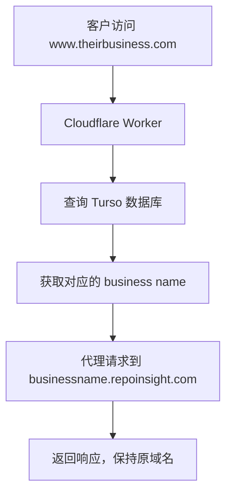

# Custom Domain Proxy Solution

## 概述

允许客户使用自定义域名（如 `www.theirbusiness.com`）访问他们在 RepoInsight 平台上的业务网站，同时保持浏览器 URL 不变。通过 Cloudflare Worker 实现域名代理，将自定义域名映射到对应的 `businessname.repoinsight.com` 子域名。

当前生产方案补充说明（2025-09）：
- 自定义域强制走 Cloudflare Pages 的 Custom Domain 能力以避免代理递归与 1102 资源上限错误；Worker 对非平台域默认 bypass。
- 身份登录采用“会话中继（Relay）”在自定义域内落 Cookie：`auth.repoinsight.com` 回调生成签名令牌，浏览器转到 `https://<custom-domain>/api/auth/relay?t=...` 在本域设置 `user` Cookie。
- 统一登出端点 `/api/auth/logout`：自定义域调用后会级联到平台域清 `.repoinsight.com` Cookie，再回到当前自定义域的安全目标页。

开发模式说明：
- 本地/开发域名（如 lvh.me、localhost）不通过 Worker，直接访问本地 Nuxt/Pages 服务。
- 登出在开发（非 https）模式下不会级联到平台域，避免错误跳转；生产（https）下才会自定义域 → 平台域的级联清理。

## 架构设计

### 数据结构
利用现有的 `businesses` 表字段：
- `name`: 业务名称，作为子域名 (`businessname.repoinsight.com`)
- `domain`: 客户的自定义域名 (`www.theirbusiness.com`)
- `status`: 控制域名是否启用 (`active`/`inactive`)

### 技术栈
- **Cloudflare Worker**: 域名代理和请求转发
- **Turso Database**: 存储域名映射关系
- **DNS验证**: 确保客户正确配置 DNS 记录

## 工作流程



### 详细流程

1. **客户访问自定义域名**: `https://www.theirbusiness.com/page`
2. **Worker 接收请求**: 提取 hostname
3. **数据库查询**:
   ```sql
   SELECT name FROM businesses WHERE domain = 'www.theirbusiness.com' AND status = 'active'
   ```
4. **构建目标URL**: `https://businessname.repoinsight.com/page`
5. **代理请求**: 转发到目标URL，添加必要的头信息
6. **返回响应**: 保持客户域名在浏览器中

## 实现方案

### 1. Cloudflare Worker 配置

#### Worker 代码 (`worker-domain-proxy.js`)
```javascript
import { createClient } from '@libsql/client'

export default {
  async fetch(request, env) {
    const url = new URL(request.url)
    const hostname = url.hostname

    // 连接到 Turso 数据库
    const turso = createClient({
      url: env.TURSO_DB_URL,
      authToken: env.TURSO_DB_TOKEN,
    })

    try {
      // 查询域名映射
      const result = await turso.execute({
        sql: `SELECT name FROM businesses WHERE domain = ? AND status = 'active'`,
        args: [hostname]
      })

      if (result.rows.length === 0) {
        return new Response('Domain not found or inactive', { status: 404 })
      }

      const businessName = result.rows[0].name
      const targetUrl = `https://${businessName}.repoinsight.com${url.pathname}${url.search}`

      // 代理请求
      const modifiedHeaders = new Headers(request.headers)
      modifiedHeaders.set('Host', `${businessName}.repoinsight.com`)
      modifiedHeaders.set('X-Original-Host', hostname)
      modifiedHeaders.set('X-Custom-Domain', hostname)

      return await fetch(new Request(targetUrl, {
        method: request.method,
        headers: modifiedHeaders,
        body: request.method !== 'GET' && request.method !== 'HEAD' ? request.body : undefined
      }))

    } catch (error) {
      console.error('Proxy error:', error)
      return new Response('Internal server error', { status: 500 })
    }
  }
}
```

#### 环境变量配置
```bash
wrangler secret put TURSO_DB_URL
wrangler secret put TURSO_DB_TOKEN
```

#### wrangler.toml
```toml
name = "repoinsight-domain-proxy"
compatibility_date = "2023-10-30"
main = "worker-domain-proxy.js"

[env.production]
vars = { ENVIRONMENT = "production" }
```

### 2. 业务管理界面增强

#### 自定义域名设置
- 在业务创建/编辑页面添加域名字段
- 显示 DNS 配置说明
- 提供域名验证功能

#### DNS 配置说明
客户需要添加 CNAME 记录：
```
CNAME: www.theirbusiness.com → repoinsight-domain-proxy.your-subdomain.workers.dev
```

### 3. API 接口

#### 域名验证 API
```typescript
// /api/businesses/[id]/verify-domain.post.ts
// 验证客户的 DNS 配置是否正确
```

#### DNS 查询工具
```typescript
// server/utils/dnsVerify.ts
// 使用 DNS over HTTPS 验证 CNAME 记录
```

## 部署步骤

### 1. 准备 Cloudflare Worker
```bash
# 安装 wrangler CLI
npm install -g wrangler

# 登录 Cloudflare
wrangler login

# 创建 Worker 项目
mkdir repoinsight-domain-proxy
cd repoinsight-domain-proxy
npm init -y
npm install @libsql/client

# 部署 Worker
wrangler deploy
```

### 2. 配置 Worker 路由
在 Cloudflare Dashboard 中：
- 为每个自定义域名添加 Worker 路由
- 或使用 Cloudflare for SaaS 功能

### 3. 更新应用代码
- 添加域名管理 UI
- 实现域名验证 API
- 测试完整流程

## 客户使用流程

### 1. 设置自定义域名
1. 登录 RepoInsight 业务管理后台
2. 在业务设置中输入自定义域名
3. 系统显示 DNS 配置说明

### 2. 配置 DNS
1. 登录域名注册商或 DNS 服务商
2. 添加 CNAME 记录指向 Worker
3. 等待 DNS 传播（通常几分钟到几小时）

### 3. 验证和启用
1. 在 RepoInsight 后台点击"验证域名"
2. 系统自动检测 DNS 配置
3. 验证通过后域名立即生效

## 性能优化

### 1. 缓存策略
- Worker 中缓存域名映射结果
- 设置合理的 TTL 减少数据库查询

### 2. 错误处理
- 友好的错误页面
- 自动重试机制
- 监控和报警

### 3. 安全考虑
- 验证请求来源
- 防止域名劫持
- SSL/TLS 证书自动管理

## 成本分析

### Cloudflare Workers
- **免费额度**: 100,000 请求/天
- **付费版**: $5/月 起，包含 10M 请求
- **企业版**: 根据使用量定价

### 预估成本
- **小型客户** (1000 PV/天): 免费
- **中型客户** (50000 PV/天): $5/月
- **大型客户** (500000 PV/天): $15-25/月

## 监控和维护

### 1. 监控指标
- 域名解析成功率
- 代理请求延迟
- 错误率统计

### 2. 日志记录
- Worker 执行日志
- 数据库查询日志
- DNS 验证记录

### 3. 故障排查
- 域名解析失败
- SSL 证书问题
- 数据库连接异常

## 扩展功能

### 1. 多域名支持
- 一个业务支持多个自定义域名
- 主域名和备用域名

### 2. 地域优化
- 基于地理位置的路由
- CDN 加速配置

### 3. 高级功能
- 自定义 SSL 证书
- 域名重定向规则
- 访问统计分析

## 安全注意事项

1. **DNS 验证**: 确保只有域名所有者才能添加映射。
2. **访问控制**: 实现适当的权限检查。
3. **Cookie 作用域**: 平台域使用 `Domain=.repoinsight.com`；自定义域 Cookie 仅在该域设置，禁止跨 eTLD 写入。
4. **登出与跳转净化**: `/api/auth/logout` 会净化 `next`，禁止 `/api/auth/logout` 自回路与 `*.pages.dev` 作为目标，防止重定向风暴。
5. **会话中继签名校验**: Relay 使用 HMAC 校验，解析使用原始 URL 防止 `+` 空格化，按 `lastIndexOf('.')` 切割，支持双密钥（`SESSION_TRANSFER_SECRET` 或 OAuth client secret）。

## 总结

通过 Cloudflare Worker + Turso 数据库的方案，RepoInsight 可以为客户提供完全透明的自定义域名服务。客户可以使用自己的域名访问业务网站，同时保持所有功能的完整性和性能的优越性。

该方案具有以下优势：
- ✅ 实现简单，维护成本低
- ✅ 性能优越，全球加速
- ✅ 扩展性强，支持大规模部署
- ✅ 成本可控，适合 SaaS 业务模型