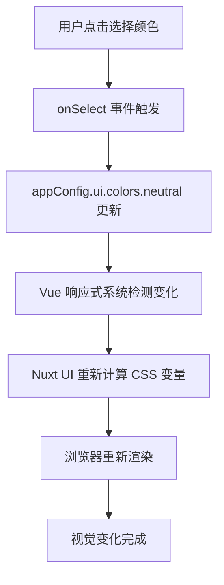

# Nuxt UI 颜色系统分析报告

## 概述

本文档详细分析了 Nuxt UI 框架中 neutral 颜色值的定义位置、动态背景色更新机制，以及用户交互如何触发整个应用的颜色主题变化。

## 1. Neutral 颜色值定义位置

### 1.1 主要定义位置

**文件：`app/components/UserMenu.vue` 第12行**
```typescript
const neutrals = ['slate', 'gray', 'zinc', 'neutral', 'stone']
```

**文件：`app/app.config.ts` 第5行**
```typescript
export default defineAppConfig({
  ui: {
    colors: {
      primary: 'green',
      neutral: 'zinc'  // 当前默认使用 zinc
    }
  }
})
```

### 1.2 颜色特点说明

| 颜色名称 | 特点描述 | 适用场景 |
|---------|---------|---------|
| `slate` | 带有轻微蓝色倾向的灰色，现代清爽 | 现代应用、科技产品 |
| `gray` | 最标准的灰色，平衡中性 | 通用应用、商务系统 |
| `zinc` | 稍微偏暖的灰色调 | 当前项目默认选择 |
| `neutral` | 完全中性的灰色，不偏暖也不偏冷 | 需要完全中性的场景 |
| `stone` | 带有暖色调的灰色，类似石头颜色 | 温暖、友好的应用 |

### 1.3 Tailwind CSS 预定义

这些颜色值都是 Tailwind CSS 中预定义的颜色调色板，每个调色板包含从 50（最浅）到 950（最深）的多个色阶。

## 2. 用户交互触发机制

### 2.1 用户菜单结构

在 `UserMenu.vue` 中，neutral 颜色选择器位于主题菜单下：

```typescript
// UserMenu.vue 第60-79行
{
  label: 'Neutral',
  slot: 'chip',
  chip: appConfig.ui.colors.neutral === 'neutral' ? 'old-neutral' : appConfig.ui.colors.neutral,
  content: {
    align: 'end',
    collisionPadding: 16
  },
  children: neutrals.map(color => ({
    label: color,
    chip: color === 'neutral' ? 'old-neutral' : color,
    slot: 'chip',
    type: 'checkbox',
    checked: appConfig.ui.colors.neutral === color,
    onSelect: (e) => {
      e.preventDefault()
      appConfig.ui.colors.neutral = color  // 关键：直接修改配置
    }
  }))
}
```

### 2.2 交互流程

1. **用户点击** → 选择新的 neutral 颜色选项
2. **事件处理** → `onSelect` 回调函数被触发
3. **配置更新** → `appConfig.ui.colors.neutral = color`
4. **响应式触发** → Vue 检测到配置变化

## 3. 动态背景色更新机制

### 3.1 响应式配置系统

`appConfig` 是一个响应式对象，当 `appConfig.ui.colors.neutral` 被修改时：

- **Vue 响应式系统** 检测到变化
- **Nuxt UI 内部机制** 监听配置变化
- **自动重新计算** 所有相关的 CSS 变量

### 3.2 CSS 变量动态映射

当 neutral 颜色改变时，系统会自动更新颜色映射：

```css
/* 示例：从 zinc 改为 slate 时 */
/* 系统自动更新这些变量 */
--color-gray-50: var(--color-slate-50);
--color-gray-100: var(--color-slate-100);
--color-gray-200: var(--color-slate-200);
/* ... 继续到 gray-950 */
```

### 3.3 语义化颜色变量

系统还会更新语义化的颜色变量：

```css
/* 浅色模式 */
:root {
  --color-background: var(--color-gray-50);
  --color-foreground: var(--color-gray-900);
  --color-border: var(--color-gray-200);
  --color-muted: var(--color-gray-500);
}

/* 深色模式 */
.dark {
  --color-background: var(--color-gray-950);
  --color-foreground: var(--color-gray-100);
  --color-border: var(--color-gray-800);
  --color-muted: var(--color-gray-400);
}
```

## 4. 全局样式应用

### 4.1 Nuxt UI 组件样式

所有 Nuxt UI 组件都使用这些 CSS 变量：

```css
/* UApp 组件 */
.u-app {
  background-color: var(--color-background);
  color: var(--color-foreground);
}

/* UCard 组件 */
.u-card {
  background-color: var(--color-background);
  border-color: var(--color-border);
}

/* UButton 组件 */
.u-button {
  background-color: var(--color-background);
  color: var(--color-foreground);
  border-color: var(--color-border);
}
```

### 4.2 实时更新流程

完整的更新流程：



## 5. 深色模式适配

### 5.1 主题切换机制

项目使用 `useColorMode()` 来管理主题：

```typescript
// app.vue 第2-4行
const colorMode = useColorMode()
const color = computed(() => colorMode.value === 'dark' ? '#1b1718' : 'white')
```

### 5.2 颜色适配策略

系统会根据当前主题模式自动选择对应的颜色：

- **浅色模式**：使用较浅的背景色（如 gray-50）和较深的文本色（如 gray-900）
- **深色模式**：使用较深的背景色（如 gray-950）和较浅的文本色（如 gray-100）

## 6. 设置页面基准背景色的方法

### 6.1 通过 app.config.ts 配置（推荐）

```typescript
// app.config.ts
export default defineAppConfig({
  ui: {
    colors: {
      primary: 'green',
      neutral: 'zinc'
    },
    variables: {
      light: {
        background: '255 255 255', // RGB 值
        foreground: 'var(--color-zinc-900)'
      },
      dark: {
        background: 'var(--color-zinc-950)',
        foreground: 'var(--color-zinc-100)'
      }
    }
  }
})
```

### 6.2 通过 CSS 变量在 main.css 中设置

```css
/* app/assets/css/main.css */
@theme static {
  --color-background: 255 255 255; /* 浅色模式 */
  --color-foreground: 24 24 27;
  
  @media (prefers-color-scheme: dark) {
    --color-background: 9 9 11; /* 深色模式 */
    --color-foreground: 244 244 245;
  }
}

body {
  @apply antialiased font-sans;
  background-color: rgb(var(--color-background));
  color: rgb(var(--color-foreground));
}
```

### 6.3 通过 UApp 组件的 ui 属性

```vue
<template>
  <UApp :ui="{ background: 'bg-white dark:bg-zinc-950' }">
    <NuxtLoadingIndicator />
    <NuxtLayout>
      <NuxtPage />
    </NuxtLayout>
  </UApp>
</template>
```

## 7. 关键优势

### 7.1 实时更新
- 无需页面刷新
- 变化是即时的
- 用户体验流畅

### 7.2 全局一致性
- 所有组件自动使用新颜色
- 保持视觉统一性
- 减少手动配置

### 7.3 深色模式兼容
- 自动适配浅色/深色主题
- 智能颜色选择
- 无缝切换体验

### 7.4 性能优化
- 只更新必要的 CSS 变量
- 不重新加载页面
- 高效的渲染机制

## 8. 技术实现细节

### 8.1 依赖关系

- **Vue 3 响应式系统**：检测配置变化
- **Nuxt UI 4.0.0-alpha.1**：提供颜色管理机制
- **Tailwind CSS**：提供预定义颜色调色板
- **CSS 变量**：实现动态颜色更新

### 8.2 核心文件

| 文件 | 作用 | 关键代码 |
|------|------|----------|
| `app/components/UserMenu.vue` | 用户交互界面 | `appConfig.ui.colors.neutral = color` |
| `app/app.config.ts` | 全局配置 | `neutral: 'zinc'` |
| `app/assets/css/main.css` | 样式定义 | CSS 变量定义 |
| `app/app.vue` | 应用根组件 | `UApp` 组件 |

## 9. 总结

Nuxt UI 的颜色系统通过以下机制实现了动态背景色更新：

1. **响应式配置**：使用 Vue 的响应式系统管理颜色配置
2. **CSS 变量映射**：将配置的颜色映射到 CSS 变量
3. **全局样式应用**：所有组件使用统一的颜色变量
4. **实时更新**：配置变化立即反映到视觉界面

这种设计使得用户可以轻松切换不同的颜色主题，同时保持整个应用的视觉一致性和良好的用户体验。

---

*生成时间：2024年12月*  
*分析基于：Nuxt UI v4.0.0-alpha.1*
