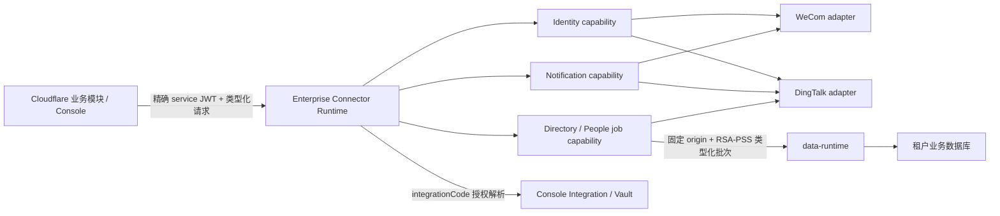

# Design: 企业连接运行时（Enterprise Connector Runtime）

Generated by office-hours on 2026-07-14  
Status: APPROVED（2026-07-14，选择方案 B）  
Mode: Startup

## Problem Statement

汇智云主体部署在 Cloudflare。企业微信、钉钉及部分企业内部系统的服务端 API 需要中国大陆网络可达性、稳定出口 IP、IP 白名单或客户内网访问能力。没有客户侧连接组件时，租户只能自行建设中转服务，导致登录、消息、人事和目录能力无法成为汇智云可交付的标准产品。

本项目的目标不是提供通用 HTTP 代理，而是向付费租户提供一个由企业 IT 管理员通过单条命令安装、由汇智云 Console 管理配置与权限、从客户固定出口执行预定义企业连接能力的运行时。

产品名称暂定 **企业连接运行时**，技术包名建议使用 `hzy-connector-runtime`。

## Demand Evidence

- 当前 wiztek 已经遇到实际阻断：平台迁移到 Cloudflare 后，如果不在国内服务器自建中转，企业微信服务端对接无法正常实现。
- 独立部署时期曾支持企业微信登录；迁移到 Cloudflare 后因出口 IP 问题放弃该能力。
- 企业微信消息已经通过 Notification Runtime 恢复，并验证了客户侧固定出口方案的可行性。
- 后续 People 模块马上需要接入钉钉智能人事；钉钉网页应用服务端、免登和服务端 API 同样涉及服务端出口 IP 配置。
- 当前最明显的运维痛点不是 HTTP 转发本身，而是企业应用凭证散落、轮换困难、权限边界不清和中转服务需要租户自行维护。

## Status Quo

当前体系已经具备以下可复用基础：

- `notification-runtime`：固定出口、JWT 校验、Console token introspection、Integration/Vault 读取、企业微信通知 provider、SQLite/MySQL durable ledger、systemd 安装及自动升级。
- `data-runtime`：客户业务数据库的唯一受控访问层，已有 Directory Connector loopback 命令和各业务 adapter。
- Console：Integration、Vault、service client/grant、租户安装命令、配置检测和审计。
- Tenant Gateway/Foundation：可信 tenant/deployment/app 上下文、服务令牌签发和业务模块统一调用入口。

当前缺口是这些能力仍以“通知”命名和建模，身份交换、钉钉、人事数据同步没有统一的客户侧连接边界。

## Target User & Narrowest Wedge

目标安装和维护角色是企业 IT 管理员；汇智云实施人员可以协助，但产品必须支持租户自助完成安装、检测、升级和故障定位。

最小可售版本：

1. 企业微信登录服务端交换。
2. 企业微信消息发送（兼容现有能力）。
3. 钉钉登录/免登服务端交换。
4. 钉钉消息发送。
5. People 所需的钉钉组织与智能人事明确接口集。
6. Console 统一凭证、授权、检测、审计和一键安装。

暂不支持租户自定义 URL、自定义 HTTP 请求、自定义脚本或上传插件。

## Premises

1. Cloudflare 继续负责页面、会话、业务编排、OAuth state/nonce 和公开回调；Connector Runtime 只执行必须从固定出口发起的服务端请求。
2. Runtime 只暴露预定义且带版本的能力契约，不接受任意 URL、方法、请求头或透传响应。
3. 企业微信、钉钉及后续供应商密钥由 Console Vault 统一管理；Runtime 只能按获授权的 `integrationCode` 解析当前绑定凭证。
4. Console、People 等业务模块拥有业务规则和数据；Connector Runtime 不直连业务数据库。
5. 大批量目录/人事同步由客户侧异步执行，结果经受控 data-runtime 类型化 API 落库；分机部署必须 HTTPS，同机部署才允许 loopback HTTP；Cloudflare 只提交任务和查询结果。
6. 单租户默认安装一个 Connector Runtime 实例；SQLite 只保存操作状态、幂等与审计元数据，不保存供应商密钥、访问令牌或完整人事 PII。

## Approaches Considered

### Approach A：直接扩展 Notification Runtime

- Effort: M
- Risk: Medium
- Pros: 发布最快；现有安装、升级、认证和 ledger 可直接复用。
- Cons: 名称和领域模型失真；通知、身份和人事逻辑会逐渐耦合；后续迁移成本更高。
- Reuses: 现有 Notification Runtime 全部代码。

### Approach B：演进为企业连接运行时（选择）

- Effort: L
- Risk: Medium
- Pros: 一个安装组件；能力和供应商边界清晰；适合持续增加受控连接器；可保留通知兼容 API。
- Cons: 需要先提取公共内核并设计迁移；授权模型和异步任务模型必须一次定准。
- Reuses: Notification Runtime、Directory Connector enrollment、Console Integration/Vault、data-runtime 类型化签名 adapter。

### Approach C：多个专用 Runtime 组成安装套件

- Effort: XL
- Risk: Medium/High
- Pros: 进程、权限和故障隔离最强。
- Cons: 服务、端口、凭证和升级数量成倍增加；企业 IT 管理员运维负担大；内部验证阶段过重。
- Reuses: 各现有 Runtime 的独立部署模式。

## Recommended Architecture

采用 Approach B：一个 Runtime、多个内建 provider、多个类型化 capability。

### 公共内核

- Console JWT 验签、introspection、tenant/deployment/source-app 精确绑定。
- Provider/capability 注册表及 `/runtime/capabilities`。
- Console Integration/Vault 客户端。
- 编译期供应商域名和路径策略；provider 配置不能把请求目标改为任意主机。
- 统一超时、重试、熔断、限流、脱敏日志和 trace ID。
- SQLite 操作 ledger：幂等、lease/fencing、任务进度、最小错误证据和人工对账。
- systemd 安装、健康检查、自动升级和回滚前检查。

### Provider adapters

- `wecom`：身份交换、用户身份查询、应用消息。
- `dingtalk`：身份/免登交换、应用消息、通讯录和 People 明确所需的人事 API。
- 后续 provider 必须在代码中注册，不支持租户动态上传执行代码。

### Capability contracts

建议首批稳定接口：

- `POST /v1/identity/exchange`
- `POST /v1/notifications/send`（保持现有兼容）
- `POST /v1/people-sync-jobs`
- `GET /v1/people-sync-jobs/{jobId}`
- `POST /v1/people-sync-jobs/{jobId}/cancel`
- `POST /v1/people-sync-jobs/{jobId}/retry`
- `GET /runtime/health`
- `GET /runtime/capabilities`

请求只包含业务所需的强类型字段和 `integrationCode`。Runtime 返回汇智云规范化身份或任务摘要，不返回供应商 access token、refresh token、原始响应、凭证引用或任意响应头。

### Identity flow

1. 浏览器在 Cloudflare 发起登录并保存一次性 state/nonce。
2. 供应商回调到 Cloudflare，Cloudflare 校验 state 并取得短期 authorization code。
3. Console/Foundation 用精确 `connector-runtime:identity:exchange` 服务令牌调用 Runtime。
4. Runtime 从固定出口执行 code-to-token 和用户身份查询。
5. Runtime 立即丢弃供应商令牌，仅返回规范化 subject 标识和最小可验证资料。
6. Console 根据租户 Directory 映射建立汇智云会话。

authorization code、供应商 token 和用户敏感字段不得写入日志或 SQLite。

### Notification flow

保留现有 `notification-runtime` 的 durable ledger 语义和 `/v1/notifications/send` 请求兼容。新增 provider 只改变适配器，不改变 Foundation 的“先写站内通知、再尝试外部投递”事实模型。

### People / Directory flow

人事同步必须是异步 job：

1. People/Console 创建带明确数据范围、watermark 和 idempotency key 的同步任务。
2. Connector Runtime 从钉钉分页读取并规范化为版本化批次。
3. 批次通过安装时固定的 data-runtime origin 调用 People adapter；分机部署用 HTTPS，同机可用 loopback HTTP；Connector 不持有数据库账号。
4. data-runtime 在租户数据库中进行校验、幂等写入和业务审计。
5. Connector 仅保存 job 状态、页游标哈希、计数和脱敏错误；Cloudflare 查询最终结果。

这样避免长时间同步占用 Cloudflare CPU，也不形成第二套业务后端。

## Authorization Model

授权至少同时约束：

- tenant
- deployment
- source app
- provider
- capability/action
- integrationCode
- 可选数据范围或同步对象类型

示例 scope：

- `connector-runtime:identity:exchange`
- `connector-runtime:notifications:send`
- `connector-runtime:people:sync`
- `connector-runtime:jobs:view`
- `connector-runtime:jobs:cancel`

Console 对 Integration/Vault 的反向授权继续使用 `scope_json.integrationCodes` 精确白名单。身份、消息和人事能力不得互相隐含授权。

## Credential and Enrollment Model

目标方案复用 Directory Connector 的单次 enrollment 思路：

- Console 生成短期、单次使用、绑定 tenant/deployment 的安装令牌。
- Runtime 在客户服务器本地生成非对称工作负载密钥；私钥永不离开服务器。
- Console 只保存公钥与设备登记状态，后续使用签名 client assertion 或等价机制签发短期 JWT。
- 供应商 CorpSecret/AppSecret 始终位于 Console Vault；Runtime 仅在内存中短期使用解析值和供应商 access token。
- 轮换供应商凭证不需要重新安装 Runtime；吊销设备不需要修改供应商凭证。

兼容期可以读取现有 notification-runtime service credential，但新租户不应继续以复制长期 client secret 作为最终产品方案。

## Deployment and Migration

### 新租户

- Console “企业连接运行时”页面生成一条安装命令。
- 安装一个 `hzy-connector-runtime.service` 和自动升级 timer。
- 默认 SQLite 路径建议为 `/opt/hzy/connector-runtime/data/operations.db`。
- Runtime 使用独立 Linux 用户；到 data-runtime 只允许安装时固定的 HTTPS origin（同机例外为 loopback HTTP）、签名请求和精确内部路径，不跟随重定向。

### 现有 notification-runtime 租户

- 不通过普通自动升级静默重命名服务。
- Console 提供显式“迁移到企业连接运行时”命令。
- 迁移程序检测现有配置和 notification ledger，先备份并验证新 Runtime，再切换服务。
- 新 Runtime 保留 `/v1/notifications/send` 和现有 idempotency 数据；健康验证失败时恢复旧服务。
- 确认稳定一个发布周期后再停用 `hzy-notification-runtime` timer 和服务。

## Delivery Phases

实施状态（2026-07-15）：Phase 0–5 已完成离线实现和自动化验收；wiztek 已完成真实租户 migration/seed、Cloudflare/R2 发布、Notification Runtime 显式迁移、企业微信与钉钉通知、企业微信登录、设备吊销/轮换、SLO 与钉钉 People 真实同步验收。钉钉 People 权限开通后已读取 10 个部门、79 名用户，经分机 data-runtime 签名批次写入 77 人并按目录身份前置规则跳过 2 人。钉钉登录已完成生产启用与协议 start 验收，真实 callback/identity binding 和停用账号失败关闭仍待人工登录补证。

### Phase 0：契约与迁移基线

状态：已完成。

- 固化 provider/capability 注册表、错误模型、scope、job/ledger 和 provider endpoint policy。
- 补齐现有 Notification Runtime 的黑盒兼容测试。
- 定义 notification → connector 显式迁移与回滚契约。

### Phase 1：Connector Core + 企业微信通知兼容

状态：wiztek 真实环境发布、迁移、通知幂等与回滚边界验收已完成。

- 提取认证、Console client、Vault、ledger、安装升级为公共内核。
- 发布 `hzy-connector-runtime`，保持现有企业微信发送 API 和 SQLite 投递事实。
- Console 增加企业连接运行时管理页和单次 enrollment。

### Phase 2：企业微信身份能力

状态：wiztek 真实企业微信登录已完成；账号禁用失败关闭仍待补证。

- 实现企业微信 authorization code 交换和规范化身份返回。
- Console/Foundation 恢复企业微信登录入口。
- 完成 state/nonce、账号绑定、禁用用户和错误回退验收。

已实现 `identity.wecom.exchange@v1` 类型化能力、固定 provider endpoint、最小 subject
返回、Console 数据库单次 state、浏览器/tenant/deployment 绑定、Connector 显式启用、
Directory identity 绑定及禁用失败关闭。Platform 不再投影或编辑 CorpSecret；凭证事实源为
Console `wecom.default` Vault。真实企业微信 callback 与身份绑定已在 wiztek 完成；禁用用户和失败回退仍需发布窗口补证。

### Phase 3：钉钉身份与消息

状态：wiztek 已完成真实通知、固定出口、登录启用和协议 start 验收；真实用户 callback、identity binding 与禁用用户失败关闭待补证。

- 增加 `dingtalk` adapter、Integration/Vault 配置检测。
- 实现钉钉登录/免登交换及消息发送。
- 验证固定出口 IP、权限申请、配额和错误码映射。

### Phase 4：钉钉 People 同步

状态：wiztek 真实同步已完成。钉钉应用已开通 `qyapi_get_department_list` 与 `qyapi_get_department_member`；生产任务读取 10 个部门、79 名用户，经 3 个签名批次写入 77 人并安全跳过 2 人。Connector `0.4.15` 修复原始 data-runtime 回执被静默解析为 `0/0` 的问题，缺少计数字段现在失败关闭；失败重试链、SQLite 任务、data-runtime 批次回执与 People 实际行数已交叉核对。

- 明确 People 首批所需的组织、人员和智能人事 API 白名单。
- 建立异步 sync job、watermark、批次规范和 data-runtime People 签名 API。
- Console/People 提供手动同步、进度、差异摘要和失败重试；默认不做无条件周期全量同步。

首版由 Console 管理页显式提交异步任务；Connector SQLite 保存 job/watermark，任务在客户侧
完成分页拉取。批次通过 RSA-PSS 签名并按安装时固定 origin 进入 data-runtime，再由 Directory identity
绑定解析为 canonical uid 后写入 People。Connector 不持有数据库账号，Cloudflare 不执行
长轮询或供应商分页。为避免供应商临时部门 ID 污染业务事实，People 的部门编码继续来自
Console Directory；未先完成钉钉目录同步/身份绑定的 subject 会计入 skipped。运行中任务可以用
独立 `jobs:cancel` scope 取消；已写入的幂等批次不回滚。失败任务重试产生带来源链的新 job，沿用
原 watermark/范围并对同一失败来源保持提交幂等，不把旧失败记录伪装成一次新执行。

### Phase 5：产品化与后续连接器

状态：wiztek 内部验证环境的 SLO、吊销、轮换和自动升级验收已完成；付费租户 SLA 与正式计量仍未启用。

- 设备吊销/轮换、升级策略、租户诊断包、SLO 和计量。
- 根据真实付费租户需求评估飞书、短信、邮件网关、ERP 或客户内网 API。
- 新能力仍必须通过代码审核后的类型化 adapter 上线。

已实现 60 秒设备心跳、3 分钟 stale 展示、service credential/grant/公钥信任原子吊销、
单次 enrollment 轮换、精确 scope 脱敏诊断和 SQLite 聚合 usage。内部目标与发布顺序见
`connector-runtime/docs/Enterprise-Connector-Runtime-SLO.md`；当前聚合数据仅用于容量和故障分析，不直接计费。

## Success Criteria

- 企业 IT 管理员可在 10 分钟内通过一条命令完成安装，并在 Console 看到健康、版本、出口和能力检测结果。
- 企业微信登录、企业微信消息、钉钉登录和钉钉消息无需租户自建中转服务。
- People 钉钉同步不长时间占用 Cloudflare Worker CPU，且 Connector 不持有数据库账号。
- 供应商长期密钥不出现在安装命令、Runtime 环境变量、日志、SQLite 或业务数据库。
- 任意 URL、任意方法、任意请求头和未注册 provider 请求在进入网络层前失败关闭。
- 现有 notification-runtime 租户迁移后，旧通知幂等事实和发送接口保持兼容。
- 每次调用可按 tenant/deployment/source app/provider/capability/integrationCode 追踪和审计。

## Dependencies

- Console service-token issuer 支持 Connector Runtime 的精确 scope 和最终非对称 workload identity。
- Console Integration/Vault 增加钉钉配置模型及精确 integration grant。
- Foundation 增加 identity、notification 和 sync job 类型化客户端。
- data-runtime People adapter 增加本机签名批次写入和幂等 watermark。
- 企业微信与钉钉测试组织、应用权限、固定出口 IP 白名单及真实测试账号。

## Open Questions

- 企业微信回调继续由 Cloudflare 验签，还是后续采用 Connector 参与的签名验证流程。
- 钉钉事件优先使用 Stream 模式还是 HTTP 回调；Phase 4 的首版可以先采用显式拉取同步。
- 企业微信与钉钉账号如何与 Console Directory subject 建立唯一、可撤销的绑定。
- People 首批同步字段、字段归属、删除/离职语义和冲突解决规则。
- 付费版本按租户、连接器数量、调用量还是同步员工数计量。

## The Assignment

在进入 Phase 0 实施前，用 wiztek 钉钉测试组织创建一个企业内部应用，配置当前固定出口 IP，申请 People 第一批预计需要的通讯录/智能人事权限，并形成一份“实际可调用 API、所需权限、返回字段、限流与错误码”清单。该清单将决定 Phase 4 的真实契约，避免先造一个泛化钉钉代理再寻找用途。

## What I Noticed

这次方向成立的关键不是“以后可能还会接很多 API”，而是已经出现了两个明确事实：Cloudflare 迁移直接导致企业微信登录能力消失，而 People 很快需要钉钉人事数据。你还明确指出最麻烦的是凭证管理，并同意 Connector 不直连业务数据库。这些约束把产品从危险的通用代理收敛成了一个可销售、可审计、可逐步扩展的企业连接层。
