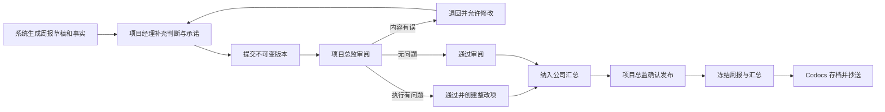
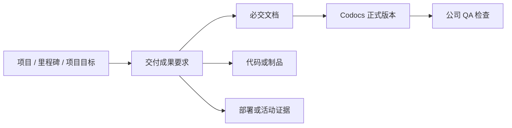
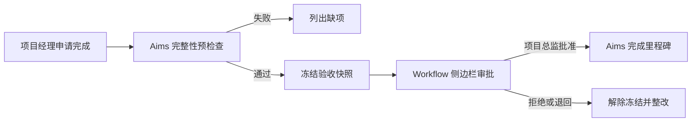

# 方案评审：Aims 项目管理首期落地

Generated by plan-ceo-review on 2026-07-25  
Status: APPROVED  
Scope: 首个 30 天项目管理试运行，以及后续 90 天推进边界

## 1. 结论

公司下一步应先建立可执行、可追责、可追溯的项目管理闭环，再启动 Altoc 销售与合同回款管理，最后由 People 基于稳定事实开展绩效管理。

首期以 Aims 为主，重点完成：

1. 项目周报：项目经理填报，项目总监审阅并形成全公司周报汇总。
2. 工时管理：项目成员填报、项目经理审核；项目经理本人工时随公司周报汇总发布完成审核。
3. 项目文档：Codocs 保存文档和版本，Aims 管理项目归属、交付要求和 QA 结论。
4. 关键节点：项目经理申请完成里程碑，最终完成必须经过 Workflow，由项目总监批准。
5. 整改跟踪：周报审阅发现的执行问题转成 Aims 整改事项，不通过修改历史周报掩盖问题。
6. 管理工作台：项目总监、项目经理、QA 和系统管理员分别获得与其责任一致的工作区。

首期只沉淀绩效事实，不计算员工绩效分数。

## 2. 模块职责

### Aims

Aims 是项目执行事实来源，负责：

- 项目、项目成员、项目经理及代理关系。
- 项目周报、审阅、退回、版本和公司汇总。
- 工时填报与审核状态。
- 里程碑、任务、交付成果、整改事项和完成快照。
- QA 检查记录及项目总监豁免。
- 项目管理工作台和绩效事实接口。

### Codocs

Codocs 是文档内容与版本来源，负责：

- 个人和部门工作报告。
- 项目文档的内容编辑、版本历史和只读发布版本。
- 公司项目周报汇总的 Markdown 存档与查阅。
- 汇总文档的只读抄送关系。

Codocs 不修改 Aims 的周报、汇总或项目状态。

### Workflow

首期只有里程碑最终完成接入 Workflow：

- 项目经理从 Aims 发起完成申请。
- Aims 冻结验收快照后启动 Workflow。
- 当前 `project_director` 审批。
- Workflow 通过可信终态回调驱动 Aims 完成里程碑。

周报审阅、工时审核、QA 检查及周报汇总不接入 Workflow。

### People

People 主动采集 Aims 的版本化绩效事实，不直接访问 Aims 数据库，也不回写 Aims。

### Altoc 与 Finance

第二阶段由 Altoc 管理客户、销售机会、合同和回款计划；Finance 继续作为发票、收款和核销事实来源。首个 30 天不展开这些模块的业务改造。

## 3. 公司级唯一角色

公司只设置：

- 一名项目总监 `project_director`。
- 一名 QA `qa`。

两者由系统管理员在企业角色中指定，不在每个项目重复配置。

规则：

- 任一时刻每个角色只能有一名有效人员。
- 配置为 0 人或多人时，相关业务操作明确失败，不猜测责任人。
- 不设计代理项目总监或代理 QA；人员变化时由系统管理员重新指定。
- 未完成任务自动转给新任人员。
- 已完成记录保留原审阅人、QA 或发布人快照。
- 系统管理员只有角色配置权，不因管理员身份获得审阅或发布等业务权限。

## 4. 项目经理及代理

- 创建项目时必须指定项目经理，否则不能创建。
- 项目总监可以从现有项目成员中指定代理项目经理。
- 代理关系必须有起止时间。
- 同一时段只能有一名有效项目经理责任人。
- 代理生效期间由代理人填报周报和审核成员工时。
- 代理人的本人工时仍随公司周报汇总由项目总监确认。
- 任命、变更、到期和历史操作全部留痕。

## 5. 项目周报流程

### 填报责任

- 项目周报只能由当前项目经理或有效代理项目经理填报。
- 项目总监不能代填。
- 普通项目成员不能填报项目周报。

### 周报内容

系统自动汇集且不可直接篡改：

- 里程碑进展。
- 任务完成和逾期情况。
- 已审核工时。
- 正式项目文档变化。
- QA 检查结果。
- 未关闭整改事项。

项目经理负责填写：

- 项目整体状态判断。
- 偏差及原因。
- 主要风险。
- 下周承诺。
- 需协调事项。

系统根据延期、风险、QA 和里程碑给出红黄绿状态建议。项目经理可以调整，但必须说明理由，项目总监可以看到差异。

### 审阅动作

- `通过审阅`
- `退回修改`
- `通过并创建整改项`

只有周报内容质量问题才退回。项目执行问题应保留真实表述并建立整改事项。

### 版本与冻结

- 草稿可以更新。
- 每次提交或重新提交产生不可变版本。
- 退回后允许项目经理修改并重新提交。
- 公司汇总发布后，纳入的项目周报版本全部冻结。
- 发布后发现错误时，发布更正版本，不能重新开放原版本。

## 6. 全公司周报汇总

- 每个自然周全公司只形成一份项目周报汇总。
- 汇总覆盖当周所有应报项目。
- 缺报和迟交不阻塞汇总发布，但必须在汇总中明确列出。
- 每份纳入汇总的周报必须有项目总监独立审阅记录。
- 可以批量提醒，不能批量审阅通过。

系统自动生成：

- 项目状态总表。
- 关键里程碑。
- 重大风险。
- 整改事项。
- 缺报和迟交。
- 工时及 QA 异常。

项目总监可以编辑：

- 公司总体判断。
- 跨项目问题。
- 资源协调建议。
- 管理要求。

项目总监不能直接改写已经审阅通过的项目事实。发现错误时必须退回对应项目周报。

### Markdown 存档

- Aims 保存结构化汇总、纳入版本和不可变 Markdown 快照。
- Codocs 保存和展示 Markdown 发布版本。
- 发布版本只读。
- 更正时从最新内容生成新修订稿并重新发布。
- 默认显示最新版本，同时保留全部历史版本、差异和更正原因。

### 抄送

- 汇总不默认全公司公开，也不自动开放给全部项目经理。
- 项目总监选择抄送个人或部门。
- “继承上次抄送”只预填候选名单。
- 发布前必须重新确认最终接收人。
- 自动剔除停用或失效对象。
- 每次发布保存实际接收人快照。
- 被抄送人只获得 Codocs 发布版本的只读权限和链接。

## 7. 迟交和发布失败

### 迟交

- 汇总发布时冻结当时纳入的周报版本。
- 未提交项目列为缺报。
- 后续补交自动标记为迟交并关联原所属周。
- 补交不能自动改变已发布汇总。
- 项目总监决定是否发布该周的更正版本。
- 未更正时，迟交事实仍进入管理记录。

### Codocs 存档失败

- 项目总监点击发布后，Aims 立即冻结汇总和来源版本。
- 汇总进入 `存档中` 或 `发布失败待重试` 状态。
- Codocs 调用使用稳定业务编号幂等重试。
- Codocs 成功后才进入 `已发布`。
- 通知失败不影响发布结果，由后台重试。
- 项目总监可重试，或在 Codocs 尚未成功时取消发布并退回审阅。

## 8. 应报项目口径

每周保存应报项目快照：

- 周期开始时纳入所有执行中项目。
- 周期内新启动项目自动加入。
- 周期内完成或暂停的项目仍需提交本周最后一份周报。
- 提交截止后启动的项目从下一周期开始填报。
- 截止时冻结应报项目、项目经理和代理关系快照。
- 后续状态或人员变化不改写历史责任记录。

周报周期和截止时间由系统管理员配置为一套全公司规则，首期不支持按部门或项目单独配置。

## 9. 工时责任链

- 项目成员填写自己的项目工时。
- 项目经理审核本项目成员工时。
- 项目经理不能自审本人工时。
- 项目经理本人工时随项目周报一起提交和冻结。
- 项目总监退回周报时，可以要求同时修改相关工时。
- 公司周报汇总发布后，纳入周报中的项目经理工时自动转为已审核。
- 迟交周报中的项目经理工时保持待确认，只有纳入更正汇总后才完成审核。
- 后续绩效事实只使用已审核工时。

## 10. 项目文档、交付成果与 QA

现有模型继续保持三层关系：

- 项目交付成果是业务上必须产出的结果。
- 必交文档清单不是独立实体，而是 `deliverable_type=document` 且 `required=true` 的交付物。
- 项目文档库保存全部过程文档和正式文档，并非所有项目文档都是交付成果。
- 文档型交付物必须绑定 Codocs 的具体版本及内容哈希，不能只绑定文档 UUID。
- 非文档交付物绑定仓库 Commit、制品、环境地址或其他证据。

### 唯一 QA

- 全公司唯一 QA 负责所有项目必交文档检查。
- QA 审核的是交付物提交及其确定文档版本，不审核整个文档库。
- QA 只能通过或退回，不能直接修改作者文档。
- 退回后作者提交新版本并重新检查。
- QA 自己提交必交文档时，由项目经理确认完整性，项目总监代替 QA 进行质量检查，并记录冲突原因。
- 项目总监可以批准带原因的豁免。

### QA 历史

QA 检查使用独立、追加式历史记录：

- 保存文档版本、内容哈希、提交人和检查人。
- 保存检查清单及逐项结果快照。
- 保存通过、退回、复检和豁免记录。
- `deliverables.status` 只是最新状态投影。

## 11. 里程碑完成审批

预检查至少包括：

- 必交交付物状态。
- 必交文档及具体 Codocs 版本。
- QA 检查或项目总监豁免。
- 关键任务状态。
- 实际完成时间与偏差原因。

实现规则：

- 复用并扩展现有 `approval_records`。
- 每次申请创建一条新记录，拒绝后重新申请不复用旧记录。
- 保存申请版本、验收快照、快照哈希和幂等业务编号。
- `workflow_instance_id` 唯一。
- 同一里程碑同一时刻只能有一条有效待审批申请。
- 申请期间里程碑及验收对象冻结；修改前必须撤回或退回。
- 未完成 Workflow 任务随当前 `project_director` 动态转移。
- Workflow 回调经过企业、部署、实例、业务申请和快照校验，并且幂等。

## 12. 权限与可见范围

- 草稿及退回修改过程仅项目经理、有效代理和项目总监可见。
- 汇总发布后，当前项目成员可以只读查看本项目最终周报。
- 普通项目成员不能查看审阅意见、修改历史或全公司汇总。
- 全公司汇总仅项目总监和明确抄送对象可见。
- QA 可以查看全部项目的待检交付物及验收所需上下文。
- 系统管理员不具有业务审阅、QA 或发布权限。
- 所有角色变化、退回、修改授权、审阅、发布、QA 和豁免均保存审计记录。

## 13. 数据模型建议

在现有表基础上补充：

- 周报周期和公司级时间配置。
- 每周应报项目快照。
- 项目周报逻辑主记录。
- 不可变项目周报版本。
- 项目周报审阅记录。
- 公司周报汇总主记录。
- 不可变汇总发布版本。
- 汇总版本与项目周报版本关系。
- 汇总抄送人快照。
- QA 检查记录及检查项快照。
- 代理项目经理任期记录。
- 跨模块发布任务、重试和回执。

现有 `project_weekly_reports` 可保留为逻辑主记录或当前投影，内容历史迁移到版本表。现有已提交数据迁移为版本 1，不破坏历史。

所有进入审阅、发布、QA 或审批历史的版本禁止物理删除。

## 14. 跨模块契约

### Aims → Codocs

- Aims 主导汇总业务状态。
- Codocs 只负责文档创建、修订、版本和只读查阅。
- 使用“公司 + 周期 + 汇总版本”作为稳定幂等业务编号。
- 使用 Console 签发的短期服务令牌。
- 不允许跨模块直接写数据库。

### Aims ↔ Workflow

- Aims 先创建冻结申请快照，再发起 Workflow。
- Workflow 只保存审批任务和意见。
- Aims 只接受可信终态回调。
- 重复回调不重复完成里程碑或发送通知。

### People → Aims

- People 主动读取版本化事实。
- Aims 不主动写入 People。
- People 保存采集版本和来源链接。
- 开放中的绩效周期可以刷新并重新确认。
- 已关闭绩效周期不因 Aims 更正自动变化，由 HR 决定重开或转下期调整。

## 15. 管理工作台

### 项目成员

- 我的任务。
- 工时待填。
- 需补充文档。

### 项目经理

- 本周项目周报。
- 待审核成员工时。
- 临近里程碑。
- 缺失交付物。
- 整改事项。

### 公司 QA

- 全部项目待检文档。
- 复检项。
- 逾期检查。
- 文档与检查清单并排查看。

### 项目总监

- 应报、已报、待审、退回、迟交和缺报统计。
- 尚未随汇总确认的项目经理工时。
- QA、里程碑和整改异常。
- 公司汇总生成、预览、发布和更正。
- 现有侧边栏 Workflow 审批。

### 系统管理员

- 唯一项目总监和 QA 配置。
- Codocs、Workflow、通知和定时任务技术异常。
- 不显示业务审批入口。

## 16. 绩效事实

首期只记录并提供：

- 周报按时提交率、迟交和缺报。
- 因内容质量退回次数。
- 整改事项按时关闭率。
- 工时按时填报与审核情况。
- 必交文档首次 QA 通过率和整改次数。
- 里程碑按期完成率和延期天数。
- 项目总监审阅和汇总是否按期完成。

每条事实必须能回到原始周报、工时、文档、QA 或里程碑记录。首期不生成排名，不使用默认分数，不自动计算绩效。

## 17. 可观测性与异常分工

项目总监关注业务异常：

- 缺报、迟交、待审和退回。
- 整改逾期。
- QA 退回。
- 里程碑延期。

系统管理员关注技术异常：

- Codocs 存档连续失败。
- Workflow 回调失败。
- 通知投递失败。
- 定时任务未运行。

跨模块操作保存业务编号、请求编号、重试次数和最终结果。技术恢复后自动通知项目总监继续处理。

## 18. 性能与基础设施

首期采用：

- 提交时生成不可变快照。
- 工作台使用周期统计投影。
- Markdown 汇总后台生成。
- 数据库任务表负责 Codocs、通知和事实刷新重试。
- 必要的唯一约束和状态查询索引。

首期不新增：

- 消息中间件。
- 数据仓库。
- 实时流式计算。
- 复杂经营 BI。

## 19. 强制验收测试

至少覆盖：

1. 非项目经理不能创建或提交项目周报。
2. 项目总监不能代填项目周报。
3. 退回后只有当前项目经理或有效代理可以修改。
4. 汇总发布后只能通过更正版本修改。
5. 迟交不能自动改变已发布汇总。
6. 普通成员只能查看发布后的本项目周报。
7. 系统管理员不能执行项目总监业务操作。
8. 普通成员工时由项目经理审核。
9. 项目经理本人工时不能绕过公司周报汇总直接确认。
10. 未通过 QA 的必交文档不能满足交付条件。
11. QA 自提交冲突必须转项目总监处理。
12. 必交成果不完整不能发起里程碑完成审批。
13. Workflow 重复回调不能重复完成或通知。
14. Codocs 重试不能创建重复汇总文档。
15. 角色重新指定后未完成任务转移，历史记录不改写。

这些状态、权限和跨模块契约测试作为发布阻断条件。

## 20. 首个 30 天推进计划

### 第 1–5 天：责任和数据基础

- 企业唯一项目总监、唯一 QA 的角色校验和审计。
- 项目创建必选项目经理。
- 代理项目经理任期模型。
- 公司周报周期及提醒配置。
- 周报主记录、版本、应报项目和审阅记录迁移设计。
- 自动化权限与状态机测试骨架。

### 第 6–10 天：项目周报与工时闭环

- 项目经理单页周报。
- 任务、里程碑、工时、文档和整改事实汇集。
- 系统状态建议及项目经理差异说明。
- 退回、重新提交和独立审阅。
- 普通成员工时审核。
- 项目经理工时随汇总确认。
- 项目经理和项目总监工作台首版。

### 第 11–17 天：文档、QA 与里程碑

- 必交文档复用 `deliverables`。
- Codocs 具体版本和内容哈希绑定。
- 公司 QA 检查、退回、复检及冲突转项目总监。
- 里程碑完成预检查和验收快照。
- Workflow 侧边栏审批及可信回调。
- 第一批 3–5 个真实项目开始第一个周报周期。

### 第 18–24 天：公司汇总与跨模块可靠性

- 公司项目周报自动汇总。
- Markdown 预览、发布、更正和 Codocs 存档。
- 抄送名单继承、确认和只读授权。
- 存档、通知、Workflow 回调的幂等重试及告警。
- 项目总监异常工作台完善。
- 试点项目运行第二个完整周报周期。

### 第 25–30 天：试点收口与推广决策

- 修复两个周期发现的问题。
- 核对迟交、缺报、退回、QA、里程碑和工时责任记录。
- 验证管理工作台与绩效事实口径。
- 完成项目经理、项目总监、QA、系统管理员角色验收。
- 所有发布阻断测试通过后，决定是否推广到全部执行中项目。

## 21. 试点与退出标准

选择 3–5 个具有代表性的真实项目，运行两个完整自然周。

全公司推广前必须满足：

- 应报项目清单准确。
- 每份纳入汇总的周报均有独立审阅记录。
- 汇总发布和更正没有覆盖历史。
- 工时审核责任没有自审或绕过。
- QA 结果绑定确定文档版本。
- 里程碑只能通过 Workflow 终态完成。
- Codocs、Workflow 和通知故障能够重试与恢复。
- 关键自动化测试全部通过。
- 四类业务角色完成验收。

## 22. 后续 90 天边界

### 0–30 天：Aims 项目管理

完成本方案并验证管理责任、项目事实和数据质量。

### 31–60 天：Altoc 销售、合同与回款计划

- 销售机会必须有负责人、下一行动和期限。
- 合同关联项目、付款条件和回款计划。
- Altoc 负责计划，Finance 提供发票、收款和核销事实。
- Aims 里程碑只提供交付事实，不直接修改回款结果。

### 61–90 天：People 绩效

- People 采集 Aims、Altoc 和 Finance 的版本化事实。
- HR 确认指标口径、权重、申诉和更正机制。
- 完成至少一个影子绩效周期后，再决定是否正式计分。

## 23. 明确不做

首期不做：

- 项目级项目总监或项目级 QA 配置。
- 代理项目总监或代理 QA。
- 项目经理以外人员代填项目周报。
- 周报批量通过。
- 汇总默认全员公开。
- 周报、工时或 QA 接入 Workflow。
- 已发布内容原地修改。
- 自动绩效评分或排名。
- 消息中间件、数据仓库和复杂 BI。
- Altoc、Finance 或 People 的首期业务改造。

