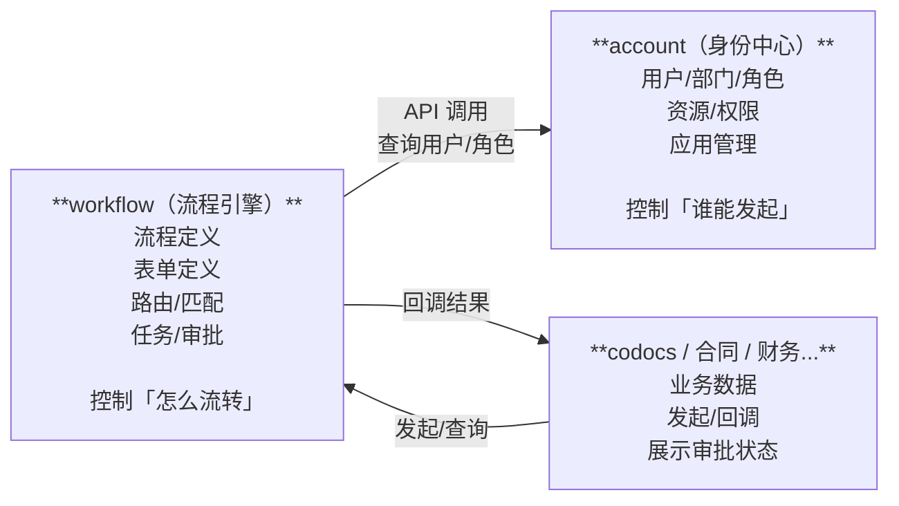
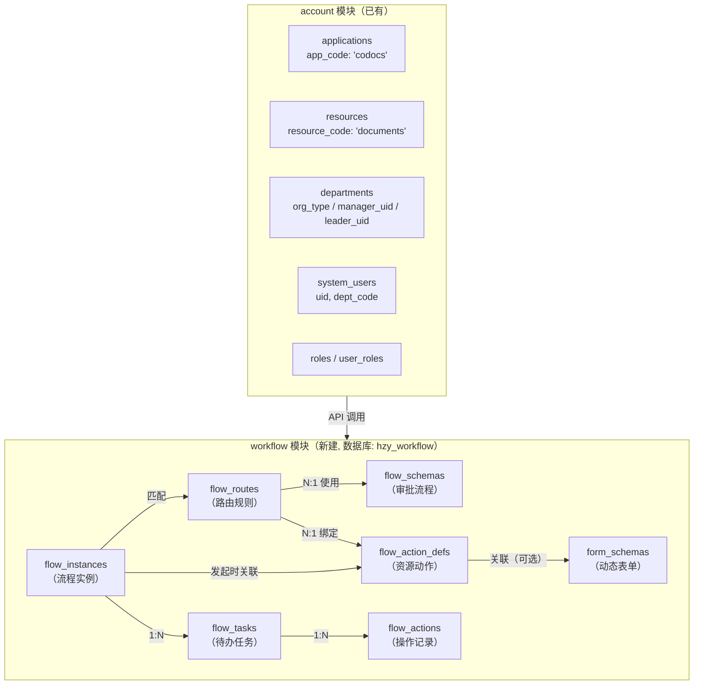
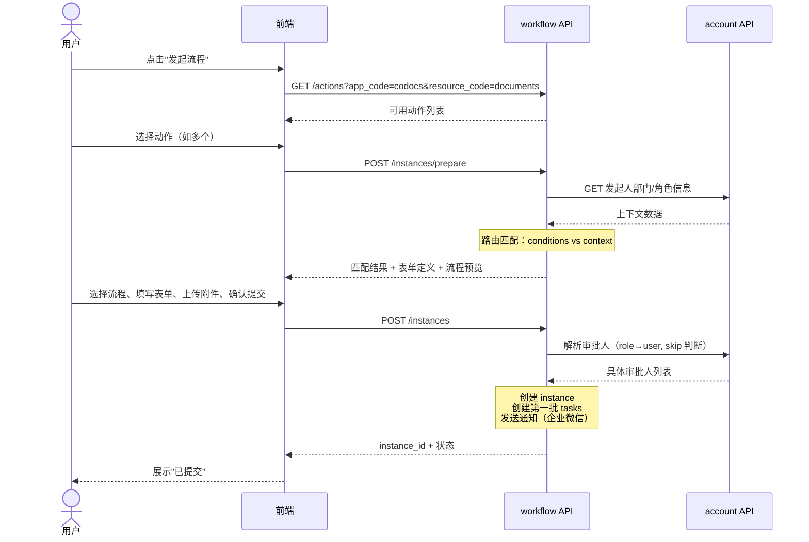
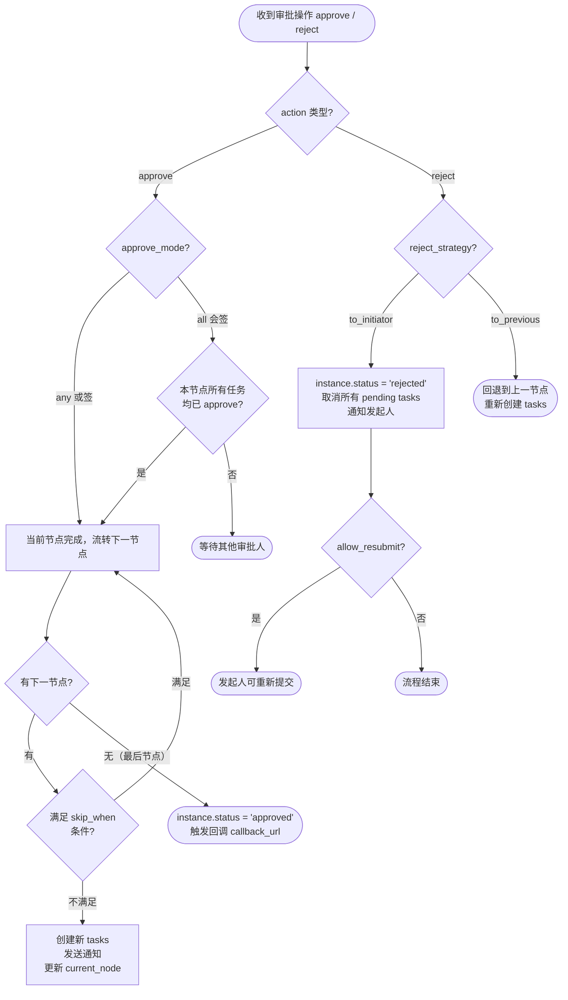

# Workflow 流程引擎模块 — 设计方案

> **版本：** v1.0
> **日期：** 2026-03-18
> **状态：** 设计中

***

## 一、概述

### 1.1 背景

汇智云各业务模块（codocs 文档管理、未来的合同管理、财务报销、人力资源等）都存在审批流程需求。当前 codocs 已有一套文档审阅系统（`review_flow_templates` + `document_reviews` + `review_actions`），但与文档业务紧耦合，无法复用。

### 1.2 目标

构建一个**业务无关的统一流程引擎**，作为独立模块为所有业务模块提供审批能力：

* **资源驱动**：与 account 模块的资源权限体系（`applications` → `resources` → `role_permissions`）对齐

* **表单动态化**：申请表单通过 JSON Schema 配置，前端统一渲染，无需为每种业务开发专用页面

* **流程可复用**：同一审批流程（如"三级审批"）可被不同业务的不同动作共享

* **条件路由**：根据发起人角色、部门类型、表单数据等上下文自动匹配最合适的流程

* **零代码接入**：新业务只需在管理端配置，无需编写代码

### 1.3 模块定位



***

## 二、技术架构

### 2.1 技术栈

| 项目       | 选型                               | 说明                       |
| ---------- | ---------------------------------- | -------------------------- |
| 框架       | Nuxt 4 + Nitro                     | 与其他模块保持一致         |
| 数据库     | MySQL 8.0+（`hzy_workflow`）       | 独立数据库                 |
| 端口       | 3020                               | 开发端口                   |
| 数据库工具 | `server/utils/db.ts`（连接池单例） | 与 codocs/account 相同模式 |
| 前端组件库 | Nuxt UI V4 + Tailwind CSS          | 与其他模块一致             |
| 附件策略   | 业务模块管理 OSS，workflow 仅存引用 | 不重复建设文件存储         |

### 2.2 模块目录结构

```
workflow/
├── app/
│   ├── components/
│   │   ├── flow/              # 流程相关组件
│   │   │   ├── FlowDesigner.vue     # 流程设计器（可视化编排节点）
│   │   │   ├── StartEndNode.vue     # 开始/结束节点组件
│   │   │   ├── ApprovalNode.vue     # 审批节点组件
│   │   │   ├── FlowTimeline.vue     # 审批时间线（审批进度展示）
│   │   │   └── FlowPreview.vue      # 流程预览
│   │   ├── FormPreview.vue          # 表单预览组件（根据字段 JSON 渲染表单效果）
│   │   ├── DeptTreeSelector.vue     # 部门树选择器
│   │   ├── UserMenu.vue             # 用户菜单
│   │   ├── AppLauncher.vue          # 应用启动器
│   │   └── task/              # 任务相关组件（规划中）
│   │       ├── TaskList.vue         # 待办/已办列表
│   │       └── TaskDetail.vue       # 任务详情（含审批操作）
│   ├── composables/
│   │   ├── useCas.ts              # CAS 认证（复用）
│   │   └── useWorkflow.ts         # 流程操作组合式函数
│   ├── layouts/
│   │   ├── default.vue
│   │   └── auth.vue
│   ├── middleware/
│   │   └── auth.ts
│   ├── pages/
│   │   ├── index.vue              # 工作台（我的待办/已办/发起）
│   │   ├── start/
│   │   │   └── [resource]/[action].vue  # 通用发起页面
│   │   ├── tasks/
│   │   │   ├── index.vue          # 待办列表
│   │   │   └── [id].vue           # 审批详情页
│   │   ├── instances/
│   │   │   ├── index.vue          # 我发起的
│   │   │   └── [id].vue           # 实例详情
│   │   └── admin/                 # 管理端
│   │       ├── flows.vue          # 流程定义管理
│   │       ├── forms.vue          # 表单定义管理
│   │       ├── actions.vue        # 资源动作管理
│   │       └── routes.vue         # 路由规则管理
│   └── types/
│       └── workflow.ts            # 类型定义
├── server/
│   ├── api/
│   │   └── v1/                    # 对外 API（供其他模块调用）
│   │       ├── actions/           # 资源动作
│   │       ├── instances/         # 流程实例
│   │       ├── tasks/             # 任务
│   │       ├── definitions/       # 流程定义（管理端）
│   │       ├── forms/             # 表单定义（管理端）
│   │       ├── routes/            # 路由规则（管理端）
│   │       └── callbacks/         # 回调相关
│   └── utils/
│       ├── dataRuntime.ts         # tenant-runtime 转发与运行时副作用
│       ├── db.ts                  # direct DB 防误用桩
│       ├── accountService.ts      # 调用 account API 的工具
│       ├── flowEngine.ts          # 流程引擎核心逻辑
│       ├── routeMatcher.ts        # 路由匹配逻辑
│       └── callbackService.ts     # 回调业务模块
├── docs/
│   └── workflow_schema.sql        # 数据库建表脚本
├── nuxt.config.ts
├── .env.dev
├── .env
└── package.json
```

### 2.3 环境变量

```bash
# tenant-runtime/data-runtime
HZY_TENANT_RUNTIME_URL=http://127.0.0.1:18080
HZY_WORKFLOW_DATA_ACCESS_MODE=tenant-runtime

# CAS SSO
CAS_ENABLE=true
CAS_BASE_URL=https://cas.wiztek.cn:8443
CAS_SERVICE_URL=

# Console OIDC / Directory
HZY_CONSOLE_URL=http://localhost:3000
HZY_CONSOLE_API_URL=http://localhost:3000

# Console service client grants 由 Console/Platform 管理。
# Workflow 不在本地 env 保存跨模块 client secret。

# 企业微信（审批通知）
WECOM_CORPID=
WECOM_CORPSECRET=
WECOM_AGENTID=
```

***

## 三、数据模型

### 3.1 ER 关系图



### 3.2 表结构设计

#### 3.2.1 `flow_schemas` — 审批流程定义

定义纯粹的审批流转结构（谁审批、怎么审批），**与业务完全无关**，可被多种业务复用。

| 字段          | 类型                      | 说明                                               |
| ------------- | ------------------------- | -------------------------------------------------- |
| `id`          | BIGINT PK AUTO\_INCREMENT | 主键                                               |
| `code`        | VARCHAR(50) UNIQUE        | 流程编码，如 `sequential_2level`、`committee_vote` |
| `name`        | VARCHAR(100)              | 显示名称，如"两级审批"、"委员会表决"               |
| `description` | VARCHAR(500)              | 流程说明                                           |
| `nodes`       | JSON                      | 审批节点数组（详见 3.3 节点定义）                  |
| `config`      | JSON                      | 流程级配置（详见 3.4 流程配置）                    |
| `version`     | INT DEFAULT 1             | 版本号（编辑后递增，已发起的实例使用快照）         |
| `status`      | TINYINT DEFAULT 1         | 1=启用 0=禁用                                      |
| `created_by`  | VARCHAR(50)               | 创建人 UID                                         |
| `created_at`  | DATETIME                  | 创建时间                                           |
| `updated_at`  | DATETIME                  | 更新时间                                           |

#### 3.2.2 `form_schemas` — 动态表单定义

定义申请人需要填写的表单字段，前端根据此定义动态渲染表单。

| 字段          | 类型                      | 说明                                  |
| ------------- | ------------------------- | ------------------------------------- |
| `id`          | BIGINT PK AUTO\_INCREMENT | 主键                                  |
| `code`        | VARCHAR(50) UNIQUE        | 表单编码，如 `document_publish_form`  |
| `name`        | VARCHAR(100)              | 表单名称                              |
| `description` | VARCHAR(500)              | 表单说明                              |
| `fields`      | JSON                      | 字段定义数组（详见 3.5 表单字段定义） |
| `version`     | INT DEFAULT 1             | 版本号                                |
| `status`      | TINYINT DEFAULT 1         | 1=启用 0=禁用                         |
| `created_by`  | VARCHAR(50)               | 创建人 UID                            |
| `created_at`  | DATETIME                  | 创建时间                              |
| `updated_at`  | DATETIME                  | 更新时间                              |

#### 3.2.3 `flow_action_defs` — 资源动作定义

定义每种资源可以发起哪些审批动作。通过 `app_code` 与 account 的 `applications` 表对齐，通过 `resource_code` 与 `resources` 表对齐。

| 字段             | 类型                      | 说明                                                              |
| ---------------- | ------------------------- | ----------------------------------------------------------------- |
| `id`             | BIGINT PK AUTO\_INCREMENT | 主键                                                              |
| `app_code`       | VARCHAR(50)               | 应用编码（对应 account.applications.app\_code），如 `codocs`      |
| `resource_code`  | VARCHAR(50)               | 资源编码（对应 account.resources.resource\_code），如 `documents` |
| `action_code`    | VARCHAR(50)               | 动作编码，如 `publish`、`archive`                                 |
| `name`           | VARCHAR(100)              | 动作名称，如"发文审批"、"归档审批"                                |
| `description`    | VARCHAR(500)              | 动作说明                                                          |
| `form_schema_id` | BIGINT NULL               | 关联的表单定义（NULL 表示无需额外表单）                           |
| `icon`           | VARCHAR(100)              | 图标名称（Nuxt UI 图标）                                          |
| `sort_order`     | INT DEFAULT 0             | 排序序号                                                          |
| `status`         | TINYINT DEFAULT 1         | 1=启用 0=禁用                                                     |
| `created_by`     | VARCHAR(50)               | 创建人 UID                                                        |
| `created_at`     | DATETIME                  | 创建时间                                                          |
| `updated_at`     | DATETIME                  | 更新时间                                                          |

**唯一约束**：`(app_code, resource_code, action_code)`

#### 3.2.4 `flow_routes` — 流程路由规则

将"资源:动作 + 上下文条件"映射到具体的审批流程。支持条件匹配和优先级排序。

| 字段             | 类型                      | 说明                               |
| ---------------- | ------------------------- | ---------------------------------- |
| `id`             | BIGINT PK AUTO\_INCREMENT | 主键                               |
| `action_def_id`  | BIGINT                    | 关联 `flow_action_defs.id`         |
| `flow_schema_id` | BIGINT                    | 匹配命中时使用的审批流程           |
| `name`           | VARCHAR(100)              | 规则名称，如"委员会发文走表决流程" |
| `description`    | VARCHAR(500)              | 规则说明                           |
| `conditions`     | JSON                      | 匹配条件（详见 3.6 路由条件定义）  |
| `priority`       | INT DEFAULT 0             | 优先级（数值越大越优先匹配）       |
| `is_default`     | TINYINT DEFAULT 0         | 是否为兜底规则（无条件匹配）       |
| `status`         | TINYINT DEFAULT 1         | 1=启用 0=禁用                      |
| `created_by`     | VARCHAR(50)               | 创建人 UID                         |
| `created_at`     | DATETIME                  | 创建时间                           |
| `updated_at`     | DATETIME                  | 更新时间                           |

#### 3.2.5 `flow_instances` — 流程实例

每次发起审批产生一条记录。

| 字段             | 类型                                                          | 说明                                                         |
| ---------------- | ------------------------------------------------------------- | ------------------------------------------------------------ |
| `id`             | BIGINT PK AUTO\_INCREMENT                                     | 主键                                                         |
| `instance_no`    | VARCHAR(30) UNIQUE                                            | 流程编号，如 `WF202603180001`（自动生成）                    |
| `action_def_id`  | BIGINT                                                        | 关联动作定义                                                 |
| `route_id`       | BIGINT                                                        | 实际匹配的路由规则                                           |
| `flow_schema_id` | BIGINT                                                        | 冗余：实际使用的流程定义                                     |
| `app_code`       | VARCHAR(50)                                                   | 冗余：应用编码                                               |
| `resource_code`  | VARCHAR(50)                                                   | 冗余：资源编码                                               |
| `action_code`    | VARCHAR(50)                                                   | 冗余：动作编码                                               |
| `biz_id`         | VARCHAR(100)                                                  | 业务主键（如 document UUID、contract ID）                    |
| `biz_title`      | VARCHAR(255)                                                  | 冗余：业务标题（如"《XX制度》发文审批"）                     |
| `biz_url`        | VARCHAR(500)                                                  | 业务详情页 URL（审批人可点击查看原始业务数据）               |
| `biz_context`    | JSON                                                          | 发起时的上下文快照（部门信息、角色等，用于路由和审批人解析） |
| `form_data`      | JSON                                                          | 申请人填写的表单数据                                         |
| `attachments`    | JSON                                                          | 附件列表（详见 3.7 附件结构）                                |
| `initiator_uid`  | VARCHAR(50)                                                   | 发起人 UID                                                   |
| `status`         | ENUM('running','approved','rejected','cancelled','suspended') | 流程状态                                                     |
| `current_node`   | INT DEFAULT 0                                                 | 当前审批节点序号                                             |
| `flow_snapshot`  | JSON                                                          | 发起时的完整流程快照（含解析后的具体审批人）                 |
| `callback_url`   | VARCHAR(500)                                                  | 流程结束时回调业务模块的 URL                                 |
| `completed_at`   | DATETIME NULL                                                 | 流程完成时间                                                 |
| `created_at`     | DATETIME                                                      | 创建时间                                                     |
| `updated_at`     | DATETIME                                                      | 更新时间                                                     |

**索引**：

* `idx_initiator_status (initiator_uid, status)`

* `idx_resource_action (resource_code, action_code)`

* `idx_biz (resource_code, biz_id)`

* `idx_status_created (status, created_at)`

#### 3.2.6 `flow_tasks` — 待办任务

每个审批节点为每个审批人生成一条任务。

| 字段           | 类型                                              | 说明                                           |
| -------------- | ------------------------------------------------- | ---------------------------------------------- |
| `id`           | BIGINT PK AUTO\_INCREMENT                         | 主键                                           |
| `instance_id`  | BIGINT                                            | 关联流程实例                                   |
| `node_index`   | INT                                               | 节点序号（对应 flow\_snapshot.nodes 数组下标） |
| `node_name`    | VARCHAR(100)                                      | 冗余：节点名称                                 |
| `assignee_uid` | VARCHAR(50)                                       | 办理人 UID                                     |
| `task_type`    | ENUM('approve','cc','countersign')                | 任务类型：审批/抄送/会签                       |
| `status`       | ENUM('pending','completed','skipped','cancelled') | 任务状态                                       |
| `due_at`       | DATETIME NULL                                     | 截止时间（可选，用于催办和超时处理）           |
| `completed_at` | DATETIME NULL                                     | 完成时间                                       |
| `created_at`   | DATETIME                                          | 创建时间                                       |
| `updated_at`   | DATETIME                                          | 更新时间                                       |

**索引**：

* `idx_assignee_status (assignee_uid, status)` — 查询"我的待办"核心索引

* `idx_instance_node (instance_id, node_index)`

* `idx_status_created (status, created_at)`

#### 3.2.7 `flow_actions` — 操作记录

审批日志，记录每一次审批操作，形成完整审计链。

| 字段          | 类型                                                               | 说明                           |
| ------------- | ------------------------------------------------------------------ | ------------------------------ |
| `id`          | BIGINT PK AUTO\_INCREMENT                                          | 主键                           |
| `instance_id` | BIGINT                                                             | 关联流程实例（冗余，方便查询） |
| `task_id`     | BIGINT NULL                                                        | 关联任务（resubmit/cancel 等实例级操作可为空） |
| `actor_uid`   | VARCHAR(50)                                                        | 操作人 UID                     |
| `action`      | ENUM('approve','reject','delegate','withdraw','remind','resubmit') | 操作类型                       |
| `comment`     | TEXT NULL                                                          | 审批意见                       |
| `attachments` | JSON NULL                                                          | 审批时追加的附件               |
| `created_at`  | DATETIME                                                           | 操作时间                       |

**索引**：

* `idx_instance (instance_id, created_at)`

* `idx_actor (actor_uid, created_at)`

### 3.3 节点定义（`flow_schemas.nodes` JSON 结构）

```json
[
  {
    "name": "直属上级审批",
    "type": "approve",
    "approve_mode": "any",
    "assignees": [
      { "type": "initiator_leader" }
    ]
  },
  {
    "name": "部门负责人审批",
    "type": "approve",
    "approve_mode": "any",
    "assignees": [
      { "type": "role", "code": "dept_manager", "scope": "initiator_dept" }
    ],
    "skip_when": { "initiator_role": "dept_manager" }
  },
  {
    "name": "分管领导审批",
    "type": "approve",
    "approve_mode": "any",
    "assignees": [
      { "type": "role", "code": "division_leader", "scope": "initiator_dept" }
    ],
    "skip_when": { "initiator_role": "division_leader" }
  },
  {
    "name": "抄送相关人员",
    "type": "cc",
    "assignees": [
      { "type": "user", "uid": "zhangsan" },
      { "type": "initiator" }
    ]
  }
]
```

#### 节点字段说明

| 字段            | 类型   | 必填 | 说明                                                     |
| --------------- | ------ | ---- | -------------------------------------------------------- |
| `name`          | string | 是   | 节点名称                                                 |
| `type`          | enum   | 是   | `approve`=审批, `cc`=抄送, `countersign`=会签            |
| `approve_mode`  | enum   | 否   | `any`=或签（一人通过即可）, `all`=会签（全部通过才通过） |
| `assignees`     | array  | 是   | 办理人列表（详见下方）                                   |
| `skip_when`     | object | 否   | 跳过条件（满足时自动跳过本节点）                         |
| `timeout_hours` | number | 否   | 超时小时数                                               |
| `auto_action`   | enum   | 否   | 超时后自动操作：`approve` 或 `reject`                    |

#### 审批人类型（`assignees[].type`）

| type               | 说明           | 附加字段        | 解析方式                                  |
| ------------------ | -------------- | --------------- | ----------------------------------------- |
| `user`             | 指定用户       | `uid`           | 直接使用                                  |
| `role`             | 按角色查找     | `code`, `scope` | 调用 account API 查询具有该角色的用户     |
| `dept_manager`     | 部门经理       | `scope`         | 从 account `departments.manager_uid` 获取 |
| `dept_leader`      | 分管领导       | `scope`         | 从 account `departments.leader_uid` 获取  |
| `initiator_leader` | 发起人直属上级 | —               | 查询发起人所在部门的 `manager_uid`        |
| `initiator`        | 发起人自己     | —               | 用于抄送场景                              |
| `form_field`       | 表单中指定的人 | `field_key`     | 从 `form_data` 中读取对应人员选择器的值   |

**`scope`** **取值**：

* `initiator_dept` — 发起人所在部门

* `resource_dept` — 资源所属部门（从 `biz_context` 获取）

* `specified` — 指定部门（附加 `dept_code` 字段）

### 3.4 流程配置（`flow_schemas.config` JSON 结构）

```json
{
  "allow_withdraw": true,
  "allow_delegate": true,
  "allow_add_sign": false,
  "allow_resubmit": true,
  "reject_strategy": "to_initiator",
  "notify_channels": ["wecom", "email"]
}
```

| 字段              | 类型    | 默认值         | 说明                                                            |
| ----------------- | ------- | -------------- | --------------------------------------------------------------- |
| `allow_withdraw`  | boolean | true           | 允许发起人撤回（仅在第一个节点未审批时）                        |
| `allow_delegate`  | boolean | true           | 允许审批人委托他人                                              |
| `allow_add_sign`  | boolean | false          | 允许审批人加签                                                  |
| `allow_resubmit`  | boolean | true           | 驳回后允许重新提交                                              |
| `reject_strategy` | enum    | `to_initiator` | 驳回策略：`to_initiator`=退回发起人, `to_previous`=退回上一节点 |
| `notify_channels` | array   | `["wecom"]`    | 通知渠道                                                        |

### 3.5 表单字段定义（`form_schemas.fields` JSON 结构）

```json
[
  {
    "key": "title",
    "label": "文档标题",
    "type": "text",
    "required": true,
    "readonly": true,
    "source": "biz",
    "placeholder": ""
  },
  {
    "key": "urgency",
    "label": "紧急程度",
    "type": "select",
    "required": true,
    "default_value": "normal",
    "options": [
      { "label": "普通", "value": "normal" },
      { "label": "紧急", "value": "urgent" },
      { "label": "特急", "value": "critical" }
    ]
  },
  {
    "key": "target_category",
    "label": "归档栏目",
    "type": "select",
    "required": true,
    "options": [
      { "label": "公司制度", "value": "company" },
      { "label": "部门文档", "value": "department" },
      { "label": "产品文档", "value": "product" },
      { "label": "知识库", "value": "knowledge" }
    ]
  },
  {
    "key": "reason",
    "label": "申请说明",
    "type": "textarea",
    "required": true,
    "max_length": 500
  },
  {
    "key": "amount",
    "label": "金额（元）",
    "type": "number",
    "required": false,
    "min": 0,
    "visible_when": { "field": "resource_code", "in": ["expenses", "contracts"] }
  },
  {
    "key": "cc_users",
    "label": "抄送人员",
    "type": "user_picker",
    "required": false,
    "multiple": true
  },
  {
    "key": "expected_date",
    "label": "期望完成日期",
    "type": "date",
    "required": false
  }
]
```

#### 支持的字段类型

| type          | 渲染组件              | 适用场景           | 特有属性                |
| ------------- | --------------------- | ------------------ | ----------------------- |
| `text`        | UInput                | 标题、编号         | `max_length`            |
| `textarea`    | UTextarea             | 申请说明、备注     | `max_length`, `rows`    |
| `number`      | UInput\[type=number]  | 金额、数量         | `min`, `max`, `step`    |
| `select`      | USelect               | 紧急程度、分类     | `options`, `multiple`   |
| `date`        | UPopover + DatePicker | 日期               | `min_date`, `max_date`  |
| `user_picker` | 自定义人员选择器      | 抄送人、指定审批人 | `multiple`, `max_count` |
| `dept_picker` | 自定义部门选择器      | 归属部门           | `multiple`              |
| `file`        | 文件上传组件          | 合同扫描件等       | `max_count`, `accept`   |
| `rich_text`   | Milkdown/TipTap       | 详细描述           | —                       |

#### 字段通用属性

| 属性            | 类型    | 说明                                      |
| --------------- | ------- | ----------------------------------------- |
| `key`           | string  | 字段标识（存入 `form_data` 的 key）       |
| `label`         | string  | 显示标签                                  |
| `type`          | string  | 字段类型                                  |
| `required`      | boolean | 是否必填                                  |
| `readonly`      | boolean | 是否只读（通常配合 `source: "biz"` 使用） |
| `source`        | string  | 数据来源：`"biz"` 表示从业务模块预填      |
| `default_value` | any     | 默认值                                    |
| `placeholder`   | string  | 占位文本                                  |
| `visible_when`  | object  | 条件显示                                  |
| `help_text`     | string  | 帮助提示文本                              |

### 3.6 路由条件定义（`flow_routes.conditions` JSON 结构）

```json
// 示例1：委员会部门
{ "dept_org_type": "committee" }

// 示例2：金额条件
{ "form_data.amount": { "gte": 100000 } }

// 示例3：发起人角色
{ "initiator_role": "dept_manager" }

// 示例4：组合条件（AND）
{
  "dept_org_type": "department",
  "initiator_role": "project_manager"
}

// 示例5：兜底规则
{}
```

#### 支持的上下文变量

| 变量名               | 来源                            | 说明                                     |
| -------------------- | ------------------------------- | ---------------------------------------- |
| `dept_code`          | account API                     | 发起人所在部门编码                       |
| `dept_org_type`      | account `departments.org_type`  | 部门机构类型：`department` / `committee` |
| `dept_level`         | account `departments.level`     | 部门层级深度                             |
| `initiator_role`     | account `user_roles` + `roles`  | 发起人的角色编码                         |
| `initiator_position` | account `system_users.position` | 发起人职位                               |
| `resource_dept_code` | `biz_context`                   | 资源所属部门                             |
| `form_data.*`        | 申请表单                        | 表单字段值（如 `form_data.amount`）      |

#### 条件运算符

| 运算符   | 说明           | 示例                                                              |
| -------- | -------------- | ----------------------------------------------------------------- |
| 直接赋值 | 精确匹配       | `"dept_org_type": "committee"`                                    |
| `in`     | 包含在列表中   | `"initiator_role": { "in": ["dept_manager", "division_leader"] }` |
| `not_in` | 不在列表中     | `"initiator_role": { "not_in": ["intern"] }`                      |
| `gte`    | 大于等于       | `"form_data.amount": { "gte": 100000 }`                           |
| `lte`    | 小于等于       | `"form_data.amount": { "lte": 50000 }`                            |
| `exists` | 字段存在且非空 | `"form_data.contract_no": { "exists": true }`                     |

### 3.7 附件结构（`flow_instances.attachments` JSON 结构）

> **设计原则**：附件文件由业务模块（如 codocs）统一上传到 OSS 管理，workflow 仅存储引用元数据（文件名、路径、大小等），不负责文件的上传和存储。发起流程时，业务模块先完成附件上传，再将元数据传给 workflow。

```json
[
  {
    "id": "att_uuid_001",
    "name": "合同扫描件.pdf",
    "url": "https://codocs.wiztek.cn/api/files/att_uuid_001",
    "oss_path": "codocs/attachments/2026/03/18/att_uuid_001.pdf",
    "size": 1024000,
    "mime_type": "application/pdf",
    "uploaded_by": "zhangsan",
    "uploaded_at": "2026-03-18T10:00:00Z"
  },
  {
    "id": "att_uuid_002",
    "name": "补充说明.docx",
    "url": "https://codocs.wiztek.cn/api/files/att_uuid_002",
    "oss_path": "codocs/attachments/2026/03/18/att_uuid_002.docx",
    "size": 256000,
    "mime_type": "application/vnd.openxmlformats-officedocument.wordprocessingml.document",
    "uploaded_by": "zhangsan",
    "uploaded_at": "2026-03-18T10:01:00Z"
  }
]
```

附件字段说明：

| 字段 | 说明 |
|------|------|
| `id` | 附件唯一标识（由业务模块生成） |
| `name` | 原始文件名 |
| `url` | 附件访问地址（由业务模块提供，审批人通过此地址下载/预览） |
| `oss_path` | OSS 存储路径（冗余记录，方便追溯） |
| `size` | 文件大小（字节） |
| `mime_type` | MIME 类型 |
| `uploaded_by` | 上传人 UID |
| `uploaded_at` | 上传时间 |

***

## 四、API 设计

### 4.1 API 总览

所有 API 基础路径：`/api/v1`

认证方式与 account 模块一致：

* **模块间调用**：`Authorization: Bearer {api_key}:{api_secret}`

* **前端调用**：CAS Session Cookie

#### 业务调用接口

| 方法 | 路径                      | 说明                           | 调用方       |
| ---- | ------------------------- | ------------------------------ | ------------ |
| GET  | `/actions`                | 查询资源可用动作               | 业务模块前端 |
| POST | `/instances/prepare`      | 准备发起（匹配流程、返回表单） | 业务模块前端 |
| POST | `/instances`              | 正式发起流程                   | 业务模块前端 |
| GET  | `/instances/:id`          | 查询流程实例详情               | 业务模块前端 |
| POST | `/instances/:id/cancel`   | 撤回流程                       | 发起人       |
| GET  | `/instances/by-biz`       | 按业务主键查询实例             | 业务模块     |
| POST | `/tasks/:id/approve`      | 审批通过                       | 审批人       |
| POST | `/tasks/:id/reject`       | 驳回                           | 审批人       |
| POST | `/tasks/:id/delegate`     | 委托                           | 审批人       |
| GET  | `/tasks/pending`          | 我的待办                       | 前端         |
| GET  | `/tasks/done`             | 我的已办                       | 前端         |
| GET  | `/tasks/initiated`        | 我发起的                       | 前端         |
| POST | `/instances/:id/resubmit` | 驳回后重新提交                 | 发起人       |

#### 管理端接口

| 方法 | 路径                  | 说明                             |
| ---- | --------------------- | -------------------------------- |
| CRUD | `/admin/flow-schemas` | 流程定义管理                     |
| CRUD | `/admin/form-schemas` | 表单定义管理                     |
| CRUD | `/admin/action-defs`  | 资源动作管理                     |
| CRUD | `/admin/routes`       | 路由规则管理                     |
| GET  | `/admin/statistics`   | 流程统计（数量、耗时、通过率等） |

### 4.2 核心接口详细定义

#### 4.2.1 查询资源可用动作

**请求**

```
GET /api/v1/actions?app_code=codocs&resource_code=documents
```

**响应**

```json
{
  "code": 0,
  "data": [
    {
      "id": 1,
      "resource_code": "documents",
      "action_code": "publish",
      "name": "发文审批",
      "description": "文档对外发布审批流程",
      "icon": "i-heroicons-document-check"
    },
    {
      "id": 2,
      "resource_code": "documents",
      "action_code": "archive",
      "name": "归档审批",
      "description": "文档归档审批",
      "icon": "i-heroicons-archive-box"
    }
  ]
}
```

#### 4.2.2 准备发起流程

发起前的预处理：收集上下文、匹配流程路由、返回表单定义和流程预览。

**请求**

```
POST /api/v1/instances/prepare
```

```json
{
  "resource_code": "documents",
  "action_code": "publish",
  "biz_id": "doc-uuid-xxx",
  "biz_title": "《信息安全管理制度》",
  "biz_url": "https://codocs.wiztek.cn/documents/doc-uuid-xxx",
  "biz_context": {
    "dept_code": "tech",
    "doc_type": "company"
  }
}
```

**响应**

```json
{
  "code": 0,
  "data": {
    "action_def": {
      "id": 1,
      "name": "发文审批",
      "resource_code": "documents",
      "action_code": "publish"
    },
    "context": {
      "dept_code": "tech",
      "dept_name": "技术部",
      "dept_org_type": "department",
      "initiator_uid": "zhangsan",
      "initiator_name": "张三",
      "initiator_roles": ["project_manager"]
    },
    "matched_routes": [
      {
        "id": 5,
        "name": "技术部发文三级审批",
        "flow_schema": {
          "id": 1,
          "code": "sequential_3level",
          "name": "三级审批",
          "nodes_preview": ["直属上级审批", "部门负责人审批", "分管领导审批"]
        }
      }
    ],
    "form_schema": {
      "id": 1,
      "name": "发文申请表单",
      "fields": [
        { "key": "title", "label": "文档标题", "type": "text", "required": true, "readonly": true, "source": "biz" },
        { "key": "urgency", "label": "紧急程度", "type": "select", "required": true, "options": [...] },
        { "key": "reason", "label": "申请说明", "type": "textarea", "required": true }
      ]
    },
    "prefilled_data": {
      "title": "《信息安全管理制度》"
    }
  }
}
```

> 当 `matched_routes` 仅一条时前端自动选中；多条时展示给用户选择。

#### 4.2.3 正式发起流程

**请求**

```
POST /api/v1/instances
```

```json
{
  "action_def_id": 1,
  "route_id": 5,
  "biz_id": "doc-uuid-xxx",
  "biz_title": "《信息安全管理制度》发文审批",
  "biz_url": "https://codocs.wiztek.cn/documents/doc-uuid-xxx",
  "biz_context": {
    "dept_code": "tech",
    "dept_org_type": "department"
  },
  "form_data": {
    "title": "《信息安全管理制度》",
    "urgency": "normal",
    "reason": "公司信息安全管理制度定稿，申请发文"
  },
  "attachments": [
    {
      "id": "att_uuid_001",
      "name": "制度全文.pdf",
      "url": "https://codocs.wiztek.cn/api/files/att_uuid_001",
      "oss_path": "codocs/attachments/2026/03/18/att_uuid_001.pdf",
      "size": 1024000,
      "mime_type": "application/pdf"
    }
  ],
  "callback_url": "https://codocs.wiztek.cn/api/workflow/callback"
}
```

**响应**

```json
{
  "code": 0,
  "data": {
    "instance_id": 42,
    "instance_no": "WF202603180001",
    "status": "running",
    "current_node": 0,
    "flow_snapshot": {
      "nodes": [
        {
          "name": "直属上级审批",
          "type": "approve",
          "resolved_assignees": [
            { "uid": "lisi", "name": "李四", "position": "技术部经理" }
          ]
        },
        {
          "name": "分管领导审批",
          "type": "approve",
          "resolved_assignees": [
            { "uid": "wangwu", "name": "王五", "position": "技术总监" }
          ]
        }
      ]
    }
  }
}
```

#### 4.2.4 审批通过

**请求**

```
POST /api/v1/tasks/:id/approve
```

```json
{
  "comment": "同意发布",
  "attachments": []
}
```

**响应**

```json
{
  "code": 0,
  "data": {
    "task_id": 101,
    "instance_id": 42,
    "instance_status": "running",
    "next_node": {
      "name": "分管领导审批",
      "assignees": [{ "uid": "wangwu", "name": "王五" }]
    }
  }
}
```

> 若当前是最后一个节点且通过，`instance_status` 为 `"approved"`，同时触发回调。

#### 4.2.5 驳回

**请求**

```
POST /api/v1/tasks/:id/reject
```

```json
{
  "comment": "文档格式不规范，请修改后重新提交"
}
```

#### 4.2.6 查询我的待办

**请求**

```
GET /api/v1/tasks/pending?page=1&page_size=20
```

**响应**

```json
{
  "code": 0,
  "data": {
    "total": 3,
    "items": [
      {
        "task_id": 101,
        "instance_id": 42,
        "instance_no": "WF202603180001",
        "resource_code": "documents",
        "action_code": "publish",
        "action_name": "发文审批",
        "biz_title": "《信息安全管理制度》发文审批",
        "biz_url": "https://codocs.wiztek.cn/documents/doc-uuid-xxx",
        "initiator": { "uid": "zhangsan", "name": "张三" },
        "node_name": "部门负责人审批",
        "task_type": "approve",
        "created_at": "2026-03-18T10:00:00Z",
        "due_at": null
      }
    ]
  }
}
```

#### 4.2.7 按业务主键查询实例

供业务模块在自己的页面中展示审批状态。

**请求**

```
GET /api/v1/instances/by-biz?resource_code=documents&biz_id=doc-uuid-xxx
```

**响应**

```json
{
  "code": 0,
  "data": {
    "instance_id": 42,
    "instance_no": "WF202603180001",
    "status": "running",
    "current_node": 1,
    "initiator": { "uid": "zhangsan", "name": "张三" },
    "flow_snapshot": { "nodes": [...] },
    "actions": [
      {
        "node_index": 0,
        "node_name": "直属上级审批",
        "actor": { "uid": "lisi", "name": "李四" },
        "action": "approve",
        "comment": "同意发布",
        "created_at": "2026-03-18T11:00:00Z"
      }
    ]
  }
}
```

### 4.3 回调机制

流程到达终态（`approved` / `rejected`）时，workflow 向 `callback_url` 发送 POST 请求：

```json
{
  "event": "flow_completed",
  "instance_id": 42,
  "instance_no": "WF202603180001",
  "app_code": "codocs",
  "resource_code": "documents",
  "action_code": "publish",
  "biz_id": "doc-uuid-xxx",
  "status": "approved",
  "form_data": { "title": "《信息安全管理制度》", "urgency": "normal", "target_category": "company" },
  "completed_at": "2026-03-18T15:30:00Z",
  "initiator_uid": "zhangsan"
}
```

codocs 收到回调后执行相应的业务操作（如将文档状态改为"已发布"并归档到对应栏目）。

**回调安全**：Workflow 使用 Console OAuth2 `client_credentials` 换取短期 `token_use=service` JWT，并在回调中携带 `Authorization: Bearer <token>`。业务模块验证 Console JWKS、`aud=<业务appCode>`、`scope=workflow:callback`、`token_use=service` 与来源应用 `workflow`。

***

## 五、核心流程

### 5.1 发起审批完整流程



### 5.2 审批流转逻辑



### 5.3 路由匹配算法

```python
def match_routes(action_def_id, context):
    # 1. 查询该动作的所有启用路由，按 priority DESC 排序
    routes = query("SELECT * FROM flow_routes WHERE action_def_id=? AND status=1 ORDER BY priority DESC", action_def_id)

    matched = []
    for route in routes:
        if route.is_default:
            default_route = route
            continue
        if evaluate_conditions(route.conditions, context):
            matched.append(route)

    if matched:
        # 取最高优先级的所有匹配
        max_priority = matched[0].priority
        top_matches = [r for r in matched if r.priority == max_priority]
        return top_matches  # 1条→自动选中，多条→用户选择

    if default_route:
        return [default_route]

    raise Error("无匹配的审批流程")
```

***

## 六、通知机制

### 6.1 通知触发时机

| 事件                   | 通知对象         | 内容                                    |
| ---------------------- | ---------------- | --------------------------------------- |
| 流程发起               | 第一个节点审批人 | "张三提交了《XX》发文审批，请审批"      |
| 审批通过（非最后节点） | 下一节点审批人   | "《XX》发文审批已通过XX审批，请您审批"  |
| 审批通过（最后节点）   | 发起人           | "您的《XX》发文审批已全部通过"          |
| 审批驳回               | 发起人           | "您的《XX》发文审批被XX驳回，原因：..." |
| 流程撤回               | 当前节点审批人   | "张三已撤回《XX》发文审批"              |
| 催办                   | 当前节点审批人   | "张三催办：《XX》发文审批待您审批"      |
| 委托                   | 被委托人         | "XX将《XX》审批委托给您处理"            |
| 即将超时               | 当前节点审批人   | "《XX》发文审批将在X小时后超时"         |

### 6.2 通知渠道

* **企业微信**（主要）：通过 account 模块的 `/api/v1/wecom/send` 接口发送

* **站内消息**：写入 workflow 自身的通知表（未来扩展）

* **邮件**：通过 account 模块的邮件服务发送（未来扩展）

***

## 七、与 codocs 集成方案

### 7.1 codocs 侧改动

#### 发起审批（替代现有 `POST /api/reviews`）

```typescript
// codocs/app/composables/useDocumentWorkflow.ts
export function useDocumentWorkflow() {
  const workflowApi = useWorkflowApi() // 调用 workflow 模块 API

  async function startPublishReview(documentUuid: string) {
    // 1. 获取文档信息
    const doc = await $fetch(`/api/documents/${documentUuid}`)

    // 2. 调用 workflow prepare
    const prepared = await workflowApi.prepare({
      app_code: 'codocs',
      resource_code: 'documents',
      action_code: 'publish',
      biz_id: documentUuid,
      biz_title: doc.title,
      biz_url: `/documents/${documentUuid}`,
      biz_context: { dept_code: doc.dept_code }
    })

    return prepared // 交给页面展示表单和流程预览
  }

  async function submitReview(params: SubmitParams) {
    // 3. 正式发起
    return workflowApi.createInstance({
      ...params,
      callback_url: '/api/workflow/callback'
    })
  }

  return { startPublishReview, submitReview }
}
```

#### 接收回调（新增接口）

```typescript
// codocs/server/api/workflow/callback.post.ts
export default defineEventHandler(async (event) => {
  const body = await readBody(event)
  // 验证 HMAC 签名...

  if (body.status === 'approved' && body.action_code === 'publish') {
    // 更新文档状态为已发布
    await execute(
      'UPDATE documents SET status = 2, publish_info = ? WHERE uuid = ?',
      [`已发布-${body.form_data.target_category}`, body.biz_id]
    )
    // 执行归档逻辑...
  }

  if (body.status === 'rejected') {
    // 更新文档审阅状态...
  }

  return { code: 0, message: 'ok' }
})
```

### 7.2 迁移策略

| 阶段         | 内容                                                                                             | 影响                  |
| ------------ | ------------------------------------------------------------------------------------------------ | --------------------- |
| **第一阶段** | workflow 模块上线，codocs 新建审阅走 workflow API                                                | 现有审阅不受影响      |
| **第二阶段** | `review_flow_templates` 数据迁移到 workflow `flow_schemas` + `flow_action_defs` + `flow_routes`  | 管理端切换到 workflow |
| **第三阶段** | 历史 `document_reviews` 数据迁移到 `flow_instances`                                              | 统一查询入口          |
| **最终**     | codocs 移除 `review_flow_templates`、`review_actions` 表，保留 `document_reviews` 做轻量业务记录 | 完全解耦              |

***

## 八、前端页面设计

### 8.1 页面清单

workflow 模块提供以下通用页面（其他模块通过链接跳转或 iframe 嵌入）：

| 页面     | 路径                       | 说明                                         |
| -------- | -------------------------- | -------------------------------------------- |
| 工作台   | `/`                        | 待办数量概览、快捷入口                       |
| 发起申请 | `/start/:resource/:action` | 通用发起页（动态表单 + 流程预览 + 附件） |
| 审批详情 | `/tasks/:id`               | 查看申请信息 + 审批时间线 + 操作按钮         |
| 我的待办 | `/tasks`                   | 待办任务列表                                 |
| 我发起的 | `/instances`               | 我发起的流程列表                             |
| 流程管理 | `/admin/flows`             | 流程定义 CRUD + 可视化/JSON 双模式编辑       |
| 表单管理 | `/admin/forms`             | 表单定义 CRUD + JSON/预览双模式 + 独立预览弹窗 |
| 动作管理 | `/admin/actions`           | 资源动作 CRUD                                |
| 路由管理 | `/admin/routes`            | 路由规则 CRUD                                |

### 8.2 通用发起页面

```
┌─────────────────────────────────────────────────┐
│  发文审批                                        │
│  ─────────────────────────────────────────────── │
│                                                  │
│  ┌─ 申请信息 ──────────────────────────────────┐ │
│  │                                              │ │
│  │  文档标题:  《信息安全管理制度》  [只读]        │ │
│  │                                              │ │
│  │  紧急程度:  [普通 ▼]                          │ │
│  │                                              │ │
│  │  归档栏目:  [公司制度 ▼]                      │ │
│  │                                              │ │
│  │  申请说明:  [________________________]        │ │
│  │            [________________________]        │ │
│  │                                              │ │
│  │  附件:     [+ 上传附件]                       │ │
│  │            📎 制度全文.pdf (1MB)  [×]         │ │
│  │                                              │ │
│  └──────────────────────────────────────────────┘ │
│                                                  │
│  ┌─ 审批流程预览 ──────────────────────────────┐ │
│  │                                              │ │
│  │  ● 发起人     ──▶  ● 部门经理(李四)          │ │
│  │               ──▶  ● 分管领导(王五)          │ │
│  │               ──▶  ○ 完成                    │ │
│  │                                              │ │
│  └──────────────────────────────────────────────┘ │
│                                                  │
│                              [取消]  [提交申请]   │
└─────────────────────────────────────────────────┘
```

### 8.3 审批详情页面

```
┌─────────────────────────────────────────────────┐
│  WF202603180001 · 发文审批                       │
│  ─────────────────────────────────────────────── │
│                                                  │
│  ┌─ 申请信息 ──────────────────────────────────┐ │
│  │  发起人: 张三 (技术部)                        │ │
│  │  发起时间: 2026-03-18 10:00                   │ │
│  │  文档标题: 《信息安全管理制度》  [查看文档 ↗]   │ │
│  │  紧急程度: 普通                               │ │
│  │  申请说明: 公司信息安全管理制度定稿...           │ │
│  │  附件: 📎 制度全文.pdf [下载]                  │ │
│  └──────────────────────────────────────────────┘ │
│                                                  │
│  ┌─ 审批进度 ──────────────────────────────────┐ │
│  │                                              │ │
│  │  ✅ 张三 发起申请                             │ │
│  │     2026-03-18 10:00                         │ │
│  │     │                                        │ │
│  │  ✅ 李四 (部门经理) 审批通过                   │ │
│  │     2026-03-18 11:30                         │ │
│  │     "同意发布"                                │ │
│  │     │                                        │ │
│  │  🔵 王五 (分管领导) 待审批  ← 当前节点         │ │
│  │                                              │ │
│  └──────────────────────────────────────────────┘ │
│                                                  │
│  ┌─ 审批操作 ──────────────────────────────────┐ │
│  │                                              │ │
│  │  审批意见: [________________________]        │ │
│  │                                              │ │
│  │  附件:    [+ 添加附件]                        │ │
│  │                                              │ │
│  │           [驳回]           [通过]             │ │
│  └──────────────────────────────────────────────┘ │
└─────────────────────────────────────────────────┘
```

***

## 九、配置示例

### 9.1 codocs 文档发文 — 完整配置

#### 流程定义

```json
// flow_schemas: 三级审批
{
  "code": "sequential_3level",
  "name": "三级审批",
  "nodes": [
    {
      "name": "直属上级审批",
      "type": "approve",
      "approve_mode": "any",
      "assignees": [{ "type": "initiator_leader" }],
      "skip_when": { "initiator_role": { "in": ["dept_manager", "division_leader"] } }
    },
    {
      "name": "部门负责人审批",
      "type": "approve",
      "approve_mode": "any",
      "assignees": [{ "type": "dept_manager", "scope": "initiator_dept" }],
      "skip_when": { "initiator_role": "dept_manager" }
    },
    {
      "name": "分管领导审批",
      "type": "approve",
      "approve_mode": "any",
      "assignees": [{ "type": "dept_leader", "scope": "initiator_dept" }]
    }
  ],
  "config": {
    "allow_withdraw": true,
    "allow_resubmit": true,
    "reject_strategy": "to_initiator",
    "notify_channels": ["wecom"]
  }
}
```

```json
// flow_schemas: 委员会表决
{
  "code": "committee_vote",
  "name": "委员会表决",
  "nodes": [
    {
      "name": "委员会成员表决",
      "type": "countersign",
      "approve_mode": "all",
      "assignees": [{ "type": "role", "code": "committee_member", "scope": "resource_dept" }]
    },
    {
      "name": "委员会主任确认",
      "type": "approve",
      "approve_mode": "any",
      "assignees": [{ "type": "dept_manager", "scope": "resource_dept" }]
    }
  ],
  "config": {
    "allow_withdraw": false,
    "reject_strategy": "to_initiator",
    "notify_channels": ["wecom", "email"]
  }
}
```

#### 表单定义

```json
// form_schemas: 发文申请表单
{
  "code": "document_publish_form",
  "name": "发文申请表单",
  "fields": [
    { "key": "title", "label": "文档标题", "type": "text", "required": true, "readonly": true, "source": "biz" },
    { "key": "urgency", "label": "紧急程度", "type": "select", "required": true, "default_value": "normal",
      "options": [
        { "label": "普通", "value": "normal" },
        { "label": "紧急", "value": "urgent" },
        { "label": "特急", "value": "critical" }
      ]
    },
    { "key": "target_category", "label": "归档栏目", "type": "select", "required": true,
      "options": [
        { "label": "公司制度", "value": "company" },
        { "label": "部门文档", "value": "department" },
        { "label": "产品文档", "value": "product" },
        { "label": "知识库", "value": "knowledge" }
      ]
    },
    { "key": "reason", "label": "申请说明", "type": "textarea", "required": true, "max_length": 500 }
  ]
}
```

#### 动作定义

```json
// flow_action_defs
{
  "app_code": "codocs",
  "resource_code": "documents",
  "action_code": "publish",
  "name": "发文审批",
  "form_schema_id": 1,
  "icon": "i-heroicons-document-check"
}
```

#### 路由规则

```json
// flow_routes 规则1: 委员会部门走表决流程（优先级高）
{
  "action_def_id": 1,
  "flow_schema_id": 2,
  "name": "委员会发文走表决流程",
  "conditions": { "dept_org_type": "committee" },
  "priority": 100,
  "is_default": false
}

// flow_routes 规则2: 默认走三级审批（兜底）
{
  "action_def_id": 1,
  "flow_schema_id": 1,
  "name": "默认三级审批",
  "conditions": {},
  "priority": 0,
  "is_default": true
}
```

### 9.2 未来扩展示例 — 合同审批（零代码接入）

只需在 workflow 管理端添加以下配置：

```
1. form_schemas: 合同审批表单
   fields: [合同名称(text,biz), 合同金额(number), 甲方(text), 合同类型(select), 说明(textarea)]

2. flow_action_defs:
   app_code: contracts, resource_code: contracts, action_code: approval, name: "合同审批", form_schema_id: 新表单ID

3. flow_routes:
   - 金额>=10万: flow_schema = sequential_3level (复用!), priority=100
   - 金额<10万:  flow_schema = sequential_2level (复用!), priority=50, is_default=true
```

在 account 中注册 `contracts` 资源和权限后，合同模块即可调用 workflow API 发起审批。

***

## 十、实施计划

### 第一阶段：核心引擎（预计 2 周）

* [x] 搭建 workflow 模块脚手架（Nuxt 4 项目结构）

* [x] 创建数据库 `hzy_workflow` 及全部表结构

* [ ] 实现核心 API：发起、审批、驳回、撤回、查询

* [ ] 实现流程引擎：节点流转、skip\_when、审批人解析

* [ ] 实现路由匹配引擎

* [ ] 实现回调机制

### 第二阶段：前端页面（预计 2 周）

* [ ] 动态表单渲染器（DynamicForm 组件）

* [ ] 通用发起页面

* [ ] 审批详情页面（含时间线）

* [ ] 待办/已办/我发起的列表页面

* [ ] 附件展示组件（读取业务模块提供的附件元数据和 URL）

### 第三阶段：管理端 + 集成（预计 1 周）

* [x] 流程定义管理页面（含可视化/JSON 双模式编辑、流程编码可编辑）

* [x] 表单定义管理页面（含 JSON/预览双模式、独立预览弹窗、FormPreview 组件）

* [x] 动作 + 路由规则管理页面

* [ ] codocs 集成（替代现有审阅流程）

* [ ] 企业微信通知对接

### 第四阶段：迁移 + 优化（预计 1 周）

* [ ] codocs 历史审阅数据迁移

* [ ] 移除 codocs 冗余的审阅表

* [ ] 性能优化（待办查询索引、缓存）

* [ ] 流程统计报表
